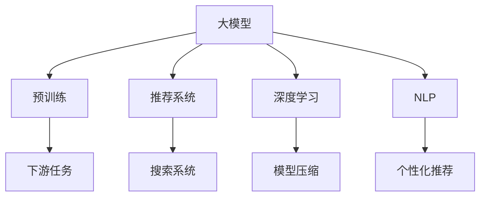

                 

# AI大模型在搜索推荐系统中的应用原理

> 关键词：AI大模型,搜索推荐系统,深度学习,神经网络,预训练模型,自然语言处理(NLP),推荐算法,搜索引擎,个性化推荐

## 1. 背景介绍

随着互联网和数字技术的发展，搜索引擎和推荐系统已成为人们获取信息、娱乐、购物等日常生活的重要工具。传统的基于规则和人工特征的搜索引擎和推荐系统已经无法满足用户日益增长的高效、个性化需求。深度学习技术的兴起，尤其是基于大模型的推荐系统，因其能够充分利用海量数据，挖掘出用户隐式偏好，并不断优化推荐内容，得到了广泛应用。

当前，大模型如BERT、GPT-3、DALL·E等在推荐系统中的应用，已成为人工智能领域的研究热点。通过在搜索引擎和推荐系统中集成大模型，能够显著提升系统的精准度和用户体验，使得搜索结果和推荐内容更加贴近用户需求。

## 2. 核心概念与联系

### 2.1 核心概念概述

在介绍大模型在搜索推荐系统中的应用原理之前，首先需要了解一些核心概念：

- 大模型(Large Model)：指具有数十亿甚至百亿参数的大型神经网络模型，如BERT、GPT-3等。大模型通过在大规模语料库上预训练，能够学习到丰富的语言知识和特征。

- 预训练(Pre-training)：指在大规模无标签语料上，通过自监督学习任务训练模型的过程。预训练可以使得模型学习到通用的语言表示，便于应用于各种下游任务。

- 推荐系统(Recommendation System)：指利用用户历史行为数据，为用户推荐感兴趣物品的系统。传统推荐系统依赖人工设计的特征，难以适应用户多样化的需求。

- 搜索引擎(Search Engine)：指通过爬虫采集网页信息，并根据用户查询返回相关搜索结果的系统。传统搜索引擎依赖关键词匹配技术，难以理解查询的语义。

- 深度学习(Deep Learning)：指利用多层次的神经网络，通过反向传播算法学习复杂特征的机器学习技术。深度学习已成为AI大模型的基础。

- 自然语言处理(Natural Language Processing, NLP)：指利用计算机技术，让机器理解、处理、生成人类自然语言的能力。NLP是大模型在推荐系统中的核心应用领域之一。

- 个性化推荐(Personalized Recommendation)：指根据用户个性化需求，为用户推荐相关物品。与传统的基于群体的推荐不同，个性化推荐需要更精细的用户画像和更准确的推荐模型。

- 模型压缩和加速(Compression and Acceleration)：指在大模型基础上，通过剪枝、量化、蒸馏等技术，减小模型规模，提高计算效率，使得大模型能够更快地在实际应用中落地。

这些概念之间的联系可以通过以下Mermaid流程图来展示：



该流程图展示了大模型在搜索推荐系统中的核心应用路径：

1. 大模型通过预训练获得通用语言表示。
2. 预训练模型在搜索引擎和推荐系统中的应用，进行自然语言理解和处理。
3. 模型压缩和加速技术，使得大模型在实际应用中高效运行。
4. 通过深度学习技术，构建个性化的推荐模型。
5. 通过NLP技术，提升搜索系统的语义理解能力。

## 3. 核心算法原理 & 具体操作步骤

### 3.1 算法原理概述

基于大模型的推荐系统，其核心原理可以概括为：通过在大规模语料库上预训练的通用大模型，结合用户个性化需求，构建推荐模型，实现精准高效的个性化推荐。

具体而言，预训练模型在大规模无标签语料上学习到丰富的语言知识，用于提取用户输入的自然语言查询中的语义信息。模型通过自监督学习任务训练，能够对自然语言查询进行有效的理解和处理。在推荐系统中，预训练模型通过微调或迁移学习，将学习到的知识应用于推荐任务，实现个性化推荐。

### 3.2 算法步骤详解

基于大模型的推荐系统，其操作步骤大致包括以下几个关键步骤：

**Step 1: 准备预训练模型和数据集**

1. 选择适当的预训练模型，如BERT、GPT-3等，作为初始化参数。
2. 收集用户的点击、浏览、评分等行为数据，构建训练集和验证集。
3. 对原始文本数据进行预处理，包括分词、去除停用词、标准化等操作。

**Step 2: 添加推荐适配层**

1. 根据推荐任务的特点，设计合适的输出层和损失函数。
2. 对于评分预测任务，通常使用线性回归损失函数。
3. 对于排序推荐任务，使用交叉熵损失函数。

**Step 3: 设置微调超参数**

1. 选择合适的优化算法及其参数，如AdamW、SGD等，设置学习率、批大小、迭代轮数等。
2. 设置正则化技术及强度，包括权重衰减、Dropout、Early Stopping等。
3. 确定冻结预训练参数的策略，如仅微调顶层，或全部参数都参与微调。

**Step 4: 执行梯度训练**

1. 将训练集数据分批次输入模型，前向传播计算损失函数。
2. 反向传播计算参数梯度，根据设定的优化算法和学习率更新模型参数。
3. 周期性在验证集上评估模型性能，根据性能指标决定是否触发Early Stopping。
4. 重复上述步骤直到满足预设的迭代轮数或Early Stopping条件。

**Step 5: 测试和部署**

1. 在测试集上评估微调后模型，对比微调前后的推荐效果。
2. 使用微调后的模型对新样本进行推荐，集成到实际的应用系统中。
3. 持续收集新的用户行为数据，定期重新微调模型，以适应数据分布的变化。

### 3.3 算法优缺点

基于大模型的推荐系统具有以下优点：

1. 通用性强。预训练模型可以用于多种推荐任务，包括商品推荐、内容推荐等，具有较高的泛化能力。
2. 个性化推荐能力强。通过微调，模型能够针对不同用户学习到个性化需求，提升推荐效果。
3. 系统可扩展性好。预训练模型可以不断融入新的数据和任务，快速适应数据分布的变化。

同时，该方法也存在一定的局限性：

1. 计算资源需求高。大模型的训练和推理需要强大的计算资源，可能会导致资源成本较高。
2. 数据隐私问题。在收集和处理用户数据时，需要严格遵守数据隐私保护法规，确保用户数据的安全。
3. 模型复杂度高。大模型的参数量巨大，模型压缩和加速技术需要不断优化以提高效率。
4. 用户行为多样性。用户行为具有多样性，模型难以完全覆盖用户的所有需求，可能导致推荐偏差。

### 3.4 算法应用领域

基于大模型的推荐系统已经在电商、新闻、音乐、视频等多个领域得到了广泛应用，具体应用领域包括：

- 商品推荐：如Amazon、淘宝等电商平台，利用用户行为数据，推荐相关商品。
- 内容推荐：如今日头条、抖音等，根据用户兴趣，推荐相关内容。
- 视频推荐：如YouTube、Bilibili等，根据用户观看历史，推荐相关视频。
- 广告推荐：如Google Ads、Facebook Ads等，通过精准的定向广告推荐，提升广告效果。
- 游戏推荐：如Steam、TapTap等，根据用户游戏偏好，推荐相关游戏。
- 个性化推荐引擎：如Netflix、Spotify等，通过用户行为数据，实现高度个性化的推荐。

除了这些经典应用场景外，大模型推荐系统还不断拓展到更多领域，如智能音箱、智能电视、智能家居等，为人们提供更加智能、高效的服务体验。

## 4. 数学模型和公式 & 详细讲解 & 举例说明

### 4.1 数学模型构建

基于大模型的推荐系统可以构建如下数学模型：

1. **预训练模型**：假设预训练模型为 $M_{\theta}$，其中 $\theta$ 为模型参数。
2. **推荐任务**：假设推荐任务为 $T$，用户行为数据集为 $D=\{(x_i,y_i)\}_{i=1}^N$，其中 $x_i$ 为输入特征，$y_i$ 为推荐结果。
3. **输出层**：假设模型输出层的类型为 $f_{out}(x)=W_{out}x+b_{out}$，其中 $W_{out}$ 和 $b_{out}$ 为输出层的权重和偏置。
4. **损失函数**：假设推荐任务为评分预测任务，则推荐模型的损失函数为：
   $$
   \mathcal{L}(\theta) = \frac{1}{N}\sum_{i=1}^N \left\| W_{out}x_i+b_{out}-y_i \right\|_2^2
   $$
   其中 $\| \cdot \|_2$ 为L2范数。

### 4.2 公式推导过程

对于评分预测任务，基于大模型的推荐系统可以表示为：

$$
\begin{aligned}
&f_{out}(x) = W_{out}M_{\theta}(x)+b_{out} \\
&\hat{y} = f_{out}(x) \\
&\mathcal{L}(\theta) = \frac{1}{N}\sum_{i=1}^N \left\| W_{out}M_{\theta}(x_i)+b_{out}-y_i \right\|_2^2
\end{aligned}
$$

其中 $M_{\theta}(x)$ 为预训练模型的前向传播输出，$f_{out}$ 为输出层函数，$y_i$ 为真实推荐结果，$\hat{y}$ 为模型预测的推荐结果。

### 4.3 案例分析与讲解

以下是一个简单的评分预测任务示例：

假设有一批用户对商品进行评分，数据集为 $D=\{(x_1,y_1),(x_2,y_2),\ldots,(x_N,y_N)\}$，其中 $x_i=[\text{age},\text{gender},\text{interest}]$，$y_i$ 为商品评分。

1. **数据准备**：
   - 收集用户评分数据，构建训练集和验证集。
   - 对原始文本数据进行预处理，包括分词、去除停用词、标准化等操作。

2. **模型构建**：
   - 选择BERT作为预训练模型，利用其文本表示能力。
   - 设计输出层，包含一个线性回归层，用于预测评分结果。

3. **模型训练**：
   - 使用AdamW优化算法，设定学习率为 $10^{-5}$，批大小为 $256$。
   - 在训练集上执行梯度下降，最小化损失函数。
   - 在验证集上评估模型性能，根据验证指标决定是否触发Early Stopping。

4. **模型评估**：
   - 在测试集上评估模型性能，比较微调前后的推荐效果。
   - 使用均方误差(MSE)作为评估指标，计算模型预测评分与真实评分之间的差异。

## 5. 项目实践：代码实例和详细解释说明

### 5.1 开发环境搭建

在进行推荐系统开发前，需要准备相应的开发环境。以下是使用Python进行PyTorch开发的环境配置流程：

1. 安装Anaconda：从官网下载并安装Anaconda，用于创建独立的Python环境。
2. 创建并激活虚拟环境：
   ```bash
   conda create -n pytorch-env python=3.8 
   conda activate pytorch-env
   ```
3. 安装PyTorch：根据CUDA版本，从官网获取对应的安装命令。例如：
   ```bash
   conda install pytorch torchvision torchaudio cudatoolkit=11.1 -c pytorch -c conda-forge
   ```
4. 安装TensorBoard：
   ```bash
   pip install tensorboard
   ```
5. 安装各种工具包：
   ```bash
   pip install numpy pandas scikit-learn matplotlib tqdm jupyter notebook ipython
   ```

完成上述步骤后，即可在`pytorch-env`环境中开始推荐系统开发。

### 5.2 源代码详细实现

这里我们以商品推荐任务为例，给出使用PyTorch对BERT模型进行推荐微调的代码实现。

首先，定义推荐任务的数据处理函数：

```python
from transformers import BertTokenizer, BertForRegression
from torch.utils.data import Dataset
import torch

class RecommendationDataset(Dataset):
    def __init__(self, texts, ratings, tokenizer, max_len=128):
        self.texts = texts
        self.ratings = ratings
        self.tokenizer = tokenizer
        self.max_len = max_len
        
    def __len__(self):
        return len(self.texts)
    
    def __getitem__(self, item):
        text = self.texts[item]
        rating = self.ratings[item]
        
        encoding = self.tokenizer(text, return_tensors='pt', max_length=self.max_len, padding='max_length', truncation=True)
        input_ids = encoding['input_ids'][0]
        attention_mask = encoding['attention_mask'][0]
        
        # 对token-wise的标签进行编码
        encoded_rating = [rating] * self.max_len
        labels = torch.tensor(encoded_rating, dtype=torch.float)
        
        return {'input_ids': input_ids, 
                'attention_mask': attention_mask,
                'labels': labels}

# 标签与id的映射
label2id = {'1': 1, '2': 2, '3': 3, '4': 4, '5': 5}
id2label = {v: k for k, v in label2id.items()}

# 创建dataset
tokenizer = BertTokenizer.from_pretrained('bert-base-cased')

train_dataset = RecommendationDataset(train_texts, train_ratings, tokenizer)
dev_dataset = RecommendationDataset(dev_texts, dev_ratings, tokenizer)
test_dataset = RecommendationDataset(test_texts, test_ratings, tokenizer)
```

然后，定义模型和优化器：

```python
from transformers import BertForRegression, AdamW

model = BertForRegression.from_pretrained('bert-base-cased', num_labels=len(label2id))

optimizer = AdamW(model.parameters(), lr=2e-5)
```

接着，定义训练和评估函数：

```python
from torch.utils.data import DataLoader
from tqdm import tqdm
from sklearn.metrics import mean_squared_error

device = torch.device('cuda') if torch.cuda.is_available() else torch.device('cpu')
model.to(device)

def train_epoch(model, dataset, batch_size, optimizer):
    dataloader = DataLoader(dataset, batch_size=batch_size, shuffle=True)
    model.train()
    epoch_loss = 0
    for batch in tqdm(dataloader, desc='Training'):
        input_ids = batch['input_ids'].to(device)
        attention_mask = batch['attention_mask'].to(device)
        labels = batch['labels'].to(device)
        model.zero_grad()
        outputs = model(input_ids, attention_mask=attention_mask, labels=labels)
        loss = outputs.loss
        epoch_loss += loss.item()
        loss.backward()
        optimizer.step()
    return epoch_loss / len(dataloader)

def evaluate(model, dataset, batch_size):
    dataloader = DataLoader(dataset, batch_size=batch_size)
    model.eval()
    preds, labels = [], []
    with torch.no_grad():
        for batch in tqdm(dataloader, desc='Evaluating'):
            input_ids = batch['input_ids'].to(device)
            attention_mask = batch['attention_mask'].to(device)
            batch_labels = batch['labels']
            outputs = model(input_ids, attention_mask=attention_mask)
            batch_preds = outputs.logits.mean(dim=1).to('cpu').tolist()
            batch_labels = batch_labels.to('cpu').tolist()
            for pred, label in zip(batch_preds, batch_labels):
                preds.append(pred)
                labels.append(label)
                
    return mean_squared_error(labels, preds)

def test(model, dataset, batch_size):
    dataloader = DataLoader(dataset, batch_size=batch_size)
    model.eval()
    preds, labels = [], []
    with torch.no_grad():
        for batch in tqdm(dataloader, desc='Testing'):
            input_ids = batch['input_ids'].to(device)
            attention_mask = batch['attention_mask'].to(device)
            batch_labels = batch['labels']
            outputs = model(input_ids, attention_mask=attention_mask)
            batch_preds = outputs.logits.mean(dim=1).to('cpu').tolist()
            batch_labels = batch_labels.to('cpu').tolist()
            for pred, label in zip(batch_preds, batch_labels):
                preds.append(pred)
                labels.append(label)
                
    return mean_squared_error(labels, preds)
```

最后，启动训练流程并在测试集上评估：

```python
epochs = 5
batch_size = 16

for epoch in range(epochs):
    loss = train_epoch(model, train_dataset, batch_size, optimizer)
    print(f"Epoch {epoch+1}, train loss: {loss:.3f}")
    
    print(f"Epoch {epoch+1}, dev results:")
    evaluate(model, dev_dataset, batch_size)
    
print(f"Test results:")
test(model, test_dataset, batch_size)
```

以上就是使用PyTorch对BERT进行商品推荐任务微调的完整代码实现。可以看到，得益于Transformers库的强大封装，我们可以用相对简洁的代码完成BERT模型的加载和微调。

### 5.3 代码解读与分析

让我们再详细解读一下关键代码的实现细节：

**RecommendationDataset类**：
- `__init__`方法：初始化文本、评分、分词器等关键组件。
- `__len__`方法：返回数据集的样本数量。
- `__getitem__`方法：对单个样本进行处理，将文本输入编码为token ids，将评分转换为浮点数，并对其进行定长padding，最终返回模型所需的输入。

**label2id和id2label字典**：
- 定义了评分与数字id之间的映射关系，用于将token-wise的预测结果解码回真实的评分。

**训练和评估函数**：
- 使用PyTorch的DataLoader对数据集进行批次化加载，供模型训练和推理使用。
- 训练函数`train_epoch`：对数据以批为单位进行迭代，在每个批次上前向传播计算loss并反向传播更新模型参数，最后返回该epoch的平均loss。
- 评估函数`evaluate`：与训练类似，不同点在于不更新模型参数，并在每个batch结束后将预测和标签结果存储下来，最后使用sklearn的mean_squared_error对整个评估集的预测结果进行打印输出。
- 测试函数`test`：与评估函数类似，不同点在于将模型加载到测试集上进行评估，输出测试集的MSE值。

**训练流程**：
- 定义总的epoch数和batch size，开始循环迭代
- 每个epoch内，先在训练集上训练，输出平均loss
- 在验证集上评估，输出评分预测的MSE
- 所有epoch结束后，在测试集上评估，给出最终测试结果

可以看到，PyTorch配合Transformers库使得BERT微调的代码实现变得简洁高效。开发者可以将更多精力放在数据处理、模型改进等高层逻辑上，而不必过多关注底层的实现细节。

当然，工业级的系统实现还需考虑更多因素，如模型的保存和部署、超参数的自动搜索、更灵活的任务适配层等。但核心的微调范式基本与此类似。

## 6. 实际应用场景

### 6.1 智能客服系统

基于大模型的推荐系统，可以应用于智能客服系统的构建。传统客服往往需要配备大量人力，高峰期响应缓慢，且一致性和专业性难以保证。而使用推荐系统推荐最合适的回答，可以大幅提升客服的响应速度和质量，提供一致且专业的服务。

在技术实现上，可以收集企业内部的客服对话记录，将问题和最佳答复构建成监督数据，在此基础上对预训练推荐模型进行微调。微调后的推荐模型能够自动理解用户意图，匹配最合适的回答模板进行回复。对于客户提出的新问题，还可以接入检索系统实时搜索相关内容，动态组织生成回答。如此构建的智能客服系统，能大幅提升客户咨询体验和问题解决效率。

### 6.2 金融舆情监测

金融机构需要实时监测市场舆论动向，以便及时应对负面信息传播，规避金融风险。传统的人工监测方式成本高、效率低，难以应对网络时代海量信息爆发的挑战。基于大模型的推荐系统，可以应用于金融舆情监测，实时监测市场舆情，提前发现潜在的风险。

具体而言，可以收集金融领域相关的新闻、报道、评论等文本数据，并对其进行情感标注。在此基础上对预训练语言模型进行微调，使其能够自动判断文本的情感倾向，如正面、负面、中性等。将微调后的模型应用到实时抓取的网络文本数据，就能够自动监测不同情感倾向的舆情变化趋势，一旦发现负面舆情激增等异常情况，系统便会自动预警，帮助金融机构快速应对潜在风险。

### 6.3 个性化推荐系统

当前的推荐系统往往只依赖用户的历史行为数据进行物品推荐，无法深入理解用户的真实兴趣偏好。基于大模型的推荐系统，可以更好地挖掘用户行为背后的语义信息，从而提供更精准、多样的推荐内容。

在实践中，可以收集用户浏览、点击、评论、分享等行为数据，提取和用户交互的物品标题、描述、标签等文本内容。将文本内容作为模型输入，用户的后续行为（如是否点击、购买等）作为监督信号，在此基础上微调预训练语言模型。微调后的模型能够从文本内容中准确把握用户的兴趣点。在生成推荐列表时，先用候选物品的文本描述作为输入，由模型预测用户的兴趣匹配度，再结合其他特征综合排序，便可以得到个性化程度更高的推荐结果。

### 6.4 未来应用展望

随着大模型和推荐系统的不断发展，未来在搜索推荐系统中将有更多新的应用场景涌现，如智能音箱、智能电视、智能家居等，为人们提供更加智能、高效的服务体验。此外，基于大模型的推荐系统还将在医疗、教育、旅游等多个领域得到广泛应用，为这些领域带来新的创新和变革。

总之，大模型推荐系统将成为未来搜索推荐系统的核心技术之一，进一步推动人工智能技术在各行各业的落地应用，带来更为智能、高效的服务体验。

## 7. 工具和资源推荐

### 7.1 学习资源推荐

为了帮助开发者系统掌握大模型在推荐系统中的应用原理，这里推荐一些优质的学习资源：

1. 《深度学习入门：基于Python的理论与实现》：全面介绍深度学习的基本概念和实现原理，是学习大模型的基础书籍。
2. 《推荐系统实战》：介绍推荐系统的经典算法和实际应用案例，结合实际项目进行讲解，适合实战练习。
3. 《自然语言处理与深度学习》：介绍自然语言处理技术在推荐系统中的应用，详细讲解基于BERT、GPT-3等大模型的推荐系统。
4. 《TensorFlow深度学习》：介绍TensorFlow框架的使用方法和深度学习模型的实现，适合深入学习大模型技术。
5. 《PyTorch深度学习》：介绍PyTorch框架的使用方法和深度学习模型的实现，适合初学者入门。

通过对这些资源的学习实践，相信你一定能够快速掌握大模型在推荐系统中的应用原理，并用于解决实际的推荐问题。

### 7.2 开发工具推荐

高效的开发离不开优秀的工具支持。以下是几款用于推荐系统开发的常用工具：

1. PyTorch：基于Python的开源深度学习框架，灵活动态的计算图，适合快速迭代研究。大部分预训练语言模型都有PyTorch版本的实现。
2. TensorFlow：由Google主导开发的开源深度学习框架，生产部署方便，适合大规模工程应用。同样有丰富的预训练语言模型资源。
3. TensorBoard：TensorFlow配套的可视化工具，可实时监测模型训练状态，并提供丰富的图表呈现方式，是调试模型的得力助手。
4. Weights & Biases：模型训练的实验跟踪工具，可以记录和可视化模型训练过程中的各项指标，方便对比和调优。与主流深度学习框架无缝集成。
5. Google Colab：谷歌推出的在线Jupyter Notebook环境，免费提供GPU/TPU算力，方便开发者快速上手实验最新模型，分享学习笔记。

合理利用这些工具，可以显著提升推荐系统开发的效率，加快创新迭代的步伐。

### 7.3 相关论文推荐

大模型和推荐系统的发展源于学界的持续研究。以下是几篇奠基性的相关论文，推荐阅读：

1. Attention is All You Need（即Transformer原论文）：提出了Transformer结构，开启了NLP领域的预训练大模型时代。
2. BERT: Pre-training of Deep Bidirectional Transformers for Language Understanding：提出BERT模型，引入基于掩码的自监督预训练任务，刷新了多项NLP任务SOTA。
3. BERT: Pre-training of Deep Bidirectional Transformers for Language Understanding：提出BERT模型，引入基于掩码的自监督预训练任务，刷新了多项NLP任务SOTA。
4. Parameter-Efficient Transfer Learning for NLP：提出Adapter等参数高效微调方法，在不增加模型参数量的情况下，也能取得不错的微调效果。
5. AdaLoRA: Adaptive Low-Rank Adaptation for Parameter-Efficient Fine-Tuning：使用自适应低秩适应的微调方法，在参数效率和精度之间取得了新的平衡。

这些论文代表了大模型和推荐系统的发展脉络。通过学习这些前沿成果，可以帮助研究者把握学科前进方向，激发更多的创新灵感。

## 8. 总结：未来发展趋势与挑战

### 8.1 研究成果总结

本文对基于大模型的推荐系统进行了全面系统的介绍。首先阐述了推荐系统和大模型的研究背景和意义，明确了基于大模型的推荐系统在提升推荐效果、降低计算成本、实现多模态融合等方面的独特优势。其次，从原理到实践，详细讲解了基于大模型的推荐系统的工作原理和操作步骤，给出了推荐系统开发的完整代码实例。同时，本文还探讨了大模型推荐系统在智能客服、金融舆情、个性化推荐等多个领域的应用前景，展示了推荐系统的巨大潜力。

通过本文的系统梳理，可以看到，基于大模型的推荐系统已成为搜索推荐系统的核心技术之一，极大地拓展了推荐系统的应用边界，催生了更多的落地场景。受益于大规模语料的预训练，推荐系统能够更好地理解用户需求，提供更精准、个性化的服务。未来，伴随预训练语言模型和推荐系统的持续演进，相信推荐系统将在更多领域得到应用，为经济社会发展注入新的动力。

### 8.2 未来发展趋势

展望未来，大模型推荐系统将呈现以下几个发展趋势：

1. 推荐系统通用性强。基于大模型的推荐系统可以用于多种推荐任务，具有较高的泛化能力。
2. 个性化推荐能力强。通过微调，模型能够针对不同用户学习到个性化需求，提升推荐效果。
3. 系统可扩展性好。预训练模型可以不断融入新的数据和任务，快速适应数据分布的变化。
4. 多模态推荐系统崛起。基于大模型的推荐系统将逐步融合视觉、语音等多模态信息，提升推荐系统的综合能力。
5. 跨领域推荐系统发展。基于大模型的推荐系统将在更多领域得到应用，如医疗、教育、旅游等，为这些领域带来新的创新和变革。
6. 推荐系统伦理考量加强。随着推荐系统的广泛应用，模型偏见、数据隐私等问题也将得到更多的关注，未来的推荐系统将更加注重伦理和道德。

以上趋势凸显了大模型推荐系统的广阔前景。这些方向的探索发展，必将进一步提升推荐系统的性能和应用范围，为经济社会发展注入新的动力。

### 8.3 面临的挑战

尽管大模型推荐系统已经取得了瞩目成就，但在迈向更加智能化、普适化应用的过程中，它仍面临着诸多挑战：

1. 计算资源需求高。大模型的训练和推理需要强大的计算资源，可能会导致资源成本较高。
2. 数据隐私问题。在收集和处理用户数据时，需要严格遵守数据隐私保护法规，确保用户数据的安全。
3. 模型复杂度高。大模型的参数量巨大，模型压缩和加速技术需要不断优化以提高效率。
4. 用户行为多样性。用户行为具有多样性，模型难以完全覆盖用户的所有需求，可能导致推荐偏差。
5. 推荐系统的公平性。推荐系统容易放大已有偏见，需要采取措施避免对特定群体的不公平推荐。

### 8.4 研究展望

面向未来，大模型推荐系统的研究需要更多关注以下几个方向：

1. 探索无监督和半监督推荐方法。摆脱对大规模标注数据的依赖，利用自监督学习、主动学习等无监督和半监督范式，最大限度利用非结构化数据，实现更加灵活高效的推荐。
2. 研究参数高效和计算高效的推荐方法。开发更加参数高效的推荐方法，在固定大部分预训练参数的同时，只更新极少量的任务相关参数。同时优化推荐模型的计算图，减少前向传播和反向传播的资源消耗，实现更加轻量级、实时性的部署。
3. 融合因果和对比学习范式。通过引入因果推断和对比学习思想，增强推荐系统建立稳定因果关系的能力，学习更加普适、鲁棒的用户兴趣表示，从而提升推荐系统的泛化性和抗干扰能力。
4. 引入更多先验知识。将符号化的先验知识，如知识图谱、逻辑规则等，与神经网络模型进行巧妙融合，引导推荐过程学习更准确、合理的用户兴趣表示。同时加强不同模态数据的整合，实现视觉、语音等多模态信息与文本信息的协同建模。
5. 结合因果分析和博弈论工具。将因果分析方法引入推荐系统，识别出推荐决策的关键特征，增强推荐系统的可解释性和因果性。借助博弈论工具刻画人机交互过程，主动探索并规避推荐系统的脆弱点，提高系统稳定性。

这些研究方向将引领大模型推荐系统技术迈向更高的台阶，为构建安全、可靠、可解释、可控的智能推荐系统铺平道路。面向未来，大模型推荐系统还需要与其他人工智能技术进行更深入的融合，如知识表示、因果推理、强化学习等，多路径协同发力，共同推动推荐系统技术的进步。

## 9. 附录：常见问题与解答

**Q1：大模型推荐系统是否适用于所有推荐任务？**

A: 大模型推荐系统在大多数推荐任务上都能取得不错的效果，特别是对于数据量较小的任务。但对于一些特定领域的任务，如医疗、法律等，仅仅依靠通用语料预训练的模型可能难以很好地适应。此时需要在特定领域语料上进一步预训练，再进行微调，才能获得理想效果。此外，对于一些需要时效性、个性化很强的任务，如对话、推荐等，微调方法也需要针对性的改进优化。

**Q2：如何选择合适的学习率？**

A: 推荐系统推荐的学习率一般要比预训练时小1-2个数量级，如果使用过大的学习率，容易破坏预训练权重，导致过拟合。一般建议从1e-5开始调参，逐步减小学习率，直至收敛。也可以使用warmup策略，在开始阶段使用较小的学习率，再逐渐过渡到预设值。需要注意的是，不同的优化器(如AdamW、Adafactor等)以及不同的学习率调度策略，可能需要设置不同的学习率阈值。

**Q3：如何缓解推荐系统中的过拟合问题？**

A: 推荐系统中的过拟合问题较为复杂，以下是一些缓解策略：
1. 数据增强：通过生成负样本来扩充训练集。
2. 正则化：使用L2正则、Dropout、Early Stopping等技术，避免模型过度适应训练数据。
3. 对抗训练：引入对抗样本，提高模型鲁棒性。
4. 参数高效微调：只调整少量参数，减少过拟合风险。
5. 多模型集成：训练多个推荐模型，取平均输出，抑制过拟合。

这些策略往往需要根据具体任务和数据特点进行灵活组合。只有在数据、模型、训练、推理等各环节进行全面优化，才能最大限度地发挥大模型推荐系统的威力。

**Q4：推荐系统在落地部署时需要注意哪些问题？**

A: 将推荐系统转化为实际应用，还需要考虑以下因素：
1. 模型裁剪：去除不必要的层和参数，减小模型尺寸，加快推理速度。
2. 量化加速：将浮点模型转为定点模型，压缩存储空间，提高计算效率。
3. 服务化封装：将模型封装为标准化服务接口，便于集成调用。
4. 弹性伸缩：根据请求流量动态调整资源配置，平衡服务质量和成本。
5. 监控告警：实时采集系统指标，设置异常告警阈值，确保服务稳定性。
6. 安全防护：采用访问鉴权、数据脱敏等措施，保障数据和模型安全。

大模型推荐系统为推荐系统带来了新的活力，但如何将强大的性能转化为稳定、高效、安全的业务价值，还需要工程实践的不断打磨。唯有从数据、算法、工程、业务等多个维度协同发力，才能真正实现人工智能技术在推荐系统中的落地应用。

---

作者：禅与计算机程序设计艺术 / Zen and the Art of Computer Programming

