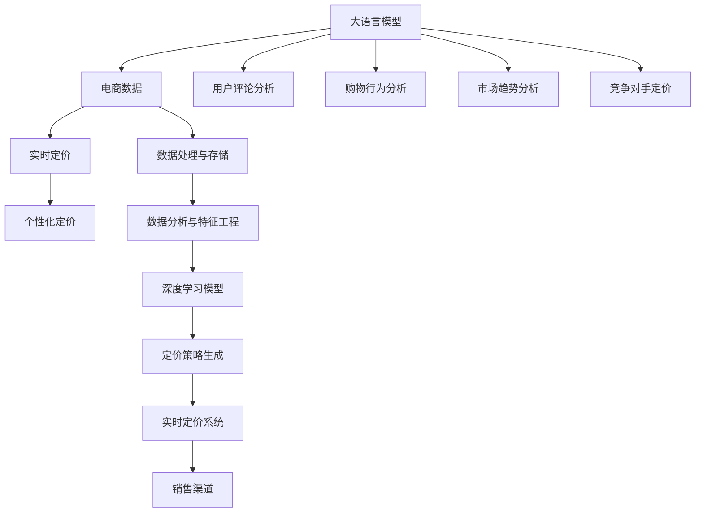

                 

# AI大模型在电商实时个性化定价中的应用

> 关键词：大语言模型,电商,实时定价,个性化,深度学习,应用实践,商业智能

## 1. 背景介绍

### 1.1 问题由来
随着电子商务平台的迅猛发展，零售商越来越多地依赖数据驱动的决策来优化商品定价，提升用户体验和销售收益。然而，传统的静态定价策略在应对实时市场变化、个性化需求和竞争动态时显得力不从心。近年来，AI大模型在电商定价中的应用，为实时个性化定价提供了新的可能性。

大模型，如BERT、GPT等，通过大规模无标签数据的预训练，学习到丰富的语言和知识表示，能够理解并生成自然语言。结合电商领域的数据特征，大模型可应用于商品描述生成、情感分析、购物推荐等，以期在电商定价策略中发挥更大作用。

### 1.2 问题核心关键点
实时个性化定价的核心在于如何利用大模型的语言理解和生成能力，实时根据用户行为、市场趋势、竞争对手动态等因素进行动态调整，最大化销售收益。

实现实时个性化定价的关键在于：
- 收集和分析实时数据：用户行为数据、商品销量数据、市场趋势、竞争对手定价等。
- 应用大模型进行数据分析：利用大模型对用户评论、产品描述等非结构化数据进行分析，提取有用信息。
- 生成个性化定价策略：结合实时数据和大模型分析结果，生成个性化定价策略。
- 实时动态调整：利用数据流处理技术，实现定价策略的实时动态调整。

### 1.3 问题研究意义
实时个性化定价能显著提升电商平台的销售效率和用户体验，通过动态定价策略，及时响应市场变化和用户需求，从而最大化销售收益。应用AI大模型进行定价决策，能够提升决策的精度和速度，减少人工干预，具有极高的商业价值。

## 2. 核心概念与联系

### 2.1 核心概念概述

为了更好地理解实时个性化定价问题，本节将介绍几个关键概念：

- 大语言模型(Large Language Model, LLM)：如BERT、GPT等，通过大规模无标签数据的预训练，学习到丰富的语言和知识表示，能够理解并生成自然语言。
- 实时定价(Real-time Pricing)：根据实时市场数据和用户行为，动态调整商品价格以最大化销售收益的过程。
- 个性化定价(Personalized Pricing)：根据用户的历史行为、偏好等个性化特征，定制化的定价策略。
- 深度学习(Deep Learning)：利用神经网络对数据进行深度学习，提取特征和规律。
- 商业智能(Business Intelligence, BI)：利用数据分析和AI技术，辅助商业决策和优化运营效率。
- 电商平台(Online Retail Platform)：如Amazon、淘宝、京东等，通过在线交易提供商品和服务的平台。
- 销售渠道(Sales Channel)：如直销、第三方电商平台、社交媒体等，实现商品销售的渠道。

这些概念之间的逻辑关系可以通过以下Mermaid流程图来展示：



这个流程图展示了各个概念之间的联系：

1. 大语言模型通过电商数据进行分析和处理。
2. 实时定价系统根据用户行为和市场趋势，生成个性化定价策略。
3. 用户评论分析、购物行为分析、市场趋势分析和竞争对手定价等非结构化数据，经过深度学习模型的处理，得到定价策略。
4. 最终，定价策略通过实时定价系统，应用于销售渠道，实现动态定价。

## 3. 核心算法原理 & 具体操作步骤
### 3.1 算法原理概述

基于大模型的实时个性化定价，本质上是一个深度学习驱动的决策优化问题。其核心思想是：通过收集和分析实时电商数据，利用大模型学习数据中的隐藏规律，进而生成并优化个性化定价策略，实现实时动态调整。

形式化地，假设电商平台有商品集 $S=\{s_1, s_2, \cdots, s_n\}$，市场实时数据 $D_t = (D_{t,u}, D_{t,r}, D_{t,c}, D_{t,d})$，其中 $D_{t,u}$ 为用户行为数据，$D_{t,r}$ 为实时市场数据，$D_{t,c}$ 为竞争对手定价数据，$D_{t,d}$ 为其他数据（如天气、节假日等）。大模型 $M$ 能对上述数据进行深层次处理，提取关键特征 $F_t$，用于生成定价策略 $P_t$。定价策略需满足实时性要求，即在每个时间步 $t$ 生成，并在指定的时间步内应用。

实时定价算法的目标是最小化销售收益损失函数：

$$
\min_{P_t} \mathcal{L}(P_t, D_t) = \left| (P_t - P_{true}) \right| \times C
$$

其中 $P_{true}$ 为真实的定价策略，$C$ 为成本系数，反映销售收益的损失程度。

### 3.2 算法步骤详解

基于大模型的实时个性化定价算法主要包括以下几个关键步骤：

**Step 1: 数据收集与预处理**
- 收集实时电商数据，包括用户行为数据、商品销量数据、市场趋势、竞争对手定价等。
- 对收集到的数据进行清洗、去重、特征提取和归一化处理。

**Step 2: 构建输入特征**
- 将电商数据转化为模型所需的输入特征。如商品名称、价格、用户ID、历史购买记录等。
- 使用大模型预训练得到的tokenizer将特征转化为模型可以处理的格式。

**Step 3: 训练深度学习模型**
- 选择合适的深度学习模型，如RNN、LSTM、Transformer等。
- 对模型进行训练，优化损失函数，使其能准确预测定价策略。
- 使用历史数据进行模型训练，以泛化到实时数据集。

**Step 4: 实时定价策略生成**
- 对实时数据进行输入特征提取，并送入模型生成定价策略。
- 根据当前市场和用户行为特征，动态生成定价策略。

**Step 5: 定价策略应用与调整**
- 将生成的定价策略应用到销售渠道，实时调整商品价格。
- 通过监控销售数据和用户反馈，不断优化定价策略，保证实时定价的准确性和有效性。

### 3.3 算法优缺点

基于大模型的实时个性化定价算法具有以下优点：
1. 实时性高。利用深度学习模型对实时数据进行动态处理，能够迅速响应市场变化。
2. 鲁棒性强。大模型具有较强的泛化能力，能够处理不同领域的电商数据。
3. 精度高。深度学习模型能够学习到复杂的数据规律，生成高质量的定价策略。
4. 自适应性强。通过不断优化模型参数和训练数据，实现持续改进和适应。

然而，该算法也存在以下局限性：
1. 对数据的依赖性高。实时定价依赖于大量的实时数据，数据质量和完整性直接影响模型性能。
2. 模型训练复杂。深度学习模型训练复杂度较高，对计算资源需求大。
3. 模型解释性差。深度学习模型的内部机制复杂，难以解释定价策略的生成过程。
4. 隐私风险。电商数据涉及用户隐私，数据收集和处理需严格遵守隐私保护法律法规。

### 3.4 算法应用领域

实时个性化定价算法不仅适用于电商平台，还广泛应用于其他电商场景，例如：

- 在线旅游：根据用户搜索和预订记录，动态调整航班和酒店价格。
- 服装零售：根据用户试穿行为和购买历史，生成个性化折扣策略。
- 在线教育：根据学员学习行为和反馈，优化课程定价和推荐策略。
- 金融服务：根据用户交易记录和市场动态，调整理财产品定价策略。

除此之外，实时个性化定价算法还广泛应用于智能客服、推荐系统、广告投放等场景，为商业决策提供数据驱动的支持。

## 4. 数学模型和公式 & 详细讲解
### 4.1 数学模型构建

假设电商平台有 $n$ 种商品，每一种商品 $s_i$ 在时间步 $t$ 的销售收益为 $R_{s_i,t}$。根据历史数据和市场趋势，大模型预测每种商品在时间步 $t$ 的定价策略为 $P_{s_i,t}$。

实时定价的目标是最小化总销售收益损失：

$$
\min_{\{P_{s_i,t}\}} \sum_{i=1}^{n} \sum_{t=1}^{T} \left| (P_{s_i,t} - P_{true}) \right| \times C_{s_i}
$$

其中 $T$ 为总时间步，$C_{s_i}$ 为商品 $s_i$ 的成本系数。

### 4.2 公式推导过程

以线性回归模型为例，假设模型输入特征为 $X_t = [x_{1,t}, x_{2,t}, \cdots, x_{m,t}]$，输出为定价策略 $P_t = \beta_0 + \beta_1 x_{1,t} + \cdots + \beta_m x_{m,t}$，其中 $\beta$ 为模型系数。

利用最小二乘法优化损失函数：

$$
\min_{\beta} \frac{1}{2} \sum_{t=1}^{T} \left| P_t - P_{true} \right|^2
$$

推导得到最小二乘法的求解公式：

$$
\beta = (X^T X)^{-1} X^T P_{true}
$$

其中 $X^T$ 和 $X$ 分别为矩阵 $X$ 的转置和逆矩阵。

### 4.3 案例分析与讲解

假设电商平台有三种商品 $s_1$、$s_2$、$s_3$，市场趋势数据为 $D_t = (D_{t,u}, D_{t,r}, D_{t,c}, D_{t,d})$。使用线性回归模型对实时数据进行处理，生成定价策略 $P_t = \beta_0 + \beta_1 x_{1,t} + \beta_2 x_{2,t} + \beta_3 x_{3,t}$。

- **案例一：基于用户行为的数据驱动定价**
  用户行为数据 $D_{t,u}$ 包括用户搜索次数、浏览时间、点击次数等。模型根据用户行为数据，生成商品 $s_1$ 的时间步 $t$ 的定价策略 $P_{s_1,t}$。

- **案例二：基于市场趋势的动态定价**
  市场趋势数据 $D_{t,r}$ 包括市场总体销售量、竞争对手价格等。模型根据市场趋势数据，生成商品 $s_2$ 的时间步 $t$ 的定价策略 $P_{s_2,t}$。

- **案例三：基于历史数据的个性化定价**
  历史数据 $D_{t,d}$ 包括用户历史购买记录、浏览记录等。模型根据历史数据，生成商品 $s_3$ 的时间步 $t$ 的定价策略 $P_{s_3,t}$。

通过案例分析可以看到，大模型在电商定价中的多模态数据融合能力，能够综合不同来源的信息，生成更加精准和动态的定价策略。

## 5. 项目实践：代码实例和详细解释说明
### 5.1 开发环境搭建

在进行电商定价项目开发前，我们需要准备好开发环境。以下是使用Python进行PyTorch开发的环境配置流程：

1. 安装Anaconda：从官网下载并安装Anaconda，用于创建独立的Python环境。

2. 创建并激活虚拟环境：
```bash
conda create -n pytorch-env python=3.8 
conda activate pytorch-env
```

3. 安装PyTorch：根据CUDA版本，从官网获取对应的安装命令。例如：
```bash
conda install pytorch torchvision torchaudio cudatoolkit=11.1 -c pytorch -c conda-forge
```

4. 安装TensorFlow：
```bash
pip install tensorflow==2.4
```

5. 安装各类工具包：
```bash
pip install numpy pandas scikit-learn matplotlib tqdm jupyter notebook ipython
```

完成上述步骤后，即可在`pytorch-env`环境中开始项目实践。

### 5.2 源代码详细实现

这里以电商平台的个性化定价系统为例，给出使用TensorFlow和Keras库进行模型训练和预测的代码实现。

首先，定义模型输入特征：

```python
from tensorflow.keras.layers import Input, Dense
from tensorflow.keras.models import Model

# 定义输入特征
input_layer = Input(shape=(n_features,), name='input_layer')
```

然后，定义深度学习模型：

```python
# 定义深度学习模型
dense_layer_1 = Dense(64, activation='relu')(input_layer)
dense_layer_2 = Dense(32, activation='relu')(dense_layer_1)
output_layer = Dense(n_classes, activation='sigmoid')(dense_layer_2)

# 定义模型
model = Model(inputs=input_layer, outputs=output_layer)
```

接着，定义模型损失函数和优化器：

```python
from tensorflow.keras.losses import binary_crossentropy
from tensorflow.keras.optimizers import Adam

# 定义损失函数
loss_fn = binary_crossentropy

# 定义优化器
optimizer = Adam(learning_rate=0.001)
```

然后，训练模型：

```python
from tensorflow.keras.callbacks import EarlyStopping

# 定义EarlyStopping回调函数
early_stop = EarlyStopping(monitor='val_loss', patience=10, mode='min')

# 训练模型
model.fit(x_train, y_train, epochs=100, batch_size=32, validation_split=0.2, callbacks=[early_stop])
```

最后，进行预测和测试：

```python
# 进行预测
predictions = model.predict(x_test)

# 计算评估指标
accuracy = accuracy_score(y_test, predictions.round())
print(f'Accuracy: {accuracy:.3f}')
```

以上就是使用TensorFlow进行电商定价模型的训练和预测的完整代码实现。

### 5.3 代码解读与分析

让我们再详细解读一下关键代码的实现细节：

- **输入特征**：定义输入特征层的维度，如商品名称、价格、用户ID等，这些特征将被送入深度学习模型进行处理。
- **深度学习模型**：通过多层全连接层进行特征提取，其中第一层包含64个神经元，第二层包含32个神经元，输出层为n_classes个神经元，用于生成个性化定价策略。
- **损失函数和优化器**：使用二元交叉熵作为损失函数，Adam优化器进行参数优化。
- **EarlyStopping回调函数**：为了防止过拟合，使用EarlyStopping回调函数在验证集上监控损失函数，若连续10个epoch验证集损失未降，则停止训练。
- **预测和测试**：通过模型对测试集进行预测，并计算准确率。

可以看到，TensorFlow和Keras库使得模型训练和预测的代码实现变得简洁高效。开发者可以更专注于模型的优化和训练效果的评估，而不必过多关注底层实现细节。

## 6. 实际应用场景
### 6.1 智能客服定价系统

基于大模型的实时个性化定价技术，可以应用于智能客服系统的定价策略生成。智能客服系统可以根据用户历史咨询记录和实时市场数据，生成动态的定价策略，及时调整商品价格，提升用户体验和销售收益。

在技术实现上，可以收集客服咨询历史数据，将用户咨询记录和商品信息转化为模型输入，利用大模型对用户需求进行分析和预测，生成符合用户期望的定价策略。对于实时咨询，系统还可以根据实时市场数据，动态调整价格，实现快速响应。

### 6.2 动态广告定价系统

电商广告定价也需要考虑实时市场变化和用户行为。通过实时定价技术，电商广告平台可以根据用户的实时行为数据和市场趋势，动态调整广告投放价格，优化广告效果和成本。

广告投放的定价策略通常依赖于广告的展示位置、用户行为数据、广告内容等。大模型可以根据广告投放历史数据和实时数据，生成个性化的定价策略，并通过A/B测试等方式优化广告效果。

### 6.3 个性化推荐定价系统

电商平台可以利用实时定价技术，根据用户历史购买记录和实时浏览行为，动态调整商品价格，实现个性化推荐。例如，对于浏览历史中表现出较高购买兴趣的用户，系统会生成更低的价格优惠，吸引其进行购买。

推荐定价系统的核心在于用户行为的建模和分析。大模型可以根据用户浏览历史、点击记录等行为数据，生成个性化定价策略，从而提高用户转化率和满意度。

### 6.4 未来应用展望

随着大模型和实时定价技术的不断发展，未来在电商领域的应用将更加广泛，进一步提升平台的销售效率和用户体验。

- 基于大模型的实时定价技术将进一步融合多模态数据，如用户情感、市场趋势、竞争对手数据等，提升定价策略的准确性和鲁棒性。
- 智能定价系统将更加普及，应用于更多电商场景，如旅游、教育、金融等。
- 电商平台将实现更高效的库存管理和定价策略优化，减少库存积压和价格波动带来的损失。
- 实时定价技术将结合更多AI技术，如强化学习、因果推理等，实现更加复杂和多变的定价策略。

未来，基于大模型的实时个性化定价技术将更好地服务于电商平台的商业智能决策，推动电商行业向更加智能、高效的方向发展。

## 7. 工具和资源推荐
### 7.1 学习资源推荐

为了帮助开发者系统掌握大模型在电商定价中的应用，这里推荐一些优质的学习资源：

1. 《深度学习在电商中的应用》系列博文：由大模型技术专家撰写，深入浅出地介绍了深度学习在电商领域的各类应用，包括定价策略生成、广告投放优化等。

2. 《商业智能与数据分析》在线课程：提供系统的商业智能和数据分析知识，涵盖数据处理、模型构建、业务指标评估等。

3. 《电商定价与营销》书籍：详细介绍了电商定价和营销策略，包括动态定价、个性化定价、用户行为分析等。

4. 《AI技术在电商中的应用》报告：总结了人工智能技术在电商领域的应用实践，包括实时定价、智能客服、推荐系统等。

5. HuggingFace官方文档：提供丰富的预训练模型和深度学习框架的使用指南，帮助开发者实现电商定价的各类任务。

通过对这些资源的学习实践，相信你一定能够快速掌握大模型在电商定价中的应用，并用于解决实际的电商问题。

### 7.2 开发工具推荐

高效的开发离不开优秀的工具支持。以下是几款用于大模型应用开发的常用工具：

1. PyTorch：基于Python的开源深度学习框架，灵活高效的计算图，适合快速迭代研究。
2. TensorFlow：由Google主导开发的开源深度学习框架，生产部署方便，适合大规模工程应用。
3. Keras：基于TensorFlow的高级神经网络API，提供了简洁易用的API接口，方便快速搭建模型。
4. Weights & Biases：模型训练的实验跟踪工具，可以记录和可视化模型训练过程中的各项指标，方便对比和调优。
5. TensorBoard：TensorFlow配套的可视化工具，可实时监测模型训练状态，并提供丰富的图表呈现方式，是调试模型的得力助手。

合理利用这些工具，可以显著提升大模型在电商定价应用的开发效率，加快创新迭代的步伐。

### 7.3 相关论文推荐

大模型在电商定价中的应用源于学界的持续研究。以下是几篇奠基性的相关论文，推荐阅读：

1. Pricing Strategies for Online Marketplaces via Deep Reinforcement Learning：利用深度强化学习技术，优化电商平台的动态定价策略。

2. A deep learning based pricing model for e-commerce：提出基于深度学习的价格预测模型，实现电商商品的实时定价。

3. A survey on deep learning based pricing：综述了深度学习在电商定价领域的应用，包括算法模型、数据预处理、性能评估等。

4. Dynamic pricing strategies in e-commerce：讨论了电商动态定价的策略和方法，包括实时定价、个性化定价等。

5. Customer Value in Dynamic Pricing: From Computation to Strategy：研究了客户价值在动态定价中的应用，探讨了如何利用数据驱动定价策略。

这些论文代表了大模型在电商定价领域的发展脉络。通过学习这些前沿成果，可以帮助研究者把握学科前进方向，激发更多的创新灵感。

## 8. 总结：未来发展趋势与挑战

### 8.1 总结

本文对基于大模型的实时个性化定价方法进行了全面系统的介绍。首先阐述了实时定价在电商中的应用背景和意义，明确了微调在拓展预训练模型应用、提升下游任务性能方面的独特价值。其次，从原理到实践，详细讲解了实时定价的数学原理和关键步骤，给出了电商定价任务开发的完整代码实例。同时，本文还广泛探讨了实时定价技术在智能客服、动态广告、推荐系统等电商场景中的应用前景，展示了实时定价范式的巨大潜力。此外，本文精选了实时定价技术的各类学习资源，力求为读者提供全方位的技术指引。

通过本文的系统梳理，可以看到，基于大模型的实时定价方法正在成为电商定价的重要范式，极大地拓展了电商平台的定价策略优化能力，提升了平台的销售效率和用户体验。未来，伴随大模型和实时定价方法的持续演进，相信实时定价技术将更好地服务于电商平台的商业智能决策，推动电商行业向更加智能、高效的方向发展。

### 8.2 未来发展趋势

展望未来，实时个性化定价技术将呈现以下几个发展趋势：

1. 数据驱动决策优化：更多实时数据被纳入定价策略生成，提高决策的科学性和准确性。
2. 多模态数据融合：将文本、图像、音频等多种模态的信息进行综合分析，生成更加全面和精准的定价策略。
3. 持续学习和自适应：实时定价系统能够不断学习和适应用户行为和市场变化，提升系统的适应性和鲁棒性。
4. 因果推断和解释性：引入因果推断方法，提升定价策略的解释性和可解释性，帮助用户理解定价决策。
5. 多目标优化：实时定价不仅仅追求销售收益最大化，还关注用户体验、库存管理等多目标优化。

这些趋势凸显了实时定价技术的广阔前景。这些方向的探索发展，必将进一步提升电商平台的销售效率和用户体验，为电商行业的智能化转型提供强有力的技术支持。

### 8.3 面临的挑战

尽管实时个性化定价技术已经取得了瞩目成就，但在迈向更加智能化、普适化应用的过程中，它仍面临着诸多挑战：

1. 数据质量与数据隐私：实时定价依赖于大量的实时数据，数据质量和隐私保护成为重要挑战。
2. 模型复杂性：深度学习模型的复杂性增加，导致模型训练和调优的难度增大。
3. 实时性要求高：实时定价需要高效的数据处理和快速响应，对系统的性能和架构提出高要求。
4. 多目标优化难度大：在实际应用中，实时定价通常需要平衡多个目标，如销售收益、用户满意度等，增加了决策的复杂性。
5. 解释性和可控性：实时定价系统需要具备较高的可解释性和可控性，以便用户和决策者理解和信任系统决策。

正视实时定价面临的这些挑战，积极应对并寻求突破，将是大模型技术走向成熟的必由之路。相信随着学界和产业界的共同努力，这些挑战终将一一被克服，实时定价技术必将在电商领域乃至更多行业应用中发挥更大的作用。

### 8.4 研究展望

面向未来，实时定价技术的进一步发展需要解决以下问题：

1. 大数据实时处理技术：探索更高效的大数据实时处理技术，如数据流处理、分布式计算等，满足实时定价对数据处理的实时性要求。
2. 深度学习模型优化：研究轻量级模型和高效的模型压缩技术，优化模型性能，减少训练和推理时间。
3. 多目标优化算法：发展多目标优化算法，实现销售收益、用户满意度、库存管理等目标的协同优化。
4. 模型可解释性和可控性：引入可解释性模型和因果推断方法，提高定价策略的透明度和可控性，增强用户和决策者的信任。
5. 数据隐私保护：探索隐私保护技术，如差分隐私、联邦学习等，确保实时定价过程中用户数据的隐私和安全。

这些研究方向将推动实时定价技术向更加智能、高效、安全的方向发展，为电商平台的智能化决策提供坚实的技术基础。

## 9. 附录：常见问题与解答

**Q1：实时定价如何处理数据隐私问题？**

A: 实时定价需要处理大量的用户数据，数据隐私问题是一个重要挑战。解决数据隐私问题的方法包括：
- 数据匿名化：对用户数据进行匿名化处理，去除或模糊化个人身份信息。
- 差分隐私：在模型训练和预测过程中加入噪声，确保模型输出对个体数据的隐私保护。
- 联邦学习：分布式训练模型，只在本地设备上处理用户数据，不泄露数据到中央服务器。
- 数据使用合规：确保数据使用符合隐私保护法律法规，如GDPR、CCPA等。

通过这些方法，可以在保护用户隐私的前提下，利用实时数据进行定价决策。

**Q2：实时定价的优化目标有哪些？**

A: 实时定价的优化目标通常包括：
- 最大化销售收益：通过动态调整价格，提升销售量和利润。
- 提高用户满意度：通过个性化定价，提升用户购物体验和忠诚度。
- 优化库存管理：根据实时销售数据和库存状态，动态调整商品价格，减少库存积压和缺货。
- 提升运营效率：通过实时监控和调整定价策略，提升电商平台和供应商的运营效率。

不同电商场景的优化目标可能有所不同，需要根据具体情况进行调整。

**Q3：实时定价的算法有哪些？**

A: 实时定价算法包括：
- 线性回归模型：利用历史数据预测未来定价，适用于线性定价关系较强的场景。
- 决策树和随机森林：通过构建决策树模型，基于特征重要性进行定价决策。
- 深度学习模型：如RNN、LSTM、Transformer等，利用数据特征进行复杂规律的挖掘和预测。
- 强化学习：通过与环境的交互，学习最优的定价策略，适用于复杂的动态环境。
- 多目标优化算法：如粒子群优化、遗传算法等，平衡多个目标，实现最优定价策略。

不同算法适用于不同的电商场景和数据特征，开发者需要根据具体情况选择最合适的算法。

**Q4：实时定价的实现流程是怎样的？**

A: 实时定价的实现流程包括：
1. 数据收集：收集实时市场数据、用户行为数据、竞争对手数据等。
2. 数据预处理：清洗、去重、特征提取和归一化处理。
3. 模型训练：选择合适模型进行训练，优化损失函数，生成定价策略。
4. 定价策略生成：根据实时数据和历史数据，动态生成定价策略。
5. 策略应用与调整：实时应用定价策略，并通过监控数据和用户反馈进行策略优化。

通过上述流程，可以逐步实现实时定价的系统，提升电商平台的销售效率和用户体验。

**Q5：实时定价的系统架构是怎样的？**

A: 实时定价的系统架构包括：
- 数据采集层：收集实时市场数据、用户行为数据、竞争对手数据等。
- 数据处理层：对数据进行清洗、去重、特征提取和归一化处理。
- 模型训练层：选择合适模型进行训练，优化损失函数，生成定价策略。
- 定价策略生成层：根据实时数据和历史数据，动态生成定价策略。
- 策略应用层：实时应用定价策略，并通过监控数据和用户反馈进行策略优化。

通过以上架构，可以构建一个高效、灵活的实时定价系统，满足电商平台的业务需求。

---

作者：禅与计算机程序设计艺术 / Zen and the Art of Computer Programming

