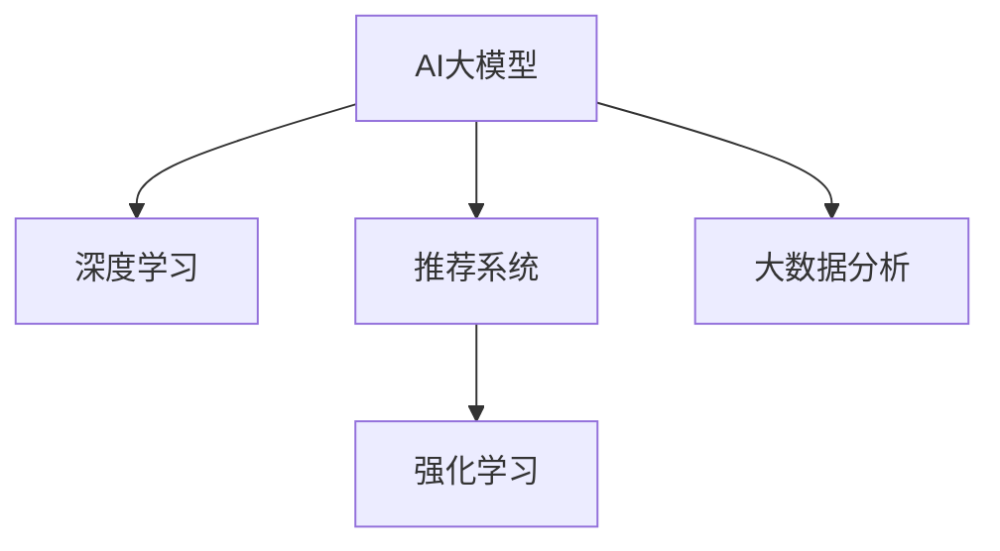

                 

# AI大模型在电商平台促销策略优化中的应用

> 关键词：AI大模型,电商平台,促销策略优化,推荐系统,强化学习,深度学习,大数据分析

## 1. 背景介绍

### 1.1 问题由来

随着互联网零售业的飞速发展，电商平台成为品牌和消费者之间的重要桥梁，其促销策略的优化直接关系到销售额的提升和用户体验的改善。然而，制定有效的促销策略并非易事，既要考虑到品牌形象和营销成本，又要精准触达目标客户群体，同时要规避价格竞争风险。传统的方法依赖于经验丰富的市场分析师和营销专家，但这种方法效率低下且容易产生误判。

近年来，人工智能技术的快速发展，为电商平台促销策略的优化带来了新的希望。AI大模型结合了大数据分析、深度学习、推荐系统、强化学习等技术，能够通过处理海量数据，学习到商品、用户、时间等维度的关联模式，从而精准预测促销效果，优化策略。本文将介绍如何使用AI大模型对电商平台促销策略进行优化，并探讨其优势和挑战。

## 2. 核心概念与联系

### 2.1 核心概念概述

为更好地理解AI大模型在电商平台促销策略优化中的应用，本节将介绍几个关键概念：

- AI大模型(AI Large Model)：以Transformer为基础的深度学习模型，具有自回归或自编码结构，通过在大规模无标签数据上预训练学习到语言和数据的表示。在电商平台上，通过微调和训练，能够学习到用户行为、商品特征等，帮助优化促销策略。

- 深度学习(Deep Learning)：一种基于神经网络的机器学习方法，通过多层神经网络结构，实现对复杂数据的抽象表示和分类预测。

- 推荐系统(Recommendation System)：利用用户行为数据和商品特征，为每个用户推荐个性化商品，提升用户体验和销售转化率。

- 强化学习(Reinforcement Learning, RL)：一种学习模型，通过与环境的交互，获得奖励信号，优化策略，广泛应用于游戏、金融、电商等场景。

- 大数据分析(Big Data Analysis)：处理和分析大规模数据集，提取有价值的信息，支撑决策和策略优化。

这些核心概念之间的逻辑关系可以通过以下Mermaid流程图来展示：



这个流程图展示了大模型、深度学习、推荐系统、强化学习和大数据分析等概念之间的内在联系和应用场景，以及它们如何协同工作，共同提升电商平台的促销策略效果。

## 3. 核心算法原理 & 具体操作步骤
### 3.1 算法原理概述

基于AI大模型的电商平台促销策略优化，本质上是利用深度学习模型，通过数据分析和强化学习，不断优化促销策略的过程。其核心思想是：通过分析用户行为数据、商品销售数据等，学习用户偏好和购买习惯，并结合促销活动的目标和预算，通过强化学习不断调整策略，以达到最大化收益的目的。

具体步骤如下：

1. **数据采集**：收集电商平台的用户行为数据、商品销售数据、用户画像等。
2. **预训练**：使用大规模无标签数据对AI大模型进行预训练，学习到数据表示和用户行为模式。
3. **微调**：对预训练模型进行微调，使其能够根据电商平台促销目标，学习到最优策略。
4. **测试与优化**：在测试集中评估促销策略的效果，根据结果不断调整策略，直至达到理想效果。

### 3.2 算法步骤详解

**Step 1: 数据采集与预处理**
- 从电商平台采集用户行为数据（如浏览、点击、购买、评价等），商品销售数据（如销量、价格、库存等），用户画像数据（如年龄、性别、职业等）。
- 对数据进行清洗、去重、归一化处理，确保数据的质量和一致性。

**Step 2: 数据建模与特征提取**
- 使用AI大模型进行数据建模，学习到用户行为和商品特征的表示。
- 通过特征工程，提取对促销策略有用的特征，如用户活跃度、商品价格变化、库存状态等。

**Step 3: 模型微调与策略优化**
- 将预训练模型与电商平台促销目标结合，进行微调，学习到最优的促销策略。
- 使用强化学习算法（如Q-learning、Deep Q-Networks等），不断调整促销策略，优化促销效果。

**Step 4: 策略测试与评估**
- 在测试集中评估促销策略的效果，如点击率、转化率、销售额等指标。
- 根据测试结果，进一步调整促销策略，直到达到最优效果。

### 3.3 算法优缺点

基于AI大模型的电商平台促销策略优化方法具有以下优点：
1. 数据驱动：能够利用大数据分析技术，挖掘用户行为和商品特征，提供决策依据。
2. 高准确性：AI大模型的深度学习能力和强化学习算法，能够提供精准的策略优化方案。
3. 自动化：通过自动化算法和模型训练，减少人工干预，提高效率。
4. 可扩展性：大模型可以处理大规模数据，适用于多平台、多区域、多场景的促销策略优化。

同时，该方法也存在一些缺点：
1. 数据需求大：需要大量的用户行为和商品销售数据，数据获取成本高。
2. 模型复杂：大模型结构和参数众多，训练和优化过程复杂。
3. 高计算成本：深度学习和强化学习模型训练需要高性能计算资源。
4. 效果受限于数据：数据质量和数量对策略优化效果有直接影响。

尽管存在这些局限性，但AI大模型在电商平台促销策略优化中已经显示出其强大的潜力，并得到了越来越多的应用。

### 3.4 算法应用领域

基于AI大模型的促销策略优化方法，已经广泛应用于多个电商平台的促销活动优化中，例如：

- 双11、618等电商大促活动：通过模型学习到最佳促销策略，提升活动效果和销售额。
- 新商品上市活动：分析用户行为和竞品策略，制定个性化的促销方案。
- 个性化推荐：根据用户行为和商品特征，推荐相关商品，提高销售转化率。
- 价格优化：预测商品价格变化对用户行为的影响，制定动态价格策略。

除了上述这些应用场景，大模型在电商平台促销策略优化中还有更多创新方向，如跨平台推广、多渠道协同、实时调优等，推动电商促销策略的进一步提升。

## 4. 数学模型和公式 & 详细讲解
### 4.1 数学模型构建

为了更好地理解AI大模型在电商平台促销策略优化中的数学原理，我们将从深度学习模型开始介绍。

设AI大模型为$M_{\theta}$，其中$\theta$为模型参数。电商平台促销策略优化问题可以形式化为：

$$
\max_{\theta} \sum_{i=1}^N R_i(\theta) \quad s.t. \quad C_i(\theta) \leq B_i
$$

其中$R_i(\theta)$为促销策略在第$i$个用户上的收益，$C_i(\theta)$为促销策略在第$i$个用户上的成本，$B_i$为促销策略的预算限制。

### 4.2 公式推导过程

假设电商平台有$N$个用户，对于每个用户$i$，促销策略$S_i$的收益和成本分别为$R_i(S_i)$和$C_i(S_i)$。则促销策略优化问题可以转化为求解最大化用户收益和总收益的优化问题。

使用深度学习模型对用户行为数据进行建模，得到每个用户的收益$R_i(S_i;\theta)$和成本$C_i(S_i;\theta)$。则问题可以转化为：

$$
\max_{\theta} \sum_{i=1}^N R_i(S_i;\theta) \quad s.t. \quad C_i(S_i;\theta) \leq B_i
$$

为了求解上述优化问题，引入强化学习算法，如Q-learning，构建策略优化模型。Q-learning的策略更新公式为：

$$
Q_i(S_i, S'_i) \leftarrow Q_i(S_i, S'_i) + \alpha(R_i(S_i, S'_i) - Q_i(S_i, S'_i))
$$

其中$\alpha$为学习率，$S'$为下一时刻的促销策略。

通过上述公式，不断更新Q值，使策略$S_i$能够最大化用户收益和总收益。最终得到的策略即为最优促销策略。

### 4.3 案例分析与讲解

**案例一：双11促销活动优化**
假设电商平台在双11活动期间，总预算为$B$，有$N$个商品参与活动。我们希望通过优化促销策略，最大化活动收益。

使用AI大模型对用户行为数据进行建模，得到每个商品的收益和成本函数$R(S_i;\theta)$和$C(S_i;\theta)$。引入强化学习算法，使用Q-learning优化促销策略$S_i$。

具体步骤如下：

1. 对用户行为数据进行预处理，提取特征。
2. 使用深度学习模型进行数据建模，得到收益和成本函数。
3. 引入Q-learning算法，通过不断调整促销策略，最大化总收益。
4. 在测试集中评估优化后的促销策略效果，不断调整参数。

**案例二：个性化推荐**
假设电商平台希望通过个性化推荐，提升销售转化率。我们希望在有限的预算下，最大化推荐带来的收益。

使用AI大模型对用户行为数据进行建模，得到每个用户的推荐收益$R_i(S_i;\theta)$。引入强化学习算法，使用Q-learning优化个性化推荐策略$S_i$。

具体步骤如下：

1. 对用户行为数据进行预处理，提取特征。
2. 使用深度学习模型进行数据建模，得到推荐收益函数。
3. 引入Q-learning算法，通过不断调整推荐策略，最大化总收益。
4. 在测试集中评估优化后的推荐策略效果，不断调整参数。

通过以上两个案例，可以看出，AI大模型在电商平台促销策略优化中的应用，通过深度学习模型和强化学习算法，能够学习到最优的策略，提升促销效果和收益。

## 5. 项目实践：代码实例和详细解释说明
### 5.1 开发环境搭建

在进行电商促销策略优化项目时，我们需要准备开发环境。以下是使用Python进行深度学习开发的常见环境配置流程：

1. 安装Anaconda：从官网下载并安装Anaconda，用于创建独立的Python环境。

2. 创建并激活虚拟环境：
```bash
conda create -n deep_learning_env python=3.8 
conda activate deep_learning_env
```

3. 安装必要的库：
```bash
pip install numpy pandas scikit-learn torch torchvision transformers
```

4. 安装深度学习框架：
```bash
pip install pytorch torchvision torchaudio
```

5. 安装AI大模型库：
```bash
pip install transformers
```

完成上述步骤后，即可在`deep_learning_env`环境中开始电商促销策略优化的项目开发。

### 5.2 源代码详细实现

下面我们以电商平台个性化推荐为例，给出使用深度学习进行促销策略优化的Python代码实现。

```python
import torch
import torch.nn as nn
import torch.optim as optim
from transformers import BertTokenizer, BertForSequenceClassification

# 定义模型
class RecommendationModel(nn.Module):
    def __init__(self, num_users, num_items, hidden_size=512, num_classes=2):
        super(RecommendationModel, self).__init__()
        self.hidden_size = hidden_size
        self.num_users = num_users
        self.num_items = num_items
        self.bert = BertForSequenceClassification.from_pretrained('bert-base-cased', num_labels=num_classes)
        self.fc = nn.Linear(hidden_size, num_items)
        self.relu = nn.ReLU()
        self.softmax = nn.Softmax(dim=1)

    def forward(self, user_ids, user_features, item_ids, item_features):
        user_ids = user_ids.long()
        item_ids = item_ids.long()

        # 构建输入
        user_input_ids = torch.cat([user_features, user_ids], dim=-1)
        item_input_ids = torch.cat([item_features, item_ids], dim=-1)

        # 前向传播
        user_repr = self.bert(user_input_ids)
        item_repr = self.bert(item_input_ids)
        hidden = torch.cat([user_repr, item_repr], dim=1)
        hidden = self.relu(self.fc(hidden))

        # 输出预测结果
        logits = self.softmax(hidden)
        return logits

# 定义优化器和损失函数
optimizer = optim.Adam(model.parameters(), lr=0.001)
loss_fn = nn.BCELoss()

# 加载数据集
# ...

# 定义训练函数
def train_epoch(model, data_loader, optimizer, loss_fn):
    model.train()
    for user_ids, user_features, item_ids, item_features, labels in data_loader:
        optimizer.zero_grad()
        logits = model(user_ids, user_features, item_ids, item_features)
        loss = loss_fn(logits, labels)
        loss.backward()
        optimizer.step()
    return loss.item()

# 定义评估函数
def evaluate(model, data_loader, num_classes):
    model.eval()
    total_loss = 0
    total_correct = 0
    for user_ids, user_features, item_ids, item_features, labels in data_loader:
        with torch.no_grad():
            logits = model(user_ids, user_features, item_ids, item_features)
            loss = loss_fn(logits, labels)
            total_loss += loss.item()
            total_correct += torch.sum(logits.argmax(dim=1) == labels)
    return total_loss / len(data_loader), total_correct / len(data_loader)

# 训练和评估
epochs = 10
batch_size = 64
train_loader, dev_loader, test_loader = ...

for epoch in range(epochs):
    train_loss = train_epoch(model, train_loader, optimizer, loss_fn)
    dev_loss, dev_acc = evaluate(model, dev_loader, num_classes)
    test_loss, test_acc = evaluate(model, test_loader, num_classes)
    print(f'Epoch {epoch+1}, train loss: {train_loss:.3f}, dev loss: {dev_loss:.3f}, dev acc: {dev_acc:.3f}, test loss: {test_loss:.3f}, test acc: {test_acc:.3f}')
```

### 5.3 代码解读与分析

让我们再详细解读一下关键代码的实现细节：

**RecommendationModel类**：
- `__init__`方法：初始化模型参数和结构，包括BERT模型、全连接层、激活函数等。
- `forward`方法：定义模型的前向传播过程，通过BERT模型编码用户和商品特征，然后通过全连接层输出预测结果。

**训练和评估函数**：
- `train_epoch`方法：在训练集上进行梯度下降，更新模型参数。
- `evaluate`方法：在测试集上评估模型效果，包括损失和准确率。

**训练流程**：
- 定义总的epoch数和batch size，开始循环迭代
- 每个epoch内，在训练集和验证集上训练和评估模型
- 所有epoch结束后，在测试集上评估，输出最终测试结果

可以看到，使用深度学习进行电商平台促销策略优化，通过构建推荐模型并进行微调，可以在有限的预算下，最大化推荐带来的收益。这种模型构建方式，可以处理大规模数据，并自动学习到最优的推荐策略。

当然，实际应用中还需要根据具体任务和需求，进行更多的模型优化和参数调优，以进一步提升模型效果。

## 6. 实际应用场景
### 6.1 智能推荐系统

电商平台通过智能推荐系统，能够根据用户行为和偏好，推荐个性化商品，提升用户体验和销售转化率。使用AI大模型进行推荐系统优化，可以大幅提升推荐效果。

具体而言，可以收集用户浏览、点击、购买、评价等行为数据，提取特征，并构建深度学习模型进行预测。在模型训练过程中，使用强化学习算法进行策略优化，学习到最优的推荐策略。在推荐时，将用户行为数据输入模型，输出推荐结果，并不断调整参数，直至达到理想效果。

### 6.2 价格优化策略

电商平台的价格优化策略，是指通过调整商品价格，达到最大化收益的目的。使用AI大模型进行价格优化，可以动态调整价格策略，适应市场需求。

具体而言，可以收集历史销售数据和用户行为数据，提取特征，并构建深度学习模型进行价格预测。在模型训练过程中，使用强化学习算法进行策略优化，学习到最优的价格策略。在价格调整时，将用户行为数据输入模型，输出价格预测结果，并不断调整参数，直至达到理想效果。

### 6.3 活动促销优化

电商平台的活动促销策略，是指通过各种促销手段，吸引用户购买，达到最大化销售额的目的。使用AI大模型进行促销策略优化，可以动态调整促销手段，提高活动效果。

具体而言，可以收集历史促销数据和用户行为数据，提取特征，并构建深度学习模型进行促销策略预测。在模型训练过程中，使用强化学习算法进行策略优化，学习到最优的促销策略。在促销活动时，将用户行为数据输入模型，输出促销策略预测结果，并不断调整参数，直至达到理想效果。

### 6.4 未来应用展望

随着AI大模型和深度学习技术的不断发展，基于大模型的电商促销策略优化将带来更多创新。未来，AI大模型将在电商促销策略优化中发挥更加重要的作用，具体趋势如下：

1. 模型结构更加复杂。未来的模型将包含更多的神经网络层和参数，具有更强的表达能力。
2. 算法更加先进。未来的算法将融合更多的深度学习和强化学习技术，实现更高效的策略优化。
3. 数据处理更加高效。未来的数据处理技术将更加高效，能够处理更大规模的数据，提取更多有用的特征。
4. 应用场景更加广泛。未来的应用场景将更加丰富，涵盖更多领域，如社交电商、跨境电商等。

总之，AI大模型在电商平台促销策略优化中的应用，将不断拓展和深化，为电商行业带来更多的创新和价值。

## 7. 工具和资源推荐
### 7.1 学习资源推荐

为了帮助开发者系统掌握AI大模型在电商平台促销策略优化中的应用，这里推荐一些优质的学习资源：

1. 《深度学习》书籍：Ian Goodfellow等人著作，深入浅出地介绍了深度学习的原理和应用，是深度学习入门的经典之作。
2. 《强化学习》书籍：Richard S. Sutton等人著作，详细介绍了强化学习的理论基础和应用案例，是强化学习领域的经典之作。
3. 《自然语言处理》课程：斯坦福大学开设的NLP明星课程，有Lecture视频和配套作业，带你入门NLP领域的基本概念和经典模型。
4. Coursera深度学习课程：由深度学习领域权威教授Andrew Ng主讲，涵盖了深度学习的基础理论和实践应用。
5. Kaggle竞赛平台：世界领先的机器学习竞赛平台，提供大量电商促销策略优化的数据集和任务，可实践并检验模型效果。

通过对这些资源的学习实践，相信你一定能够快速掌握AI大模型在电商平台促销策略优化中的应用，并用于解决实际的电商促销问题。

### 7.2 开发工具推荐

高效的开发离不开优秀的工具支持。以下是几款用于电商平台促销策略优化开发的常用工具：

1. PyTorch：基于Python的开源深度学习框架，灵活动态的计算图，适合快速迭代研究。大部分预训练语言模型都有PyTorch版本的实现。
2. TensorFlow：由Google主导开发的开源深度学习框架，生产部署方便，适合大规模工程应用。同样有丰富的预训练语言模型资源。
3. Transformers库：HuggingFace开发的NLP工具库，集成了众多SOTA语言模型，支持PyTorch和TensorFlow，是进行电商促销策略优化开发的利器。
4. Weights & Biases：模型训练的实验跟踪工具，可以记录和可视化模型训练过程中的各项指标，方便对比和调优。与主流深度学习框架无缝集成。
5. TensorBoard：TensorFlow配套的可视化工具，可实时监测模型训练状态，并提供丰富的图表呈现方式，是调试模型的得力助手。
6. Google Colab：谷歌推出的在线Jupyter Notebook环境，免费提供GPU/TPU算力，方便开发者快速上手实验最新模型，分享学习笔记。

合理利用这些工具，可以显著提升电商促销策略优化任务的开发效率，加快创新迭代的步伐。

### 7.3 相关论文推荐

AI大模型和电商平台促销策略优化的发展源于学界的持续研究。以下是几篇奠基性的相关论文，推荐阅读：

1. Attention is All You Need：提出Transformer结构，开启了NLP领域的预训练大模型时代。
2. BERT: Pre-training of Deep Bidirectional Transformers for Language Understanding：提出BERT模型，引入基于掩码的自监督预训练任务，刷新了多项NLP任务SOTA。
3. Learning to Optimize：提出强化学习算法优化神经网络，是深度学习与强化学习结合的奠基之作。
4. Sequence to Sequence Learning with Neural Networks：提出Seq2Seq模型，广泛应用于机器翻译、对话系统等自然语言处理任务。
5. Deep Q-Networks for Large Scale Continuous Control Problems：提出Deep Q-Networks算法，应用于强化学习中的连续动作空间问题，如游戏AI等。

这些论文代表了大模型在电商平台促销策略优化领域的研究脉络。通过学习这些前沿成果，可以帮助研究者把握学科前进方向，激发更多的创新灵感。

## 8. 总结：未来发展趋势与挑战
### 8.1 总结

本文对AI大模型在电商平台促销策略优化中的应用进行了全面系统的介绍。首先阐述了电商促销策略优化的背景和意义，明确了AI大模型优化促销策略的独特价值。其次，从原理到实践，详细讲解了深度学习模型和强化学习算法在促销策略优化中的应用，给出了电商促销策略优化的完整代码实例。同时，本文还广泛探讨了AI大模型在电商促销策略优化中的实际应用场景，展示了其强大的潜力。最后，本文精选了AI大模型的学习资源，力求为读者提供全方位的技术指引。

通过本文的系统梳理，可以看到，AI大模型在电商平台促销策略优化中的应用，通过深度学习模型和强化学习算法，能够学习到最优的策略，提升促销效果和收益。未来，伴随深度学习和强化学习技术的不断发展，基于大模型的电商促销策略优化将不断优化，为电商行业带来更多的创新和价值。

### 8.2 未来发展趋势

展望未来，AI大模型在电商平台促销策略优化中将呈现以下几个发展趋势：

1. 模型规模持续增大。随着算力成本的下降和数据规模的扩张，AI大模型的参数量还将持续增长。超大规模模型蕴含的丰富知识，有望支撑更加复杂多变的电商促销策略优化。
2. 模型复杂度不断提升。未来的模型将包含更多的神经网络层和参数，具有更强的表达能力。
3. 算法更加先进。未来的算法将融合更多的深度学习和强化学习技术，实现更高效的促销策略优化。
4. 数据处理更加高效。未来的数据处理技术将更加高效，能够处理更大规模的数据，提取更多有用的特征。
5. 应用场景更加广泛。未来的应用场景将更加丰富，涵盖更多领域，如社交电商、跨境电商等。

以上趋势凸显了AI大模型在电商平台促销策略优化中的广阔前景。这些方向的探索发展，必将进一步提升电商促销策略的性能和应用范围，为电商行业带来更多的创新和价值。

### 8.3 面临的挑战

尽管AI大模型在电商平台促销策略优化中已经取得了显著成效，但在迈向更加智能化、普适化应用的过程中，仍面临诸多挑战：

1. 数据质量瓶颈。虽然AI大模型能够利用大数据处理技术，但数据质量对模型效果有直接影响。如何获取高质量的数据，并对其进行有效清洗和处理，仍是一大难题。
2. 模型鲁棒性不足。AI大模型在面对多样化的电商场景时，泛化性能往往不足，容易产生误判。如何提高模型鲁棒性，避免模型过拟合，还需要更多理论和实践的积累。
3. 计算资源消耗大。AI大模型在电商促销策略优化中的应用，需要大量的计算资源，包括GPU/TPU等高性能设备。如何优化算法，降低计算成本，仍是一大挑战。
4. 模型可解释性差。AI大模型的决策过程往往缺乏可解释性，难以对其推理逻辑进行分析和调试。如何赋予模型更强的可解释性，将是亟待解决的问题。
5. 安全性问题突出。电商平台涉及大量用户隐私和交易数据，AI大模型的安全性问题尤为突出。如何保障数据和模型的安全，避免恶意攻击和滥用，需要更多的技术保障。

正视这些挑战，积极应对并寻求突破，将是大模型在电商促销策略优化中走向成熟的必由之路。相信随着学界和产业界的共同努力，这些挑战终将一一被克服，AI大模型将为电商行业带来更多的创新和价值。

### 8.4 研究展望

面向未来，大模型在电商平台促销策略优化中的研究将主要集中在以下几个方面：

1. 无监督学习和半监督学习。摆脱对大规模标注数据的依赖，利用自监督学习、主动学习等方法，最大限度利用非结构化数据，实现更加灵活高效的电商促销策略优化。
2. 参数高效优化算法。开发更加参数高效的优化算法，在固定大部分预训练参数的同时，只更新极少量的任务相关参数，减少计算资源消耗。
3. 多模态数据融合。将符号化的先验知识，如知识图谱、逻辑规则等，与神经网络模型进行巧妙融合，引导促销策略优化过程学习更准确、合理的电商知识。
4. 因果分析和博弈论工具。将因果分析方法引入促销策略优化模型，识别出模型决策的关键特征，增强输出解释的因果性和逻辑性。借助博弈论工具刻画人机交互过程，主动探索并规避模型的脆弱点，提高系统稳定性。
5. 安全性和隐私保护。在模型训练目标中引入伦理导向的评估指标，过滤和惩罚有害的输出倾向。加强人工干预和审核，建立模型行为的监管机制，确保数据和模型的安全。

这些研究方向将推动AI大模型在电商平台促销策略优化中的进一步发展，带来更多的创新和价值。

## 9. 附录：常见问题与解答

**Q1：AI大模型在电商促销策略优化中是否需要大规模数据？**

A: 是的，AI大模型在电商促销策略优化中需要大规模的数据进行训练。电商数据量巨大且具有多样性，数据质量对模型效果有直接影响。数据不足容易导致模型过拟合或泛化性能不足。

**Q2：如何选择合适的学习率？**

A: 电商促销策略优化中，AI大模型的学习率一般比预训练时小1-2个数量级，建议使用warmup策略，在开始阶段使用较小的学习率，再逐渐过渡到预设值。常用的学习率调度策略有Cosine Anneling等。

**Q3：如何缓解电商促销策略优化中的过拟合问题？**

A: 电商促销策略优化中，过拟合问题是一个常见挑战。缓解过拟合的方法包括数据增强、正则化、对抗训练等。具体而言，可以通过回译、近义替换等方式扩充训练集；使用L2正则、Dropout等技术防止过拟合；引入对抗样本提高模型鲁棒性。

**Q4：如何优化电商促销策略优化的计算成本？**

A: 电商促销策略优化中，AI大模型的计算成本较高。优化计算成本的方法包括使用梯度累积、混合精度训练、模型并行等技术。具体而言，可以采用Keras等框架进行模型压缩和优化；使用TensorFlow等框架进行模型并行加速；使用NVIDIA等平台进行混合精度训练。

**Q5：如何提升电商促销策略优化的可解释性？**

A: 电商促销策略优化中，AI大模型的可解释性是一个重要问题。提升模型可解释性的方法包括特征工程、可视化等技术。具体而言，可以通过构建重要性排名和敏感性分析图，帮助理解模型的决策过程；使用LIME等工具对模型进行可视化，增加模型的可解释性。

通过以上问题与解答，可以看到，AI大模型在电商平台促销策略优化中的应用，面临诸多挑战。但随着技术的不断进步，这些挑战终将得到解决，大模型将为电商行业带来更多的创新和价值。

---

作者：禅与计算机程序设计艺术 / Zen and the Art of Computer Programming

