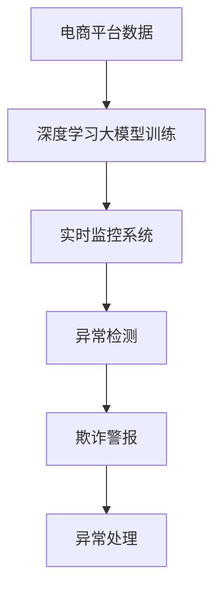

                 

# AI大模型在电商平台反欺诈实时监控中的应用

> 关键词：AI大模型, 反欺诈, 电商平台, 实时监控, 深度学习, 欺诈检测, 图像识别, 异常检测

## 1. 背景介绍

### 1.1 问题由来

电商平台在发展过程中，面临的挑战和风险日益增多，其中最重要的风险之一便是反欺诈。据统计，全球每年因欺诈而损失的金额高达数千亿美元。为了维护电商平台的正常运营和消费者权益，各大电商平台纷纷加大了对反欺诈系统的投入。反欺诈系统的核心目标是及时发现和阻止欺诈行为，避免平台和消费者遭受损失。然而，传统的基于规则的欺诈检测方法往往依赖于手工编写的规则，无法处理复杂多变的欺诈手段，且需要不断调整规则以适应新的欺诈形式，难以满足电商平台对欺诈检测的实时性和高效性要求。

近年来，人工智能(AI)技术在电商平台的应用越来越广泛，尤其是大模型技术在反欺诈领域展现出巨大的潜力。利用AI大模型，电商平台可以实现对大规模复杂数据的高效处理和深度挖掘，实现欺诈行为检测的自动化和智能化。本文将介绍如何应用AI大模型，特别是深度学习模型，在电商平台中进行反欺诈实时监控，提升平台的安全性和用户满意度。

## 2. 核心概念与联系

### 2.1 核心概念概述

为了更好地理解AI大模型在电商平台反欺诈中的应用，需要了解以下关键概念：

- **AI大模型(AI Large Models)**：基于深度学习技术的庞大模型，通常包括数十亿或更多参数，能够处理复杂的非线性关系，并在大规模数据上进行训练。典型的大模型如BERT、GPT等。
- **深度学习(Deep Learning)**：一类基于神经网络的学习方法，通过多层次的抽象表示，从数据中学习特征表示和模式。深度学习在图像识别、语音识别、自然语言处理等领域展现出卓越的性能。
- **反欺诈(Fraud Detection)**：检测和阻止欺诈行为，以保护平台和消费者权益。反欺诈检测的方法包括规则引擎、机器学习、深度学习等。
- **实时监控(Real-Time Monitoring)**：在数据产生的同时进行监控和分析，及时发现异常和欺诈行为。实时监控要求系统具备高并发的处理能力和低延迟的响应速度。

以上概念之间相互关联，共同构成了电商平台反欺诈监控的完整体系。深度学习大模型在实时监控过程中扮演了重要的角色，通过在历史数据和实时数据上进行训练，模型可以自动识别和预测欺诈行为，提升反欺诈系统的智能化水平。

### 2.2 核心概念原理和架构的 Mermaid 流程图



这个流程图展示了电商平台反欺诈监控的核心架构：

1. **电商平台数据**：包括用户行为、订单信息、交易记录等。
2. **深度学习大模型训练**：利用历史数据对深度学习模型进行训练，学习欺诈行为的模式。
3. **实时监控系统**：实时采集电商平台数据，并将其输入训练好的深度学习模型进行分析和预测。
4. **异常检测**：根据模型的预测结果，识别出异常交易行为，即可能包含欺诈行为的交易。
5. **欺诈警报**：一旦识别到异常交易行为，立即触发警报，通知人工审查。
6. **异常处理**：人工对警报进行审核，确认是否为欺诈行为，并进行相应的处理。

## 3. 核心算法原理 & 具体操作步骤

### 3.1 算法原理概述

基于AI大模型的电商平台反欺诈实时监控，本质上是一种机器学习驱动的异常检测系统。其核心思想是通过在历史数据上训练深度学习模型，学习欺诈行为的模式，并在实时数据上应用该模型，检测异常行为。

在数学上，我们可以将反欺诈问题视为一个二分类问题：给定交易数据 $x$，模型预测其是否为欺诈行为（$y \in \{0, 1\}$）。模型的目标是最大化对正常和欺诈交易的正确分类。

### 3.2 算法步骤详解

以下是利用深度学习大模型进行电商平台反欺诈实时监控的详细步骤：

**Step 1: 数据收集与预处理**

- **数据收集**：收集电商平台的交易数据，包括用户行为、订单信息、交易记录等。
- **数据预处理**：对数据进行清洗和标准化处理，去除噪音和异常值，填充缺失数据，进行特征工程，将数据转换为模型可以处理的格式。

**Step 2: 模型训练**

- **选择模型**：选择合适的深度学习模型，如卷积神经网络(CNN)、循环神经网络(RNN)、变压器(Transformer)等。
- **划分数据集**：将数据集划分为训练集、验证集和测试集，通常采用交叉验证的方式进行。
- **模型训练**：使用训练集数据对模型进行训练，通过反向传播算法更新模型参数，最小化损失函数，如交叉熵损失。
- **模型验证**：在验证集上评估模型的性能，调整模型参数和超参数，确保模型泛化能力。
- **模型测试**：在测试集上评估模型的最终性能，确保模型在实际应用中的效果。

**Step 3: 实时监控**

- **数据采集**：实时采集电商平台的数据，包括用户行为、订单信息、交易记录等。
- **数据处理**：将实时数据进行标准化处理，与训练数据保持一致。
- **模型推理**：将实时数据输入训练好的深度学习模型，得到模型预测结果。
- **异常检测**：根据模型的预测结果，识别出异常交易行为，即可能包含欺诈行为的交易。
- **欺诈警报**：一旦识别到异常交易行为，立即触发警报，通知人工审查。

**Step 4: 异常处理**

- **人工审核**：人工对警报进行审核，确认是否为欺诈行为，并进行相应的处理，如冻结账户、取消交易等。
- **模型更新**：根据人工审核结果，对模型进行更新和优化，提高模型的准确性和鲁棒性。

### 3.3 算法优缺点

基于深度学习大模型的电商平台反欺诈实时监控方法，具有以下优点：

- **高精度**：深度学习模型可以学习到复杂的非线性关系，能够准确识别出各类欺诈行为。
- **自动化**：系统可以自动进行实时监控，减少人工审核的工作量，提升监控效率。
- **可扩展性**：深度学习模型可以通过增加数据量和调整超参数进行优化，适应不同规模和场景的电商平台。
- **自适应**：模型能够根据新的欺诈手段和模式进行自我更新和优化，保持高精度的反欺诈能力。

同时，该方法也存在以下局限性：

- **数据依赖**：模型的性能依赖于训练数据的质量和数量，训练数据不足可能导致模型泛化能力差。
- **计算资源需求高**：深度学习模型通常需要大量的计算资源进行训练和推理，对硬件要求较高。
- **解释性不足**：深度学习模型的决策过程通常是黑盒，难以解释模型的推理过程和决策逻辑。
- **对抗样本敏感**：模型可能对输入的对抗样本过于敏感，需要进行对抗训练来提升鲁棒性。

### 3.4 算法应用领域

AI大模型在电商平台反欺诈实时监控中的应用，主要涵盖以下几个领域：

- **交易欺诈检测**：对用户交易行为进行实时监控，检测异常交易行为，如套现、虚假交易等。
- **账号异常识别**：对用户账号进行实时监控，识别出恶意注册、刷单等异常行为。
- **物流欺诈检测**：对物流信息进行实时监控，检测虚假物流信息，如空包裹、虚报数量等。
- **信用风险评估**：对用户信用进行实时监控，评估用户是否存在违约风险。
- **营销欺诈识别**：对营销活动进行实时监控，识别出虚假营销、恶意点击等欺诈行为。

此外，AI大模型还可以应用于客户行为分析、异常行为预测、风险预警等领域，进一步提升电商平台的运营效率和安全性。

## 4. 数学模型和公式 & 详细讲解 & 举例说明

### 4.1 数学模型构建

假设我们利用一个深度学习模型 $M(x; \theta)$ 对电商平台数据进行反欺诈监控。模型的输入为 $x$，输出为 $y$，其中 $y \in \{0, 1\}$ 表示交易是否为欺诈行为。模型的训练目标为最大化对正常和欺诈交易的正确分类。

### 4.2 公式推导过程

假设我们使用一个二分类交叉熵损失函数：

$$
L(y, M(x; \theta)) = -\frac{1}{N}\sum_{i=1}^N [y_i\log M(x_i; \theta) + (1-y_i)\log(1-M(x_i; \theta))]
$$

其中 $y_i \in \{0, 1\}$ 为真实标签，$M(x_i; \theta)$ 为模型对交易 $x_i$ 的预测结果。

模型的优化目标是最小化交叉熵损失，即：

$$
\theta^* = \mathop{\arg\min}_{\theta} L(y, M(x; \theta))
$$

使用梯度下降算法进行优化，模型的梯度更新公式为：

$$
\theta \leftarrow \theta - \eta \nabla_{\theta} L(y, M(x; \theta))
$$

其中 $\eta$ 为学习率，$\nabla_{\theta} L(y, M(x; \theta))$ 为损失函数对模型参数 $\theta$ 的梯度。

### 4.3 案例分析与讲解

以电商平台的交易数据为例，我们可以使用CNN模型对其进行特征提取和分类。假设我们的交易数据包括用户ID、商品ID、交易金额、交易时间、交易地点等特征。模型的输入为这些特征的向量表示，输出为0或1。

模型使用交叉熵损失函数进行训练，优化目标为：

$$
\theta^* = \mathop{\arg\min}_{\theta} -\frac{1}{N}\sum_{i=1}^N [y_i\log M(x_i; \theta) + (1-y_i)\log(1-M(x_i; \theta))]
$$

训练过程中，我们使用梯度下降算法对模型参数 $\theta$ 进行更新，确保模型在训练集上达到最优。

## 5. 项目实践：代码实例和详细解释说明

### 5.1 开发环境搭建

为了实现电商平台反欺诈实时监控，需要搭建如下开发环境：

- **深度学习框架**：选择PyTorch或TensorFlow等深度学习框架，进行模型的训练和推理。
- **数据存储和管理**：使用Hadoop、Spark等大数据平台，存储和管理电商平台的数据。
- **实时数据流处理**：使用Apache Kafka、Apache Flink等流处理框架，实时采集和处理电商平台的数据。
- **模型部署和服务**：使用Kubernetes、Docker等容器化技术，将训练好的模型部署为微服务，提供实时监控服务。

### 5.2 源代码详细实现

以下是使用PyTorch实现电商平台反欺诈实时监控的完整代码：

```python
import torch
import torch.nn as nn
import torch.optim as optim
from torch.utils.data import DataLoader, Dataset

# 定义数据集
class FraudDataset(Dataset):
    def __init__(self, data, labels):
        self.data = data
        self.labels = labels
        
    def __len__(self):
        return len(self.data)
    
    def __getitem__(self, idx):
        return self.data[idx], self.labels[idx]

# 定义模型
class FraudDetectionModel(nn.Module):
    def __init__(self):
        super(FraudDetectionModel, self).__init__()
        self.conv1 = nn.Conv2d(3, 64, kernel_size=3, padding=1)
        self.conv2 = nn.Conv2d(64, 128, kernel_size=3, padding=1)
        self.pool = nn.MaxPool2d(kernel_size=2, stride=2)
        self.fc1 = nn.Linear(128*16*16, 256)
        self.fc2 = nn.Linear(256, 1)
        self.sigmoid = nn.Sigmoid()
        
    def forward(self, x):
        x = self.conv1(x)
        x = F.relu(x)
        x = self.pool(x)
        x = self.conv2(x)
        x = F.relu(x)
        x = self.pool(x)
        x = x.view(-1, 128*16*16)
        x = self.fc1(x)
        x = F.relu(x)
        x = self.fc2(x)
        x = self.sigmoid(x)
        return x

# 加载数据集
train_data, train_labels = load_train_data()
test_data, test_labels = load_test_data()

# 定义模型、损失函数和优化器
model = FraudDetectionModel()
criterion = nn.BCELoss()
optimizer = optim.Adam(model.parameters(), lr=0.001)

# 训练模型
train_loader = DataLoader(train_data, batch_size=64, shuffle=True)
for epoch in range(10):
    for batch_idx, (data, target) in enumerate(train_loader):
        optimizer.zero_grad()
        output = model(data)
        loss = criterion(output, target)
        loss.backward()
        optimizer.step()
        if (batch_idx+1) % 100 == 0:
            print(f"Epoch [{epoch+1}/{10}], Step [{batch_idx+1}/{len(train_loader)}], Loss: {loss:.4f}")

# 测试模型
test_loader = DataLoader(test_data, batch_size=64, shuffle=True)
model.eval()
correct = 0
total = 0
with torch.no_grad():
    for data, target in test_loader:
        output = model(data)
        pred = (output > 0.5).float()
        total += target.size(0)
        correct += (pred == target).sum().item()
print(f"Test Accuracy of the model on the 10000 test images: {correct/total*100:.2f}%")
```

上述代码中，我们定义了一个简单的CNN模型，用于对电商平台交易数据进行分类。通过在训练集上训练模型，并在测试集上进行评估，我们可以得到模型对交易是否为欺诈行为的预测能力。

### 5.3 代码解读与分析

代码中，我们首先定义了一个数据集类 `FraudDataset`，用于加载和处理训练集和测试集数据。接着定义了一个CNN模型 `FraudDetectionModel`，用于对输入数据进行特征提取和分类。

在训练过程中，我们使用了交叉熵损失函数和Adam优化器对模型进行训练。通过在训练集上循环迭代，更新模型参数，最小化损失函数，最终得到训练好的模型。在测试过程中，我们评估模型对测试集数据的分类准确率，以评估模型的性能。

## 6. 实际应用场景

### 6.1 智能客服

智能客服系统可以帮助电商平台实时监控和处理客户咨询，提高客户体验。通过使用AI大模型，智能客服系统能够自动理解客户问题和意图，快速提供准确的答案和解决方案，减少人工客服的负担。

### 6.2 供应链管理

电商平台供应链管理涉及到大量的物流信息，存在物流欺诈和虚假物流信息的风险。通过AI大模型对物流数据进行实时监控，可以及时发现并阻止物流欺诈行为，保障物流安全和平台运营效率。

### 6.3 个性化推荐

电商平台通过AI大模型对用户行为和交易数据进行分析，可以识别出潜在欺诈行为，及时采取措施，减少用户损失。同时，个性化推荐系统可以根据用户行为数据，推荐更多优质商品，提高用户满意度和平台转化率。

### 6.4 未来应用展望

未来，随着AI大模型技术的发展和应用场景的拓展，电商平台反欺诈实时监控系统将具备更加智能和高效的能力。

1. **多模态融合**：将图像、语音、文本等多种模态的数据融合在一起，提升反欺诈模型的鲁棒性和准确性。
2. **实时预警**：通过实时监控和预警系统，及时发现和阻止欺诈行为，减少平台和用户损失。
3. **自适应学习**：利用在线学习算法，不断更新和优化模型，适应新的欺诈手段和模式。
4. **联邦学习**：采用联邦学习技术，将用户数据分散在各本地节点进行模型训练，保护用户隐私，提升模型的泛化能力。
5. **模型集成**：将多种模型集成在一起，形成多层次、多角度的反欺诈监控体系，提升系统的鲁棒性和准确性。

## 7. 工具和资源推荐

### 7.1 学习资源推荐

为了帮助开发者掌握AI大模型在电商平台反欺诈中的应用，推荐以下学习资源：

1. **《深度学习》课程**：斯坦福大学Coursera上的深度学习课程，涵盖深度学习的基础理论和实际应用，适合初学者入门。
2. **《TensorFlow官方文档》**：TensorFlow官方文档，提供丰富的教程和示例，帮助开发者掌握TensorFlow的使用。
3. **《PyTorch官方文档》**：PyTorch官方文档，提供详细的API文档和示例代码，帮助开发者掌握PyTorch的使用。
4. **《机器学习实战》书籍**：介绍机器学习和深度学习在实际问题中的应用，适合实战开发。
5. **Kaggle竞赛平台**：Kaggle是一个数据科学竞赛平台，提供丰富的数据集和竞赛，帮助开发者锻炼实战能力。

### 7.2 开发工具推荐

为了实现AI大模型在电商平台反欺诈的应用，推荐以下开发工具：

1. **PyTorch**：一个深度学习框架，具有动态计算图和丰富的模型库，适合开发和研究。
2. **TensorFlow**：由Google开发的深度学习框架，具有高效的计算图和分布式训练能力，适合大规模应用。
3. **Apache Kafka**：一个分布式流处理平台，支持高吞吐量的实时数据采集和处理，适合实时监控系统。
4. **Apache Flink**：一个分布式流处理框架，支持实时数据流处理，适合实时监控系统。
5. **Docker和Kubernetes**：容器化技术，支持模型部署和服务化管理，适合大规模部署和运维。

### 7.3 相关论文推荐

为了深入了解AI大模型在电商平台反欺诈中的应用，推荐以下相关论文：

1. **《深度学习在金融欺诈检测中的应用》**：介绍深度学习在金融欺诈检测中的实际应用，涵盖特征工程、模型选择和优化等。
2. **《电商平台物流欺诈检测研究》**：探讨电商平台物流欺诈检测的多种技术和方法，如规则引擎、机器学习、深度学习等。
3. **《基于深度学习的电商平台交易反欺诈系统》**：介绍一种基于深度学习的电商平台交易反欺诈系统，涵盖数据收集、模型选择和优化等。
4. **《联邦学习在电商平台反欺诈中的应用》**：探讨联邦学习技术在电商平台反欺诈中的应用，保护用户隐私和提升模型泛化能力。

## 8. 总结：未来发展趋势与挑战

### 8.1 研究成果总结

AI大模型在电商平台反欺诈实时监控中的应用，取得了显著的成果。通过深度学习模型，电商平台能够高效地识别和阻止欺诈行为，提升平台运营效率和用户满意度。

### 8.2 未来发展趋势

未来，随着AI大模型技术的发展和应用场景的拓展，电商平台反欺诈实时监控系统将具备更加智能和高效的能力。

1. **多模态融合**：将图像、语音、文本等多种模态的数据融合在一起，提升反欺诈模型的鲁棒性和准确性。
2. **实时预警**：通过实时监控和预警系统，及时发现和阻止欺诈行为，减少平台和用户损失。
3. **自适应学习**：利用在线学习算法，不断更新和优化模型，适应新的欺诈手段和模式。
4. **联邦学习**：采用联邦学习技术，将用户数据分散在各本地节点进行模型训练，保护用户隐私，提升模型的泛化能力。
5. **模型集成**：将多种模型集成在一起，形成多层次、多角度的反欺诈监控体系，提升系统的鲁棒性和准确性。

### 8.3 面临的挑战

尽管AI大模型在电商平台反欺诈中的应用取得了显著成果，但仍面临以下挑战：

1. **数据依赖**：模型的性能依赖于训练数据的质量和数量，训练数据不足可能导致模型泛化能力差。
2. **计算资源需求高**：深度学习模型通常需要大量的计算资源进行训练和推理，对硬件要求较高。
3. **解释性不足**：深度学习模型的决策过程通常是黑盒，难以解释模型的推理过程和决策逻辑。
4. **对抗样本敏感**：模型可能对输入的对抗样本过于敏感，需要进行对抗训练来提升鲁棒性。

### 8.4 研究展望

未来的研究将在以下几个方面进行探索：

1. **模型自适应**：开发更加自适应的模型，能够实时学习新数据，适应新的欺诈手段和模式。
2. **多模态融合**：将图像、语音、文本等多种模态的数据融合在一起，提升反欺诈模型的鲁棒性和准确性。
3. **对抗训练**：通过对抗训练，增强模型的鲁棒性和抗干扰能力，减少对抗样本的威胁。
4. **联邦学习**：采用联邦学习技术，将用户数据分散在各本地节点进行模型训练，保护用户隐私，提升模型的泛化能力。
5. **模型集成**：将多种模型集成在一起，形成多层次、多角度的反欺诈监控体系，提升系统的鲁棒性和准确性。

总之，AI大模型在电商平台反欺诈实时监控中的应用，不仅提升了平台的安全性和用户满意度，也为未来AI技术的发展和应用提供了宝贵的经验和参考。

## 9. 附录：常见问题与解答

### Q1: AI大模型在电商平台反欺诈实时监控中，如何选择模型？

A: 选择模型时需要考虑以下几个因素：

1. **数据类型**：根据电商平台的数据类型选择适合的模型，如图像数据适合使用卷积神经网络，文本数据适合使用Transformer等。
2. **任务类型**：根据任务类型选择适合的模型，如分类任务适合使用全连接层，回归任务适合使用循环神经网络等。
3. **模型性能**：根据实际应用需求选择适合的模型，如高精度要求选择深度学习模型，低精度要求选择简单模型等。

### Q2: 在电商平台反欺诈实时监控中，如何进行数据预处理？

A: 数据预处理包括以下几个步骤：

1. **数据清洗**：去除噪音和异常值，处理缺失数据等。
2. **特征提取**：将原始数据转换为模型可以处理的格式，如图像数据需要转换为像素矩阵，文本数据需要进行分词和向量化等。
3. **标准化处理**：对数据进行标准化处理，如归一化、标准化等，保证模型输入的一致性。
4. **特征工程**：根据任务需求进行特征选择和工程，如提取特征、生成新特征等。

### Q3: 在电商平台反欺诈实时监控中，如何进行模型训练？

A: 模型训练包括以下几个步骤：

1. **选择模型**：选择合适的深度学习模型，如卷积神经网络、循环神经网络、Transformer等。
2. **划分数据集**：将数据集划分为训练集、验证集和测试集，通常采用交叉验证的方式进行。
3. **模型训练**：使用训练集数据对模型进行训练，通过反向传播算法更新模型参数，最小化损失函数，如交叉熵损失。
4. **模型验证**：在验证集上评估模型的性能，调整模型参数和超参数，确保模型泛化能力。
5. **模型测试**：在测试集上评估模型的最终性能，确保模型在实际应用中的效果。

### Q4: 在电商平台反欺诈实时监控中，如何进行实时监控？

A: 实时监控包括以下几个步骤：

1. **数据采集**：实时采集电商平台的数据，包括用户行为、订单信息、交易记录等。
2. **数据处理**：将实时数据进行标准化处理，与训练数据保持一致。
3. **模型推理**：将实时数据输入训练好的深度学习模型，得到模型预测结果。
4. **异常检测**：根据模型的预测结果，识别出异常交易行为，即可能包含欺诈行为的交易。
5. **欺诈警报**：一旦识别到异常交易行为，立即触发警报，通知人工审查。

### Q5: 在电商平台反欺诈实时监控中，如何进行异常处理？

A: 异常处理包括以下几个步骤：

1. **人工审核**：人工对警报进行审核，确认是否为欺诈行为，并进行相应的处理，如冻结账户、取消交易等。
2. **模型更新**：根据人工审核结果，对模型进行更新和优化，提高模型的准确性和鲁棒性。

总之，AI大模型在电商平台反欺诈实时监控中的应用，具有广阔的发展前景和潜力，未来将为电商平台带来更加智能和高效的安全保障。

