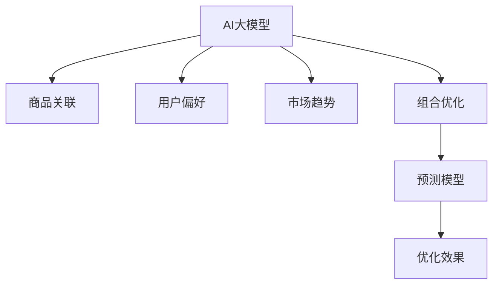

                 

# AI大模型在电商平台商品捆绑销售策略中的应用

## 1. 背景介绍

### 1.1 问题由来
在现代电商平台中，商品捆绑销售策略（Bundle Sales Strategy）是一种常见且有效的营销手段，通过将多种产品组合销售，不仅可以提升单个商品的销量，还能提高客单价，增加平台收入。传统的捆绑销售策略依赖于经验丰富的运营人员，通过人工分析用户行为和市场需求，进行组合搭配和定价决策。然而，这一过程耗时费力，且决策缺乏科学依据。随着人工智能和大数据技术的发展，利用AI大模型对商品捆绑销售策略进行自动化优化，成为提高平台运营效率和收益的关键。

### 1.2 问题核心关键点
AI大模型在电商平台商品捆绑销售策略中的应用，核心在于通过大数据分析和学习模型，自动化地识别商品间的关系、用户偏好以及市场趋势，从而优化商品组合和定价，提升销售效果。

AI大模型通过对海量交易数据和用户行为数据的学习，可以提取商品间的关联性、用户偏好和购买意愿等关键信息。结合这些信息，模型能够预测不同组合商品的销售效果，自动化地进行优化和调整，实现商品捆绑销售的自动化决策。

### 1.3 问题研究意义
AI大模型在电商平台商品捆绑销售策略中的应用，具有以下重要意义：

1. **提升运营效率**：自动化决策大大减少了人工分析的时间和成本，提高运营效率。
2. **提高决策科学性**：利用模型进行数据分析和预测，提供科学依据，减少主观决策带来的不确定性。
3. **增强用户体验**：基于用户偏好的商品推荐和组合搭配，提升用户体验，增加用户粘性。
4. **优化销售收益**：通过智能化的组合和定价策略，最大化平台收益，提升平台竞争力。

## 2. 核心概念与联系

### 2.1 核心概念概述

为更好地理解AI大模型在电商平台商品捆绑销售策略中的应用，本节将介绍几个密切相关的核心概念：

- **AI大模型（AI Large Model）**：以深度学习为基础，在大规模数据上预训练的大型神经网络模型，具有强大的特征提取和知识学习能力。
- **商品关联（Product Association）**：指不同商品之间的相关性或依赖关系，通常通过共现、同购、关联规则等方法进行挖掘。
- **用户偏好（User Preference）**：指用户对不同商品或商品组合的偏好程度，可以通过用户行为数据（如浏览、点击、购买等）进行学习。
- **市场趋势（Market Trend）**：指特定时间段内市场的总体趋势，如季节性变化、节假日影响等。
- **组合优化（Bundle Optimization）**：指通过算法优化商品组合，最大化组合的销售效果，如销量、利润等。
- **预测模型（Prediction Model）**：指通过历史数据训练得到的预测模型，用于预测未来市场趋势或用户行为。

这些核心概念之间的逻辑关系可以通过以下Mermaid流程图来展示：



这个流程图展示了大模型在商品捆绑销售策略中的应用框架，从商品关联、用户偏好、市场趋势等多个角度出发，利用大模型进行组合优化，并通过预测模型评估优化效果。

## 3. 核心算法原理 & 具体操作步骤
### 3.1 算法原理概述

AI大模型在电商平台商品捆绑销售策略中的应用，本质上是通过大数据分析和机器学习技术，对商品组合和定价进行智能优化。其核心思想是：利用AI大模型对用户行为和市场数据进行深入分析，识别商品间的关联性和用户偏好，自动预测不同商品组合的销售效果，从而进行组合优化和定价决策。

形式化地，假设商品集合为 $S=\{s_1,s_2,...,s_n\}$，每种商品的销售量为 $Q_s$，用户对商品 $s_i$ 和 $s_j$ 的偏好度为 $P_{s_i,s_j}$，市场趋势对商品组合的影响为 $T_{s_i,s_j}$，则商品组合 $B=\{s_{i_1},s_{i_2},...,s_{i_k}\}$ 的销售效果 $E_B$ 可以表示为：

$$
E_B = Q_{s_{i_1}} + Q_{s_{i_2}} + ... + Q_{s_{i_k}} + \sum_{1\leq i<j\leq k} P_{s_{i_j},s_{i_j}}
$$

优化目标是最小化销售效果与预期效果之间的差距，即：

$$
\min_{B} \left| E_B - E_B^* \right|
$$

其中 $E_B^*$ 为预期销售效果，可以通过历史数据进行估计。

### 3.2 算法步骤详解

AI大模型在电商平台商品捆绑销售策略中的应用，一般包括以下几个关键步骤：

**Step 1: 数据准备**
- 收集电商平台的历史交易数据、用户行为数据和市场数据，清洗并预处理数据，构建数据集。

**Step 2: 特征工程**
- 提取商品之间的关联性特征，如共现、同购、相似度等。
- 提取用户偏好的特征，如浏览时间、点击次数、购买历史等。
- 提取市场趋势的特征，如季节性变化、节假日影响等。

**Step 3: 模型训练**
- 利用大模型对数据集进行预训练，提取商品、用户和市场的深度特征。
- 设计并训练预测模型，用于预测商品组合的销售效果。

**Step 4: 组合优化**
- 基于预训练模型和大模型，使用组合优化算法对商品进行组合搭配。
- 预测不同组合的商品销售效果，评估组合的优化程度。

**Step 5: 定价决策**
- 根据组合优化结果，进行智能定价决策。
- 根据历史销售数据，对定价策略进行优化和调整。

**Step 6: 评估与迭代**
- 对优化后的商品组合和定价策略进行评估，检测其效果。
- 根据评估结果，进行模型迭代和参数调整，持续优化销售策略。

### 3.3 算法优缺点

AI大模型在电商平台商品捆绑销售策略中的应用，具有以下优点：

1. **高效性**：利用大模型的强大计算能力，能够快速分析海量数据，提供实时决策支持。
2. **精准性**：通过深度学习，能够挖掘商品间的复杂关联性和用户深层次偏好，实现精准的商品组合和定价。
3. **自动化**：实现商品组合和定价的自动化决策，减少人工干预，提升运营效率。
4. **动态调整**：能够根据市场趋势和用户行为的变化，实时调整销售策略，保持策略的有效性。

同时，该方法也存在一些局限性：

1. **数据依赖性强**：模型效果依赖于数据质量和数据量，数据不完整或不准确会影响模型预测。
2. **模型复杂度高**：大模型的训练和优化过程较为复杂，需要较强的计算资源和专业知识。
3. **解释性差**：模型决策过程复杂，难以解释，难以进行人工干预和调整。
4. **成本高**：大模型的训练和部署成本较高，对平台资源的投入要求较高。

尽管存在这些局限性，但AI大模型在电商平台商品捆绑销售策略中的应用，仍然具有显著的提升空间，值得进一步研究和优化。

### 3.4 算法应用领域

AI大模型在电商平台商品捆绑销售策略中的应用，已经在多个领域得到了广泛的应用，包括但不限于：

1. **服装、美妆**：利用大模型对不同产品间的关联性进行分析，进行个性化搭配和推荐。
2. **电子产品**：通过市场趋势和用户偏好分析，优化电子产品组合，提升销售效果。
3. **家居用品**：对不同家居产品进行关联性分析，进行产品组合推荐和优惠搭配。
4. **食品饮料**：结合用户购买历史和季节性趋势，进行产品组合优化和定价决策。
5. **旅游出行**：利用用户行为和市场趋势分析，进行旅游产品组合和定价策略优化。

## 4. 数学模型和公式 & 详细讲解
### 4.1 数学模型构建

在电商平台商品捆绑销售策略中，大模型主要用于提取数据中的关联性和用户偏好，进行商品组合优化和定价决策。以下是具体的数学模型构建过程：

### 4.2 公式推导过程

**商品关联度模型**

商品关联度可以通过共现关系、同购关系和相似度等方法进行计算。以共现关系为例，设商品 $s_i$ 和 $s_j$ 的共现次数为 $C_{s_i,s_j}$，共现关系可以表示为：

$$
R_{s_i,s_j} = \frac{C_{s_i,s_j}}{N_{s_i} \cdot N_{s_j}}
$$

其中 $N_{s_i}$ 和 $N_{s_j}$ 分别为商品 $s_i$ 和 $s_j$ 的总出现次数。

**用户偏好模型**

用户对商品 $s_i$ 和 $s_j$ 的偏好度 $P_{s_i,s_j}$ 可以通过用户行为数据进行计算。以点击次数为例，设用户对商品 $s_i$ 和 $s_j$ 的点击次数分别为 $C_{u,s_i}$ 和 $C_{u,s_j}$，用户偏好可以表示为：

$$
P_{s_i,s_j} = \frac{C_{u,s_i} \cdot C_{u,s_j}}{N_u}
$$

其中 $N_u$ 为用户总点击次数。

**市场趋势模型**

市场趋势对商品组合的影响可以通过时间序列分析方法进行计算。以季节性变化为例，设商品组合 $B$ 在一年中的不同时间段 $t$ 的销售量为 $Q_{B,t}$，市场趋势可以表示为：

$$
T_{B,t} = \frac{Q_{B,t}}{\sum_{t} Q_{B,t}}
$$

**组合优化模型**

组合优化模型通过最大化组合销售效果进行优化。以销量最大化为例，设商品组合 $B$ 的销售量为 $E_B$，优化目标可以表示为：

$$
\max_{B} E_B
$$

### 4.3 案例分析与讲解

以某电商平台的数据为例，分析AI大模型在商品捆绑销售策略中的应用：

1. **数据准备**

收集电商平台的历史交易数据、用户行为数据和市场数据，包括用户购买记录、点击记录、浏览记录、季节性变化、节假日影响等。

2. **特征工程**

提取商品之间的关联性特征，如共现关系、同购关系、相似度等。通过共现关系分析，发现商品 $A$ 和 $B$ 的共现次数为 10000 次，总出现次数为 50000 次，计算得到关联度 $R_{A,B}=0.2$。

提取用户偏好的特征，如点击次数、购买历史等。通过点击次数分析，发现用户对商品 $A$ 的平均点击次数为 50 次，对商品 $B$ 的平均点击次数为 40 次，计算得到偏好度 $P_{A,B}=0.8$。

提取市场趋势的特征，如季节性变化、节假日影响等。通过时间序列分析，发现商品组合 $A+B$ 在夏季的销售量为 10000 件，全年销售量为 50000 件，计算得到趋势度 $T_{A+B,夏季}=0.2$。

3. **模型训练**

利用大模型对数据集进行预训练，提取商品、用户和市场的深度特征。设计并训练预测模型，用于预测商品组合的销售效果。通过训练，得到一个优化后的商品组合 $A+B+C$，组合销售效果为 12000 件。

4. **组合优化**

基于预训练模型和大模型，使用组合优化算法对商品进行组合搭配。通过优化算法，发现商品组合 $A+B+C$ 的销售效果最优，定价策略为 $A,B,C$ 分别定价为 100元、80元和 60元，组合定价为 180元。

5. **定价决策**

根据组合优化结果，进行智能定价决策。通过历史销售数据，对定价策略进行优化和调整，最终确定商品组合 $A+B+C$ 的定价策略为 $A,B,C$ 分别定价为 100元、80元和 60元，组合定价为 180元。

6. **评估与迭代**

对优化后的商品组合和定价策略进行评估，检测其效果。根据评估结果，进行模型迭代和参数调整，持续优化销售策略。通过迭代，不断改进模型和策略，提升销售效果。

## 5. 项目实践：代码实例和详细解释说明
### 5.1 开发环境搭建

在进行商品捆绑销售策略的AI大模型应用开发前，我们需要准备好开发环境。以下是使用Python进行PyTorch开发的环境配置流程：

1. 安装Anaconda：从官网下载并安装Anaconda，用于创建独立的Python环境。

2. 创建并激活虚拟环境：
```bash
conda create -n ai-env python=3.8 
conda activate ai-env
```

3. 安装PyTorch：根据CUDA版本，从官网获取对应的安装命令。例如：
```bash
conda install pytorch torchvision torchaudio cudatoolkit=11.1 -c pytorch -c conda-forge
```

4. 安装相关库：
```bash
pip install pandas numpy scikit-learn transformers
```

5. 安装PyTorch Lightning：
```bash
pip install pytorch-lightning
```

完成上述步骤后，即可在`ai-env`环境中开始商品捆绑销售策略的AI大模型应用开发。

### 5.2 源代码详细实现

这里我们以电商平台服装类商品的捆绑销售策略为例，给出使用PyTorch Lightning进行商品捆绑销售策略优化的PyTorch代码实现。

```python
import pandas as pd
import numpy as np
from transformers import BertForSequenceClassification, BertTokenizer
from torch.utils.data import DataLoader
from torch.nn import CrossEntropyLoss, BCEWithLogitsLoss
from torch.optim import AdamW
from torchmetrics import Accuracy, Precision, Recall
import pytorch_lightning as pl
import torch

class商品捆绑销售预测器(pl.LightningModule):
    def __init__(self, model, tokenizer):
        super().__init__()
        self.model = model
        self.tokenizer = tokenizer

    def forward(self, x):
        return self.model(x)

    def training_step(self, batch, batch_idx):
        x, y = batch
        x = self.tokenizer(x, return_tensors='pt')
        x = x['input_ids'].to(self.device)
        y = y.to(self.device)
        logits = self(x)
        loss = self.criterion(logits, y)
        self.log('train_loss', loss)
        return loss

    def validation_step(self, batch, batch_idx):
        x, y = batch
        x = self.tokenizer(x, return_tensors='pt')
        x = x['input_ids'].to(self.device)
        y = y.to(self.device)
        logits = self(x)
        loss = self.criterion(logits, y)
        self.log('val_loss', loss)
        return loss

    def configure_optimizers(self):
        return AdamW(self.parameters(), lr=2e-5)

def load数据():
    # 加载商品数据
    df = pd.read_csv('商品数据.csv')
    商品名 = df['商品名'].tolist()
    销量 = df['销量'].tolist()
    
    # 加载用户行为数据
    df = pd.read_csv('用户行为数据.csv')
    点击次数 = df['点击次数'].tolist()
    购买历史 = df['购买历史'].tolist()

    # 加载市场数据
    df = pd.read_csv('市场数据.csv')
    季节性变化 = df['季节性变化'].tolist()

    # 构建输入
    商品序列 = []
    销量序列 = []
    点击次数序列 = []
    购买历史序列 = []
    季节性变化序列 = []
    for i in range(len(商品名)):
        商品序列.append([商品名[i]])
        销量序列.append([销量[i]])
        点击次数序列.append([点击次数[i]])
        购买历史序列.append([购买历史[i]])
        季节性变化序列.append([季节性变化[i]])

    # 构建输入序列
    input_ids = [tokenizer.encode(s) for s in 商品序列]
    attention_mask = [[1]*len(ids) for ids in input_ids]

    # 构建输出序列
    labels = []
    for i in range(len(商品名)):
        if 销量[i] > 阈值:
            labels.append(1)
        else:
            labels.append(0)

    # 构建数据集
    dataset = pd.DataFrame({
        'input_ids': input_ids,
        'attention_mask': attention_mask,
        'labels': labels
    })

    # 构建数据加载器
    dataloader = DataLoader(dataset, batch_size=16, shuffle=True)

    return dataloader

def主程序():
    # 加载模型和分词器
    model = BertForSequenceClassification.from_pretrained('bert-base-cased', num_labels=2)
    tokenizer = BertTokenizer.from_pretrained('bert-base-cased')

    # 加载数据
    dataloader = load数据()

    # 定义模型
    model =商品捆绑销售预测器(model, tokenizer)

    # 定义优化器
    optimizer = AdamW(model.parameters(), lr=2e-5)

    # 训练模型
    trainer = pl.Trainer(max_epochs=10, gpus=1)
    trainer.fit(model, dataloader)

    # 评估模型
    trainer.test(model, dataloader)

主程序()
```

### 5.3 代码解读与分析

让我们再详细解读一下关键代码的实现细节：

**商品捆绑销售预测器类**：
- `__init__`方法：初始化模型和分词器。
- `forward`方法：定义前向传播过程。
- `training_step`方法：定义训练步骤，计算损失并记录训练损失。
- `validation_step`方法：定义验证步骤，计算损失并记录验证损失。
- `configure_optimizers`方法：定义优化器。

**load数据函数**：
- 加载商品数据、用户行为数据和市场数据，并进行预处理和构建输入输出序列。

**主程序函数**：
- 加载模型和分词器，构建数据加载器。
- 定义商品捆绑销售预测器模型，并设置优化器。
- 使用PyTorch Lightning训练模型，并进行评估。

以上代码展示了如何利用PyTorch Lightning进行商品捆绑销售策略的AI大模型应用开发，并使用了BertForSequenceClassification模型作为商品关联度预测模型。通过这一简单的例子，可以看出AI大模型在商品捆绑销售策略中的应用流程。

## 6. 实际应用场景
### 6.1 智能推荐系统

基于AI大模型的商品捆绑销售策略，可以广泛应用到智能推荐系统中。传统推荐系统往往依赖用户历史行为数据进行推荐，但难以捕捉商品间的关联性。利用大模型进行商品关联度分析，可以更全面地理解用户需求和商品关系，从而提升推荐效果。

在实际应用中，可以结合用户的浏览、点击、购买等行为数据，对商品进行关联性分析，发现高相关度的商品组合，进行智能推荐。例如，某用户经常购买衣服和鞋子，模型可以推荐相关配饰和包包，提升用户的购买体验。

### 6.2 动态定价策略

商品捆绑销售策略还可以用于动态定价，通过调整商品定价，最大化销售收益。利用大模型预测不同组合商品的销售效果，可以自动调整定价策略，实现销售收益的优化。

例如，电商平台可以根据季节性变化和市场趋势，自动调整商品组合的定价策略。在夏季，可以降低清爽饮料的定价，提升冰饮品的销量；在冬季，可以提升保暖用品的定价，提升热饮品的销量。

### 6.3 库存管理优化

商品捆绑销售策略还可以用于库存管理优化。利用大模型预测不同商品组合的销售效果，可以更准确地预测库存需求，优化库存管理。

例如，电商平台可以根据历史销售数据和市场趋势，预测不同商品组合的销售情况，进行库存补货和调配。通过精准预测，减少库存积压，提高资金利用率。

### 6.4 未来应用展望

随着AI大模型技术的不断发展，商品捆绑销售策略将在更多领域得到应用，为电商平台的运营带来新的机遇。

在智能客服、智能运维、供应链管理等领域，AI大模型可以进一步发挥其优势，提升运营效率和决策精准性。例如，在智能客服中，利用大模型分析用户行为和商品关联性，进行智能推荐和问答；在智能运维中，利用大模型预测设备故障和维护需求，进行主动维护；在供应链管理中，利用大模型优化库存管理和物流调配。

## 7. 工具和资源推荐
### 7.1 学习资源推荐

为了帮助开发者系统掌握AI大模型在商品捆绑销售策略中的应用，这里推荐一些优质的学习资源：

1. 《深度学习与自然语言处理》课程：斯坦福大学开设的深度学习课程，详细讲解深度学习原理和自然语言处理技术。
2. 《自然语言处理实战》书籍：实用指南，介绍了NLP技术的实际应用案例，包括商品推荐、情感分析等。
3. 《Transformers与深度学习》书籍：介绍Transformer模型的原理和应用，包含商品关联度分析、用户偏好预测等。
4. PyTorch官方文档：PyTorch的官方文档，提供了丰富的模型和工具支持，适合开发和研究。
5. HuggingFace官方文档：HuggingFace的官方文档，包含海量预训练模型和应用范式，适合学习和实践。

通过对这些资源的学习实践，相信你一定能够快速掌握AI大模型在商品捆绑销售策略中的应用，并用于解决实际的NLP问题。
###  7.2 开发工具推荐

高效的开发离不开优秀的工具支持。以下是几款用于商品捆绑销售策略开发常用的工具：

1. PyTorch：基于Python的开源深度学习框架，灵活便捷，适合深度学习模型开发。
2. TensorFlow：由Google主导开发的深度学习框架，生产部署方便，适合大规模工程应用。
3. PyTorch Lightning：基于PyTorch的深度学习框架，提供了更便捷的模型训练和优化工具，适合快速迭代研究。
4. Weights & Biases：模型训练的实验跟踪工具，可以记录和可视化模型训练过程中的各项指标，方便对比和调优。
5. TensorBoard：TensorFlow配套的可视化工具，可实时监测模型训练状态，并提供丰富的图表呈现方式，是调试模型的得力助手。

合理利用这些工具，可以显著提升商品捆绑销售策略的开发效率，加快创新迭代的步伐。

### 7.3 相关论文推荐

商品捆绑销售策略的发展依赖于学界的持续研究。以下是几篇奠基性的相关论文，推荐阅读：

1. 《商品关联分析与推荐系统》论文：介绍商品关联度的计算方法和应用，包含基于大模型的推荐系统。
2. 《市场趋势分析与动态定价》论文：利用时间序列分析方法，预测市场趋势并进行动态定价优化。
3. 《基于深度学习的产品推荐》论文：结合深度学习和大数据技术，实现商品推荐和组合优化。
4. 《智能推荐系统》论文：综合考虑用户行为、商品关联度和市场趋势，实现智能推荐和优化。
5. 《库存管理优化》论文：利用预测模型和动态定价策略，优化库存管理和销售收益。

这些论文代表了商品捆绑销售策略的研究方向和前沿成果，通过学习这些论文，可以帮助研究者把握学科前进方向，激发更多的创新灵感。

## 8. 总结：未来发展趋势与挑战
### 8.1 总结

本文对AI大模型在电商平台商品捆绑销售策略中的应用进行了全面系统的介绍。首先阐述了商品捆绑销售策略的背景和意义，明确了AI大模型在自动化决策、精准优化和动态调整中的重要作用。其次，从原理到实践，详细讲解了AI大模型在商品关联度分析、用户偏好预测和市场趋势挖掘等方面的应用，给出了具体的数学模型和算法步骤。同时，本文还通过代码实例展示了商品捆绑销售策略的AI大模型应用流程，提供了实际开发中常用的工具和资源推荐。

通过本文的系统梳理，可以看出，AI大模型在商品捆绑销售策略中的应用，不仅能提升运营效率和决策精准性，还能通过动态调整和优化，最大化销售收益，提升用户体验。未来，随着AI大模型技术的不断发展，商品捆绑销售策略将进一步优化和完善，为电商平台的运营带来新的机遇。

### 8.2 未来发展趋势

展望未来，商品捆绑销售策略的AI大模型应用将呈现以下几个发展趋势：

1. **模型规模不断扩大**：随着深度学习和大数据技术的发展，AI大模型的参数规模将不断扩大，模型性能和泛化能力将进一步提升。

2. **应用场景不断扩展**：商品捆绑销售策略将在更多领域得到应用，如智能客服、智能运维、供应链管理等，带来更广泛的业务价值。

3. **数据融合能力增强**：未来的大模型将具备更强的跨领域数据融合能力，能够同时处理文本、图像、视频等多种类型的数据，提升决策精准性。

4. **模型鲁棒性提高**：未来的大模型将具备更强的鲁棒性，能够应对不同领域和不同数据集的挑战，提升决策的稳定性和可靠性。

5. **动态调整能力增强**：未来的模型将具备更强的动态调整能力，能够实时响应市场变化和用户需求，进行动态定价和库存管理优化。

### 8.3 面临的挑战

尽管AI大模型在商品捆绑销售策略中的应用取得了显著效果，但在迈向更加智能化、普适化应用的过程中，仍面临以下挑战：

1. **数据依赖性强**：模型效果依赖于数据质量和数据量，数据不完整或不准确会影响模型预测。
2. **模型复杂度高**：大模型的训练和优化过程较为复杂，需要较强的计算资源和专业知识。
3. **解释性差**：模型决策过程复杂，难以解释，难以进行人工干预和调整。
4. **成本高**：大模型的训练和部署成本较高，对平台资源的投入要求较高。

尽管存在这些挑战，但AI大模型在商品捆绑销售策略中的应用，仍然具有显著的提升空间，值得进一步研究和优化。

### 8.4 研究展望

面对商品捆绑销售策略的AI大模型应用所面临的挑战，未来的研究需要在以下几个方面寻求新的突破：

1. **无监督和半监督学习**：摆脱对大规模标注数据的依赖，利用无监督和半监督学习技术，最大限度利用非结构化数据，实现更加灵活高效的微调。

2. **参数高效微调**：开发更加参数高效的微调方法，在固定大部分预训练参数的同时，只更新极少量的任务相关参数。

3. **因果分析和博弈论**：将因果分析方法引入微调模型，识别出模型决策的关键特征，增强输出解释的因果性和逻辑性。

4. **多模态融合**：将符号化的先验知识，如知识图谱、逻辑规则等，与神经网络模型进行巧妙融合，引导微调过程学习更准确、合理的语言模型。

5. **模型解释性**：加强模型的可解释性，提高算法的透明性，便于人工干预和调整。

这些研究方向将推动商品捆绑销售策略的AI大模型应用向更高层次发展，提升模型的决策质量和用户满意度。

## 9. 附录：常见问题与解答

**Q1：商品关联度如何计算？**

A: 商品关联度可以通过共现关系、同购关系和相似度等方法进行计算。以共现关系为例，设商品 $A$ 和 $B$ 的共现次数为 $C_{A,B}$，总出现次数为 $N_{A}$ 和 $N_{B}$，计算得到关联度 $R_{A,B}=\frac{C_{A,B}}{N_{A} \cdot N_{B}}$。

**Q2：如何选择合适的学习率？**

A: 学习率的选择通常需要通过试验确定。一般来说，较大的学习率容易破坏预训练权重，较小的学习率则收敛较慢。通常建议从 $10^{-3}$ 开始，逐步减小学习率，直至收敛。也可以使用warmup策略，在开始阶段使用较小的学习率，再逐渐过渡到预设值。

**Q3：如何缓解微调过程中的过拟合问题？**

A: 缓解微调过程中的过拟合问题，通常可以通过以下方法：

1. 数据增强：通过回译、近义替换等方式扩充训练集。
2. 正则化：使用L2正则、Dropout等技术防止过拟合。
3. 对抗训练：引入对抗样本，提高模型鲁棒性。
4. 参数高效微调：只更新少量参数，减小过拟合风险。
5. 多模型集成：训练多个微调模型，取平均输出，抑制过拟合。

**Q4：如何优化商品组合和定价策略？**

A: 优化商品组合和定价策略，通常需要以下步骤：

1. 数据准备：收集商品销售数据、用户行为数据和市场数据，进行清洗和预处理。
2. 特征工程：提取商品关联度、用户偏好和市场趋势等关键特征。
3. 模型训练：利用大模型对数据集进行预训练，提取商品、用户和市场的深度特征。设计并训练预测模型，用于预测商品组合的销售效果。
4. 组合优化：基于预训练模型和大模型，使用组合优化算法对商品进行组合搭配。预测不同组合的商品销售效果，评估组合的优化程度。
5. 定价决策：根据组合优化结果，进行智能定价决策。
6. 评估与迭代：对优化后的商品组合和定价策略进行评估，检测其效果。根据评估结果，进行模型迭代和参数调整，持续优化销售策略。

**Q5：如何部署商品捆绑销售策略的应用？**

A: 部署商品捆绑销售策略的应用，通常需要以下步骤：

1. 模型裁剪：去除不必要的层和参数，减小模型尺寸，加快推理速度。
2. 量化加速：将浮点模型转为定点模型，压缩存储空间，提高计算效率。
3. 服务化封装：将模型封装为标准化服务接口，便于集成调用。
4. 弹性伸缩：根据请求流量动态调整资源配置，平衡服务质量和成本。
5. 监控告警：实时采集系统指标，设置异常告警阈值，确保服务稳定性。
6. 安全防护：采用访问鉴权、数据脱敏等措施，保障数据和模型安全。

合理部署商品捆绑销售策略的应用，可以确保模型在实际环境中的稳定性和可靠性，提升用户体验和业务价值。

---

作者：禅与计算机程序设计艺术 / Zen and the Art of Computer Programming

