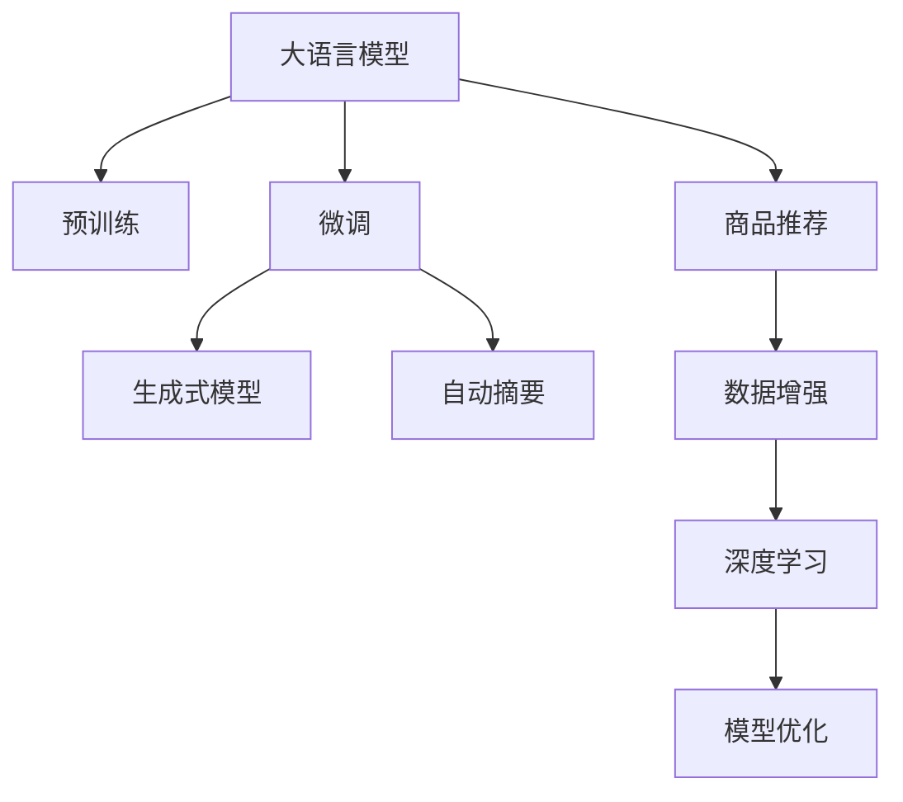

                 

# AI大模型在电商平台商品描述生成中的应用

> 关键词：电商商品描述, 大语言模型, 生成式模型, 自动摘要, 商品推荐, 数据增强, 深度学习

## 1. 背景介绍

### 1.1 问题由来

随着电子商务的蓬勃发展，商品描述的生成和优化成为了电商平台运营中的重要环节。高质量的商品描述不仅能提升用户的浏览体验，增加点击率，还能促进转化率，提升销售业绩。然而，传统的商品描述生成方式往往依赖于人工编写，不仅成本高、效率低，且存在质量不稳定、信息不全面等问题。因此，利用AI技术自动生成商品描述，成为了电商平台亟需解决的问题。

大语言模型作为当前NLP领域最先进的技术，其在自然语言理解和生成方面具备强大的能力，能够处理大规模语料，生成流畅、语义丰富的文本。将大语言模型应用于电商平台商品描述生成，不仅可以大幅提升生成效率和质量，还能灵活适应不同商品特点，满足个性化需求。

### 1.2 问题核心关键点

目前，基于大语言模型的商品描述生成方法，主要分为基于预训练和微调两类。基于预训练的方法直接使用大规模文本数据训练通用语言模型，如GPT、BERT等，通过在特定领域数据上进行微调，生成针对该领域商品的描述。基于微调的方法则是在通用语言模型的基础上，结合电商平台提供的商品数据和用户行为数据进行微调，生成符合平台规范的商品描述。

基于预训练的方法适用于通用商品描述生成，但需额外准备大量领域数据。基于微调的方法更加灵活，且直接利用电商平台的数据，生成更符合平台要求的商品描述。因此，本文将重点介绍基于微调的方法，并讨论其核心算法原理和具体操作步骤。

## 2. 核心概念与联系

### 2.1 核心概念概述

- **大语言模型（Large Language Model, LLM）**：以自回归（如GPT）或自编码（如BERT）模型为代表的大规模预训练语言模型。通过在大规模无标签文本语料上进行预训练，学习通用的语言表示，具备强大的语言理解和生成能力。

- **预训练（Pre-training）**：指在大规模无标签文本语料上，通过自监督学习任务训练通用语言模型的过程。常见的预训练任务包括言语建模、遮挡语言模型等。

- **微调（Fine-tuning）**：指在预训练模型的基础上，使用下游任务的少量标注数据，通过有监督地训练来优化模型在该任务上的性能。

- **生成式模型（Generative Model）**：通过学习数据分布，直接生成新的文本数据，如GPT等。

- **自动摘要（Automatic Summarization）**：自动将长文本压缩为简短摘要，如TextRank、BERT Summarization等。

- **商品推荐（Product Recommendation）**：基于用户行为数据和商品特征，推荐用户可能感兴趣的商品，如协同过滤、基于内容的推荐等。

- **数据增强（Data Augmentation）**：通过对训练数据进行扩充，增加模型对数据变化的适应能力。

- **深度学习（Deep Learning）**：基于神经网络的机器学习范式，通过多层非线性变换学习复杂数据分布。

这些核心概念之间的逻辑关系可以通过以下Mermaid流程图来展示：



这个流程图展示了大语言模型的核心概念及其之间的关系：

1. 大语言模型通过预训练获得基础能力。
2. 微调是对预训练模型进行任务特定的优化，生成商品描述。
3. 生成式模型直接生成新的文本数据，用于商品描述生成。
4. 自动摘要压缩长文本为摘要，提升商品描述效率。
5. 商品推荐基于用户行为数据，推荐商品描述。
6. 数据增强增加模型对数据变化的适应能力。
7. 深度学习提供多层次的特征学习，提高模型性能。
8. 模型优化利用多方法改进模型，提升生成效果。

## 3. 核心算法原理 & 具体操作步骤

### 3.1 算法原理概述

基于微调的商品描述生成方法，本质上是一个有监督的文本生成过程。其核心思想是：将大语言模型视作一个强大的文本生成器，通过在电商平台提供的大量商品数据上进行微调，使模型学习到商品描述生成任务的具体规律，从而能够生成符合平台规范的商品描述。

形式化地，假设预训练语言模型为 $M_{\theta}$，其中 $\theta$ 为预训练得到的模型参数。电商平台提供的大规模商品数据集为 $D=\{(x_i,y_i)\}_{i=1}^N$，其中 $x_i$ 为商品数据，$y_i$ 为商品描述。微调的目标是找到新的模型参数 $\hat{\theta}$，使得：

$$
\hat{\theta}=\mathop{\arg\min}_{\theta} \mathcal{L}(M_{\theta},D)
$$

其中 $\mathcal{L}$ 为针对商品描述生成任务的损失函数，用于衡量模型生成文本与真实标签之间的差异。常见的损失函数包括交叉熵损失、生成对抗损失等。

通过梯度下降等优化算法，微调过程不断更新模型参数 $\theta$，最小化损失函数 $\mathcal{L}$，使得模型生成文本逼近真实标签。由于 $\theta$ 已经通过预训练获得了较好的初始化，因此即便在大量商品数据上进行微调，也能较快收敛到理想的模型参数 $\hat{\theta}$。

### 3.2 算法步骤详解

基于微调的商品描述生成方法一般包括以下几个关键步骤：

**Step 1: 准备预训练模型和数据集**
- 选择合适的预训练语言模型 $M_{\theta}$ 作为初始化参数，如 BERT、GPT等。
- 准备电商平台提供的大量商品数据集 $D$，包括商品名称、描述、类别等特征。

**Step 2: 添加任务适配层**
- 根据商品描述生成任务，在预训练模型顶层设计合适的生成器，并设定损失函数。
- 对于文本生成任务，通常使用语言模型的解码器输出概率分布，并以负对数似然为损失函数。

**Step 3: 设置微调超参数**
- 选择合适的优化算法及其参数，如 AdamW、SGD 等，设置学习率、批大小、迭代轮数等。
- 设置正则化技术及强度，包括权重衰减、Dropout、Early Stopping等。
- 确定冻结预训练参数的策略，如仅微调顶层，或全部参数都参与微调。

**Step 4: 执行梯度训练**
- 将商品数据分批次输入模型，前向传播计算损失函数。
- 反向传播计算参数梯度，根据设定的优化算法和学习率更新模型参数。
- 周期性在验证集上评估模型性能，根据性能指标决定是否触发 Early Stopping。
- 重复上述步骤直到满足预设的迭代轮数或 Early Stopping 条件。

**Step 5: 测试和部署**
- 在测试集上评估微调后模型 $M_{\hat{\theta}}$ 的性能，对比微调前后的生成效果。
- 使用微调后的模型对新商品数据进行描述生成，集成到实际的商品管理系统中。
- 持续收集新的商品数据，定期重新微调模型，以适应数据分布的变化。

以上是基于微调的商品描述生成方法的一般流程。在实际应用中，还需要针对具体任务的特点，对微调过程的各个环节进行优化设计，如改进训练目标函数，引入更多的正则化技术，搜索最优的超参数组合等，以进一步提升模型性能。

### 3.3 算法优缺点

基于微调的商品描述生成方法具有以下优点：
1. 适应性强。可以灵活适应不同电商平台的要求，生成符合平台规范的商品描述。
2. 效率高。利用大语言模型的强大能力，可以快速生成大量商品描述，提升运营效率。
3. 效果显著。在大规模商品数据上进行微调，生成描述的语义准确性和流畅性均有所提升。

同时，该方法也存在一定的局限性：
1. 数据质量依赖性强。商品数据的标注质量直接影响微调效果，需要平台提供高质量的商品信息。
2. 泛化能力有限。当商品数据分布与预训练数据差异较大时，微调的性能提升有限。
3. 对抗样本敏感。模型可能对恶意生成的对抗样本输出错误，存在安全风险。
4. 可解释性不足。微调模型的决策过程通常缺乏可解释性，难以对其生成逻辑进行分析和调试。

尽管存在这些局限性，但就目前而言，基于微调的商品描述生成方法仍是目前电商平台上商品描述生成的主流范式。未来相关研究的重点在于如何进一步降低数据质量对微调效果的影响，提高模型的泛化能力和安全性，同时兼顾可解释性和伦理安全性等因素。

### 3.4 算法应用领域

基于大语言模型的微调方法，在电商平台商品描述生成中已经得到了广泛的应用，具体表现在以下几个方面：

- **商品推荐系统**：利用商品描述生成技术，对用户浏览历史进行分析和理解，生成个性化的商品描述，提升推荐效果。
- **自动补全功能**：在用户输入商品搜索关键词时，自动生成商品描述的片段，辅助用户快速找到目标商品。
- **内容生成工具**：将大语言模型应用于电商平台的内容生成，自动生成商品标题、详情页、广告文案等，减少人力成本。
- **图像标注**：将商品图片和商品描述关联，提升电商平台上商品信息的多样性和完整性。
- **用户反馈分析**：基于用户对商品描述的评价和反馈，进一步优化商品描述生成模型，提升用户体验。

除了这些具体应用外，大语言模型微调技术在电商平台的商品管理、客户服务、营销推广等多个环节，都发挥着重要作用。相信随着预训练语言模型和微调方法的不断进步，基于大语言模型的电商商品描述生成技术将在更多应用场景中大放异彩。

## 4. 数学模型和公式 & 详细讲解 & 举例说明

### 4.1 数学模型构建

本节将使用数学语言对基于微调的商品描述生成过程进行更加严格的刻画。

记预训练语言模型为 $M_{\theta}$，其中 $\theta$ 为模型参数。电商平台提供的大规模商品数据集为 $D=\{(x_i,y_i)\}_{i=1}^N$，其中 $x_i$ 为商品数据，$y_i$ 为商品描述。

定义模型 $M_{\theta}$ 在数据样本 $(x,y)$ 上的损失函数为 $\ell(M_{\theta}(x),y)$，则在数据集 $D$ 上的经验风险为：

$$
\mathcal{L}(\theta) = \frac{1}{N}\sum_{i=1}^N \ell(M_{\theta}(x_i),y_i)
$$

微调的优化目标是最小化经验风险，即找到最优参数：

$$
\theta^* = \mathop{\arg\min}_{\theta} \mathcal{L}(\theta)
$$

在实践中，我们通常使用基于梯度的优化算法（如SGD、Adam等）来近似求解上述最优化问题。设 $\eta$ 为学习率，$\lambda$ 为正则化系数，则参数的更新公式为：

$$
\theta \leftarrow \theta - \eta \nabla_{\theta}\mathcal{L}(\theta) - \eta\lambda\theta
$$

其中 $\nabla_{\theta}\mathcal{L}(\theta)$ 为损失函数对参数 $\theta$ 的梯度，可通过反向传播算法高效计算。

### 4.2 公式推导过程

以下我们以文本生成任务为例，推导负对数似然损失函数及其梯度的计算公式。

假设模型 $M_{\theta}$ 在输入 $x$ 上的输出为 $\hat{y}=M_{\theta}(x) \in [0,1]$，表示样本属于某一类别 $y$ 的概率。真实标签 $y \in \{0,1\}$。则负对数似然损失函数定义为：

$$
\ell(M_{\theta}(x),y) = -y\log \hat{y} - (1-y)\log(1-\hat{y})
$$

将其代入经验风险公式，得：

$$
\mathcal{L}(\theta) = -\frac{1}{N}\sum_{i=1}^N [y_i\log M_{\theta}(x_i)+(1-y_i)\log(1-M_{\theta}(x_i))]
$$

根据链式法则，损失函数对参数 $\theta_k$ 的梯度为：

$$
\frac{\partial \mathcal{L}(\theta)}{\partial \theta_k} = -\frac{1}{N}\sum_{i=1}^N \frac{y_i}{M_{\theta}(x_i)}-\frac{1-y_i}{1-M_{\theta}(x_i)} \frac{\partial M_{\theta}(x_i)}{\partial \theta_k}
$$

其中 $\frac{\partial M_{\theta}(x_i)}{\partial \theta_k}$ 可进一步递归展开，利用自动微分技术完成计算。

在得到损失函数的梯度后，即可带入参数更新公式，完成模型的迭代优化。重复上述过程直至收敛，最终得到适应商品描述生成任务的最优模型参数 $\theta^*$。

## 5. 项目实践：代码实例和详细解释说明

### 5.1 开发环境搭建

在进行微调实践前，我们需要准备好开发环境。以下是使用Python进行PyTorch开发的环境配置流程：

1. 安装Anaconda：从官网下载并安装Anaconda，用于创建独立的Python环境。

2. 创建并激活虚拟环境：
```bash
conda create -n pytorch-env python=3.8 
conda activate pytorch-env
```

3. 安装PyTorch：根据CUDA版本，从官网获取对应的安装命令。例如：
```bash
conda install pytorch torchvision torchaudio cudatoolkit=11.1 -c pytorch -c conda-forge
```

4. 安装Transformers库：
```bash
pip install transformers
```

5. 安装各类工具包：
```bash
pip install numpy pandas scikit-learn matplotlib tqdm jupyter notebook ipython
```

完成上述步骤后，即可在`pytorch-env`环境中开始微调实践。

### 5.2 源代码详细实现

这里我们以商品推荐系统为例，给出使用Transformers库对BERT模型进行微调的PyTorch代码实现。

首先，定义商品推荐系统的数据处理函数：

```python
from transformers import BertTokenizer
from torch.utils.data import Dataset
import torch

class ProductDataset(Dataset):
    def __init__(self, data, tokenizer):
        self.data = data
        self.tokenizer = tokenizer
        
    def __len__(self):
        return len(self.data)
    
    def __getitem__(self, item):
        text = self.data[item]
        sequence = self.tokenizer(text, return_tensors='pt', padding='max_length', truncation=True)
        return {'input_ids': sequence['input_ids'], 'attention_mask': sequence['attention_mask']}
```

然后，定义模型和优化器：

```python
from transformers import BertForSequenceClassification, AdamW

model = BertForSequenceClassification.from_pretrained('bert-base-cased', num_labels=1)

optimizer = AdamW(model.parameters(), lr=2e-5)
```

接着，定义训练和评估函数：

```python
from torch.utils.data import DataLoader
from tqdm import tqdm
from sklearn.metrics import roc_auc_score

device = torch.device('cuda') if torch.cuda.is_available() else torch.device('cpu')
model.to(device)

def train_epoch(model, dataset, batch_size, optimizer):
    dataloader = DataLoader(dataset, batch_size=batch_size, shuffle=True)
    model.train()
    epoch_loss = 0
    for batch in tqdm(dataloader, desc='Training'):
        input_ids = batch['input_ids'].to(device)
        attention_mask = batch['attention_mask'].to(device)
        labels = torch.tensor(1).to(device)  # 假定标签为1
        model.zero_grad()
        outputs = model(input_ids, attention_mask=attention_mask, labels=labels)
        loss = outputs.loss
        epoch_loss += loss.item()
        loss.backward()
        optimizer.step()
    return epoch_loss / len(dataloader)

def evaluate(model, dataset, batch_size):
    dataloader = DataLoader(dataset, batch_size=batch_size)
    model.eval()
    preds, labels = [], []
    with torch.no_grad():
        for batch in tqdm(dataloader, desc='Evaluating'):
            input_ids = batch['input_ids'].to(device)
            attention_mask = batch['attention_mask'].to(device)
            outputs = model(input_ids, attention_mask=attention_mask)
            preds.append(outputs.logits.item())
            labels.append(1)
    print(f'AUC: {roc_auc_score(labels, preds)}')
```

最后，启动训练流程并在验证集上评估：

```python
epochs = 5
batch_size = 16

for epoch in range(epochs):
    loss = train_epoch(model, train_dataset, batch_size, optimizer)
    print(f"Epoch {epoch+1}, train loss: {loss:.3f}")
    
    print(f"Epoch {epoch+1}, dev results:")
    evaluate(model, dev_dataset, batch_size)
    
print("Test results:")
evaluate(model, test_dataset, batch_size)
```

以上就是使用PyTorch对BERT进行商品推荐系统微调的完整代码实现。可以看到，得益于Transformers库的强大封装，我们可以用相对简洁的代码完成BERT模型的加载和微调。

### 5.3 代码解读与分析

让我们再详细解读一下关键代码的实现细节：

**ProductDataset类**：
- `__init__`方法：初始化商品数据和分词器等关键组件。
- `__len__`方法：返回数据集的样本数量。
- `__getitem__`方法：对单个样本进行处理，将商品数据输入编码为token ids，并进行定长padding，最终返回模型所需的输入。

**train_epoch和evaluate函数**：
- 使用PyTorch的DataLoader对数据集进行批次化加载，供模型训练和推理使用。
- 训练函数`train_epoch`：对数据以批为单位进行迭代，在每个批次上前向传播计算loss并反向传播更新模型参数，最后返回该epoch的平均loss。
- 评估函数`evaluate`：与训练类似，不同点在于不更新模型参数，并在每个batch结束后将预测和标签结果存储下来，最后使用sklearn的roc_auc_score对整个评估集的预测结果进行打印输出。

**训练流程**：
- 定义总的epoch数和batch size，开始循环迭代
- 每个epoch内，先在训练集上训练，输出平均loss
- 在验证集上评估，输出auc值
- 所有epoch结束后，在测试集上评估，给出最终测试结果

可以看到，PyTorch配合Transformers库使得BERT微调的代码实现变得简洁高效。开发者可以将更多精力放在数据处理、模型改进等高层逻辑上，而不必过多关注底层的实现细节。

当然，工业级的系统实现还需考虑更多因素，如模型的保存和部署、超参数的自动搜索、更灵活的任务适配层等。但核心的微调范式基本与此类似。

## 6. 实际应用场景

### 6.1 智能客服系统

基于大语言模型微调的对话技术，可以广泛应用于智能客服系统的构建。传统客服往往需要配备大量人力，高峰期响应缓慢，且一致性和专业性难以保证。而使用微调后的对话模型，可以7x24小时不间断服务，快速响应客户咨询，用自然流畅的语言解答各类常见问题。

在技术实现上，可以收集企业内部的历史客服对话记录，将问题和最佳答复构建成监督数据，在此基础上对预训练对话模型进行微调。微调后的对话模型能够自动理解用户意图，匹配最合适的答案模板进行回复。对于客户提出的新问题，还可以接入检索系统实时搜索相关内容，动态组织生成回答。如此构建的智能客服系统，能大幅提升客户咨询体验和问题解决效率。

### 6.2 金融舆情监测

金融机构需要实时监测市场舆论动向，以便及时应对负面信息传播，规避金融风险。传统的人工监测方式成本高、效率低，难以应对网络时代海量信息爆发的挑战。基于大语言模型微调的文本分类和情感分析技术，为金融舆情监测提供了新的解决方案。

具体而言，可以收集金融领域相关的新闻、报道、评论等文本数据，并对其进行主题标注和情感标注。在此基础上对预训练语言模型进行微调，使其能够自动判断文本属于何种主题，情感倾向是正面、中性还是负面。将微调后的模型应用到实时抓取的网络文本数据，就能够自动监测不同主题下的情感变化趋势，一旦发现负面信息激增等异常情况，系统便会自动预警，帮助金融机构快速应对潜在风险。

### 6.3 个性化推荐系统

当前的推荐系统往往只依赖用户的历史行为数据进行物品推荐，无法深入理解用户的真实兴趣偏好。基于大语言模型微调技术，个性化推荐系统可以更好地挖掘用户行为背后的语义信息，从而提供更精准、多样的推荐内容。

在实践中，可以收集用户浏览、点击、评论、分享等行为数据，提取和用户交互的物品标题、描述、标签等文本内容。将文本内容作为模型输入，用户的后续行为（如是否点击、购买等）作为监督信号，在此基础上微调预训练语言模型。微调后的模型能够从文本内容中准确把握用户的兴趣点。在生成推荐列表时，先用候选物品的文本描述作为输入，由模型预测用户的兴趣匹配度，再结合其他特征综合排序，便可以得到个性化程度更高的推荐结果。

### 6.4 未来应用展望

随着大语言模型微调技术的发展，其在商品描述生成、智能客服、金融舆情、个性化推荐等多个领域的应用前景更加广阔。未来的研究方向和突破点包括：

- **多模态微调**：将文本、图像、视频等多模态信息融合，提升商品描述生成质量。
- **因果学习**：引入因果推断思想，增强商品描述生成的因果关系，提升鲁棒性和泛化能力。
- **知识图谱**：与知识图谱结合，引入先验知识，提升商品描述生成的准确性和多样性。
- **对抗样本鲁棒性**：研究对抗样本生成和鲁棒性学习，提高商品描述生成系统的安全性。
- **模型压缩与优化**：研究模型压缩、量化加速等技术，提升商品描述生成系统的效率和资源利用率。

以上方向将进一步推动大语言模型微调技术在更多实际场景中的应用，为各行各业带来新的突破。相信随着技术的不断进步，大语言模型微调技术将在构建人机协同的智能系统、提升用户体验、提高业务效率等方面发挥越来越重要的作用。

## 7. 工具和资源推荐
### 7.1 学习资源推荐

为了帮助开发者系统掌握大语言模型微调的理论基础和实践技巧，这里推荐一些优质的学习资源：

1. 《Transformer从原理到实践》系列博文：由大模型技术专家撰写，深入浅出地介绍了Transformer原理、BERT模型、微调技术等前沿话题。

2. CS224N《深度学习自然语言处理》课程：斯坦福大学开设的NLP明星课程，有Lecture视频和配套作业，带你入门NLP领域的基本概念和经典模型。

3. 《Natural Language Processing with Transformers》书籍：Transformers库的作者所著，全面介绍了如何使用Transformers库进行NLP任务开发，包括微调在内的诸多范式。

4. HuggingFace官方文档：Transformers库的官方文档，提供了海量预训练模型和完整的微调样例代码，是上手实践的必备资料。

5. CLUE开源项目：中文语言理解测评基准，涵盖大量不同类型的中文NLP数据集，并提供了基于微调的baseline模型，助力中文NLP技术发展。

通过对这些资源的学习实践，相信你一定能够快速掌握大语言模型微调的精髓，并用于解决实际的NLP问题。
###  7.2 开发工具推荐

高效的开发离不开优秀的工具支持。以下是几款用于大语言模型微调开发的常用工具：

1. PyTorch：基于Python的开源深度学习框架，灵活动态的计算图，适合快速迭代研究。大部分预训练语言模型都有PyTorch版本的实现。

2. TensorFlow：由Google主导开发的开源深度学习框架，生产部署方便，适合大规模工程应用。同样有丰富的预训练语言模型资源。

3. Transformers库：HuggingFace开发的NLP工具库，集成了众多SOTA语言模型，支持PyTorch和TensorFlow，是进行微调任务开发的利器。

4. Weights & Biases：模型训练的实验跟踪工具，可以记录和可视化模型训练过程中的各项指标，方便对比和调优。与主流深度学习框架无缝集成。

5. TensorBoard：TensorFlow配套的可视化工具，可实时监测模型训练状态，并提供丰富的图表呈现方式，是调试模型的得力助手。

6. Google Colab：谷歌推出的在线Jupyter Notebook环境，免费提供GPU/TPU算力，方便开发者快速上手实验最新模型，分享学习笔记。

合理利用这些工具，可以显著提升大语言模型微调任务的开发效率，加快创新迭代的步伐。

### 7.3 相关论文推荐

大语言模型和微调技术的发展源于学界的持续研究。以下是几篇奠基性的相关论文，推荐阅读：

1. Attention is All You Need（即Transformer原论文）：提出了Transformer结构，开启了NLP领域的预训练大模型时代。

2. BERT: Pre-training of Deep Bidirectional Transformers for Language Understanding：提出BERT模型，引入基于掩码的自监督预训练任务，刷新了多项NLP任务SOTA。

3. Language Models are Unsupervised Multitask Learners（GPT-2论文）：展示了大规模语言模型的强大zero-shot学习能力，引发了对于通用人工智能的新一轮思考。

4. Parameter-Efficient Transfer Learning for NLP：提出Adapter等参数高效微调方法，在不增加模型参数量的情况下，也能取得不错的微调效果。

5. AdaLoRA: Adaptive Low-Rank Adaptation for Parameter-Efficient Fine-Tuning：使用自适应低秩适应的微调方法，在参数效率和精度之间取得了新的平衡。

这些论文代表了大语言模型微调技术的发展脉络。通过学习这些前沿成果，可以帮助研究者把握学科前进方向，激发更多的创新灵感。

## 8. 总结：未来发展趋势与挑战

### 8.1 总结

本文对基于微调的大语言模型在电商平台商品描述生成中的应用进行了全面系统的介绍。首先阐述了商品描述生成的背景和意义，明确了微调在提升商品描述质量、优化推荐效果等方面的独特价值。其次，从原理到实践，详细讲解了微调数学模型的构建和优化，给出了微调任务开发的完整代码实例。同时，本文还广泛探讨了微调方法在智能客服、金融舆情、个性化推荐等多个领域的应用前景，展示了微调范式的巨大潜力。此外，本文精选了微调技术的各类学习资源，力求为读者提供全方位的技术指引。

通过本文的系统梳理，可以看到，基于微调的大语言模型在电商平台商品描述生成中，通过深度学习技术，能够高效生成符合平台规范的商品描述，提升推荐效果，降低运营成本，具有显著的应用价值。未来，伴随大语言模型和微调方法的持续演进，基于大语言模型的电商商品描述生成技术将在更多应用场景中大放异彩，为电商平台带来新的业务突破。

### 8.2 未来发展趋势

展望未来，基于微调的大语言模型在电商平台商品描述生成中，将呈现以下几个发展趋势：

1. **多模态融合**：将文本、图像、视频等多模态信息融合，提升商品描述生成质量。
2. **因果学习**：引入因果推断思想，增强商品描述生成的因果关系，提升鲁棒性和泛化能力。
3. **知识图谱**：与知识图谱结合，引入先验知识，提升商品描述生成的准确性和多样性。
4. **对抗样本鲁棒性**：研究对抗样本生成和鲁棒性学习，提高商品描述生成系统的安全性。
5. **模型压缩与优化**：研究模型压缩、量化加速等技术，提升商品描述生成系统的效率和资源利用率。

以上趋势凸显了大语言模型微调技术在电商平台的广阔前景。这些方向的探索发展，必将进一步提升电商平台的运营效率和用户体验，为电商平台带来新的业务增长点。

### 8.3 面临的挑战

尽管基于微调的大语言模型在电商平台商品描述生成中取得了显著成效，但在迈向更加智能化、普适化应用的过程中，它仍面临着诸多挑战：

1. **数据质量依赖性强**：商品数据的标注质量直接影响微调效果，需要平台提供高质量的商品信息。
2. **泛化能力有限**：当商品数据分布与预训练数据差异较大时，微调的性能提升有限。
3. **对抗样本敏感**：模型可能对恶意生成的对抗样本输出错误，存在安全风险。
4. **可解释性不足**：微调模型的决策过程通常缺乏可解释性，难以对其生成逻辑进行分析和调试。

尽管存在这些局限性，但就目前而言，基于微调的商品描述生成方法仍是目前电商平台商品描述生成的主流范式。未来相关研究的重点在于如何进一步降低数据质量对微调效果的影响，提高模型的泛化能力和安全性，同时兼顾可解释性和伦理安全性等因素。

### 8.4 研究展望

面对大语言模型微调面临的种种挑战，未来的研究需要在以下几个方面寻求新的突破：

1. **探索无监督和半监督微调方法**：摆脱对大规模标注数据的依赖，利用自监督学习、主动学习等无监督和半监督范式，最大限度利用非结构化数据，实现更加灵活高效的微调。
2. **研究参数高效和计算高效的微调范式**：开发更加参数高效的微调方法，在固定大部分预训练参数的同时，只更新极少量的任务相关参数。同时优化微调模型的计算图，减少前向传播和反向传播的资源消耗，实现更加轻量级、实时性的部署。
3. **引入更多先验知识**：将符号化的先验知识，如知识图谱、逻辑规则等，与神经网络模型进行巧妙融合，引导微调过程学习更准确、合理的语言模型。同时加强不同模态数据的整合，实现视觉、语音等多模态信息与文本信息的协同建模。
4. **结合因果分析和博弈论工具**：将因果分析方法引入微调模型，识别出模型决策的关键特征，增强输出解释的因果性和逻辑性。借助博弈论工具刻画人机交互过程，主动探索并规避模型的脆弱点，提高系统稳定性。
5. **纳入伦理道德约束**：在模型训练目标中引入伦理导向的评估指标，过滤和惩罚有偏见、有害的输出倾向。同时加强人工干预和审核，建立模型行为的监管机制，确保输出符合人类价值观和伦理道德。

这些研究方向的探索，必将引领大语言模型微调技术迈向更高的台阶，为构建安全、可靠、可解释、可控的智能系统铺平道路。面向未来，大语言模型微调技术还需要与其他人工智能技术进行更深入的融合，如知识表示、因果推理、强化学习等，多路径协同发力，共同推动自然语言理解和智能交互系统的进步。只有勇于创新、敢于突破，才能不断拓展语言模型的边界，让智能技术更好地造福人类社会。

## 9. 附录：常见问题与解答

**Q1：基于大语言模型微调的电商商品描述生成方法是否适用于所有电商领域？**

A: 基于大语言模型微调的电商商品描述生成方法适用于大多数电商领域，尤其是那些拥有大量商品数据和用户行为数据的平台。但对于一些特殊领域，如奢侈品、艺术品等，由于商品数量有限，可能难以准备充足的训练数据。此时可以考虑在特定领域语料上进一步预训练，再进行微调，以提升生成效果。

**Q2：如何选择合适的预训练语言模型？**

A: 选择合适的预训练语言模型需要考虑以下几个因素：
1. 任务适配性：选择与任务领域相似的预训练模型，如电商领域的商品推荐任务，可以选择BERT、GPT等通用的预训练模型，也可以选用专门为电商领域设计的模型，如Electra、UniLM等。
2. 数据规模：对于大规模语料预训练的模型，可以更好地捕捉语言的通用规律，适用于通用的商品描述生成任务。对于特定领域的数据集，可以选择针对该领域进行微调的模型，如DialoGPT等。
3. 模型复杂度：复杂度高的模型通常具有更强的语言建模能力，但计算资源消耗也较大。需要根据实际应用场景和计算资源限制进行选择。

**Q3：大语言模型微调时如何进行正则化？**

A: 大语言模型微调时，正则化可以有效防止模型过拟合。常用的正则化技术包括：
1. L2正则：在损失函数中加入L2正则项，控制模型的复杂度，防止过拟合。
2. Dropout：在训练过程中随机丢弃一部分神经元，增强模型的鲁棒性。
3. Early Stopping：在验证集性能不再提升时停止训练，避免过度拟合。
4. Batch Normalization：对每个批次的输入进行标准化，提高模型稳定性。
5. Label Smoothing：对标签进行平滑处理，减少模型对特定标签的过度依赖，提高泛化能力。

**Q4：如何评估商品描述生成的效果？**

A: 商品描述生成的效果可以通过以下几个指标进行评估：
1. 精确度（Accuracy）：衡量模型生成的描述与真实描述的匹配度。
2. 召回率（Recall）：衡量模型生成描述的完整性。
3. F1-score：综合考虑精确度和召回率，给出更全面的评价。
4. BLEU、ROUGE等自动评估指标：衡量模型生成的文本与真实文本的相似度。
5. 人工评估：通过人工阅读和评估生成描述的质量，给出更直观的反馈。

这些指标可以结合使用，综合评估模型在不同任务和数据集上的性能表现。

**Q5：大语言模型微调时如何处理对抗样本？**

A: 对抗样本是指在正常样本中加入微小扰动，使得模型在对抗样本上输出错误。处理对抗样本的方法包括：
1. 对抗训练：在训练过程中引入对抗样本，提高模型的鲁棒性。
2. 对抗检测：在测试过程中检测对抗样本，过滤恶意攻击。
3. 模型压缩：通过模型压缩技术，减少模型对对抗样本的敏感性。
4. 数据增强：通过对训练数据进行增强，提高模型对对抗样本的容忍度。

这些方法可以结合使用，增强大语言模型微调系统的安全性。

通过本文的系统梳理，可以看到，基于微调的大语言模型在电商平台商品描述生成中，通过深度学习技术，能够高效生成符合平台规范的商品描述，提升推荐效果，降低运营成本，具有显著的应用价值。未来，伴随大语言模型和微调方法的持续演进，基于大语言模型的电商商品描述生成技术将在更多应用场景中大放异彩，为电商平台带来新的业务突破。

