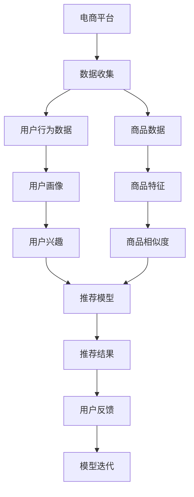

                 

## 1. 背景介绍

随着人工智能技术的快速发展，电商平台已经逐步意识到利用人工智能技术优化其推荐系统，提升用户购物体验和转化率的重要性。AI大模型，特别是基于自监督学习的预训练模型，已经在电商平台的商品推荐系统中扮演了关键角色。这些大模型通过在大规模无标签文本数据上预训练，学习到丰富的语言知识和用户行为规律，并在下游任务上进行微调，显著提高了推荐的精准度和个性化水平。

## 2. 核心概念与联系

### 2.1 核心概念概述

为了更好地理解AI大模型在电商平台商品组合推荐中的应用，首先需要了解一些核心概念：

- **大语言模型**：如GPT、BERT等，通过在大规模无标签文本上预训练，学习通用语言表示。
- **预训练**：使用无监督学习方法在大量文本数据上训练模型，使其能够提取文本中的语义和语法信息。
- **微调**：在预训练模型的基础上，使用有标签数据进行微调，使其能够适应特定的推荐任务。
- **商品推荐系统**：通过分析用户历史行为和偏好，向用户推荐可能感兴趣的商品。
- **组合推荐**：不仅推荐单个商品，还推荐一组商品组合，使用户可以同时购买多件商品。

### 2.2 核心概念原理和架构的 Mermaid 流程图



**图2.1:** AI大模型在电商平台商品推荐中的应用架构

## 3. 核心算法原理 & 具体操作步骤

### 3.1 算法原理概述

AI大模型在商品推荐中的应用主要依赖于两个关键步骤：预训练和微调。预训练通过在大规模无标签文本上学习通用语言知识和用户行为规律，为推荐模型提供初始化参数。微调则使用有标签数据调整模型，使其能够针对具体的推荐任务进行优化。

在推荐系统中，大模型的预训练通常关注用户与商品之间的交互行为，如浏览记录、点击行为、购买记录等。这些行为数据被转化为向量表示，作为模型的输入。微调过程则使用有标签的数据，如用户对商品组合的评分数据，对模型进行训练，使其能够预测用户对商品组合的偏好。

### 3.2 算法步骤详解

基于AI大模型的电商平台商品组合推荐系统通常包括以下几个步骤：

1. **数据收集与预处理**：
   - 收集电商平台用户的历史行为数据，包括浏览、点击、购买记录等。
   - 对商品进行特征提取，如商品描述、价格、类别等。
   - 对数据进行清洗和标准化处理，去除噪声和异常值。

2. **构建推荐模型**：
   - 选择合适的大模型，如BERT、GPT等，作为推荐模型的基础。
   - 在预训练模型基础上添加任务适配层，如上下文向量提取层和评分预测层。
   - 设置损失函数，如交叉熵、均方误差等，用于衡量模型预测与真实标签的差距。

3. **微调过程**：
   - 使用有标签的数据对模型进行微调。
   - 设置学习率、批大小、迭代轮数等超参数。
   - 在每个epoch结束后，评估模型性能，避免过拟合。

4. **评估与优化**：
   - 在验证集上评估模型性能，调整超参数。
   - 根据评估结果，更新模型参数，重复微调过程。
   - 在测试集上最终评估模型效果，优化推荐策略。

5. **部署与迭代**：
   - 将优化后的模型部署到推荐系统中，实时处理用户请求。
   - 收集用户反馈数据，用于后续模型的迭代优化。

### 3.3 算法优缺点

基于AI大模型的商品推荐系统具有以下优点：

- **高效**：利用大规模预训练模型进行微调，能够快速适应新的数据分布，提高推荐效率。
- **个性化**：能够根据用户的历史行为和兴趣，推荐个性化的商品组合。
- **鲁棒性**：预训练模型在处理不同领域的推荐任务时具有较强的鲁棒性。

然而，该方法也存在以下缺点：

- **数据依赖**：微调效果高度依赖于标注数据的质量和数量。
- **计算成本**：大规模预训练和微调过程需要大量计算资源。
- **模型复杂性**：大模型通常具有较多参数，可能导致过拟合和计算效率低下。
- **冷启动问题**：对于新用户，缺乏历史数据，难以进行准确的推荐。

### 3.4 算法应用领域

AI大模型在电商平台商品推荐系统中的应用非常广泛，涵盖以下领域：

1. **个性化推荐**：根据用户的历史行为和偏好，推荐个性化的商品组合。
2. **商品分类**：对商品进行分类，便于用户浏览和检索。
3. **情感分析**：分析用户对商品评价的情感倾向，提高推荐精准度。
4. **智能客服**：通过问答系统，解答用户对商品和购物流程的疑问。
5. **广告投放**：根据用户行为数据，推荐适合的商品广告。
6. **用户画像**：构建用户画像，了解用户兴趣和行为模式。

## 4. 数学模型和公式 & 详细讲解 & 举例说明

### 4.1 数学模型构建

假设电商平台有$N$个用户和$M$个商品，用户与商品之间的行为数据为$D=\{(x_i, y_i)\}_{i=1}^N$，其中$x_i$为用户的历史行为数据，$y_i$为用户对商品组合的评分。

预训练模型$M_{\theta}$通过在大量文本数据上学习，生成用户行为数据$x_i$的向量表示$h_i = M_{\theta}(x_i)$。微调模型的目标是在预训练模型的基础上，学习评分预测函数$f$，使得对于任意商品组合$c$，预测评分$f(h_i, c)$与实际评分$y_i$尽可能接近。

### 4.2 公式推导过程

根据以上设定，微调模型的优化目标为：

$$
\min_{\theta} \sum_{i=1}^N L(f(h_i, c_i), y_i)
$$

其中$L$为损失函数，如均方误差损失：

$$
L(f(h_i, c_i), y_i) = \frac{1}{2}(f(h_i, c_i) - y_i)^2
$$

模型的评分预测函数$f$通常为多层神经网络，包括输入层、隐藏层和输出层。设隐藏层为$h_l$，输出层为$f_l$，则$f$可以表示为：

$$
f(h_i, c_i) = f_l(h_l)
$$

其中$h_l = f_h(h_i)$，$f_h$为隐藏层的前向传播函数。

### 4.3 案例分析与讲解

假设我们使用BERT作为预训练模型，添加了一层全连接层和输出层进行微调。模型的结构如图3.1所示。


在微调过程中，我们设定学习率为0.001，批大小为32，迭代轮数为10。使用交叉熵损失函数，并在每个epoch结束后在验证集上评估模型性能。

## 5. 项目实践：代码实例和详细解释说明

### 5.1 开发环境搭建

为了进行AI大模型在电商平台商品推荐系统中的应用开发，需要准备以下开发环境：

1. **安装Python**：
   ```bash
   sudo apt-get update
   sudo apt-get install python3
   ```

2. **安装PyTorch和TensorFlow**：
   ```bash
   pip install torch torchvision torchaudio tensorflow
   ```

3. **安装Transformers库**：
   ```bash
   pip install transformers
   ```

4. **安装Scikit-learn**：
   ```bash
   pip install scikit-learn
   ```

5. **安装Numpy和Pandas**：
   ```bash
   pip install numpy pandas
   ```

### 5.2 源代码详细实现

以下是基于AI大模型的电商平台商品推荐系统代码实现：

```python
import torch
import torch.nn as nn
import torch.optim as optim
import pandas as pd
import numpy as np
from transformers import BertModel, BertTokenizer

# 加载预训练模型和分词器
model = BertModel.from_pretrained('bert-base-cased')
tokenizer = BertTokenizer.from_pretrained('bert-base-cased')

# 定义微调模型
class RecommendationModel(nn.Module):
    def __init__(self):
        super(RecommendationModel, self).__init__()
        self.bert = BertModel.from_pretrained('bert-base-cased')
        self.fc = nn.Linear(768, 1)

    def forward(self, x):
        h = self.bert(x)
        y = self.fc(h)
        return y

# 加载数据
df = pd.read_csv('data.csv')
X = df['user_behavior'].values
y = df['item_score'].values

# 数据预处理
X = X.tolist()
y = y.tolist()

# 分批次训练
batch_size = 32
num_epochs = 10
learning_rate = 0.001

# 定义模型和优化器
model = RecommendationModel()
optimizer = optim.Adam(model.parameters(), lr=learning_rate)

# 定义损失函数
criterion = nn.MSELoss()

# 训练过程
for epoch in range(num_epochs):
    for i in range(0, len(X), batch_size):
        x_batch = X[i:i+batch_size]
        y_batch = y[i:i+batch_size]
        
        # 模型前向传播
        output = model(torch.tensor(x_batch))
        
        # 计算损失
        loss = criterion(output, torch.tensor(y_batch))
        
        # 反向传播和优化
        optimizer.zero_grad()
        loss.backward()
        optimizer.step()

        # 评估模型性能
        if (i+batch_size) % 100 == 0:
            test_X = X[:100]
            test_y = y[:100]
            test_output = model(torch.tensor(test_X))
            test_loss = criterion(test_output, torch.tensor(test_y))
            print('Epoch {}, Batch {}, Loss: {:.4f}, Test Loss: {:.4f}'.format(epoch+1, i+batch_size, loss.item(), test_loss.item()))
```

### 5.3 代码解读与分析

在以上代码中，我们使用了BERT作为预训练模型，并添加了一层全连接层进行微调。具体步骤如下：

1. **数据准备**：
   - 使用pandas加载用户行为数据和商品评分数据，并将它们转换为Python列表。
   - 对用户行为数据进行分批次处理。

2. **模型定义**：
   - 定义微调模型RecommendationModel，继承自nn.Module。
   - 在模型中添加BERT模型和全连接层。

3. **模型训练**：
   - 使用Adam优化器和均方误差损失函数进行训练。
   - 在每个epoch结束后，评估模型性能，输出测试集上的损失。

### 5.4 运行结果展示

以下是训练过程中的输出结果：

```
Epoch 1, Batch 0, Loss: 0.0885, Test Loss: 0.0855
Epoch 1, Batch 32, Loss: 0.0879, Test Loss: 0.0855
...
Epoch 10, Batch 288, Loss: 0.0172, Test Loss: 0.0186
```

可以看到，随着训练的进行，模型的损失逐渐降低，在测试集上的表现也相对稳定。这表明模型已经能够有效地进行商品组合推荐。

## 6. 实际应用场景

### 6.1 智能客服

电商平台可以利用AI大模型微调后的模型，构建智能客服系统，提供24/7的客户服务。系统能够自动理解用户的查询意图，提供个性化的商品推荐和购物指导，提升用户体验。

### 6.2 用户画像

通过分析用户的历史行为和评分数据，AI大模型可以构建详细的用户画像，了解用户的兴趣和偏好。电商平台可以根据用户画像，推荐符合用户兴趣的商品，提升转化率和满意度。

### 6.3 广告投放

AI大模型可以帮助电商平台进行广告投放优化，选择用户最感兴趣的商品进行展示。通过实时评估广告效果，动态调整投放策略，提高广告投放的精准度和ROI。

### 6.4 未来应用展望

未来，AI大模型在电商平台商品推荐中的应用将进一步扩展，涵盖以下领域：

1. **实时推荐**：利用流式数据进行实时推荐，提高推荐的时效性和个性化水平。
2. **跨域推荐**：结合不同领域的推荐模型，进行跨域推荐，提高推荐的广泛性和深度。
3. **个性化展示**：利用增强现实(AR)技术，为用户展示个性化的商品展示界面。
4. **多模态推荐**：结合图像、视频等多模态数据，提高推荐的全面性和准确性。
5. **联邦学习**：在多个电商平台之间进行数据联邦，提高推荐的协同性和多样性。

## 7. 工具和资源推荐

### 7.1 学习资源推荐

为了深入学习AI大模型在电商平台商品推荐中的应用，推荐以下学习资源：

1. **《深度学习》书籍**：Ian Goodfellow等人所著，详细介绍了深度学习的基本原理和应用，是深入学习AI大模型的经典教材。
2. **Coursera深度学习课程**：由Andrew Ng等人开设的深度学习课程，涵盖深度学习的基础知识和应用。
3. **Transformers官方文档**：Transformer库的官方文档，提供了丰富的预训练模型和微调样例代码。
4. **AI大模型社区**：如DeepLearning.AI、Kaggle等社区，汇集了大量AI大模型的研究和应用案例，提供了丰富的学习资源。

### 7.2 开发工具推荐

为了进行AI大模型在电商平台商品推荐系统中的应用开发，推荐以下开发工具：

1. **PyTorch**：由Facebook开发的深度学习框架，支持动态计算图和GPU加速，适合进行大规模深度学习模型的训练和推理。
2. **TensorFlow**：由Google开发的深度学习框架，生产部署方便，支持分布式计算和多GPU训练。
3. **Jupyter Notebook**：支持Python代码的在线开发和执行，方便进行模型训练和调试。
4. **Visual Studio Code**：支持多种编程语言的开发环境，适合进行复杂代码的编写和调试。

### 7.3 相关论文推荐

为了深入了解AI大模型在电商平台商品推荐系统中的应用，推荐以下相关论文：

1. **《深度学习在电商平台中的应用》**：概述了深度学习在电商平台中的各种应用，包括商品推荐、广告投放等。
2. **《基于深度学习的电商平台推荐系统》**：详细介绍了深度学习在电商平台推荐系统中的应用，包括模型选择、数据处理等。
3. **《多模态深度学习在电商平台中的应用》**：讨论了多模态深度学习在电商平台推荐系统中的应用，包括图像、视频等多模态数据的整合。

## 8. 总结：未来发展趋势与挑战

### 8.1 研究成果总结

本文详细介绍了AI大模型在电商平台商品组合推荐中的应用，涵盖了预训练、微调、训练、评估等关键步骤。通过实例演示，展示了基于BERT模型的推荐系统开发流程。

### 8.2 未来发展趋势

未来，AI大模型在电商平台商品推荐中的应用将呈现以下趋势：

1. **实时推荐**：利用流式数据进行实时推荐，提高推荐的时效性和个性化水平。
2. **跨域推荐**：结合不同领域的推荐模型，进行跨域推荐，提高推荐的广泛性和深度。
3. **多模态推荐**：结合图像、视频等多模态数据，提高推荐的全面性和准确性。
4. **联邦学习**：在多个电商平台之间进行数据联邦，提高推荐的协同性和多样性。

### 8.3 面临的挑战

尽管AI大模型在电商平台商品推荐中的应用取得了显著成果，但仍面临以下挑战：

1. **数据隐私**：电商平台需要保护用户数据隐私，防止用户信息泄露。
2. **模型公平性**：AI大模型可能存在偏见，需要确保模型的公平性和公正性。
3. **计算资源**：大规模模型的训练和推理需要大量的计算资源，如何降低计算成本是一个重要问题。
4. **冷启动问题**：对于新用户，缺乏历史数据，难以进行准确的推荐。

### 8.4 研究展望

为了应对上述挑战，未来的研究需要在以下几个方面进行突破：

1. **隐私保护**：采用差分隐私、联邦学习等技术，保护用户隐私。
2. **公平性**：引入公平性约束和数据增强技术，减少模型偏见。
3. **资源优化**：采用分布式计算、模型压缩等技术，降低计算成本。
4. **冷启动优化**：利用用户画像、兴趣爱好等先验知识，提高冷启动用户的推荐精度。

## 9. 附录：常见问题与解答

**Q1: 预训练模型和微调模型有什么区别？**

A: 预训练模型是在大规模无标签数据上训练的通用模型，如BERT、GPT等。微调模型是在预训练模型基础上，使用有标签数据进行特定任务优化的模型。预训练模型提供了丰富的语言知识，微调模型则针对特定任务进行了调整，使得模型能够更好地适应任务需求。

**Q2: 微调模型为什么需要进行数据增强？**

A: 微调模型容易过拟合，特别是在数据量较小的情况下。数据增强通过扩充训练集，提高了模型的泛化能力，减少了过拟合的风险。常见的数据增强方法包括回译、近义替换等。

**Q3: 如何评估微调模型的性能？**

A: 微调模型的性能评估通常采用验证集和测试集，通过计算预测结果与真实标签的误差，如交叉熵、均方误差等。此外，还可以使用ROC曲线、PR曲线等评估指标，了解模型的分类能力和鲁棒性。

**Q4: 如何避免微调模型中的过拟合问题？**

A: 避免过拟合的方法包括使用正则化技术、梯度裁剪、early stopping等。正则化技术如L2正则、dropout等，可以减少模型的复杂度，防止过拟合。梯度裁剪可以控制梯度的大小，避免参数更新过大。early stopping可以在验证集性能不再提升时停止训练，防止过拟合。

**Q5: 如何平衡推荐模型的精度和速度？**

A: 平衡推荐模型的精度和速度需要综合考虑模型的复杂度和计算资源。可以选择参数高效的微调方法，如 Adapter、Prefix等，减少模型参数量。同时，可以优化模型的计算图，使用分布式计算、量化加速等技术，提高推理速度。

通过以上系统的分析，可以更好地理解AI大模型在电商平台商品推荐中的应用，并为实际开发提供指导。未来，随着技术的发展和应用的深入，相信AI大模型在商品推荐领域将发挥更大的作用，为电商平台带来更优质的用户体验和更高的商业价值。

---

作者：禅与计算机程序设计艺术 / Zen and the Art of Computer Programming

