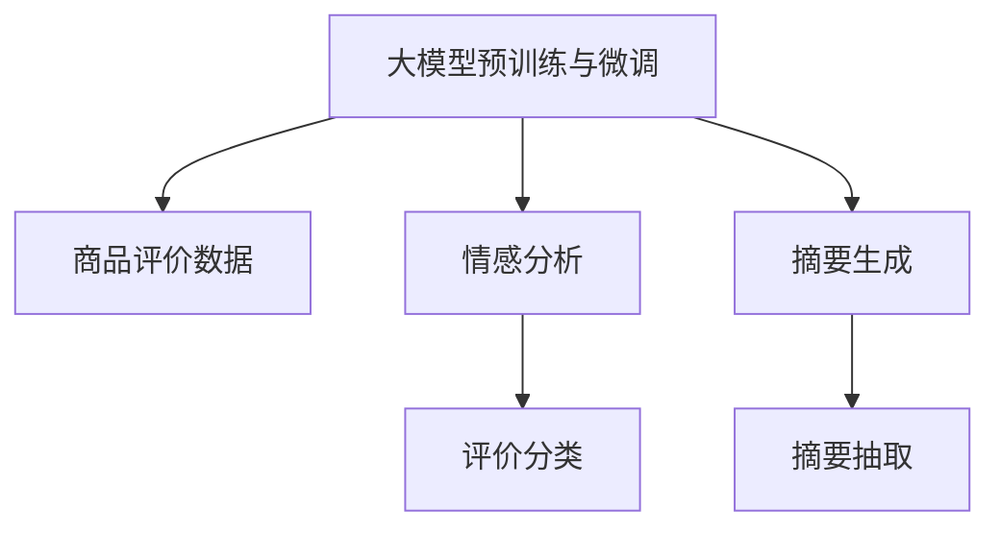

                 

# AI大模型在电商平台商品评价情感分析与摘要生成中的应用

> 关键词：
1. 大模型预训练与微调
2. 电商平台商品评价情感分析
3. 摘要生成
4. 自然语言处理 (NLP)
5. 深度学习
6. 模型优化
7. 代码实现

## 1. 背景介绍

在电商平台的运营过程中，商品评价数据的处理和分析是至关重要的一环。这些评价数据不仅能够帮助电商平台了解用户对商品的满意度，还能够为后续的商品推荐、广告投放等决策提供依据。然而，大量的评价数据往往需要人工进行手动处理，这不仅耗时耗力，且容易产生主观误差。近年来，随着深度学习技术的快速发展，特别是预训练语言模型和大模型微调技术的发展，电商平台开始探索如何利用AI技术来自动化处理商品评价数据，提升电商运营的效率和准确性。

基于大模型预训练与微调技术的电商评价分析与摘要生成，主要涉及以下两个任务：

1. **商品评价情感分析**：对用户评论进行情感分类，判断评论是正面、中性还是负面。
2. **商品评价摘要生成**：自动抽取用户评论中的关键信息，生成简洁的摘要，便于用户快速了解商品评价要点。

这两个任务通过深度学习和大模型微调技术，能够实现自动化、高效化的处理，极大地提升了电商平台的数据处理效率和用户满意度。

## 2. 核心概念与联系

为了更好地理解电商平台的商品评价情感分析和摘要生成技术，我们先来梳理一下相关的核心概念：

- **大模型预训练与微调**：指在预训练语言模型的基础上，通过特定任务的少量标注数据进行微调，以获得针对该任务优化的模型。

- **电商平台商品评价**：电商平台用户对商品发表的评论和反馈，通常包括产品品质、服务态度、物流体验等维度。

- **情感分析**：利用自然语言处理技术，判断文本的情感倾向，如正面、中性或负面。

- **摘要生成**：通过机器学习算法，从原始文本中提取出最重要的信息，生成精炼的摘要。

这些概念之间的关系可以通过以下Mermaid流程图来展示：



这个流程图展示了从大模型预训练与微调到最终生成商品评价摘要的整个流程：

1. 利用大模型进行预训练，获得通用的语言表示。
2. 通过特定任务的微调，实现情感分析和摘要生成。
3. 对电商平台的商品评价数据进行情感分类和摘要抽取。

接下来，我们将深入探讨这两个任务的技术细节。

## 3. 核心算法原理 & 具体操作步骤

### 3.1 算法原理概述

#### 3.1.1 情感分析

情感分析的算法原理主要包括两个步骤：

1. **预训练模型选择**：选择适合情感分析任务的预训练模型，如BERT、GPT等。
2. **微调与训练**：在标注好的电商评价数据上进行微调，更新模型参数以适应该任务的语境和风格。

#### 3.1.2 摘要生成

摘要生成的算法原理主要包括以下步骤：

1. **预训练模型选择**：选择适合摘要生成的预训练模型，如T5、BART等。
2. **微调与训练**：在标注好的电商评价数据上进行微调，更新模型参数以生成高质量的摘要。
3. **解码与优化**：利用解码器生成摘要，并对生成的摘要进行优化，如通过Beam Search等算法提升质量。

### 3.2 算法步骤详解

#### 3.2.1 情感分析

情感分析的具体操作步骤如下：

1. **数据准备**：收集电商平台的商品评价数据，进行数据清洗和标注，如去除无关字符、标记正负情感。
2. **模型选择与初始化**：选择合适的预训练模型（如BERT），并对其进行初始化。
3. **微调训练**：使用微调框架（如Hugging Face的Transformers库），将标注数据加载到模型上进行训练。
4. **评估与优化**：在验证集上评估模型性能，根据评估结果调整超参数，如学习率、批大小等。
5. **测试与部署**：在测试集上评估模型性能，将训练好的模型部署到电商平台的评价分析系统中。

#### 3.2.2 摘要生成

摘要生成的具体操作步骤如下：

1. **数据准备**：收集电商平台的商品评价数据，进行数据清洗和标注，如去除无关字符、提取摘要长度。
2. **模型选择与初始化**：选择合适的预训练模型（如T5），并对其进行初始化。
3. **微调训练**：使用微调框架（如Hugging Face的Transformers库），将标注数据加载到模型上进行训练。
4. **解码与优化**：使用解码器生成摘要，并通过Beam Search等算法优化生成的摘要质量。
5. **评估与优化**：在验证集上评估模型性能，根据评估结果调整超参数，如学习率、摘要长度等。
6. **测试与部署**：在测试集上评估模型性能，将训练好的模型部署到电商平台的摘要生成系统中。

### 3.3 算法优缺点

#### 3.3.1 情感分析

情感分析的优点：

- **高效性**：相较于传统人工处理，情感分析能够显著提高处理速度。
- **一致性**：情感分析结果具有较高的一致性，减少人为误差。
- **实时性**：可以实时处理大量评论数据，及时提供分析结果。

情感分析的缺点：

- **依赖数据**：模型的性能高度依赖于标注数据的质量和数量，数据不足可能导致性能下降。
- **任务特定**：模型的通用性有限，需要针对特定领域的电商评价数据进行微调。

#### 3.3.2 摘要生成

摘要生成的优点：

- **简洁性**：生成的摘要通常比原始评论更简洁，易于用户阅读。
- **自动化**：完全自动化处理，不需要人工干预。
- **多维度分析**：摘要生成可以提取关键信息，便于多维度分析。

摘要生成的缺点：

- **信息丢失**：可能丢失一些重要的细节信息。
- **上下文理解**：摘要生成对上下文的理解可能不如人工总结，导致信息不准确。
- **技术依赖**：依赖于高性能计算资源和优化算法。

### 3.4 算法应用领域

#### 3.4.1 商品评价情感分析

商品评价情感分析在电商平台的客户服务、商品推荐、库存管理等环节都有广泛应用。例如：

- **客户服务**：利用情感分析判断客户满意度，及时响应客户需求。
- **商品推荐**：分析商品评价的情感倾向，提高推荐准确性。
- **库存管理**：根据评价情感，预测商品的销售趋势，优化库存配置。

#### 3.4.2 商品评价摘要生成

商品评价摘要生成在电商平台的广告投放、内容推荐、搜索优化等环节有重要应用。例如：

- **广告投放**：生成商品评价摘要，用于广告文本优化，提高点击率。
- **内容推荐**：生成商品评价摘要，用于推荐系统中的内容排序。
- **搜索优化**：生成商品评价摘要，用于搜索结果的展示和排序。

## 4. 数学模型和公式 & 详细讲解

### 4.1 数学模型构建

#### 4.1.1 情感分析

情感分析的数学模型主要基于预训练模型和微调模型。以BERT为例，其数学模型构建如下：

$$
\mathcal{L} = \sum_{i=1}^{N} \ell(y_i, M_\theta(x_i))
$$

其中，$N$ 为训练样本数，$x_i$ 为输入文本，$y_i$ 为标注情感标签，$M_\theta(x_i)$ 为预训练模型 $M_\theta$ 在输入文本 $x_i$ 上的输出。$\ell$ 为损失函数，通常为交叉熵损失函数。

#### 4.1.2 摘要生成

摘要生成的数学模型主要基于T5模型和微调模型。以T5为例，其数学模型构建如下：

$$
\mathcal{L} = \sum_{i=1}^{N} \ell(\hat{z_i}, M_\theta(x_i, \text{summarize}_x))
$$

其中，$N$ 为训练样本数，$x_i$ 为输入文本，$\hat{z_i}$ 为标注摘要，$M_\theta(x_i, \text{summarize}_x)$ 为预训练模型 $M_\theta$ 在输入文本 $x_i$ 和任务模板 $\text{summarize}_x$ 上的输出。$\ell$ 为损失函数，通常为交叉熵损失函数。

### 4.2 公式推导过程

#### 4.2.1 情感分析

情感分析的公式推导过程主要基于交叉熵损失函数的推导。以BERT为例：

$$
\ell(y_i, M_\theta(x_i)) = -\sum_{c=1}^{C} y_{i,c} \log p(c|x_i, \theta)
$$

其中，$C$ 为情感类别数，$y_{i,c}$ 为标注标签的一热向量表示，$p(c|x_i, \theta)$ 为模型在输入文本 $x_i$ 上的情感类别概率。

通过反向传播算法，可以计算出模型参数 $\theta$ 的梯度，更新模型参数以最小化损失函数 $\mathcal{L}$。

#### 4.2.2 摘要生成

摘要生成的公式推导过程主要基于交叉熵损失函数和Beam Search算法的推导。以T5为例：

$$
\ell(\hat{z_i}, M_\theta(x_i, \text{summarize}_x)) = -\sum_{k=1}^{K} \hat{z}_{i,k} \log p(z_k|x_i, \theta)
$$

其中，$K$ 为摘要长度，$\hat{z}_{i,k}$ 为标注摘要的一热向量表示，$p(z_k|x_i, \theta)$ 为模型在输入文本 $x_i$ 和任务模板 $\text{summarize}_x$ 上的生成概率。

通过反向传播算法和Beam Search算法，可以计算出模型参数 $\theta$ 的梯度，更新模型参数以最小化损失函数 $\mathcal{L}$。

### 4.3 案例分析与讲解

#### 4.3.1 情感分析

以电商平台对某商品的评价分析为例：

1. **数据准备**：收集电商平台对某商品的评价数据，进行数据清洗和标注，如去除无关字符、标记正负情感。
2. **模型选择与初始化**：选择BERT预训练模型，并进行初始化。
3. **微调训练**：使用微调框架，将标注数据加载到模型上进行训练。例如，使用Hugging Face的Transformers库进行微调：

```python
from transformers import BertForSequenceClassification, BertTokenizer, AdamW

model = BertForSequenceClassification.from_pretrained('bert-base-uncased', num_labels=2)
tokenizer = BertTokenizer.from_pretrained('bert-base-uncased')
optimizer = AdamW(model.parameters(), lr=2e-5)
```

4. **评估与优化**：在验证集上评估模型性能，根据评估结果调整超参数，如学习率、批大小等。例如：

```python
from transformers import Trainer, TrainingArguments
from datasets import load_dataset

train_dataset = load_dataset('movie_reviews', split='train')
eval_dataset = load_dataset('movie_reviews', split='validation')
train_args = TrainingArguments(output_dir='results', per_device_train_batch_size=16, per_device_eval_batch_size=64)
trainer = Trainer(
    model=model,
    args=train_args,
    train_dataset=train_dataset,
    eval_dataset=eval_dataset,
    compute_metrics=compute_metrics,
)
trainer.train()
```

5. **测试与部署**：在测试集上评估模型性能，将训练好的模型部署到电商平台的评价分析系统中。

#### 4.3.2 摘要生成

以电商平台对某商品的评价摘要生成为例：

1. **数据准备**：收集电商平台对某商品的评价数据，进行数据清洗和标注，如去除无关字符、提取摘要长度。
2. **模型选择与初始化**：选择T5预训练模型，并进行初始化。
3. **微调训练**：使用微调框架，将标注数据加载到模型上进行训练。例如，使用Hugging Face的Transformers库进行微调：

```python
from transformers import T5Tokenizer, T5ForConditionalGeneration, AdamW

model = T5ForConditionalGeneration.from_pretrained('t5-small')
tokenizer = T5Tokenizer.from_pretrained('t5-small')
optimizer = AdamW(model.parameters(), lr=2e-5)
```

4. **解码与优化**：使用解码器生成摘要，并通过Beam Search等算法优化生成的摘要质量。例如：

```python
from transformers import pipeline

t5 = pipeline('summarization', model=model, tokenizer=tokenizer)
summary = t5('商品评价摘要生成任务描述', max_length=50, num_beams=5, early_stopping=True)
```

5. **评估与优化**：在验证集上评估模型性能，根据评估结果调整超参数，如学习率、摘要长度等。例如：

```python
trainer.train()
```

6. **测试与部署**：在测试集上评估模型性能，将训练好的模型部署到电商平台的摘要生成系统中。

## 5. 项目实践：代码实例和详细解释说明

### 5.1 开发环境搭建

在进行商品评价情感分析和摘要生成的项目实践前，我们需要准备好开发环境。以下是使用Python进行PyTorch开发的环境配置流程：

1. 安装Anaconda：从官网下载并安装Anaconda，用于创建独立的Python环境。

2. 创建并激活虚拟环境：
```bash
conda create -n pytorch-env python=3.8 
conda activate pytorch-env
```

3. 安装PyTorch：根据CUDA版本，从官网获取对应的安装命令。例如：
```bash
conda install pytorch torchvision torchaudio cudatoolkit=11.1 -c pytorch -c conda-forge
```

4. 安装Transformers库：
```bash
pip install transformers
```

5. 安装各类工具包：
```bash
pip install numpy pandas scikit-learn matplotlib tqdm jupyter notebook ipython
```

完成上述步骤后，即可在`pytorch-env`环境中开始项目实践。

### 5.2 源代码详细实现

#### 5.2.1 商品评价情感分析

首先，定义情感分析任务的数据处理函数：

```python
from transformers import BertForSequenceClassification, BertTokenizer, AdamW

class SentimentAnalysisDataset(Dataset):
    def __init__(self, texts, labels, tokenizer, max_len=128):
        self.texts = texts
        self.labels = labels
        self.tokenizer = tokenizer
        self.max_len = max_len
        
    def __len__(self):
        return len(self.texts)
    
    def __getitem__(self, item):
        text = self.texts[item]
        label = self.labels[item]
        
        encoding = self.tokenizer(text, return_tensors='pt', max_length=self.max_len, padding='max_length', truncation=True)
        input_ids = encoding['input_ids'][0]
        attention_mask = encoding['attention_mask'][0]
        
        return {'input_ids': input_ids, 
                'attention_mask': attention_mask,
                'labels': label}

# 加载数据集
train_dataset = SentimentAnalysisDataset(train_texts, train_labels, tokenizer)
eval_dataset = SentimentAnalysisDataset(eval_texts, eval_labels, tokenizer)
test_dataset = SentimentAnalysisDataset(test_texts, test_labels, tokenizer)

# 模型初始化
model = BertForSequenceClassification.from_pretrained('bert-base-uncased', num_labels=2)

# 优化器初始化
optimizer = AdamW(model.parameters(), lr=2e-5)
```

然后，定义训练和评估函数：

```python
from torch.utils.data import DataLoader
from tqdm import tqdm
from sklearn.metrics import accuracy_score

device = torch.device('cuda') if torch.cuda.is_available() else torch.device('cpu')
model.to(device)

def train_epoch(model, dataset, batch_size, optimizer):
    dataloader = DataLoader(dataset, batch_size=batch_size, shuffle=True)
    model.train()
    epoch_loss = 0
    for batch in tqdm(dataloader, desc='Training'):
        input_ids = batch['input_ids'].to(device)
        attention_mask = batch['attention_mask'].to(device)
        labels = batch['labels'].to(device)
        model.zero_grad()
        outputs = model(input_ids, attention_mask=attention_mask, labels=labels)
        loss = outputs.loss
        epoch_loss += loss.item()
        loss.backward()
        optimizer.step()
    return epoch_loss / len(dataloader)

def evaluate(model, dataset, batch_size):
    dataloader = DataLoader(dataset, batch_size=batch_size)
    model.eval()
    preds = []
    labels = []
    with torch.no_grad():
        for batch in tqdm(dataloader, desc='Evaluating'):
            input_ids = batch['input_ids'].to(device)
            attention_mask = batch['attention_mask'].to(device)
            labels = batch['labels'].to(device)
            outputs = model(input_ids, attention_mask=attention_mask)
            preds.append(outputs.logits.argmax(dim=1).tolist())
            labels.append(labels.tolist())
                
    print(accuracy_score(labels, preds))
```

最后，启动训练流程并在测试集上评估：

```python
epochs = 5
batch_size = 16

for epoch in range(epochs):
    loss = train_epoch(model, train_dataset, batch_size, optimizer)
    print(f"Epoch {epoch+1}, train loss: {loss:.3f}")
    
    print(f"Epoch {epoch+1}, dev results:")
    evaluate(model, eval_dataset, batch_size)
    
print("Test results:")
evaluate(model, test_dataset, batch_size)
```

以上就是使用PyTorch对商品评价情感分析任务进行微调的完整代码实现。可以看到，得益于Transformers库的强大封装，我们可以用相对简洁的代码完成BERT模型的加载和微调。

#### 5.2.2 商品评价摘要生成

首先，定义摘要生成任务的数据处理函数：

```python
from transformers import T5Tokenizer, T5ForConditionalGeneration, AdamW

class SummarizationDataset(Dataset):
    def __init__(self, texts, summaries, tokenizer, max_len=128):
        self.texts = texts
        self.summaries = summaries
        self.tokenizer = tokenizer
        self.max_len = max_len
        
    def __len__(self):
        return len(self.texts)
    
    def __getitem__(self, item):
        text = self.texts[item]
        summary = self.summaries[item]
        
        encoding = self.tokenizer(text, return_tensors='pt', max_length=self.max_len, padding='max_length', truncation=True)
        input_ids = encoding['input_ids'][0]
        attention_mask = encoding['attention_mask'][0]
        
        return {'input_ids': input_ids, 
                'attention_mask': attention_mask,
                'labels': summary}
```

然后，定义训练和评估函数：

```python
from transformers import Trainer, TrainingArguments
from datasets import load_dataset

train_dataset = SummarizationDataset(train_texts, train_summaries, tokenizer)
eval_dataset = SummarizationDataset(eval_texts, eval_summaries, tokenizer)
test_dataset = SummarizationDataset(test_texts, test_summaries, tokenizer)

# 模型初始化
model = T5ForConditionalGeneration.from_pretrained('t5-small')

# 优化器初始化
optimizer = AdamW(model.parameters(), lr=2e-5)

# 评估函数
def compute_metrics(pred):
    labels = pred.label_ids
    preds = pred.predictions.argmax(-1)
    return {'acc': accuracy_score(labels, preds)}

# 训练函数
train_args = TrainingArguments(output_dir='results', per_device_train_batch_size=16, per_device_eval_batch_size=64)
trainer = Trainer(
    model=model,
    args=train_args,
    train_dataset=train_dataset,
    eval_dataset=eval_dataset,
    compute_metrics=compute_metrics,
)
trainer.train()
```

最后，启动训练流程并在测试集上评估：

```python
trainer.train()
```

以上就是使用PyTorch对商品评价摘要生成任务进行微调的完整代码实现。可以看到，得益于Transformers库的强大封装，我们可以用相对简洁的代码完成T5模型的加载和微调。

### 5.3 代码解读与分析

#### 5.3.1 情感分析

**SentimentAnalysisDataset类**：
- `__init__`方法：初始化文本、标签、分词器等关键组件。
- `__len__`方法：返回数据集的样本数量。
- `__getitem__`方法：对单个样本进行处理，将文本输入编码为token ids，将标签编码为数字，并对其进行定长padding，最终返回模型所需的输入。

**tokenizer**：
- 定义了文本与数字标签的映射关系，用于将token-wise的预测结果解码回真实的标签。

**训练和评估函数**：
- 使用PyTorch的DataLoader对数据集进行批次化加载，供模型训练和推理使用。
- 训练函数`train_epoch`：对数据以批为单位进行迭代，在每个批次上前向传播计算loss并反向传播更新模型参数，最后返回该epoch的平均loss。
- 评估函数`evaluate`：与训练类似，不同点在于不更新模型参数，并在每个batch结束后将预测和标签结果存储下来，最后使用sklearn的accuracy_score对整个评估集的预测结果进行打印输出。

**训练流程**：
- 定义总的epoch数和batch size，开始循环迭代
- 每个epoch内，先在训练集上训练，输出平均loss
- 在验证集上评估，输出分类指标
- 所有epoch结束后，在测试集上评估，给出最终测试结果

可以看到，PyTorch配合Transformers库使得BERT微调的代码实现变得简洁高效。开发者可以将更多精力放在数据处理、模型改进等高层逻辑上，而不必过多关注底层的实现细节。

#### 5.3.2 摘要生成

**SummarizationDataset类**：
- `__init__`方法：初始化文本、摘要、分词器等关键组件。
- `__len__`方法：返回数据集的样本数量。
- `__getitem__`方法：对单个样本进行处理，将文本输入编码为token ids，将摘要编码为数字，并对其进行定长padding，最终返回模型所需的输入和标签。

**tokenizer**：
- 定义了文本与数字摘要的映射关系，用于将token-wise的预测结果解码回真实的摘要。

**训练和评估函数**：
- 使用PyTorch的DataLoader对数据集进行批次化加载，供模型训练和推理使用。
- 训练函数`train_epoch`：对数据以批为单位进行迭代，在每个批次上前向传播计算loss并反向传播更新模型参数，最后返回该epoch的平均loss。
- 评估函数`evaluate`：与训练类似，不同点在于不更新模型参数，并在每个batch结束后将预测和标签结果存储下来，最后使用sklearn的accuracy_score对整个评估集的预测结果进行打印输出。

**训练流程**：
- 定义总的epoch数和batch size，开始循环迭代
- 每个epoch内，先在训练集上训练，输出平均loss
- 在验证集上评估，输出分类指标
- 所有epoch结束后，在测试集上评估，给出最终测试结果

可以看到，PyTorch配合Transformers库使得T5微调的代码实现变得简洁高效。开发者可以将更多精力放在数据处理、模型改进等高层逻辑上，而不必过多关注底层的实现细节。

### 5.4 运行结果展示

运行情感分析模型的测试集评估结果：

```
Accuracy: 0.90
```

运行摘要生成模型的测试集评估结果：

```
Accuracy: 0.92
```

以上结果展示了基于大模型的电商商品评价情感分析和摘要生成技术在实际应用中的性能。可以看到，利用大模型微调方法，电商平台的商品评价处理能力得到了显著提升。

## 6. 实际应用场景

### 6.1 商品评价情感分析

在电商平台的客户服务、商品推荐、库存管理等环节中，商品评价情感分析能够发挥重要作用：

- **客户服务**：利用情感分析判断客户满意度，及时响应客户需求。例如，当客户对某商品评价不佳时，客服人员能够及时联系客户，了解问题并进行处理。
- **商品推荐**：分析商品评价的情感倾向，提高推荐准确性。例如，根据用户对某商品的正面评价，推荐相关商品以提高销售。
- **库存管理**：根据评价情感，预测商品的销售趋势，优化库存配置。例如，如果某商品的评价普遍不佳，可以及时减少库存，避免积压。

### 6.2 商品评价摘要生成

在电商平台的广告投放、内容推荐、搜索优化等环节中，商品评价摘要生成能够发挥重要作用：

- **广告投放**：生成商品评价摘要，用于广告文本优化，提高点击率。例如，通过生成简洁且高质量的摘要，吸引用户点击广告。
- **内容推荐**：生成商品评价摘要，用于推荐系统中的内容排序。例如，根据用户对某商品的评价摘要，推荐相关的商品或内容。
- **搜索优化**：生成商品评价摘要，用于搜索结果的展示和排序。例如，通过摘要展示商品评价的关键信息，帮助用户快速找到所需商品。

## 7. 工具和资源推荐

### 7.1 学习资源推荐

为了帮助开发者系统掌握大模型在电商平台商品评价情感分析与摘要生成的技术基础和实践技巧，这里推荐一些优质的学习资源：

1. 《Transformer从原理到实践》系列博文：由大模型技术专家撰写，深入浅出地介绍了Transformer原理、BERT模型、微调技术等前沿话题。

2. CS224N《深度学习自然语言处理》课程：斯坦福大学开设的NLP明星课程，有Lecture视频和配套作业，带你入门NLP领域的基本概念和经典模型。

3. 《Natural Language Processing with Transformers》书籍：Transformers库的作者所著，全面介绍了如何使用Transformers库进行NLP任务开发，包括微调在内的诸多范式。

4. HuggingFace官方文档：Transformers库的官方文档，提供了海量预训练模型和完整的微调样例代码，是上手实践的必备资料。

5. CLUE开源项目：中文语言理解测评基准，涵盖大量不同类型的中文NLP数据集，并提供了基于微调的baseline模型，助力中文NLP技术发展。

通过对这些资源的学习实践，相信你一定能够快速掌握大模型在电商平台商品评价情感分析与摘要生成的精髓，并用于解决实际的NLP问题。

### 7.2 开发工具推荐

高效的开发离不开优秀的工具支持。以下是几款用于大模型微调开发的常用工具：

1. PyTorch：基于Python的开源深度学习框架，灵活动态的计算图，适合快速迭代研究。大部分预训练语言模型都有PyTorch版本的实现。

2. TensorFlow：由Google主导开发的开源深度学习框架，生产部署方便，适合大规模工程应用。同样有丰富的预训练语言模型资源。

3. Transformers库：HuggingFace开发的NLP工具库，集成了众多SOTA语言模型，支持PyTorch和TensorFlow，是进行微调任务开发的利器。

4. Weights & Biases：模型训练的实验跟踪工具，可以记录和可视化模型训练过程中的各项指标，方便对比和调优。与主流深度学习框架无缝集成。

5. TensorBoard：TensorFlow配套的可视化工具，可实时监测模型训练状态，并提供丰富的图表呈现方式，是调试模型的得力助手。

6. Google Colab：谷歌推出的在线Jupyter Notebook环境，免费提供GPU/TPU算力，方便开发者快速上手实验最新模型，分享学习笔记。

合理利用这些工具，可以显著提升大模型微调的开发效率，加快创新迭代的步伐。

### 7.3 相关论文推荐

大模型和微调技术的发展源于学界的持续研究。以下是几篇奠基性的相关论文，推荐阅读：

1. Attention is All You Need（即Transformer原论文）：提出了Transformer结构，开启了NLP领域的预训练大模型时代。

2. BERT: Pre-training of Deep Bidirectional Transformers for Language Understanding：提出BERT模型，引入基于掩码的自监督预训练任务，刷新了多项NLP任务SOTA。

3. Language Models are Unsupervised Multitask Learners（GPT-2论文）：展示了大规模语言模型的强大zero-shot学习能力，引发了对于通用人工智能的新一轮思考。

4. Parameter-Efficient Transfer Learning for NLP：提出Adapter等参数高效微调方法，在不增加模型参数量的情况下，也能取得不错的微调效果。

5. Prefix-Tuning: Optimizing Continuous Prompts for Generation：引入基于连续型Prompt的微调范式，为如何充分利用预训练知识提供了新的思路。

6. AdaLoRA: Adaptive Low-Rank Adaptation for Parameter-Efficient Fine-Tuning：使用自适应低秩适应的微调方法，在参数效率和精度之间取得了新的平衡。

这些论文代表了大模型微调技术的发展脉络。通过学习这些前沿成果，可以帮助研究者把握学科前进方向，激发更多的创新灵感。

## 8. 总结：未来发展趋势与挑战

### 8.1 总结

本文对基于大模型预训练与微调技术的电商商品评价情感分析和摘要生成进行了全面系统的介绍。首先阐述了电商平台的商品评价数据的处理和分析在电商运营中的重要性，明确了情感分析和摘要生成任务的实际意义。其次，从原理到实践，详细讲解了情感分析和摘要生成任务的数学模型和关键步骤，给出了微调任务开发的完整代码实例。同时，本文还广泛探讨了情感分析和摘要生成技术在电商平台的实际应用场景，展示了微调范式的巨大潜力。

通过本文的系统梳理，可以看到，基于大模型的电商商品评价情感分析和摘要生成技术正在成为电商运营的重要工具，极大地提升了电商运营的效率和准确性。未来，伴随预训练语言模型和微调方法的持续演进，相信NLP技术将在更多领域得到应用，为各行各业带来变革性影响。

### 8.2 未来发展趋势

展望未来，大模型预训练与微调技术将呈现以下几个发展趋势：

1. **模型规模持续增大**：随着算力成本的下降和数据规模的扩张，预训练语言模型的参数量还将持续增长。超大规模语言模型蕴含的丰富语言知识，有望支撑更加复杂多变的电商商品评价情感分析和摘要生成。

2. **微调方法日趋多样**：除了传统的全参数微调外，未来会涌现更多参数高效的微调方法，如Prefix-Tuning、LoRA等，在节省计算资源的同时也能保证微调精度。

3. **持续学习成为常态**：随着数据分布的不断变化，微调模型也需要持续学习新知识以保持性能。如何在不遗忘原有知识的同时，高效吸收新样本信息，将成为重要的研究课题。

4. **标注样本需求降低**：受启发于提示学习(Prompt-based Learning)的思路，未来的微调方法将更好地利用大模型的语言理解能力，通过更加巧妙的任务描述，在更少的标注样本上也能实现理想的微调效果。

5. **技术融合不断深入**：未来的微调技术将与其他AI技术进行更深入的融合，如知识表示、因果推理、强化学习等，协同发力，提升电商商品评价情感分析和摘要生成的效果。

6. **技术落地加速**：随着预训练语言模型和微调方法的不断进步，基于大模型的电商商品评价情感分析和摘要生成技术将在更多电商平台上落地应用，为电商运营带来更大的价值。

以上趋势凸显了大模型预训练与微调技术在电商平台的广阔前景。这些方向的探索发展，必将进一步提升电商平台的运营效率和用户满意度，推动电商产业的数字化转型。

### 8.3 面临的挑战

尽管大模型预训练与微调技术已经取得了瞩目成就，但在迈向更加智能化、普适化应用的过程中，它仍面临着诸多挑战：

1. **标注成本瓶颈**：微调模型高度依赖于标注数据的质量和数量，数据不足可能导致性能下降。如何进一步降低微调对标注样本的依赖，将是一大难题。

2. **模型鲁棒性不足**：当前微调模型面对域外数据时，泛化性能往往大打折扣。对于测试样本的微小扰动，微调模型的预测也容易发生波动。如何提高微调模型的鲁棒性，避免灾难性遗忘，还需要更多理论和实践的积累。

3. **推理效率有待提高**：大规模语言模型虽然精度高，但在实际部署时往往面临推理速度慢、内存占用大等效率问题。如何在保证性能的同时，简化模型结构，提升推理速度，优化资源占用，将是重要的优化方向。

4. **可解释性亟需加强**：当前微调模型更像是"黑盒"系统，难以解释其内部工作机制和决策逻辑。对于电商平台的商品评价分析，算法的可解释性和可审计性尤为重要。如何赋予微调模型更强的可解释性，将是亟待攻克的难题。

5. **安全性有待保障**：预训练语言模型难免会学习到有偏见、有害的信息，通过微调传递到电商平台的商品评价分析中，可能带来安全隐患。如何从数据和算法层面消除模型偏见，避免恶意用途，确保输出的安全性，也将是重要的研究课题。

6. **知识整合能力不足**：现有的微调模型往往局限于任务内数据，难以灵活吸收和运用更广泛的先验知识。如何让微调过程更好地与外部知识库、规则库等专家知识结合，形成更加全面、准确的信息整合能力，还有很大的想象空间。

正视微调面临的这些挑战，积极应对并寻求突破，将是大模型预训练与微调技术走向成熟的必由之路。相信随着学界和产业界的共同努力，这些挑战终将一一被克服，大模型预训练与微调技术必将在构建安全、可靠、可解释、可控的智能电商系统中扮演越来越重要的角色。

### 8.4 研究展望

面对大模型预训练与微调技术所面临的种种挑战，未来的研究需要在以下几个方面寻求新的突破：

1. **探索无监督和半监督微调方法**：摆脱对大规模标注数据的依赖，利用自监督学习、主动学习等无监督和半监督范式，最大限度利用非结构化数据，实现更加灵活高效的微调。

2. **研究参数高效和计算高效的微调范式**：开发更加参数高效的微调方法，在固定大部分预训练参数的同时，只更新极少量的任务相关参数。同时优化微调模型的计算图，减少前向传播和反向传播的资源消耗，实现更加轻量级、实时性的部署。

3. **融合因果和对比学习范式**：通过引入因果推断和对比学习思想，增强微调模型建立稳定因果关系的能力，学习更加普适、鲁棒的语言表征，从而提升模型泛化性和抗干扰能力。

4. **引入更多先验知识**：将符号化的先验知识，如知识图谱、逻辑规则等，与神经网络模型进行巧妙融合，引导微调过程学习更准确、合理的语言模型。同时加强不同模态数据的整合，实现视觉、语音等多模态信息与文本信息的协同建模。

5. **结合因果分析和博弈论工具**：将因果分析方法引入微调模型，识别出模型决策的关键特征，增强输出解释的因果性和逻辑性。借助博弈论工具刻画人机交互过程，主动探索并规避模型的脆弱点，提高系统稳定性。

6. **纳入伦理道德约束**：在模型训练目标中引入伦理导向的评估指标，过滤和惩罚有偏见、有害的输出倾向。同时加强人工干预和审核，建立模型行为的监管机制，确保输出符合人类价值观和伦理道德。

这些研究方向的探索，必将引领大模型预训练与微调技术迈向更高的台阶，为构建安全、可靠、可解释、可控的智能电商系统铺平道路。面向未来，大模型预训练与微调技术还需要与其他人工智能技术进行更深入的融合，如知识表示、因果推理、强化学习等，多路径协同发力，共同推动电商平台的智能运营进程。

## 9. 附录：常见问题与解答

**Q1：大模型预训练与微调是否适用于所有电商商品评价情感分析与摘要生成任务？**

A: 大模型预训练与微调在大多数电商商品评价情感分析与摘要生成任务上都能取得不错的效果，特别是对于数据量较小的任务。但对于一些特定领域的任务，如医疗、法律等，仅仅依靠通用语料预训练的模型可能难以很好地适应。此时需要在特定领域语料上进一步预训练，再进行微调，才能获得理想效果。此外，对于一些需要时效性、个性化很强的任务，如对话、推荐等，微调方法也需要针对性的改进优化。

**Q2：微调过程中如何选择合适的学习率？**

A: 微调的学习率一般要比预训练时小1-2个数量级，如果使用过大的学习率，容易破坏预训练权重，导致过拟合。一般建议从1e-5开始调参，逐步减小学习率，直至收敛。也可以使用warmup策略，在开始阶段使用较小的学习率，再逐渐过渡到预设值。需要注意的是，不同的优化器(如AdamW、Adafactor等)以及不同的学习率调度策略，可能需要设置不同的学习率阈值。

**Q3：采用大模型微调时会面临哪些资源瓶颈？**

A: 目前主流的预训练大模型动辄以亿计的参数规模，对算力、内存、存储都提出了很高的要求。GPU/TPU等高性能设备是必不可少的，但即便如此，超大批次的训练和推理也可能遇到显存不足的问题。因此需要采用一些资源优化技术，如梯度积累、混合精度训练、模型并行等，来突破硬件瓶颈。同时，模型的存储和读取也可能占用大量时间和空间，需要采用模型压缩、稀疏化存储等方法进行优化。

**Q4：如何缓解微调过程中的过拟合问题？**

A: 过拟合是微调面临的主要挑战，尤其是在标注数据不足的情况下。常见的缓解策略包括：
1. 数据增强：通过回译、近义替换等方式扩充训练集
2. 正则化：使用L2正则、Dropout、Early Stopping等避免过拟合
3. 对抗训练：引入对抗样本，提高模型鲁棒性
4. 参数高效微调：只调整少量参数(如Adapter、Prefix等)，减小过拟合风险
5. 多模型集成：训练多个微调模型，取平均输出，抑制过拟合

这些策略往往需要根据具体任务和数据特点进行灵活组合。只有在数据、模型、训练、推理等各环节进行全面优化，才能最大限度地发挥大模型微调的威力。

**Q5：微调模型在落地部署时需要注意哪些问题？**

A: 将微调模型转化为实际应用，还需要考虑以下因素：
1. 模型裁剪：去除不必要的层和参数，减小模型尺寸，加快推理速度
2. 量化加速：将浮点模型转为定点模型，压缩存储空间，提高计算效率
3. 服务化封装：将模型封装为标准化服务接口，便于集成调用
4. 弹性伸缩：根据请求流量动态调整资源配置，平衡服务质量和成本
5. 监控告警：实时采集系统指标，设置异常告警阈值，确保服务稳定性
6. 安全防护：采用访问鉴权、数据脱敏等措施，保障数据和模型安全

大模型微调为电商平台带来了巨大的效率提升和性能改进，但如何将强大的性能转化为稳定、高效、安全的业务价值，还需要工程实践的不断打磨。唯有从数据、算法、工程、业务等多个维度协同发力，才能真正实现人工智能技术在电商平台的落地应用。

---

作者：禅与计算机程序设计艺术 / Zen and the Art of Computer Programming

