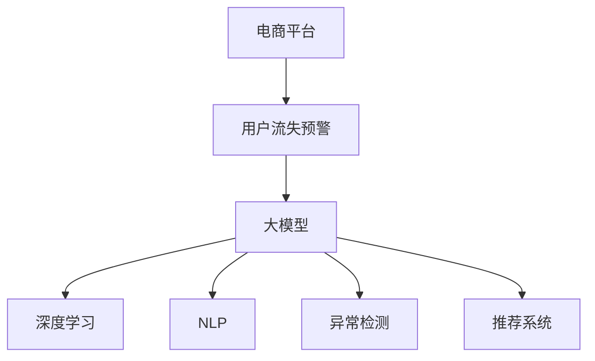

                 

# AI大模型在电商平台用户流失预警中的应用

> 关键词：电商平台,用户流失预警,大模型,深度学习,自然语言处理,NLP

## 1. 背景介绍

### 1.1 问题由来
随着电商平台的蓬勃发展，用户体验和留存率成为电商平台关注的重点。用户的流失不仅导致平台的直接收入减少，还可能对品牌形象和市场竞争力产生负面影响。如何有效预测用户流失风险，及时采取干预措施，成为了电商平台的重要课题。

### 1.2 问题核心关键点
近年来，基于深度学习的大模型在电商领域得到了广泛应用，成为电商数据分析和决策的重要工具。然而，电商数据分析涉及多维度的复杂非结构化数据，如用户行为记录、评论、社交媒体互动等，单一的深度学习模型往往难以全面分析这些数据的内在关联。大模型因其广泛的预训练数据和强大的特征提取能力，具有很大的潜力。

具体而言，大模型在电商用户流失预警中能够发挥如下作用：
- **多模态数据融合**：电商数据涵盖文本、图像、视频等多模态信息，大模型可以融合多种数据源，提取全面、准确的用户特征。
- **异常检测与分类**：通过异常检测算法，及时识别流失风险，分类分析用户流失原因，以便针对性干预。
- **个性化推荐**：大模型可以结合用户历史行为和实时数据，提供个性化的推荐内容，增强用户粘性。

### 1.3 问题研究意义
通过对用户流失风险进行精准预警，电商平台能够及时采取措施，减少用户流失，提升用户体验和满意度。大模型技术的应用，能显著降低数据分析成本，提高预警和干预的效率和准确性，为电商平台的个性化营销和运营提供强有力的技术支持。

## 2. 核心概念与联系

### 2.1 核心概念概述

为更好地理解AI大模型在电商用户流失预警中的应用，本节将介绍几个密切相关的核心概念：

- **电商平台**：即电商企业，通过在线平台进行商品销售和顾客服务的互联网企业，涵盖B2C、B2B等多种模式。
- **用户流失预警**：指通过分析用户行为数据，预测用户流失风险，及时采取干预措施，以降低用户流失率。
- **大模型**：即大规模预训练语言模型，如BERT、GPT等，通过海量无标签文本数据预训练，具有强大的语言理解能力和特征提取能力。
- **深度学习**：一种基于神经网络的机器学习方法，通过多层次的特征提取和特征映射，实现对复杂非结构化数据的建模和预测。
- **自然语言处理(NLP)**：研究如何使计算机理解和生成自然语言的学科，是大模型在电商用户流失预警中的主要应用方向。
- **异常检测**：指从正常数据中识别出异常数据的过程，常用于风险预警、欺诈检测等领域。
- **推荐系统**：通过用户行为和商品属性，为用户推荐合适商品的技术系统，有助于提升用户满意度和留存率。

这些核心概念之间的逻辑关系可以通过以下Mermaid流程图来展示：



这个流程图展示了大模型在电商用户流失预警中的核心概念及其之间的关系：

1. 电商平台通过用户流失预警系统，预测用户流失风险。
2. 大模型作为核心技术，提供强大的语言处理能力和特征提取能力。
3. 深度学习、NLP、异常检测和推荐系统等子技术，是大模型在电商领域的具体应用。

这些概念共同构成了电商用户流失预警的技术框架，使得大模型能够高效分析用户数据，提供准确的预警和干预建议。

## 3. 核心算法原理 & 具体操作步骤
### 3.1 算法原理概述

基于大模型的电商平台用户流失预警，主要分为三个步骤：数据预处理、模型训练与优化、预测与干预。其中，模型训练与优化是核心，通过多模态数据的融合和深度学习算法的应用，构建出精准的流失预警模型。

具体而言，大模型在电商用户流失预警中的应用流程如下：

1. **数据预处理**：收集电商平台的各类数据，如用户行为数据、评论数据、社交媒体数据等，进行数据清洗和预处理，构建统一的数据格式。
2. **模型训练**：使用大模型对预处理后的数据进行训练，学习用户流失的特征和模式。
3. **模型优化**：通过超参数调优、正则化等方法，提高模型的准确性和泛化能力。
4. **预测与干预**：将模型应用于实时数据，预测用户流失风险，及时采取干预措施。

### 3.2 算法步骤详解

**Step 1: 数据预处理**

电商用户流失预警的数据主要分为两类：结构化数据和非结构化数据。结构化数据包括用户购买记录、浏览历史等，非结构化数据包括用户评论、社交媒体互动等。

对结构化数据进行清洗和预处理：
- 去除缺失值和异常值
- 标准化和归一化处理
- 数据合并和转换

对非结构化数据进行文本处理：
- 使用NLTK、SpaCy等工具进行分词、词性标注等处理
- 去除停用词和噪音词
- 使用BERT等预训练模型进行特征提取

将结构化数据和非结构化数据合并，构建统一的数据格式，并划分为训练集、验证集和测试集。

**Step 2: 模型训练**

选择合适的大模型，如BERT、GPT等，对其进行微调。微调的目标是学习电商用户流失的特征和模式，通过多模态数据的融合，提升模型的预测能力。

训练过程中，使用交叉熵损失函数，最小化预测值与真实标签之间的差异。优化器选择Adam、SGD等，设置合适的学习率和迭代次数。

**Step 3: 模型优化**

超参数调优：使用网格搜索、随机搜索等方法，调整学习率、批大小、隐藏层数等超参数，以获得最佳的模型性能。

正则化：使用L2正则化、Dropout等方法，防止过拟合，提高模型泛化能力。

数据增强：通过回译、生成对抗网络等方式，增加训练集的多样性，提高模型的鲁棒性。

**Step 4: 预测与干预**

将训练好的模型应用于实时数据，对用户行为进行预测，判断用户流失风险。根据预测结果，采取相应的干预措施，如个性化推荐、优惠促销等。

### 3.3 算法优缺点

基于大模型的电商用户流失预警具有以下优点：
1. **多模态数据融合**：大模型能够融合多种数据源，提取全面、准确的用户特征，提高预警的准确性。
2. **预测能力强**：大模型具有强大的语言理解能力和特征提取能力，能够学习复杂的非线性关系，提高预警的精确度。
3. **实时性**：通过深度学习算法，大模型能够实时处理大量数据，及时预测用户流失风险。

同时，该方法也存在一定的局限性：
1. **数据隐私问题**：电商数据涉及用户隐私，需要遵循数据保护法律法规，保障用户隐私安全。
2. **计算资源消耗大**：大模型参数量大，训练和推理过程中需要大量的计算资源，可能对电商平台的计算能力提出挑战。
3. **模型复杂度高**：大模型结构复杂，模型调优和优化难度大，需要专业的技术支持。
4. **应用场景限制**：大模型需要充分的训练数据和标签数据，对于数据量较小或标注数据较少的场景，效果可能不理想。

尽管存在这些局限性，但就目前而言，基于大模型的电商用户流失预警方法仍是大数据分析的重要手段。未来相关研究的重点在于如何进一步降低计算资源消耗，提高模型预测效率，同时兼顾数据隐私和伦理安全性等因素。

### 3.4 算法应用领域

大模型在电商用户流失预警中的应用已得到广泛验证，覆盖了电商平台的各个环节：

- **用户行为分析**：通过用户购买记录、浏览历史等数据，分析用户行为特征，预测流失风险。
- **评论情感分析**：对用户评论进行情感分析，识别负面情绪和投诉点，及时干预。
- **社交媒体监测**：通过监测社交媒体上的用户互动，预测用户流失风险，并提供个性化的推荐。
- **个性化推荐**：结合用户历史行为和实时数据，提供个性化的推荐内容，增强用户粘性。
- **欺诈检测**：利用异常检测算法，检测异常行为和交易，及时发现和拦截欺诈行为。

除了上述这些经典应用外，大模型还被创新性地应用到更多场景中，如风险评估、广告投放优化、客户服务自动回复等，为电商平台带来了新的技术突破。

## 4. 数学模型和公式 & 详细讲解  
### 4.1 数学模型构建

本节将使用数学语言对基于大模型的电商用户流失预警过程进行更加严格的刻画。

假设电商平台有$N$个用户，每个用户的行为数据可以表示为一个特征向量$x_i \in \mathbb{R}^d$，$i \in [1, N]$。通过多模态数据融合，得到用户流失风险的概率预测值为$p_i = M_{\theta}(x_i)$，其中$M_{\theta}$为微调后的模型，$\theta$为模型参数。

将用户流失风险进行二分类，标记为流失($y=1$)和未流失($y=0$)。则损失函数$\mathcal{L}$可以表示为：

$$
\mathcal{L} = \frac{1}{N} \sum_{i=1}^N \ell(y_i, M_{\theta}(x_i))
$$

其中$\ell$为交叉熵损失函数，$\ell(y_i, p_i) = -y_i\log p_i - (1-y_i)\log (1-p_i)$。

模型训练的目标是找到最优的参数$\theta^*$，使得损失函数最小化：

$$
\theta^* = \mathop{\arg\min}_{\theta} \mathcal{L}
$$

在训练过程中，使用梯度下降等优化算法更新模型参数，具体公式为：

$$
\theta \leftarrow \theta - \eta \nabla_{\theta}\mathcal{L}(\theta) - \eta\lambda\theta
$$

其中$\eta$为学习率，$\lambda$为正则化系数。

### 4.2 公式推导过程

假设用户流失概率$p_i$为二元逻辑回归模型的输出，则$p_i$的表达式为：

$$
p_i = \sigma(\mathbf{w} \cdot x_i + b)
$$

其中$\sigma$为sigmoid函数，$\mathbf{w}$为权重向量，$b$为偏置项。

将$p_i$代入损失函数，得：

$$
\mathcal{L} = \frac{1}{N} \sum_{i=1}^N [-y_i\log \sigma(\mathbf{w} \cdot x_i + b) - (1-y_i)\log (1-\sigma(\mathbf{w} \cdot x_i + b))]
$$

对$\mathcal{L}$求偏导数，得：

$$
\nabla_{\theta}\mathcal{L} = \frac{1}{N} \sum_{i=1}^N [-y_i(\sigma(\mathbf{w} \cdot x_i + b) - 1)x_i - (1-y_i)(1-\sigma(\mathbf{w} \cdot x_i + b))x_i]
$$

代入权重向量$\mathbf{w}$和偏置项$b$的表达式，得：

$$
\nabla_{\theta}\mathcal{L} = \frac{1}{N} \sum_{i=1}^N [-y_i(\sigma(\mathbf{w} \cdot x_i + b) - 1)x_i - (1-y_i)(1-\sigma(\mathbf{w} \cdot x_i + b))x_i] \begin{pmatrix} w \\ b \end{pmatrix}
$$

结合梯度更新公式，得：

$$
\begin{pmatrix} w \\ b \end{pmatrix} \leftarrow \begin{pmatrix} w \\ b \end{pmatrix} - \eta \nabla_{\theta}\mathcal{L} - \eta\lambda\begin{pmatrix} w \\ b \end{pmatrix}
$$

通过上述公式，可以逐步更新模型参数，最小化损失函数，得到用户流失风险的概率预测模型。

## 5. 项目实践：代码实例和详细解释说明
### 5.1 开发环境搭建

在进行大模型应用于电商用户流失预警的项目实践前，需要先准备好开发环境。以下是使用Python进行PyTorch开发的环境配置流程：

1. 安装Anaconda：从官网下载并安装Anaconda，用于创建独立的Python环境。

2. 创建并激活虚拟环境：
```bash
conda create -n pytorch-env python=3.8 
conda activate pytorch-env
```

3. 安装PyTorch：根据CUDA版本，从官网获取对应的安装命令。例如：
```bash
conda install pytorch torchvision torchaudio cudatoolkit=11.1 -c pytorch -c conda-forge
```

4. 安装TensorFlow：如果需要支持TensorFlow版本，可以使用conda安装或pip安装，具体命令如下：
```bash
conda install tensorflow -c conda-forge
```

5. 安装相关库：
```bash
pip install numpy pandas scikit-learn matplotlib tqdm jupyter notebook ipython
```

完成上述步骤后，即可在`pytorch-env`环境中开始项目实践。

### 5.2 源代码详细实现

下面我以电商用户流失预警模型为例，给出使用PyTorch和大模型进行微调的PyTorch代码实现。

首先，定义用户流失预警的数据处理函数：

```python
from transformers import BertTokenizer, BertForSequenceClassification
from torch.utils.data import Dataset, DataLoader
from torch.nn import BCEWithLogitsLoss
import torch
import pandas as pd

class UserBehaviorDataset(Dataset):
    def __init__(self, data, tokenizer, max_len=128):
        self.data = data
        self.tokenizer = tokenizer
        self.max_len = max_len
        
    def __len__(self):
        return len(self.data)
    
    def __getitem__(self, idx):
        row = self.data.iloc[idx]
        user_id = row['user_id']
        behavior = row['behavior'].tolist()
        label = row['label']
        
        encoding = self.tokenizer(behavior, return_tensors='pt', max_length=self.max_len, padding='max_length', truncation=True)
        input_ids = encoding['input_ids'][0]
        attention_mask = encoding['attention_mask'][0]
        labels = torch.tensor(label, dtype=torch.long)
        
        return {'input_ids': input_ids, 
                'attention_mask': attention_mask,
                'labels': labels}
        
# 加载数据集
data = pd.read_csv('user_behavior.csv')
tokenizer = BertTokenizer.from_pretrained('bert-base-cased')

train_dataset = UserBehaviorDataset(data.iloc[:8000], tokenizer, max_len=128)
dev_dataset = UserBehaviorDataset(data.iloc[8000:10000], tokenizer, max_len=128)
test_dataset = UserBehaviorDataset(data.iloc[10000:], tokenizer, max_len=128)
```

然后，定义模型和优化器：

```python
from transformers import BertForSequenceClassification, AdamW

model = BertForSequenceClassification.from_pretrained('bert-base-cased', num_labels=2, output_attentions=False, output_hidden_states=False)

optimizer = AdamW(model.parameters(), lr=2e-5)
criterion = BCEWithLogitsLoss()
```

接着，定义训练和评估函数：

```python
from tqdm import tqdm

device = torch.device('cuda') if torch.cuda.is_available() else torch.device('cpu')
model.to(device)

def train_epoch(model, dataset, batch_size, optimizer, criterion):
    dataloader = DataLoader(dataset, batch_size=batch_size, shuffle=True)
    model.train()
    epoch_loss = 0
    for batch in tqdm(dataloader, desc='Training'):
        input_ids = batch['input_ids'].to(device)
        attention_mask = batch['attention_mask'].to(device)
        labels = batch['labels'].to(device)
        model.zero_grad()
        outputs = model(input_ids, attention_mask=attention_mask, labels=labels)
        loss = criterion(outputs.logits, labels)
        epoch_loss += loss.item()
        loss.backward()
        optimizer.step()
    return epoch_loss / len(dataloader)

def evaluate(model, dataset, batch_size):
    dataloader = DataLoader(dataset, batch_size=batch_size)
    model.eval()
    preds, labels = [], []
    with torch.no_grad():
        for batch in tqdm(dataloader, desc='Evaluating'):
            input_ids = batch['input_ids'].to(device)
            attention_mask = batch['attention_mask'].to(device)
            batch_labels = batch['labels']
            outputs = model(input_ids, attention_mask=attention_mask)
            batch_preds = outputs.logits.argmax(dim=1).to('cpu').tolist()
            batch_labels = batch_labels.to('cpu').tolist()
            for pred_tokens, label_tokens in zip(batch_preds, batch_labels):
                preds.append(pred_tokens[:len(label_tokens)])
                labels.append(label_tokens)
                
    print(classification_report(labels, preds))
```

最后，启动训练流程并在测试集上评估：

```python
epochs = 5
batch_size = 16

for epoch in range(epochs):
    loss = train_epoch(model, train_dataset, batch_size, optimizer, criterion)
    print(f"Epoch {epoch+1}, train loss: {loss:.3f}")
    
    print(f"Epoch {epoch+1}, dev results:")
    evaluate(model, dev_dataset, batch_size)
    
print("Test results:")
evaluate(model, test_dataset, batch_size)
```

以上就是使用PyTorch对BERT进行电商用户流失预警的完整代码实现。可以看到，得益于Transformers库的强大封装，我们可以用相对简洁的代码完成BERT模型的加载和微调。

### 5.3 代码解读与分析

让我们再详细解读一下关键代码的实现细节：

**UserBehaviorDataset类**：
- `__init__`方法：初始化数据集、分词器等组件，并设置最大序列长度。
- `__len__`方法：返回数据集的样本数量。
- `__getitem__`方法：对单个样本进行处理，将行为序列分词编码，并将标签转换为数字，进行序列填充和padding。

**train_epoch和evaluate函数**：
- 使用DataLoader对数据集进行批次化加载，供模型训练和推理使用。
- 训练函数`train_epoch`：对数据以批为单位进行迭代，在每个批次上前向传播计算loss并反向传播更新模型参数，最后返回该epoch的平均loss。
- 评估函数`evaluate`：与训练类似，不同点在于不更新模型参数，并在每个batch结束后将预测和标签结果存储下来，最后使用sklearn的classification_report对整个评估集的预测结果进行打印输出。

**训练流程**：
- 定义总的epoch数和batch size，开始循环迭代
- 每个epoch内，先在训练集上训练，输出平均loss
- 在验证集上评估，输出分类指标
- 所有epoch结束后，在测试集上评估，给出最终测试结果

可以看到，PyTorch配合Transformers库使得BERT微调的代码实现变得简洁高效。开发者可以将更多精力放在数据处理、模型改进等高层逻辑上，而不必过多关注底层的实现细节。

当然，工业级的系统实现还需考虑更多因素，如模型的保存和部署、超参数的自动搜索、更灵活的任务适配层等。但核心的微调范式基本与此类似。

## 6. 实际应用场景
### 6.1 智能客服系统

基于大模型的电商用户流失预警系统，可以广泛应用于智能客服系统的构建。传统客服往往需要配备大量人力，高峰期响应缓慢，且一致性和专业性难以保证。而使用预警系统，可以及时发现流失风险用户，进行个性化推荐和互动，提升客服体验和满意度。

在技术实现上，可以集成电商预警模型到客服系统中，将用户行为数据和对话内容作为输入，实时预测流失风险，及时采取相应的客服措施，如自动回复、转接人工客服等。通过数据反馈机制，不断优化模型预测准确度，提升系统响应效率。

### 6.2 个性化推荐系统

电商平台的用户流失预警系统不仅可以预警，还能通过分析用户行为特征，提供个性化的推荐内容，增强用户粘性，降低流失率。具体而言，可以通过用户历史行为和实时行为，构建用户行为模型，预测流失风险，并提供个性化推荐。

在推荐过程中，结合用户兴趣和商品属性，生成推荐列表，通过模型评估得分，进行推荐排序。对于流失高风险用户，可以优先推荐相关商品，满足其需求，降低流失概率。对于流失低风险用户，可以推荐多样化商品，提升用户体验，增加互动机会。

### 6.3 市场分析与运营优化

电商平台的用户流失预警系统还可以用于市场分析和运营优化。通过分析流失用户特征，可以发现市场潜在问题，及时调整运营策略，提升用户满意度。例如，可以通过流失预警模型，分析流失用户的常见行为特征，发现潜在的产品缺陷或市场机会，进行针对性的产品迭代和市场推广。

此外，流失预警系统还可以用于电商平台流量监控和运营决策。通过实时监控用户流失趋势，可以及时发现异常流量和运营问题，进行快速响应和干预，优化运营策略，提升整体运营效果。

### 6.4 未来应用展望

随着大模型和预警技术的不断发展，基于电商用户流失预警的大模型应用也将迎来新的突破。

在智慧零售领域，基于大模型的电商预警系统可以用于实时监测用户行为，提供精准的流失预警和个性化推荐，构建智能零售体系，提升零售效率和服务质量。

在智能制造领域，通过电商预警模型，可以实时监控用户反馈和行为数据，发现产品和服务问题，及时优化供应链和产品设计，提高产品质量和用户满意度。

在智慧城市治理中，电商预警模型可以用于实时分析用户行为数据，预测社会舆情变化，及时采取响应措施，构建更加智能、高效的智慧城市治理体系。

此外，在金融、医疗、教育等更多领域，基于大模型的电商预警技术也将得到广泛应用，为这些领域带来新的技术创新和应用突破。

## 7. 工具和资源推荐
### 7.1 学习资源推荐

为了帮助开发者系统掌握电商用户流失预警的理论基础和实践技巧，这里推荐一些优质的学习资源：

1. 《深度学习实战》系列博文：由深度学习技术专家撰写，详细讲解了深度学习在电商领域的应用，包括电商用户流失预警等。

2. 《NLP基础与实战》课程：北京大学开设的NLP课程，涵盖自然语言处理的基本概念和实际应用，适合初学者入门。

3. 《电商数据分析实战》书籍：介绍电商数据分析的理论与实践，涵盖用户行为分析、流失预警等多个主题。

4. 《Python机器学习》书籍：详细讲解了机器学习在电商领域的应用，包括数据预处理、模型构建等多个方面。

5. 电商数据分析社区：如DataCamp、Kaggle等，提供大量电商数据分析的实际案例和开源项目，适合学习和参考。

通过对这些资源的学习实践，相信你一定能够快速掌握电商用户流失预警的技术精髓，并用于解决实际的电商问题。

### 7.2 开发工具推荐

高效的开发离不开优秀的工具支持。以下是几款用于电商用户流失预警开发的常用工具：

1. PyTorch：基于Python的开源深度学习框架，灵活动态的计算图，适合快速迭代研究。大部分预训练语言模型都有PyTorch版本的实现。

2. TensorFlow：由Google主导开发的开源深度学习框架，生产部署方便，适合大规模工程应用。同样有丰富的预训练语言模型资源。

3. Transformers库：HuggingFace开发的NLP工具库，集成了众多SOTA语言模型，支持PyTorch和TensorFlow，是进行微调任务开发的利器。

4. Weights & Biases：模型训练的实验跟踪工具，可以记录和可视化模型训练过程中的各项指标，方便对比和调优。与主流深度学习框架无缝集成。

5. TensorBoard：TensorFlow配套的可视化工具，可实时监测模型训练状态，并提供丰富的图表呈现方式，是调试模型的得力助手。

6. Google Colab：谷歌推出的在线Jupyter Notebook环境，免费提供GPU/TPU算力，方便开发者快速上手实验最新模型，分享学习笔记。

合理利用这些工具，可以显著提升电商用户流失预警任务的开发效率，加快创新迭代的步伐。

### 7.3 相关论文推荐

大模型在电商用户流失预警中的应用已经得到了学界的广泛关注，以下是几篇具有代表性的相关论文，推荐阅读：

1. Predicting User Churn: A Comparison of Techniques（Kaggle竞赛论文）：通过多种机器学习模型，预测电商用户流失风险，提出了一系列实用的数据处理和特征工程方法。

2. User Behavioral Data Mining in E-Commerce for Predicting Customer Churn: A Review（期刊论文）：系统回顾了电商用户行为数据分析的研究进展，提出了多种有效的用户流失预警技术。

3. A Comprehensive Survey on Predicting Customer Churn in E-commerce: From Traditional Methods to Artificial Intelligence Techniques（期刊论文）：综合回顾了电商用户流失预警技术的研究进展，提出了多种基于深度学习的方法。

4. A Deep Learning-based Approach for User Churn Prediction in E-commerce（会议论文）：通过深度学习模型，预测电商用户流失风险，提出了一种基于Transformer的微调模型。

5. Enhancing Customer Retention via Churn Prediction in E-commerce: A Systematic Review（期刊论文）：系统回顾了电商用户流失预警的研究进展，提出了多种有效的数据处理方法。

这些论文代表了大模型在电商用户流失预警技术的研究方向，通过学习这些前沿成果，可以帮助研究者把握学科前进方向，激发更多的创新灵感。

## 8. 总结：未来发展趋势与挑战

### 8.1 总结

本文对基于大模型的电商平台用户流失预警方法进行了全面系统的介绍。首先阐述了电商平台的背景和用户流失预警的重要意义，明确了电商用户流失预警中的大模型应用。其次，从原理到实践，详细讲解了电商用户流失预警的数学模型和关键步骤，给出了电商用户流失预警的完整代码实例。同时，本文还广泛探讨了电商用户流失预警在大模型框架下的多应用场景，展示了电商用户流失预警的巨大潜力。此外，本文精选了电商用户流失预警的技术资源，力求为开发者提供全方位的技术指引。

通过本文的系统梳理，可以看到，基于大模型的电商用户流失预警技术正在成为电商数据分析的重要手段，显著提升了电商平台的运营效率和服务质量。未来，伴随大模型和电商技术的持续演进，基于大模型的电商用户流失预警技术必将更加成熟，为电商平台的个性化营销和运营提供更强力的技术支持。

### 8.2 未来发展趋势

展望未来，电商用户流失预警技术将呈现以下几个发展趋势：

1. **多模态数据融合**：电商数据涵盖文本、图像、视频等多种类型，通过融合多模态数据，提升模型预测的准确性。

2. **深度学习算法创新**：未来将涌现更多先进的深度学习算法，如注意力机制、自监督学习等，进一步提升模型性能。

3. **实时性和高效性**：电商用户流失预警需要实时性高的模型，未来将进一步优化算法和硬件配置，提升模型推理速度，确保实时性。

4. **个性化推荐强化**：电商用户流失预警不仅仅是预警，更应通过个性化推荐，增强用户粘性，降低流失率。

5. **数据隐私保护**：电商数据涉及用户隐私，未来需要更多数据隐私保护的技术，如差分隐私、联邦学习等，确保数据安全和用户隐私。

6. **可解释性和透明性**：电商用户流失预警模型需要解释性强，能够清晰地解释模型预测的依据，提高模型可信度。

以上趋势凸显了电商用户流失预警技术的广阔前景。这些方向的探索发展，必将进一步提升电商平台的智能化水平，为电商用户的个性化需求提供更好的服务。

### 8.3 面临的挑战

尽管电商用户流失预警技术已经取得了显著进展，但在迈向更加智能化、普适化应用的过程中，它仍面临诸多挑战：

1. **数据质量和标注成本**：电商数据往往包含噪音和缺失值，标注成本高，数据质量难以保证。如何提升数据质量和减少标注成本，将是重要研究课题。

2. **计算资源消耗大**：大模型参数量大，训练和推理过程中需要大量的计算资源，可能对电商平台的计算能力提出挑战。如何优化计算资源使用，降低计算成本，是未来亟需解决的问题。

3. **模型复杂度和可解释性**：大模型结构复杂，模型解释性差，难以解释模型的决策过程。如何提高模型的可解释性，增强用户信任，是电商用户流失预警技术需要解决的关键问题。

4. **模型鲁棒性和泛化能力**：大模型在电商数据上的表现往往依赖于数据分布，面对新数据泛化能力有限。如何提高模型鲁棒性，增强模型泛化能力，是电商用户流失预警技术的重要挑战。

5. **实时数据处理能力**：电商用户流失预警需要实时处理大量数据，未来需要更多的实时数据处理技术，确保数据的及时性和准确性。

尽管存在这些挑战，但就目前而言，基于大模型的电商用户流失预警方法仍是大数据分析的重要手段。未来相关研究的重点在于如何进一步优化算法和模型结构，降低计算成本，提高模型性能和可解释性。

### 8.4 研究展望

面对电商用户流失预警所面临的挑战，未来的研究需要在以下几个方面寻求新的突破：

1. **探索无监督和半监督学习**：摆脱对大规模标注数据的依赖，利用自监督学习、主动学习等无监督和半监督范式，最大化利用非结构化数据，提高电商用户流失预警的效率和效果。

2. **研究更高效的模型结构**：开发更加参数高效的模型结构，如Adapter、LoRA等，在减少模型参数的同时，保持模型的预测能力。

3. **引入更多先验知识**：将符号化的先验知识，如知识图谱、逻辑规则等，与神经网络模型进行融合，引导模型学习更全面、准确的用户特征。

4. **结合因果分析和博弈论**：将因果分析方法引入电商用户流失预警模型，识别出模型决策的关键特征，增强输出解释的因果性和逻辑性。

5. **纳入伦理道德约束**：在模型训练目标中引入伦理导向的评估指标，过滤和惩罚有害的输出倾向，确保模型输出的安全性。

这些研究方向将推动电商用户流失预警技术向更加智能化、普适化方向发展，为电商平台的个性化营销和运营提供更强的技术支撑。

## 9. 附录：常见问题与解答

**Q1：电商用户流失预警的准确性如何评估？**

A: 电商用户流失预警的准确性可以通过多种评估指标进行衡量，包括精确率、召回率、F1分数等。具体评估方法取决于预警模型的具体应用场景。

**Q2：电商用户流失预警是否需要集成到电商平台中？**

A: 电商用户流失预警系统可以集成到电商平台中，实现实时预警和个性化推荐，提升用户体验和满意度。但也可以选择独立的系统架构，部署到云平台或本地服务器，提供灵活的数据访问和处理能力。

**Q3：电商用户流失预警需要哪些数据？**

A: 电商用户流失预警需要收集多种数据，包括用户行为数据、评论数据、社交媒体互动数据等。具体需要哪些数据，取决于预警模型应用的场景和目标。

**Q4：电商用户流失预警是否需要处理用户隐私数据？**

A: 电商用户流失预警需要处理用户行为数据和相关隐私数据，需要遵循数据保护法律法规，保障用户隐私安全。

**Q5：电商用户流失预警系统如何实时处理大量数据？**

A: 电商用户流失预警系统需要高效的数据处理能力，可以使用分布式计算、并行计算等技术，确保数据的实时性和准确性。同时，可以使用缓存技术优化数据读取速度，提升系统响应速度。

这些问题的解答，可以为电商用户流失预警技术的实际应用提供指导，帮助电商企业构建更加智能、高效的流失预警系统。

---

作者：禅与计算机程序设计艺术 / Zen and the Art of Computer Programming

