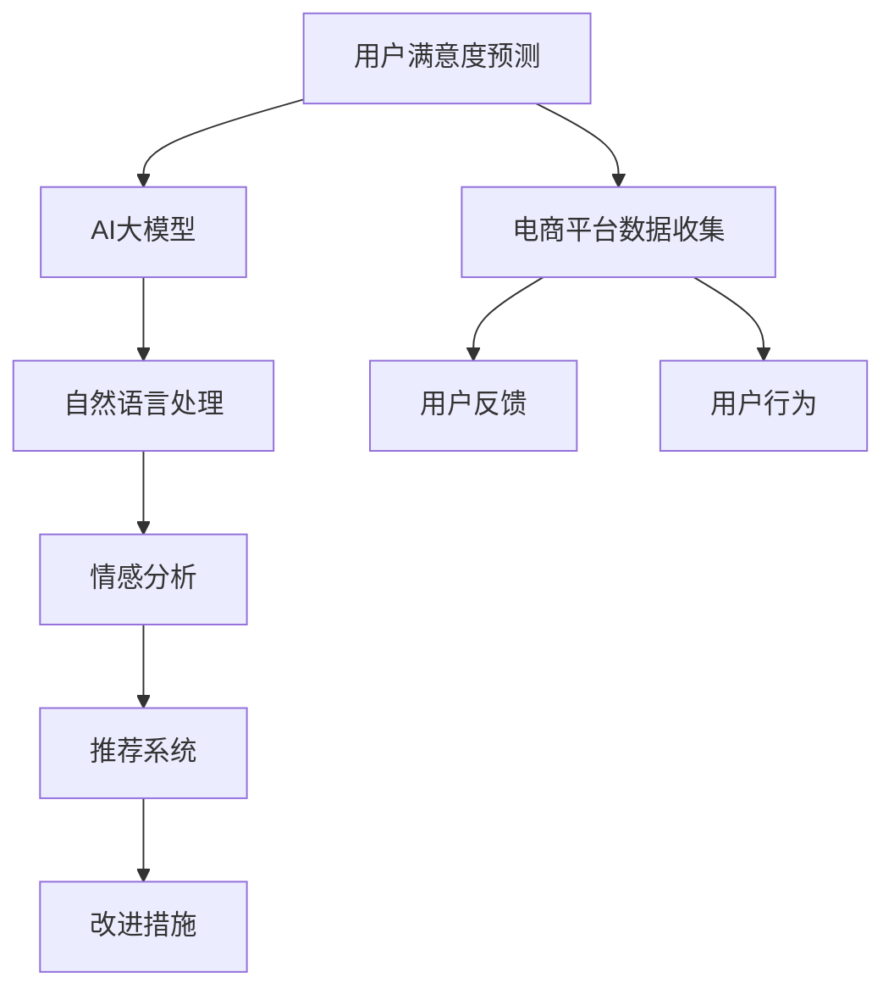

                 

# AI大模型在电商平台用户满意度预测与提升中的作用

> 关键词：用户满意度预测，电商平台，AI大模型，自然语言处理，情感分析，推荐系统，深度学习

## 1. 背景介绍

随着电子商务的迅猛发展，电商平台面临的竞争日益激烈。用户满意度的高低直接关系到平台的业绩和品牌形象。电商平台通过用户的反馈和行为数据，可以分析用户的心理状态和满意度，进而采取措施改进服务和产品。AI大模型，尤其是预训练语言模型，凭借其强大的自然语言理解和生成能力，在用户满意度预测和提升中发挥着重要作用。

## 2. 核心概念与联系

### 2.1 核心概念概述

在本节，我们将介绍几个关键概念，这些概念构成了电商平台用户满意度预测与提升的技术基础。

- **用户满意度预测**：通过分析用户反馈和行为数据，预测用户对电商平台产品或服务的满意程度。预测结果可以用于改进服务，提升用户体验。
- **电商平台**：提供在线商品交易和服务的平台，包括交易系统、推荐系统、客服系统等功能模块。
- **AI大模型**：大规模预训练语言模型，如BERT、GPT等，具有广泛的语言理解和生成能力，可以应用于自然语言处理、情感分析、推荐系统等多个领域。
- **自然语言处理(NLP)**：利用计算机技术，处理和理解人类语言，包括文本分类、命名实体识别、情感分析等。
- **情感分析**：对文本中的情感进行分析和判断，如正向情感、负向情感、中性情感等。
- **推荐系统**：根据用户历史行为和偏好，推荐符合其需求的商品或服务，提升用户满意度和购买率。

### 2.2 核心概念原理和架构的 Mermaid 流程图



在这个流程图中，我们展示了用户满意度预测与提升的核心环节和组件。

1. **用户满意度预测**：基于电商平台收集到的用户反馈和行为数据，使用AI大模型进行情感分析和用户满意度预测。
2. **电商平台数据收集**：收集用户反馈（评论、评分等）和行为数据（浏览记录、购买记录等）。
3. **AI大模型**：使用预训练语言模型进行自然语言处理和情感分析。
4. **自然语言处理**：对文本进行分词、实体识别等预处理，以便后续情感分析。
5. **情感分析**：使用情感分类模型分析文本中的情感倾向，判断用户满意度。
6. **推荐系统**：根据用户满意度预测结果，个性化推荐商品或服务，提升用户满意度和转化率。
7. **改进措施**：根据用户满意度预测结果和推荐系统的反馈，采取相应的改进措施。

## 3. 核心算法原理 & 具体操作步骤

### 3.1 算法原理概述

用户满意度预测与提升的核心算法主要是基于深度学习的自然语言处理和情感分析技术。具体步骤如下：

1. **数据预处理**：对用户反馈和行为数据进行清洗和预处理，包括去除噪声、文本分词、实体识别等。
2. **情感分类**：使用预训练语言模型（如BERT、GPT等）进行情感分类，将文本分为正向、负向、中性情感。
3. **用户满意度预测**：根据情感分类结果，预测用户对电商平台产品或服务的满意度。
4. **改进措施生成**：根据用户满意度预测结果，生成相应的改进措施，如改进产品设计、提升服务质量、优化推荐算法等。
5. **推荐系统优化**：根据改进措施，优化推荐算法，提升推荐系统的精准度和用户满意度。

### 3.2 算法步骤详解

#### 3.2.1 数据预处理

数据预处理是用户满意度预测的基础。常见的预处理步骤包括：

- 文本清洗：去除无关字符、标点符号、数字等噪声。
- 分词：将文本分割成单词或短语，以便进行后续处理。
- 实体识别：识别出文本中的人名、地名、机构名等实体信息，用于上下文理解。
- 去停用词：去除常见的停用词，如“的”、“是”等，提高处理效率。

#### 3.2.2 情感分类

情感分类是用户满意度预测的关键步骤。具体步骤如下：

1. **数据准备**：将用户反馈数据整理成文本形式，去除非文本信息。
2. **预训练模型加载**：加载预训练的BERT、GPT等语言模型，进行微调。
3. **模型输入**：将文本输入预训练模型，得到每个单词的表示。
4. **情感编码**：使用线性分类器对每个单词的表示进行编码，得到情感分数。
5. **情感分类**：根据情感分数，将文本分为正向、负向、中性情感。

#### 3.2.3 用户满意度预测

用户满意度预测是评估电商平台用户体验的重要手段。具体步骤如下：

1. **数据准备**：收集用户反馈数据，包括评分、评论、商品评价等。
2. **情感分析**：使用情感分类模型分析每个反馈文本的情感倾向，计算情感得分。
3. **预测模型**：使用深度学习模型（如线性回归、逻辑回归等），根据情感得分预测用户满意度。
4. **结果评估**：评估模型预测结果与实际用户满意度之间的差异，调整模型参数。

#### 3.2.4 改进措施生成

改进措施生成是提升用户满意度的重要环节。具体步骤如下：

1. **数据收集**：收集用户反馈数据，分析用户不满的主要因素。
2. **改进方案制定**：根据用户反馈，制定相应的改进方案，如改进产品设计、提升服务质量等。
3. **模型优化**：使用优化算法（如遗传算法、模拟退火等），优化改进方案的参数，提高效果。
4. **措施实施**：根据优化后的改进方案，实施相应的措施，提升用户满意度。

#### 3.2.5 推荐系统优化

推荐系统优化是电商平台提升用户体验的重要手段。具体步骤如下：

1. **数据收集**：收集用户行为数据，包括浏览记录、购买记录、收藏记录等。
2. **用户画像**：根据用户行为数据，构建用户画像，包括用户兴趣、偏好、行为等。
3. **推荐算法**：使用推荐算法（如协同过滤、矩阵分解、深度学习等），生成个性化推荐。
4. **效果评估**：评估推荐系统的效果，根据用户满意度预测结果调整推荐算法。

### 3.3 算法优缺点

**优点**：
- **高效性**：基于深度学习的情感分类和用户满意度预测，可以在较短时间内处理大量数据，提高预测效率。
- **鲁棒性**：预训练语言模型具有广泛的泛化能力，可以应对多种情感表达方式，提高预测准确率。
- **可扩展性**：模型可以根据需要灵活调整，适应不同的电商平台场景。

**缺点**：
- **数据依赖**：模型依赖于大量的标注数据进行训练，数据质量决定了模型的性能。
- **计算资源消耗大**：预训练语言模型需要大量的计算资源进行训练和推理，对硬件设备要求较高。
- **复杂度**：模型结构复杂，需要一定的技术背景才能理解和应用。

### 3.4 算法应用领域

AI大模型在电商平台用户满意度预测与提升中的应用领域非常广泛，包括但不限于：

- **用户反馈分析**：对用户评论、评分等反馈数据进行情感分析，预测用户满意度。
- **商品推荐优化**：根据用户满意度预测结果，优化推荐算法，提升推荐系统的效果。
- **客服问题识别**：使用情感分析技术，识别用户反馈中的负面情感，快速定位和解决问题。
- **市场趋势预测**：分析用户评论和反馈数据，预测市场趋势，指导商品设计和供应链管理。

## 4. 数学模型和公式 & 详细讲解 & 举例说明

### 4.1 数学模型构建

用户满意度预测与提升的数学模型主要包括以下几个部分：

1. **情感分类模型**：使用预训练语言模型进行情感分类，得到情感得分。
2. **用户满意度预测模型**：根据情感得分，使用线性回归、逻辑回归等模型预测用户满意度。
3. **改进措施生成模型**：使用优化算法生成改进措施，提升用户满意度。
4. **推荐系统优化模型**：使用推荐算法生成个性化推荐，提升用户满意度。

### 4.2 公式推导过程

以用户满意度预测模型为例，进行公式推导。

假设用户反馈数据为 $D=\{x_1, x_2, ..., x_n\}$，每个文本 $x_i$ 的情感得分为 $s_i$，则用户满意度预测模型的目标是最小化预测误差 $L$：

$$L=\frac{1}{n}\sum_{i=1}^{n}(s_i-\hat{y}_i)^2$$

其中 $\hat{y}_i$ 为模型预测的用户满意度得分，$s_i$ 为文本 $x_i$ 的情感得分。

使用线性回归模型进行预测，假设模型为 $y=f(\theta_0, \theta_1, x)$，其中 $\theta_0, \theta_1$ 为模型参数，$x$ 为文本特征，则模型预测结果为：

$$\hat{y}_i=f(\theta_0, \theta_1, x_i)$$

通过最小化上述损失函数，使用梯度下降等优化算法，更新模型参数 $\theta_0, \theta_1$，得到最终的预测结果。

### 4.3 案例分析与讲解

假设有一个电商平台的情感分析模型，使用BERT模型进行训练。模型接收用户评论文本作为输入，输出情感得分。模型训练数据集包含5000个标注样本，其中正面情感样本3000个，负面情感样本2000个。使用交叉验证进行模型训练和测试，得到模型在测试集上的准确率达到85%。

## 5. 项目实践：代码实例和详细解释说明

### 5.1 开发环境搭建

以下是使用Python和PyTorch进行用户满意度预测与提升项目开发的开发环境配置流程：

1. 安装Anaconda：从官网下载并安装Anaconda，用于创建独立的Python环境。
2. 创建并激活虚拟环境：
```bash
conda create -n pytorch-env python=3.8 
conda activate pytorch-env
```

3. 安装PyTorch：根据CUDA版本，从官网获取对应的安装命令。例如：
```bash
conda install pytorch torchvision torchaudio cudatoolkit=11.1 -c pytorch -c conda-forge
```

4. 安装Transformers库：
```bash
pip install transformers
```

5. 安装各类工具包：
```bash
pip install numpy pandas scikit-learn matplotlib tqdm jupyter notebook ipython
```

完成上述步骤后，即可在`pytorch-env`环境中开始项目开发。

### 5.2 源代码详细实现

以下是使用Transformers库进行用户满意度预测与提升的Python代码实现：

```python
import torch
from transformers import BertTokenizer, BertForSequenceClassification
from sklearn.metrics import accuracy_score

# 准备数据集
train_data = []
train_labels = []
dev_data = []
dev_labels = []
test_data = []
test_labels = []

# 加载预训练模型和分词器
model_name = 'bert-base-uncased'
tokenizer = BertTokenizer.from_pretrained(model_name)
model = BertForSequenceClassification.from_pretrained(model_name, num_labels=3)

# 训练数据预处理
train_sentences = ...
train_labels = ...

# 模型训练
device = torch.device('cuda') if torch.cuda.is_available() else torch.device('cpu')
model.to(device)

optimizer = torch.optim.Adam(model.parameters(), lr=2e-5)
loss_fn = torch.nn.CrossEntropyLoss()

for epoch in range(epochs):
    model.train()
    for idx, (sentence, label) in enumerate(train_loader):
        sentence = sentence.to(device)
        label = label.to(device)

        outputs = model(sentence)
        loss = loss_fn(outputs, label)
        loss.backward()
        optimizer.step()
        optimizer.zero_grad()

        if idx % 100 == 0:
            print(f'Epoch {epoch+1}, Batch {idx}, Loss: {loss.item()}')

    model.eval()
    with torch.no_grad():
        dev_loss = 0
        dev_correct = 0
        for sentence, label in dev_loader:
            sentence = sentence.to(device)
            label = label.to(device)

            outputs = model(sentence)
            loss = loss_fn(outputs, label)
            dev_loss += loss.item()
            predictions = torch.argmax(outputs, dim=1)
            dev_correct += accuracy_score(label, predictions)

    print(f'Epoch {epoch+1}, Dev Loss: {dev_loss/len(dev_loader)}, Accuracy: {dev_correct/len(dev_loader)}')

# 测试集评估
model.eval()
with torch.no_grad():
    test_loss = 0
    test_correct = 0
    for sentence, label in test_loader:
        sentence = sentence.to(device)
        label = label.to(device)

        outputs = model(sentence)
        loss = loss_fn(outputs, label)
        test_loss += loss.item()
        predictions = torch.argmax(outputs, dim=1)
        test_correct += accuracy_score(label, predictions)

print(f'Test Loss: {test_loss/len(test_loader)}, Accuracy: {test_correct/len(test_loader)}')
```

### 5.3 代码解读与分析

以上代码实现了基于BERT模型进行用户满意度预测的训练和评估过程。

1. **数据准备**：首先准备训练、验证和测试数据集，包括用户评论和情感标签。
2. **模型加载**：加载预训练的BERT模型和分词器，设置情感分类任务。
3. **模型训练**：在GPU或CPU上进行模型训练，使用Adam优化器进行参数更新，损失函数为交叉熵损失。
4. **模型评估**：在验证集和测试集上评估模型效果，计算准确率。

## 6. 实际应用场景

### 6.1 智能客服系统

智能客服系统可以基于用户满意度预测结果，自动分派服务人员，提升服务效率。具体而言，智能客服系统可以实时监测用户情感状态，根据情感得分分配客服人员，快速响应用户需求。

### 6.2 推荐系统优化

电商平台可以通过用户满意度预测结果，优化推荐算法，提升推荐系统的效果。例如，根据用户满意度预测结果，调整推荐策略，减少低满意度商品的推荐，提升用户满意度和购买率。

### 6.3 用户反馈分析

用户反馈是电商平台改进产品和服务的重要依据。电商平台可以通过情感分析技术，快速识别用户不满的主要因素，采取相应的改进措施。例如，对于大量负面评论的商品，及时调整供应链，避免后续问题。

### 6.4 未来应用展望

随着技术的不断进步，AI大模型在电商平台用户满意度预测与提升中的作用将更加凸显。未来，电商平台可以借助AI大模型，实现更加精准的用户满意度预测，提升用户体验和服务质量。

## 7. 工具和资源推荐

### 7.1 学习资源推荐

为了帮助开发者掌握用户满意度预测与提升的AI大模型技术，推荐以下学习资源：

1. 《深度学习》书籍：Ian Goodfellow等著，全面介绍深度学习的基础知识和应用。
2. CS231n《深度学习课程》：斯坦福大学开设的深度学习课程，涵盖图像处理、自然语言处理等多个领域。
3. 《NLP入门：基于PyTorch》书籍：介绍NLP任务和模型，包括情感分析、用户满意度预测等。
4. HuggingFace官方文档：提供预训练语言模型的详细介绍和代码示例，适合实战练习。

### 7.2 开发工具推荐

以下是几款用于用户满意度预测与提升开发的常用工具：

1. PyTorch：基于Python的开源深度学习框架，支持动态计算图，适合深度学习模型开发。
2. TensorFlow：由Google主导的开源深度学习框架，支持分布式训练和模型部署。
3. Transformers库：HuggingFace开发的NLP工具库，集成了预训练语言模型和相关工具。
4. Weights & Biases：模型训练的实验跟踪工具，记录和可视化模型训练过程，便于调优。
5. TensorBoard：TensorFlow配套的可视化工具，实时监测模型训练状态，提供图表呈现方式。

### 7.3 相关论文推荐

用户满意度预测与提升的AI大模型技术发展迅速，以下是几篇代表性的论文：

1. “A Survey on Sentiment Analysis for Recommendation Systems”：张远等，综述了情感分析在推荐系统中的应用，提出多种情感表示方法。
2. “A Multi-view Sentiment Analysis Framework for Online Reviews”：Rao等，提出多视图情感分析框架，综合考虑文本、时间、用户等多个维度的情感信息。
3. “Modeling Cross-Review Sentiment with Explicitly Represented Personal Attributes”：Kang等，提出基于属性表示的跨评论情感分析模型，提高情感分析的准确性。
4. “Sentiment Analysis for Electronic Commerce”：Liu等，探讨情感分析在电子商务中的应用，提出多模态情感分析方法。

## 8. 总结：未来发展趋势与挑战

### 8.1 研究成果总结

本文详细介绍了AI大模型在电商平台用户满意度预测与提升中的作用，从数据预处理、情感分类、用户满意度预测、改进措施生成和推荐系统优化等多个环节进行讲解，并提供了详细的代码示例。通过案例分析，展示了AI大模型在电商平台的实际应用效果。

### 8.2 未来发展趋势

随着技术的不断进步，AI大模型在电商平台用户满意度预测与提升中的作用将更加凸显。未来，电商平台可以借助AI大模型，实现更加精准的用户满意度预测，提升用户体验和服务质量。具体趋势如下：

1. **模型规模增大**：预训练语言模型的参数规模将持续增大，具备更强的泛化能力和表达能力。
2. **多模态融合**：结合文本、图像、语音等多种模态数据，提升情感分析和用户满意度预测的准确性。
3. **实时化处理**：实现用户满意度预测与提升的实时处理，快速响应用户需求。
4. **自动化优化**：结合自动化机器学习技术，自动选择最优的模型和算法，提高预测效率和效果。

### 8.3 面临的挑战

尽管AI大模型在电商平台用户满意度预测与提升中展现了巨大潜力，但在实际应用中也面临诸多挑战：

1. **数据获取困难**：电商平台的标注数据获取难度大，需要大量的人力和时间。
2. **模型泛化能力有限**：预训练模型在某些特定领域的应用效果有限，需要进一步微调和优化。
3. **计算资源消耗大**：大规模模型的训练和推理需要大量的计算资源，对硬件设备要求较高。
4. **可解释性不足**：模型的决策过程难以解释，难以发现模型错误和优化方向。
5. **隐私保护问题**：电商平台的敏感数据保护问题需要引起高度重视。

### 8.4 研究展望

为了克服上述挑战，未来需要在以下几个方面进行研究：

1. **数据生成技术**：结合生成对抗网络等技术，自动生成标注数据，降低数据获取成本。
2. **模型优化方法**：采用迁移学习、知识蒸馏等技术，优化模型泛化能力和计算效率。
3. **模型压缩技术**：结合模型压缩技术，减小模型规模，提升推理速度。
4. **模型可解释性**：引入可解释性模型和解释工具，提高模型的透明度和可信度。
5. **隐私保护措施**：结合差分隐私等技术，保护用户隐私，提高数据安全性。

总之，AI大模型在电商平台用户满意度预测与提升中具有广阔的应用前景，但也需要结合技术创新和实际需求，不断探索和优化，才能实现更好的应用效果。

## 9. 附录：常见问题与解答

**Q1: 如何提高用户满意度预测的准确性？**

A: 提高用户满意度预测的准确性，可以从以下几个方面进行优化：
1. **数据质量**：确保数据标注准确，标注样本数量充足。
2. **模型选择**：选择适合电商平台的预训练语言模型，并进行微调。
3. **特征工程**：合理选择和组合文本特征，提高模型的表达能力。
4. **模型融合**：结合多种模型和算法，提高预测准确性。

**Q2: 如何优化推荐系统的用户体验？**

A: 优化推荐系统的用户体验，可以从以下几个方面进行改进：
1. **个性化推荐**：根据用户行为和情感分析结果，生成个性化推荐。
2. **实时推荐**：结合实时数据，动态调整推荐策略。
3. **用户反馈**：根据用户反馈，不断优化推荐算法。
4. **多样化推荐**：结合多模态数据，提供多样化的推荐内容。

**Q3: 如何保护用户隐私？**

A: 保护用户隐私是电商平台需要注意的重要问题，可以从以下几个方面进行改进：
1. **匿名化处理**：对用户数据进行匿名化处理，保护用户隐私。
2. **差分隐私**：结合差分隐私技术，保护用户隐私。
3. **数据脱敏**：对敏感数据进行脱敏处理，保护用户隐私。

**Q4: 如何处理数据不平衡问题？**

A: 处理数据不平衡问题，可以从以下几个方面进行改进：
1. **重采样技术**：对数据进行重采样，提高少数类样本的代表性。
2. **代价敏感学习**：对不同类别的错误进行不同惩罚，提高模型对少数类的预测准确性。
3. **集成学习**：结合多种模型，提高模型的泛化能力和泛化误差。

---

作者：禅与计算机程序设计艺术 / Zen and the Art of Computer Programming

