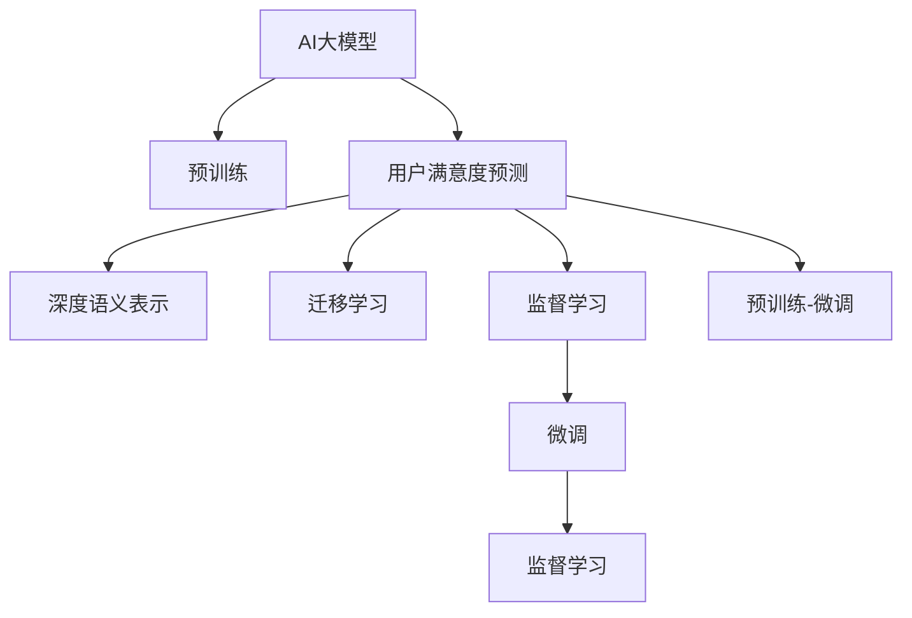

                 

# AI大模型在电商平台用户满意度预测中的作用

## 1. 背景介绍

近年来，电商平台已成为人们日常生活中不可或缺的一部分，其发展和普及显著改变了消费者的购物方式和体验。然而，随着平台的快速增长，用户满意度（User Satisfaction）成为了影响电商平台发展的关键因素。为了更深入地了解用户需求和行为，电商平台对用户满意度预测的需求日益增强。

### 1.1 用户满意度预测的重要性

用户满意度预测不仅能帮助电商平台更好地了解用户反馈，优化用户体验，还能指导商品推荐、库存管理、营销策略等方面，提升整体运营效率。通过精确的用户满意度预测，电商平台能够及时发现并解决问题，减少客户流失，增强用户粘性。

### 1.2 传统方法的局限性

传统的用户满意度预测方法多基于规则、回归等模型，但由于电商数据的复杂性，这些方法在精度和泛化能力上存在一定局限。具体表现在：

- 规则模型依赖人工经验，难以处理复杂多变的数据情况。
- 回归模型对异常值敏感，预测结果不稳定。
- 无法充分利用电商数据中的深度语义信息。

### 1.3 AI大模型应用的兴起

随着深度学习技术的发展，特别是大模型的应用，为电商平台用户满意度预测带来了新的机遇。AI大模型，如BERT、GPT-3、T5等，在自然语言处理（NLP）领域取得了显著成就。它们能够自动学习从海量数据中提取深层次的语言表示，具有强大的表征能力和泛化能力。这些优势使得AI大模型在电商平台用户满意度预测中得以广泛应用。

## 2. 核心概念与联系

### 2.1 核心概念概述

为更好地理解AI大模型在电商平台用户满意度预测中的应用，本节将介绍几个关键概念：

- **AI大模型**：以BERT、GPT-3、T5等模型为代表的大规模预训练语言模型，通过在大规模无标签文本数据上进行预训练，学习到丰富的语言知识和常识，具备强大的语言理解和生成能力。

- **用户满意度预测**：通过对电商平台用户评论、评分等文本数据进行建模，预测用户对商品或服务的满意度，为电商平台提供决策支持。

- **深度语义表示**：AI大模型能够自动学习到文本中的深度语义表示，使得模型能够更好地理解用户评论的情感倾向、情感强度等。

- **迁移学习**：利用AI大模型在通用语言处理任务上的泛化能力，将其应用于特定的电商平台用户满意度预测任务。

- **监督学习与微调**：通过监督学习方法，在带有标注数据的电商平台用户满意度数据集上对AI大模型进行微调，以适应特定任务的需求。

- **预训练-微调（Fine-tuning）**：在大规模无标签数据上预训练AI大模型，然后在小规模标注数据上进行微调，以提升模型在特定任务上的性能。

这些核心概念之间的逻辑关系可以通过以下Mermaid流程图来展示：



这个流程图展示了大模型在用户满意度预测中的核心概念及其关系：

1. AI大模型通过预训练获得基础能力。
2. 用户满意度预测任务中，模型利用预训练的知识对文本数据进行深度语义表示。
3. 迁移学习将通用语言处理能力应用于电商平台特定任务。
4. 监督学习和微调方法对模型进行任务适配，提高预测精度。
5. 预训练-微调过程最大化利用模型参数和计算资源，提升预测效果。

## 3. 核心算法原理 & 具体操作步骤

### 3.1 算法原理概述

基于AI大模型的用户满意度预测，本质上是一种利用深度学习的自然语言处理任务。其核心思想是：通过预训练语言模型学习到丰富的语言表示，然后在带有标注数据的用户满意度预测数据集上进行微调，从而获得精确的用户满意度预测结果。

具体来说，假设用户满意度预测数据集为$D=\{(x_i,y_i)\}_{i=1}^N$，其中$x_i$为用户评论或评分文本，$y_i$为对应的用户满意度评分（如1-5分）。预测任务为给定文本$x$，预测用户满意度$y$。

形式化地，预测模型的输入和输出可以表示为：
$$
M_{\theta}(x) = y
$$

其中$\theta$为模型的参数，通过在用户满意度预测数据集$D$上进行监督学习，最小化预测误差：
$$
\mathcal{L}(M_{\theta},D) = \sum_{i=1}^N (M_{\theta}(x_i) - y_i)^2
$$

目标是最小化损失函数$\mathcal{L}$，得到最优参数$\theta$：
$$
\theta^* = \mathop{\arg\min}_{\theta} \mathcal{L}(M_{\theta},D)
$$

### 3.2 算法步骤详解

基于AI大模型的用户满意度预测一般包括以下几个关键步骤：

**Step 1: 准备数据集**

1. 收集电商平台用户评论、评分等文本数据，并标注用户满意度评分。
2. 将数据集划分为训练集、验证集和测试集，通常使用二分法或多分法划分。
3. 对数据进行预处理，如去除停用词、分词、标准化等。

**Step 2: 选择模型和预训练**

1. 选择适当的预训练语言模型，如BERT、GPT-3、T5等。
2. 对预训练模型进行微调前的冻结，保留模型大部分预训练参数。
3. 加载预训练模型的权重，进行模型的初始化。

**Step 3: 设计任务适配层**

1. 根据用户满意度预测任务的特点，设计合适的任务适配层，如全连接层、注意力机制等。
2. 设定损失函数，如均方误差、交叉熵等，用于评估模型预测误差。

**Step 4: 设定超参数**

1. 确定优化算法及其参数，如Adam、SGD等，设置学习率、批大小、迭代轮数等。
2. 应用正则化技术，如L2正则、Dropout等，防止模型过拟合。
3. 设置数据增强技术，如随机回译、随机噪声等，丰富训练集多样性。

**Step 5: 执行梯度训练**

1. 将训练集数据分批次输入模型，前向传播计算损失函数。
2. 反向传播计算参数梯度，根据设定的优化算法和学习率更新模型参数。
3. 周期性在验证集上评估模型性能，根据性能指标决定是否触发Early Stopping。
4. 重复上述步骤直到满足预设的迭代轮数或Early Stopping条件。

**Step 6: 测试和部署**

1. 在测试集上评估微调后模型的性能，对比微调前后的精度提升。
2. 使用微调后的模型对新评论进行满意度预测，集成到实际的应用系统中。
3. 持续收集新的数据，定期重新微调模型，以适应数据分布的变化。

### 3.3 算法优缺点

基于AI大模型的用户满意度预测方法具有以下优点：

- **泛化能力强**：大模型通过大规模无标签数据预训练，具备较强的泛化能力，能够适应不同领域和任务。
- **自动提取语义**：大模型能够自动学习到文本中的深度语义表示，提取用户评论中的情感倾向和强度。
- **参数高效**：使用参数高效微调方法，可以固定大部分预训练参数，减少计算资源消耗。
- **易用性高**：现有深度学习框架和工具库如PyTorch、Transformers等提供了丰富的预训练模型和微调工具，开发门槛较低。

同时，该方法也存在以下局限：

- **依赖标注数据**：模型效果依赖于标注数据的质量和数量，标注成本较高。
- **训练复杂度大**：大模型需要较大的计算资源和存储空间，训练复杂度较高。
- **解释性不足**：模型黑盒特性，难以解释其内部决策过程，可能影响用户信任。
- **数据敏感**：模型对数据分布变化敏感，需要持续监测和调整。

尽管存在这些局限性，AI大模型在电商平台用户满意度预测中依然具有显著优势，能够在较少的标注数据下取得较好的效果，并具备强大的泛化能力和自动语义提取能力。

### 3.4 算法应用领域

AI大模型在电商平台用户满意度预测中的应用已经得到了广泛验证，覆盖了以下领域：

- **商品评价分析**：通过对用户评论进行情感分析，识别商品优缺点，指导商品推荐和改进。
- **客服满意度评估**：通过分析用户与客服的对话记录，评估客服服务质量，优化客服系统。
- **用户行为预测**：预测用户对新商品或服务的满意度，为电商平台的运营策略提供决策支持。
- **广告效果评估**：评估广告内容对用户满意度的影响，优化广告投放策略。

除了以上应用外，AI大模型在电商平台用户满意度预测中的研究还涵盖情感分析、意图识别、行为建模等多个子领域，为电商平台带来了新的业务价值和应用潜力。

## 4. 数学模型和公式 & 详细讲解

### 4.1 数学模型构建

我们以用户满意度预测任务为例，假设模型$M_{\theta}$在输入$x$上的输出为$\hat{y}=M_{\theta}(x)$，其中$\hat{y}$表示模型对用户满意度的预测值。真实标签$y$与预测值$\hat{y}$之间的误差可以通过均方误差（MSE）损失函数进行度量：
$$
\mathcal{L}(M_{\theta},D) = \frac{1}{N}\sum_{i=1}^N (y_i - \hat{y}_i)^2
$$

最小化损失函数$\mathcal{L}$的目标是找到最优参数$\theta$，即：
$$
\theta^* = \mathop{\arg\min}_{\theta} \mathcal{L}(M_{\theta},D)
$$

### 4.2 公式推导过程

以下我们以二分类任务为例，推导均方误差损失函数的详细公式及其梯度计算过程。

假设模型$M_{\theta}$在输入$x$上的输出为$\hat{y}=M_{\theta}(x) \in [0,1]$，表示预测的用户满意度评分。真实标签$y \in \{1,0\}$。则均方误差损失函数定义为：
$$
\mathcal{L}(M_{\theta},D) = \frac{1}{N}\sum_{i=1}^N (y_i - \hat{y}_i)^2
$$

将其代入经验风险公式，得：
$$
\mathcal{L}(\theta) = \frac{1}{N}\sum_{i=1}^N (y_i - M_{\theta}(x_i))^2
$$

根据链式法则，损失函数对参数$\theta$的梯度为：
$$
\frac{\partial \mathcal{L}(\theta)}{\partial \theta} = \frac{2}{N}\sum_{i=1}^N (y_i - M_{\theta}(x_i)) \frac{\partial M_{\theta}(x_i)}{\partial \theta}
$$

其中$\frac{\partial M_{\theta}(x_i)}{\partial \theta}$可通过反向传播算法高效计算。

在得到损失函数的梯度后，即可带入参数更新公式，完成模型的迭代优化。重复上述过程直至收敛，最终得到适应用户满意度预测任务的最优模型参数$\theta^*$。

## 5. 项目实践：代码实例和详细解释说明

### 5.1 开发环境搭建

在进行用户满意度预测实践前，我们需要准备好开发环境。以下是使用Python进行PyTorch开发的环境配置流程：

1. 安装Anaconda：从官网下载并安装Anaconda，用于创建独立的Python环境。

2. 创建并激活虚拟环境：
```bash
conda create -n pytorch-env python=3.8 
conda activate pytorch-env
```

3. 安装PyTorch：根据CUDA版本，从官网获取对应的安装命令。例如：
```bash
conda install pytorch torchvision torchaudio cudatoolkit=11.1 -c pytorch -c conda-forge
```

4. 安装Transformers库：
```bash
pip install transformers
```

5. 安装各类工具包：
```bash
pip install numpy pandas scikit-learn matplotlib tqdm jupyter notebook ipython
```

完成上述步骤后，即可在`pytorch-env`环境中开始用户满意度预测实践。

### 5.2 源代码详细实现

下面我以一个简单的电商用户满意度预测任务为例，给出使用Transformers库对预训练模型进行微调的PyTorch代码实现。

首先，定义用户满意度预测任务的模型：

```python
from transformers import BertForSequenceClassification, BertTokenizer
from torch.utils.data import Dataset
import torch
import torch.nn as nn

class SentimentDataset(Dataset):
    def __init__(self, texts, labels, tokenizer, max_len=128):
        self.texts = texts
        self.labels = labels
        self.tokenizer = tokenizer
        self.max_len = max_len
        
    def __len__(self):
        return len(self.texts)
    
    def __getitem__(self, item):
        text = self.texts[item]
        label = self.labels[item]
        
        encoding = self.tokenizer(text, return_tensors='pt', max_length=self.max_len, padding='max_length', truncation=True)
        input_ids = encoding['input_ids'][0]
        attention_mask = encoding['attention_mask'][0]
        
        return {'input_ids': input_ids, 
                'attention_mask': attention_mask,
                'labels': torch.tensor(label, dtype=torch.long)}
```

然后，定义模型和优化器：

```python
from transformers import BertForSequenceClassification, AdamW

model = BertForSequenceClassification.from_pretrained('bert-base-cased', num_labels=2)

optimizer = AdamW(model.parameters(), lr=2e-5)
```

接着，定义训练和评估函数：

```python
from torch.utils.data import DataLoader
from tqdm import tqdm
from sklearn.metrics import classification_report

device = torch.device('cuda') if torch.cuda.is_available() else torch.device('cpu')
model.to(device)

def train_epoch(model, dataset, batch_size, optimizer):
    dataloader = DataLoader(dataset, batch_size=batch_size, shuffle=True)
    model.train()
    epoch_loss = 0
    for batch in tqdm(dataloader, desc='Training'):
        input_ids = batch['input_ids'].to(device)
        attention_mask = batch['attention_mask'].to(device)
        labels = batch['labels'].to(device)
        model.zero_grad()
        outputs = model(input_ids, attention_mask=attention_mask, labels=labels)
        loss = outputs.loss
        epoch_loss += loss.item()
        loss.backward()
        optimizer.step()
    return epoch_loss / len(dataloader)

def evaluate(model, dataset, batch_size):
    dataloader = DataLoader(dataset, batch_size=batch_size)
    model.eval()
    preds, labels = [], []
    with torch.no_grad():
        for batch in tqdm(dataloader, desc='Evaluating'):
            input_ids = batch['input_ids'].to(device)
            attention_mask = batch['attention_mask'].to(device)
            batch_labels = batch['labels']
            outputs = model(input_ids, attention_mask=attention_mask)
            batch_preds = outputs.logits.argmax(dim=1).to('cpu').tolist()
            batch_labels = batch_labels.to('cpu').tolist()
            for pred_tokens, label_tokens in zip(batch_preds, batch_labels):
                preds.append(pred_tokens[:len(label_tokens)])
                labels.append(label_tokens)
                
    print(classification_report(labels, preds))
```

最后，启动训练流程并在测试集上评估：

```python
epochs = 5
batch_size = 16

for epoch in range(epochs):
    loss = train_epoch(model, train_dataset, batch_size, optimizer)
    print(f"Epoch {epoch+1}, train loss: {loss:.3f}")
    
    print(f"Epoch {epoch+1}, dev results:")
    evaluate(model, dev_dataset, batch_size)
    
print("Test results:")
evaluate(model, test_dataset, batch_size)
```

以上就是使用PyTorch对BERT进行用户满意度预测任务的微调的完整代码实现。可以看到，得益于Transformers库的强大封装，我们可以用相对简洁的代码完成BERT模型的加载和微调。

### 5.3 代码解读与分析

让我们再详细解读一下关键代码的实现细节：

**SentimentDataset类**：
- `__init__`方法：初始化文本、标签、分词器等关键组件。
- `__len__`方法：返回数据集的样本数量。
- `__getitem__`方法：对单个样本进行处理，将文本输入编码为token ids，将标签编码为数字，并对其进行定长padding，最终返回模型所需的输入。

**模型和优化器定义**：
- 使用BertForSequenceClassification从预训练模型加载模型，并设定标签数目为2。
- 使用AdamW优化器，设定学习率为2e-5。

**训练和评估函数**：
- 使用PyTorch的DataLoader对数据集进行批次化加载，供模型训练和推理使用。
- 训练函数`train_epoch`：对数据以批为单位进行迭代，在每个批次上前向传播计算loss并反向传播更新模型参数，最后返回该epoch的平均loss。
- 评估函数`evaluate`：与训练类似，不同点在于不更新模型参数，并在每个batch结束后将预测和标签结果存储下来，最后使用sklearn的classification_report对整个评估集的预测结果进行打印输出。

**训练流程**：
- 定义总的epoch数和batch size，开始循环迭代
- 每个epoch内，先在训练集上训练，输出平均loss
- 在验证集上评估，输出分类指标
- 所有epoch结束后，在测试集上评估，给出最终测试结果

可以看到，PyTorch配合Transformers库使得BERT微调的代码实现变得简洁高效。开发者可以将更多精力放在数据处理、模型改进等高层逻辑上，而不必过多关注底层的实现细节。

当然，工业级的系统实现还需考虑更多因素，如模型的保存和部署、超参数的自动搜索、更灵活的任务适配层等。但核心的微调范式基本与此类似。

## 6. 实际应用场景

### 6.1 智能客服系统

基于AI大模型的用户满意度预测，可以广泛应用于智能客服系统的构建。传统客服往往需要配备大量人力，高峰期响应缓慢，且一致性和专业性难以保证。而使用用户满意度预测模型，可以7x24小时不间断服务，快速响应客户咨询，用自然流畅的语言解答各类常见问题。

在技术实现上，可以收集企业内部的历史客服对话记录，将问题和最佳答复构建成监督数据，在此基础上对预训练模型进行微调。微调后的用户满意度预测模型能够自动理解用户意图，匹配最合适的答复模板进行回复。对于客户提出的新问题，还可以接入检索系统实时搜索相关内容，动态组织生成回答。如此构建的智能客服系统，能大幅提升客户咨询体验和问题解决效率。

### 6.2 金融舆情监测

金融机构需要实时监测市场舆论动向，以便及时应对负面信息传播，规避金融风险。传统的人工监测方式成本高、效率低，难以应对网络时代海量信息爆发的挑战。基于AI大模型的用户满意度预测技术，为金融舆情监测提供了新的解决方案。

具体而言，可以收集金融领域相关的新闻、报道、评论等文本数据，并对其进行情感分析。将分析结果与用户满意度预测模型结合，能够实时监测不同情感趋势的变化，一旦发现负面情绪激增等异常情况，系统便会自动预警，帮助金融机构快速应对潜在风险。

### 6.3 个性化推荐系统

当前的推荐系统往往只依赖用户的历史行为数据进行物品推荐，无法深入理解用户的真实兴趣偏好。基于AI大模型的用户满意度预测模型可以更好地挖掘用户行为背后的语义信息，从而提供更精准、多样的推荐内容。

在实践中，可以收集用户浏览、点击、评论、分享等行为数据，提取和用户交互的物品标题、描述、标签等文本内容。将文本内容作为模型输入，用户的后续行为（如是否点击、购买等）作为监督信号，在此基础上微调预训练语言模型。微调后的模型能够从文本内容中准确把握用户的兴趣点。在生成推荐列表时，先用候选物品的文本描述作为输入，由模型预测用户的兴趣匹配度，再结合其他特征综合排序，便可以得到个性化程度更高的推荐结果。

### 6.4 未来应用展望

随着AI大模型和用户满意度预测技术的发展，其在更多领域得到应用，为传统行业带来变革性影响。

在智慧医疗领域，基于用户满意度预测的AI模型能够辅助医生诊疗，通过分析患者反馈，提供更符合个性化需求的治疗方案，提升治疗效果。

在智能教育领域，微调技术可应用于作业批改、学情分析、知识推荐等方面，因材施教，促进教育公平，提高教学质量。

在智慧城市治理中，用户满意度预测模型可应用于城市事件监测、舆情分析、应急指挥等环节，提高城市管理的自动化和智能化水平，构建更安全、高效的未来城市。

此外，在企业生产、社会治理、文娱传媒等众多领域，基于大模型的用户满意度预测技术也将不断涌现，为NLP技术带来新的应用场景。相信随着技术的日益成熟，用户满意度预测技术将进一步拓展AI模型的应用边界，深刻影响人类的生产生活方式。

## 7. 工具和资源推荐
### 7.1 学习资源推荐

为了帮助开发者系统掌握AI大模型在用户满意度预测中的应用，这里推荐一些优质的学习资源：

1. 《Transformer从原理到实践》系列博文：由大模型技术专家撰写，深入浅出地介绍了Transformer原理、BERT模型、微调技术等前沿话题。

2. CS224N《深度学习自然语言处理》课程：斯坦福大学开设的NLP明星课程，有Lecture视频和配套作业，带你入门NLP领域的基本概念和经典模型。

3. 《Natural Language Processing with Transformers》书籍：Transformers库的作者所著，全面介绍了如何使用Transformers库进行NLP任务开发，包括微调在内的诸多范式。

4. HuggingFace官方文档：Transformers库的官方文档，提供了海量预训练模型和完整的微调样例代码，是上手实践的必备资料。

5. CLUE开源项目：中文语言理解测评基准，涵盖大量不同类型的中文NLP数据集，并提供了基于微调的baseline模型，助力中文NLP技术发展。

通过对这些资源的学习实践，相信你一定能够快速掌握AI大模型在用户满意度预测中的应用，并用于解决实际的NLP问题。
### 7.2 开发工具推荐

高效的开发离不开优秀的工具支持。以下是几款用于AI大模型用户满意度预测开发的常用工具：

1. PyTorch：基于Python的开源深度学习框架，灵活动态的计算图，适合快速迭代研究。大部分预训练语言模型都有PyTorch版本的实现。

2. TensorFlow：由Google主导开发的开源深度学习框架，生产部署方便，适合大规模工程应用。同样有丰富的预训练语言模型资源。

3. Transformers库：HuggingFace开发的NLP工具库，集成了众多SOTA语言模型，支持PyTorch和TensorFlow，是进行用户满意度预测任务的开发的利器。

4. Weights & Biases：模型训练的实验跟踪工具，可以记录和可视化模型训练过程中的各项指标，方便对比和调优。与主流深度学习框架无缝集成。

5. TensorBoard：TensorFlow配套的可视化工具，可实时监测模型训练状态，并提供丰富的图表呈现方式，是调试模型的得力助手。

6. Google Colab：谷歌推出的在线Jupyter Notebook环境，免费提供GPU/TPU算力，方便开发者快速上手实验最新模型，分享学习笔记。

合理利用这些工具，可以显著提升AI大模型在用户满意度预测中的开发效率，加快创新迭代的步伐。

### 7.3 相关论文推荐

AI大模型和用户满意度预测技术的发展源于学界的持续研究。以下是几篇奠基性的相关论文，推荐阅读：

1. Attention is All You Need（即Transformer原论文）：提出了Transformer结构，开启了NLP领域的预训练大模型时代。

2. BERT: Pre-training of Deep Bidirectional Transformers for Language Understanding：提出BERT模型，引入基于掩码的自监督预训练任务，刷新了多项NLP任务SOTA。

3. Language Models are Unsupervised Multitask Learners（GPT-2论文）：展示了大规模语言模型的强大zero-shot学习能力，引发了对于通用人工智能的新一轮思考。

4. Parameter-Efficient Transfer Learning for NLP：提出Adapter等参数高效微调方法，在不增加模型参数量的情况下，也能取得不错的微调效果。

5. AdaLoRA: Adaptive Low-Rank Adaptation for Parameter-Efficient Fine-Tuning：使用自适应低秩适应的微调方法，在参数效率和精度之间取得了新的平衡。

6. Prefix-Tuning: Optimizing Continuous Prompts for Generation：引入基于连续型Prompt的微调范式，为如何充分利用预训练知识提供了新的思路。

这些论文代表了大模型在用户满意度预测中的研究进展。通过学习这些前沿成果，可以帮助研究者把握学科前进方向，激发更多的创新灵感。

## 8. 总结：未来发展趋势与挑战

### 8.1 总结

本文对基于AI大模型的用户满意度预测方法进行了全面系统的介绍。首先阐述了用户满意度预测的重要性，以及传统方法在精度和泛化能力上的局限性。接着，从原理到实践，详细讲解了AI大模型在用户满意度预测中的核心算法和具体操作步骤，给出了用户满意度预测任务的完整代码实例。同时，本文还探讨了AI大模型在电商、金融、教育等领域的实际应用场景，展示了其广阔的应用前景。此外，本文还精选了学习资源，力求为读者提供全方位的技术指引。

通过本文的系统梳理，可以看到，基于AI大模型的用户满意度预测方法在电商平台的运营中具有显著的优势，能够在较少的标注数据下取得较好的效果，并具备强大的泛化能力和自动语义提取能力。未来，伴随AI大模型技术的不断进步，用户满意度预测将进一步拓展AI模型的应用边界，为电商平台带来新的业务价值。

### 8.2 未来发展趋势

展望未来，AI大模型在用户满意度预测中的发展趋势如下：

1. **模型规模持续增大**：随着算力成本的下降和数据规模的扩张，预训练语言模型的参数量还将持续增长。超大规模语言模型蕴含的丰富语言知识，有望支撑更加复杂多变的用户满意度预测任务。

2. **微调方法日趋多样**：未来会涌现更多参数高效的微调方法，如Prefix-Tuning、LoRA等，在固定大部分预训练参数的情况下，只更新极少量的任务相关参数。

3. **持续学习成为常态**：随着数据分布的不断变化，用户满意度预测模型也需要持续学习新知识以保持性能。如何在不遗忘原有知识的同时，高效吸收新样本信息，将成为重要的研究课题。

4. **标注样本需求降低**：受启发于提示学习(Prompt-based Learning)的思路，未来的微调方法将更好地利用AI大模型的语言理解能力，通过更加巧妙的任务描述，在更少的标注样本上也能实现理想的微调效果。

5. **模型通用性增强**：经过海量数据的预训练和多领域任务的微调，未来的用户满意度预测模型将具备更强大的常识推理和跨领域迁移能力，逐步迈向通用人工智能(AGI)的目标。

以上趋势凸显了AI大模型在用户满意度预测中的广阔前景。这些方向的探索发展，必将进一步提升用户满意度预测模型的性能和应用范围，为电商平台带来新的业务价值。

### 8.3 面临的挑战

尽管AI大模型在用户满意度预测中已经取得了瞩目成就，但在迈向更加智能化、普适化应用的过程中，它仍面临着诸多挑战：

1. **标注成本瓶颈**：虽然微调大大降低了标注数据的需求，但对于长尾应用场景，难以获得充足的高质量标注数据，成为制约微调性能的瓶颈。如何进一步降低微调对标注样本的依赖，将是一大难题。

2. **模型鲁棒性不足**：当前微调模型面对域外数据时，泛化性能往往大打折扣。对于测试样本的微小扰动，微调模型的预测也容易发生波动。如何提高微调模型的鲁棒性，避免灾难性遗忘，还需要更多理论和实践的积累。

3. **推理效率有待提高**：大规模语言模型虽然精度高，但在实际部署时往往面临推理速度慢、内存占用大等效率问题。如何在保证性能的同时，简化模型结构，提升推理速度，优化资源占用，将是重要的优化方向。

4. **可解释性亟需加强**：当前微调模型更像是"黑盒"系统，难以解释其内部工作机制和决策逻辑。对于医疗、金融等高风险应用，算法的可解释性和可审计性尤为重要。如何赋予微调模型更强的可解释性，将是亟待攻克的难题。

5. **安全性有待保障**：预训练语言模型难免会学习到有偏见、有害的信息，通过微调传递到用户满意度预测任务，产生误导性、歧视性的输出，给实际应用带来安全隐患。如何从数据和算法层面消除模型偏见，避免恶意用途，确保输出的安全性，也将是重要的研究课题。

6. **知识整合能力不足**：现有的微调模型往往局限于任务内数据，难以灵活吸收和运用更广泛的先验知识。如何让微调过程更好地与外部知识库、规则库等专家知识结合，形成更加全面、准确的信息整合能力，还有很大的想象空间。

正视用户满意度预测中面临的这些挑战，积极应对并寻求突破，将是大模型在电商平台上取得更广泛应用的关键。相信随着学界和产业界的共同努力，这些挑战终将一一被克服，用户满意度预测技术必将在构建人机协同的智能时代中扮演越来越重要的角色。

### 8.4 研究展望

面对用户满意度预测所面临的种种挑战，未来的研究需要在以下几个方面寻求新的突破：

1. **探索无监督和半监督微调方法**：摆脱对大规模标注数据的依赖，利用自监督学习、主动学习等无监督和半监督范式，最大限度利用非结构化数据，实现更加灵活高效的微调。

2. **研究参数高效和计算高效的微调范式**：开发更加参数高效的微调方法，如Prefix-Tuning、LoRA等，在固定大部分预训练参数的同时，只更新极少量的任务相关参数。同时优化微调模型的计算图，减少前向传播和反向传播的资源消耗，实现更加轻量级、实时性的部署。

3. **融合因果和对比学习范式**：通过引入因果推断和对比学习思想，增强用户满意度预测模型建立稳定因果关系的能力，学习更加普适、鲁棒的语言表征，从而提升模型泛化性和抗干扰能力。

4. **引入更多先验知识**：将符号化的先验知识，如知识图谱、逻辑规则等，与神经网络模型进行巧妙融合，引导用户满意度预测过程学习更准确、合理的语言模型。同时加强不同模态数据的整合，实现视觉、语音等多模态信息与文本信息的协同建模。

5. **结合因果分析和博弈论工具**：将因果分析方法引入用户满意度预测模型，识别出模型决策的关键特征，增强输出解释的因果性和逻辑性。借助博弈论工具刻画人机交互过程，主动探索并规避模型的脆弱点，提高系统稳定性。

6. **纳入伦理道德约束**：在模型训练目标中引入伦理导向的评估指标，过滤和惩罚有偏见、有害的输出倾向。同时加强人工干预和审核，建立模型行为的监管机制，确保输出符合人类价值观和伦理道德。

这些研究方向的探索，必将引领用户满意度预测技术迈向更高的台阶，为电商平台带来新的业务价值和应用潜力。面向未来，用户满意度预测技术还需要与其他人工智能技术进行更深入的融合，如知识表示、因果推理、强化学习等，多路径协同发力，共同推动自然语言理解和智能交互系统的进步。只有勇于创新、敢于突破，才能不断拓展语言模型的边界，让智能技术更好地造福人类社会。

## 9. 附录：常见问题与解答

**Q1：AI大模型在用户满意度预测中如何处理数据不平衡问题？**

A: 用户满意度预测任务中，不同满意度评分的数据分布往往不平衡，如5星评价和1星评价的数量可能差别较大。为解决数据不平衡问题，可采取以下策略：

- 数据增强：对少数类样本进行数据增强，如合成噪声、数据扩充等，增加少数类样本数量。
- 重采样：使用过采样或欠采样方法，平衡不同类别的样本数量。
- 类别权重调整：在损失函数中加入类别权重，对少数类样本赋予更高的权重。
- 阈值调整：调整预测阈值，使得少数类样本更容易被正确分类。

这些方法可以结合使用，根据实际情况选择合适策略，缓解数据不平衡带来的问题。

**Q2：AI大模型在用户满意度预测中如何避免过拟合？**

A: 过拟合是用户满意度预测中常见的问题，尤其是在数据集较小的情况下。为避免过拟合，可采取以下策略：

- 正则化：在损失函数中加入L2正则或Dropout，防止模型过拟合。
- 早停：在验证集上监控模型性能，当性能不再提升时，停止训练，避免过拟合。
- 数据增强：通过数据增强方法，增加训练集的多样性，防止模型对数据过度拟合。
- 模型简化：选择模型结构简单、参数较少的模型，减少过拟合风险。

这些策略可以结合使用，根据实际情况选择合适方法，提高模型的泛化能力。

**Q3：AI大模型在用户满意度预测中如何处理长文本数据？**

A: 电商平台用户评论和反馈往往较长，如何处理长文本数据是用户满意度预测中的重要问题。以下是一些常见方法：

- 截断和填充：将长文本截断为固定长度，并用特殊标记进行填充。
- 分段处理：将长文本分为若干段，逐段处理。
- 注意力机制：使用Transformer等模型中的注意力机制，对长文本进行分段处理，同时保留关键信息。
- 生成模型：使用基于语言生成模型，如GPT-3，自动生成摘要，减少输入长度。

这些方法可以结合使用，根据实际情况选择合适方法，提高长文本处理的效率和效果。

**Q4：AI大模型在用户满意度预测中如何进行实时预测？**

A: 实时预测是用户满意度预测在电商平台应用中的重要需求。为实现实时预测，可以采用以下策略：

- 模型压缩：通过模型压缩和剪枝技术，减少模型体积，提高推理速度。
- 动态加载模型：将模型保存在内存中，根据请求动态加载模型，减少加载时间。
- 分布式部署：使用分布式计算框架，如TensorFlow Serving，实现模型并行计算，提高推理效率。
- 模型量化：将模型从浮点模型转换为定点模型，压缩存储空间，提高计算效率。

这些策略可以结合使用，根据实际情况选择合适方法，提高实时预测的效率和准确性。

**Q5：AI大模型在用户满意度预测中如何进行模型微调？**

A: 模型微调是用户满意度预测中的重要环节，以下是一些常见方法：

- 选择模型：根据任务需求选择预训练模型，如BERT、GPT-3等。
- 数据准备：收集和标注用户满意度数据集，分为训练集、验证集和测试集。
- 微调策略：选择合适的微调策略，如全参数微调、参数高效微调等。
- 超参数调优：根据模型表现，调整超参数，如学习率、批大小、迭代轮数等。
- 正则化：加入正则化技术，如L2正则、Dropout等，防止模型过拟合。
- 评估和优化：在验证集上评估模型性能，根据性能调整模型和超参数。

这些步骤可以结合使用，根据实际情况选择合适方法，提高模型微调的效果。

**Q6：AI大模型在用户满意度预测中如何进行任务适配？**

A: 任务适配是用户满意度预测中的重要步骤，以下是一些常见方法：

- 设计适配层：根据任务需求设计适配层，如全连接层、注意力机制等。
- 设定损失函数：根据任务需求设定损失函数，如均方误差、交叉熵等。
- 模型训练：使用优化算法，如Adam、SGD等，训练模型。
- 模型评估：在测试集上评估模型性能，对比微调前后的精度提升。

这些步骤可以结合使用，根据实际情况选择合适方法，提高任务适配的效果。

**Q7：AI大模型在用户满意度预测中如何进行模型部署？**

A: 模型部署是用户满意度预测中的重要环节，以下是一些常见方法：

- 模型压缩：通过模型压缩和剪枝技术，减少模型体积，提高推理速度。
- 模型量化：将模型从浮点模型转换为定点模型，压缩存储空间，提高计算效率。
- 模型优化：优化模型结构，减少推理资源消耗。
- 模型服务化：将模型封装为标准化服务接口，便于集成调用。
- 持续学习：根据新数据，重新微调模型，保持模型性能。

这些步骤可以结合使用，根据实际情况选择合适方法，提高模型部署的效率和效果。

综上所述，AI大模型在用户满意度预测中具有显著的优势，能够在较少的标注数据下取得较好的效果，并具备强大的泛化能力和自动语义提取能力。未来，伴随AI大模型技术的不断进步，用户满意度预测将进一步拓展AI模型的应用边界，为电商平台带来新的业务价值。

