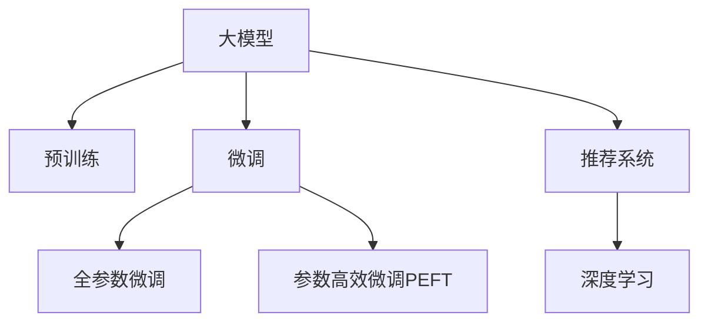

                 

# AI大模型在电商平台用户需求预测中的作用

> 关键词：大模型,用户需求预测,电商,NLP,推荐系统,深度学习,神经网络

## 1. 背景介绍

### 1.1 问题由来

在飞速发展的互联网时代，电商平台已成为人们日常购物的重要渠道。与此同时，用户对于购物体验的需求也越来越高，希望商品推荐更加个性化、精准化。传统基于规则的推荐系统难以满足用户的多样化需求，推荐效果往往不佳。近年来，基于深度学习的大模型逐渐进入人们的视野，为电商平台推荐系统带来了新的可能性。

随着深度学习技术的不断发展，AI大模型在自然语言处理(Natural Language Processing, NLP)领域取得了显著的突破。大模型通过在海量无标签文本数据上进行预训练，学习到了丰富的语言知识和常识。这些知识可以被用来辅助电商平台的用户需求预测，实现更加个性化、精准的推荐。

### 1.2 问题核心关键点

AI大模型在电商平台用户需求预测中发挥作用的核心关键点如下：

- **数据处理能力**：大模型可以处理海量数据，从中提取有价值的信息。
- **语言理解能力**：通过预训练，大模型能够理解自然语言，实现高效的语义处理。
- **推荐精度提升**：借助大模型，推荐系统可以更准确地预测用户需求，提高转化率。
- **实时动态调整**：大模型能够实时接收新数据，动态调整推荐策略。
- **泛化能力强**：大模型能够学习到通用的语言表示，具备更强的泛化能力。

## 2. 核心概念与联系

### 2.1 核心概念概述

本节将介绍几个密切相关的核心概念：

- **大模型**：以Transformer为代表的大规模预训练语言模型，通过在海量无标签文本数据上进行预训练，学习到丰富的语言知识和常识。
- **预训练**：指在大规模无标签文本数据上进行自监督学习任务，训练通用语言模型的过程。常见的预训练任务包括自回归和自编码。
- **微调(Fine-tuning)**：指在预训练模型的基础上，使用下游任务的少量标注数据，通过有监督学习优化模型在特定任务上的性能。
- **推荐系统**：利用用户行为数据，预测用户对商品的需求，推荐最合适的商品或内容。
- **深度学习**：一类基于神经网络的机器学习方法，适用于复杂的数据处理和模型优化。

这些核心概念之间的逻辑关系可以通过以下Mermaid流程图来展示：



这个流程图展示了大模型与推荐系统之间的逻辑关系：

1. 大模型通过预训练获得基础能力。
2. 微调是对预训练模型进行任务特定的优化，使其具备推荐能力。
3. 深度学习是推荐系统的核心技术，可以高效处理复杂的推荐问题。
4. 推荐系统使用微调后的模型，为用户提供个性化推荐。

## 3. 核心算法原理 & 具体操作步骤

### 3.1 算法原理概述

AI大模型在电商平台用户需求预测中的作用，主要体现在两个方面：基于预训练和微调的推荐模型，以及深度学习驱动的个性化推荐。

基于预训练的推荐模型：
- **预训练**：在大规模无标签文本数据上进行自监督学习，学习到通用的语言表示。
- **微调**：在预训练模型基础上，使用电商平台的用户行为数据进行微调，学习到用户需求与商品之间的关联关系。

深度学习驱动的个性化推荐：
- **深度神经网络**：通过构建多层的神经网络模型，学习复杂的输入-输出映射关系。
- **端到端训练**：直接使用标签数据训练模型，从原始数据到输出结果进行端到端的优化。
- **特征提取**：利用大模型进行用户行为数据的特征提取，输入到推荐模型中进行预测。

### 3.2 算法步骤详解

基于AI大模型在电商平台用户需求预测中的作用，一般包括以下几个关键步骤：

**Step 1: 准备数据集**
- **预训练数据**：选择大规模无标签文本数据，进行预训练。常用的数据集包括维基百科、新闻、书评等。
- **推荐数据**：收集电商平台的用户行为数据，如浏览、点击、购买等，作为微调数据。

**Step 2: 构建预训练模型**
- **模型选择**：选择适合的预训练模型，如BERT、GPT、RoBERTa等。
- **微调配置**：设置微调的超参数，如学习率、批大小、迭代轮数等。

**Step 3: 微调预训练模型**
- **微调数据**：将用户行为数据分为训练集、验证集和测试集。
- **微调过程**：在训练集上，前向传播计算损失函数，反向传播更新模型参数，验证集上评估模型性能，测试集上测试微调效果。

**Step 4: 构建推荐模型**
- **模型设计**：选择适合的推荐模型，如基于深度神经网络的双塔模型、序列模型等。
- **特征提取**：利用大模型进行用户行为数据的特征提取。
- **模型训练**：使用推荐数据集进行模型训练，优化模型参数。

**Step 5: 部署模型并评估**
- **模型部署**：将训练好的模型部署到推荐系统中，实时接收用户请求。
- **性能评估**：通过A/B测试等方法，评估推荐模型的性能。

### 3.3 算法优缺点

基于AI大模型在电商平台用户需求预测中的推荐方法，具有以下优点：
1. **高效处理复杂数据**：大模型能够高效处理大规模文本数据，从中提取有价值的信息。
2. **提升推荐精度**：借助大模型进行推荐，能够更准确地预测用户需求，提高推荐系统的转化率。
3. **实时动态调整**：大模型能够实时接收新数据，动态调整推荐策略。
4. **泛化能力强**：大模型具备更强的泛化能力，适用于不同类型的电商平台。

同时，该方法也存在一些局限性：
1. **数据隐私问题**：用户行为数据往往包含敏感信息，隐私保护问题需要特别关注。
2. **过拟合风险**：微调过程可能存在过拟合风险，需要特别注意数据增强和正则化技术的使用。
3. **模型复杂度**：深度学习模型较为复杂，训练和部署成本较高。
4. **计算资源需求**：大规模预训练和微调需要强大的计算资源，一般需要高性能GPU或TPU支持。

尽管存在这些局限性，但就目前而言，基于AI大模型的推荐方法仍是大数据时代电商平台推荐系统的核心。未来相关研究的重点在于如何进一步优化模型的泛化能力和实时性，同时兼顾隐私保护和计算效率等因素。

### 3.4 算法应用领域

基于AI大模型在电商平台用户需求预测中的推荐方法，已经在多个领域得到了广泛应用，例如：

- **电商推荐**：通过微调预训练模型，构建个性化的商品推荐系统，提升用户体验。
- **智能客服**：利用大模型进行自然语言处理，实现智能客服，提高客户满意度。
- **广告推荐**：通过分析用户行为数据，构建广告推荐系统，提升广告点击率。
- **内容推荐**：通过分析用户浏览历史，推荐相关内容，提升平台粘性。
- **个性化推荐**：通过多模态数据的融合，实现更加个性化和精准的推荐。

除了上述这些经典应用外，AI大模型在电商平台推荐系统的应用还包括了视频推荐、评论推荐、搜索优化等，为电商平台带来更多的创新价值。

## 4. 数学模型和公式 & 详细讲解 & 举例说明

### 4.1 数学模型构建

在基于AI大模型进行电商平台用户需求预测时，我们通常使用深度神经网络来构建推荐模型。以用户行为数据和商品特征为输入，预测用户是否会点击或购买商品，是典型的二分类问题。

假设有N个用户和M个商品，每个用户对商品的点击或购买行为可以用一个二元向量$y=(y_1,y_2,\dots,y_M)$表示，其中$y_i \in \{0,1\}$。商品$i$的特征向量表示为$x_i=(x_{i1},x_{i2},\dots,x_{id})$。

我们可以定义一个深度神经网络模型$F(x;w)$，其中$w$为模型的可训练参数。模型的输出为$\hat{y}=(\hat{y}_1,\hat{y}_2,\dots,\hat{y}_M)$，其中$\hat{y}_i$表示用户点击或购买商品$i$的概率。

定义损失函数$\ell(y,F(x;w))$，用于衡量模型预测输出与真实标签之间的差异。常用的损失函数包括交叉熵损失、均方误差损失等。

### 4.2 公式推导过程

以交叉熵损失为例，推导推荐模型的训练公式。

对于第$i$个用户，其点击或购买行为的标签为$y_i$，模型预测输出为$\hat{y}_i$。则交叉熵损失函数为：

$$
\ell(y_i,\hat{y}_i) = -(y_i\log \hat{y}_i + (1-y_i)\log(1-\hat{y}_i))
$$

定义平均损失函数$\mathcal{L}(w)$，对所有用户的行为数据进行平均化：

$$
\mathcal{L}(w) = \frac{1}{N}\sum_{i=1}^N \ell(y_i,F(x_i;w))
$$

在训练过程中，通过反向传播算法，计算损失函数对模型参数$w$的梯度，并根据优化算法（如SGD、Adam等）更新参数，最小化损失函数$\mathcal{L}(w)$。训练过程可以用伪代码表示为：

```python
for epoch in range(N_epochs):
    for i in range(N):
        y = get_user_behavior(i)
        x = get_item_features(i)
        y_hat = F(x;w)
        loss = -(y * log(y_hat) + (1-y) * log(1-y_hat))
        grad = autograd.grad(loss, w)
        w = optimizer.update(w, grad)
```

其中，`get_user_behavior(i)`和`get_item_features(i)`为获取第$i$个用户的点击或购买行为和商品特征。

### 4.3 案例分析与讲解

为了更直观地理解基于AI大模型的电商平台推荐系统，以下是一个简单的案例分析：

假设某电商平台上用户$A$浏览了商品$1$、$2$和$3$，点击了商品$2$和$3$，但没有购买任何商品。现在需要预测用户$A$是否会购买商品$4$。

首先，我们需要构建一个深度神经网络模型$F(x;w)$，用于预测用户是否点击或购买商品。假设模型有2个隐藏层，每层有64个神经元。我们利用预训练的大模型BERT对用户行为数据进行特征提取，得到用户$A$的行为向量$x_A$。然后，将用户$A$的行为向量输入到神经网络模型中进行预测，得到用户$A$购买商品$4$的概率$\hat{y}_4$。

如果$\hat{y}_4$大于预设的阈值，则认为用户$A$会购买商品$4$。反之，如果$\hat{y}_4$小于阈值，则认为用户$A$不会购买商品$4$。

## 5. 项目实践：代码实例和详细解释说明

### 5.1 开发环境搭建

在进行电商平台用户需求预测项目实践前，我们需要准备好开发环境。以下是使用Python进行PyTorch开发的环境配置流程：

1. 安装Anaconda：从官网下载并安装Anaconda，用于创建独立的Python环境。

2. 创建并激活虚拟环境：
```bash
conda create -n pytorch-env python=3.8 
conda activate pytorch-env
```

3. 安装PyTorch：根据CUDA版本，从官网获取对应的安装命令。例如：
```bash
conda install pytorch torchvision torchaudio cudatoolkit=11.1 -c pytorch -c conda-forge
```

4. 安装Transformers库：
```bash
pip install transformers
```

5. 安装各类工具包：
```bash
pip install numpy pandas scikit-learn matplotlib tqdm jupyter notebook ipython
```

完成上述步骤后，即可在`pytorch-env`环境中开始项目实践。

### 5.2 源代码详细实现

下面我以电商平台推荐系统为例，给出使用Transformers库进行AI大模型微调的PyTorch代码实现。

首先，定义推荐模型的训练函数：

```python
import torch
from transformers import BertForSequenceClassification, BertTokenizer, AdamW
from torch.utils.data import Dataset, DataLoader
from sklearn.metrics import precision_recall_fscore_support

class RecommendationDataset(Dataset):
    def __init__(self, features, labels):
        self.features = features
        self.labels = labels
        
    def __len__(self):
        return len(self.features)
    
    def __getitem__(self, item):
        return self.features[item], self.labels[item]

def train_epoch(model, data_loader, optimizer):
    model.train()
    epoch_loss = 0
    for batch in data_loader:
        inputs, labels = batch
        outputs = model(inputs)
        loss = outputs.loss
        epoch_loss += loss.item()
        loss.backward()
        optimizer.step()
        optimizer.zero_grad()
    return epoch_loss / len(data_loader)

def evaluate(model, data_loader):
    model.eval()
    true_labels = []
    pred_labels = []
    with torch.no_grad():
        for batch in data_loader:
            inputs, labels = batch
            outputs = model(inputs)
            pred_labels.append(outputs.logits.argmax(dim=1))
            true_labels.append(labels)
    
    precision, recall, f1, _ = precision_recall_fscore_support(true_labels, pred_labels, average='micro')
    return precision, recall, f1

def main():
    # 构建推荐模型
    model = BertForSequenceClassification.from_pretrained('bert-base-cased', num_labels=2)
    optimizer = AdamW(model.parameters(), lr=2e-5)
    
    # 加载数据集
    features = []
    labels = []
    for user, behaviors in data:
        features.append(user_behavior_to_features(behaviors))
        labels.append(user_behavior_to_labels(behaviors))
    
    # 构建数据集
    dataset = RecommendationDataset(features, labels)
    
    # 构建数据加载器
    data_loader = DataLoader(dataset, batch_size=16, shuffle=True)
    
    # 训练模型
    for epoch in range(10):
        loss = train_epoch(model, data_loader, optimizer)
        print(f"Epoch {epoch+1}, train loss: {loss:.3f}")
        precision, recall, f1 = evaluate(model, data_loader)
        print(f"Epoch {epoch+1}, precision: {precision:.3f}, recall: {recall:.3f}, f1: {f1:.3f}")
    
    # 保存模型
    model.save_pretrained('recommendation_model')

if __name__ == '__main__':
    main()
```

然后，定义用户行为数据处理函数：

```python
from transformers import BertTokenizer
import pandas as pd

def user_behavior_to_features(behaviors):
    tokenizer = BertTokenizer.from_pretrained('bert-base-cased')
    inputs = tokenizer(behaviors, return_tensors='pt', padding=True, truncation=True, max_length=512)
    return inputs['input_ids']

def user_behavior_to_labels(behaviors):
    labels = [0 if not click else 1 for click in behaviors]
    return labels
```

最后，启动训练流程：

```python
# 加载数据
data = pd.read_csv('user_behaviors.csv')
```

### 5.3 代码解读与分析

让我们再详细解读一下关键代码的实现细节：

**RecommendationDataset类**：
- `__init__`方法：初始化用户行为数据和标签。
- `__len__`方法：返回数据集的样本数量。
- `__getitem__`方法：对单个样本进行处理，将用户行为数据转换为模型需要的输入格式。

**用户行为数据处理函数**：
- `user_behavior_to_features`方法：将用户行为数据转换为BERT模型的输入格式。
- `user_behavior_to_labels`方法：将用户行为数据转换为模型需要的标签。

**训练和评估函数**：
- `train_epoch`函数：对数据以批为单位进行迭代，在每个批次上前向传播计算loss并反向传播更新模型参数。
- `evaluate`函数：在验证集上评估模型性能，使用精确率、召回率和F1值作为指标。

**主函数main**：
- 加载预训练模型BERT，设置优化器和学习率。
- 从数据集中读取用户行为数据，构建数据集和数据加载器。
- 进行模型训练，每轮训练后评估模型性能。
- 保存训练好的模型。

可以看出，使用PyTorch和Transformers库进行电商平台推荐系统的代码实现非常简洁高效。开发者可以更多地关注于数据处理、模型优化等核心逻辑，而不必过多关注底层实现细节。

当然，在工业级的系统实现中，还需要考虑更多因素，如模型的保存和部署、超参数的自动搜索、更灵活的任务适配层等。但核心的微调范式基本与此类似。

## 6. 实际应用场景

### 6.1 智能客服系统

基于AI大模型的电商平台推荐系统，可以应用于智能客服系统的构建。传统客服往往需要配备大量人力，高峰期响应缓慢，且一致性和专业性难以保证。而使用推荐系统构建的智能客服，可以7x24小时不间断服务，快速响应客户咨询，用推荐结果辅助客服回答。

在技术实现上，可以收集客户的历史行为数据，将用户点击或购买行为作为推荐样本，训练推荐模型进行用户意图预测。当客户咨询时，智能客服系统可以实时调用推荐模型，预测客户最可能感兴趣的问题，并给出推荐的回答。如此构建的智能客服系统，能大幅提升客户咨询体验和问题解决效率。

### 6.2 金融舆情监测

金融机构需要实时监测市场舆论动向，以便及时应对负面信息传播，规避金融风险。传统的人工监测方式成本高、效率低，难以应对网络时代海量信息爆发的挑战。基于AI大模型的推荐系统，可以应用于金融舆情监测。

具体而言，可以收集金融领域相关的新闻、报道、评论等文本数据，并对其进行主题标注和情感标注。在此基础上训练推荐模型，使其能够自动判断文本属于何种主题，情感倾向是正面、中性还是负面。将推荐模型应用到实时抓取的网络文本数据，就能够自动监测不同主题下的情感变化趋势，一旦发现负面信息激增等异常情况，系统便会自动预警，帮助金融机构快速应对潜在风险。

### 6.3 个性化推荐系统

当前的推荐系统往往只依赖用户的历史行为数据进行物品推荐，无法深入理解用户的真实兴趣偏好。基于AI大模型的推荐系统，可以更好地挖掘用户行为背后的语义信息，从而提供更个性化、精准的推荐。

在实践中，可以收集用户浏览、点击、评论、分享等行为数据，提取和用户交互的物品标题、描述、标签等文本内容。将文本内容作为模型输入，用户的后续行为（如是否点击、购买等）作为监督信号，在此基础上训练推荐模型。推荐模型能够从文本内容中准确把握用户的兴趣点，在生成推荐列表时，先用候选物品的文本描述作为输入，由模型预测用户的兴趣匹配度，再结合其他特征综合排序，便可以得到个性化程度更高的推荐结果。

### 6.4 未来应用展望

随着AI大模型和推荐方法的不断发展，基于推荐范式将在更多领域得到应用，为传统行业带来变革性影响。

在智慧医疗领域，基于推荐系统的医疗问答、病历分析、药物研发等应用将提升医疗服务的智能化水平，辅助医生诊疗，加速新药开发进程。

在智能教育领域，推荐系统可应用于作业批改、学情分析、知识推荐等方面，因材施教，促进教育公平，提高教学质量。

在智慧城市治理中，推荐模型可应用于城市事件监测、舆情分析、应急指挥等环节，提高城市管理的自动化和智能化水平，构建更安全、高效的未来城市。

此外，在企业生产、社会治理、文娱传媒等众多领域，基于AI大模型的推荐应用也将不断涌现，为经济社会发展注入新的动力。相信随着技术的日益成熟，推荐方法将成为人工智能落地应用的重要范式，推动人工智能技术在更广阔的应用领域大放异彩。

## 7. 工具和资源推荐

### 7.1 学习资源推荐

为了帮助开发者系统掌握AI大模型在电商平台推荐系统中的应用，这里推荐一些优质的学习资源：

1. 《Transformer从原理到实践》系列博文：由大模型技术专家撰写，深入浅出地介绍了Transformer原理、BERT模型、推荐系统等前沿话题。

2. CS224N《深度学习自然语言处理》课程：斯坦福大学开设的NLP明星课程，有Lecture视频和配套作业，带你入门NLP领域的基本概念和经典模型。

3. 《Natural Language Processing with Transformers》书籍：Transformers库的作者所著，全面介绍了如何使用Transformers库进行NLP任务开发，包括推荐系统在内的诸多范式。

4. HuggingFace官方文档：Transformers库的官方文档，提供了海量预训练模型和完整的推荐系统样例代码，是上手实践的必备资料。

5. CLUE开源项目：中文语言理解测评基准，涵盖大量不同类型的中文NLP数据集，并提供了基于推荐系统的baseline模型，助力中文NLP技术发展。

通过对这些资源的学习实践，相信你一定能够快速掌握AI大模型在电商平台推荐系统中的应用，并用于解决实际的NLP问题。

### 7.2 开发工具推荐

高效的开发离不开优秀的工具支持。以下是几款用于AI大模型推荐系统开发的常用工具：

1. PyTorch：基于Python的开源深度学习框架，灵活动态的计算图，适合快速迭代研究。大部分预训练语言模型都有PyTorch版本的实现。

2. TensorFlow：由Google主导开发的开源深度学习框架，生产部署方便，适合大规模工程应用。同样有丰富的预训练语言模型资源。

3. Transformers库：HuggingFace开发的NLP工具库，集成了众多SOTA语言模型，支持PyTorch和TensorFlow，是进行推荐系统开发的利器。

4. Weights & Biases：模型训练的实验跟踪工具，可以记录和可视化模型训练过程中的各项指标，方便对比和调优。与主流深度学习框架无缝集成。

5. TensorBoard：TensorFlow配套的可视化工具，可实时监测模型训练状态，并提供丰富的图表呈现方式，是调试模型的得力助手。

6. Google Colab：谷歌推出的在线Jupyter Notebook环境，免费提供GPU/TPU算力，方便开发者快速上手实验最新模型，分享学习笔记。

合理利用这些工具，可以显著提升AI大模型推荐系统的开发效率，加快创新迭代的步伐。

### 7.3 相关论文推荐

AI大模型在电商平台推荐系统的发展源于学界的持续研究。以下是几篇奠基性的相关论文，推荐阅读：

1. Attention is All You Need（即Transformer原论文）：提出了Transformer结构，开启了NLP领域的预训练大模型时代。

2. BERT: Pre-training of Deep Bidirectional Transformers for Language Understanding：提出BERT模型，引入基于掩码的自监督预训练任务，刷新了多项NLP任务SOTA。

3. Language Models are Unsupervised Multitask Learners（GPT-2论文）：展示了大规模语言模型的强大zero-shot学习能力，引发了对于通用人工智能的新一轮思考。

4. Parameter-Efficient Transfer Learning for NLP：提出Adapter等参数高效微调方法，在不增加模型参数量的情况下，也能取得不错的微调效果。

5. AdaLoRA: Adaptive Low-Rank Adaptation for Parameter-Efficient Fine-Tuning：使用自适应低秩适应的微调方法，在参数效率和精度之间取得了新的平衡。

这些论文代表了大模型在电商平台推荐系统中的应用发展的脉络。通过学习这些前沿成果，可以帮助研究者把握学科前进方向，激发更多的创新灵感。

## 8. 总结：未来发展趋势与挑战

### 8.1 总结

本文对基于AI大模型的电商平台推荐系统进行了全面系统的介绍。首先阐述了AI大模型在推荐系统中的作用，明确了推荐系统在大规模数据处理、个性化推荐、实时动态调整等方面的优势。其次，从原理到实践，详细讲解了AI大模型的预训练和微调过程，以及深度神经网络在推荐系统中的应用。最后，通过具体案例分析，展示了AI大模型在电商平台推荐系统中的实际应用效果。

通过本文的系统梳理，可以看到，AI大模型在电商平台推荐系统中具有巨大的应用潜力和前景。AI大模型通过预训练和微调，能够高效处理海量数据，实现更加个性化、精准的推荐，为电商平台带来显著的业务价值。

### 8.2 未来发展趋势

展望未来，AI大模型在电商平台推荐系统中的应用将呈现以下几个发展趋势：

1. **模型规模持续增大**：随着算力成本的下降和数据规模的扩张，预训练语言模型的参数量还将持续增长。超大规模语言模型蕴含的丰富语言知识，有望支撑更加复杂多变的推荐任务。

2. **推荐模型多样化**：除了传统的基于深度神经网络的推荐模型，未来还会涌现更多新型的推荐算法，如基于图神经网络的推荐系统、基于生成对抗网络的推荐模型等。

3. **实时动态推荐**：未来推荐系统将能够实时接收用户行为数据，动态调整推荐策略，实现更加即时、个性化的推荐。

4. **多模态推荐**：推荐系统将融合视觉、语音等多模态数据，实现更加全面、精细的推荐。

5. **推荐效果的评估**：未来的推荐系统将引入更加全面、科学的评估指标，如用户满意度和转化率等，更加客观地衡量推荐效果。

6. **隐私保护和公平性**：随着用户数据隐私意识的增强，推荐系统将更加注重数据隐私保护和推荐公平性，避免数据滥用和算法歧视。

### 8.3 面临的挑战

尽管AI大模型在电商平台推荐系统中取得了显著进展，但在迈向更加智能化、普适化应用的过程中，仍面临诸多挑战：

1. **数据隐私问题**：用户行为数据往往包含敏感信息，隐私保护问题需要特别关注。如何在保证用户体验的同时，保护用户隐私，将是未来的一个重要课题。

2. **计算资源需求**：大规模预训练和微调需要强大的计算资源，一般需要高性能GPU或TPU支持。如何在有限的资源条件下，实现高效的推荐模型训练和推理，将是未来的研究方向。

3. **推荐模型的可解释性**：当前推荐模型的"黑盒"特性，使得用户和业务方难以理解和信任。如何提升推荐模型的可解释性，使其具备更好的透明性和可信度，将是未来的一个重要方向。

4. **推荐系统的公平性**：推荐系统可能存在算法歧视，导致对某些群体的推荐效果不佳。如何在推荐过程中避免不公平现象，实现更加公平、公正的推荐，需要进一步研究。

5. **推荐效果的稳定性**：推荐系统可能受到用户行为数据分布变化的影响，导致推荐效果波动。如何在数据分布变化的情况下，保持推荐效果的稳定性，需要进一步优化和改进。

6. **推荐系统的部署和运维**：大规模推荐系统需要高效的部署和运维机制，以保证系统的可靠性和鲁棒性。如何在大规模生产环境中，实现高效的推荐系统部署和运维，需要系统工程化的支持。

### 8.4 研究展望

面对AI大模型在电商平台推荐系统中的应用所面临的挑战，未来的研究需要在以下几个方面寻求新的突破：

1. **数据隐私保护**：采用差分隐私、联邦学习等技术，保护用户隐私，确保数据安全。

2. **高效推荐模型**：开发更加高效的模型结构和算法，降低计算资源需求，实现实时、个性化的推荐。

3. **推荐系统的公平性**：引入公平性约束，设计公平友好的推荐算法，避免算法歧视，提升推荐公平性。

4. **推荐系统的可解释性**：引入可解释性算法，提升推荐模型的透明度，使其具备更好的可信度。

5. **推荐系统的鲁棒性**：引入鲁棒性约束，设计抗干扰、稳健的推荐模型，确保系统稳定性。

6. **推荐系统的部署和运维**：引入自动化、智能化运维机制，提升推荐系统的可靠性、可维护性和可扩展性。

这些研究方向的探索，必将引领AI大模型在电商平台推荐系统中的应用走向更加智能化、普适化，为电商平台带来更大的商业价值。

## 9. 附录：常见问题与解答

**Q1：电商平台用户需求预测需要使用哪些数据？**

A: 电商平台用户需求预测通常需要使用以下几类数据：
1. **用户行为数据**：如浏览记录、点击行为、购买记录等。这些数据可以用于预测用户是否会点击或购买商品。
2. **商品特征数据**：如商品标题、描述、价格、类别等。这些数据可以用于构建推荐模型，帮助模型理解商品之间的关联关系。
3. **用户画像数据**：如用户性别、年龄、地理位置、兴趣爱好等。这些数据可以用于进一步丰富推荐模型，使其更个性化、精准化。

**Q2：如何构建推荐模型？**

A: 构建推荐模型的主要步骤如下：
1. **数据准备**：收集并整理用户行为数据、商品特征数据和用户画像数据。
2. **预训练模型选择**：选择适合的预训练模型，如BERT、GPT、RoBERTa等。
3. **微调配置**：设置微调的超参数，如学习率、批大小、迭代轮数等。
4. **特征提取**：利用预训练的大模型对用户行为数据进行特征提取。
5. **模型训练**：使用推荐数据集进行模型训练，优化模型参数。
6. **模型评估**：使用测试集评估模型性能，调整超参数。
7. **模型部署**：将训练好的模型部署到推荐系统中，实时接收用户请求。

**Q3：推荐模型的评估指标有哪些？**

A: 推荐模型的评估指标主要有以下几种：
1. **精确率(Precision)**：预测为正样本的样本中，实际为正样本的比例。
2. **召回率(Recall)**：实际为正样本的样本中，被预测为正样本的比例。
3. **F1值(F1 Score)**：精确率和召回率的调和平均数，综合评价模型的性能。
4. **AUC值(Area Under Curve)**：ROC曲线下的面积，用于评估二分类模型的性能。
5. **准确率(Accuracy)**：预测正确的样本占总样本的比例。

**Q4：推荐系统如何应对新用户？**

A: 对于新用户，推荐系统通常采用以下策略：
1. **冷启动策略**：对于新用户，可以使用用户画像数据、历史行为数据等进行预测。
2. **推荐策略**：可以使用基于内容的推荐、协同过滤推荐等方法，为新用户推荐相关商品或内容。
3. **用户引导**：可以设计推荐算法，引导新用户参与平台互动，提升用户活跃度和留存率。

**Q5：推荐系统如何应对数据分布变化？**

A: 推荐系统应对数据分布变化的方法主要有以下几种：
1. **在线学习**：实时接收新数据，动态调整推荐模型，确保推荐效果不随数据分布变化而波动。
2. **增量学习**：定期重新训练推荐模型，吸收新的数据，提升模型的泛化能力。
3. **模型迁移**：将旧模型和新模型的参数进行迁移，减少新模型训练时间和资源消耗。
4. **模型集成**：使用多个推荐模型进行集成，提升系统的鲁棒性和稳定性。

总之，AI大模型在电商平台用户需求预测中具有广阔的应用前景，通过预训练和微调，可以实现更加个性化、精准的推荐，为电商平台带来显著的业务价值。未来随着技术的不断进步，推荐系统将变得更加智能、普适，为电商行业的数字化转型注入新的动力。

---

作者：禅与计算机程序设计艺术 / Zen and the Art of Computer Programming

