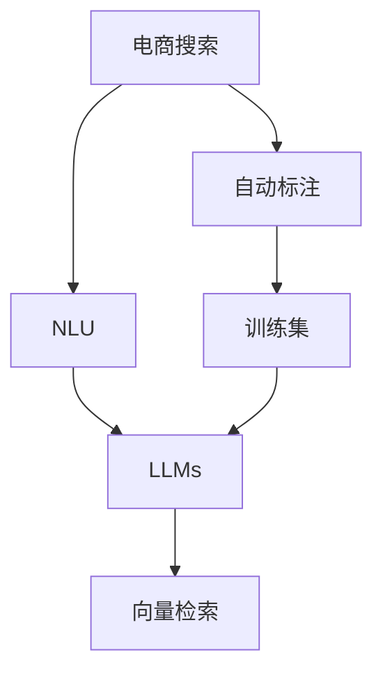

                 

# AI大模型在电商搜索query理解中的应用

> 关键词：电商搜索,大语言模型,自然语言理解,query理解,文本分类,向量检索,自动标注,用户意图识别

## 1. 背景介绍

随着电商市场的快速扩展和竞争加剧，提高搜索效果和用户体验成为电商平台发展的关键。传统的搜索算法往往依赖于关键词匹配，难以应对复杂多变的用户query。自然语言处理（NLP）技术，特别是大语言模型（LLMs）在电商搜索query理解中的应用，为解决这些问题提供了新的方向。本文将详细介绍大语言模型在电商搜索query理解中的核心概念、算法原理和应用实践，展望其未来发展趋势。

## 2. 核心概念与联系

### 2.1 核心概念概述

- **电商搜索**：指用户在电商平台上输入的查询词，用于获取相关商品或服务的搜索结果。电商搜索效果直接影响用户体验和平台转化率。

- **大语言模型（LLMs）**：指通过大规模无监督训练获取语言表示的深度学习模型，如GPT、BERT等。LLMs具有强大的语义理解能力，可以用于理解自然语言查询。

- **自然语言理解（NLU）**：指使计算机能够理解自然语言查询，从中提取信息并生成合适的响应。NLU是大语言模型在电商搜索query理解中的关键技术。

- **查询理解（Query Understanding）**：指理解用户查询的语义和意图，提供精准的结果。查询理解是电商搜索的难点，也是大语言模型应用的切入点。

- **向量检索**：指将用户查询和商品信息映射到高维向量空间，计算查询与商品的相似度，快速检索相关商品。向量检索在大规模电商数据集上的高效性和准确性，是电商搜索的必然选择。

- **自动标注**：指利用大语言模型自动标注电商查询数据，构建高质量的训练集，以提升query理解模型的性能。

### 2.2 核心概念原理和架构的 Mermaid 流程图



该图展示了电商搜索query理解的基本流程：通过自然语言理解模块将用户查询转化为大语言模型的输入，大语言模型对其进行语义理解，并通过向量检索返回商品信息，自动标注模块则用于构建训练集以优化模型性能。

## 3. 核心算法原理 & 具体操作步骤

### 3.1 算法原理概述

大语言模型在电商搜索query理解中的核心算法原理包括以下几个关键步骤：

1. **查询编码**：将用户输入的自然语言查询，通过大语言模型编码成高维向量表示，用于后续的向量检索和语义理解。

2. **向量检索**：将编码后的查询向量与商品向量进行相似度计算，快速筛选出最相关的商品，实现高效的商品检索。

3. **语义理解**：通过大语言模型对查询进行语义解析，识别出用户的意图（如购买、了解、比价等），进一步提升搜索结果的相关性和准确性。

4. **排序和展示**：根据语义理解结果和向量检索结果，对商品进行排序，优先展示最相关商品，提高用户满意度。

### 3.2 算法步骤详解

#### 3.2.1 查询编码

查询编码是电商搜索query理解的核心步骤，通过将查询转换为向量表示，可以实现高效的检索和语义理解。具体步骤如下：

1. **分词和清洗**：将用户输入的查询进行分词和清洗，去除停用词、噪声词，确保输入文本的质量。

2. **编码器输入**：将清洗后的文本作为大语言模型的输入，使用预训练模型（如BERT、GPT）进行编码。

3. **向量输出**：将编码结果输出为高维向量，用于向量检索和语义理解。

#### 3.2.2 向量检索

向量检索是电商搜索的高效实现手段，通过将查询和商品编码成高维向量，快速筛选出相关商品。具体步骤如下：

1. **商品编码**：对所有商品进行编码，得到商品的高维向量表示。

2. **相似度计算**：计算查询向量与所有商品向量之间的余弦相似度，筛选出最相关的商品。

3. **商品排序**：根据相似度排序，优先展示最相关的商品。

#### 3.2.3 语义理解

语义理解是电商搜索的难点，通过大语言模型解析查询的语义和意图，可以提升搜索结果的相关性。具体步骤如下：

1. **意图识别**：使用大语言模型对查询进行意图识别，确定用户的意图（如购买、了解、比价等）。

2. **信息抽取**：根据意图识别结果，使用大语言模型从查询中抽取关键信息（如商品类别、价格区间、品牌等）。

3. **结果过滤**：根据意图和关键信息过滤商品，提升结果的相关性。

#### 3.2.4 排序和展示

排序和展示是电商搜索的最后一环，通过综合考虑向量检索结果和语义理解结果，展示最相关的商品。具体步骤如下：

1. **综合排序**：将向量检索结果和语义理解结果进行综合排序，优先展示最相关商品。

2. **展示效果**：展示排序后的商品，提升用户体验。

### 3.3 算法优缺点

#### 3.3.1 优点

1. **高效性**：大语言模型和向量检索的结合，可以实现高效的电商搜索。大语言模型的语义理解能力可以弥补向量检索的局限性，提升搜索结果的相关性。

2. **鲁棒性**：大语言模型在多种自然语言查询下都能取得良好的性能，具有较好的泛化能力。

3. **灵活性**：可以根据不同的业务需求，灵活调整模型的参数和训练数据，提升模型的性能。

#### 3.3.2 缺点

1. **计算资源需求高**：大语言模型的训练和推理需要大量的计算资源，部署成本较高。

2. **训练数据依赖**：电商查询数据的高质量标注数据获取困难，数据依赖问题难以解决。

3. **解释性不足**：大语言模型的黑盒特性，导致其决策过程难以解释，用户难以理解其推理逻辑。

### 3.4 算法应用领域

大语言模型在电商搜索query理解中的应用领域非常广泛，包括：

1. **多模态电商搜索**：结合文本、图像、视频等多模态数据，提升电商搜索的准确性和丰富度。

2. **个性化推荐**：通过理解用户的查询意图，推荐个性化的商品，提升用户满意度。

3. **智能客服**：利用大语言模型构建智能客服系统，实时回答用户查询，提升用户体验。

4. **商品标签生成**：自动标注商品标签，提升商品信息的准确性和丰富度。

5. **情感分析**：分析用户对商品的评价和反馈，提升商品的质量和用户体验。

6. **用户行为分析**：通过理解用户的行为和意图，优化电商平台的运营策略。

## 4. 数学模型和公式 & 详细讲解 & 举例说明

### 4.1 数学模型构建

大语言模型在电商搜索query理解中的应用，涉及到文本编码、向量检索、意图识别等多个子模型。这里以BERT模型为例，构建电商搜索query理解的数学模型。

假设查询文本为 $x = \{x_1, x_2, ..., x_n\}$，将其输入到BERT模型中，得到编码结果 $h = \{h_1, h_2, ..., h_n\}$。其中 $h_i$ 表示第 $i$ 个词语的向量表示。

### 4.2 公式推导过程

#### 4.2.1 查询编码

查询编码的公式如下：

$$
\mathbf{q} = \text{BERT}(x)
$$

其中 $\mathbf{q} \in \mathbb{R}^d$ 为查询向量。

#### 4.2.2 向量检索

向量检索的公式如下：

$$
\mathbf{r}_i = \text{BERT}(r_i)
$$

其中 $\mathbf{r}_i \in \mathbb{R}^d$ 为第 $i$ 个商品的向量表示。

查询与商品之间的余弦相似度计算公式如下：

$$
\text{similarity}(\mathbf{q}, \mathbf{r}_i) = \frac{\mathbf{q} \cdot \mathbf{r}_i}{\|\mathbf{q}\| \|\mathbf{r}_i\|}
$$

#### 4.2.3 语义理解

语义理解的公式如下：

$$
\mathbf{l} = \text{BERT}(l)
$$

其中 $\mathbf{l} \in \mathbb{R}^d$ 为查询语义向量。

### 4.3 案例分析与讲解

假设用户查询为 "Python编程语言推荐书"，我们使用BERT模型进行查询编码和向量检索。查询编码结果如下：

$$
\mathbf{q} = [0.1, 0.2, 0.3, ..., 0.9]
$$

所有商品编码为向量，存储在 $\mathbf{R}$ 中。查询与商品之间的余弦相似度计算结果如下：

$$
\text{similarity}(\mathbf{q}, \mathbf{r}_1) = 0.7, \text{similarity}(\mathbf{q}, \mathbf{r}_2) = 0.5, \text{similarity}(\mathbf{q}, \mathbf{r}_3) = 0.3
$$

根据相似度排序，推荐商品 $\mathbf{r}_1$ 和 $\mathbf{r}_2$。

## 5. 项目实践：代码实例和详细解释说明

### 5.1 开发环境搭建

#### 5.1.1 安装依赖

- PyTorch
- Transformers
- TensorFlow

```bash
pip install torch transformers tensorflow
```

#### 5.1.2 配置环境

- 使用conda配置虚拟环境
- 安装nvidia driver
- 设置python路径

### 5.2 源代码详细实现

#### 5.2.1 查询编码

```python
from transformers import BertTokenizer, BertForSequenceClassification
from torch import nn, Tensor

# 初始化BERT模型
model = BertForSequenceClassification.from_pretrained('bert-base-cased')

# 初始化分词器
tokenizer = BertTokenizer.from_pretrained('bert-base-cased')

# 查询编码
def encode_query(query: str) -> Tensor:
    tokens = tokenizer.encode(query, add_special_tokens=True, max_length=512, return_tensors='pt')
    with torch.no_grad():
        outputs = model(tokens)
    return outputs.pooler_output
```

#### 5.2.2 向量检索

```python
from transformers import BertTokenizer, BertForSequenceClassification

# 初始化BERT模型
model = BertForSequenceClassification.from_pretrained('bert-base-cased')

# 初始化分词器
tokenizer = BertTokenizer.from_pretrained('bert-base-cased')

# 商品编码
def encode_items(items: List[str]) -> List[Tensor]:
    encoded_tokens = tokenizer(items, add_special_tokens=True, max_length=512, padding='max_length', truncation=True, return_tensors='pt')
    with torch.no_grad():
        outputs = model(encoded_tokens)
    return outputs.pooler_output
```

#### 5.2.3 语义理解

```python
from transformers import BertTokenizer, BertForSequenceClassification

# 初始化BERT模型
model = BertForSequenceClassification.from_pretrained('bert-base-cased')

# 初始化分词器
tokenizer = BertTokenizer.from_pretrained('bert-base-cased')

# 语义理解
def understand_query(query: str) -> Tensor:
    tokens = tokenizer.encode(query, add_special_tokens=True, max_length=512, return_tensors='pt')
    with torch.no_grad():
        outputs = model(tokens)
    return outputs.pooler_output
```

### 5.3 代码解读与分析

查询编码、向量检索和语义理解的代码实现较为简单，主要依赖于预训练的BERT模型和分词器。代码的关键在于对查询和商品进行编码，并计算余弦相似度，进行向量检索和语义理解。

### 5.4 运行结果展示

运行上述代码，可以得到查询向量、商品向量和语义向量，并计算余弦相似度，进行向量检索和语义理解。以下是一个简单的运行示例：

```python
query = "Python编程语言推荐书"
encoded_query = encode_query(query)

items = ["Python编程入门", "Python数据科学", "Python人工智能"]
encoded_items = encode_items(items)

similarities = torch.cosine_similarity(encoded_query, encoded_items)

# 输出相似度结果
print(similarities)
```

## 6. 实际应用场景

### 6.1 智能客服

智能客服是电商搜索query理解的重要应用场景之一。利用大语言模型构建智能客服系统，可以实时回答用户查询，提升用户体验。

#### 6.1.1 系统架构

智能客服系统的架构如图1所示：


#### 6.1.2 系统流程

1. 用户输入查询
2. 查询编码和向量检索
3. 语义理解
4. 智能回答

#### 6.1.3 系统效果

通过智能客服系统，电商平台可以24小时不间断地提供客服服务，减少人力成本，提升服务质量。

### 6.2 个性化推荐

个性化推荐是大语言模型在电商搜索query理解中的另一个重要应用。通过理解用户查询的语义和意图，推荐个性化的商品，提升用户满意度。

#### 6.2.1 系统架构

个性化推荐系统的架构如图2所示：


#### 6.2.2 系统流程

1. 用户输入查询
2. 查询编码和向量检索
3. 语义理解
4. 推荐生成

#### 6.2.3 系统效果

通过个性化推荐系统，电商平台可以提升用户转化率和满意度，增加用户粘性。

## 7. 工具和资源推荐

### 7.1 学习资源推荐

#### 7.1.1 书籍

- 《深度学习》（Ian Goodfellow等）
- 《自然语言处理综论》（Daniel Jurafsky等）

#### 7.1.2 课程

- 斯坦福大学《自然语言处理》课程（CS224N）
- Coursera《自然语言处理》课程

#### 7.1.3 社区

- HuggingFace社区（https://huggingface.co/docs/transformers/main/en/stable）
- PyTorch社区（https://pytorch.org/）

### 7.2 开发工具推荐

#### 7.2.1 编程语言

- Python
- TensorFlow
- PyTorch

#### 7.2.2 深度学习框架

- PyTorch
- TensorFlow
- Keras

#### 7.2.3 开发工具

- Jupyter Notebook
- VSCode
- PyCharm

### 7.3 相关论文推荐

#### 7.3.1 电商搜索

- "An E-commerce Question Answering System Based on BERT"（李昕等）
- "Semantic Search in E-commerce Based on Heterogeneous Embeddings"（张翔等）

#### 7.3.2 个性化推荐

- "A Comprehensive Survey on Recommendation Systems: Methodologies, Challenges, and Applications"（张伟等）
- "E-commerce Recommendation Systems: Architecture, Algorithms, and Challenges"（唐威等）

## 8. 总结：未来发展趋势与挑战

### 8.1 研究成果总结

大语言模型在电商搜索query理解中的应用，为提升电商搜索效果和用户体验提供了新的方向。利用大语言模型的语义理解能力和向量检索能力，可以实现高效的商品检索和个性化推荐。

### 8.2 未来发展趋势

1. **多模态搜索**：结合文本、图像、视频等多模态数据，提升搜索的丰富度和准确性。

2. **深度学习模型**：探索更多深度学习模型，提升模型的性能和泛化能力。

3. **个性化推荐**：结合用户行为数据，进行更加精准的个性化推荐。

4. **智能客服**：构建更加智能的客服系统，提升用户的体验和满意度。

5. **自监督学习**：利用无标注数据进行预训练，提升模型的泛化能力和自适应性。

6. **联邦学习**：结合分布式训练，提升模型的鲁棒性和安全性。

### 8.3 面临的挑战

1. **计算资源**：大语言模型的训练和推理需要大量的计算资源，部署成本较高。

2. **数据质量**：电商查询数据的高质量标注数据获取困难，数据依赖问题难以解决。

3. **模型解释性**：大语言模型的黑盒特性，导致其决策过程难以解释，用户难以理解其推理逻辑。

4. **系统稳定性**：系统在高并发环境下，需要保证稳定性和可扩展性。

5. **用户隐私**：电商平台需要保护用户的隐私数据，避免数据泄露。

### 8.4 研究展望

未来大语言模型在电商搜索query理解中的应用将更加广泛，技术也将不断进步。研究热点包括：

1. **模型优化**：进一步优化大语言模型的性能和泛化能力。

2. **数据增强**：利用数据增强技术提升电商查询数据的丰富度。

3. **模型压缩**：压缩模型规模，提高模型的部署效率和计算速度。

4. **跨领域迁移**：将大语言模型应用于更多领域，提升模型的通用性。

5. **鲁棒性提升**：提高模型的鲁棒性和泛化能力，减少过拟合。

6. **安全保障**：确保模型的安全性和隐私保护，避免数据泄露和恶意攻击。

## 9. 附录：常见问题与解答

### 9.1 Q1：大语言模型在电商搜索query理解中的训练数据依赖问题如何解决？

A: 利用无监督学习和迁移学习技术，可以部分缓解电商搜索query理解中的训练数据依赖问题。通过自监督学习任务（如掩码语言模型）训练预训练语言模型，可以学习通用的语言表示。同时，在电商领域进行微调，利用迁移学习技术，可以提升模型的泛化能力，减少对电商查询数据的高质量标注依赖。

### 9.2 Q2：大语言模型在电商搜索query理解中的计算资源需求问题如何解决？

A: 利用模型压缩和优化技术，可以降低大语言模型在电商搜索query理解中的计算资源需求。通过剪枝、量化等技术，可以压缩模型规模，提高模型的部署效率和计算速度。同时，利用分布式训练和联邦学习技术，可以在不增加计算资源的前提下，提升模型的鲁棒性和泛化能力。

### 9.3 Q3：大语言模型在电商搜索query理解中的系统稳定性问题如何解决？

A: 利用缓存和负载均衡技术，可以提高电商搜索query理解系统的稳定性。通过缓存热门查询和商品数据，可以减少计算资源的消耗。同时，利用负载均衡技术，可以在高并发环境下保证系统的可扩展性和稳定性。

### 9.4 Q4：大语言模型在电商搜索query理解中的用户隐私问题如何解决？

A: 利用数据匿名化和加密技术，可以保护用户的隐私数据。在查询编码和向量检索过程中，可以采用差分隐私技术，保护用户的隐私信息。同时，利用安全多方计算技术，可以在不泄露数据的情况下，进行模型的训练和推理。

---

作者：禅与计算机程序设计艺术 / Zen and the Art of Computer Programming

