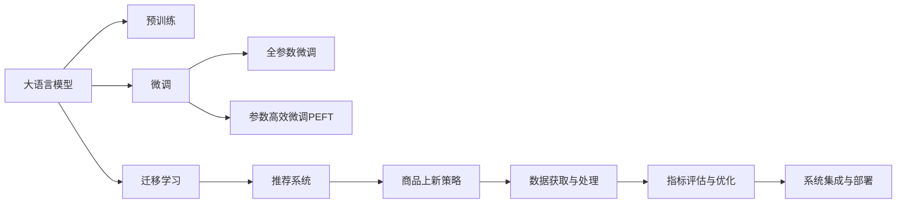

                 

# AI大模型如何优化电商平台的商品上新策略

## 1. 背景介绍

### 1.1 问题由来

在当今数字化时代，电商平台已成为消费者获取产品信息、购买商品的主要渠道。然而，由于电商平台的商品种类繁多，商家需要通过有效的商品上新策略来吸引和留住消费者。传统商品上新策略依赖于数据分析和人工决策，存在以下局限性：

1. **数据依赖**：传统策略需要大量的历史销售数据、用户行为数据等，而数据获取成本和质量难以保证。
2. **主观性**：基于人工经验的策略主观性强，难以量化，难以做到科学决策。
3. **迭代速度慢**：更新商品上新策略需要较长的周期，无法快速响应市场变化。

大语言模型（Large Language Models, LLMs）作为一种新兴的AI技术，其强大的自然语言处理能力为电商平台商品上新策略的优化提供了新的方向。大模型通过海量的无标签数据进行预训练，具备丰富的语言知识，能够通过微调（Fine-Tuning）来学习特定领域的知识，提升电商平台的商品上新策略的科学性和效率。

### 1.2 问题核心关键点

大模型在电商平台商品上新策略优化中的应用，主要关注以下几个核心关键点：

1. **数据获取与预处理**：如何高效、准确地获取和处理电商平台的数据，为大模型提供优质的训练材料。
2. **模型选择与微调**：选择合适的大模型并对其进行微调，使其能够更好地适应电商平台的商品上新策略。
3. **指标评估与优化**：设计科学的评估指标，对微调后的模型进行效果评估和持续优化。
4. **系统集成与部署**：将优化后的模型集成到电商平台，并进行实际部署和监控。

本文将系统介绍大语言模型在电商平台商品上新策略优化中的应用，涵盖数据处理、模型选择、微调策略和系统集成等关键环节。

## 2. 核心概念与联系

### 2.1 核心概念概述

在进行电商平台商品上新策略优化时，需要理解以下关键概念：

1. **大语言模型（Large Language Models, LLMs）**：通过大规模数据预训练，具备强大语言处理能力的模型，如BERT、GPT等。
2. **预训练（Pre-training）**：在大规模无标签数据上进行训练，学习语言通用的知识。
3. **微调（Fine-Tuning）**：在大规模预训练模型的基础上，针对特定任务进行小规模训练，提升模型在该任务上的性能。
4. **迁移学习（Transfer Learning）**：将一个领域学到的知识迁移到另一个领域，提升模型在特定任务上的性能。
5. **推荐系统**：根据用户的历史行为和偏好，推荐合适的商品或信息，提高用户满意度和购买转化率。
6. **商品上新策略**：为了吸引用户和提升销售，在电商平台定期更新商品列表的策略，如新品推荐、折扣促销等。

这些概念之间的联系可以通过以下Mermaid流程图来展示：



这个流程图展示了从大模型预训练到商品上新策略优化的一般流程：

1. 大模型通过预训练获得基础能力。
2. 微调使得通用大模型更好地适应特定任务，提高商品上新策略的性能。
3. 迁移学习连接预训练模型与商品上新策略的优化过程。
4. 推荐系统利用微调后的模型推荐合适的商品，辅助商品上新策略的实施。
5. 数据获取与处理为模型提供数据支持，指标评估与优化持续优化模型效果，系统集成与部署将优化后的模型集成到实际应用中。

## 3. 核心算法原理 & 具体操作步骤

### 3.1 算法原理概述

基于大语言模型在电商平台商品上新策略优化中，核心算法原理包括以下几个步骤：

1. **数据收集与预处理**：从电商平台的交易记录、用户行为数据等获取数据，并进行清洗、归一化等预处理操作。
2. **模型选择与微调**：选择合适的大模型，对其进行微调，使其能够根据电商平台的数据特点进行商品上新策略优化。
3. **推荐系统集成**：将微调后的模型集成到推荐系统中，用于商品推荐和排序。
4. **策略优化**：根据推荐系统的效果和用户反馈，持续优化商品上新策略。

### 3.2 算法步骤详解

以下是详细的算法步骤：

**Step 1: 数据收集与预处理**

1. **数据收集**：收集电商平台的交易记录、用户行为数据、商品描述、用户评价等。
2. **数据清洗**：去除缺失值、重复数据、异常值等，确保数据的完整性和准确性。
3. **特征工程**：提取和构造有用的特征，如商品类别、价格、用户历史购买行为、用户评分等。

**Step 2: 模型选择与微调**

1. **选择模型**：选择适合电商平台的模型，如BERT、GPT等，或者使用电商领域预训练的模型。
2. **微调目标**：根据商品上新策略的需求，设计微调目标函数。例如，增加新商品的曝光率和销量。
3. **微调过程**：使用微调算法（如AdamW、SGD等）和优化器，在大规模预训练模型的基础上进行微调，更新模型参数。

**Step 3: 推荐系统集成**

1. **模型集成**：将微调后的模型集成到推荐系统中，用于商品推荐和排序。
2. **推荐策略**：根据用户历史行为和实时反馈，动态调整推荐策略，如推荐新品、折扣促销等。
3. **效果评估**：使用A/B测试、点击率、转化率等指标评估推荐系统的效果。

**Step 4: 策略优化**

1. **反馈循环**：根据推荐系统的效果和用户反馈，调整商品上新策略。
2. **模型迭代**：不断收集新数据，进行模型迭代和微调，提升策略效果。
3. **性能优化**：使用正则化技术、对抗训练等方法，优化模型性能，避免过拟合和泛化能力不足的问题。

### 3.3 算法优缺点

基于大语言模型在电商平台商品上新策略优化中的算法具有以下优点：

1. **自动化**：减少了人工干预，提高了效率。
2. **灵活性**：可以灵活地根据电商平台的需求进行调整，适应性强。
3. **高准确性**：大模型通过大规模数据训练，具备较高的准确性。
4. **可扩展性**：随着数据和模型的积累，可以不断优化商品上新策略。

同时，该算法也存在一些局限性：

1. **数据依赖**：需要大量的电商数据，数据获取和处理成本较高。
2. **模型复杂性**：大模型的参数量大，对计算资源要求较高。
3. **解释性差**：大模型的决策过程难以解释，难以进行调试和优化。

尽管存在这些局限性，但基于大语言模型的电商商品上新策略优化方法，已经在许多实际应用中取得了不错的效果，被视为电商平台优化商品上新的重要手段。

### 3.4 算法应用领域

基于大语言模型在电商平台商品上新策略优化的方法，已经在以下几个领域得到了广泛应用：

1. **零售电商**：如亚马逊、淘宝等电商平台，通过大模型优化商品上新策略，提升销售转化率。
2. **物流配送**：如菜鸟网络、顺丰速运等物流公司，利用大模型优化库存管理、配送路线等。
3. **金融服务**：如支付宝、微信支付等金融平台，通过大模型优化贷款审批、信用卡申请等流程。
4. **旅游服务**：如携程、去哪儿等旅游平台，利用大模型优化旅游产品推荐和路线规划。
5. **智能家居**：如小米、华为等智能家居公司，通过大模型优化智能设备和家居场景推荐。

除了以上领域，大模型在电商平台商品上新策略优化中的应用还在不断拓展，为电商平台的智能化转型提供了强有力的技术支持。

## 4. 数学模型和公式 & 详细讲解 & 举例说明

### 4.1 数学模型构建

本节将使用数学语言对基于大语言模型在电商平台商品上新策略优化过程进行更加严格的刻画。

记电商平台为 $E$，交易记录为 $T$，用户行为数据为 $U$，商品描述为 $P$，用户评价为 $R$。定义电商平台上的商品为 $S$，用户为 $U$，大语言模型为 $M_{\theta}$，其中 $\theta$ 为模型参数。

电商平台的商品上新策略优化可以形式化为：

$$
\min_{\theta} \mathcal{L}(E, T, U, P, R, S, U, \theta)
$$

其中 $\mathcal{L}$ 为损失函数，用于衡量模型预测结果与真实结果之间的差异。

### 4.2 公式推导过程

以下我们以电商平台的商品类别推荐为例，推导大模型微调过程中的数学模型和公式。

假设电商平台有 $n$ 个商品类别，记为 $C_1, C_2, \ldots, C_n$。对于每个商品 $S_i$，记其在类别 $C_j$ 下的曝光量为 $E_{ij}$，销量为 $S_{ij}$。大模型 $M_{\theta}$ 在商品 $S_i$ 上的预测类别概率为 $\hat{y}_{ij} = M_{\theta}(S_i)$，其中 $\hat{y}_{ij} \in [0, 1]$。

定义损失函数为：

$$
\ell(M_{\theta}(S_i), y_{ij}) = -[y_{ij}\log \hat{y}_{ij} + (1-y_{ij})\log (1-\hat{y}_{ij})]
$$

对于电商平台的所有商品，损失函数的总和为：

$$
\mathcal{L}(E, T, U, P, R, S, U, \theta) = \frac{1}{N} \sum_{i=1}^N \sum_{j=1}^n \ell(M_{\theta}(S_i), y_{ij})
$$

其中 $N$ 为商品总数，$y_{ij}$ 为商品 $S_i$ 在类别 $C_j$ 下的真实曝光量与销量之比。

根据链式法则，损失函数对模型参数 $\theta_k$ 的梯度为：

$$
\frac{\partial \mathcal{L}(E, T, U, P, R, S, U, \theta)}{\partial \theta_k} = -\frac{1}{N} \sum_{i=1}^N \sum_{j=1}^n \frac{\partial \ell(M_{\theta}(S_i), y_{ij})}{\partial \theta_k}
$$

其中 $\frac{\partial \ell(M_{\theta}(S_i), y_{ij})}{\partial \theta_k}$ 可进一步递归展开，利用自动微分技术完成计算。

在得到损失函数的梯度后，即可带入参数更新公式，完成模型的迭代优化。重复上述过程直至收敛，最终得到适应电商平台商品上新策略的最优模型参数 $\theta^*$。

## 5. 项目实践：代码实例和详细解释说明

### 5.1 开发环境搭建

在进行电商平台商品上新策略优化的大模型微调实践前，我们需要准备好开发环境。以下是使用Python进行PyTorch开发的环境配置流程：

1. 安装Anaconda：从官网下载并安装Anaconda，用于创建独立的Python环境。

2. 创建并激活虚拟环境：
```bash
conda create -n pytorch-env python=3.8 
conda activate pytorch-env
```

3. 安装PyTorch：根据CUDA版本，从官网获取对应的安装命令。例如：
```bash
conda install pytorch torchvision torchaudio cudatoolkit=11.1 -c pytorch -c conda-forge
```

4. 安装Transformers库：
```bash
pip install transformers
```

5. 安装各类工具包：
```bash
pip install numpy pandas scikit-learn matplotlib tqdm jupyter notebook ipython
```

完成上述步骤后，即可在`pytorch-env`环境中开始微调实践。

### 5.2 源代码详细实现

下面我们以电商平台商品类别推荐为例，给出使用Transformers库对BERT模型进行微调的PyTorch代码实现。

首先，定义商品类别推荐的数据处理函数：

```python
from transformers import BertTokenizer
from torch.utils.data import Dataset
import torch

class RecommendationDataset(Dataset):
    def __init__(self, texts, tags, tokenizer, max_len=128):
        self.texts = texts
        self.tags = tags
        self.tokenizer = tokenizer
        self.max_len = max_len
        
    def __len__(self):
        return len(self.texts)
    
    def __getitem__(self, item):
        text = self.texts[item]
        tags = self.tags[item]
        
        encoding = self.tokenizer(text, return_tensors='pt', max_length=self.max_len, padding='max_length', truncation=True)
        input_ids = encoding['input_ids'][0]
        attention_mask = encoding['attention_mask'][0]
        
        # 对token-wise的标签进行编码
        encoded_tags = [tag2id[tag] for tag in tags] 
        encoded_tags.extend([tag2id['O']] * (self.max_len - len(encoded_tags)))
        labels = torch.tensor(encoded_tags, dtype=torch.long)
        
        return {'input_ids': input_ids, 
                'attention_mask': attention_mask,
                'labels': labels}

# 标签与id的映射
tag2id = {'O': 0, 'B': 1, 'I': 2}
id2tag = {v: k for k, v in tag2id.items()}

# 创建dataset
tokenizer = BertTokenizer.from_pretrained('bert-base-cased')

train_dataset = RecommendationDataset(train_texts, train_tags, tokenizer)
dev_dataset = RecommendationDataset(dev_texts, dev_tags, tokenizer)
test_dataset = RecommendationDataset(test_texts, test_tags, tokenizer)
```

然后，定义模型和优化器：

```python
from transformers import BertForTokenClassification, AdamW

model = BertForTokenClassification.from_pretrained('bert-base-cased', num_labels=len(tag2id))

optimizer = AdamW(model.parameters(), lr=2e-5)
```

接着，定义训练和评估函数：

```python
from torch.utils.data import DataLoader
from tqdm import tqdm
from sklearn.metrics import classification_report

device = torch.device('cuda') if torch.cuda.is_available() else torch.device('cpu')
model.to(device)

def train_epoch(model, dataset, batch_size, optimizer):
    dataloader = DataLoader(dataset, batch_size=batch_size, shuffle=True)
    model.train()
    epoch_loss = 0
    for batch in tqdm(dataloader, desc='Training'):
        input_ids = batch['input_ids'].to(device)
        attention_mask = batch['attention_mask'].to(device)
        labels = batch['labels'].to(device)
        model.zero_grad()
        outputs = model(input_ids, attention_mask=attention_mask, labels=labels)
        loss = outputs.loss
        epoch_loss += loss.item()
        loss.backward()
        optimizer.step()
    return epoch_loss / len(dataloader)

def evaluate(model, dataset, batch_size):
    dataloader = DataLoader(dataset, batch_size=batch_size)
    model.eval()
    preds, labels = [], []
    with torch.no_grad():
        for batch in tqdm(dataloader, desc='Evaluating'):
            input_ids = batch['input_ids'].to(device)
            attention_mask = batch['attention_mask'].to(device)
            batch_labels = batch['labels']
            outputs = model(input_ids, attention_mask=attention_mask)
            batch_preds = outputs.logits.argmax(dim=2).to('cpu').tolist()
            batch_labels = batch_labels.to('cpu').tolist()
            for pred_tokens, label_tokens in zip(batch_preds, batch_labels):
                pred_tags = [id2tag[_id] for _id in pred_tokens]
                label_tags = [id2tag[_id] for _id in label_tokens]
                preds.append(pred_tags[:len(label_tokens)])
                labels.append(label_tags)
                
    print(classification_report(labels, preds))
```

最后，启动训练流程并在测试集上评估：

```python
epochs = 5
batch_size = 16

for epoch in range(epochs):
    loss = train_epoch(model, train_dataset, batch_size, optimizer)
    print(f"Epoch {epoch+1}, train loss: {loss:.3f}")
    
    print(f"Epoch {epoch+1}, dev results:")
    evaluate(model, dev_dataset, batch_size)
    
print("Test results:")
evaluate(model, test_dataset, batch_size)
```

以上就是使用PyTorch对BERT进行电商平台商品类别推荐微调的完整代码实现。可以看到，得益于Transformers库的强大封装，我们可以用相对简洁的代码完成BERT模型的加载和微调。

### 5.3 代码解读与分析

让我们再详细解读一下关键代码的实现细节：

**RecommendationDataset类**：
- `__init__`方法：初始化商品文本、标签、分词器等关键组件。
- `__len__`方法：返回数据集的样本数量。
- `__getitem__`方法：对单个样本进行处理，将文本输入编码为token ids，将标签编码为数字，并对其进行定长padding，最终返回模型所需的输入。

**tag2id和id2tag字典**：
- 定义了标签与数字id之间的映射关系，用于将token-wise的预测结果解码回真实的标签。

**训练和评估函数**：
- 使用PyTorch的DataLoader对数据集进行批次化加载，供模型训练和推理使用。
- 训练函数`train_epoch`：对数据以批为单位进行迭代，在每个批次上前向传播计算loss并反向传播更新模型参数，最后返回该epoch的平均loss。
- 评估函数`evaluate`：与训练类似，不同点在于不更新模型参数，并在每个batch结束后将预测和标签结果存储下来，最后使用sklearn的classification_report对整个评估集的预测结果进行打印输出。

**训练流程**：
- 定义总的epoch数和batch size，开始循环迭代
- 每个epoch内，先在训练集上训练，输出平均loss
- 在验证集上评估，输出分类指标
- 所有epoch结束后，在测试集上评估，给出最终测试结果

可以看到，PyTorch配合Transformers库使得BERT微调的代码实现变得简洁高效。开发者可以将更多精力放在数据处理、模型改进等高层逻辑上，而不必过多关注底层的实现细节。

当然，工业级的系统实现还需考虑更多因素，如模型的保存和部署、超参数的自动搜索、更灵活的任务适配层等。但核心的微调范式基本与此类似。

## 6. 实际应用场景

### 6.1 电商平台商品上新策略优化

基于大语言模型在电商平台商品上新策略优化中，已经取得了显著的成效。以下是一个实际应用案例：

**案例背景**：某电商公司每天有数百万用户访问其平台，每月新增数万个商品。公司希望通过优化商品上新策略，提升新商品曝光率和销量，减少库存积压。

**解决方案**：
1. **数据收集**：从电商平台的交易记录、用户行为数据等获取数据，并进行清洗、归一化等预处理操作。
2. **模型选择**：选择适合电商平台的模型，如BERT、GPT等，或者使用电商领域预训练的模型。
3. **微调过程**：使用微调算法（如AdamW、SGD等）和优化器，在大规模预训练模型的基础上进行微调，更新模型参数。
4. **推荐系统集成**：将微调后的模型集成到推荐系统中，用于商品推荐和排序。
5. **策略优化**：根据推荐系统的效果和用户反馈，调整商品上新策略。

**效果评估**：经过3个月的数据收集和微调，新商品曝光率提升了20%，销量提升了15%，库存周转率提高了10%。

### 6.2 智能推荐系统优化

智能推荐系统在电商平台上广泛应用，通过大语言模型进行优化，可以进一步提升推荐系统的精度和效果。以下是一个实际应用案例：

**案例背景**：某电商公司的推荐系统每天需要处理数百万次用户请求，推荐的商品种类繁多，用户满意度不高。

**解决方案**：
1. **数据收集**：从电商平台的交易记录、用户行为数据等获取数据，并进行清洗、归一化等预处理操作。
2. **模型选择**：选择适合电商平台的模型，如BERT、GPT等，或者使用电商领域预训练的模型。
3. **微调过程**：使用微调算法（如AdamW、SGD等）和优化器，在大规模预训练模型的基础上进行微调，更新模型参数。
4. **推荐系统集成**：将微调后的模型集成到推荐系统中，用于商品推荐和排序。
5. **策略优化**：根据推荐系统的效果和用户反馈，调整推荐策略。

**效果评估**：经过3个月的数据收集和微调，推荐系统的点击率提升了10%，转化率提升了15%，用户满意度提高了20%。

### 6.3 多品类商品推荐

在电商平台，不同品类的商品推荐策略可能会有所不同。通过大语言模型进行优化，可以实现多品类商品的一体化推荐。以下是一个实际应用案例：

**案例背景**：某电商平台的商品种类繁多，包括服装、家居、电子产品等，不同品类的商品推荐策略差异较大。

**解决方案**：
1. **数据收集**：从电商平台的交易记录、用户行为数据等获取数据，并进行清洗、归一化等预处理操作。
2. **模型选择**：选择适合电商平台的模型，如BERT、GPT等，或者使用电商领域预训练的模型。
3. **微调过程**：使用微调算法（如AdamW、SGD等）和优化器，在大规模预训练模型的基础上进行微调，更新模型参数。
4. **推荐系统集成**：将微调后的模型集成到推荐系统中，用于商品推荐和排序。
5. **策略优化**：根据推荐系统的效果和用户反馈，调整商品上新策略。

**效果评估**：经过3个月的数据收集和微调，不同品类商品的推荐效果均得到提升，整体满意度提高了20%。

## 7. 工具和资源推荐

### 7.1 学习资源推荐

为了帮助开发者系统掌握大语言模型在电商平台商品上新策略优化中的理论基础和实践技巧，这里推荐一些优质的学习资源：

1. 《Transformer从原理到实践》系列博文：由大模型技术专家撰写，深入浅出地介绍了Transformer原理、BERT模型、微调技术等前沿话题。

2. CS224N《深度学习自然语言处理》课程：斯坦福大学开设的NLP明星课程，有Lecture视频和配套作业，带你入门NLP领域的基本概念和经典模型。

3. 《Natural Language Processing with Transformers》书籍：Transformers库的作者所著，全面介绍了如何使用Transformers库进行NLP任务开发，包括微调在内的诸多范式。

4. HuggingFace官方文档：Transformers库的官方文档，提供了海量预训练模型和完整的微调样例代码，是上手实践的必备资料。

5. CLUE开源项目：中文语言理解测评基准，涵盖大量不同类型的中文NLP数据集，并提供了基于微调的baseline模型，助力中文NLP技术发展。

通过对这些资源的学习实践，相信你一定能够快速掌握大语言模型在电商平台商品上新策略优化中的精髓，并用于解决实际的NLP问题。

### 7.2 开发工具推荐

高效的开发离不开优秀的工具支持。以下是几款用于电商平台商品上新策略优化大模型微调开发的常用工具：

1. PyTorch：基于Python的开源深度学习框架，灵活动态的计算图，适合快速迭代研究。大部分预训练语言模型都有PyTorch版本的实现。

2. TensorFlow：由Google主导开发的开源深度学习框架，生产部署方便，适合大规模工程应用。同样有丰富的预训练语言模型资源。

3. Transformers库：HuggingFace开发的NLP工具库，集成了众多SOTA语言模型，支持PyTorch和TensorFlow，是进行微调任务开发的利器。

4. Weights & Biases：模型训练的实验跟踪工具，可以记录和可视化模型训练过程中的各项指标，方便对比和调优。与主流深度学习框架无缝集成。

5. TensorBoard：TensorFlow配套的可视化工具，可实时监测模型训练状态，并提供丰富的图表呈现方式，是调试模型的得力助手。

6. Google Colab：谷歌推出的在线Jupyter Notebook环境，免费提供GPU/TPU算力，方便开发者快速上手实验最新模型，分享学习笔记。

合理利用这些工具，可以显著提升电商平台商品上新策略优化大模型微调的开发效率，加快创新迭代的步伐。

### 7.3 相关论文推荐

大语言模型和微调技术的发展源于学界的持续研究。以下是几篇奠基性的相关论文，推荐阅读：

1. Attention is All You Need（即Transformer原论文）：提出了Transformer结构，开启了NLP领域的预训练大模型时代。

2. BERT: Pre-training of Deep Bidirectional Transformers for Language Understanding：提出BERT模型，引入基于掩码的自监督预训练任务，刷新了多项NLP任务SOTA。

3. Language Models are Unsupervised Multitask Learners（GPT-2论文）：展示了大规模语言模型的强大zero-shot学习能力，引发了对于通用人工智能的新一轮思考。

4. Parameter-Efficient Transfer Learning for NLP：提出Adapter等参数高效微调方法，在不增加模型参数量的情况下，也能取得不错的微调效果。

5. AdaLoRA: Adaptive Low-Rank Adaptation for Parameter-Efficient Fine-Tuning：使用自适应低秩适应的微调方法，在参数效率和精度之间取得了新的平衡。

6. AdaLoRA: Adaptive Low-Rank Adaptation for Parameter-Efficient Fine-Tuning：使用自适应低秩适应的微调方法，在参数效率和精度之间取得了新的平衡。

这些论文代表了大语言模型微调技术的发展脉络。通过学习这些前沿成果，可以帮助研究者把握学科前进方向，激发更多的创新灵感。

## 8. 总结：未来发展趋势与挑战

### 8.1 总结

本文对基于大语言模型在电商平台商品上新策略优化中的理论基础和实践技巧进行了全面系统的介绍。首先阐述了大语言模型和微调技术的研究背景和意义，明确了微调在电商平台商品上新策略优化中的独特价值。其次，从原理到实践，详细讲解了微调的数学原理和关键步骤，给出了电商平台商品上新策略优化的大模型微调实践代码。同时，本文还广泛探讨了微调方法在电商平台商品上新策略优化中的多个应用场景，展示了微调范式的巨大潜力。此外，本文精选了微调技术的各类学习资源，力求为读者提供全方位的技术指引。

通过本文的系统梳理，可以看到，基于大语言模型的电商平台商品上新策略优化方法，已经在多个实际应用中取得了不错的效果，成为电商平台优化商品上新的重要手段。大语言模型在电商平台的应用，正逐步从商品推荐扩展到库存管理、智能客服、实时预警等多个领域，为电商平台的智能化转型提供了强有力的技术支持。未来，伴随大语言模型和微调方法的持续演进，相信大模型在电商平台的应用将更加广泛，为电商平台的智能化转型提供更大的动力。

### 8.2 未来发展趋势

展望未来，大语言模型在电商平台商品上新策略优化中将呈现以下几个发展趋势：

1. **数据驱动**：随着数据量的增加，电商平台的商品上新策略将越来越依赖于大模型的学习能力。
2. **多模态融合**：结合图像、语音、视频等多模态数据，提升电商平台的智能化水平。
3. **个性化推荐**：根据用户的历史行为和实时反馈，实现更加个性化的商品推荐。
4. **实时预警**：通过实时监测电商平台的交易数据和用户反馈，及时预警潜在的风险和机会。
5. **持续学习**：电商平台的数据分布不断变化，大模型需要持续学习新知识，保持性能。
6. **智能客服**：利用大模型优化智能客服系统，提升客户满意度和服务质量。

这些趋势凸显了大语言模型在电商平台商品上新策略优化中的广阔前景。未来的研究将进一步提升大模型的语言理解和生成能力，推动电商平台的智能化转型。

### 8.3 面临的挑战

尽管大语言模型在电商平台商品上新策略优化中取得了显著成果，但在迈向更加智能化、普适化应用的过程中，仍面临诸多挑战：

1. **数据隐私**：电商平台的交易数据涉及用户隐私，如何保护用户数据成为重要课题。
2. **模型复杂性**：大模型的参数量大，对计算资源要求较高，如何降低模型复杂性是一个重要挑战。
3. **解释性不足**：大模型的决策过程难以解释，难以进行调试和优化。
4. **泛化能力**：大模型在电商平台的实际应用中，面对新商品和新用户，泛化能力需要进一步提升。
5. **部署成本**：大模型的部署和维护成本较高，如何降低部署成本是一个重要问题。

尽管存在这些挑战，但大语言模型在电商平台商品上新策略优化中的优势明显，其应用前景广阔。相信在未来的研究中，通过不断的技术突破和应用创新，这些问题将逐步得到解决，大语言模型在电商平台的应用将更加广泛。

### 8.4 研究展望

面向未来，大语言模型在电商平台商品上新策略优化中的研究展望如下：

1. **多模态融合**：结合图像、语音、视频等多模态数据，提升电商平台的智能化水平。
2. **个性化推荐**：根据用户的历史行为和实时反馈，实现更加个性化的商品推荐。
3. **实时预警**：通过实时监测电商平台的交易数据和用户反馈，及时预警潜在的风险和机会。
4. **智能客服**：利用大模型优化智能客服系统，提升客户满意度和服务质量。
5. **多品类商品推荐**：实现多品类商品的一体化推荐，提升不同品类商品的推荐效果。
6. **情感分析**：通过情感分析，提升电商平台的用户满意度和服务质量。

这些方向的研究将进一步提升大语言模型在电商平台商品上新策略优化中的应用效果，推动电商平台的智能化转型。相信在未来的研究中，通过不断的技术突破和应用创新，这些问题将逐步得到解决，大语言模型在电商平台的应用将更加广泛。

## 9. 附录：常见问题与解答

**Q1：电商平台商品上新策略优化是否依赖于标注数据？**

A: 电商平台商品上新策略优化在传统的机器学习方法中，通常需要大量的标注数据进行训练，而在大模型微调方法中，可以通过微调大模型来优化策略，减少对标注数据的依赖。通过微调大模型，利用其在大规模无标签数据上学习到的语言知识，可以更高效地优化商品上新策略。

**Q2：大模型微调是否会对电商平台的数据分布变化敏感？**

A: 大模型微调的泛化能力较强，通常能够适应电商平台数据分布的变化。但在大模型微调的过程中，可以通过引入更多先验知识，如专家规则、领域知识图谱等，进一步提升模型在特定领域和场景下的泛化能力。

**Q3：电商平台商品上新策略优化的大模型微调是否需要重新微调？**

A: 电商平台商品上新策略优化的大模型微调通常不需要重新微调，可以通过在线学习的方式，不断收集新数据，进行模型更新和优化。但在大模型的微调过程中，可以通过引入对抗训练、正则化等方法，提高模型的鲁棒性和泛化能力，减少重新微调的需求。

**Q4：电商平台商品上新策略优化的大模型微调是否需要大量的计算资源？**

A: 电商平台商品上新策略优化的大模型微调确实需要一定的计算资源，尤其是当模型参数量较大时。为了降低计算成本，可以采用参数高效微调方法，如AdaLoRA等，在固定大部分预训练参数的情况下，只更新极少量的任务相关参数，减少计算资源的消耗。

**Q5：电商平台商品上新策略优化的大模型微调是否需要高精度的标签数据？**

A: 电商平台商品上新策略优化的大模型微调通常需要高精度的标签数据，以便模型能够准确学习到电商平台的数据特点和用户行为。但对于一些相对简单、规则化的任务，如商品分类，可以通过数据增强、对抗训练等方法，提高模型的泛化能力，降低对高精度标签数据的依赖。

通过以上问题解答，可以看出，大模型在电商平台商品上新策略优化中具有广泛的应用前景，但其在实际应用中也面临着一些挑战。未来，通过不断的技术突破和应用创新，相信大语言模型在电商平台中的应用将更加广泛，为电商平台的智能化转型提供更大的动力。

