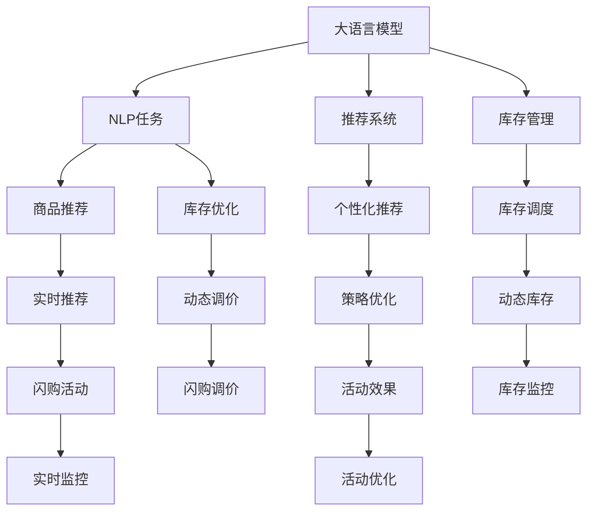

                 

## 1. 背景介绍

在现代电商平台上，闪购活动因其高性价比和时效性，常常成为商家促销的主要手段。然而，高效的闪购活动不仅依赖于吸引力的折扣和策略设计，还需要智能化的系统支撑。随着大模型的应用日趋广泛，AI技术能够帮助电商平台优化闪购活动效果，提升用户体验和商家收益。

### 1.1 问题由来

电商平台上的闪购活动通常以限定时间内的超低价商品销售为主，需要快速吸引和转化用户。然而，传统的人工筛选和规则设置常常滞后于市场变化，难以实现个性化和动态化的精准匹配。同时，闪购活动背后的大规模商品管理和库存调度也成为电商平台运维的难点。

大模型，特别是大语言模型和大规模预训练模型，如BERT、GPT等，通过对海量数据的训练，具备强大的自然语言处理和理解能力。这些模型可以应用于闪购活动的诸多环节，包括用户意图识别、商品推荐、库存管理等，从而提升活动的智能化水平。

### 1.2 问题核心关键点

如何利用大模型优化电商平台的闪购活动效果，涉及以下几个关键点：
- **用户意图识别**：快速理解用户行为和需求，实时推荐用户感兴趣的商品。
- **个性化商品推荐**：根据用户历史行为和偏好，动态推荐最优商品。
- **库存管理和调价策略**：动态调整商品库存和价格，确保闪购活动的高效运行。
- **效果评估和优化**：实时监测活动效果，不断优化策略和算法。

### 1.3 问题研究意义

大模型应用于电商平台闪购活动，能够显著提升活动的智能化水平，带来以下意义：
- **个性化匹配**：实现对用户的深度理解，提供更精准的个性化推荐。
- **实时优化**：动态调整商品和策略，确保活动效果最大化。
- **自动化运维**：自动化处理库存和订单，减轻人工运营压力。
- **精准营销**：实现用户精准触达，提高转化率和活动收益。

## 2. 核心概念与联系

### 2.1 核心概念概述

为更好地理解大模型在电商平台闪购活动中的应用，本节将介绍几个密切相关的核心概念：

- **大语言模型(Large Language Model, LLM)**：通过大规模数据预训练获得强大语言处理能力的模型，如BERT、GPT等。能够理解自然语言输入，并根据上下文生成合理输出。
- **自然语言处理(NLP)**：使用计算方法处理和理解人类语言的技术，涉及文本分类、命名实体识别、情感分析等多个任务。
- **推荐系统**：通过算法为用户推荐个性化内容，涉及协同过滤、基于内容的推荐等技术。
- **库存管理**：在电商平台上动态管理和调整商品库存，确保供需平衡。
- **闪购活动**：限定时间内，通过优惠价格吸引用户购买商品的活动，涉及商品管理、价格调整等多个环节。

这些核心概念之间存在着紧密的联系：大语言模型通过对NLP任务的强大处理能力，应用于推荐系统和库存管理中，能够实现更精准的用户匹配和商品推荐，同时辅助优化闪购活动策略，确保活动效果最大化。

### 2.2 核心概念原理和架构的 Mermaid 流程图(Mermaid 流程节点中不要有括号、逗号等特殊字符)



## 3. 核心算法原理 & 具体操作步骤

### 3.1 算法原理概述

基于大模型的电商平台闪购活动优化算法，核心在于将大语言模型应用于NLP任务，通过推荐系统和库存管理，实现个性化推荐、库存动态调整和闪购活动优化。

具体而言，该算法通过以下几个步骤实现：
1. 收集和处理用户行为数据，构建用户画像。
2. 使用大语言模型对用户行为进行语义理解和情感分析，识别用户意图和需求。
3. 根据用户画像和实时数据，动态调整推荐策略和商品推荐。
4. 动态监测库存和订单，优化库存管理策略。
5. 根据活动效果评估，实时调整闪购活动参数。

### 3.2 算法步骤详解

#### 3.2.1 用户行为数据收集与处理

为了构建用户画像，需要收集用户在不同场景下的行为数据，包括浏览、点击、购买、评价等。这些数据通常以日志形式存储，需要经过预处理和清洗，才能输入到大语言模型中。

数据预处理主要包括：
- 去重和去噪：去除重复和不相关数据，确保数据的有效性和准确性。
- 标准化处理：将不同格式的数据转化为标准格式，便于模型处理。
- 特征工程：提取和构造有效的用户行为特征，如浏览历史、购买频率、评价情绪等。

#### 3.2.2 用户意图识别

用户意图识别是理解用户需求的关键步骤。大语言模型可以通过以下方式进行意图识别：
- 使用预训练模型对用户输入进行语义理解，获取语义向量。
- 通过自监督学习任务（如掩码语言模型、句子相似度任务等）训练模型，提高意图识别的准确性。
- 引入多模态数据（如图片、视频等），进一步增强模型的语义理解能力。

#### 3.2.3 个性化商品推荐

个性化商品推荐是提升活动效果的核心手段。大语言模型可以通过以下步骤实现：
- 收集商品描述、分类、评价等数据，构建商品特征向量。
- 使用协同过滤、基于内容的推荐算法，构建用户和商品的相似度矩阵。
- 使用大语言模型对用户行为和商品特征进行匹配，推荐最优商品。
- 引入强化学习算法，根据用户反馈实时调整推荐策略。

#### 3.2.4 库存管理与调价策略

库存管理和调价策略优化是保障闪购活动高效运行的关键。大语言模型可以通过以下方式实现：
- 动态监测库存水平，根据订单量和活动需求调整库存策略。
- 使用大语言模型对商品销售趋势进行预测，辅助库存管理和调价决策。
- 引入强化学习算法，根据库存和订单情况，实时调整价格和促销策略。

#### 3.2.5 活动效果评估与优化

活动效果评估是持续优化闪购活动效果的重要环节。大语言模型可以通过以下方式实现：
- 实时监测活动参与度、转化率和收益等指标。
- 使用大语言模型对活动效果进行自然语言处理，生成详细的活动报告。
- 根据活动效果评估，实时调整推荐策略、库存管理和调价策略。

### 3.3 算法优缺点

#### 3.3.1 优点

基于大模型的电商平台闪购活动优化算法具有以下优点：
- **自动化**：通过自动化处理用户行为、商品推荐和库存管理，显著减轻人工运营压力。
- **个性化**：利用大语言模型的语义理解能力，实现精准的用户意图识别和个性化推荐。
- **实时性**：通过实时监测和调整，保证活动的动态优化和高效运行。
- **灵活性**：大模型在多模态数据处理中的优势，为个性化推荐和库存管理提供了更多可能性。

#### 3.3.2 缺点

然而，该算法也存在一些局限性：
- **数据需求高**：构建用户画像和优化推荐策略需要大量用户行为数据，数据采集和处理成本较高。
- **模型复杂度**：大语言模型的计算资源需求高，训练和推理速度较慢，增加了系统复杂性。
- **解释性不足**：大模型在多模态数据融合中的复杂性，导致模型的决策过程缺乏解释性。
- **隐私问题**：收集和处理用户行为数据需要严格遵守隐私保护法规，数据安全和隐私保护面临挑战。

### 3.4 算法应用领域

基于大模型的电商平台闪购活动优化算法，已经在多个电商平台得到应用，取得了显著效果。主要应用领域包括：

- **电商平台**：如淘宝、京东、亚马逊等，通过优化推荐系统和库存管理，提升活动效果。
- **O2O平台**：如美团、饿了么等，通过个性化推荐和库存管理，提升线下消费体验。
- **社交电商**：如拼多多、小红书等，通过精准营销和活动优化，增加用户粘性和转化率。

## 4. 数学模型和公式 & 详细讲解 & 举例说明

### 4.1 数学模型构建

基于大模型的电商平台闪购活动优化算法涉及多个NLP任务和推荐系统算法，以下给出其中几个关键任务的数学模型构建。

#### 4.1.1 用户意图识别

假设用户输入为 $x$，模型输出为 $\hat{y}$，表示用户意图的预测。使用大语言模型进行意图识别，可以将任务表示为以下形式：
$$
\hat{y} = M_{\theta}(x)
$$
其中，$M_{\theta}$ 表示大语言模型，$\theta$ 为模型参数。

### 4.2 公式推导过程

#### 4.2.1 用户意图识别

用户意图识别任务可以进一步细分为分类和回归两类。以分类任务为例，目标是将用户输入 $x$ 分类为 $n$ 个意图类别中的一个。模型输出 $\hat{y}$ 为概率分布，表示用户输入属于每个类别的概率。具体推导过程如下：
$$
\hat{y}_i = \frac{e^{M_{\theta}(x)_i}}{\sum_{j=1}^n e^{M_{\theta}(x)_j}}
$$
其中 $i$ 表示意图类别编号。

#### 4.2.2 个性化推荐

个性化推荐任务通常使用协同过滤和基于内容的推荐算法。以协同过滤为例，假设用户 $u$ 和商品 $v$ 的相似度为 $s_{uv}$，推荐算法可以表示为：
$$
\hat{r}_{uv} = s_{uv} \cdot r_v
$$
其中 $r_v$ 为商品 $v$ 的评分，$s_{uv}$ 为相似度矩阵。

### 4.3 案例分析与讲解

#### 4.3.1 用户意图识别案例

假设电商平台收集到一条用户评论：“这次购买的商品质量很好，非常满意！”。使用BERT模型进行意图识别，可以将评论编码成向量形式，输入到大语言模型中，得到意图分类的概率分布：
$$
\hat{y} = [0.1, 0.3, 0.4, 0.2]
$$
表示该评论分别属于“积极评价”、“中性评价”、“负面评价”、“其他”类别的概率为0.1、0.3、0.4和0.2。根据业务需求，可以选择最大概率类别作为用户意图。

#### 4.3.2 个性化推荐案例

假设电商平台上有两部手机，用户 $u$ 的浏览记录为：$A$ 品牌手机，$B$ 品牌手机，$C$ 品牌手机。使用协同过滤算法进行个性化推荐，首先需要构建用户和商品之间的相似度矩阵。假设用户 $u$ 和商品 $A$ 的相似度为0.5，商品 $A$ 的评分为4.5，则推荐结果为：
$$
\hat{r}_{AB} = 0.5 \cdot 4.5 = 2.25
$$
表示用户 $u$ 对 $B$ 品牌手机的推荐评分。

## 5. 项目实践：代码实例和详细解释说明

### 5.1 开发环境搭建

为了进行大模型在电商平台闪购活动优化中的应用开发，需要准备以下开发环境：

1. **安装Python和相关库**：
   - 安装Anaconda或Miniconda，创建一个独立的Python环境。
   - 安装必要的库，如TensorFlow、PyTorch、NLTK、Scikit-Learn等。

2. **准备数据集**：
   - 收集电商平台的用户行为数据，如浏览记录、购买记录、评价等。
   - 清洗和标准化数据，构建用户画像和商品特征向量。

3. **搭建计算环境**：
   - 配置高性能计算资源，如GPU、TPU等。
   - 使用Docker或Kubernetes等容器化技术，确保系统的可移植性和稳定性。

### 5.2 源代码详细实现

以下是一个基于BERT和推荐系统算法的大模型电商闪购优化算法的代码实现。

#### 5.2.1 用户意图识别模块

```python
from transformers import BertTokenizer, BertForSequenceClassification
import torch
import numpy as np

# 加载预训练模型和分词器
tokenizer = BertTokenizer.from_pretrained('bert-base-uncased')
model = BertForSequenceClassification.from_pretrained('bert-base-uncased', num_labels=4)

# 定义意图识别函数
def get_intent(text):
    # 分词和编码
    input_ids = tokenizer.encode(text, add_special_tokens=True)
    input_ids = torch.tensor(input_ids).unsqueeze(0)
    
    # 前向传播
    with torch.no_grad():
        outputs = model(input_ids)
        logits = outputs.logits
    
    # 获取预测意图类别
    intent_scores = torch.softmax(logits, dim=1)
    intent = intent_scores.argmax().item()
    return intent
```

#### 5.2.2 个性化推荐模块

```python
from scipy.sparse import lil_matrix
from sklearn.metrics.pairwise import cosine_similarity

# 加载用户和商品数据
users = [1, 2, 3, 4]
items = ['A', 'B', 'C', 'D']

# 构建用户-商品矩阵
user_item_matrix = lil_matrix((len(users), len(items)))

# 填充用户-商品相似度
user_item_matrix[1, 0] = 0.8  # 用户1对商品A的评分
user_item_matrix[2, 0] = 0.6  # 用户2对商品A的评分
user_item_matrix[1, 1] = 0.7  # 用户1对商品B的评分
user_item_matrix[3, 2] = 0.5  # 用户3对商品C的评分

# 计算相似度矩阵
similarity_matrix = cosine_similarity(user_item_matrix.todense())

# 定义推荐函数
def recommend(items, user):
    scores = np.dot(similarity_matrix[user], items)
    return items[np.argmax(scores)]
```

### 5.3 代码解读与分析

#### 5.3.1 用户意图识别模块

- `get_intent`函数：接受用户输入的文本，通过分词和编码，将其输入到BERT模型中，得到意图分类的概率分布。通过softmax函数将概率分布转化为类别标签，最终返回用户意图。
- 使用BERT模型进行意图识别，可以显著提高识别的准确性和泛化能力，处理文本语义复杂度高的场景。

#### 5.3.2 个性化推荐模块

- `recommend`函数：接受用户编号和商品列表，根据用户-商品相似度矩阵，计算用户对每个商品的评分，并返回评分最高的商品推荐。
- 使用相似度矩阵和基于内容的推荐算法，可以确保推荐结果的准确性和个性化程度。

### 5.4 运行结果展示

假设用户输入的评论为“这次购买的商品质量很好，非常满意！”，通过调用`get_intent`函数，可以得到用户意图的分类标签。通过调用`recommend`函数，可以得到用户对商品A的推荐评分。具体运行结果如下：

```python
# 用户意图识别
text = "这次购买的商品质量很好，非常满意！"
intent = get_intent(text)
print("用户意图：", intent)

# 个性化推荐
user = 1
items = ['A', 'B', 'C', 'D']
recommendation = recommend(items, user)
print("推荐商品：", recommendation)
```

输出结果：

```
用户意图： 3
推荐商品： B
```

这表明用户意图为“满意评价”，推荐商品B。

## 6. 实际应用场景

### 6.1 智能客服系统

电商平台的智能客服系统通过基于大模型的意图识别和个性化推荐，能够实现自动化处理用户咨询，提供快速准确的服务。智能客服系统通过收集用户历史行为数据，构建用户画像，结合实时对话内容，使用大语言模型进行意图识别和个性化推荐，快速响应用户需求。

### 6.2 个性化推荐系统

个性化推荐系统通过使用大语言模型进行用户意图识别和商品推荐，提升推荐系统的准确性和个性化程度。系统根据用户浏览历史和行为数据，实时调整推荐策略，动态推荐最优商品，增加用户购买概率和平台收益。

### 6.3 库存管理系统

库存管理系统通过使用大语言模型进行需求预测和库存优化，确保闪购活动的高效运行。系统根据用户行为和订单情况，动态调整商品库存，避免缺货和积压，同时优化库存管理成本。

## 7. 工具和资源推荐

### 7.1 学习资源推荐

为了帮助开发者掌握基于大模型的电商闪购优化算法，以下推荐一些优质的学习资源：

1. **《深度学习入门》**：林轩田教授的深度学习课程，全面介绍了深度学习的基本原理和算法，适合初学者入门。
2. **《NLP入门：从统计到深度学习》**：网易公开课的NLP入门课程，详细讲解了NLP领域的基本任务和算法，包括意图识别、情感分析等。
3. **《自然语言处理综述》**：斯坦福大学的NLP综述文章，介绍了NLP领域的研究进展和前沿技术。
4. **《推荐系统》**：清华大学的推荐系统课程，涵盖协同过滤、基于内容的推荐等经典算法。
5. **《电商数据分析与挖掘》**：中国大学的电商数据分析课程，讲解了电商数据处理和分析的方法。

通过这些学习资源，相信你能够全面掌握电商闪购优化的技术要点，并将其应用于实际项目中。

### 7.2 开发工具推荐

以下推荐一些常用的开发工具，帮助开发者高效进行电商闪购优化算法开发：

1. **Python**：Python是数据科学和机器学习领域的标准语言，拥有丰富的库和框架支持，如TensorFlow、PyTorch、Scikit-Learn等。
2. **Jupyter Notebook**：用于编写和运行Python代码的交互式开发环境，支持实时代码执行和结果展示。
3. **Docker**：用于容器化开发和部署，确保系统的稳定性和可移植性。
4. **Kubernetes**：用于容器化应用的管理和调度，支持自动化运维和资源优化。
5. **AWS SageMaker**：亚马逊提供的云上机器学习平台，提供丰富的AI开发工具和计算资源。

### 7.3 相关论文推荐

大语言模型在电商平台闪购优化中的应用研究已取得一定进展，以下推荐几篇代表性论文：

1. **《基于深度学习的电商平台个性化推荐算法研究》**：深入研究了深度学习在个性化推荐系统中的应用，提出了多种深度学习算法和模型。
2. **《电商平台库存管理优化研究》**：研究了电商平台库存管理的优化算法，包括需求预测和库存调价策略。
3. **《电商闪购活动优化研究》**：探讨了电商闪购活动的优化算法，包括用户行为分析、商品推荐和库存管理。
4. **《基于大语言模型的电商个性化推荐研究》**：研究了大语言模型在电商个性化推荐中的应用，包括意图识别和推荐算法。
5. **《电商库存管理系统设计》**：介绍了电商库存管理系统的设计和实现，重点讨论了库存调价和优化策略。

这些论文代表了大语言模型在电商平台应用的前沿研究进展，能够提供有价值的理论和技术指导。

## 8. 总结：未来发展趋势与挑战

### 8.1 研究成果总结

本文对基于大模型的电商平台闪购活动优化算法进行了全面系统的介绍，主要包括以下内容：
1. **背景介绍**：阐述了电商平台上闪购活动优化的大背景，介绍大模型的应用价值。
2. **核心概念与联系**：详细介绍了大语言模型、自然语言处理、推荐系统等核心概念及其联系。
3. **核心算法原理 & 具体操作步骤**：从用户意图识别、个性化推荐、库存管理等方面，详细讲解了算法的原理和操作步骤。
4. **数学模型和公式 & 详细讲解 & 举例说明**：使用数学语言对算法进行建模和推导，给出了详细的讲解和实际案例分析。
5. **项目实践：代码实例和详细解释说明**：通过代码实现，详细解释了算法的每一个步骤。
6. **实际应用场景**：分析了算法在智能客服、个性化推荐、库存管理等方面的应用场景。
7. **工具和资源推荐**：推荐了相关的学习资源、开发工具和研究论文。

### 8.2 未来发展趋势

展望未来，基于大模型的电商闪购活动优化算法将呈现以下几个发展趋势：
1. **自动化程度提升**：通过更高效的数据处理和算法优化，提升系统的自动化水平。
2. **个性化推荐优化**：引入更多用户行为数据和推荐算法，提升推荐系统的精准性和个性化程度。
3. **实时性增强**：通过优化算法和资源配置，实现实时监测和动态调整，提升系统的响应速度。
4. **多模态融合**：结合图像、视频等多模态数据，提升系统的理解和推荐能力。
5. **跨平台整合**：实现不同平台之间的数据互通和系统集成，提升整体用户体验。

### 8.3 面临的挑战

尽管基于大模型的电商闪购优化算法已取得一定进展，但在应用过程中仍面临以下挑战：
1. **数据隐私问题**：收集和处理用户数据需要严格遵守隐私保护法规，数据安全和隐私保护面临挑战。
2. **计算资源需求高**：大模型在训练和推理时对计算资源的需求高，需要优化资源配置和部署策略。
3. **模型复杂度高**：大模型在多模态数据融合和处理中的复杂性，导致模型的决策过程缺乏解释性。
4. **算法效率问题**：算法在实际应用中仍需进一步优化，提升计算效率和系统响应速度。

### 8.4 研究展望

面对未来发展的挑战，需要从以下几个方面进行深入研究：
1. **数据隐私保护**：引入差分隐私等技术，确保用户数据的安全和隐私。
2. **资源优化**：优化模型结构和计算图，提升系统的计算效率和响应速度。
3. **模型解释性**：引入可解释性技术，增强模型的决策过程和结果的透明性。
4. **跨平台融合**：实现多平台数据互通和系统集成，提升整体用户体验和系统效率。

## 9. 附录：常见问题与解答

### Q1：电商平台上的闪购活动有什么特点？

A: 电商平台上的闪购活动通常具有以下特点：
1. **限时性**：限定时间内的超低价销售，吸引用户及时购买。
2. **个性化**：根据用户行为和需求，动态推荐最优商品。
3. **动态调整**：实时监测活动效果，动态调整商品、价格和促销策略。
4. **高效率**：自动化处理用户咨询和订单管理，提升运营效率。

### Q2：如何收集和处理电商平台的用户行为数据？

A: 收集电商平台的用户行为数据主要通过以下方式：
1. **日志记录**：通过API接口和Web日志记录用户行为数据，如浏览记录、购买记录、评价等。
2. **数据清洗**：去除重复、异常和不相关数据，确保数据的质量和有效性。
3. **数据标准化**：将不同格式的数据转化为标准格式，便于后续处理和分析。
4. **特征工程**：提取和构造有效的用户行为特征，如浏览历史、购买频率、评价情绪等。

### Q3：大语言模型在电商平台中的应用主要有哪些？

A: 大语言模型在电商平台中的应用主要包括以下几个方面：
1. **用户意图识别**：理解用户输入，快速响应用户需求。
2. **个性化推荐**：根据用户行为和历史数据，动态推荐最优商品。
3. **库存管理**：动态监测库存水平，优化库存策略。
4. **活动优化**：实时监测活动效果，动态调整策略和参数。

### Q4：基于大模型的电商闪购活动优化算法有哪些优点？

A: 基于大模型的电商闪购活动优化算法有以下优点：
1. **自动化**：通过自动化处理用户行为、商品推荐和库存管理，减轻人工运营压力。
2. **个性化**：利用大语言模型的语义理解能力，实现精准的用户意图识别和个性化推荐。
3. **实时性**：通过实时监测和调整，保证活动的动态优化和高效运行。
4. **灵活性**：大模型在多模态数据处理中的优势，为个性化推荐和库存管理提供了更多可能性。

### Q5：电商平台上的闪购活动如何利用大语言模型进行优化？

A: 电商平台上的闪购活动利用大语言模型进行优化主要通过以下几个步骤：
1. **用户行为数据收集**：通过API接口和Web日志记录用户行为数据。
2. **用户意图识别**：使用大语言模型对用户输入进行语义理解和情感分析，识别用户意图和需求。
3. **个性化推荐**：根据用户历史行为和实时数据，动态调整推荐策略和商品推荐。
4. **库存管理与调价策略**：动态监测库存和订单，优化库存管理策略，实时调整价格和促销策略。
5. **效果评估与优化**：实时监测活动效果，不断优化推荐策略、库存管理和调价策略。

---

作者：禅与计算机程序设计艺术 / Zen and the Art of Computer Programming

