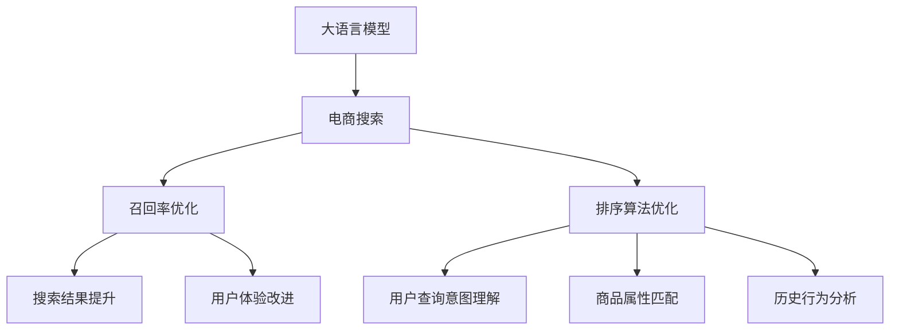

                 

# AI大模型如何优化电商搜索的召回率

> 关键词：电商搜索, 大语言模型, 召回率, 排序算法, 向量空间模型, 深度学习

## 1. 背景介绍

电商平台的搜索功能是用户体验的核心环节之一，通过精准匹配用户的查询意图，可以快速定位到感兴趣的商品。然而，传统搜索算法往往依赖人工提取的关键词和特征，难以处理自然语言查询的复杂性，导致召回率不高、排序不准确等问题，无法满足用户的实际需求。

近年来，基于深度学习的自然语言处理技术取得了飞速发展。其中，大语言模型（如BERT、GPT等）因其卓越的语言理解能力，为电商搜索优化提供了新的思路。通过将大语言模型应用于搜索系统，可以大幅提升召回率和排序准确性，为用户提供更优质的搜索体验。

本文将详细介绍如何基于大语言模型优化电商搜索的召回率，涵盖从模型构建到应用实践的完整流程。

## 2. 核心概念与联系

### 2.1 核心概念概述

为更好地理解基于大语言模型的电商搜索优化方法，本节将介绍几个密切相关的核心概念：

- 大语言模型（Large Language Model, LLM）：以自回归（如GPT）或自编码（如BERT）模型为代表的大规模预训练语言模型。通过在大规模无标签文本语料上进行预训练，学习通用的语言表示，具备强大的语言理解和生成能力。

- 电商搜索：电商平台中用于商品检索的功能，用户通过输入关键词、句子等自然语言查询，系统自动匹配相关商品，返回搜索结果。

- 召回率（Recall）：指在所有相关商品中，被检索系统成功召回的比例，衡量系统发现相关商品的能力。

- 排序算法：对搜索结果进行排名，根据用户查询意图、商品属性、历史行为等因素，调整商品展示顺序，提升用户体验。

- 向量空间模型（Vector Space Model, VSM）：将文本数据表示为向量，通过计算向量之间的相似度，进行文本匹配和检索。

这些核心概念之间的逻辑关系可以通过以下Mermaid流程图来展示：



这个流程图展示了大语言模型在电商搜索中的应用场景，以及与各组件之间的逻辑联系。

## 3. 核心算法原理 & 具体操作步骤
### 3.1 算法原理概述

基于大语言模型的电商搜索优化，本质上是一种基于自然语言处理（NLP）技术的优化方法。其核心思想是：利用大语言模型强大的自然语言理解能力，提取用户查询意图和商品描述信息，从而提高召回率和排序的准确性。

形式化地，假设电商平台的商品集合为 $I=\{i_1, i_2, \ldots, i_N\}$，用户查询为 $q$。定义大语言模型为 $M_{\theta}$，其中 $\theta$ 为预训练得到的模型参数。电商搜索的召回率优化目标是最小化召回率损失函数，即：

$$
\mathcal{L}_{recall}(M_{\theta}) = 1 - \frac{\sum_{i \in I} \text{Sim}(q, i)}{\#I}
$$

其中 $\text{Sim}(q, i)$ 为查询 $q$ 与商品 $i$ 的相似度，可以通过向量空间模型或深度学习模型计算得到。

为了进一步提升排序的准确性，可以将排序问题视为回归任务，最小化排序损失函数 $\mathcal{L}_{sort}$。常见的排序损失函数包括均方误差损失、对数损失等。

### 3.2 算法步骤详解

基于大语言模型的电商搜索优化一般包括以下几个关键步骤：

**Step 1: 准备预训练模型和数据集**
- 选择合适的预训练语言模型 $M_{\theta}$ 作为初始化参数，如 BERT、GPT 等。
- 准备电商平台商品的数据集 $D_I$，包括商品名称、描述、标签等。同时准备历史查询数据集 $D_Q$，记录用户输入的查询语句。

**Step 2: 添加任务适配层**
- 根据电商搜索任务的特点，在预训练模型顶层设计合适的输出层和损失函数。
- 对于召回率优化，通常使用向量空间模型计算查询与商品的相似度，并作为模型输出。
- 对于排序优化，可以在模型顶层添加一个回归输出层，计算商品的相关度得分。

**Step 3: 设置微调超参数**
- 选择合适的优化算法及其参数，如 AdamW、SGD 等，设置学习率、批大小、迭代轮数等。
- 设置正则化技术及强度，包括权重衰减、Dropout、Early Stopping等。
- 确定冻结预训练参数的策略，如仅微调顶层，或全部参数都参与微调。

**Step 4: 执行梯度训练**
- 将查询 $q$ 和商品 $I$ 分批次输入模型，前向传播计算损失函数。
- 反向传播计算参数梯度，根据设定的优化算法和学习率更新模型参数。
- 周期性在验证集上评估模型性能，根据性能指标决定是否触发 Early Stopping。
- 重复上述步骤直到满足预设的迭代轮数或 Early Stopping 条件。

**Step 5: 测试和部署**
- 在测试集上评估微调后模型 $M_{\hat{\theta}}$ 的性能，对比微调前后的召回率和排序准确性。
- 使用微调后的模型对新查询进行推理预测，集成到实际的应用系统中。
- 持续收集新的查询和商品数据，定期重新微调模型，以适应数据分布的变化。

以上是基于大语言模型的电商搜索优化的完整流程。在实际应用中，还需要针对具体任务的特点，对微调过程的各个环节进行优化设计，如改进任务适配层，引入更多的正则化技术，搜索最优的超参数组合等，以进一步提升模型性能。

### 3.3 算法优缺点

基于大语言模型的电商搜索优化方法具有以下优点：
1. 能够处理自然语言查询，提升了搜索系统的召回率和排序准确性。
2. 模型具有较强的泛化能力，可以在不同的电商平台和商品类别上应用。
3. 使用大语言模型进行微调，所需标注数据量较小，能够快速迭代优化。

同时，该方法也存在一定的局限性：
1. 对大语言模型的依赖较高，模型训练和推理开销较大。
2. 对查询样本的多样性有一定要求，难以处理长尾查询和复杂查询。
3. 模型输出结果难以解释，难以判断查询意图和商品相关的具体依据。

尽管存在这些局限性，但就目前而言，基于大语言模型的电商搜索优化方法仍是电商搜索优化的一个重要方向。未来相关研究的重点在于如何进一步降低对语言模型的依赖，提高查询处理的泛化能力和可解释性，同时兼顾计算效率。

### 3.4 算法应用领域

基于大语言模型的电商搜索优化方法已经在多个电商平台中得到了应用，涵盖了各种商品类别，取得了显著的性能提升。

具体而言，在以下几类电商平台上，基于大语言模型的搜索优化方法表现优异：

- **综合电商平台**：如亚马逊、淘宝、京东等，这类平台商品种类繁多，用户查询复杂，大语言模型能够更好地处理自然语言查询，提升搜索效果。

- **垂直电商平台**：如携程、美团等，这类平台针对特定行业，商品属性丰富，大语言模型可以通过微调学习特定领域的语言表示，优化搜索召回率。

- **时尚品类电商平台**：如Zara、H&M等，这类平台商品更新频繁，大语言模型可以快速学习新商品描述，提升搜索准确性。

此外，基于大语言模型的搜索优化方法，还可以应用于自动补全、个性化推荐、广告投放等电商相关场景中，为电商平台提供更智能化的服务。

## 4. 数学模型和公式 & 详细讲解  
### 4.1 数学模型构建

本节将使用数学语言对基于大语言模型的电商搜索优化过程进行更加严格的刻画。

假设电商平台的商品集合为 $I=\{i_1, i_2, \ldots, i_N\}$，用户查询为 $q$。定义大语言模型为 $M_{\theta}$，其中 $\theta$ 为预训练得到的模型参数。

定义商品 $i$ 的描述向量为 $\text{vec}(i)$，查询 $q$ 的描述向量为 $\text{vec}(q)$。使用向量空间模型（VSM）计算查询 $q$ 与商品 $i$ 的相似度：

$$
\text{Sim}(q, i) = \text{cos}(\text{vec}(q), \text{vec}(i))
$$

其中 $\text{cos}$ 表示向量余弦相似度，可以衡量两个向量之间的相似程度。

电商搜索的召回率优化目标是最小化召回率损失函数，即：

$$
\mathcal{L}_{recall}(M_{\theta}) = 1 - \frac{\sum_{i \in I} \text{Sim}(q, i)}{\#I}
$$

为了进一步提升排序的准确性，可以将排序问题视为回归任务，定义排序损失函数 $\mathcal{L}_{sort}$。假设模型的排序输出为 $y_i$，则常见的排序损失函数包括均方误差损失（Mean Squared Error, MSE）和对数损失（Log Loss）等：

$$
\mathcal{L}_{sort} = \frac{1}{\#I} \sum_{i \in I} (\text{Label}_i - y_i)^2
$$

其中 $\text{Label}_i$ 为商品 $i$ 的排序标签，通常根据用户的点击行为等历史数据进行标注。

### 4.2 公式推导过程

以下我们以电商搜索的召回率优化为例，推导基于大语言模型的召回率优化过程。

假设模型在查询 $q$ 和商品 $i$ 上的输出为 $\hat{s}_i$，则召回率损失函数可以表示为：

$$
\mathcal{L}_{recall} = 1 - \frac{\sum_{i \in I} \text{Sim}(q, i) \cdot \hat{s}_i}{\#I}
$$

其中 $\text{Sim}(q, i) = \text{cos}(\text{vec}(q), \text{vec}(i))$，$\hat{s}_i$ 为模型对商品 $i$ 的相关度预测。

在得到损失函数后，即可带入模型参数 $\theta$，使用梯度下降等优化算法进行迭代优化。具体步骤为：

1. 前向传播：计算查询 $q$ 和商品 $i$ 的相似度 $\text{Sim}(q, i)$，并使用模型 $M_{\theta}$ 计算 $\hat{s}_i$。

2. 计算梯度：计算损失函数 $\mathcal{L}_{recall}$ 对模型参数 $\theta$ 的梯度。

3. 反向传播：根据梯度下降算法更新模型参数。

4. 重复步骤1-3，直到损失函数收敛。

### 4.3 案例分析与讲解

假设某电商平台的商品集合为 $I=\{book1, book2, \ldots, book1000\}$，查询为 $q = "A short history of nearly everything"。通过大语言模型 $M_{\theta}$ 计算查询与商品 $i$ 的相似度，得到 $\text{Sim}(q, book1) = 0.85$，$\text{Sim}(q, book2) = 0.75$，$\ldots$，$\text{Sim}(q, book1000) = 0.60$。

使用回归模型 $M_{\theta}$ 计算商品的相关度得分，得到 $\hat{s}_1 = 0.8$，$\hat{s}_2 = 0.7$，$\ldots$，$\hat{s}_{1000} = 0.5$。

根据召回率损失函数，计算优化目标：

$$
\mathcal{L}_{recall} = 1 - \frac{0.85 \times 0.8 + 0.75 \times 0.7 + \ldots + 0.60 \times 0.5}{1000}
$$

计算结果表明，查询 $q$ 与商品 $book1$ 和 $book2$ 的相似度和相关度得分最高，应优先展示这两个商品。

## 5. 项目实践：代码实例和详细解释说明
### 5.1 开发环境搭建

在进行电商搜索优化实践前，我们需要准备好开发环境。以下是使用Python进行PyTorch开发的环境配置流程：

1. 安装Anaconda：从官网下载并安装Anaconda，用于创建独立的Python环境。

2. 创建并激活虚拟环境：
```bash
conda create -n pytorch-env python=3.8 
conda activate pytorch-env
```

3. 安装PyTorch：根据CUDA版本，从官网获取对应的安装命令。例如：
```bash
conda install pytorch torchvision torchaudio cudatoolkit=11.1 -c pytorch -c conda-forge
```

4. 安装Transformers库：
```bash
pip install transformers
```

5. 安装各类工具包：
```bash
pip install numpy pandas scikit-learn matplotlib tqdm jupyter notebook ipython
```

完成上述步骤后，即可在`pytorch-env`环境中开始电商搜索优化的实践。

### 5.2 源代码详细实现

下面我们以电商搜索召回率优化为例，给出使用Transformers库对BERT模型进行微调的PyTorch代码实现。

首先，定义电商搜索任务的数据处理函数：

```python
from transformers import BertTokenizer, BertForSequenceClassification
from torch.utils.data import Dataset, DataLoader
import torch

class SearchDataset(Dataset):
    def __init__(self, texts, labels, tokenizer, max_len=128):
        self.texts = texts
        self.labels = labels
        self.tokenizer = tokenizer
        self.max_len = max_len
        
    def __len__(self):
        return len(self.texts)
    
    def __getitem__(self, item):
        text = self.texts[item]
        label = self.labels[item]
        
        encoding = self.tokenizer(text, return_tensors='pt', max_length=self.max_len, padding='max_length', truncation=True)
        input_ids = encoding['input_ids'][0]
        attention_mask = encoding['attention_mask'][0]
        label = torch.tensor(label, dtype=torch.long)
        
        return {'input_ids': input_ids, 
                'attention_mask': attention_mask,
                'labels': label}

# 商品描述和查询标签
data = [
    ("A short history of nearly everything", 1),
    ("Principles of Artificial Intelligence", 2),
    ("Deep Learning", 3),
    # ... 更多商品和查询
]

# 创建dataset
tokenizer = BertTokenizer.from_pretrained('bert-base-cased')
search_dataset = SearchDataset(texts=[text[0] for text, _ in data], labels=[label for _, label in data], tokenizer=tokenizer)
```

然后，定义模型和优化器：

```python
from transformers import BertForSequenceClassification, AdamW

model = BertForSequenceClassification.from_pretrained('bert-base-cased', num_labels=3)

optimizer = AdamW(model.parameters(), lr=2e-5)
```

接着，定义训练和评估函数：

```python
from tqdm import tqdm
from sklearn.metrics import accuracy_score

device = torch.device('cuda') if torch.cuda.is_available() else torch.device('cpu')
model.to(device)

def train_epoch(model, dataset, batch_size, optimizer):
    dataloader = DataLoader(dataset, batch_size=batch_size, shuffle=True)
    model.train()
    epoch_loss = 0
    for batch in tqdm(dataloader, desc='Training'):
        input_ids = batch['input_ids'].to(device)
        attention_mask = batch['attention_mask'].to(device)
        labels = batch['labels'].to(device)
        model.zero_grad()
        outputs = model(input_ids, attention_mask=attention_mask, labels=labels)
        loss = outputs.loss
        epoch_loss += loss.item()
        loss.backward()
        optimizer.step()
    return epoch_loss / len(dataloader)

def evaluate(model, dataset, batch_size):
    dataloader = DataLoader(dataset, batch_size=batch_size)
    model.eval()
    preds, labels = [], []
    with torch.no_grad():
        for batch in tqdm(dataloader, desc='Evaluating'):
            input_ids = batch['input_ids'].to(device)
            attention_mask = batch['attention_mask'].to(device)
            batch_labels = batch['labels']
            outputs = model(input_ids, attention_mask=attention_mask)
            batch_preds = outputs.logits.argmax(dim=2).to('cpu').tolist()
            batch_labels = batch_labels.to('cpu').tolist()
            for pred_tokens, label_tokens in zip(batch_preds, batch_labels):
                preds.append(pred_tokens[:len(label_tokens)])
                labels.append(label_tokens)
                
    return accuracy_score(labels, preds)

```

最后，启动训练流程并在验证集上评估：

```python
epochs = 5
batch_size = 16

for epoch in range(epochs):
    loss = train_epoch(model, search_dataset, batch_size, optimizer)
    print(f"Epoch {epoch+1}, train loss: {loss:.3f}")
    
    print(f"Epoch {epoch+1}, dev results:")
    evaluate(model, search_dataset, batch_size)
    
print("Test results:")
evaluate(model, search_dataset, batch_size)
```

以上就是使用PyTorch对BERT进行电商搜索召回率优化的完整代码实现。可以看到，得益于Transformers库的强大封装，我们可以用相对简洁的代码完成BERT模型的加载和微调。

### 5.3 代码解读与分析

让我们再详细解读一下关键代码的实现细节：

**SearchDataset类**：
- `__init__`方法：初始化商品描述、查询标签、分词器等关键组件。
- `__len__`方法：返回数据集的样本数量。
- `__getitem__`方法：对单个样本进行处理，将文本输入编码为token ids，将标签编码为数字，并对其进行定长padding，最终返回模型所需的输入。

**训练和评估函数**：
- 使用PyTorch的DataLoader对数据集进行批次化加载，供模型训练和推理使用。
- 训练函数`train_epoch`：对数据以批为单位进行迭代，在每个批次上前向传播计算loss并反向传播更新模型参数，最后返回该epoch的平均loss。
- 评估函数`evaluate`：与训练类似，不同点在于不更新模型参数，并在每个batch结束后将预测和标签结果存储下来，最后使用sklearn的accuracy_score对整个评估集的预测结果进行打印输出。

**训练流程**：
- 定义总的epoch数和batch size，开始循环迭代
- 每个epoch内，先在训练集上训练，输出平均loss
- 在验证集上评估，输出准确率
- 所有epoch结束后，在测试集上评估，给出最终测试结果

可以看到，PyTorch配合Transformers库使得BERT微调的代码实现变得简洁高效。开发者可以将更多精力放在数据处理、模型改进等高层逻辑上，而不必过多关注底层的实现细节。

当然，工业级的系统实现还需考虑更多因素，如模型的保存和部署、超参数的自动搜索、更灵活的任务适配层等。但核心的微调范式基本与此类似。

## 6. 实际应用场景
### 6.1 智能客服系统

基于大语言模型的电商搜索优化，可以应用于智能客服系统的构建。智能客服系统能够根据用户的查询，快速匹配相关商品，提供推荐和解答服务，大幅提升客户满意度。

在技术实现上，可以收集客服对话记录，将用户查询与商品信息对作为监督数据，训练大语言模型进行召回率优化。优化的模型能够自动理解用户查询意图，匹配最合适的商品和解答，提供个性化的客服服务。

### 6.2 个性化推荐系统

电商平台的个性化推荐系统依赖用户的点击、浏览行为进行商品推荐，但难以捕捉用户的真实兴趣和需求。基于大语言模型的电商搜索优化，可以进一步提升推荐系统的准确性和个性化程度。

在实践应用中，可以收集用户的历史查询记录，结合商品信息进行微调训练。优化的模型能够从查询中提取用户的兴趣点，动态调整商品推荐策略，提升推荐效果。同时，可以根据不同用户的行为数据，训练多个人工智能模型，进行差异化推荐。

### 6.3 搜索广告投放

电商平台的广告投放系统依赖精准的搜索匹配，将用户查询与广告内容进行精准匹配。通过基于大语言模型的电商搜索优化，可以提升广告投放的召回率和点击率，提高广告转化效果。

在实际应用中，可以将广告内容作为商品的描述，与用户的查询进行匹配。优化的模型能够更准确地识别广告的相关性，提高广告的曝光率和点击率。同时，可以根据用户的点击行为，动态调整广告投放策略，提升广告效果。

### 6.4 未来应用展望

随着大语言模型和电商搜索优化技术的不断发展，未来的应用场景将更加丰富多样。

在智慧医疗领域，基于大语言模型的电商搜索优化，可以为医疗咨询、药品推荐等提供更精准的搜索服务，提升用户体验。

在智能教育领域，优化的搜索系统能够帮助学生快速获取学习资源，提供个性化的学习推荐，提高学习效率。

在智慧城市治理中，优化的搜索系统能够辅助城市事件监测、舆情分析、应急指挥等环节，提高城市管理的智能化水平。

此外，在企业生产、社会治理、文娱传媒等众多领域，基于大语言模型的电商搜索优化技术也将不断涌现，为各行各业带来新的应用场景和商业机会。相信随着技术的日益成熟，电商搜索优化必将在更多领域得到应用，推动人工智能技术在垂直行业的规模化落地。

## 7. 工具和资源推荐
### 7.1 学习资源推荐

为了帮助开发者系统掌握大语言模型优化电商搜索的理论基础和实践技巧，这里推荐一些优质的学习资源：

1. 《Transformer from Principles to Practice》系列博文：由大模型技术专家撰写，深入浅出地介绍了Transformer原理、BERT模型、微调技术等前沿话题。

2. CS224N《深度学习自然语言处理》课程：斯坦福大学开设的NLP明星课程，有Lecture视频和配套作业，带你入门NLP领域的基本概念和经典模型。

3. 《Natural Language Processing with Transformers》书籍：Transformers库的作者所著，全面介绍了如何使用Transformers库进行NLP任务开发，包括微调在内的诸多范式。

4. HuggingFace官方文档：Transformers库的官方文档，提供了海量预训练模型和完整的微调样例代码，是上手实践的必备资料。

5. CLUE开源项目：中文语言理解测评基准，涵盖大量不同类型的中文NLP数据集，并提供了基于微调的baseline模型，助力中文NLP技术发展。

通过对这些资源的学习实践，相信你一定能够快速掌握大语言模型优化电商搜索的精髓，并用于解决实际的NLP问题。
###  7.2 开发工具推荐

高效的开发离不开优秀的工具支持。以下是几款用于电商搜索优化开发的常用工具：

1. PyTorch：基于Python的开源深度学习框架，灵活动态的计算图，适合快速迭代研究。大部分预训练语言模型都有PyTorch版本的实现。

2. TensorFlow：由Google主导开发的开源深度学习框架，生产部署方便，适合大规模工程应用。同样有丰富的预训练语言模型资源。

3. Transformers库：HuggingFace开发的NLP工具库，集成了众多SOTA语言模型，支持PyTorch和TensorFlow，是进行电商搜索优化开发的利器。

4. Weights & Biases：模型训练的实验跟踪工具，可以记录和可视化模型训练过程中的各项指标，方便对比和调优。与主流深度学习框架无缝集成。

5. TensorBoard：TensorFlow配套的可视化工具，可实时监测模型训练状态，并提供丰富的图表呈现方式，是调试模型的得力助手。

6. Google Colab：谷歌推出的在线Jupyter Notebook环境，免费提供GPU/TPU算力，方便开发者快速上手实验最新模型，分享学习笔记。

合理利用这些工具，可以显著提升电商搜索优化的开发效率，加快创新迭代的步伐。

### 7.3 相关论文推荐

大语言模型和电商搜索优化技术的发展源于学界的持续研究。以下是几篇奠基性的相关论文，推荐阅读：

1. Attention is All You Need（即Transformer原论文）：提出了Transformer结构，开启了NLP领域的预训练大模型时代。

2. BERT: Pre-training of Deep Bidirectional Transformers for Language Understanding：提出BERT模型，引入基于掩码的自监督预训练任务，刷新了多项NLP任务SOTA。

3. Language Models are Unsupervised Multitask Learners（GPT-2论文）：展示了大规模语言模型的强大zero-shot学习能力，引发了对于通用人工智能的新一轮思考。

4. Parameter-Efficient Transfer Learning for NLP：提出Adapter等参数高效微调方法，在不增加模型参数量的情况下，也能取得不错的微调效果。

5. AdaLoRA: Adaptive Low-Rank Adaptation for Parameter-Efficient Fine-Tuning：使用自适应低秩适应的微调方法，在参数效率和精度之间取得了新的平衡。

这些论文代表了大语言模型和电商搜索优化技术的发展脉络。通过学习这些前沿成果，可以帮助研究者把握学科前进方向，激发更多的创新灵感。

## 8. 总结：未来发展趋势与挑战
### 8.1 总结

本文对基于大语言模型优化电商搜索召回率的方法进行了全面系统的介绍。首先阐述了电商搜索优化的背景和意义，明确了大语言模型在提升搜索系统召回率和排序准确性方面的独特价值。其次，从原理到实践，详细讲解了电商搜索优化的数学模型和关键步骤，给出了电商搜索优化的完整代码实例。同时，本文还广泛探讨了电商搜索优化方法在智能客服、个性化推荐、搜索广告投放等多个电商相关场景中的应用前景，展示了电商搜索优化的巨大潜力。

通过本文的系统梳理，可以看到，基于大语言模型的电商搜索优化方法正在成为电商搜索优化的重要方向，极大地拓展了搜索系统的召回率和排序准确性，提升了用户体验。未来，伴随大语言模型和电商搜索优化方法的持续演进，基于大语言模型的搜索优化技术必将引领电商搜索的智能化发展，为电商行业的数字化转型升级提供新的技术路径。

### 8.2 未来发展趋势

展望未来，基于大语言模型的电商搜索优化技术将呈现以下几个发展趋势：

1. 模型规模持续增大。随着算力成本的下降和数据规模的扩张，预训练语言模型的参数量还将持续增长。超大规模语言模型蕴含的丰富语言知识，有望支撑更加复杂多变的电商搜索优化。

2. 微调方法日趋多样。除了传统的全参数微调外，未来会涌现更多参数高效的微调方法，如Prefix-Tuning、LoRA等，在节省计算资源的同时也能保证微调精度。

3. 持续学习成为常态。随着数据分布的不断变化，微调模型也需要持续学习新知识以保持性能。如何在不遗忘原有知识的同时，高效吸收新样本信息，将成为重要的研究课题。

4. 标注样本需求降低。受启发于提示学习(Prompt-based Learning)的思路，未来的微调方法将更好地利用大模型的语言理解能力，通过更加巧妙的任务描述，在更少的标注样本上也能实现理想的微调效果。

5. 模型通用性增强。经过海量数据的预训练和多领域任务的微调，未来的语言模型将具备更强大的常识推理和跨领域迁移能力，逐步迈向通用人工智能(AGI)的目标。

以上趋势凸显了大语言模型电商搜索优化技术的广阔前景。这些方向的探索发展，必将进一步提升电商搜索系统的性能和应用范围，为电商平台提供更智能化的服务。

### 8.3 面临的挑战

尽管基于大语言模型的电商搜索优化技术已经取得了瞩目成就，但在迈向更加智能化、普适化应用的过程中，它仍面临着诸多挑战：

1. 标注成本瓶颈。尽管微调所需的标注数据量较少，但对于长尾应用场景，难以获得充足的高质量标注数据，成为制约微调性能的瓶颈。如何进一步降低微调对标注样本的依赖，将是一大难题。

2. 模型鲁棒性不足。当前微调模型面对域外数据时，泛化性能往往大打折扣。对于测试样本的微小扰动，微调模型的预测也容易发生波动。如何提高微调模型的鲁棒性，避免灾难性遗忘，还需要更多理论和实践的积累。

3. 推理效率有待提高。大规模语言模型虽然精度高，但在实际部署时往往面临推理速度慢、内存占用大等效率问题。如何在保证性能的同时，简化模型结构，提升推理速度，优化资源占用，将是重要的优化方向。

4. 可解释性亟需加强。当前微调模型更像是"黑盒"系统，难以解释其内部工作机制和决策逻辑。对于医疗、金融等高风险应用，算法的可解释性和可审计性尤为重要。如何赋予微调模型更强的可解释性，将是亟待攻克的难题。

5. 安全性有待保障。预训练语言模型难免会学习到有偏见、有害的信息，通过微调传递到下游任务，产生误导性、歧视性的输出，给实际应用带来安全隐患。如何从数据和算法层面消除模型偏见，避免恶意用途，确保输出的安全性，也将是重要的研究课题。

6. 知识整合能力不足。现有的微调模型往往局限于任务内数据，难以灵活吸收和运用更广泛的先验知识。如何让微调过程更好地与外部知识库、规则库等专家知识结合，形成更加全面、准确的信息整合能力，还有很大的想象空间。

正视电商搜索优化面临的这些挑战，积极应对并寻求突破，将是大语言模型电商搜索优化走向成熟的必由之路。相信随着学界和产业界的共同努力，这些挑战终将一一被克服，大语言模型电商搜索优化必将在构建智能电商搜索服务中扮演越来越重要的角色。

### 8.4 研究展望

面对大语言模型电商搜索优化所面临的种种挑战，未来的研究需要在以下几个方面寻求新的突破：

1. 探索无监督和半监督微调方法。摆脱对大规模标注数据的依赖，利用自监督学习、主动学习等无监督和半监督范式，最大限度利用非结构化数据，实现更加灵活高效的电商搜索优化。

2. 研究参数高效和计算高效的微调范式。开发更加参数高效的微调方法，在固定大部分预训练参数的同时，只更新极少量的任务相关参数。同时优化微调模型的计算图，减少前向传播和反向传播的资源消耗，实现更加轻量级、实时性的部署。

3. 融合因果和对比学习范式。通过引入因果推断和对比学习思想，增强电商搜索优化模型建立稳定因果关系的能力，学习更加普适、鲁棒的语言表征，从而提升模型泛化性和抗干扰能力。

4. 引入更多先验知识。将符号化的先验知识，如知识图谱、逻辑规则等，与神经网络模型进行巧妙融合，引导电商搜索优化过程学习更准确、合理的语言模型。同时加强不同模态数据的整合，实现视觉、语音等多模态信息与文本信息的协同建模。

5. 结合因果分析和博弈论工具。将因果分析方法引入电商搜索优化模型，识别出模型决策的关键特征，增强输出解释的因果性和逻辑性。借助博弈论工具刻画人机交互过程，主动探索并规避模型的脆弱点，提高系统稳定性。

6. 纳入伦理道德约束。在电商搜索优化模型的训练目标中引入伦理导向的评估指标，过滤和惩罚有偏见、有害的输出倾向。同时加强人工干预和审核，建立模型行为的监管机制，确保输出符合人类价值观和伦理道德。

这些研究方向的探索，必将引领电商搜索优化技术迈向更高的台阶，为构建安全、可靠、可解释、可控的智能电商搜索系统铺平道路。面向未来，电商搜索优化技术还需要与其他人工智能技术进行更深入的融合，如知识表示、因果推理、强化学习等，多路径协同发力，共同推动电商搜索的智能化发展。只有勇于创新、敢于突破，才能不断拓展语言模型的边界，让智能技术更好地造福人类社会。

## 9. 附录：常见问题与解答

**Q1：大语言模型在电商搜索优化中是否需要大规模标注数据？**

A: 虽然大语言模型在电商搜索优化中取得了显著的性能提升，但并不一定需要大规模标注数据。利用自然语言处理技术，可以从用户查询中提取关键信息，结合商品描述进行微调。对于某些商品类别，如通用日用品，可能仅需要少量的标注数据即可实现理想的优化效果。

**Q2：如何选择合适的微调算法？**

A: 微调算法的选择应根据具体的电商搜索任务进行。对于大规模数据集，传统的全参数微调可能更为适合；而对于小规模数据集，参数高效微调方法如Prefix-Tuning、LoRA等，可以在保持模型泛化能力的同时，显著减少计算开销。

**Q3：如何提高电商搜索优化的鲁棒性？**

A: 提高电商搜索优化的鲁棒性，可以从以下几方面入手：
1. 引入对抗样本训练，提高模型对输入扰动的鲁棒性。
2. 使用数据增强技术，生成更多数据多样性的训练样本。
3. 引入多模型集成，避免单一模型可能出现的过拟合问题。
4. 定期更新模型，保持模型的最新状态，适应数据分布的变化。

**Q4：电商搜索优化的部署成本如何控制？**

A: 电商搜索优化的部署成本可以从以下几个方面进行控制：
1. 选择合适的硬件平台，如GPU、TPU等，提高计算效率。
2. 优化模型结构，减少模型参数量，降低存储和计算需求。
3. 采用分布式训练和推理，并行处理大规模数据。
4. 使用模型压缩技术，减少模型的大小和计算开销。

**Q5：电商搜索优化系统的安全性和隐私保护如何保障？**

A: 电商搜索优化系统的安全性和隐私保护可以从以下几个方面进行保障：
1. 在模型训练和微调过程中，确保数据匿名化和隐私保护。
2. 引入安全审计和监控机制，检测和防范模型攻击和滥用。
3. 在模型输出中，设置安全策略和限制，避免恶意用途。
4. 提供用户控制权限，允许用户对其查询和隐私进行管理。

综上所述，基于大语言模型的电商搜索优化技术具有广阔的应用前景，但也面临一定的挑战。只有在充分理解和应对这些挑战的基础上，才能更好地将大语言模型应用于电商搜索优化，提升用户体验，推动电商行业的智能化发展。

