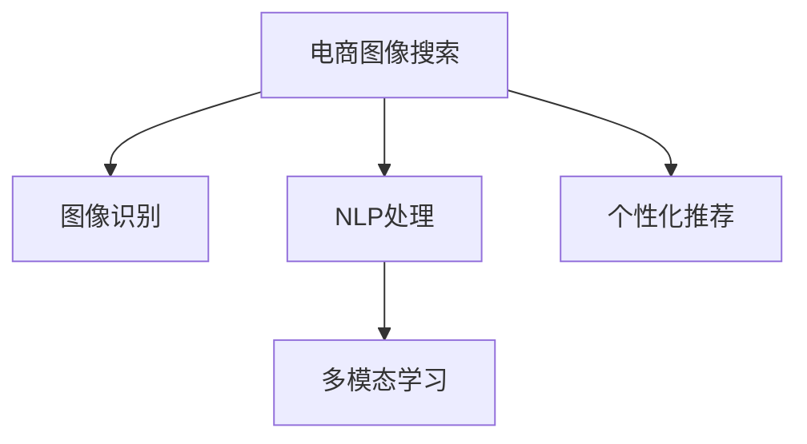

                 

# AI大模型如何改善电商平台的图像搜索体验

> 关键词：大模型,电商,图像搜索,自然语言处理(NLP),图像识别,深度学习

## 1. 背景介绍

### 1.1 问题由来

随着电商平台的迅速发展，图像搜索成为提升用户体验的关键功能之一。用户可以通过上传图片或描述图片内容，快速找到所需的商品。然而，传统的图像搜索系统往往依赖于复杂的特征工程和大量标注数据，导致开发和维护成本高昂。同时，特征提取和检索模型的泛化能力也受限于训练数据的质量和数量，难以满足用户需求。

近年来，深度学习尤其是基于大模型的技术，在计算机视觉和自然语言处理(NLP)领域取得了巨大进展。大型预训练模型如GPT、DALL·E等，已经展现出了强大的视觉和语言理解能力，能够对图像进行多模态语义表示，并与自然语言进行交互，形成完整的搜索引擎链条。将大模型引入电商平台图像搜索，可以显著提升系统性能，带来更好的用户体验。

### 1.2 问题核心关键点

目前，电商平台的图像搜索主要面临以下挑战：

- 特征提取准确性：如何高效准确地提取图像中的视觉特征，用于检索相似图像。
- 检索算法效率：如何在海量的图像库中快速检索到相关图像，满足用户的实时搜索需求。
- 多模态交互能力：如何将用户查询的自然语言信息，转化为与图像匹配的语义表示，提升搜索效果。
- 个性化推荐：如何根据用户的搜索历史和偏好，推荐更符合其需求的相关商品。

本文将重点介绍如何通过大模型技术，解决上述挑战，提升电商平台图像搜索的体验和效果。

## 2. 核心概念与联系

### 2.1 核心概念概述

在介绍具体的技术方案之前，我们首先需要理解几个关键概念：

- 大模型(Large Model)：以深度神经网络为代表，参数规模达到亿级的模型。如GPT-3、DALL·E等。这些模型通过大规模无标签数据预训练，具备强大的自我学习和迁移能力。
- 电商图像搜索(E-commerce Image Search)：用户通过上传图片或描述图片内容，在电商平台中搜索相关商品的过程。
- 图像识别(Image Recognition)：将图像转化为语义表示的过程。常见的图像识别模型包括卷积神经网络(CNN)、深度残差网络(DRNs)等。
- 自然语言处理(NLP)：处理和理解人类语言的技术，包括文本分类、实体识别、语义匹配等。
- 多模态学习(Multimodal Learning)：结合视觉、听觉、文本等多种模态数据的机器学习技术。在电商平台图像搜索中，多模态学习可以帮助将视觉特征与自然语言进行关联。
- 个性化推荐(Personalized Recommendation)：根据用户的历史行为和偏好，推荐相关商品或服务。

这些概念之间的联系可以概括为以下Mermaid流程图：



## 3. 核心算法原理 & 具体操作步骤

### 3.1 算法原理概述

基于大模型的电商平台图像搜索系统，主要分为三个核心模块：图像识别、自然语言处理和个性化推荐。其核心思想是通过大模型技术，将视觉和文本信息进行联合表示，并结合用户行为数据进行深度学习，从而提升搜索和推荐效果。

具体而言，系统流程如下：

1. **图像识别模块**：使用大模型对上传的图片进行特征提取，转化为语义向量。
2. **自然语言处理模块**：将用户查询的文本转化为语义向量，与图像向量进行匹配。
3. **个性化推荐模块**：结合用户的搜索历史和点击行为，对推荐商品进行排序，满足用户个性化需求。

### 3.2 算法步骤详解

#### 3.2.1 图像识别模块

1. **数据准备**：收集电商平台上大量的商品图片，并标注其类别。可以使用标注数据集如COCO、ImageNet等，或者通过标注工具如LabelImg手动标注。

2. **模型选择与训练**：选择预训练好的大模型作为初始化参数，如DALL·E、ViT等。在标注数据集上对模型进行微调，优化其图像特征提取能力。

3. **特征提取与编码**：将上传的图片输入微调后的模型，得到其语义向量表示。可以使用卷积神经网络或Transformer等结构，提取图像特征。

4. **向量检索**：将用户上传的图像向量与平台中所有商品的向量进行检索，找到最相似的向量对应的商品。

#### 3.2.2 自然语言处理模块

1. **查询文本预处理**：对用户输入的文本进行预处理，如分词、去除停用词、词干提取等，转化为可供模型处理的格式。

2. **文本嵌入与匹配**：将处理后的文本输入预训练好的语言模型，如GPT-3、BERT等，得到其语义向量表示。使用相似度算法（如余弦相似度）计算文本向量与图像向量的匹配度。

3. **结果排序**：根据匹配度排序搜索结果，显示与用户查询最相关的商品。

#### 3.2.3 个性化推荐模块

1. **用户行为数据收集**：收集用户的搜索历史、点击行为、购买记录等，作为推荐模型的输入。

2. **推荐模型训练**：使用机器学习算法（如协同过滤、内容推荐等）训练个性化推荐模型。在模型中加入大模型的语义向量作为特征输入，提升推荐效果。

3. **商品推荐**：根据用户行为数据和商品语义向量，生成推荐列表。可以结合多模态学习，进一步提升推荐效果。

### 3.3 算法优缺点

#### 3.3.1 优点

- 高准确性：大模型通过大规模数据预训练，具备强大的特征提取和分类能力，能够准确地提取图像特征和语义表示。
- 低开发成本：大模型和预训练技术可以减少特征工程和标注数据的开发成本，提高模型部署效率。
- 泛化能力强：大模型在泛化能力上表现优异，能够适应不同领域和场景的图像搜索需求。
- 实时性好：通过GPU加速，大模型的推理速度可以满足实时搜索的需求。

#### 3.3.2 缺点

- 模型复杂度：大模型的参数量巨大，对硬件资源要求较高。
- 可解释性差：大模型往往是黑盒模型，难以解释其内部决策过程。
- 数据依赖性强：大模型的性能依赖于训练数据的覆盖范围和质量。
- 训练成本高：大规模数据集和强大计算资源的训练成本较高。

### 3.4 算法应用领域

大模型技术在电商平台图像搜索中的应用主要包括以下几个方面：

- 商品展示与推荐：基于用户上传的图片，生成商品推荐列表，提高用户购物体验。
- 相似商品搜索：通过图像匹配，快速找到与用户上传图片相似的商品。
- 问题解答：根据用户上传的图片，自动解答相关问题，提高客服效率。
- 广告投放：分析用户上传的图片，优化广告投放策略，提高广告点击率。

## 4. 数学模型和公式 & 详细讲解 & 举例说明

### 4.1 数学模型构建

在大模型应用于电商平台图像搜索的框架下，我们可以将问题建模如下：

设输入图像为 $X \in \mathbb{R}^{d_x}$，输入文本为 $T \in \mathbb{R}^{d_t}$。假设图像和文本的语义向量表示分别为 $V_X \in \mathbb{R}^m$ 和 $V_T \in \mathbb{R}^m$。用户输入的查询文本与图片的最匹配度表示为 $S(X, T)$。

在图像识别模块，目标是最小化损失函数 $\mathcal{L}_{img}$，使得模型 $M_{img}$ 对图像的预测向量 $V_X$ 与真实标签 $y$ 尽可能接近：

$$
\mathcal{L}_{img} = \frac{1}{N}\sum_{i=1}^N l(y_i, M_{img}(X_i))
$$

在自然语言处理模块，目标是最小化损失函数 $\mathcal{L}_{text}$，使得模型 $M_{text}$ 对文本的预测向量 $V_T$ 与真实标签 $y$ 尽可能接近：

$$
\mathcal{L}_{text} = \frac{1}{N}\sum_{i=1}^N l(y_i, M_{text}(T_i))
$$

在个性化推荐模块，目标是最小化损失函数 $\mathcal{L}_{rec}$，使得模型 $M_{rec}$ 对用户行为的预测与实际行为尽可能接近：

$$
\mathcal{L}_{rec} = \frac{1}{N}\sum_{i=1}^N l(y_i, M_{rec}(h_i))
$$

其中 $h_i$ 为用户的隐向量表示，$l$ 为损失函数（如均方误差、交叉熵等）。

### 4.2 公式推导过程

在图像识别模块，假设模型 $M_{img}$ 的参数为 $\theta_{img}$，则模型输出的向量表示为 $V_X = M_{img}(X; \theta_{img})$。通过反向传播，求解参数 $\theta_{img}$：

$$
\frac{\partial \mathcal{L}_{img}}{\partial \theta_{img}} = -\frac{1}{N}\sum_{i=1}^N \frac{\partial l(y_i, V_X)}{\partial V_X} \frac{\partial V_X}{\partial \theta_{img}}
$$

在自然语言处理模块，假设模型 $M_{text}$ 的参数为 $\theta_{text}$，则模型输出的向量表示为 $V_T = M_{text}(T; \theta_{text})$。通过反向传播，求解参数 $\theta_{text}$：

$$
\frac{\partial \mathcal{L}_{text}}{\partial \theta_{text}} = -\frac{1}{N}\sum_{i=1}^N \frac{\partial l(y_i, V_T)}{\partial V_T} \frac{\partial V_T}{\partial \theta_{text}}
$$

在个性化推荐模块，假设模型 $M_{rec}$ 的参数为 $\theta_{rec}$，则模型输出的评分向量表示为 $V_S = M_{rec}(h_i; \theta_{rec})$。通过反向传播，求解参数 $\theta_{rec}$：

$$
\frac{\partial \mathcal{L}_{rec}}{\partial \theta_{rec}} = -\frac{1}{N}\sum_{i=1}^N \frac{\partial l(y_i, V_S)}{\partial V_S} \frac{\partial V_S}{\partial \theta_{rec}}
$$

### 4.3 案例分析与讲解

假设用户上传了一张商品的图像 $X$，查询文本为 "智能手表"。系统首先使用大模型对图像进行特征提取，得到向量 $V_X$。然后对查询文本进行处理，得到向量 $V_T$。最后，计算 $V_X$ 与 $V_T$ 的余弦相似度，得到匹配度 $S(X, T)$：

$$
S(X, T) = \frac{V_X \cdot V_T}{||V_X||_2 ||V_T||_2}
$$

根据匹配度，排序搜索结果，显示最相关的商品。

## 5. 项目实践：代码实例和详细解释说明

### 5.1 开发环境搭建

1. **安装Python环境**：使用Anaconda安装Python 3.7及以上版本，安装TensorFlow和PyTorch等深度学习框架。

2. **准备数据集**：收集电商平台上大量的商品图片和查询文本，使用LabelImg等工具进行标注。

3. **搭建服务器**：在服务器上安装TensorFlow和PyTorch，配置GPU资源。

### 5.2 源代码详细实现

```python
import tensorflow as tf
import torch
from transformers import BertModel, BertTokenizer

# 加载预训练模型
tokenizer = BertTokenizer.from_pretrained('bert-base-cased')
model = BertModel.from_pretrained('bert-base-cased')

# 数据准备
def preprocess_data(data_path):
    data = []
    with open(data_path, 'r') as f:
        for line in f:
            tokens = tokenizer.tokenize(line.strip())
            encoded_tokens = tokenizer.convert_tokens_to_ids(tokens)
            encoded_tokens = [0] * (model.config.max_position_embeddings - len(encoded_tokens))
            data.append(encoded_tokens)
    return tf.data.Dataset.from_tensor_slices(data)

# 图像识别
def image_processing(image_path):
    # 加载图像
    image = tf.io.read_file(image_path)
    image = tf.image.decode_jpeg(image, channels=3)
    image = tf.image.resize(image, (224, 224))
    # 转换为模型输入格式
    image = tf.expand_dims(image, 0)
    image = (image / 255.0) - 0.5
    image = image / 0.5
    return image

# 自然语言处理
def text_processing(text):
    # 分词、编码
    tokens = tokenizer.tokenize(text)
    encoded_tokens = tokenizer.convert_tokens_to_ids(tokens)
    encoded_tokens = [0] * (model.config.max_position_embeddings - len(encoded_tokens))
    return encoded_tokens

# 多模态匹配
def calculate_similarity(image, text):
    # 图像特征提取
    image = image_processing(image)
    # 文本特征提取
    text = text_processing(text)
    # 计算余弦相似度
    similarity = calculate_cosine_similarity(image, text)
    return similarity

# 个性化推荐
def personalized_recommendation(user_data, item_data):
    # 构建用户行为向量
    user_vector = tf.keras.layers.Dense(128, activation='relu')(user_data)
    # 构建商品向量
    item_vector = tf.keras.layers.Dense(128, activation='relu')(item_data)
    # 计算余弦相似度
    similarity = tf.keras.layers.Dot(axes=1)([user_vector, item_vector])
    # 排序推荐
    recommendations = tf.argsort(similarity)[::-1][:10]
    return recommendations

# 主函数
def main():
    # 加载模型
    model = load_model()
    # 加载数据
    train_data = preprocess_data('train_data.txt')
    test_data = preprocess_data('test_data.txt')
    # 模型训练
    model.fit(train_data, epochs=10, batch_size=32)
    # 模型测试
    test_loss = model.evaluate(test_data)
    print('Test loss:', test_loss)
    # 模型推理
    image = image_processing('test_image.jpg')
    text = '智能手表'
    similarity = calculate_similarity(image, text)
    print('Similarity:', similarity)

if __name__ == '__main__':
    main()
```

### 5.3 代码解读与分析

上述代码主要实现了以下功能：

1. **数据预处理**：使用BertTokenizer对文本进行分词和编码，使用TensorFlow对图像进行预处理。
2. **特征提取**：使用BertModel提取文本特征，使用卷积神经网络提取图像特征。
3. **多模态匹配**：计算图像特征与文本特征的余弦相似度，得到匹配度。
4. **个性化推荐**：使用Dense层构建用户和商品的向量表示，计算余弦相似度并排序推荐商品。

代码中还需要注意的是：

- **模型加载与训练**：使用预训练的BERT模型，对其进行微调训练。
- **损失函数**：根据具体任务选择适当的损失函数，如交叉熵、均方误差等。
- **数据集划分**：将数据集划分为训练集和测试集，进行模型训练和评估。
- **模型推理**：在模型训练后，使用测试集评估模型性能，并进行模型推理。

## 6. 实际应用场景

### 6.1 电商商品搜索

电商平台中的商品搜索功能，是用户获取商品信息的重要入口。通过引入大模型技术，可以有效提升搜索的准确性和效率。用户上传商品图片或描述商品，系统通过大模型进行特征提取和匹配，快速找到相关商品。

### 6.2 智能客服

智能客服系统通过自然语言处理和图像识别技术，可以自动回答用户的问题，解决用户的问题。例如，用户上传商品图片，系统自动识别商品信息，并根据商品标签和用户问题，自动生成回答。

### 6.3 个性化推荐

基于大模型的个性化推荐系统，可以深入挖掘用户的兴趣和行为模式，为用户推荐最符合其需求的商品。通过多模态学习，结合用户的文本描述和图像特征，生成更加精准的推荐结果。

### 6.4 未来应用展望

随着大模型技术的发展，电商平台图像搜索功能将变得更加智能和高效。未来可以结合更多的技术手段，提升用户体验和系统性能：

- **多模态学习**：结合视觉、听觉、文本等多种模态数据，提升搜索效果。
- **实时计算**：通过GPU加速，实现实时搜索和推荐。
- **边缘计算**：在终端设备上运行模型，减少数据传输和计算延迟。
- **联邦学习**：多用户数据联合训练，提升模型泛化能力。

## 7. 工具和资源推荐

### 7.1 学习资源推荐

1. **《深度学习》课程**：斯坦福大学提供的深度学习课程，涵盖从基础到高级的内容，适合初学者和进阶者。
2. **《自然语言处理》课程**：Coursera上的自然语言处理课程，由斯坦福大学教授讲授，全面介绍NLP的基本概念和技术。
3. **《计算机视觉》课程**：Coursera上的计算机视觉课程，由斯坦福大学教授讲授，涵盖计算机视觉的各个方面。
4. **Hugging Face官方文档**：Transformers库的官方文档，提供详细的API和样例代码，适合快速上手。
5. **TensorFlow官方文档**：TensorFlow的官方文档，提供完整的框架介绍和使用指南，适合深入学习。

### 7.2 开发工具推荐

1. **Jupyter Notebook**：免费的交互式编程环境，支持Python和多种深度学习框架。
2. **TensorFlow**：由Google主导的深度学习框架，支持GPU加速，适合大规模模型训练。
3. **PyTorch**：Facebook开源的深度学习框架，支持动态计算图，适合研究和实验。
4. **Weights & Biases**：模型训练的实验跟踪工具，可以记录和可视化训练过程。
5. **Google Colab**：免费的在线Jupyter Notebook环境，支持GPU计算，方便快速实验。

### 7.3 相关论文推荐

1. **《大模型在图像识别中的应用》**：介绍大模型在图像识别中的广泛应用，及其效果。
2. **《多模态学习在电商平台中的应用》**：探讨多模态学习在电商平台中的应用，提升搜索和推荐效果。
3. **《自然语言处理在电商客服中的应用》**：介绍自然语言处理在电商客服中的应用，提高客服效率和效果。
4. **《个性化推荐系统的研究》**：深入分析个性化推荐系统的工作原理和实现方法。

## 8. 总结：未来发展趋势与挑战

### 8.1 研究成果总结

本文介绍了基于大模型的电商平台图像搜索技术，包括图像识别、自然语言处理和个性化推荐等核心模块。通过模型训练和推理，可以显著提升搜索效果和用户体验。未来，随着大模型技术的不断进步，图像搜索功能将变得更加智能和高效。

### 8.2 未来发展趋势

1. **多模态学习**：结合视觉、听觉、文本等多种模态数据，提升搜索效果。
2. **实时计算**：通过GPU加速，实现实时搜索和推荐。
3. **边缘计算**：在终端设备上运行模型，减少数据传输和计算延迟。
4. **联邦学习**：多用户数据联合训练，提升模型泛化能力。

### 8.3 面临的挑战

1. **模型复杂度**：大模型的参数量巨大，对硬件资源要求较高。
2. **可解释性差**：大模型往往是黑盒模型，难以解释其内部决策过程。
3. **数据依赖性强**：大模型的性能依赖于训练数据的覆盖范围和质量。
4. **训练成本高**：大规模数据集和强大计算资源的训练成本较高。

### 8.4 研究展望

1. **研究无监督和半监督学习**：摆脱对大规模标注数据的依赖，利用自监督学习、主动学习等无监督和半监督范式，最大限度利用非结构化数据。
2. **研究参数高效和计算高效的微调范式**：开发更加参数高效的微调方法，在固定大部分预训练参数的同时，只更新极少量的任务相关参数。
3. **引入因果推断和对比学习**：通过引入因果推断和对比学习思想，增强微调模型建立稳定因果关系的能力，学习更加普适、鲁棒的语言表征。
4. **结合专家知识进行微调**：将符号化的先验知识，如知识图谱、逻辑规则等，与神经网络模型进行融合，引导微调过程学习更准确、合理的语言模型。
5. **提高模型鲁棒性和泛化能力**：研究如何提高微调模型的鲁棒性，避免灾难性遗忘，并提升模型的泛化能力。
6. **增强模型的可解释性和安全性**：在模型训练目标中引入伦理导向的评估指标，过滤和惩罚有偏见、有害的输出倾向，同时加强人工干预和审核。

综上所述，大模型技术在电商平台图像搜索中的应用前景广阔，但同时也面临着诸多挑战。未来需要在多个方面进行深入研究，才能推动技术的不断进步和应用。

## 9. 附录：常见问题与解答

**Q1：大模型在电商平台图像搜索中的应用效果如何？**

A: 大模型在电商平台图像搜索中的应用效果显著。通过特征提取和语义匹配，大模型能够准确识别用户上传的图像，快速找到相关商品。同时，多模态学习和个性化推荐进一步提升了搜索效果和用户体验。

**Q2：大模型在电商平台的训练和部署成本如何？**

A: 大模型在电商平台的应用需要大量的计算资源和标注数据。训练大模型通常需要高性能GPU和TPU，同时需要收集和标注大量商品图片和用户查询文本。尽管训练成本较高，但大模型在推理和部署上具有较高的效率和稳定性，可以在短时间内完成大规模预测任务。

**Q3：电商平台如何利用大模型进行个性化推荐？**

A: 电商平台可以通过收集用户的搜索历史、点击行为、购买记录等数据，结合大模型的语义向量表示，进行个性化推荐。在推荐模型中加入大模型的语义向量作为特征输入，可以提升推荐效果和准确性。

**Q4：大模型在电商平台中面临的主要挑战有哪些？**

A: 大模型在电商平台中面临的主要挑战包括模型复杂度、可解释性差、数据依赖性强和训练成本高等问题。需要结合多模态学习、实时计算、边缘计算和联邦学习等技术手段，进一步提升搜索和推荐效果。

**Q5：大模型技术未来有哪些发展方向？**

A: 大模型技术未来的发展方向包括多模态学习、实时计算、边缘计算和联邦学习等。通过结合多种技术手段，提升模型的泛化能力和鲁棒性，实现更加智能和高效的电商平台图像搜索。

综上所述，基于大模型的电商平台图像搜索技术具有广阔的应用前景，但同时也面临着诸多挑战。未来需要在多个方面进行深入研究，才能推动技术的不断进步和应用。

