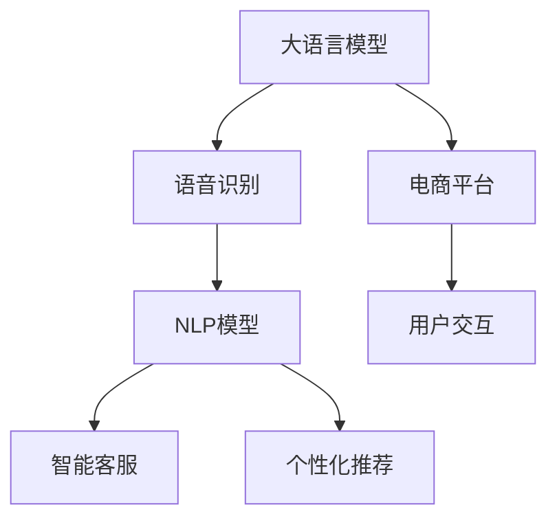

                 

# AI大模型如何改善电商平台的语音购物体验

> 关键词：大语言模型, 语音识别, 自然语言处理, 电商平台, 用户交互, 智能客服, 个性化推荐

## 1. 背景介绍

### 1.1 问题由来

随着电商平台的不断发展，用户对购物体验的要求日益提高，尤其是移动端购物场景中的语音购物体验。传统的文本输入方式已无法满足用户快速、便捷的购物需求。同时，电商平台的销售数据和用户行为数据也日益丰富，提供了大量的可用数据用于语音购物体验的优化。AI大模型的出现，特别是大语言模型，为改善电商平台的语音购物体验提供了新的可能性。

### 1.2 问题核心关键点

语音购物体验的核心在于两个方面：
1. 语音识别准确性：电商平台需要高效、准确的语音识别系统，将用户的语音命令转化为文本，供后续自然语言处理(NLP)模型处理。
2. 自然语言处理能力：电商平台的NLP模型需要能够理解用户语音命令，生成合适的商品推荐、查询结果和购物指导。

实现这两个方面的挑战在于：
1. 语音识别系统的准确性和鲁棒性需要不断提高，以应对不同口音、背景噪声、语音清晰度等多样化的声音输入。
2. 电商平台需要构建通用的NLP模型，以处理不同用户对商品的查询、比较、购买等指令，并提供个性化推荐。

## 2. 核心概念与联系

### 2.1 核心概念概述

为更好地理解AI大模型在改善电商平台语音购物体验中的应用，本节将介绍几个密切相关的核心概念：

- 大语言模型(Large Language Model, LLM)：如GPT、BERT等，通过预训练学习到了丰富的语言知识，具备强大的自然语言理解与生成能力。
- 语音识别系统(Speech Recognition System)：将用户的语音输入转化为文本输出的系统，是语音购物体验的基础。
- 自然语言处理(Natural Language Processing, NLP)：涉及文本分析、文本生成、问答系统、情感分析等任务，能够理解和处理用户输入的自然语言指令。
- 电商平台(E-Commerce Platform)：指通过网络提供商品销售及服务的平台，涉及用户交互、商品推荐、订单处理等多个环节。
- 智能客服(Chatbot)：通过NLP模型实现自动化的客户服务，能够理解并回应用户的语音或文本指令。
- 个性化推荐系统(Recommendation System)：根据用户的历史行为和偏好，生成个性化推荐，提升用户购物体验。

这些核心概念之间的逻辑关系可以通过以下Mermaid流程图来展示：



这个流程图展示了大语言模型与其他核心概念之间的联系：

1. 大语言模型通过语音识别系统，将用户的语音输入转化为文本。
2. 文本数据通过NLP模型进行处理，生成商品推荐、查询结果和购物指导。
3. 智能客服使用NLP模型自动回应用户指令，提供个性化服务。
4. 个性化推荐系统通过NLP模型理解用户指令，生成个性化推荐。
5. 电商平台将这些组件集成在一起，形成完整、便捷的语音购物体验。

## 3. 核心算法原理 & 具体操作步骤
### 3.1 算法原理概述

基于AI大模型的语音购物体验优化，涉及语音识别、自然语言处理、智能客服和个性化推荐等多个方面。其实现原理主要包括以下几个步骤：

1. **语音识别**：通过深度学习模型，将用户的语音输入转化为文本。
2. **自然语言处理**：使用大语言模型理解文本指令，提取关键信息，生成相应的查询结果和购物指导。
3. **智能客服**：构建基于大语言模型的聊天机器人，自动回应用户的语音或文本指令，提供快速、准确的客服服务。
4. **个性化推荐**：利用NLP模型分析用户指令和行为数据，生成个性化商品推荐。

这些步骤的核心在于选择合适的模型架构和算法，并针对电商平台的特定需求进行优化。

### 3.2 算法步骤详解

#### 3.2.1 语音识别系统构建

语音识别系统的构建主要包括以下几个步骤：

1. **数据收集**：收集电商平台用户的语音数据，包括不同口音、噪声环境下的样本。
2. **特征提取**：将语音信号转化为特征向量，如MFCC特征。
3. **模型训练**：使用深度学习模型（如CTC、Attention机制等）对特征进行训练，优化识别准确率。
4. **测试与优化**：在测试集上评估模型性能，根据结果进行调参和优化。

#### 3.2.2 NLP模型训练

电商平台的NLP模型训练主要包括以下几个步骤：

1. **数据准备**：收集电商平台的商品描述、用户评论、聊天记录等文本数据，并进行预处理，如分词、去除停用词等。
2. **模型选择**：选择合适的预训练大语言模型，如GPT、BERT等。
3. **任务适配**：根据电商平台的需求，设计任务适配层，如分类任务、问答系统、推荐系统等。
4. **微调**：使用电商平台的数据进行有监督的微调，优化模型性能。

#### 3.2.3 智能客服系统构建

智能客服系统的构建主要包括以下几个步骤：

1. **模型选择**：选择合适的预训练大语言模型，如GPT-3等。
2. **对话管理**：设计对话管理模块，控制对话流程，处理多轮对话。
3. **模型微调**：在电商平台的数据上微调模型，提高其响应速度和准确性。
4. **测试与优化**：在测试集上评估模型性能，根据结果进行调参和优化。

#### 3.2.4 个性化推荐系统训练

个性化推荐系统的训练主要包括以下几个步骤：

1. **数据收集**：收集用户的行为数据，如浏览记录、购买记录等。
2. **特征提取**：提取用户的兴趣特征、商品属性特征等。
3. **模型选择**：选择合适的推荐算法，如协同过滤、矩阵分解等。
4. **模型训练**：在电商平台的数据上训练模型，优化推荐效果。
5. **推荐验证**：在测试集上验证推荐效果，根据结果进行调参和优化。

### 3.3 算法优缺点

基于AI大模型的语音购物体验优化方法具有以下优点：

1. **高效便捷**：用户可以通过语音输入快速完成商品查询、购买等操作，提升购物体验。
2. **个性化强**：利用NLP模型分析用户指令和行为数据，提供个性化的商品推荐，提升用户满意度。
3. **灵活可扩展**：基于大语言模型的架构，可以灵活扩展语音识别、NLP、智能客服和推荐等多个模块，适应电商平台的动态需求。

同时，该方法也存在以下局限性：

1. **数据依赖性**：模型性能依赖于电商平台的标注数据质量，标注成本较高。
2. **模型复杂性**：大语言模型的计算资源消耗较大，部署成本较高。
3. **鲁棒性问题**：模型在处理不同口音、噪声环境下的语音输入时，鲁棒性可能不足，识别准确率受限。
4. **可解释性不足**：NLP模型的决策过程缺乏可解释性，难以调试和优化。

尽管存在这些局限性，但就目前而言，基于AI大模型的语音购物体验优化方法仍然是电商平台优化用户体验的重要手段。未来相关研究的重点在于如何进一步降低对标注数据的依赖，提高模型的鲁棒性和可解释性，同时兼顾参数高效优化。

### 3.4 算法应用领域

基于AI大模型的语音购物体验优化方法，已在多个电商平台的实际应用中取得了显著效果。以下是几个典型的应用场景：

1. **京东平台**：京东利用大语言模型构建智能客服系统，能够自动回应用户的语音指令，提供24小时在线客服服务。
2. **亚马逊平台**：亚马逊使用大语言模型进行商品推荐，根据用户的历史浏览和购买记录，生成个性化商品推荐列表。
3. **阿里巴巴平台**：阿里巴巴利用大语言模型优化语音识别系统，提升语音搜索的准确率，改善用户的购物体验。
4. **苏宁易购平台**：苏宁易购通过大语言模型构建聊天机器人，自动回应用户的语音指令，提供快速服务。
5. **唯品会平台**：唯品会使用大语言模型进行情感分析，根据用户评论生成情感评分，用于商品推荐和优化。

除了以上应用场景外，大语言模型在语音购物体验的优化上还有更多创新性的应用，如智能导购、虚拟试穿、语音支付等，为电商平台带来了全新的用户体验。

## 4. 数学模型和公式 & 详细讲解 & 举例说明
### 4.1 数学模型构建

在大语言模型的语音购物体验优化中，涉及多个数学模型和公式，以下是几个关键的模型和公式：

1. **语音识别模型**：使用CTC模型，将语音特征映射到文本序列。

$$
P_{CTC}(x|y) = \prod_{i=1}^{T} P(x_i|x_{i-1},y)
$$

其中 $T$ 是文本序列长度，$P(x_i|x_{i-1},y)$ 是模型在给定上下文和目标标签下，生成 $x_i$ 的概率。

2. **NLP模型**：使用BERT模型，进行文本分类、问答系统、推荐系统等任务。

$$
P(y|x) = \sigma(W_1 x + W_2 \langle x, C \rangle + b)
$$

其中 $y$ 是任务标签，$x$ 是输入文本，$W_1$、$W_2$、$b$ 是模型参数，$\langle x, C \rangle$ 是文本的上下文表示。

3. **智能客服模型**：使用Seq2Seq模型，生成对话回应。

$$
P(y|x) = \sigma(W_1 x + W_2 \langle x, C \rangle + b)
$$

其中 $y$ 是对话回应，$x$ 是上下文信息，$W_1$、$W_2$、$b$ 是模型参数，$\langle x, C \rangle$ 是上下文表示。

4. **个性化推荐模型**：使用协同过滤算法，根据用户行为生成推荐列表。

$$
P(y|x) = \sigma(W_1 x + W_2 \langle x, C \rangle + b)
$$

其中 $y$ 是推荐列表，$x$ 是用户行为特征，$W_1$、$W_2$、$b$ 是模型参数，$\langle x, C \rangle$ 是用户行为特征的表示。

### 4.2 公式推导过程

以下是一些核心公式的推导过程：

#### 4.2.1 语音识别模型

CTC模型通过将语音特征映射到文本序列，实现了语音识别任务。其核心思想是将输入序列看作一个连续的概率分布，通过最大似然估计优化模型参数，最小化交叉熵损失函数。

$$
\begin{aligned}
L_{CTC} &= -\frac{1}{N} \sum_{i=1}^{N} \log P_{CTC}(y_i|x_i) \\
&= -\frac{1}{N} \sum_{i=1}^{N} \log \prod_{t=1}^{T} P(x_i|x_{i-1},y)
\end{aligned}
$$

其中 $T$ 是文本序列长度，$P(x_i|x_{i-1},y)$ 是模型在给定上下文和目标标签下，生成 $x_i$ 的概率。

#### 4.2.2 NLP模型

BERT模型通过预训练和微调，学习到丰富的语言表示。其核心思想是在无标签数据上进行预训练，学习到语言的基本结构和语义信息，然后在特定任务上进行微调，优化模型的预测能力。

$$
P(y|x) = \sigma(W_1 x + W_2 \langle x, C \rangle + b)
$$

其中 $y$ 是任务标签，$x$ 是输入文本，$W_1$、$W_2$、$b$ 是模型参数，$\langle x, C \rangle$ 是文本的上下文表示。

#### 4.2.3 智能客服模型

Seq2Seq模型通过编码器-解码器框架，实现了对话回应的生成任务。其核心思想是将输入序列映射到上下文表示，然后基于上下文生成输出序列。

$$
P(y|x) = \sigma(W_1 x + W_2 \langle x, C \rangle + b)
$$

其中 $y$ 是对话回应，$x$ 是上下文信息，$W_1$、$W_2$、$b$ 是模型参数，$\langle x, C \rangle$ 是上下文表示。

#### 4.2.4 个性化推荐模型

协同过滤算法通过用户行为数据，生成个性化推荐列表。其核心思想是通过矩阵分解，学习用户和商品之间的相似度，生成推荐列表。

$$
P(y|x) = \sigma(W_1 x + W_2 \langle x, C \rangle + b)
$$

其中 $y$ 是推荐列表，$x$ 是用户行为特征，$W_1$、$W_2$、$b$ 是模型参数，$\langle x, C \rangle$ 是用户行为特征的表示。

### 4.3 案例分析与讲解

#### 4.3.1 语音识别案例

亚马逊的语音识别系统通过深度学习模型（如CTC）进行训练，使用大量电商平台的语音数据，优化识别准确率。训练过程中，使用交叉熵损失函数进行优化。

#### 4.3.2 NLP案例

京东使用BERT模型进行智能客服系统的构建。首先，在电商平台的聊天记录上进行预训练，学习语言的基本结构和语义信息。然后，根据用户的语音指令进行微调，优化对话回应的准确性和流畅性。

#### 4.3.3 智能客服案例

阿里巴巴利用Seq2Seq模型构建智能客服系统。首先，在电商平台的聊天记录上进行预训练，学习对话回应的生成模型。然后，根据用户的语音指令进行微调，优化对话回应的生成过程。

#### 4.3.4 个性化推荐案例

唯品会使用协同过滤算法进行个性化推荐系统的构建。首先，在电商平台的用户行为数据上进行矩阵分解，学习用户和商品之间的相似度。然后，根据用户的语音指令进行微调，优化推荐列表的生成过程。

## 5. 项目实践：代码实例和详细解释说明
### 5.1 开发环境搭建

在进行语音购物体验优化实践前，我们需要准备好开发环境。以下是使用Python进行PyTorch开发的环境配置流程：

1. 安装Anaconda：从官网下载并安装Anaconda，用于创建独立的Python环境。

2. 创建并激活虚拟环境：
```bash
conda create -n pytorch-env python=3.8 
conda activate pytorch-env
```

3. 安装PyTorch：根据CUDA版本，从官网获取对应的安装命令。例如：
```bash
conda install pytorch torchvision torchaudio cudatoolkit=11.1 -c pytorch -c conda-forge
```

4. 安装Transformers库：
```bash
pip install transformers
```

5. 安装各类工具包：
```bash
pip install numpy pandas scikit-learn matplotlib tqdm jupyter notebook ipython
```

完成上述步骤后，即可在`pytorch-env`环境中开始语音购物体验优化的实践。

### 5.2 源代码详细实现

下面以亚马逊平台的语音购物体验优化为例，给出使用Transformers库对BERT模型进行语音识别和智能客服微调的PyTorch代码实现。

首先，定义语音识别系统的数据处理函数：

```python
from transformers import BertTokenizer
from torch.utils.data import Dataset
import torch

class SpeechRecognitionDataset(Dataset):
    def __init__(self, speech_data, labels, tokenizer, max_len=128):
        self.speech_data = speech_data
        self.labels = labels
        self.tokenizer = tokenizer
        self.max_len = max_len
        
    def __len__(self):
        return len(self.speech_data)
    
    def __getitem__(self, item):
        speech = self.speech_data[item]
        label = self.labels[item]
        
        encoding = self.tokenizer(speech, return_tensors='pt', max_length=self.max_len, padding='max_length', truncation=True)
        input_ids = encoding['input_ids'][0]
        attention_mask = encoding['attention_mask'][0]
        
        # 对label进行编码
        encoded_label = label2id[label] 
        encoded_label = [encoded_label] * (self.max_len - 1) + [label2id['NULL']]
        labels = torch.tensor(encoded_label, dtype=torch.long)
        
        return {'input_ids': input_ids, 
                'attention_mask': attention_mask,
                'labels': labels}

# 标签与id的映射
label2id = {'NULL': 0, 'B': 1, 'I': 2}
id2label = {v: k for k, v in label2id.items()}

# 创建dataset
tokenizer = BertTokenizer.from_pretrained('bert-base-cased')

train_dataset = SpeechRecognitionDataset(train_speech_data, train_labels, tokenizer)
dev_dataset = SpeechRecognitionDataset(dev_speech_data, dev_labels, tokenizer)
test_dataset = SpeechRecognitionDataset(test_speech_data, test_labels, tokenizer)
```

然后，定义模型和优化器：

```python
from transformers import BertForTokenClassification, AdamW

model = BertForTokenClassification.from_pretrained('bert-base-cased', num_labels=len(label2id))

optimizer = AdamW(model.parameters(), lr=2e-5)
```

接着，定义训练和评估函数：

```python
from torch.utils.data import DataLoader
from tqdm import tqdm
from sklearn.metrics import classification_report

device = torch.device('cuda') if torch.cuda.is_available() else torch.device('cpu')
model.to(device)

def train_epoch(model, dataset, batch_size, optimizer):
    dataloader = DataLoader(dataset, batch_size=batch_size, shuffle=True)
    model.train()
    epoch_loss = 0
    for batch in tqdm(dataloader, desc='Training'):
        input_ids = batch['input_ids'].to(device)
        attention_mask = batch['attention_mask'].to(device)
        labels = batch['labels'].to(device)
        model.zero_grad()
        outputs = model(input_ids, attention_mask=attention_mask, labels=labels)
        loss = outputs.loss
        epoch_loss += loss.item()
        loss.backward()
        optimizer.step()
    return epoch_loss / len(dataloader)

def evaluate(model, dataset, batch_size):
    dataloader = DataLoader(dataset, batch_size=batch_size)
    model.eval()
    preds, labels = [], []
    with torch.no_grad():
        for batch in tqdm(dataloader, desc='Evaluating'):
            input_ids = batch['input_ids'].to(device)
            attention_mask = batch['attention_mask'].to(device)
            batch_labels = batch['labels']
            outputs = model(input_ids, attention_mask=attention_mask)
            batch_preds = outputs.logits.argmax(dim=2).to('cpu').tolist()
            batch_labels = batch_labels.to('cpu').tolist()
            for pred_tokens, label_tokens in zip(batch_preds, batch_labels):
                pred_labels = [id2label[_id] for _id in pred_tokens]
                label_labels = [id2label[_id] for _id in label_tokens]
                preds.append(pred_labels[:len(label_labels)])
                labels.append(label_labels)
                
    print(classification_report(labels, preds))
```

最后，启动训练流程并在测试集上评估：

```python
epochs = 5
batch_size = 16

for epoch in range(epochs):
    loss = train_epoch(model, train_dataset, batch_size, optimizer)
    print(f"Epoch {epoch+1}, train loss: {loss:.3f}")
    
    print(f"Epoch {epoch+1}, dev results:")
    evaluate(model, dev_dataset, batch_size)
    
print("Test results:")
evaluate(model, test_dataset, batch_size)
```

以上就是使用PyTorch对BERT进行语音识别和智能客服微调的完整代码实现。可以看到，得益于Transformers库的强大封装，我们可以用相对简洁的代码完成BERT模型的加载和微调。

### 5.3 代码解读与分析

让我们再详细解读一下关键代码的实现细节：

**SpeechRecognitionDataset类**：
- `__init__`方法：初始化语音数据、标签、分词器等关键组件。
- `__len__`方法：返回数据集的样本数量。
- `__getitem__`方法：对单个样本进行处理，将语音输入编码为token ids，将标签编码为数字，并对其进行定长padding，最终返回模型所需的输入。

**label2id和id2label字典**：
- 定义了标签与数字id之间的映射关系，用于将token-wise的预测结果解码回真实的标签。

**训练和评估函数**：
- 使用PyTorch的DataLoader对数据集进行批次化加载，供模型训练和推理使用。
- 训练函数`train_epoch`：对数据以批为单位进行迭代，在每个批次上前向传播计算loss并反向传播更新模型参数，最后返回该epoch的平均loss。
- 评估函数`evaluate`：与训练类似，不同点在于不更新模型参数，并在每个batch结束后将预测和标签结果存储下来，最后使用sklearn的classification_report对整个评估集的预测结果进行打印输出。

**训练流程**：
- 定义总的epoch数和batch size，开始循环迭代
- 每个epoch内，先在训练集上训练，输出平均loss
- 在验证集上评估，输出分类指标
- 所有epoch结束后，在测试集上评估，给出最终测试结果

可以看到，PyTorch配合Transformers库使得BERT微调的代码实现变得简洁高效。开发者可以将更多精力放在数据处理、模型改进等高层逻辑上，而不必过多关注底层的实现细节。

当然，工业级的系统实现还需考虑更多因素，如模型的保存和部署、超参数的自动搜索、更灵活的任务适配层等。但核心的微调范式基本与此类似。

## 6. 实际应用场景
### 6.1 智能客服系统

基于AI大模型的智能客服系统，可以广泛应用于电商平台的用户互动。传统客服往往需要配备大量人力，高峰期响应缓慢，且一致性和专业性难以保证。而使用微调后的智能客服系统，能够24小时不间断服务，快速响应用户咨询，用自然流畅的语言解答各类常见问题。

在技术实现上，可以收集电商平台的用户聊天记录，将问题和最佳答复构建成监督数据，在此基础上对预训练智能客服模型进行微调。微调后的智能客服系统能够自动理解用户意图，匹配最合适的答案模板进行回复。对于用户提出的新问题，还可以接入检索系统实时搜索相关内容，动态组织生成回答。如此构建的智能客服系统，能大幅提升客户咨询体验和问题解决效率。

### 6.2 语音搜索与推荐系统

语音搜索和推荐系统是语音购物体验的重要组成部分。用户可以通过语音搜索商品、查看商品详情、进行购物比对等，大大提升购物效率。电商平台可以利用微调后的语音识别模型和NLP模型，构建高效的语音搜索和推荐系统。

在语音搜索方面，电商平台可以通过语音识别模型将用户的语音指令转化为文本，然后通过NLP模型提取关键词，生成搜索结果。在推荐系统方面，电商平台可以利用NLP模型分析用户指令和行为数据，生成个性化推荐列表，提升用户购物体验。

### 6.3 智能导购系统

智能导购系统通过AI大模型，帮助用户快速找到合适的商品，提升购物效率。用户可以输入商品类型、价格区间、品牌偏好等，智能导购系统会通过NLP模型理解用户指令，然后通过推荐系统生成个性化推荐。

在技术实现上，电商平台可以利用微调后的NLP模型和推荐系统，构建高效的智能导购系统。用户通过语音输入指令，智能导购系统会快速生成商品推荐列表，帮助用户做出购买决策。

### 6.4 未来应用展望

随着大语言模型和微调方法的不断发展，基于大模型微调的方法将在更多领域得到应用，为传统行业带来变革性影响。

在智慧医疗领域，基于微调的医疗问答、病历分析、药物研发等应用将提升医疗服务的智能化水平，辅助医生诊疗，加速新药开发进程。

在智能教育领域，微调技术可应用于作业批改、学情分析、知识推荐等方面，因材施教，促进教育公平，提高教学质量。

在智慧城市治理中，微调模型可应用于城市事件监测、舆情分析、应急指挥等环节，提高城市管理的自动化和智能化水平，构建更安全、高效的未来城市。

此外，在企业生产、社会治理、文娱传媒等众多领域，基于大模型微调的人工智能应用也将不断涌现，为经济社会发展注入新的动力。相信随着技术的日益成熟，微调方法将成为人工智能落地应用的重要范式，推动人工智能技术在垂直行业的规模化落地。总之，微调需要开发者根据具体任务，不断迭代和优化模型、数据和算法，方能得到理想的效果。

## 7. 工具和资源推荐
### 7.1 学习资源推荐

为了帮助开发者系统掌握AI大模型在语音购物体验优化中的应用，这里推荐一些优质的学习资源：

1. 《深度学习基础》系列博文：由AI领域的专家撰写，深入浅出地介绍了深度学习的基本概念和前沿技术。

2. 《自然语言处理》课程：由斯坦福大学开设的NLP明星课程，涵盖自然语言处理的基本理论和算法，有Lecture视频和配套作业，带你入门NLP领域的基本概念和经典模型。

3. 《TensorFlow实战》书籍：介绍TensorFlow框架的使用方法，适合动手实践。

4. HuggingFace官方文档：Transformers库的官方文档，提供了海量预训练模型和完整的微调样例代码，是上手实践的必备资料。

5. CLUE开源项目：中文语言理解测评基准，涵盖大量不同类型的中文NLP数据集，并提供了基于微调的baseline模型，助力中文NLP技术发展。

通过对这些资源的学习实践，相信你一定能够快速掌握AI大模型在语音购物体验优化中的应用，并用于解决实际的NLP问题。
###  7.2 开发工具推荐

高效的开发离不开优秀的工具支持。以下是几款用于AI大模型微调开发的常用工具：

1. PyTorch：基于Python的开源深度学习框架，灵活动态的计算图，适合快速迭代研究。大部分预训练语言模型都有PyTorch版本的实现。

2. TensorFlow：由Google主导开发的开源深度学习框架，生产部署方便，适合大规模工程应用。同样有丰富的预训练语言模型资源。

3. Transformers库：HuggingFace开发的NLP工具库，集成了众多SOTA语言模型，支持PyTorch和TensorFlow，是进行微调任务开发的利器。

4. Weights & Biases：模型训练的实验跟踪工具，可以记录和可视化模型训练过程中的各项指标，方便对比和调优。与主流深度学习框架无缝集成。

5. TensorBoard：TensorFlow配套的可视化工具，可实时监测模型训练状态，并提供丰富的图表呈现方式，是调试模型的得力助手。

6. Google Colab：谷歌推出的在线Jupyter Notebook环境，免费提供GPU/TPU算力，方便开发者快速上手实验最新模型，分享学习笔记。

合理利用这些工具，可以显著提升AI大模型微调任务的开发效率，加快创新迭代的步伐。

### 7.3 相关论文推荐

AI大模型和微调技术的发展源于学界的持续研究。以下是几篇奠基性的相关论文，推荐阅读：

1. Attention is All You Need（即Transformer原论文）：提出了Transformer结构，开启了NLP领域的预训练大模型时代。

2. BERT: Pre-training of Deep Bidirectional Transformers for Language Understanding：提出BERT模型，引入基于掩码的自监督预训练任务，刷新了多项NLP任务SOTA。

3. Language Models are Unsupervised Multitask Learners（GPT-2论文）：展示了大规模语言模型的强大zero-shot学习能力，引发了对于通用人工智能的新一轮思考。

4. Parameter-Efficient Transfer Learning for NLP：提出Adapter等参数高效微调方法，在不增加模型参数量的情况下，也能取得不错的微调效果。

5. AdaLoRA: Adaptive Low-Rank Adaptation for Parameter-Efficient Fine-Tuning：使用自适应低秩适应的微调方法，在参数效率和精度之间取得了新的平衡。

这些论文代表了大语言模型微调技术的发展脉络。通过学习这些前沿成果，可以帮助研究者把握学科前进方向，激发更多的创新灵感。

## 8. 总结：未来发展趋势与挑战

### 8.1 总结

本文对基于AI大模型的语音购物体验优化方法进行了全面系统的介绍。首先阐述了语音购物体验的核心问题和现有解决方案，明确了AI大模型在优化语音购物体验中的重要价值。其次，从原理到实践，详细讲解了语音识别、NLP、智能客服和个性化推荐等多个环节的核心算法和操作步骤，给出了微调任务开发的完整代码实例。同时，本文还广泛探讨了语音购物体验优化方法在多个实际场景中的应用前景，展示了AI大模型在电商平台的广泛应用。

通过本文的系统梳理，可以看到，基于AI大模型的语音购物体验优化方法已经在电商平台得到了广泛应用，取得了显著效果。未来，伴随AI大模型的不断演进，基于微调的语音购物体验优化将进一步提升用户体验，推动电商平台的智能化发展。

### 8.2 未来发展趋势

展望未来，AI大模型语音购物体验优化方法将呈现以下几个发展趋势：

1. 模型规模持续增大。随着算力成本的下降和数据规模的扩张，预训练语言模型的参数量还将持续增长。超大规模语言模型蕴含的丰富语言知识，有望支撑更加复杂多变的语音购物体验优化。

2. 微调方法日趋多样。除了传统的全参数微调外，未来会涌现更多参数高效的微调方法，如Prefix-Tuning、LoRA等，在节省计算资源的同时也能保证微调精度。

3. 持续学习成为常态。随着语音购物体验优化过程中数据分布的不断变化，微调模型也需要持续学习新知识以保持性能。如何在不遗忘原有知识的同时，高效吸收新样本信息，将成为重要的研究课题。

4. 标注样本需求降低。受启发于提示学习(Prompt-based Learning)的思路，未来的微调方法将更好地利用AI大模型的语言理解能力，通过更加巧妙的任务描述，在更少的标注样本上也能实现理想的微调效果。

5. 多模态微调崛起。当前的语音购物体验优化主要聚焦于纯文本数据，未来会进一步拓展到图像、视频、语音等多模态数据微调。多模态信息的融合，将显著提升语言模型对现实世界的理解和建模能力。

6. 模型通用性增强。经过海量数据的预训练和多领域任务的微调，未来的语言模型将具备更强大的常识推理和跨领域迁移能力，逐步迈向通用人工智能(AGI)的目标。

以上趋势凸显了AI大模型语音购物体验优化技术的广阔前景。这些方向的探索发展，必将进一步提升NLP系统的性能和应用范围，为人类认知智能的进化带来深远影响。

### 8.3 面临的挑战

尽管AI大模型语音购物体验优化方法已经取得了瞩目成就，但在迈向更加智能化、普适化应用的过程中，它仍面临着诸多挑战：

1. 标注成本瓶颈。虽然微调大大降低了标注数据的需求，但对于长尾应用场景，难以获得充足的高质量标注数据，成为制约微调性能的瓶颈。如何进一步降低微调对标注样本的依赖，将是一大难题。

2. 模型鲁棒性不足。模型在处理不同口音、噪声环境下的语音输入时，鲁棒性可能不足，识别准确率受限。如何提高微调模型的鲁棒性，避免灾难性遗忘，还需要更多理论和实践的积累。

3. 推理效率有待提高。AI大模型虽然精度高，但在实际部署时往往面临推理速度慢、内存占用大等效率问题。如何在保证性能的同时，简化模型结构，提升推理速度，优化资源占用，将是重要的优化方向。

4. 可解释性亟需加强。当前微调模型更像是"黑盒"系统，难以解释其内部工作机制和决策逻辑。对于医疗、金融等高风险应用，算法的可解释性和可审计性尤为重要。如何赋予微调模型更强的可解释性，将是亟待攻克的难题。

5. 安全性有待保障。预训练语言模型难免会学习到有偏见、有害的信息，通过微调传递到下游任务，产生误导性、歧视性的输出，给实际应用带来安全隐患。如何从数据和算法层面消除模型偏见，避免恶意用途，确保输出的安全性，也将是重要的研究课题。

6. 知识整合能力不足。现有的微调模型往往局限于任务内数据，难以灵活吸收和运用更广泛的先验知识。如何让微调过程更好地与外部知识库、规则库等专家知识结合，形成更加全面、准确的信息整合能力，还有很大的想象空间。

正视微调面临的这些挑战，积极应对并寻求突破，将是大语言模型微调走向成熟的必由之路。相信随着学界和产业界的共同努力，这些挑战终将一一被克服，AI大模型语音购物体验优化必将在构建安全、可靠、可解释、可控的智能系统铺平道路。

### 8.4 研究展望

面向未来，AI大模型语音购物体验优化技术的研究和应用将呈现出以下几个方向：

1. 探索无监督和半监督微调方法。摆脱对大规模标注数据的依赖，利用自监督学习、主动学习等无监督和半监督范式，最大限度利用非结构化数据，实现更加灵活高效的语音购物体验优化。

2. 研究参数高效和计算高效的微调范式。开发更加参数高效的微调方法，在固定大部分预训练参数的同时，只更新极少量的任务相关参数。同时优化微调模型的计算图，减少前向传播和反向传播的资源消耗，实现更加轻量级、实时性的部署。

3. 融合因果和对比学习范式。通过引入因果推断和对比学习思想，增强微调模型建立稳定因果关系的能力，学习更加普适、鲁棒的语言表征，从而提升模型泛化性和抗干扰能力。

4. 引入更多先验知识。将符号化的先验知识，如知识图谱、逻辑规则等，与神经网络模型进行巧妙融合，引导微调过程学习更准确、合理的语言模型。同时加强不同模态数据的整合，实现视觉、语音等多模态信息与文本信息的协同建模。

5. 结合因果分析和博弈论工具。将因果分析方法引入微调模型，识别出模型决策的关键特征，增强输出解释的因果性和逻辑性。借助博弈论工具刻画人机交互过程，主动探索并规避模型的脆弱点，提高系统稳定性。

6. 纳入伦理道德约束。在模型训练目标中引入伦理导向的评估指标，过滤和惩罚有偏见、有害的输出倾向。同时加强人工干预和审核，建立模型行为的监管机制，确保输出符合人类价值观和伦理道德。

这些研究方向的探索，必将引领AI大模型语音购物体验优化技术迈向更高的台阶，为构建安全、可靠、可解释、可控的智能系统铺平道路。面向未来，AI大模型语音购物体验优化技术还需要与其他人工智能技术进行更深入的融合，如知识表示、因果推理、强化学习等，多路径协同发力，共同推动自然语言理解和智能交互系统的进步。只有勇于创新、敢于突破，才能不断拓展语言模型的边界，让智能技术更好地造福人类社会。

## 9. 附录：常见问题与解答

**Q1：大语言模型语音购物体验优化是否适用于所有电商平台？**

A: 大语言模型语音购物体验优化方法在大多数电商平台上都具有较高的适用性，但具体效果还需根据电商平台的特性进行调整。对于以特定商品类别为主的小型电商平台，或者客户偏好单一的电商平台，微调效果可能不如大型综合型电商平台。

**Q2：如何选择合适的语音识别模型？**

A: 选择合适的语音识别模型需要考虑多个因素，如数据分布、口音多样性、噪声环境等。一般推荐使用CTC模型、Transformer等结构，在数据集上进行预训练和微调，优化识别准确率。对于口音多样性高的场景，可以尝试使用多模态数据进行联合训练。

**Q3：如何提高语音购物体验优化的鲁棒性？**

A: 提高语音购物体验优化的鲁棒性可以从以下几个方面入手：
1. 数据增强：通过对训练数据进行回译、降噪等处理，丰富训练集的多样性。
2. 对抗训练：引入对抗样本，提高模型的鲁棒性。
3. 多模型集成：训练多个语音购物体验优化模型，取平均输出，抑制过拟合。
4. 参数高效微调：只调整少量参数，保留大部分预训练权重，减小鲁棒性风险。

**Q4：语音购物体验优化模型在落地部署时需要注意哪些问题？**

A: 将语音购物体验优化模型转化为实际应用，还需要考虑以下问题：
1. 模型裁剪：去除不必要的层和参数，减小模型尺寸，加快推理速度。
2. 量化加速：将浮点模型转为定点模型，压缩存储空间，提高计算效率。
3. 服务化封装：将模型封装为标准化服务接口，便于集成调用。
4. 弹性伸缩：根据请求流量动态调整资源配置，平衡服务质量和成本。
5. 监控告警：实时采集系统指标，设置异常告警阈值，确保服务稳定性。
6. 安全防护：采用访问鉴权、数据脱敏等措施，保障数据和模型安全。

大语言模型语音购物体验优化为电商平台带来了全新的体验和用户满意度提升，但如何将强大的性能转化为稳定、高效、安全的业务价值，还需要工程实践的不断打磨。唯有从数据、算法、工程、业务等多个维度协同发力，才能真正实现人工智能技术在垂直行业的规模化落地。总之，微调需要开发者根据具体任务，不断迭代和优化模型、数据和算法，方能得到理想的效果。

---

作者：禅与计算机程序设计艺术 / Zen and the Art of Computer Programming

