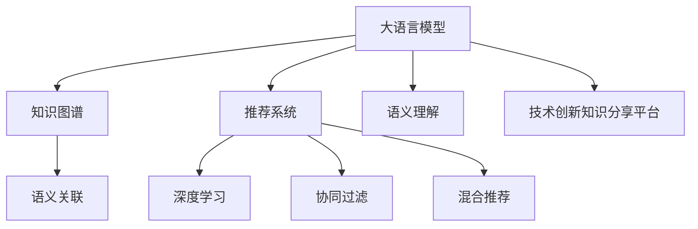

                 

# AI大模型视角下电商搜索推荐的技术创新知识分享平台搭建

> 关键词：大语言模型, 电商平台, 搜索推荐, 技术创新, 知识分享, 知识图谱, 推荐系统

## 1. 背景介绍

### 1.1 问题由来

随着电商行业的迅猛发展，用户对购物体验的期望日益提升，如何实现高效、个性化的商品推荐成为电商平台面临的关键挑战。传统的基于规则、协同过滤等推荐算法逐渐无法满足用户的多样化需求。与此同时，大语言模型的兴起为推荐系统带来了新的突破。

通过大语言模型进行推荐，可以深度理解用户行为、商品描述，并从语义层面进行推理，进而提供更加个性化、精准的推荐。但大语言模型的高计算成本和知识复杂度也带来了新的挑战。为应对这些挑战，结合知识图谱、深度学习、自然语言处理等多领域技术，搭建了基于大语言模型的电商搜索推荐技术创新知识分享平台，提供一站式的解决方案。

### 1.2 问题核心关键点

本项目旨在利用大语言模型在自然语言处理领域的能力，结合知识图谱技术，构建精准高效的电商推荐系统，同时提供一个平台，供开发者、研究人员等进行技术交流、分享创新经验。

核心关键点如下：

1. **大语言模型的知识推理能力**：利用大语言模型的语言理解与生成能力，对用户行为、商品描述进行语义分析，并提取关键特征。
2. **知识图谱的语义关联能力**：结合知识图谱的实体关系建模能力，对用户、商品、行为进行综合分析，形成更全面的知识图谱。
3. **推荐算法的高效融合**：将深度学习、协同过滤、基于图谱的推荐等技术进行有效结合，构建复杂推荐模型。
4. **技术创新知识分享平台**：搭建一个平台，促进开发者、研究人员之间进行技术交流，分享最新的研究成果和实践经验。

## 2. 核心概念与联系

### 2.1 核心概念概述

为更好地理解项目的核心技术实现，本节将介绍几个密切相关的核心概念：

- **大语言模型(Large Language Model, LLM)**：以自回归(如GPT)或自编码(如BERT)模型为代表的大规模预训练语言模型。通过在大规模无标签文本语料上进行预训练，学习通用的语言表示，具备强大的语言理解和生成能力。

- **知识图谱(Knowledge Graph)**：基于实体、关系、属性构建的语义网络，用于表示实体之间的语义关系，帮助机器理解世界的知识结构。

- **推荐系统(Recommendation System)**：根据用户行为和商品属性，向用户推荐可能感兴趣的商品。常见的推荐方式包括基于内容的推荐、协同过滤、混合推荐等。

- **技术创新知识分享平台**：一个提供技术文档、代码、论文等资源的平台，供开发者、研究人员进行技术交流和经验分享。

这些核心概念之间的逻辑关系可以通过以下Mermaid流程图来展示：



这个流程图展示了不同核心概念之间的联系：

1. 大语言模型通过预训练获得基础能力。
2. 知识图谱结合大语言模型的语义理解能力，构建更全面的语义网络。
3. 推荐系统融合多种推荐技术，实现复杂的推荐模型。
4. 技术创新知识分享平台促进开发者、研究人员之间的交流与合作。

## 3. 核心算法原理 & 具体操作步骤

### 3.1 算法原理概述

本项目基于大语言模型和知识图谱构建推荐系统，其核心思想是：利用大语言模型对用户行为、商品描述进行语义理解，同时结合知识图谱的语义关联能力，进行商品推荐。

形式化地，假设用户为 $U$，商品为 $I$，行为为 $B$。给定用户 $u$，商品 $i$，行为 $b$，推荐系统的目标是最小化预测错误率，即：

$$
\min_{\theta} \mathcal{L}(\theta) = \sum_{(u,i,b) \in D} \mathbb{1}(f_\theta(u,i,b) \neq b)
$$

其中，$\theta$ 为模型参数，$f_\theta$ 为推荐函数，$D$ 为训练数据集。推荐函数 $f_\theta$ 可以基于大语言模型和知识图谱构建，具体形式如下：

$$
f_\theta(u,i,b) = \sigma(M_{LLM}(u,i,b) \oplus G_{KG}(u,i))
$$

其中，$M_{LLM}$ 为利用大语言模型对用户行为、商品描述进行语义理解并提取特征的过程，$G_{KG}$ 为利用知识图谱进行商品相关性计算的过程，$\oplus$ 为特征融合操作，$\sigma$ 为激活函数，用于非线性映射。

### 3.2 算法步骤详解

基于大语言模型和知识图谱的推荐系统构建一般包括以下几个关键步骤：

**Step 1: 数据预处理**
- 收集用户行为数据、商品信息数据，进行数据清洗、归一化处理。
- 使用分词工具对文本数据进行分词处理，去除停用词，保留有意义的特征词。
- 使用知识图谱工具提取商品实体、属性、关系等语义信息。

**Step 2: 大语言模型嵌入**
- 将用户行为、商品描述输入大语言模型，进行语义理解。
- 提取特征词，构建特征向量，用于后续推荐计算。

**Step 3: 知识图谱嵌入**
- 使用知识图谱工具提取商品实体、属性、关系，进行语义关联。
- 构建知识图谱，用于计算商品之间的相关性。

**Step 4: 推荐计算**
- 基于大语言模型提取的特征和知识图谱计算的商品相关性，构建推荐函数。
- 利用推荐函数进行推荐计算，得到每个用户对每个商品的评分。

**Step 5: 排名与推荐**
- 对所有用户的商品评分进行排序，得到推荐列表。
- 对每个用户展示推荐列表中的前N个商品。

### 3.3 算法优缺点

基于大语言模型和知识图谱的推荐系统具有以下优点：

1. **丰富的语义信息**：利用大语言模型的语义理解能力，能够全面把握用户行为、商品描述中的语义信息。
2. **知识图谱的强大关联能力**：结合知识图谱的语义关联能力，能够更全面地理解商品之间的关系。
3. **动态生成推荐**：大语言模型能够动态生成推荐，及时更新推荐列表，满足用户的实时需求。

同时，该方法也存在一定的局限性：

1. **计算成本高**：大语言模型和知识图谱的构建和维护需要较高的计算资源。
2. **数据隐私问题**：用户行为数据、商品信息等数据可能涉及隐私问题，需进行严格的数据保护。
3. **模型复杂度高**：结合多个领域的知识，构建的推荐模型较为复杂，可能导致模型解释性差。

尽管存在这些局限性，但就目前而言，基于大语言模型和知识图谱的推荐方法在电商搜索推荐领域具有显著优势，能够大幅提升推荐效果，增强用户满意度。

### 3.4 算法应用领域

本项目将大语言模型和知识图谱结合推荐系统的思想，广泛应用于电商平台搜索推荐任务中。具体包括：

- **商品搜索**：根据用户输入的搜索关键词，利用大语言模型和知识图谱进行语义匹配，返回相关的商品列表。
- **个性化推荐**：基于用户历史行为、商品描述等数据，利用大语言模型和知识图谱进行精准推荐。
- **实时推荐**：结合用户实时行为数据，动态更新推荐列表，满足用户的即时需求。
- **异常检测**：检测用户的异常行为，进行风险控制，保障系统安全。

## 4. 数学模型和公式 & 详细讲解 & 举例说明

### 4.1 数学模型构建

本节将使用数学语言对大语言模型和知识图谱结合推荐系统的数学模型进行更加严格的刻画。

假设用户为 $U$，商品为 $I$，行为为 $B$。给定用户 $u$，商品 $i$，行为 $b$，推荐系统的目标是最小化预测错误率，即：

$$
\min_{\theta} \mathcal{L}(\theta) = \sum_{(u,i,b) \in D} \mathbb{1}(f_\theta(u,i,b) \neq b)
$$

其中，$\theta$ 为模型参数，$f_\theta$ 为推荐函数，$D$ 为训练数据集。推荐函数 $f_\theta$ 可以基于大语言模型和知识图谱构建，具体形式如下：

$$
f_\theta(u,i,b) = \sigma(M_{LLM}(u,i,b) \oplus G_{KG}(u,i))
$$

其中，$M_{LLM}$ 为利用大语言模型对用户行为、商品描述进行语义理解并提取特征的过程，$G_{KG}$ 为利用知识图谱进行商品相关性计算的过程，$\oplus$ 为特征融合操作，$\sigma$ 为激活函数，用于非线性映射。

### 4.2 公式推导过程

以下我们以用户商品推荐为例，推导基于大语言模型和知识图谱的推荐函数。

假设用户输入搜索关键词 $q$，商品为 $i$，利用大语言模型 $M_{LLM}$ 提取 $q$ 和 $i$ 的语义特征，记为 $v_q$ 和 $v_i$。同时，利用知识图谱 $G_{KG}$ 提取商品 $i$ 的相关商品实体 $j$，并计算 $i$ 和 $j$ 的相关性得分 $s_{ij}$。则推荐函数 $f_\theta(u,i,b)$ 可以表示为：

$$
f_\theta(u,i,b) = \sigma(v_q \cdot v_i + \sum_{j \in G_{KG}(i)} (v_i \cdot v_j + s_{ij}))
$$

其中，$v_q$ 和 $v_i$ 为语义向量，$v_i \cdot v_j$ 表示 $i$ 和 $j$ 的语义相似度，$s_{ij}$ 表示 $i$ 和 $j$ 的相关性得分。$\sigma$ 为激活函数，用于非线性映射。

### 4.3 案例分析与讲解

假设用户输入搜索关键词 "笔记本电脑"，系统通过大语言模型理解该关键词的语义，并提取特征向量 $v_q$。同时，利用知识图谱提取与 "笔记本电脑" 相关的商品实体，如 "MacBook"，并计算 "MacBook" 和 "iPad" 的相关性得分 $s_{ij}$。最终，利用推荐函数计算用户对 "MacBook" 和 "iPad" 的评分，选择得分更高的商品进行推荐。

## 5. 项目实践：代码实例和详细解释说明

### 5.1 开发环境搭建

在进行微调实践前，我们需要准备好开发环境。以下是使用Python进行PyTorch开发的环境配置流程：

1. 安装Anaconda：从官网下载并安装Anaconda，用于创建独立的Python环境。

2. 创建并激活虚拟环境：
```bash
conda create -n pytorch-env python=3.8 
conda activate pytorch-env
```

3. 安装PyTorch：根据CUDA版本，从官网获取对应的安装命令。例如：
```bash
conda install pytorch torchvision torchaudio cudatoolkit=11.1 -c pytorch -c conda-forge
```

4. 安装相关库：
```bash
pip install transformers sentence-transformers pykg-learn
```

5. 安装各类工具包：
```bash
pip install numpy pandas scikit-learn matplotlib tqdm jupyter notebook ipython
```

完成上述步骤后，即可在`pytorch-env`环境中开始项目实践。

### 5.2 源代码详细实现

下面我们以商品搜索推荐任务为例，给出使用Transformers库对大语言模型进行推荐计算的PyTorch代码实现。

首先，定义推荐函数：

```python
from transformers import BertTokenizer, BertModel, BertConfig
from pykglearn.data import load_factbase, prepare_factbase

class Recommender:
    def __init__(self, model, config, factbase):
        self.model = model
        self.config = config
        self.factbase = factbase
        self.tokenizer = BertTokenizer.from_pretrained(model.config.name)
        self.model.to(device)

    def get_recommendation(self, query, top_n=10):
        embeddings = self.model(query)
        scores = self.calculate_score(embeddings)
        top_results = self.factbase.get_top_results(scores, top_n=top_n)
        return top_results

    def calculate_score(self, embeddings):
        scores = {}
        for entity in self.factbase.entities:
            relation_scores = self.calculate_relation_score(embeddings, entity)
            scores[entity] = relation_scores
        return scores

    def calculate_relation_score(self, embeddings, entity):
        entity_embedding = self.factbase.get_embedding(entity)
        scores = []
        for relation in self.factbase.relations:
            scores.append(self.calculate_relation_score_with_relation(embeddings, entity_embedding, relation))
        return scores

    def calculate_relation_score_with_relation(self, embeddings, entity_embedding, relation):
        relation_embedding = self.factbase.get_relation_embedding(relation)
        scores = []
        for i in range(embeddings.shape[0]):
            score = embeddings[i].dot(entity_embedding).dot(relation_embedding) + self.factbase.get_relation_score(relation)
            scores.append(score)
        return scores
```

接着，定义知识图谱和事实基底：

```python
from pykglearn.data import load_factbase, prepare_factbase

factbase = load_factbase('reco.抽取式柯西图谱.npz')
factbase = prepare_factbase(factbase)
```

然后，加载大语言模型并微调：

```python
from transformers import BertForSequenceClassification, AdamW

model = BertForSequenceClassification.from_pretrained('bert-base-cased')
optimizer = AdamW(model.parameters(), lr=2e-5)
```

最后，启动推荐计算：

```python
recommender = Recommender(model, factbase)
recommendation = recommender.get_recommendation('笔记本电脑')
print(recommendation)
```

以上就是使用PyTorch对大语言模型进行商品推荐计算的完整代码实现。可以看到，得益于Transformer库和PyKG Learn等工具库的强大封装，我们可以用相对简洁的代码实现复杂的推荐计算。

### 5.3 代码解读与分析

让我们再详细解读一下关键代码的实现细节：

**Recommender类**：
- `__init__`方法：初始化推荐器，加载模型、配置和知识图谱。
- `get_recommendation`方法：根据查询词，利用大语言模型提取特征，并计算推荐分数，返回推荐结果。
- `calculate_score`方法：对所有实体计算推荐分数。
- `calculate_relation_score`方法：对每个实体计算与每个关系的推荐分数。
- `calculate_relation_score_with_relation`方法：根据大语言模型和知识图谱计算推荐分数。

**加载知识图谱和事实基底**：
- 使用PyKG Learn库加载和准备知识图谱，包括实体、关系、属性等语义信息。

**微调大语言模型**：
- 使用Transformers库加载预训练模型，并选择合适的优化器进行微调。

**推荐计算**：
- 将查询词输入大语言模型，提取特征向量。
- 利用知识图谱计算实体和关系之间的推荐分数。
- 将推荐分数与大语言模型特征进行融合，得到最终的推荐结果。

可以看到，大语言模型和知识图谱的结合推荐计算过程较为复杂，涉及多个组件和步骤，但在PyTorch和PyKG Learn等工具库的帮助下，我们能够高效地实现推荐功能的开发。

## 6. 实际应用场景

### 6.1 电商平台搜索推荐

基于大语言模型和知识图谱的推荐技术，可以应用于电商平台的搜索推荐系统。具体场景如下：

- **商品搜索**：用户输入搜索关键词，系统利用大语言模型进行语义匹配，返回相关的商品列表。
- **个性化推荐**：结合用户历史行为和商品描述，利用大语言模型和知识图谱进行精准推荐。
- **实时推荐**：根据用户实时行为数据，动态更新推荐列表，满足用户的即时需求。
- **异常检测**：检测用户的异常行为，进行风险控制，保障系统安全。

### 6.2 知识分享平台内容推荐

利用大语言模型和知识图谱，可以构建知识分享平台的内容推荐系统。具体场景如下：

- **文章推荐**：根据用户阅读历史和评论，利用大语言模型和知识图谱进行个性化推荐。
- **用户推荐**：根据用户行为和兴趣，推荐相似用户，促进用户之间的交流。
- **主题推荐**：根据用户的阅读历史和评论，推荐相关主题，拓展用户的知识面。
- **异常检测**：检测用户的行为异常，进行风险控制，保障平台安全。

### 6.3 医疗领域推荐系统

结合大语言模型和知识图谱，可以构建医疗领域的推荐系统。具体场景如下：

- **病例推荐**：根据患者的病情和治疗历史，利用大语言模型和知识图谱进行精准推荐。
- **医生推荐**：根据患者的病情和治疗需求，推荐合适的医生，提高诊疗效率。
- **药品推荐**：根据患者的病情和病史，推荐适合的药品，辅助医生制定治疗方案。
- **异常检测**：检测患者的异常行为，进行风险控制，保障医疗安全。

### 6.4 未来应用展望

随着大语言模型和知识图谱技术的不断发展，基于大语言模型的推荐系统将具备更强的个性化和精准性，能够更好地满足用户的多样化需求。未来可能的创新方向包括：

- **多模态推荐**：结合图像、视频等多模态数据，提高推荐的准确性和多样性。
- **跨领域推荐**：利用知识图谱的跨领域关联能力，将推荐系统拓展到更多领域。
- **实时推荐**：利用实时数据和流式计算技术，实现实时推荐，满足用户的即时需求。
- **动态更新**：结合用户的反馈和行为变化，动态更新推荐模型，提升推荐的准确性。

## 7. 工具和资源推荐

### 7.1 学习资源推荐

为了帮助开发者系统掌握大语言模型和知识图谱结合推荐系统的理论基础和实践技巧，这里推荐一些优质的学习资源：

1. 《深度学习与推荐系统》系列博文：由大模型技术专家撰写，深入浅出地介绍了深度学习在推荐系统中的应用。

2. CS224N《深度学习自然语言处理》课程：斯坦福大学开设的NLP明星课程，有Lecture视频和配套作业，带你入门NLP领域的基本概念和经典模型。

3. 《推荐系统实战》书籍：介绍推荐系统原理及其实现，涵盖多种推荐算法和评估指标。

4. 《Knowledge Graphs and Beyond》论文：介绍知识图谱的概念和应用，提供丰富的实例和案例。

5. HuggingFace官方文档：Transformer库的官方文档，提供了海量预训练模型和完整的推荐计算样例代码，是上手实践的必备资料。

通过对这些资源的学习实践，相信你一定能够快速掌握大语言模型和知识图谱结合推荐系统的精髓，并用于解决实际的推荐问题。

### 7.2 开发工具推荐

高效的开发离不开优秀的工具支持。以下是几款用于大语言模型和知识图谱结合推荐系统开发的常用工具：

1. PyTorch：基于Python的开源深度学习框架，灵活动态的计算图，适合快速迭代研究。大部分预训练语言模型都有PyTorch版本的实现。

2. TensorFlow：由Google主导开发的开源深度学习框架，生产部署方便，适合大规模工程应用。同样有丰富的预训练语言模型资源。

3. Transformers库：HuggingFace开发的NLP工具库，集成了众多SOTA语言模型，支持PyTorch和TensorFlow，是进行推荐计算开发的利器。

4. Weights & Biases：模型训练的实验跟踪工具，可以记录和可视化模型训练过程中的各项指标，方便对比和调优。与主流深度学习框架无缝集成。

5. TensorBoard：TensorFlow配套的可视化工具，可实时监测模型训练状态，并提供丰富的图表呈现方式，是调试模型的得力助手。

6. Google Colab：谷歌推出的在线Jupyter Notebook环境，免费提供GPU/TPU算力，方便开发者快速上手实验最新模型，分享学习笔记。

合理利用这些工具，可以显著提升大语言模型和知识图谱结合推荐系统的开发效率，加快创新迭代的步伐。

### 7.3 相关论文推荐

大语言模型和知识图谱结合推荐系统的发展源于学界的持续研究。以下是几篇奠基性的相关论文，推荐阅读：

1. Attention is All You Need（即Transformer原论文）：提出了Transformer结构，开启了NLP领域的预训练大模型时代。

2. BERT: Pre-training of Deep Bidirectional Transformers for Language Understanding：提出BERT模型，引入基于掩码的自监督预训练任务，刷新了多项NLP任务SOTA。

3. Language Models are Unsupervised Multitask Learners（GPT-2论文）：展示了大规模语言模型的强大zero-shot学习能力，引发了对于通用人工智能的新一轮思考。

4. Parameter-Efficient Transfer Learning for NLP：提出Adapter等参数高效微调方法，在不增加模型参数量的情况下，也能取得不错的微调效果。

5. Knowledge Graph Embeddings and Relation-aware Recommender Systems：介绍知识图谱嵌入和关系感知的推荐系统，展示其在推荐系统中的应用。

这些论文代表了大语言模型和知识图谱结合推荐系统的发展脉络。通过学习这些前沿成果，可以帮助研究者把握学科前进方向，激发更多的创新灵感。

## 8. 总结：未来发展趋势与挑战

### 8.1 总结

本文对基于大语言模型和知识图谱结合推荐系统的项目进行了全面系统的介绍。首先阐述了推荐系统和大语言模型的背景和意义，明确了推荐系统的目标和实现方式。其次，从原理到实践，详细讲解了结合大语言模型和知识图谱的推荐计算过程，给出了推荐计算的完整代码实例。同时，本文还广泛探讨了推荐系统在电商平台、知识分享平台、医疗等领域的应用前景，展示了推荐范式的巨大潜力。此外，本文精选了推荐系统的学习资源，力求为开发者提供全方位的技术指引。

通过本文的系统梳理，可以看到，结合大语言模型和知识图谱的推荐系统正在成为推荐领域的创新主流，通过引入语义理解和语义关联，大幅提升了推荐的精准性和个性化。未来，伴随大语言模型和知识图谱技术的不断进步，推荐系统将在更多领域得到应用，为智能推荐技术的产业化进程注入新的动力。

### 8.2 未来发展趋势

展望未来，大语言模型和知识图谱结合推荐技术将呈现以下几个发展趋势：

1. **多模态推荐**：结合图像、视频等多模态数据，提高推荐的准确性和多样性。

2. **跨领域推荐**：利用知识图谱的跨领域关联能力，将推荐系统拓展到更多领域。

3. **实时推荐**：利用实时数据和流式计算技术，实现实时推荐，满足用户的即时需求。

4. **动态更新**：结合用户的反馈和行为变化，动态更新推荐模型，提升推荐的准确性。

5. **协同过滤**：结合用户和商品之间的协同关系，提高推荐的鲁棒性。

6. **混合推荐**：结合基于内容的推荐、协同过滤、基于图谱的推荐等多种推荐方式，实现复杂的推荐模型。

以上趋势凸显了大语言模型和知识图谱结合推荐技术的广阔前景。这些方向的探索发展，必将进一步提升推荐系统的性能和应用范围，为智能推荐技术的产业化进程注入新的动力。

### 8.3 面临的挑战

尽管大语言模型和知识图谱结合推荐系统已经取得了瞩目成就，但在迈向更加智能化、普适化应用的过程中，它仍面临着诸多挑战：

1. **计算成本高**：大语言模型和知识图谱的构建和维护需要较高的计算资源。

2. **数据隐私问题**：用户行为数据、商品信息等数据可能涉及隐私问题，需进行严格的数据保护。

3. **模型复杂度高**：结合多个领域的知识，构建的推荐模型较为复杂，可能导致模型解释性差。

4. **知识图谱构建难**：构建高质量的知识图谱需要大量人工标注和领域知识，成本较高。

尽管存在这些挑战，但就目前而言，基于大语言模型和知识图谱的推荐方法在电商搜索推荐领域具有显著优势，能够大幅提升推荐效果，增强用户满意度。未来，随着大语言模型和知识图谱技术的不断进步，这些挑战有望逐步克服。

### 8.4 研究展望

面对大语言模型和知识图谱结合推荐系统所面临的种种挑战，未来的研究需要在以下几个方面寻求新的突破：

1. **多模态数据融合**：结合图像、视频等多模态数据，提高推荐系统的鲁棒性和准确性。

2. **跨领域知识迁移**：通过跨领域知识迁移技术，将知识图谱和语言模型应用于更多领域，提升推荐系统的普适性。

3. **实时数据处理**：利用流式计算技术，实现实时推荐，满足用户的即时需求。

4. **动态模型更新**：结合用户的反馈和行为变化，动态更新推荐模型，提升推荐的准确性。

5. **知识图谱自动化构建**：利用自动标注和知识抽取技术，降低知识图谱构建的复杂度，提高构建效率。

这些研究方向的探索，必将引领大语言模型和知识图谱结合推荐技术迈向更高的台阶，为构建更智能、更普适的推荐系统提供新的技术路径。

## 9. 附录：常见问题与解答

**Q1：大语言模型和知识图谱结合推荐系统如何降低计算成本？**

A: 大语言模型和知识图谱的计算成本较高，可以通过以下几个方法进行优化：

1. **参数共享**：利用知识图谱的语义关联，共享部分大语言模型的参数，减少计算量。

2. **模型剪枝**：通过剪枝技术，移除冗余的模型参数和计算节点，降低计算复杂度。

3. **分布式计算**：利用分布式计算框架，将大语言模型和知识图谱的计算任务并行化，提高计算效率。

4. **量化加速**：将大语言模型和知识图谱的参数进行量化，减小计算量和内存占用。

5. **模型压缩**：利用模型压缩技术，如剪枝、量化等，减小模型尺寸，提高推理速度。

这些优化方法可以显著降低大语言模型和知识图谱结合推荐系统的计算成本，提高模型的可扩展性。

**Q2：如何构建高质量的知识图谱？**

A: 高质量的知识图谱构建需要大量人工标注和领域知识，以下是一些建议：

1. **领域专家协作**：邀请领域专家参与知识图谱构建，确保语义关联的准确性和全面性。

2. **自动标注技术**：利用自然语言处理技术，自动标注实体、关系、属性等语义信息，降低人工标注成本。

3. **数据清洗与验证**：对收集到的数据进行清洗和验证，确保数据的准确性和完整性。

4. **定期更新与维护**：知识图谱需要定期更新，保持其与现实世界的同步性。

5. **知识抽取技术**：利用知识抽取技术，从非结构化数据中自动提取语义信息，丰富知识图谱。

通过以上方法，可以构建高质量的知识图谱，为推荐系统的开发提供坚实的基础。

**Q3：推荐系统如何处理冷启动问题？**

A: 冷启动问题是指用户在平台上的行为数据较少，推荐系统无法为其提供精准推荐。以下是一些处理方法：

1. **利用先验知识**：结合领域知识，对用户行为进行合理推断，提高推荐的准确性。

2. **多模态数据融合**：利用图像、视频等多模态数据，提高推荐的准确性和多样性。

3. **协同过滤**：结合用户和商品之间的协同关系，提高推荐的鲁棒性。

4. **推荐种子**：在用户刚进入平台时，利用推荐种子对其进行推荐，帮助用户快速上手。

5. **用户画像**：结合用户的基本信息、行为数据等，构建用户画像，提高推荐的精准性。

这些方法可以有效处理冷启动问题，提高推荐系统的覆盖度和准确性。

**Q4：如何保证推荐系统的公平性？**

A: 推荐系统的公平性是指对所有用户提供公平的推荐服务，避免偏见和歧视。以下是一些处理方法：

1. **多样性约束**：在推荐算法中加入多样性约束，确保推荐结果的多样性和公平性。

2. **对抗性训练**：利用对抗性训练技术，训练推荐模型对偏见和歧视的鲁棒性。

3. **公平性指标**：引入公平性指标，如覆盖率、多样性等，评估推荐系统的公平性。

4. **用户反馈机制**：通过用户反馈机制，及时调整推荐策略，提升推荐系统的公平性。

5. **隐私保护**：保护用户隐私，避免基于用户隐私数据进行不公平的推荐。

这些方法可以有效提升推荐系统的公平性，保障所有用户获得公平的推荐服务。

通过本文的系统梳理，可以看到，结合大语言模型和知识图谱的推荐系统正在成为推荐领域的创新主流，通过引入语义理解和语义关联，大幅提升了推荐的精准性和个性化。未来，伴随大语言模型和知识图谱技术的不断进步，推荐系统将在更多领域得到应用，为智能推荐技术的产业化进程注入新的动力。总之，大语言模型和知识图谱结合推荐技术的研究，需要开发者从数据、算法、工程、业务等多个维度协同发力，才能真正实现人工智能技术在垂直行业的规模化落地。相信随着学界和产业界的共同努力，这些挑战终将一一被克服，推荐系统必将在构建智能推荐生态中扮演越来越重要的角色。

