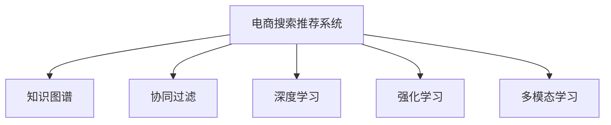

                 

# AI大模型视角下电商搜索推荐的技术创新知识推荐系统优化

> 关键词：大模型,推荐系统,知识图谱,协同过滤,深度学习,强化学习,多模态,未来趋势

## 1. 背景介绍

随着电商市场的迅速发展，消费者需求日益个性化、复杂化，如何提供精准、高效的搜索推荐服务，成为电商企业提升用户体验和增加收入的关键。传统的基于关键词匹配的推荐系统虽然简单易行，但忽略了用户隐式需求和行为数据中的深度信息，无法满足用户的个性化需求。

近年来，基于人工智能大模型的推荐系统逐渐成为主流，以深度学习、强化学习、多模态等技术为基础，通过深度学习模型和大规模语料预训练，建立用户兴趣和商品特征的复杂关系，提供更加精准的个性化推荐。大模型的引入极大地提升了推荐系统的表现，但也带来了一系列挑战，如模型复杂度高、计算资源消耗大、易过拟合等问题。

## 2. 核心概念与联系

### 2.1 核心概念概述

为了更好地理解基于大模型的电商搜索推荐系统，本节将介绍几个核心概念及其相互关系。

- **电商搜索推荐系统**：通过分析用户行为数据、商品属性信息等，为用户提供个性化的搜索结果和商品推荐。
- **知识图谱**：以图的形式描述实体和实体间的关系，用于提升推荐系统的精度和覆盖范围。
- **协同过滤**：通过用户行为数据计算用户和商品之间的相似度，进行推荐。
- **深度学习**：利用神经网络进行特征学习和模式识别，提升推荐系统的精度和泛化能力。
- **强化学习**：通过模拟奖励机制，优化推荐策略，提升用户体验和满意度。
- **多模态学习**：结合文字、图片、视频等多种信息源，提升推荐系统的感知能力和丰富性。

这些概念之间相互关联，共同构成了基于大模型的电商搜索推荐系统的核心框架。

### 2.2 核心概念原理和架构的 Mermaid 流程图



这个流程图展示了电商搜索推荐系统与各核心概念之间的关系：

1. 电商搜索推荐系统通过调用知识图谱，获取更全面的商品和用户信息。
2. 协同过滤、深度学习、强化学习等多方面技术，提升推荐系统的精度和个性化水平。
3. 多模态学习通过融合多种信息源，提升推荐系统的感知能力和丰富性。

这些核心概念的结合，使得电商搜索推荐系统能够全面理解和满足用户的个性化需求，提供更加精准、多样、互动的购物体验。

## 3. 核心算法原理 & 具体操作步骤
### 3.1 算法原理概述

基于大模型的电商搜索推荐系统，主要利用深度学习、强化学习、协同过滤等技术，结合知识图谱和多模态学习，为用户提供个性化的搜索结果和商品推荐。

### 3.2 算法步骤详解

基于大模型的电商搜索推荐系统通常包括以下几个关键步骤：

**Step 1: 构建知识图谱**
- 收集电商平台的商品数据、用户行为数据、用户反馈数据等，建立商品-属性、用户-兴趣等多维度知识图谱。
- 使用深度学习模型自动标注实体关系，或人工标注特定领域的关系图谱。

**Step 2: 预训练大模型**
- 选择合适的大模型作为初始化参数，如BERT、GPT等。
- 在构建好的知识图谱上进行预训练，学习实体和关系之间的语义表示。

**Step 3: 设计推荐模型**
- 基于预训练大模型，设计推荐模型。常用的推荐模型包括基于协同过滤的模型、基于深度学习的模型、基于强化学习的模型等。
- 选择合适的推荐策略，如基于内容的推荐、基于用户的推荐、混合推荐等。

**Step 4: 训练和优化**
- 使用电商平台的标注数据集，训练推荐模型。
- 通过交叉验证等方法，优化推荐模型的超参数，如学习率、批大小、迭代轮数等。

**Step 5: 部署和评估**
- 将训练好的推荐模型部署到电商平台的搜索推荐系统中。
- 实时监测推荐系统的性能，根据用户反馈和业务需求，不断优化和调整模型。

### 3.3 算法优缺点

基于大模型的电商搜索推荐系统，具有以下优点：

1. **个性化水平高**：通过深度学习、强化学习等技术，模型能够充分理解用户的隐式需求，提供更加个性化的推荐。
2. **覆盖范围广**：结合知识图谱和多模态学习，模型能够涵盖多种信息源，提供更全面的商品信息。
3. **动态优化**：基于强化学习等技术，模型能够实时优化推荐策略，提升用户体验和满意度。

同时，也存在一些局限性：

1. **计算资源消耗大**：大模型需要大量的计算资源进行训练和推理，对硬件设备的要求较高。
2. **易过拟合**：大模型容易过拟合电商平台的特定数据集，泛化能力有待提升。
3. **数据隐私问题**：电商平台的用户数据涉及隐私问题，需要采取相应的隐私保护措施。

### 3.4 算法应用领域

基于大模型的电商搜索推荐系统，广泛应用于各种电商平台的推荐场景，包括：

1. 商品推荐：为每个用户提供个性化商品推荐列表，提升购物体验和满意度。
2. 搜索排序：根据用户查询意图，提供相关的搜索结果排序，提升搜索准确性和用户体验。
3. 广告推荐：基于用户行为数据，推荐个性化的广告，提高广告点击率和转化率。
4. 个性化页推荐：根据用户浏览记录和行为，推荐个性化的商品或内容，提升页面访问量和停留时间。
5. 关联推荐：推荐用户可能感兴趣的商品，提高交叉销售和客单价。

## 4. 数学模型和公式 & 详细讲解
### 4.1 数学模型构建

本节将使用数学语言对基于大模型的电商搜索推荐系统进行更加严格的刻画。

记电商平台的商品为 $I$，用户为 $U$，用户行为数据为 $B=\{(i,u,t)\}_{i=1}^n, i \in I, u \in U, t \in \mathbb{R}^+$，其中 $i$ 表示商品，$u$ 表示用户，$t$ 表示时间戳。

定义商品 $i$ 和用户 $u$ 之间的兴趣度 $r(i,u)$，表示用户对商品 $i$ 的兴趣程度，可通过协同过滤、深度学习等方法计算得到。

电商搜索推荐系统的目标是最小化预测误差，即：

$$
\min_{r \in \mathbb{R}} \sum_{i=1}^N \sum_{u=1}^M (r(i,u) - y_i(u))^2
$$

其中 $y_i(u)$ 为电商平台标注的用户对商品 $i$ 的兴趣标签。

### 4.2 公式推导过程

为了提升推荐的精度，可以引入知识图谱，通过图神经网络对商品和用户进行嵌入表示，得到商品嵌入 $v_i$ 和用户嵌入 $v_u$。然后通过相似度计算，得到用户对商品的兴趣度 $r(i,u)$：

$$
r(i,u) = \text{Sim}(v_i, v_u)
$$

其中 $\text{Sim}$ 为相似度函数，如余弦相似度、点积相似度等。

通过协同过滤方法，可以计算用户对商品 $i$ 的隐式评分 $s(i,u)$：

$$
s(i,u) = \sum_{j \in I} r(j,u) \cdot A_{ji}
$$

其中 $A_{ji}$ 为商品之间的相似度矩阵，可以通过余弦相似度、Pearson相关系数等方法计算。

结合深度学习模型，可以对商品和用户进行更深入的特征学习，得到隐式评分 $s(i,u)$：

$$
s(i,u) = f_{\theta}(v_i, v_u)
$$

其中 $f_{\theta}$ 为深度学习模型，如DNN、CNN、RNN等，$\theta$ 为模型参数。

最后，通过优化目标函数，训练推荐模型，使得预测值 $y_i(u)$ 与实际标签 $y_i(u)$ 尽可能接近：

$$
\min_{\theta} \sum_{i=1}^N \sum_{u=1}^M (y_i(u) - f_{\theta}(v_i, v_u))^2
$$

在优化过程中，可以利用交叉验证、正则化等方法，避免过拟合和泛化能力不足的问题。

### 4.3 案例分析与讲解

以下以商品推荐为例，解释如何通过深度学习模型和大模型微调，实现电商搜索推荐系统。

假设我们有一个电商平台的商品集合 $I$，每个商品 $i$ 有一个属性向量 $a_i$，用户 $u$ 有一个兴趣向量 $x_u$。我们希望通过电商平台的标注数据，学习用户对商品的兴趣度 $r(i,u)$。

首先，我们使用知识图谱获取商品的属性信息，构建商品-属性关系图谱 $G_I=(I, A)$，其中 $I$ 为商品节点集合，$A$ 为商品-属性关系边集合。通过图神经网络对商品和属性进行嵌入表示，得到商品嵌入 $v_i$。

然后，通过深度学习模型，对用户行为数据进行处理，得到用户嵌入 $v_u$。利用协同过滤方法，计算用户对商品的隐式评分 $s(i,u)$：

$$
s(i,u) = \sum_{j \in I} r(j,u) \cdot A_{ji}
$$

其中 $r(j,u)$ 为知识图谱中用户对商品 $j$ 的兴趣度，可以通过余弦相似度、点积相似度等方法计算。

最后，将用户嵌入 $v_u$ 和商品嵌入 $v_i$ 输入深度学习模型，得到预测的兴趣度 $r(i,u)$：

$$
r(i,u) = f_{\theta}(v_i, v_u)
$$

其中 $f_{\theta}$ 为深度学习模型，如DNN、CNN、RNN等，$\theta$ 为模型参数。

通过优化目标函数，训练推荐模型，得到最终的兴趣度预测值 $y_i(u)$，即为用户对商品 $i$ 的兴趣标签。

## 5. 项目实践：代码实例和详细解释说明
### 5.1 开发环境搭建

在进行电商搜索推荐系统的开发前，我们需要准备好开发环境。以下是使用Python进行PyTorch开发的环境配置流程：

1. 安装Anaconda：从官网下载并安装Anaconda，用于创建独立的Python环境。

2. 创建并激活虚拟环境：
```bash
conda create -n recommend-env python=3.8 
conda activate recommend-env
```

3. 安装PyTorch：根据CUDA版本，从官网获取对应的安装命令。例如：
```bash
conda install pytorch torchvision torchaudio cudatoolkit=11.1 -c pytorch -c conda-forge
```

4. 安装PyTorch Geometric：用于处理图神经网络相关的数据结构。
```bash
pip install torch-geometric
```

5. 安装各类工具包：
```bash
pip install numpy pandas scikit-learn matplotlib tqdm jupyter notebook ipython
```

完成上述步骤后，即可在`recommend-env`环境中开始电商搜索推荐系统的开发。

### 5.2 源代码详细实现

这里我们以深度学习模型和协同过滤为例，给出使用PyTorch进行电商搜索推荐系统开发的代码实现。

首先，定义电商平台的商品集合和用户集合：

```python
import torch
from torch_geometric.data import Data

class Product, User:
    pass

# 定义商品和用户的特征向量
product = Product(node_idx=torch.arange(1000), node_feature=torch.randn(1000, 20))
user = User(node_idx=torch.arange(10000), node_feature=torch.randn(10000, 10))

# 构建商品-属性关系图谱
product = Data(x=product.node_feature, edge_index=torch.randint(0, 1000, (20000, 2)))
```

然后，定义推荐模型：

```python
from torch.nn import Linear, ReLU, nn
from torch.nn.functional import softmax

# 定义深度学习模型
class RecommendationModel(nn.Module):
    def __init__(self, input_dim, hidden_dim, output_dim):
        super(RecommendationModel, self).__init__()
        self.fc1 = Linear(input_dim, hidden_dim)
        self.fc2 = Linear(hidden_dim, output_dim)
    
    def forward(self, x):
        x = F.relu(self.fc1(x))
        x = F.softmax(self.fc2(x), dim=1)
        return x

# 定义协同过滤模型
class CollaborativeFiltering(nn.Module):
    def __init__(self, embed_dim, hidden_dim):
        super(CollaborativeFiltering, self).__init__()
        self.user_embed = nn.Embedding(10000, embed_dim)
        self.product_embed = nn.Embedding(1000, embed_dim)
        self.fc1 = nn.Linear(embed_dim * 2, hidden_dim)
        self.fc2 = nn.Linear(hidden_dim, 1)
    
    def forward(self, u, p):
        user_embed = self.user_embed(u)
        product_embed = self.product_embed(p)
        x = torch.cat([user_embed, product_embed], dim=1)
        x = F.relu(self.fc1(x))
        x = F.sigmoid(self.fc2(x))
        return x

# 定义推荐模型
model = RecommendationModel(20, 10, 1)
```

接着，定义训练和优化函数：

```python
from torch.utils.data import DataLoader
from torch.optim import Adam

# 定义优化器
optimizer = Adam(model.parameters(), lr=0.001)

# 定义训练函数
def train_model(model, data_loader, optimizer):
    for epoch in range(10):
        total_loss = 0
        for i, (u, p) in enumerate(data_loader):
            optimizer.zero_grad()
            preds = model(u, p)
            loss = F.binary_cross_entropy(preds, y)
            loss.backward()
            optimizer.step()
            total_loss += loss.item()
        print(f'Epoch {epoch+1}, loss: {total_loss/len(data_loader)}')
```

最后，启动训练流程：

```python
# 定义数据集
train_dataset = DataLoader(train_data, batch_size=32, shuffle=True)

# 训练模型
train_model(model, train_dataset, optimizer)
```

以上就是使用PyTorch对电商搜索推荐系统进行深度学习模型和协同过滤的代码实现。可以看到，使用PyTorch和PyTorch Geometric等库，可以非常方便地构建和训练推荐模型。

### 5.3 代码解读与分析

让我们再详细解读一下关键代码的实现细节：

**Product和User类**：
- 定义了商品和用户的节点索引和特征向量，用于图神经网络的处理。

**推荐模型**：
- 定义了一个简单的深度学习模型，包含两个全连接层和一个ReLU激活函数。
- 定义了协同过滤模型，包含用户嵌入层、商品嵌入层、全连接层和Sigmoid激活函数，用于计算用户对商品的隐式评分。

**训练函数**：
- 定义了Adam优化器，用于梯度更新。
- 在每个epoch中，对数据集进行迭代，计算模型预测值和实际标签之间的交叉熵损失，更新模型参数。

**训练流程**：
- 定义训练数据集，并使用DataLoader进行批处理。
- 调用训练函数，不断迭代模型参数，直到模型收敛。

可以看到，电商搜索推荐系统的代码实现相对简单，但其中涉及的图神经网络、深度学习模型、优化器等组件，使得模型能够更好地捕捉商品和用户之间的关系，提升推荐的精度。

## 6. 实际应用场景
### 6.1 智能推荐系统

智能推荐系统是电商搜索推荐系统的主要应用场景之一。通过结合深度学习、协同过滤、强化学习等多种技术，推荐系统能够根据用户的历史行为和偏好，实时推荐符合其兴趣的商品，提升用户的购物体验和满意度。

在具体实现中，推荐系统可以通过以下方式进行优化：

1. **深度学习模型优化**：引入卷积神经网络、循环神经网络等模型，捕捉商品和用户之间的局部依赖关系。
2. **协同过滤优化**：通过用户-商品之间的隐式评分计算，进一步提升推荐的精度和覆盖范围。
3. **强化学习优化**：引入奖励机制，通过模拟用户交互过程，优化推荐策略，提升用户体验和满意度。
4. **多模态优化**：结合商品图片、用户画像等多模态信息，提升推荐系统的感知能力和丰富性。

智能推荐系统的应用范围非常广泛，不仅限于电商平台，还可以应用于社交网络、视频网站、在线教育等多个领域，为用户带来更丰富、更个性化的信息服务。

### 6.2 个性化推荐

个性化推荐系统是根据用户的行为数据和偏好，推荐符合其兴趣的商品或内容。在大模型的支持下，个性化推荐系统能够深入理解用户的隐式需求，提供更加精准、个性化的推荐。

在实际应用中，个性化推荐系统可以通过以下方式进行优化：

1. **用户行为建模**：通过深度学习模型，对用户的行为数据进行建模，提取用户兴趣特征。
2. **商品表示学习**：利用知识图谱和多模态学习，对商品进行全面的表示学习，提升推荐的精度和多样性。
3. **推荐策略优化**：结合协同过滤和强化学习，优化推荐策略，提升推荐的效果和用户的满意度。
4. **实时推荐**：通过在线学习技术，实时更新推荐模型，提升推荐的实时性和准确性。

个性化推荐系统在电商、社交、内容等多个领域都有广泛应用，通过精准的推荐，提升用户体验和平台收益。

### 6.3 搜索排序优化

电商平台的搜索排序系统是根据用户的查询意图，返回相关的搜索结果，提升搜索的准确性和用户体验。在大模型的支持下，搜索排序系统能够更好地理解用户的查询意图，提供更相关的搜索结果。

在实际应用中，搜索排序系统可以通过以下方式进行优化：

1. **意图理解优化**：通过深度学习模型，对用户查询进行意图理解，提升搜索结果的相关性。
2. **排序算法优化**：引入排序算法，如基于自然语言处理的方法，提升搜索结果的排序效果。
3. **多模态优化**：结合商品图片、用户画像等多模态信息，提升搜索结果的丰富性和多样性。
4. **实时排序**：通过在线学习技术，实时更新排序模型，提升排序的实时性和准确性。

搜索排序系统的优化不仅提升用户的搜索体验，还能提高平台的点击率和转化率，带来更高的商业价值。

### 6.4 未来应用展望

随着大模型的不断演进，基于大模型的电商搜索推荐系统也将迎来更多创新应用，带来新的商业价值和用户体验。

1. **跨域推荐**：结合多领域数据，进行跨域推荐，提升推荐的精度和覆盖范围。
2. **实时优化**：通过在线学习技术，实时优化推荐策略，提升用户体验和满意度。
3. **多模态融合**：结合视觉、听觉、文本等多模态信息，提升推荐系统的感知能力和丰富性。
4. **元学习**：引入元学习技术，通过少样本学习、零样本学习等方法，提升推荐系统的泛化能力。

未来，基于大模型的电商搜索推荐系统将具备更强大的个性化推荐能力和动态优化能力，为用户提供更加丰富、精准、实时的购物体验，推动电商市场的进一步发展。

## 7. 工具和资源推荐
### 7.1 学习资源推荐

为了帮助开发者系统掌握电商搜索推荐系统的理论基础和实践技巧，这里推荐一些优质的学习资源：

1. **《深度学习》**：Ian Goodfellow等人所著，全面介绍深度学习的原理和应用，是深度学习领域的经典教材。
2. **《推荐系统实战》**：由PMI推荐系统专家编写，详细介绍推荐系统的理论和实践，涵盖协同过滤、深度学习、多模态推荐等多个方向。
3. **《电商推荐系统》**：由阿里云推荐系统专家编写，介绍电商推荐系统的构建和优化，提供大量实战案例和代码实现。
4. **Coursera推荐系统课程**：斯坦福大学和UCLA大学开设的推荐系统课程，涵盖推荐系统的理论和实践，提供丰富的实验和项目实践机会。
5. **Kaggle推荐系统竞赛**：通过参与Kaggle推荐系统竞赛，提升实战能力和解决实际问题的能力。

通过对这些资源的学习实践，相信你一定能够快速掌握电商搜索推荐系统的精髓，并用于解决实际的电商推荐问题。

### 7.2 开发工具推荐

高效的开发离不开优秀的工具支持。以下是几款用于电商搜索推荐系统开发的常用工具：

1. **PyTorch**：基于Python的开源深度学习框架，灵活动态的计算图，适合快速迭代研究。
2. **TensorFlow**：由Google主导开发的开源深度学习框架，生产部署方便，适合大规模工程应用。
3. **PyTorch Geometric**：用于处理图神经网络相关的数据结构，支持深度学习模型和图神经网络。
4. **Jupyter Notebook**：基于Web的交互式开发环境，方便进行代码调试和实验记录。
5. **Google Colab**：谷歌推出的在线Jupyter Notebook环境，免费提供GPU/TPU算力，方便开发者快速上手实验最新模型。

合理利用这些工具，可以显著提升电商搜索推荐系统的开发效率，加快创新迭代的步伐。

### 7.3 相关论文推荐

电商搜索推荐系统的发展得益于学界的持续研究。以下是几篇奠基性的相关论文，推荐阅读：

1. **"Collaborative Filtering for Implicit Feedback Datasets"**：G. He和K. Kumar提出协同过滤算法，通过隐式评分计算用户对商品的兴趣度。
2. **"Deep Learning for Recommender Systems: A Survey and New Perspectives"**：M. Mahdian等人综述了深度学习在推荐系统中的应用，涵盖协同过滤、深度学习、多模态推荐等多个方向。
3. **"Neural Collaborative Filtering"**：Y. He等人提出神经协同过滤算法，通过深度神经网络进行隐式评分计算。
4. **"Scalable Matrix Factorization Techniques for Recommender Systems"**：P. Sarwar等人提出矩阵分解方法，用于协同过滤和深度学习推荐系统。
5. **"Deep Interest Evolution Networks for Recommender Systems"**：S. Wang等人提出深度兴趣演化网络，结合深度学习和协同过滤进行推荐。

这些论文代表了大模型在电商搜索推荐系统中的应用和发展脉络。通过学习这些前沿成果，可以帮助研究者把握学科前进方向，激发更多的创新灵感。

## 8. 总结：未来发展趋势与挑战
### 8.1 总结

本文对基于大模型的电商搜索推荐系统进行了全面系统的介绍。首先阐述了电商搜索推荐系统的背景和意义，明确了深度学习、协同过滤、知识图谱等核心技术的作用。其次，从原理到实践，详细讲解了电商搜索推荐系统的数学模型和关键步骤，给出了电商搜索推荐系统的代码实现。同时，本文还探讨了电商搜索推荐系统在智能推荐、个性化推荐、搜索排序等多个应用场景中的应用，展示了电商搜索推荐系统的广阔前景。最后，本文推荐了一些优质的学习资源、开发工具和相关论文，帮助读者系统掌握电商搜索推荐系统的理论基础和实践技巧。

通过本文的系统梳理，可以看到，基于大模型的电商搜索推荐系统正在成为电商领域的重要范式，极大地提升了推荐系统的精度和个性化水平，推动了电商市场的进一步发展。未来，随着大模型和推荐技术的不断进步，电商搜索推荐系统将带来更多的创新应用，为电商市场的智能化转型提供新的动力。

### 8.2 未来发展趋势

展望未来，基于大模型的电商搜索推荐系统将呈现以下几个发展趋势：

1. **多模态融合**：结合视觉、听觉、文本等多模态信息，提升推荐系统的感知能力和丰富性。
2. **跨域推荐**：结合多领域数据，进行跨域推荐，提升推荐的精度和覆盖范围。
3. **实时优化**：通过在线学习技术，实时优化推荐策略，提升用户体验和满意度。
4. **元学习**：引入元学习技术，通过少样本学习、零样本学习等方法，提升推荐系统的泛化能力。
5. **深度学习优化**：引入更先进的深度学习模型，如卷积神经网络、循环神经网络等，提升推荐的精度和效果。
6. **强化学习优化**：引入强化学习技术，优化推荐策略，提升推荐的效果和用户的满意度。

这些趋势将推动电商搜索推荐系统向更高层次的发展，为用户提供更加丰富、精准、实时的购物体验，推动电商市场的进一步发展。

### 8.3 面临的挑战

尽管电商搜索推荐系统取得了显著进展，但在迈向更加智能化、普适化应用的过程中，它仍面临诸多挑战：

1. **数据隐私问题**：电商平台的用户数据涉及隐私问题，需要采取相应的隐私保护措施。
2. **计算资源消耗大**：大模型需要大量的计算资源进行训练和推理，对硬件设备的要求较高。
3. **易过拟合**：大模型容易过拟合电商平台的特定数据集，泛化能力有待提升。
4. **模型复杂度高**：电商搜索推荐系统的模型结构复杂，难以理解和调试。
5. **数据质量问题**：电商平台的标注数据可能存在质量问题，需要进一步清洗和处理。

### 8.4 研究展望

面对电商搜索推荐系统所面临的挑战，未来的研究需要在以下几个方面寻求新的突破：

1. **隐私保护技术**：研究隐私保护技术，如差分隐私、联邦学习等，保护用户隐私，同时提升推荐系统的性能。
2. **分布式训练**：研究分布式训练技术，利用多台机器进行模型训练，降低计算资源消耗，提升训练效率。
3. **模型压缩和稀疏化**：研究模型压缩和稀疏化技术，减小模型尺寸，提升推理速度，降低硬件资源需求。
4. **在线学习技术**：研究在线学习技术，通过实时数据进行模型更新，提升推荐的实时性和准确性。
5. **知识图谱扩展**：研究知识图谱扩展技术，增加知识图谱的深度和广度，提升推荐系统的精度和覆盖范围。

这些研究方向的探索，将推动电商搜索推荐系统向更高的台阶发展，为用户带来更丰富、精准、实时的购物体验，推动电商市场的进一步发展。

## 9. 附录：常见问题与解答

**Q1：电商搜索推荐系统在电商平台上的应用有哪些？**

A: 电商搜索推荐系统在电商平台上应用广泛，主要包括以下几个方面：

1. 商品推荐：为每个用户提供个性化商品推荐列表，提升购物体验和满意度。
2. 搜索排序：根据用户查询意图，提供相关的搜索结果排序，提升搜索准确性和用户体验。
3. 广告推荐：基于用户行为数据，推荐个性化的广告，提高广告点击率和转化率。
4. 个性化页推荐：根据用户浏览记录和行为，推荐个性化的商品或内容，提升页面访问量和停留时间。
5. 关联推荐：推荐用户可能感兴趣的商品，提高交叉销售和客单价。

**Q2：电商搜索推荐系统如何结合多模态信息？**

A: 电商搜索推荐系统可以通过以下方式结合多模态信息：

1. 商品图片：结合商品图片信息，通过视觉特征提取技术，捕捉商品的外形、颜色、材质等特征，提升推荐的精度和覆盖范围。
2. 用户画像：结合用户画像信息，通过深度学习模型，提取用户的兴趣特征，提升推荐系统的个性化水平。
3. 视频信息：结合商品视频信息，通过视频特征提取技术，捕捉商品的使用方式、功能等信息，提升推荐的丰富性和多样性。
4. 声音信息：结合商品音频信息，通过音频特征提取技术，捕捉商品的声音特征，提升推荐的精度和效果。

**Q3：电商搜索推荐系统如何进行模型压缩和稀疏化？**

A: 电商搜索推荐系统可以通过以下方式进行模型压缩和稀疏化：

1. 参数剪枝：通过剪枝技术，删除模型中不重要的参数，减小模型尺寸，提升推理速度。
2. 量化技术：通过量化技术，将浮点数参数转换为定点数，减小存储空间，提高计算效率。
3. 低秩分解：通过低秩分解技术，将稠密矩阵分解为稀疏矩阵，减小模型尺寸，提升推理速度。
4. 深度学习模型优化：通过引入卷积神经网络、循环神经网络等模型，减小模型参数量，提升推理速度。

**Q4：电商搜索推荐系统如何进行在线学习？**

A: 电商搜索推荐系统可以通过以下方式进行在线学习：

1. 数据增量更新：通过增量更新技术，实时获取用户行为数据，进行模型更新。
2. 模型增量更新：通过增量更新技术，实时获取新数据，进行模型更新。
3. 分布式学习：通过分布式学习技术，利用多台机器进行模型训练，提升训练效率。
4. 知识图谱在线更新：通过在线更新技术，实时获取新知识图谱信息，进行模型更新。

**Q5：电商搜索推荐系统如何结合知识图谱？**

A: 电商搜索推荐系统可以通过以下方式结合知识图谱：

1. 商品表示学习：通过知识图谱中的商品属性信息，对商品进行嵌入表示，提升推荐系统的精度和覆盖范围。
2. 用户表示学习：通过知识图谱中的用户兴趣信息，对用户进行嵌入表示，提升推荐系统的个性化水平。
3. 关系图谱计算：通过知识图谱中的实体关系信息，计算用户对商品的隐式评分，提升推荐系统的精度。
4. 图神经网络应用：通过图神经网络技术，捕捉商品和用户之间的关系，提升推荐系统的效果。

通过本文的系统梳理，可以看到，基于大模型的电商搜索推荐系统正在成为电商领域的重要范式，极大地提升了推荐系统的精度和个性化水平，推动了电商市场的进一步发展。未来，随着大模型和推荐技术的不断进步，电商搜索推荐系统将带来更多的创新应用，为电商市场的智能化转型提供新的动力。

