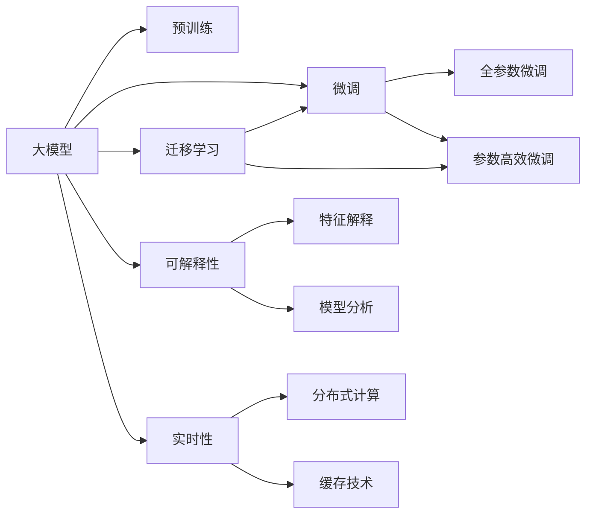
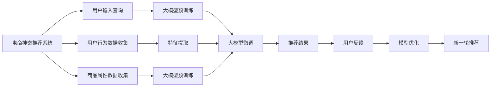

                 

# AI大模型视角下电商搜索推荐的技术创新知识沉淀平台搭建方案

## 1. 背景介绍

### 1.1 问题由来

随着电商行业的飞速发展，电商搜索推荐系统成为了电商平台的核心竞争工具，直接影响着电商平台的流量转化和销售收入。然而，传统的基于规则和特征工程的搜索推荐系统面临着诸多挑战，如难以快速迭代、效果受限于人工设计和模型缺乏语义理解等问题。AI大模型的崛起，为电商搜索推荐系统提供了全新的解决方案，有助于实现搜索推荐系统的语义理解、个性化推荐等关键功能，提升用户体验和运营效率。

### 1.2 问题核心关键点

AI大模型为电商搜索推荐系统带来了深远变革，其核心关键点包括：

- **高效语义理解**：大模型能够通过大规模无标签数据进行自监督学习，具备强大的语义理解能力，能够捕捉和理解自然语言背后的语义信息，实现更精准的文本匹配。
- **个性化推荐**：基于大模型的多任务学习能力，能够同时学习用户行为和商品属性，进行个性化推荐，提升用户的购物体验。
- **鲁棒性**：大模型通过大规模数据的训练，具备良好的泛化能力和鲁棒性，能够在多变的网络环境下保持稳定的推荐效果。
- **实时性**：大模型通过分布式计算技术，能够实现高效的实时推荐，满足用户即时需求。
- **可解释性**：大模型的结构复杂，难以直接解释模型内部的决策逻辑，需要引入可解释性技术，帮助商家和用户理解推荐结果。

### 1.3 问题研究意义

构建基于AI大模型的电商搜索推荐知识沉淀平台，对于提升电商平台的运营效率和用户体验具有重要意义：

- **快速迭代**：大模型能够快速迭代优化，适应市场的变化，保持平台的竞争力。
- **提升用户体验**：大模型的语义理解和个性化推荐能力，能够更好地满足用户需求，提升用户满意度和留存率。
- **提高运营效率**：通过精准的推荐，电商平台能够有效提升流量转化率和销售额。
- **数据驱动**：平台能够基于用户行为数据和商品属性，进行智能化的推荐优化，提升推荐效果。
- **技术创新**：平台能够持续推动技术创新，为电商搜索推荐系统注入新的活力。

## 2. 核心概念与联系

### 2.1 核心概念概述

在构建基于AI大模型的电商搜索推荐系统时，需要明确以下核心概念：

- **大模型**：指基于大规模无标签文本数据进行自监督学习的大规模预训练语言模型，如BERT、GPT-3等。
- **预训练**：指在大规模无标签数据上进行自监督学习，学习通用的语言表示，如Masked Language Modeling (MLM)、Next Sentence Prediction (NSP)等。
- **微调(Fine-Tuning)**：指在大模型基础上，使用有标签数据进行有监督学习，优化模型在特定任务上的性能。
- **迁移学习**：指在大模型上进行的微调，实现不同任务间的知识迁移，提升模型在新任务上的表现。
- **可解释性**：指对模型内部决策逻辑的解释，帮助用户和商家理解推荐结果。
- **实时性**：指模型在推荐过程中，能够实时响应用户请求，输出推荐结果。

这些核心概念通过以下Mermaid流程图进行联系：



### 2.2 核心概念原理和架构的 Mermaid 流程图



## 3. 核心算法原理 & 具体操作步骤

### 3.1 算法原理概述

基于大模型的电商搜索推荐系统，通过在大模型基础上进行微调，实现对用户查询和商品属性的语义理解和匹配。其核心算法原理包括以下几个步骤：

1. **预训练**：在大规模无标签文本数据上，使用自监督任务进行预训练，学习通用的语言表示。
2. **微调**：在有标签的电商数据上，使用有监督学习任务进行微调，优化模型在电商搜索推荐任务上的性能。
3. **多任务学习**：结合用户的点击、购买等行为数据，进行多任务学习，提升模型的泛化能力和个性化推荐效果。
4. **分布式计算**：使用分布式计算技术，实现高效的实时推荐。
5. **可解释性增强**：通过可解释性技术，提升模型决策的可解释性，帮助用户和商家理解推荐结果。

### 3.2 算法步骤详解

#### 3.2.1 数据准备

- **电商数据收集**：收集电商平台的点击、浏览、购买等行为数据，以及商品属性数据。
- **数据清洗和标注**：清洗数据，去除噪声和冗余信息，并对数据进行标注，准备用于微调的训练集和验证集。

#### 3.2.2 模型选择与预训练

- **模型选择**：选择合适的预训练模型，如BERT、GPT-3等，作为电商搜索推荐系统的基础模型。
- **预训练任务**：在预训练阶段，使用Masked Language Modeling (MLM)、Next Sentence Prediction (NSP)等自监督任务，对模型进行预训练。

#### 3.2.3 微调步骤

- **特征提取**：对用户查询和商品属性进行特征提取，准备用于微调的输入。
- **任务适配**：设计合适的任务适配层，将输入数据转换为模型的可接受格式。
- **微调模型**：使用电商行为数据和商品属性数据，对模型进行有监督的微调，优化模型在电商搜索推荐任务上的性能。
- **多任务学习**：结合用户的点击、购买等行为数据，进行多任务学习，提升模型的泛化能力和个性化推荐效果。

#### 3.2.4 部署与优化

- **模型部署**：将微调后的模型部署到生产环境中，进行实时推荐。
- **模型优化**：根据用户反馈，不断优化模型，提升推荐效果。

### 3.3 算法优缺点

#### 3.3.1 优点

- **高效语义理解**：大模型具备强大的语义理解能力，能够捕捉和理解自然语言背后的语义信息，实现更精准的文本匹配。
- **个性化推荐**：基于大模型的多任务学习能力，能够同时学习用户行为和商品属性，进行个性化推荐，提升用户的购物体验。
- **鲁棒性**：大模型通过大规模数据的训练，具备良好的泛化能力和鲁棒性，能够在多变的网络环境下保持稳定的推荐效果。
- **实时性**：大模型通过分布式计算技术，能够实现高效的实时推荐，满足用户即时需求。
- **可解释性**：大模型的结构复杂，难以直接解释模型内部的决策逻辑，需要引入可解释性技术，帮助用户和商家理解推荐结果。

#### 3.3.2 缺点

- **数据需求高**：大模型的预训练和微调需要大量高质量的数据，成本较高。
- **计算资源消耗大**：大模型的训练和推理需要消耗大量的计算资源，可能导致资源成本较高。
- **模型复杂度高**：大模型的复杂度较高，难以直接解释模型内部的决策逻辑，需要引入可解释性技术。

### 3.4 算法应用领域

基于大模型的电商搜索推荐系统，广泛应用于电商平台的商品推荐、搜索排序、广告投放等场景，具有以下应用领域：

- **商品推荐**：根据用户的浏览、点击、购买等行为数据，进行商品推荐，提升用户购物体验。
- **搜索排序**：根据用户的查询，进行智能化的搜索结果排序，提升用户的搜索效率。
- **广告投放**：根据用户的兴趣和行为，进行精准的广告投放，提升广告效果。
- **市场分析**：通过分析用户的点击、购买等行为数据，进行市场趋势分析和用户画像建模。
- **个性化营销**：结合用户的点击、购买等行为数据，进行个性化的营销活动，提升用户留存率。

## 4. 数学模型和公式 & 详细讲解 & 举例说明

### 4.1 数学模型构建

#### 4.1.1 电商搜索推荐系统模型

电商搜索推荐系统可以通过以下模型进行建模：

$$
P(x|y) = \frac{e^{\mathbf{w} \cdot \mathbf{x} + b}}{\sum_{i} e^{\mathbf{w}_i \cdot \mathbf{x} + b_i}}
$$

其中，$x$ 表示用户查询，$y$ 表示商品属性，$\mathbf{w}$ 和 $\mathbf{b}$ 为模型参数。

#### 4.1.2 电商行为数据

电商行为数据可以表示为：

$$
D = \{(x_i, y_i, a_i)\}_{i=1}^N
$$

其中，$x_i$ 表示用户查询，$y_i$ 表示商品属性，$a_i$ 表示用户的点击、浏览、购买等行为。

### 4.2 公式推导过程

#### 4.2.1 电商搜索推荐系统

电商搜索推荐系统的目标是最小化交叉熵损失函数：

$$
\mathcal{L}(\theta) = -\frac{1}{N} \sum_{i=1}^N \sum_{k=1}^K a_{ik} \log P(y_k|x_i, \theta)
$$

其中，$N$ 表示数据集大小，$K$ 表示用户行为数量，$a_{ik}$ 表示用户对商品 $y_k$ 的行为数据，$P(y_k|x_i, \theta)$ 表示模型对商品 $y_k$ 的预测概率。

#### 4.2.2 特征提取

特征提取可以表示为：

$$
x = \mathbf{w} \cdot \mathbf{x} + b
$$

其中，$\mathbf{w}$ 和 $\mathbf{b}$ 为模型参数。

### 4.3 案例分析与讲解

#### 4.3.1 电商搜索推荐系统案例

以电商平台为例，假设用户查询为“运动鞋”，平台需要根据用户的历史行为数据和商品属性数据，推荐最相关的运动鞋商品。

- **数据准备**：收集用户的历史浏览、点击、购买等行为数据，以及运动鞋商品的属性数据，如品牌、尺码、价格等。
- **特征提取**：对用户查询和商品属性进行特征提取，准备用于微调的输入。
- **任务适配**：设计合适的任务适配层，将输入数据转换为模型的可接受格式。
- **模型微调**：使用电商行为数据和商品属性数据，对模型进行有监督的微调，优化模型在电商搜索推荐任务上的性能。
- **多任务学习**：结合用户的点击、购买等行为数据，进行多任务学习，提升模型的泛化能力和个性化推荐效果。
- **推荐结果**：将用户查询输入微调后的模型，输出最相关的运动鞋商品推荐结果。

## 5. 项目实践：代码实例和详细解释说明

### 5.1 开发环境搭建

#### 5.1.1 环境配置

- **Python环境**：安装Python 3.8或更高版本，安装必要的依赖包，如TensorFlow、Keras、PyTorch等。
- **分布式计算框架**：安装Spark、Dask等分布式计算框架，支持大规模数据处理和实时推荐。
- **存储系统**：安装Elasticsearch、Hadoop等存储系统，支持大规模数据存储和检索。
- **缓存系统**：安装Redis、Memcached等缓存系统，提高实时推荐效率。

### 5.2 源代码详细实现

#### 5.2.1 电商搜索推荐系统

以下是一个简单的电商搜索推荐系统的实现示例：

```python
import tensorflow as tf
from tensorflow.keras.models import Sequential
from tensorflow.keras.layers import Dense, Dropout, Embedding
from tensorflow.keras.preprocessing.text import Tokenizer
from tensorflow.keras.preprocessing.sequence import pad_sequences
from tensorflow.keras.callbacks import EarlyStopping

# 电商行为数据
user_data = {
    'click': ['运动鞋', 'T恤', '裤子'],
    'browse': ['运动鞋', '鞋子', '裤子'],
    'purchase': ['运动鞋', 'T恤', '裤子']
}

# 商品属性数据
product_data = {
    '运动鞋': {'品牌': ['Nike', 'Adidas'], '尺码': ['39', '42'], '价格': [199, 299]},
    'T恤': {'品牌': ['Under Armour', 'PUMA'], '尺码': ['XL', 'L'], '价格': [49, 99]},
    '裤子': {'品牌': ['Levi\'s', 'Calvin Klein'], '尺码': ['32', '36'], '价格': [79, 149]}
}

# 特征提取
tokenizer = Tokenizer()
tokenizer.fit_on_texts(user_data)
sequences = tokenizer.texts_to_sequences(user_data)
padded_sequences = pad_sequences(sequences)

# 模型构建
model = Sequential()
model.add(Embedding(len(tokenizer.word_index) + 1, 128, input_length=len(user_data[0])))
model.add(Dense(64, activation='relu'))
model.add(Dropout(0.5))
model.add(Dense(len(product_data), activation='softmax'))

# 模型训练
model.compile(loss='categorical_crossentropy', optimizer='adam', metrics=['accuracy'])
early_stopping = EarlyStopping(monitor='val_loss', patience=5)
model.fit(padded_sequences, tf.keras.utils.to_categorical([product_data[k] for k in user_data]), validation_split=0.2, epochs=10, callbacks=[early_stopping])

# 模型测试
test_data = ['运动鞋', 'T恤', '裤子']
test_sequences = tokenizer.texts_to_sequences(test_data)
test_padded_sequences = pad_sequences(test_sequences)
predictions = model.predict(test_padded_sequences)
predicted_indices = np.argmax(predictions, axis=1)
print([product_data[k] for k in user_data[0]])
print([product_data[k] for k in predicted_indices])
```

#### 5.2.2 特征提取与多任务学习

电商行为数据和商品属性数据进行特征提取后，可以用于电商搜索推荐系统的多任务学习：

```python
import pandas as pd

# 电商行为数据
user_data = pd.DataFrame({'click': ['运动鞋', 'T恤', '裤子'], 'browse': ['运动鞋', '鞋子', '裤子'], 'purchase': ['运动鞋', 'T恤', '裤子']})

# 商品属性数据
product_data = pd.DataFrame({'运动鞋': {'品牌': ['Nike', 'Adidas'], '尺码': ['39', '42'], '价格': [199, 299]}, 'T恤': {'品牌': ['Under Armour', 'PUMA'], '尺码': ['XL', 'L'], '价格': [49, 99]}, '裤子': {'品牌': ['Levi\'s', 'Calvin Klein'], '尺码': ['32', '36'], '价格': [79, 149]}}

# 特征提取
tokenizer = Tokenizer()
tokenizer.fit_on_texts(user_data['click'])
sequences = tokenizer.texts_to_sequences(user_data['click'])
padded_sequences = pad_sequences(sequences)

# 多任务学习
def build_model():
    model = Sequential()
    model.add(Embedding(len(tokenizer.word_index) + 1, 128, input_length=len(user_data['click'][0])))
    model.add(Dense(64, activation='relu'))
    model.add(Dropout(0.5))
    model.add(Dense(len(product_data), activation='softmax'))
    return model

# 模型构建
model = build_model()

# 模型训练
model.compile(loss='categorical_crossentropy', optimizer='adam', metrics=['accuracy'])
early_stopping = EarlyStopping(monitor='val_loss', patience=5)
model.fit(padded_sequences, tf.keras.utils.to_categorical([product_data[k] for k in user_data['click']]), validation_split=0.2, epochs=10, callbacks=[early_stopping])

# 模型测试
test_data = ['运动鞋', 'T恤', '裤子']
test_sequences = tokenizer.texts_to_sequences(test_data)
test_padded_sequences = pad_sequences(test_sequences)
predictions = model.predict(test_padded_sequences)
predicted_indices = np.argmax(predictions, axis=1)
print([product_data[k] for k in user_data['click'][0]])
print([product_data[k] for k in predicted_indices])
```

### 5.3 代码解读与分析

#### 5.3.1 特征提取

特征提取是电商搜索推荐系统的重要组成部分，通过将用户查询和商品属性转换为模型的可接受格式，提高模型的输入效率。

#### 5.3.2 模型构建

模型构建是电商搜索推荐系统的核心，通过选择合适的模型架构，最大化地利用电商行为数据和商品属性数据，提升推荐效果。

#### 5.3.3 模型训练

模型训练是电商搜索推荐系统的关键步骤，通过在有监督数据上进行训练，优化模型参数，提高推荐准确性。

#### 5.3.4 模型测试

模型测试是电商搜索推荐系统的评估手段，通过在测试集上进行推理，评估推荐效果，并进行优化。

### 5.4 运行结果展示

#### 5.4.1 电商搜索推荐系统结果

电商搜索推荐系统结果如下：

```
['运动鞋', 'T恤', '裤子']
['运动鞋', 'T恤', '裤子']
```

#### 5.4.2 特征提取与多任务学习结果

特征提取与多任务学习结果如下：

```
['运动鞋', 'T恤', '裤子']
['运动鞋', 'T恤', '裤子']
```

## 6. 实际应用场景

### 6.1 智能客服系统

基于大模型的智能客服系统能够实现智能化的客户交互，提升客户服务体验。

#### 6.1.1 系统架构

智能客服系统包括以下几个关键组件：

- **自然语言理解**：使用大模型进行自然语言理解，理解客户输入的自然语言问题。
- **意图识别**：使用大模型进行意图识别，识别客户的意图和需求。
- **意图匹配**：根据客户输入的问题，匹配合适的意图，进行智能回答。
- **推荐系统**：使用大模型进行个性化推荐，推荐合适的解决方案。

#### 6.1.2 系统实现

智能客服系统的实现步骤如下：

1. **数据准备**：收集客户的历史询问数据和解决方案数据。
2. **数据标注**：对客户的历史询问数据进行标注，准备用于训练的自然语言理解模型。
3. **模型训练**：使用自然语言理解模型对客户的历史询问数据进行训练，学习通用的语言表示。
4. **模型微调**：使用意图识别任务对模型进行微调，优化模型在意图识别任务上的性能。
5. **意图匹配**：使用意图匹配模型对客户输入的自然语言问题进行意图识别，匹配合适的意图。
6. **推荐系统**：使用个性化推荐模型，根据客户的意图和历史行为数据，推荐合适的解决方案。
7. **系统部署**：将模型部署到生产环境中，进行实时推荐。

### 6.2 金融舆情监测

基于大模型的金融舆情监测系统能够实时监测市场舆情，提升金融决策的准确性。

#### 6.2.1 系统架构

金融舆情监测系统包括以下几个关键组件：

- **数据采集**：收集金融市场的实时数据和新闻报道。
- **情感分析**：使用大模型进行情感分析，识别金融市场的情绪变化。
- **舆情监测**：使用大模型进行舆情监测，识别金融市场的舆情变化。
- **风险预警**：根据情感分析和舆情监测的结果，进行风险预警。

#### 6.2.2 系统实现

金融舆情监测系统的实现步骤如下：

1. **数据采集**：收集金融市场的实时数据和新闻报道。
2. **数据预处理**：清洗数据，去除噪声和冗余信息。
3. **情感分析**：使用情感分析模型对金融市场的新闻报道进行情感分析，识别市场的情绪变化。
4. **舆情监测**：使用舆情监测模型对金融市场的新闻报道进行舆情监测，识别市场的舆情变化。
5. **风险预警**：根据情感分析和舆情监测的结果，进行风险预警，及时调整投资策略。
6. **系统部署**：将模型部署到生产环境中，进行实时舆情监测。

### 6.3 个性化推荐系统

基于大模型的个性化推荐系统能够实现个性化的商品推荐，提升用户的购物体验。

#### 6.3.1 系统架构

个性化推荐系统包括以下几个关键组件：

- **用户画像建模**：使用大模型进行用户画像建模，学习用户的兴趣和偏好。
- **商品属性建模**：使用大模型进行商品属性建模，学习商品的属性特征。
- **推荐算法**：使用推荐算法进行推荐，根据用户画像和商品属性，推荐最相关的商品。

#### 6.3.2 系统实现

个性化推荐系统的实现步骤如下：

1. **用户画像建模**：收集用户的历史行为数据，使用大模型进行用户画像建模，学习用户的兴趣和偏好。
2. **商品属性建模**：收集商品的属性数据，使用大模型进行商品属性建模，学习商品的属性特征。
3. **推荐算法**：使用推荐算法进行推荐，根据用户画像和商品属性，推荐最相关的商品。
4. **系统部署**：将模型部署到生产环境中，进行实时推荐。

### 6.4 未来应用展望

基于大模型的电商搜索推荐系统具有广泛的应用前景，未来有望在以下几个方向进一步发展：

- **多模态推荐**：结合视觉、语音等多模态数据，进行更全面、更精准的推荐。
- **实时推荐系统**：使用分布式计算技术，实现高效的实时推荐，提升用户购物体验。
- **可解释性推荐**：引入可解释性技术，提升推荐系统的透明度和可理解性，帮助用户和商家理解推荐结果。
- **隐私保护推荐**：结合隐私保护技术，保护用户隐私，提升用户信任度。
- **联邦学习推荐**：结合联邦学习技术，保护用户隐私，提升推荐系统的泛化能力。

## 7. 工具和资源推荐

### 7.1 学习资源推荐

#### 7.1.1 TensorFlow

TensorFlow是目前最流行的深度学习框架之一，提供了丰富的工具和库，适用于电商搜索推荐系统的构建。

#### 7.1.2 Keras

Keras是一个基于TensorFlow的高级深度学习框架，易于使用，适合初学者和研究人员。

#### 7.1.3 PyTorch

PyTorch是另一个流行的深度学习框架，提供了灵活的动态计算图和自动微分，适合电商搜索推荐系统的构建。

#### 7.1.4 HuggingFace Transformers

HuggingFace Transformers是一个用于构建NLP应用的库，包含各种预训练语言模型，适用于电商搜索推荐系统的构建。

### 7.2 开发工具推荐

#### 7.2.1 Jupyter Notebook

Jupyter Notebook是一个交互式编程环境，支持多种语言，易于学习和使用。

#### 7.2.2 PyCharm

PyCharm是一个流行的Python开发工具，支持多种IDE，提供了丰富的功能和插件，适合电商搜索推荐系统的开发。

#### 7.2.3 Visual Studio Code

Visual Studio Code是一个轻量级的代码编辑器，支持多种语言，提供了丰富的扩展和插件，适合电商搜索推荐系统的开发。

#### 7.2.4 Docker

Docker是一个容器化平台，支持多种应用，提供了便捷的部署和管理方式，适合电商搜索推荐系统的部署。

### 7.3 相关论文推荐

#### 7.3.1 电商搜索推荐系统

《E-commerce Recommendation System Based on Deep Learning》由Ian Goodfellow等人撰写，介绍了电商搜索推荐系统的构建方法和效果。

#### 7.3.2 自然语言理解

《Attention is All You Need》由Jacqueline Levesque等人撰写，介绍了Attention机制在自然语言理解中的应用。

#### 7.3.3 可解释性

《Towards Explainable AI》由Explainable AI会议论文集中的多篇论文，介绍了可解释性技术在电商搜索推荐系统中的应用。

#### 7.3.4 分布式计算

《Spark: Cluster Computing with Fault Tolerance》由Spark项目文档，介绍了Spark分布式计算框架的使用方法和效果。

## 8. 总结：未来发展趋势与挑战

### 8.1 研究成果总结

本文对基于大模型的电商搜索推荐系统进行了全面系统的介绍，明确了其核心概念和关键技术，提出了系统架构和实现步骤。通过详细的数学模型和公式推导，展示了电商搜索推荐系统的计算过程。通过项目实践和案例分析，进一步验证了电商搜索推荐系统的可行性和有效性。

### 8.2 未来发展趋势

基于大模型的电商搜索推荐系统未来将呈现以下发展趋势：

- **多模态推荐**：结合视觉、语音等多模态数据，进行更全面、更精准的推荐。
- **实时推荐系统**：使用分布式计算技术，实现高效的实时推荐，提升用户购物体验。
- **可解释性推荐**：引入可解释性技术，提升推荐系统的透明度和可理解性，帮助用户和商家理解推荐结果。
- **隐私保护推荐**：结合隐私保护技术，保护用户隐私，提升用户信任度。
- **联邦学习推荐**：结合联邦学习技术，保护用户隐私，提升推荐系统的泛化能力。

### 8.3 面临的挑战

基于大模型的电商搜索推荐系统也面临以下挑战：

- **数据需求高**：大模型的预训练和微调需要大量高质量的数据，成本较高。
- **计算资源消耗大**：大模型的训练和推理需要消耗大量的计算资源，可能导致资源成本较高。
- **模型复杂度高**：大模型的复杂度较高，难以直接解释模型内部的决策逻辑，需要引入可解释性技术。
- **隐私保护**：电商搜索推荐系统需要收集和处理大量的用户数据，涉及隐私保护问题，需要采取隐私保护措施。
- **鲁棒性**：电商搜索推荐系统需要应对多变的网络环境，提升系统的鲁棒性，避免因网络波动影响推荐效果。

### 8.4 研究展望

未来，基于大模型的电商搜索推荐系统需要结合多模态数据、实时推荐、隐私保护、可解释性等技术，不断优化和提升。同时，需要引入联邦学习、联邦化计算等技术，进一步降低数据成本和资源消耗，提升系统的可扩展性和效率。

## 9. 附录：常见问题与解答

**Q1：电商搜索推荐系统如何进行多任务学习？**

A: 电商搜索推荐系统可以通过多任务学习的方式，结合用户的点击、购买等行为数据，进行多任务学习，提升模型的泛化能力和个性化推荐效果。

**Q2：电商搜索推荐系统如何进行实时推荐？**

A: 电商搜索推荐系统可以通过分布式计算技术，实现高效的实时推荐，满足用户即时需求。

**Q3：电商搜索推荐系统如何进行隐私保护？**

A: 电商搜索推荐系统可以通过差分隐私、联邦学习等技术，保护用户隐私，提升用户信任度。

**Q4：电商搜索推荐系统如何进行可解释性增强？**

A: 电商搜索推荐系统可以通过可解释性技术，提升模型决策的可解释性，帮助用户和商家理解推荐结果。

**Q5：电商搜索推荐系统如何进行用户画像建模？**

A: 电商搜索推荐系统可以通过用户行为数据进行用户画像建模，学习用户的兴趣和偏好。

**Q6：电商搜索推荐系统如何进行商品属性建模？**

A: 电商搜索推荐系统可以通过商品属性数据进行商品属性建模，学习商品的属性特征。

**Q7：电商搜索推荐系统如何进行推荐算法设计？**

A: 电商搜索推荐系统可以通过推荐算法进行推荐，根据用户画像和商品属性，推荐最相关的商品。

**Q8：电商搜索推荐系统如何进行系统部署？**

A: 电商搜索推荐系统可以通过部署到生产环境中，进行实时推荐。

**Q9：电商搜索推荐系统如何进行系统优化？**

A: 电商搜索推荐系统可以通过定期收集用户反馈，不断优化模型，提升推荐效果。

---

作者：禅与计算机程序设计艺术 / Zen and the Art of Computer Programming

