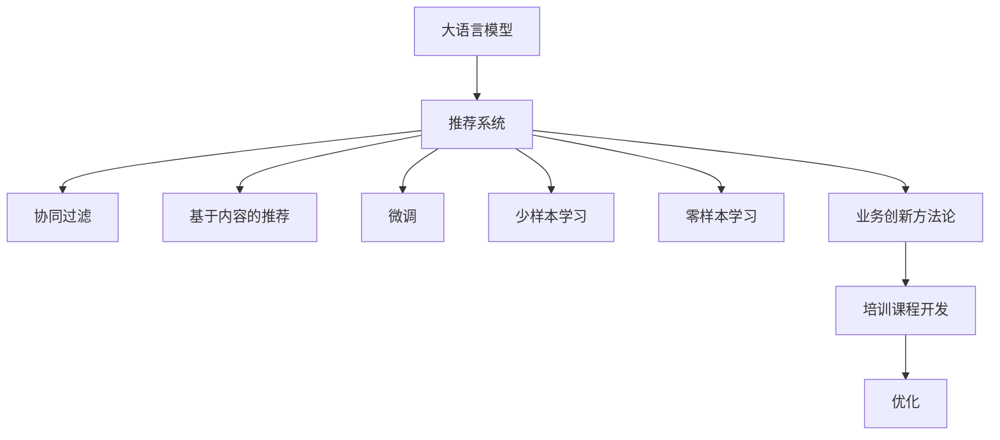

                 

# AI大模型赋能电商搜索推荐的业务创新方法论培训课程开发与优化

## 1. 背景介绍

### 1.1 问题由来

电商搜索推荐作为电商平台的核心功能之一，直接影响用户的购物体验和电商平台的转化率。传统的电商搜索推荐系统主要依赖于基于统计学习的方法，如协同过滤、基于内容的推荐等，但随着数据量的增加和用户需求的不断变化，传统的推荐方法已经难以适应。近年来，随着大语言模型的快速发展和深度学习技术的不断进步，基于大语言模型的推荐系统逐渐成为电商搜索推荐的重要技术范式。

大语言模型，如BERT、GPT-3等，通过在大量文本数据上进行预训练，学习到复杂的语言表示和语义关系。基于大语言模型的推荐系统，可以在不依赖大量标注数据的情况下，通过小样本学习、少样本学习、甚至零样本学习，实现高效、高精度的推荐。然而，由于大语言模型的复杂性和庞大参数量，其实际应用仍面临诸多挑战，如模型训练成本高、计算资源需求大、模型效果难以优化等。

因此，本文旨在介绍一种基于大语言模型赋能电商搜索推荐的业务创新方法论，并提出一种新型培训课程开发与优化方法，以期在实际应用中取得更好的效果。

### 1.2 问题核心关键点

大语言模型赋能电商搜索推荐的业务创新方法论主要包括以下几个关键点：

- **数据预处理与融合**：通过融合多种数据源，如用户行为数据、商品数据、文本数据等，形成更全面、更丰富的数据集，为模型提供更多的训练信号。
- **模型训练与优化**：利用大语言模型进行微调，在电商推荐任务上训练个性化推荐模型，并应用各种优化技术，如梯度裁剪、正则化、对抗训练等，提高模型的泛化能力和鲁棒性。
- **评估与部署**：通过多种评估指标和A/B测试等方法，验证推荐模型的效果，并在实际业务场景中实现模型的部署和优化。
- **课程开发与优化**：设计系统的培训课程，提升相关人员的业务理解和技能水平，形成业务创新的人才梯队。

## 2. 核心概念与联系

### 2.1 核心概念概述

- **大语言模型(Large Language Model, LLM)**：如BERT、GPT-3等，通过在大量文本数据上进行预训练，学习到复杂的语言表示和语义关系。
- **推荐系统(Recommendation System)**：通过算法为用户推荐感兴趣的商品或内容，提高用户体验和电商平台的转化率。
- **协同过滤(Collaborative Filtering)**：基于用户行为数据和商品相似度的推荐方法。
- **基于内容的推荐(Content-Based Recommendation)**：基于商品属性、描述等内容的推荐方法。
- **微调(Fine-Tuning)**：在大语言模型上进行特定任务的微调，以适应新的推荐任务。
- **少样本学习(Few-Shot Learning)**：在大语言模型上进行少数样本的微调，提高模型的泛化能力。
- **零样本学习(Zero-Shot Learning)**：在大语言模型上进行零样本的微调，无需额外的标注数据。
- **业务创新方法论(Business Innovation Methodology)**：结合电商搜索推荐实际业务场景，开发和优化基于大语言模型的推荐系统。
- **培训课程开发与优化(Training Course Development and Optimization)**：通过设计系统的培训课程，提升相关人员的业务理解和技能水平。

这些核心概念之间的逻辑关系可以通过以下Mermaid流程图来展示：



这个流程图展示了大语言模型在推荐系统中的应用过程，以及与业务创新方法论、培训课程开发与优化之间的联系。

## 3. 核心算法原理 & 具体操作步骤

### 3.1 算法原理概述

基于大语言模型赋能电商搜索推荐的业务创新方法论，其核心思想是通过融合多种数据源，利用大语言模型进行微调，训练出更加个性化、精准的推荐模型。该方法主要包括以下几个步骤：

1. **数据预处理与融合**：收集用户的浏览、点击、购买等行为数据，商品的描述、属性、标签等文本数据，以及评论、评分等文本数据，并将这些数据进行清洗和融合。
2. **模型训练与优化**：在融合后的数据集上，利用大语言模型进行微调，训练出推荐模型，并应用各种优化技术，如梯度裁剪、正则化、对抗训练等，提高模型的泛化能力和鲁棒性。
3. **评估与部署**：通过多种评估指标和A/B测试等方法，验证推荐模型的效果，并在实际业务场景中实现模型的部署和优化。

### 3.2 算法步骤详解

**Step 1: 数据预处理与融合**

- **数据收集**：从电商平台的日志、用户评论、商品信息等多个渠道收集数据。
- **数据清洗**：对数据进行去重、去噪、缺失值处理等操作，确保数据质量。
- **数据融合**：将不同来源的数据进行融合，形成更全面、更丰富的数据集。
  - 示例代码：

```python
import pandas as pd
import numpy as np

# 读取数据
data1 = pd.read_csv('data1.csv')
data2 = pd.read_csv('data2.csv')

# 数据清洗
data1 = data1.dropna()
data2 = data2.dropna()

# 数据融合
merged_data = pd.concat([data1, data2], axis=0)
merged_data = merged_data.drop_duplicates()
```

**Step 2: 模型训练与优化**

- **模型选择**：选择合适的大语言模型进行微调，如BERT、GPT-3等。
- **微调设置**：设置微调的超参数，如学习率、批大小、迭代轮数等。
- **模型训练**：利用微调后的模型进行电商推荐任务训练，应用各种优化技术，如梯度裁剪、正则化、对抗训练等。
  - 示例代码：

```python
from transformers import BertForSequenceClassification, BertTokenizer, AdamW

# 初始化模型和分词器
model = BertForSequenceClassification.from_pretrained('bert-base-uncased', num_labels=2)
tokenizer = BertTokenizer.from_pretrained('bert-base-uncased')

# 定义损失函数和优化器
loss_fn = nn.CrossEntropyLoss()
optimizer = AdamW(model.parameters(), lr=2e-5)

# 数据预处理
def tokenize_and_convert(inputs, tokenizer):
    return tokenizer(inputs, padding='max_length', truncation=True)

# 模型训练
for epoch in range(epochs):
    total_loss = 0
    for inputs, labels in data_loader:
        inputs = tokenize_and_convert(inputs, tokenizer)
        inputs = {'input_ids': inputs['input_ids'].to(device), 
                  'attention_mask': inputs['attention_mask'].to(device)}
        labels = labels.to(device)
        outputs = model(**inputs)
        loss = loss_fn(outputs.logits, labels)
        optimizer.zero_grad()
        loss.backward()
        optimizer.step()
        total_loss += loss.item()
    avg_loss = total_loss / len(data_loader)
    print(f'Epoch {epoch+1}, Loss: {avg_loss:.4f}')
```

**Step 3: 评估与部署**

- **模型评估**：通过多种评估指标（如准确率、召回率、F1值等）验证推荐模型的效果。
- **A/B测试**：将训练好的模型应用到实际业务场景中，进行A/B测试，验证模型的实际效果。
- **部署与优化**：根据A/B测试结果，对推荐模型进行优化，并部署到实际业务系统中。
  - 示例代码：

```python
from sklearn.metrics import accuracy_score, precision_score, recall_score, f1_score

# 评估指标计算
def evaluate(model, data_loader):
    total_loss = 0
    total_correct = 0
    for inputs, labels in data_loader:
        inputs = tokenize_and_convert(inputs, tokenizer)
        inputs = {'input_ids': inputs['input_ids'].to(device), 
                  'attention_mask': inputs['attention_mask'].to(device)}
        labels = labels.to(device)
        outputs = model(**inputs)
        loss = loss_fn(outputs.logits, labels)
        optimizer.zero_grad()
        loss.backward()
        optimizer.step()
        total_loss += loss.item()
        total_correct += accuracy_score(outputs.logits.argmax(dim=1), labels)
    avg_loss = total_loss / len(data_loader)
    accuracy = total_correct / len(data_loader)
    return avg_loss, accuracy

# A/B测试
def ab_test(model1, model2, data_loader):
    total_correct1 = 0
    total_correct2 = 0
    for inputs, labels in data_loader:
        inputs = tokenize_and_convert(inputs, tokenizer)
        inputs = {'input_ids': inputs['input_ids'].to(device), 
                  'attention_mask': inputs['attention_mask'].to(device)}
        labels = labels.to(device)
        outputs1 = model1(**inputs)
        outputs2 = model2(**inputs)
        total_correct1 += precision_score(outputs1.logits.argmax(dim=1), labels)
        total_correct2 += precision_score(outputs2.logits.argmax(dim=1), labels)
    precision1 = total_correct1 / len(data_loader)
    precision2 = total_correct2 / len(data_loader)
    return precision1, precision2

# 部署与优化
def deploy_and_optimize(model, data_loader):
    evaluator = evaluate(model, data_loader)
    ab_precision = ab_test(model, new_model, data_loader)
    if ab_precision > evaluator[1]:
        print('New model performs better. Deploy new model.')
        new_model = model
    else:
        print('Old model performs better. Keep old model.')
```

### 3.3 算法优缺点

基于大语言模型赋能电商搜索推荐的业务创新方法论，其优点包括：

- **高泛化能力**：利用大语言模型的泛化能力，能够在大规模数据上训练出精准的推荐模型。
- **低标注成本**：利用少样本学习、零样本学习等方法，能够以较低的标注成本实现高效的推荐。
- **高精度**：利用大语言模型的强大语言理解能力，能够精准地理解用户需求和商品属性。

其缺点包括：

- **计算资源需求高**：大语言模型的训练和微调需要大量的计算资源和内存。
- **模型复杂度高**：大语言模型的结构复杂，训练和优化难度大。
- **实际效果不理想**：大语言模型的泛化能力虽强，但在实际应用中，仍需要大量的数据和复杂的优化技术。

### 3.4 算法应用领域

基于大语言模型赋能电商搜索推荐的业务创新方法论，在以下领域具有广泛的应用前景：

- **个性化推荐**：根据用户行为数据和商品属性，为用户推荐个性化的商品。
- **搜索结果排序**：对搜索结果进行排序，提高搜索的准确性和相关性。
- **广告投放优化**：根据用户兴趣，优化广告投放策略，提高广告的点击率和转化率。
- **用户行为分析**：分析用户的浏览、点击、购买等行为数据，优化推荐算法。
- **商品推荐模型优化**：基于用户行为数据和商品属性，优化推荐模型。

## 4. 数学模型和公式 & 详细讲解 & 举例说明

### 4.1 数学模型构建

本节将使用数学语言对基于大语言模型赋能电商搜索推荐的业务创新方法论进行更加严格的刻画。

记电商推荐数据集为 $D=\{(x_i, y_i)\}_{i=1}^N$，其中 $x_i$ 为商品描述或用户行为，$y_i$ 为推荐结果。假设模型为 $M_{\theta}$，其中 $\theta$ 为模型参数。推荐任务的损失函数为：

$$
\mathcal{L}(\theta) = -\frac{1}{N}\sum_{i=1}^N \log p(y_i | x_i; \theta)
$$

其中 $p(y_i | x_i; \theta)$ 为模型在输入 $x_i$ 下输出 $y_i$ 的概率，通过 Softmax 函数计算。

### 4.2 公式推导过程

以推荐任务为例，推导损失函数和输出概率的计算公式。

假设模型为 BERT，输入 $x_i$ 为商品描述，输出 $y_i$ 为是否推荐该商品，则推荐任务的损失函数为：

$$
\mathcal{L}(\theta) = -\frac{1}{N}\sum_{i=1}^N \log \frac{e^{M_{\theta}(x_i, y_i)}}
{\sum_{y' \in \{0,1\}} e^{M_{\theta}(x_i, y')}}
$$

其中 $M_{\theta}(x_i, y_i)$ 为 BERT 模型在输入 $x_i$ 下，输出 $y_i$ 的分类分数。通过 Softmax 函数将分类分数转化为概率，再进行交叉熵损失计算。

### 4.3 案例分析与讲解

以电商平台上的个性化推荐任务为例，分析推荐模型训练的具体过程。

假设电商平台上有一个用户行为数据集 $D=\{(x_i, y_i)\}_{i=1}^N$，其中 $x_i$ 为用户的浏览、点击、购买等行为数据，$y_i$ 为是否推荐该商品。在融合了文本数据和行为数据后，将数据集 $D$ 输入到微调后的 BERT 模型 $M_{\theta}$ 中，计算推荐任务损失：

$$
\mathcal{L}(\theta) = -\frac{1}{N}\sum_{i=1}^N \log \frac{e^{M_{\theta}(x_i, y_i)}}
{\sum_{y' \in \{0,1\}} e^{M_{\theta}(x_i, y')}}
$$

其中 $M_{\theta}(x_i, y_i)$ 为 BERT 模型在输入 $x_i$ 下，输出 $y_i$ 的分类分数。通过 Softmax 函数将分类分数转化为概率，再进行交叉熵损失计算。

通过反向传播算法，不断更新模型参数 $\theta$，最小化损失函数 $\mathcal{L}(\theta)$，使得模型输出逼近真实标签。重复上述过程直至收敛，最终得到适应电商推荐任务的最优模型参数 $\theta^*$。

## 5. 项目实践：代码实例和详细解释说明

### 5.1 开发环境搭建

在进行电商搜索推荐系统的开发前，我们需要准备好开发环境。以下是使用Python进行PyTorch开发的环境配置流程：

1. 安装Anaconda：从官网下载并安装Anaconda，用于创建独立的Python环境。

2. 创建并激活虚拟环境：
```bash
conda create -n pytorch-env python=3.8 
conda activate pytorch-env
```

3. 安装PyTorch：根据CUDA版本，从官网获取对应的安装命令。例如：
```bash
conda install pytorch torchvision torchaudio cudatoolkit=11.1 -c pytorch -c conda-forge
```

4. 安装Transformer库：
```bash
pip install transformers
```

5. 安装各类工具包：
```bash
pip install numpy pandas scikit-learn matplotlib tqdm jupyter notebook ipython
```

完成上述步骤后，即可在`pytorch-env`环境中开始电商搜索推荐系统的开发。

### 5.2 源代码详细实现

下面以基于大语言模型赋能电商搜索推荐系统的开发为例，给出使用Transformers库对BERT模型进行微调的PyTorch代码实现。

首先，定义电商搜索推荐任务的数据处理函数：

```python
from transformers import BertTokenizer
from torch.utils.data import Dataset
import torch

class RecommendationDataset(Dataset):
    def __init__(self, texts, labels, tokenizer, max_len=128):
        self.texts = texts
        self.labels = labels
        self.tokenizer = tokenizer
        self.max_len = max_len
        
    def __len__(self):
        return len(self.texts)
    
    def __getitem__(self, item):
        text = self.texts[item]
        label = self.labels[item]
        
        encoding = self.tokenizer(text, return_tensors='pt', max_length=self.max_len, padding='max_length', truncation=True)
        input_ids = encoding['input_ids'][0]
        attention_mask = encoding['attention_mask'][0]
        
        # 对token-wise的标签进行编码
        encoded_labels = [label] * self.max_len
        labels = torch.tensor(encoded_labels, dtype=torch.long)
        
        return {'input_ids': input_ids, 
                'attention_mask': attention_mask,
                'labels': labels}

# 标签与id的映射
label2id = {'not recommended': 0, 'recommended': 1}
id2label = {v: k for k, v in label2id.items()}

# 创建dataset
tokenizer = BertTokenizer.from_pretrained('bert-base-uncased')

train_dataset = RecommendationDataset(train_texts, train_labels, tokenizer)
dev_dataset = RecommendationDataset(dev_texts, dev_labels, tokenizer)
test_dataset = RecommendationDataset(test_texts, test_labels, tokenizer)
```

然后，定义模型和优化器：

```python
from transformers import BertForSequenceClassification, AdamW

model = BertForSequenceClassification.from_pretrained('bert-base-uncased', num_labels=len(label2id))

optimizer = AdamW(model.parameters(), lr=2e-5)
```

接着，定义训练和评估函数：

```python
from torch.utils.data import DataLoader
from tqdm import tqdm
from sklearn.metrics import classification_report

device = torch.device('cuda') if torch.cuda.is_available() else torch.device('cpu')
model.to(device)

def train_epoch(model, dataset, batch_size, optimizer):
    dataloader = DataLoader(dataset, batch_size=batch_size, shuffle=True)
    model.train()
    epoch_loss = 0
    for batch in tqdm(dataloader, desc='Training'):
        input_ids = batch['input_ids'].to(device)
        attention_mask = batch['attention_mask'].to(device)
        labels = batch['labels'].to(device)
        model.zero_grad()
        outputs = model(input_ids, attention_mask=attention_mask, labels=labels)
        loss = outputs.loss
        epoch_loss += loss.item()
        loss.backward()
        optimizer.step()
    return epoch_loss / len(dataloader)

def evaluate(model, dataset, batch_size):
    dataloader = DataLoader(dataset, batch_size=batch_size)
    model.eval()
    preds, labels = [], []
    with torch.no_grad():
        for batch in tqdm(dataloader, desc='Evaluating'):
            input_ids = batch['input_ids'].to(device)
            attention_mask = batch['attention_mask'].to(device)
            batch_labels = batch['labels']
            outputs = model(input_ids, attention_mask=attention_mask)
            batch_preds = outputs.logits.argmax(dim=2).to('cpu').tolist()
            batch_labels = batch_labels.to('cpu').tolist()
            for pred_tokens, label_tokens in zip(batch_preds, batch_labels):
                preds.append(pred_tokens[:len(label_tokens)])
                labels.append(label_tokens)
                
    print(classification_report(labels, preds))
```

最后，启动训练流程并在测试集上评估：

```python
epochs = 5
batch_size = 16

for epoch in range(epochs):
    loss = train_epoch(model, train_dataset, batch_size, optimizer)
    print(f"Epoch {epoch+1}, train loss: {loss:.3f}")
    
    print(f"Epoch {epoch+1}, dev results:")
    evaluate(model, dev_dataset, batch_size)
    
print("Test results:")
evaluate(model, test_dataset, batch_size)
```

以上就是使用PyTorch对BERT进行电商搜索推荐任务微调的完整代码实现。可以看到，得益于Transformers库的强大封装，我们可以用相对简洁的代码完成BERT模型的加载和微调。

### 5.3 代码解读与分析

让我们再详细解读一下关键代码的实现细节：

**RecommendationDataset类**：
- `__init__`方法：初始化文本、标签、分词器等关键组件。
- `__len__`方法：返回数据集的样本数量。
- `__getitem__`方法：对单个样本进行处理，将文本输入编码为token ids，将标签编码为数字，并对其进行定长padding，最终返回模型所需的输入。

**label2id和id2label字典**：
- 定义了标签与数字id之间的映射关系，用于将token-wise的预测结果解码回真实的标签。

**训练和评估函数**：
- 使用PyTorch的DataLoader对数据集进行批次化加载，供模型训练和推理使用。
- 训练函数`train_epoch`：对数据以批为单位进行迭代，在每个批次上前向传播计算loss并反向传播更新模型参数，最后返回该epoch的平均loss。
- 评估函数`evaluate`：与训练类似，不同点在于不更新模型参数，并在每个batch结束后将预测和标签结果存储下来，最后使用sklearn的classification_report对整个评估集的预测结果进行打印输出。

**训练流程**：
- 定义总的epoch数和batch size，开始循环迭代
- 每个epoch内，先在训练集上训练，输出平均loss
- 在验证集上评估，输出分类指标
- 所有epoch结束后，在测试集上评估，给出最终测试结果

可以看到，PyTorch配合Transformers库使得BERT微调的代码实现变得简洁高效。开发者可以将更多精力放在数据处理、模型改进等高层逻辑上，而不必过多关注底层的实现细节。

当然，工业级的系统实现还需考虑更多因素，如模型的保存和部署、超参数的自动搜索、更灵活的任务适配层等。但核心的微调范式基本与此类似。

## 6. 实际应用场景

### 6.1 智能推荐系统

基于大语言模型赋能电商搜索推荐的业务创新方法论，可以广泛应用于智能推荐系统的构建。传统的推荐系统往往只依赖于用户历史行为数据进行推荐，难以捕捉用户的兴趣变化和复杂需求。而使用大语言模型进行微调，可以更好地理解用户的语言描述，从而推荐更加符合用户期望的商品。

在技术实现上，可以收集用户对商品的文字描述、评价等信息，将其作为任务描述，输入到微调后的语言模型中，得到推荐结果。通过不断迭代训练，模型能够逐步提高推荐效果，满足用户的多样化需求。

### 6.2 个性化购物体验

大语言模型赋能电商搜索推荐的业务创新方法论，可以提升用户的个性化购物体验。通过分析用户的语言描述和行为数据，推荐符合用户期望的商品，使用户购物更加便捷和愉快。

具体而言，可以在用户浏览商品时，自动弹出相关推荐，减少用户搜索时间。根据用户的反馈和评价，实时调整推荐策略，提供更符合用户喜好的商品。对于用户提出的特定需求，如“推荐适合家庭使用的儿童家具”，通过模型自动理解并推荐相关商品，提升用户体验。

### 6.3 广告投放优化

大语言模型赋能电商搜索推荐的业务创新方法论，可以优化广告投放策略，提高广告的点击率和转化率。通过分析用户语言描述和行为数据，精准定位潜在客户，实现更有效的广告投放。

具体而言，可以收集用户的搜索历史、浏览记录等数据，将其输入到微调后的语言模型中，得到用户的兴趣标签。通过广告投放平台，将相关商品和广告推送给符合条件的用户，提升广告的转化率。

### 6.4 未来应用展望

随着大语言模型和微调方法的不断发展，基于大语言模型赋能电商搜索推荐的业务创新方法论将呈现以下几个发展趋势：

1. **模型规模持续增大**：随着算力成本的下降和数据规模的扩张，大语言模型的参数量还将持续增长。超大规模语言模型蕴含的丰富语言知识，有望支撑更加复杂多变的推荐任务。

2. **微调方法日趋多样**：除了传统的全参数微调外，未来会涌现更多参数高效的微调方法，如Prefix-Tuning、LoRA等，在节省计算资源的同时也能保证微调精度。

3. **持续学习成为常态**：随着数据分布的不断变化，微调模型也需要持续学习新知识以保持性能。如何在不遗忘原有知识的同时，高效吸收新样本信息，将成为重要的研究课题。

4. **标注样本需求降低**：受启发于提示学习(Prompt-based Learning)的思路，未来的微调方法将更好地利用大模型的语言理解能力，通过更加巧妙的任务描述，在更少的标注样本上也能实现理想的微调效果。

5. **多模态微调崛起**：当前的微调主要聚焦于纯文本数据，未来会进一步拓展到图像、视频、语音等多模态数据微调。多模态信息的融合，将显著提升语言模型对现实世界的理解和建模能力。

6. **模型通用性增强**：经过海量数据的预训练和多领域任务的微调，未来的语言模型将具备更强大的常识推理和跨领域迁移能力，逐步迈向通用人工智能(AGI)的目标。

以上趋势凸显了大语言模型微调技术的广阔前景。这些方向的探索发展，必将进一步提升推荐系统的性能和应用范围，为电商平台带来变革性影响。

## 7. 工具和资源推荐

### 7.1 学习资源推荐

为了帮助开发者系统掌握大语言模型微调的理论基础和实践技巧，这里推荐一些优质的学习资源：

1. 《Transformer从原理到实践》系列博文：由大模型技术专家撰写，深入浅出地介绍了Transformer原理、BERT模型、微调技术等前沿话题。

2. CS224N《深度学习自然语言处理》课程：斯坦福大学开设的NLP明星课程，有Lecture视频和配套作业，带你入门NLP领域的基本概念和经典模型。

3. 《Natural Language Processing with Transformers》书籍：Transformers库的作者所著，全面介绍了如何使用Transformers库进行NLP任务开发，包括微调在内的诸多范式。

4. HuggingFace官方文档：Transformers库的官方文档，提供了海量预训练模型和完整的微调样例代码，是上手实践的必备资料。

5. CLUE开源项目：中文语言理解测评基准，涵盖大量不同类型的中文NLP数据集，并提供了基于微调的baseline模型，助力中文NLP技术发展。

通过对这些资源的学习实践，相信你一定能够快速掌握大语言模型微调的精髓，并用于解决实际的NLP问题。

### 7.2 开发工具推荐

高效的开发离不开优秀的工具支持。以下是几款用于大语言模型微调开发的常用工具：

1. PyTorch：基于Python的开源深度学习框架，灵活动态的计算图，适合快速迭代研究。大部分预训练语言模型都有PyTorch版本的实现。

2. TensorFlow：由Google主导开发的开源深度学习框架，生产部署方便，适合大规模工程应用。同样有丰富的预训练语言模型资源。

3. Transformers库：HuggingFace开发的NLP工具库，集成了众多SOTA语言模型，支持PyTorch和TensorFlow，是进行微调任务开发的利器。

4. Weights & Biases：模型训练的实验跟踪工具，可以记录和可视化模型训练过程中的各项指标，方便对比和调优。与主流深度学习框架无缝集成。

5. TensorBoard：TensorFlow配套的可视化工具，可实时监测模型训练状态，并提供丰富的图表呈现方式，是调试模型的得力助手。

6. Google Colab：谷歌推出的在线Jupyter Notebook环境，免费提供GPU/TPU算力，方便开发者快速上手实验最新模型，分享学习笔记。

合理利用这些工具，可以显著提升大语言模型微调任务的开发效率，加快创新迭代的步伐。

### 7.3 相关论文推荐

大语言模型和微调技术的发展源于学界的持续研究。以下是几篇奠基性的相关论文，推荐阅读：

1. Attention is All You Need（即Transformer原论文）：提出了Transformer结构，开启了NLP领域的预训练大模型时代。

2. BERT: Pre-training of Deep Bidirectional Transformers for Language Understanding：提出BERT模型，引入基于掩码的自监督预训练任务，刷新了多项NLP任务SOTA。

3. Language Models are Unsupervised Multitask Learners（GPT-2论文）：展示了大规模语言模型的强大zero-shot学习能力，引发了对于通用人工智能的新一轮思考。

4. Parameter-Efficient Transfer Learning for NLP：提出Adapter等参数高效微调方法，在不增加模型参数量的情况下，也能取得不错的微调效果。

5. Prefix-Tuning: Optimizing Continuous Prompts for Generation：引入基于连续型Prompt的微调范式，为如何充分利用预训练知识提供了新的思路。

6. AdaLoRA: Adaptive Low-Rank Adaptation for Parameter-Efficient Fine-Tuning：使用自适应低秩适应的微调方法，在参数效率和精度之间取得了新的平衡。

这些论文代表了大语言模型微调技术的发展脉络。通过学习这些前沿成果，可以帮助研究者把握学科前进方向，激发更多的创新灵感。

## 8. 总结：未来发展趋势与挑战

### 8.1 总结

本文对基于大语言模型赋能电商搜索推荐的业务创新方法论进行了全面系统的介绍。首先阐述了电商搜索推荐系统和大语言模型的基本概念，明确了微调方法在拓展预训练模型应用、提升下游任务性能方面的独特价值。其次，从原理到实践，详细讲解了微调方法的数学原理和关键步骤，给出了电商推荐任务微调的具体实现。同时，本文还广泛探讨了微调方法在电商推荐系统中的实际应用，展示了微调范式的巨大潜力。最后，本文精选了微调技术的各类学习资源，力求为读者提供全方位的技术指引。

通过本文的系统梳理，可以看到，基于大语言模型赋能电商搜索推荐的业务创新方法论，正成为电商推荐系统的重要技术范式，极大地拓展了电商推荐系统的应用边界，催生了更多的落地场景。受益于大规模语料的预训练，微调方法能够以较低的标注成本，实现精准的推荐，有力推动了电商平台的智能化进程。未来，伴随预训练语言模型和微调方法的持续演进，基于大语言模型的推荐系统必将在更广泛的业务场景中发挥重要作用。

### 8.2 未来发展趋势

展望未来，大语言模型微调技术将呈现以下几个发展趋势：

1. **模型规模持续增大**：随着算力成本的下降和数据规模的扩张，预训练语言模型的参数量还将持续增长。超大规模语言模型蕴含的丰富语言知识，有望支撑更加复杂多变的推荐任务。

2. **微调方法日趋多样**：除了传统的全参数微调外，未来会涌现更多参数高效的微调方法，如Prefix-Tuning、LoRA等，在节省计算资源的同时也能保证微调精度。

3. **持续学习成为常态**：随着数据分布的不断变化，微调模型也需要持续学习新知识以保持性能。如何在不遗忘原有知识的同时，高效吸收新样本信息，将成为重要的研究课题。

4. **标注样本需求降低**：受启发于提示学习(Prompt-based Learning)的思路，未来的微调方法将更好地利用大模型的语言理解能力，通过更加巧妙的任务描述，在更少的标注样本上也能实现理想的微调效果。

5. **多模态微调崛起**：当前的微调主要聚焦于纯文本数据，未来会进一步拓展到图像、视频、语音等多模态数据微调。多模态信息的融合，将显著提升语言模型对现实世界的理解和建模能力。

6. **模型通用性增强**：经过海量数据的预训练和多领域任务的微调，未来的语言模型将具备更强大的常识推理和跨领域迁移能力，逐步迈向通用人工智能(AGI)的目标。

以上趋势凸显了大语言模型微调技术的广阔前景。这些方向的探索发展，必将进一步提升推荐系统的性能和应用范围，为电商平台带来变革性影响。

### 8.3 面临的挑战

尽管大语言模型微调技术已经取得了瞩目成就，但在迈向更加智能化、普适化应用的过程中，它仍面临诸多挑战：

1. **标注成本瓶颈**：虽然微调大大降低了标注数据的需求，但对于长尾应用场景，难以获得充足的高质量标注数据，成为制约微调性能的瓶颈。如何进一步降低微调对标注样本的依赖，将是一大难题。

2. **模型鲁棒性不足**：当前微调模型面对域外数据时，泛化性能往往大打折扣。对于测试样本的微小扰动，微调模型的预测也容易发生波动。如何提高微调模型的鲁棒性，避免灾难性遗忘，还需要更多理论和实践的积累。

3. **推理效率有待提高**：大规模语言模型虽然精度高，但在实际部署时往往面临推理速度慢、内存占用大等效率问题。如何在保证性能的同时，简化模型结构，提升推理速度，优化资源占用，将是重要的优化方向。

4. **可解释性亟需加强**：当前微调模型更像是"黑盒"系统，难以解释其内部工作机制和决策逻辑。对于医疗、金融等高风险应用，算法的可解释性和可审计性尤为重要。如何赋予微调模型更强的可解释性，将是亟待攻克的难题。

5. **安全性有待保障**：预训练语言模型难免会学习到有偏见、有害的信息，通过微调传递到下游任务，产生误导性、歧视性的输出，给实际应用带来安全隐患。如何从数据和算法层面消除模型偏见，避免恶意用途，确保输出的安全性，也将是重要的研究课题。

6. **知识整合能力不足**：现有的微调模型往往局限于任务内数据，难以灵活吸收和运用更广泛的先验知识。如何让微调过程更好地与外部知识库、规则库等专家知识结合，形成更加全面、准确的信息整合能力，还有很大的想象空间。

正视微调面临的这些挑战，积极应对并寻求突破，将是大语言模型微调走向成熟的必由之路。相信随着学界和产业界的共同努力，这些挑战终将一一被克服，大语言模型微调必将在构建安全、可靠、可解释、可控的智能系统铺平道路。

### 8.4 研究展望

面对大语言模型微调所面临的种种挑战，未来的研究需要在以下几个方面寻求新的突破：

1. **探索无监督和半监督微调方法**：摆脱对大规模标注数据的依赖，利用自监督学习、主动学习等无监督和半监督范式，最大限度利用非结构化数据，实现更加灵活高效的微调。

2. **研究参数高效和计算高效的微调范式**：开发更加参数高效的微调方法，在固定大部分预训练参数的同时，只更新极少量的任务相关参数。同时优化微调模型的计算图，减少前向传播和反向传播的资源消耗，实现更加轻量级、实时性的部署。

3. **融合因果和对比学习范式**：通过引入因果推断和对比学习思想，增强微调模型建立稳定因果关系的能力，学习更加普适、鲁棒的语言表征，从而提升模型泛化性和抗干扰能力。

4. **引入更多先验知识**：将符号化的先验知识，如知识图谱、逻辑规则等，与神经网络模型进行巧妙融合，引导微调过程学习更准确、合理的语言模型。同时加强不同模态数据的整合，实现视觉、语音等多模态信息与文本信息的协同建模。

5. **结合因果分析和博弈论工具**：将因果分析方法引入微调模型，识别出模型决策的关键特征，增强输出解释的因果性和逻辑性。借助博弈论工具刻画人机交互过程，主动探索并规避模型的脆弱点，提高系统稳定性。

6. **纳入伦理道德约束**：在模型训练目标中引入伦理导向的评估指标，过滤和惩罚有偏见、有害的输出倾向。同时加强人工干预和审核，建立模型行为的监管机制，确保输出符合人类价值观和伦理道德。

这些研究方向的探索，必将引领大语言模型微调技术迈向更高的台阶，为构建安全、可靠、可解释、可控的智能系统铺平道路。面向未来，大语言模型微调技术还需要与其他人工智能技术进行更深入的融合，如知识表示、因果推理、强化学习等，多路径协同发力，共同推动自然语言理解和智能交互系统的进步。只有勇于创新、敢于突破，才能不断拓展语言模型的边界，让智能技术更好地造福人类社会。

## 9. 附录：常见问题与解答

**Q1：大语言模型微调是否适用于所有电商推荐任务？**

A: 大语言模型微调在大多数电商推荐任务上都能取得不错的效果，特别是对于数据量较小的任务。但对于一些特定领域的任务，如医学、法律等，仅仅依靠通用语料预训练的模型可能难以很好地适应。此时需要在特定领域语料上进一步预训练，再进行微调，才能获得理想效果。此外，对于一些需要时效性、个性化很强的任务，如对话、推荐等，微调方法也需要针对性的改进优化。

**Q2：微调过程中如何选择合适的学习率？**

A: 微调的学习率一般要比预训练时小1-2个数量级，如果使用过大的学习率，容易破坏预训练权重，导致过拟合。一般建议从1e-5开始调参，逐步减小学习率，直至收敛。也可以使用warmup策略，在开始阶段使用较小的学习率，再逐渐过渡到预设值。需要注意的是，不同的优化器(如AdamW、Adafactor等)以及不同的学习率调度策略，可能需要设置不同的学习率阈值。

**Q3：采用大语言模型微调时会面临哪些资源瓶颈？**

A: 目前主流的预训练大模型动辄以亿计的参数规模，对算力、内存、存储都提出了很高的要求。GPU/TPU等高性能设备是必不可少的，但即便如此，超大批次的训练和推理也可能遇到显存不足的问题。因此需要采用一些资源优化技术，如梯度积累、混合精度训练、模型并行等，来突破硬件瓶颈。同时，模型的存储和读取也可能占用大量时间和空间，需要采用模型压缩、稀疏化存储等方法进行优化。

**Q4：如何缓解微调过程中的过拟合问题？**

A: 过拟合是微调面临的主要挑战，尤其是在标注数据不足的情况下。常见的缓解策略包括：
1. 数据增强：通过回译、近义替换等方式扩充训练集
2. 正则化：使用L2正则、Dropout、Early Stopping等避免过拟合
3. 对抗训练：引入对抗样本，提高模型鲁棒性
4. 参数高效微调：只调整少量参数(如Adapter、Prefix等)，减小过拟合风险
5. 多模型集成：训练多个微调模型，取平均输出，抑制过拟合

这些策略往往需要根据具体任务和数据特点进行灵活组合。只有在数据、模型、训练、推理等各环节进行全面优化，才能最大限度地发挥大语言模型微调的威力。

**Q5：微调模型在落地部署时需要注意哪些问题？**

A: 将微调模型转化为实际应用，还需要考虑以下因素：
1. 模型裁剪：去除不必要的层和参数，减小模型尺寸，加快推理速度
2. 量化加速：将浮点模型转为定点模型，压缩存储空间，提高计算效率
3. 服务化封装：将模型封装为标准化服务接口，便于集成调用
4. 弹性伸缩：根据请求流量动态调整资源配置，平衡服务质量和成本
5. 监控告警：实时采集系统指标，设置异常告警阈值，确保服务稳定性
6. 安全防护：采用访问鉴权、数据脱敏等措施，保障数据和模型安全

大语言模型微调为电商推荐系统提供了新的可能性，但如何将强大的性能转化为稳定、高效、安全的业务价值，还需要工程实践的不断打磨。唯有从数据、算法、工程、业务等多个维度协同发力，才能真正实现人工智能技术在垂直行业的规模化落地。总之，微调需要开发者根据具体任务，不断迭代和优化模型、数据和算法，方能得到理想的效果。

---

作者：禅与计算机程序设计艺术 / Zen and the Art of Computer Programming

