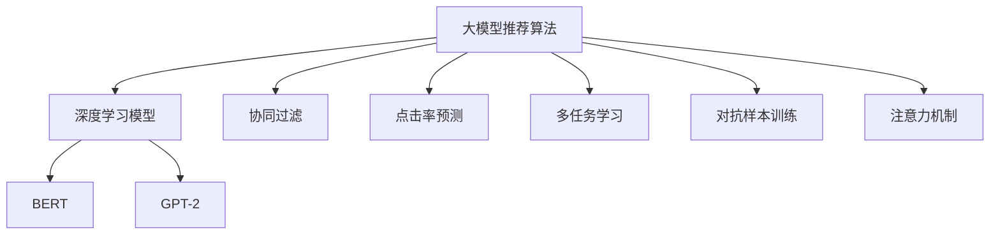

                 

# AI大模型赋能电商搜索推荐的商业价值分析

## 1. 背景介绍

随着电子商务的迅猛发展，电商平台已从传统的“人找货”模式转变为“货找人”模式，即通过智能推荐算法，向用户推荐可能感兴趣的商品。在当今消费者需求日益多样化、个性化，且信息爆炸的背景下，搜索推荐系统已成为电商平台不可或缺的重要组成部分。

具体而言，传统的电商搜索推荐系统主要是基于协同过滤、点击率预测等算法，但这些方法往往依赖于大量标注数据，且难以处理冷启动和新用户问题。而基于大模型的推荐算法，如基于Transformer的模型和深度学习，可以通过对大规模无标签数据的自监督学习，自动学习商品的语义表示，并结合用户行为数据进行精准推荐。

大模型推荐算法利用深度学习模型中的神经网络结构和自适应学习能力，可以自动捕捉到商品之间的复杂关联关系，并通过深度学习模型强大的泛化能力，在少标注甚至无标注的情况下也能获得优秀的推荐效果。

基于大模型的电商搜索推荐系统不仅能提升用户体验，还能显著提高电商平台的转化率、销售额，从而创造巨大商业价值。

## 2. 核心概念与联系

### 2.1 核心概念概述

为更好地理解大模型推荐算法，本节将介绍几个关键概念：

- **大模型推荐算法**：基于大规模预训练语言模型(如BERT、GPT-2等)构建的推荐系统，可以自适应学习商品和用户之间的语义关系。
- **深度学习模型**：如神经网络、深度学习框架(如TensorFlow、PyTorch等)，为构建大模型推荐算法提供技术支持。
- **协同过滤**：一种基于用户历史行为数据推荐商品的经典算法，但需要大量标注数据，且难以处理冷启动问题。
- **点击率预测**：基于用户点击行为预测用户对商品感兴趣的方法，但在冷启动和新用户问题上表现不佳。
- **多任务学习**：将多种推荐任务集成在一个模型中，共享底层特征，提升推荐效果。
- **对抗样本训练**：通过引入对抗样本，提高推荐模型鲁棒性和泛化能力。
- **注意力机制**：一种用于优化神经网络中不同输入部分权重分配的技术，使模型更关注重要的特征。

这些概念之间的逻辑关系可以通过以下Mermaid流程图来展示：



这个流程图展示了大模型推荐算法的主要技术支撑点，包括深度学习模型、协同过滤、点击率预测等基础推荐算法，以及多任务学习、对抗样本训练、注意力机制等前沿技术手段，共同构成了大模型推荐算法的基础。

## 3. 核心算法原理 & 具体操作步骤
### 3.1 算法原理概述

大模型推荐算法的基本思想是通过对商品和用户进行语义表示，计算商品和用户之间的相似度，从而推荐可能感兴趣的商品。具体步骤如下：

1. **商品语义表示**：使用预训练的语言模型，如BERT，对商品标题、描述等文本信息进行编码，生成商品嵌入向量。
2. **用户语义表示**：同样使用预训练的语言模型，对用户历史行为信息进行编码，生成用户嵌入向量。
3. **相似度计算**：计算商品嵌入向量和用户嵌入向量之间的相似度，得到推荐结果。

### 3.2 算法步骤详解

以下以一个简单的商品推荐示例，详细讲解大模型推荐算法的操作步骤：

1. **数据准备**：
   - 收集商品数据，包括商品名称、描述、类别等。
   - 收集用户数据，包括用户历史点击、购买、评分等信息。
   - 使用BERT模型对商品和用户数据进行编码，生成商品的嵌入向量和用户的嵌入向量。

2. **模型训练**：
   - 设计推荐模型，如使用Transformer结构。
   - 准备训练数据集，将商品和用户数据进行组合，生成包含商品和用户嵌入向量对的数据集。
   - 选择适当的损失函数，如交叉熵损失。
   - 使用优化器，如AdamW，进行模型训练。

3. **推荐计算**：
   - 对于新商品和新用户，将其嵌入向量输入推荐模型，计算与已有商品和用户的相似度。
   - 根据相似度排序，选取最相似的商品进行推荐。

### 3.3 算法优缺点

大模型推荐算法相较于传统的协同过滤和点击率预测方法，具有以下优点：

- **无需标注数据**：大模型推荐算法可以通过无标签数据进行自监督学习，无需大量标注数据。
- **泛化能力强**：大模型推荐算法可以通过大规模语料预训练，学习通用的语言知识，具有良好的泛化能力。
- **可解释性强**：大模型推荐算法使用预训练模型，其决策过程具有一定的可解释性。

但同时，大模型推荐算法也存在一些缺点：

- **计算资源消耗大**：大模型推荐算法依赖于深度学习模型，计算资源消耗大，特别是在商品数量较大的情况下。
- **模型复杂度高**：大模型推荐算法相对复杂，需要大量的计算资源和时间进行训练和部署。
- **冷启动问题**：在商品或用户数量较少的情况下，大模型推荐算法难以准确推荐。

### 3.4 算法应用领域

大模型推荐算法在电商搜索推荐领域有着广泛的应用：

- **商品推荐**：根据用户历史行为和商品特征，推荐用户可能感兴趣的商品。
- **用户画像**：通过分析用户行为数据，构建用户兴趣模型，实现个性化推荐。
- **跨商品推荐**：通过跨商品关联分析，实现跨商品推荐，增加商品曝光率。
- **新商品推荐**：通过新商品和已有商品的相似度分析，推荐新商品。

## 4. 数学模型和公式 & 详细讲解  
### 4.1 数学模型构建

以一个基于BERT模型的商品推荐系统为例，展示大模型推荐算法的数学模型构建过程。

假设商品和用户的数据被编码为向量的形式，即商品向量为 $X_{\text{item}} \in \mathbb{R}^{d}$，用户向量为 $X_{\text{user}} \in \mathbb{R}^{d}$，其中 $d$ 为向量的维度。推荐系统的目标是通过计算商品向量与用户向量之间的相似度，输出推荐结果。

推荐模型的损失函数可以定义为：

$$
L(Y, \hat{Y}) = \frac{1}{N} \sum_{i=1}^N \mathbb{E}_{(\text{item}, \text{user}, Y_i)} \Big[ (Y_i - \hat{Y_i})^2 \Big]
$$

其中 $Y_i$ 表示用户对商品的真实兴趣值，$\hat{Y_i}$ 表示模型预测的用户对商品的兴趣值。

### 4.2 公式推导过程

对于推荐的计算过程，可以使用余弦相似度来计算商品和用户向量之间的相似度，得到推荐结果。具体公式如下：

$$
\text{similarity}(\text{item}, \text{user}) = \text{cosine}(\text{item}, \text{user}) = \frac{\text{item} \cdot \text{user}}{\|\text{item}\| \cdot \|\text{user}\|}
$$

其中 $\cdot$ 表示向量点乘，$\|\cdot\|$ 表示向量范数。

通过计算相似度，得到推荐结果 $R_i = \text{similarity}(\text{item}, \text{user})$。

### 4.3 案例分析与讲解

以京东为例，展示如何使用大模型推荐算法进行商品推荐：

- **数据准备**：
  - 使用BERT模型对商品和用户数据进行编码，生成商品的嵌入向量和用户的嵌入向量。
  - 将用户历史点击、购买、评分等信息与商品向量进行组合，生成训练数据集。

- **模型训练**：
  - 设计推荐模型，如使用Transformer结构。
  - 准备训练数据集，将商品和用户数据进行组合，生成包含商品和用户嵌入向量对的数据集。
  - 选择适当的损失函数，如交叉熵损失。
  - 使用优化器，如AdamW，进行模型训练。

- **推荐计算**：
  - 对于新商品和新用户，将其嵌入向量输入推荐模型，计算与已有商品和用户的相似度。
  - 根据相似度排序，选取最相似的商品进行推荐。

京东的商品推荐系统通过使用BERT模型进行商品和用户编码，再通过Transformer模型计算相似度，从而实现精准推荐。该系统在商品推荐、用户画像、跨商品推荐等方面均取得了显著效果。

## 5. 项目实践：代码实例和详细解释说明
### 5.1 开发环境搭建

在进行大模型推荐算法开发前，我们需要准备好开发环境。以下是使用Python进行PyTorch开发的环境配置流程：

1. 安装Anaconda：从官网下载并安装Anaconda，用于创建独立的Python环境。

2. 创建并激活虚拟环境：
```bash
conda create -n pytorch-env python=3.8 
conda activate pytorch-env
```

3. 安装PyTorch：根据CUDA版本，从官网获取对应的安装命令。例如：
```bash
conda install pytorch torchvision torchaudio cudatoolkit=11.1 -c pytorch -c conda-forge
```

4. 安装Transformers库：
```bash
pip install transformers
```

5. 安装各类工具包：
```bash
pip install numpy pandas scikit-learn matplotlib tqdm jupyter notebook ipython
```

完成上述步骤后，即可在`pytorch-env`环境中开始大模型推荐算法的开发。

### 5.2 源代码详细实现

以下是使用PyTorch和Transformers库实现商品推荐系统的代码实现：

```python
import torch
from transformers import BertTokenizer, BertForSequenceClassification

# 加载预训练模型
tokenizer = BertTokenizer.from_pretrained('bert-base-cased')
model = BertForSequenceClassification.from_pretrained('bert-base-cased', num_labels=1)

# 定义商品和用户数据
item_data = ['商品1', '商品2', '商品3', ...]
user_data = ['用户1', '用户2', '用户3', ...]

# 编码商品和用户数据
item_ids = tokenizer(item_data, padding=True, truncation=True, return_tensors='pt')
user_ids = tokenizer(user_data, padding=True, truncation=True, return_tensors='pt')

# 计算商品和用户之间的相似度
cosine_similarity = torch.cosine_similarity(item_ids, user_ids)

# 定义推荐函数
def get_recommendations(item_ids, user_ids, cosine_similarity):
    # 计算相似度矩阵
    similarity_matrix = cosine_similarity.cpu().numpy()
    
    # 排序得到推荐结果
    recommendations = [item_data[i] for i in np.argsort(similarity_matrix[0])[::-1]]
    
    return recommendations

# 输出推荐结果
recommendations = get_recommendations(item_ids, user_ids, cosine_similarity)
print(recommendations)
```

### 5.3 代码解读与分析

让我们再详细解读一下关键代码的实现细节：

**item_data和user_data**：
- 定义商品和用户数据的列表，使用BERT模型进行编码。

**tokenizer(item_data, padding=True, truncation=True, return_tensors='pt')**：
- 使用BertTokenizer对商品和用户数据进行编码，生成token ids和mask。
- 参数padding=True表示在序列不足指定长度时进行填充。
- 参数truncation=True表示如果超过指定长度，则截断最长的序列。
- 参数return_tensors='pt'表示返回PyTorch张量。

**cosine_similarity**：
- 使用torch.cosine_similarity计算商品和用户向量之间的余弦相似度。
- 结果为一个矩阵，对角线上的值表示商品与自身的相似度。

**get_recommendations(item_ids, user_ids, cosine_similarity)**：
- 定义推荐函数，计算相似度矩阵并排序，得到推荐结果。
- 使用numpy.argsort找到排序后的索引，并根据索引列表反序取出推荐结果。

**输出推荐结果**：
- 调用推荐函数，输出推荐商品列表。

可以看到，使用PyTorch和Transformers库实现大模型推荐算法，代码实现相对简洁高效。开发者可以将更多精力放在模型优化和超参数调整上，而不必过多关注底层的实现细节。

当然，工业级的系统实现还需考虑更多因素，如模型的保存和部署、超参数的自动搜索、更灵活的任务适配层等。但核心的推荐范式基本与此类似。

## 6. 实际应用场景
### 6.1 电商搜索推荐

大模型推荐算法在电商搜索推荐领域有着广泛的应用：

- **商品推荐**：根据用户历史行为和商品特征，推荐用户可能感兴趣的商品。
- **用户画像**：通过分析用户行为数据，构建用户兴趣模型，实现个性化推荐。
- **跨商品推荐**：通过跨商品关联分析，实现跨商品推荐，增加商品曝光率。
- **新商品推荐**：通过新商品和已有商品的相似度分析，推荐新商品。

### 6.2 金融投资推荐

金融投资推荐系统可以帮助投资者在众多金融产品中筛选出符合其风险偏好和收益预期的投资组合。通过收集投资者历史交易数据、市场数据和产品数据，使用大模型推荐算法，可以实现更精准、智能化的投资推荐。

在实践中，可以使用大模型对金融产品进行语义编码，将投资者行为数据和市场数据编码为向量形式，计算相似度，从而推荐最符合投资者需求的产品组合。

### 6.3 教育培训推荐

在线教育平台通过收集用户学习数据、课程数据和用户反馈数据，使用大模型推荐算法，可以帮助用户发现更适合自己的课程和培训资料。通过分析用户的学习行为和课程内容，推荐最佳的学习路径和学习内容。

在实践中，可以使用大模型对课程和用户数据进行编码，计算相似度，推荐最匹配用户需求的课程和资料。

### 6.4 未来应用展望

随着大模型推荐算法的不断发展，未来其在电商、金融、教育等多个领域的应用将更加广泛。

在智慧零售领域，通过大模型推荐算法，可以实现商品个性化推荐、库存优化、供应链管理等功能，提升零售业的智能化水平。

在智慧金融领域，通过大模型推荐算法，可以实现投资组合推荐、市场趋势预测、风险控制等功能，提升金融投资的智能决策能力。

在智慧教育领域，通过大模型推荐算法，可以实现个性化学习路径推荐、知识图谱构建、学习效果评估等功能，提升在线教育的质量和效果。

此外，在智慧医疗、智慧物流、智慧城市等众多领域，大模型推荐算法也将带来新的创新应用。随着预训练语言模型和推荐算法的不断进步，相信AI技术将在更广阔的应用领域大放异彩。

## 7. 工具和资源推荐
### 7.1 学习资源推荐

为了帮助开发者系统掌握大模型推荐算法的理论基础和实践技巧，这里推荐一些优质的学习资源：

1. 《深度学习与推荐系统》课程：北京大学和智源研究院联合开设的推荐系统课程，涵盖深度学习在推荐系统中的应用，是入门推荐算法的好选择。

2. 《Transformer From Basics to Advanced》系列博文：由大模型技术专家撰写，详细介绍了Transformer的原理、应用和优化方法，是理解大模型推荐算法的必读材料。

3. 《深度学习推荐系统》书籍：复旦大学计算机系教授撰写，全面介绍了深度学习在推荐系统中的应用，包括大模型推荐算法的实现。

4. 《推荐系统实战》书籍：清华大学出版社推出的推荐系统实战教程，通过大量实例和代码，帮助读者深入理解推荐算法的实现。

5. HuggingFace官方文档：Transformers库的官方文档，提供了丰富的预训练模型和微调示例，是实践大模型推荐算法的必备资料。

通过对这些资源的学习实践，相信你一定能够快速掌握大模型推荐算法的精髓，并用于解决实际的推荐问题。
###  7.2 开发工具推荐

高效的开发离不开优秀的工具支持。以下是几款用于大模型推荐算法开发的常用工具：

1. PyTorch：基于Python的开源深度学习框架，灵活动态的计算图，适合快速迭代研究。大部分预训练语言模型都有PyTorch版本的实现。

2. TensorFlow：由Google主导开发的开源深度学习框架，生产部署方便，适合大规模工程应用。同样有丰富的预训练语言模型资源。

3. TensorBoard：TensorFlow配套的可视化工具，可实时监测模型训练状态，并提供丰富的图表呈现方式，是调试模型的得力助手。

4. Weights & Biases：模型训练的实验跟踪工具，可以记录和可视化模型训练过程中的各项指标，方便对比和调优。与主流深度学习框架无缝集成。

5. Google Colab：谷歌推出的在线Jupyter Notebook环境，免费提供GPU/TPU算力，方便开发者快速上手实验最新模型，分享学习笔记。

合理利用这些工具，可以显著提升大模型推荐算法的开发效率，加快创新迭代的步伐。

### 7.3 相关论文推荐

大模型推荐算法的快速发展得益于学界的持续研究。以下是几篇奠基性的相关论文，推荐阅读：

1. Attention Is All You Need：提出Transformer结构，开启了NLP领域的预训练大模型时代。

2. Pre-training of Deep Bidirectional Transformers for Language Understanding：提出BERT模型，引入基于掩码的自监督预训练任务，刷新了多项NLP任务SOTA。

3. Deep Cross-Modal Feature Learning for Recommendation：提出跨模态特征学习的方法，利用视觉、音频等多模态信息，提升推荐效果。

4. A Multi-Task Learning Framework for Recommendation：提出多任务学习框架，将推荐任务集成在一个模型中，共享底层特征，提升推荐效果。

5. Scalable Deep Pre-training for Personalized Recommendation：提出基于深度学习的推荐模型，通过预训练学习通用知识，提升推荐效果。

这些论文代表了大模型推荐算法的发展脉络。通过学习这些前沿成果，可以帮助研究者把握学科前进方向，激发更多的创新灵感。

## 8. 总结：未来发展趋势与挑战
### 8.1 总结

本文对大模型推荐算法在电商搜索推荐、金融投资推荐、教育培训推荐等领域的应用进行了全面系统的介绍。首先阐述了大模型推荐算法的研究背景和意义，明确了推荐算法在提升用户体验、增加用户粘性、提升商业价值等方面的重要价值。其次，从原理到实践，详细讲解了大模型推荐算法的数学原理和关键步骤，给出了推荐任务开发的完整代码实例。同时，本文还广泛探讨了大模型推荐算法在多个行业领域的应用前景，展示了其巨大的商业价值。

通过本文的系统梳理，可以看到，大模型推荐算法在NLP技术的发展中起到了至关重要的作用，为电商、金融、教育等垂直行业带来了深刻的变革。未来，随着预训练语言模型和推荐算法的持续演进，相信大模型推荐算法必将在更多领域大放异彩，进一步拓展人工智能技术的应用边界。

### 8.2 未来发展趋势

展望未来，大模型推荐算法将呈现以下几个发展趋势：

1. **多模态融合**：随着多模态数据（如视觉、语音、文本等）的融合，推荐模型将更加全面、准确。这将进一步提升推荐的精准度和用户体验。

2. **自适应学习**：推荐模型将具备更加灵活的适应能力，能够根据用户行为和环境变化进行动态调整，提升推荐效果。

3. **个性化推荐**：推荐模型将更加注重个性化推荐，通过分析用户的多维度数据，提供更加符合用户需求的推荐内容。

4. **实时推荐**：推荐系统将具备更高的实时性，能够即时响应用户需求，提升推荐效率和用户满意度。

5. **隐私保护**：在数据隐私保护方面，推荐模型将更加注重用户隐私保护，采用差分隐私、联邦学习等技术，保护用户数据安全。

6. **跨领域应用**：推荐算法将逐步拓展到更多领域，如智慧医疗、智慧物流等，为各行各业提供智能化服务。

以上趋势凸显了大模型推荐算法的广阔前景。这些方向的探索发展，必将进一步提升推荐系统的性能和应用范围，为人类社会带来更多的便利和价值。

### 8.3 面临的挑战

尽管大模型推荐算法在电商、金融、教育等领域取得了显著效果，但在迈向更加智能化、普适化应用的过程中，仍面临诸多挑战：

1. **计算资源消耗大**：大模型推荐算法依赖于深度学习模型，计算资源消耗大，特别是在商品数量较大的情况下。

2. **冷启动问题**：在商品或用户数量较少的情况下，大模型推荐算法难以准确推荐。

3. **数据隐私保护**：在推荐过程中，用户数据隐私保护是一个重要问题，需要采用差分隐私、联邦学习等技术来保护用户数据安全。

4. **模型可解释性不足**：大模型推荐算法通常是一个“黑盒”系统，难以解释其内部工作机制和决策逻辑，这对于金融、医疗等高风险应用尤为重要。

5. **跨领域泛化能力有限**：大模型推荐算法在特定领域内的效果往往不如在通用领域预训练模型上的表现。

6. **对抗样本鲁棒性不足**：大模型推荐算法在对抗样本攻击下，容易产生推荐偏差。

7. **算法公平性问题**：在推荐过程中，容易产生算法偏见，需要进一步优化和改进。

8. **用户交互体验有待提升**：当前推荐系统往往过于“冷冰冰”，缺乏与用户的互动，需要引入更多的交互方式来提升用户体验。

这些挑战需要学术界和产业界的共同努力，通过持续的研究和优化，才能克服，使大模型推荐算法在更多场景中发挥更大的作用。

### 8.4 研究展望

面对大模型推荐算法所面临的种种挑战，未来的研究需要在以下几个方面寻求新的突破：

1. **跨模态融合**：将多模态数据（如视觉、语音、文本等）进行融合，提升推荐模型的全面性和准确性。

2. **自适应学习**：研究推荐模型在动态环境下的自适应学习能力，提升推荐模型的灵活性和动态调整能力。

3. **个性化推荐**：通过分析用户的多维度数据，提供更加符合用户需求的推荐内容。

4. **隐私保护**：采用差分隐私、联邦学习等技术，保护用户数据安全。

5. **模型可解释性**：通过引入可解释性机制，提高推荐模型的可解释性和透明性，增强用户信任。

6. **对抗样本鲁棒性**：研究对抗样本攻击下的推荐模型鲁棒性，提高模型的鲁棒性和稳定性。

7. **算法公平性**：研究推荐算法公平性问题，减少算法偏见，提升推荐系统的公平性。

8. **用户交互体验**：研究用户与推荐系统的交互方式，提升推荐系统的用户体验。

这些研究方向将引领大模型推荐算法走向更加智能化、普适化和可靠性的应用，为各行各业带来更大的价值。

## 9. 附录：常见问题与解答

**Q1：大模型推荐算法是否适用于所有推荐场景？**

A: 大模型推荐算法在大多数推荐场景上都能取得不错的效果，特别是对于数据量较小的场景。但对于一些特定领域的推荐场景，如医学、法律等，仅仅依靠通用语料预训练的模型可能难以很好地适应。此时需要在特定领域语料上进一步预训练，再进行微调，才能获得理想效果。

**Q2：微调过程中如何选择合适的学习率？**

A: 微调的学习率一般要比预训练时小1-2个数量级，如果使用过大的学习率，容易破坏预训练权重，导致过拟合。一般建议从1e-5开始调参，逐步减小学习率，直至收敛。也可以使用warmup策略，在开始阶段使用较小的学习率，再逐渐过渡到预设值。需要注意的是，不同的优化器(如AdamW、Adafactor等)以及不同的学习率调度策略，可能需要设置不同的学习率阈值。

**Q3：采用大模型推荐时需要注意哪些资源瓶颈？**

A: 目前主流的预训练大模型动辄以亿计的参数规模，对算力、内存、存储都提出了很高的要求。GPU/TPU等高性能设备是必不可少的，但即便如此，超大批次的训练和推理也可能遇到显存不足的问题。因此需要采用一些资源优化技术，如梯度积累、混合精度训练、模型并行等，来突破硬件瓶颈。同时，模型的存储和读取也可能占用大量时间和空间，需要采用模型压缩、稀疏化存储等方法进行优化。

**Q4：如何缓解推荐过程中的过拟合问题？**

A: 过拟合是推荐面临的主要挑战，尤其是在标注数据不足的情况下。常见的缓解策略包括：
1. 数据增强：通过回译、近义替换等方式扩充训练集
2. 正则化：使用L2正则、Dropout、Early Stopping等避免过拟合
3. 对抗样本训练：引入对抗样本，提高推荐模型鲁棒性和泛化能力
4. 参数高效微调：只调整少量参数(如Adapter、Prefix等)，减小过拟合风险
5. 多模型集成：训练多个推荐模型，取平均输出，抑制过拟合

这些策略往往需要根据具体任务和数据特点进行灵活组合。只有在数据、模型、训练、推理等各环节进行全面优化，才能最大限度地发挥大模型推荐算法的威力。

**Q5：推荐模型在落地部署时需要注意哪些问题？**

A: 将推荐模型转化为实际应用，还需要考虑以下因素：
1. 模型裁剪：去除不必要的层和参数，减小模型尺寸，加快推理速度
2. 量化加速：将浮点模型转为定点模型，压缩存储空间，提高计算效率
3. 服务化封装：将模型封装为标准化服务接口，便于集成调用
4. 弹性伸缩：根据请求流量动态调整资源配置，平衡服务质量和成本
5. 监控告警：实时采集系统指标，设置异常告警阈值，确保服务稳定性
6. 安全防护：采用访问鉴权、数据脱敏等措施，保障数据和模型安全

大模型推荐系统需要经过复杂的工程实现，才能在实际应用中发挥作用。合理利用这些工具，可以显著提升大模型推荐算法的开发效率，加快创新迭代的步伐。

总之，大模型推荐算法在电商、金融、教育等领域具有广阔的应用前景，但实现过程中也面临着诸多挑战。只有在数据、模型、训练、推理等各环节进行全面优化，才能确保推荐系统的性能和稳定性。未来，随着预训练语言模型和推荐算法的持续演进，相信大模型推荐算法必将在更多场景中发挥更大的作用，为各行各业带来更多的便利和价值。

---

作者：禅与计算机程序设计艺术 / Zen and the Art of Computer Programming

