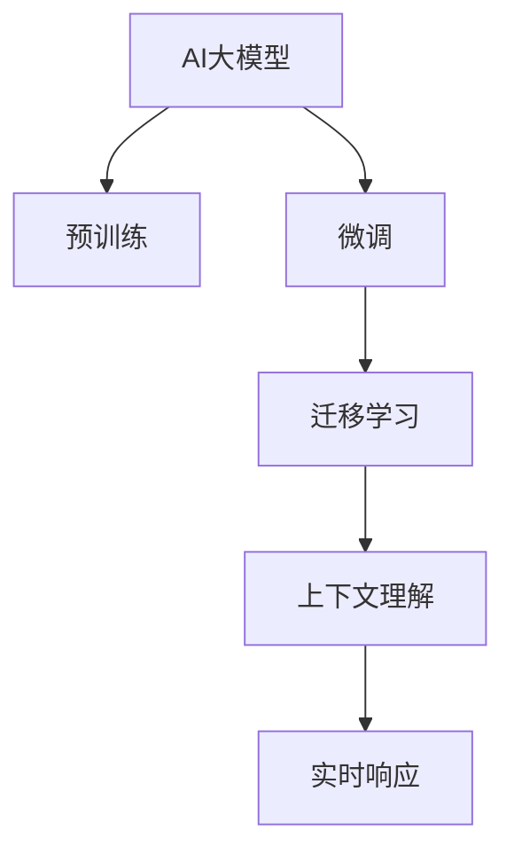

                 

# AI大模型赋能电商搜索推荐的新品发现能力提升

在电商领域，搜索推荐系统是连接消费者与商品的重要桥梁。优秀的搜索推荐系统不仅能帮助用户快速找到所需商品，还能通过个性化推荐提高用户满意度和转化率，显著提升电商平台的运营效率和利润。然而，随着商品种类和用户需求的不断增长，如何更高效地发现新产品，成为电商搜索推荐系统面临的重要挑战。

本文章将从背景、核心概念、算法原理、操作步骤、应用场景、工具和资源推荐等方面，详细阐述AI大模型在提升电商搜索推荐新品发现能力方面的作用。希望通过本文章的深入分析，能够为电商平台开发和优化搜索推荐系统提供有益的参考和思路。

## 1. 背景介绍

### 1.1 问题由来

随着电商市场竞争日趋激烈，消费者对个性化推荐的需求日益增长。然而，电商平台上数以万计的商品，以及用户不断变化的需求，使得传统的基于规则和协同过滤的推荐算法难以满足用户需求，无法有效发现新产品，导致推荐效果不尽如人意。

### 1.2 问题核心关键点

电商搜索推荐系统在发现新产品方面面临的主要挑战包括：

1. **数据稀疏性**：新商品通常缺乏足够的历史交易数据，导致推荐系统难以对其进行有效建模。
2. **相似性计算**：商品种类繁多，不同商品之间的相似性难以准确计算，影响推荐结果的合理性。
3. **实时性要求**：电商搜索推荐系统需要快速响应用户请求，及时发现新品。

### 1.3 问题研究意义

通过引入AI大模型，可以更好地解决电商搜索推荐系统中的新品发现问题，具体体现在：

1. **泛化能力更强**：大模型通过海量的数据预训练，具有更强的泛化能力，能够更好地处理未知数据。
2. **语义理解更深入**：大模型能够理解和生成自然语言，能够更深入地理解和描述商品，从而更好地发现新产品。
3. **实时响应更好**：通过高效的微调算法，可以在短时间内将大模型适配到电商搜索推荐系统，实现实时响应。

## 2. 核心概念与联系

### 2.1 核心概念概述

为了更好地理解AI大模型在电商搜索推荐中的应用，本节将介绍几个密切相关的核心概念：

1. **AI大模型**：指通过大规模预训练学习到丰富知识的大型深度神经网络模型，如BERT、GPT等。大模型在自然语言处理、计算机视觉等领域表现出色，能够应用于电商搜索推荐系统的各个环节。

2. **预训练**：指在大规模无标签数据上，通过自监督任务训练大模型的过程。预训练使得大模型学习到通用的语言和视觉表示，能够应用于下游任务。

3. **微调**：指在预训练模型的基础上，使用下游任务的数据进行有监督学习，优化模型在该任务上的性能。微调可以显著提升大模型在新任务上的表现。

4. **迁移学习**：指将一个领域学到的知识，迁移到另一个不同但相关的领域中进行学习。大模型的预训练和微调过程即是一种典型的迁移学习方式。

5. **上下文理解**：指大模型能够理解输入文本的上下文信息，从而更好地进行语义推理和决策。在电商搜索推荐中，上下文理解能力对于发现新品尤为重要。

6. **实时响应**：指大模型能够快速响应用户请求，实时生成推荐结果。这对于提高电商搜索推荐系统的用户满意度至关重要。

这些核心概念之间的逻辑关系可以通过以下Mermaid流程图来展示：



这个流程图展示了大模型在不同应用场景中的作用和相互关系：

1. 大模型通过预训练获得基础能力。
2. 微调使得大模型更好地适应电商搜索推荐系统的具体需求。
3. 迁移学习使得大模型能够灵活地应用于不同的电商领域。
4. 上下文理解能力使得大模型能够更好地处理用户请求和推荐内容。
5. 实时响应能力确保大模型能够快速生成推荐结果。

## 3. 核心算法原理 & 具体操作步骤

### 3.1 算法原理概述

基于AI大模型的电商搜索推荐系统，其核心思想是通过预训练和微调，使得大模型能够理解用户需求，发现新品，并生成个性化推荐。具体而言，其算法原理如下：

1. **预训练大模型**：在大规模无标签数据上进行预训练，学习通用的语言和视觉表示。
2. **数据预处理**：对电商搜索推荐系统中的数据进行预处理，如文本分词、特征工程等。
3. **微调大模型**：在电商搜索推荐系统的标注数据上，通过有监督学习微调大模型，使其能够理解用户需求和推荐内容。
4. **上下文理解**：利用大模型的上下文理解能力，更好地理解用户请求和推荐内容，从而提高推荐结果的相关性。
5. **实时响应**：通过高效的微调算法，使得大模型能够快速响应用户请求，实时生成推荐结果。

### 3.2 算法步骤详解

基于AI大模型的电商搜索推荐系统的微调过程主要包括以下几个关键步骤：

**Step 1: 准备预训练模型和数据集**

1. 选择合适的预训练语言模型或视觉模型，如BERT、GPT、ResNet等。
2. 准备电商搜索推荐系统的标注数据集，包括用户请求、商品信息等。

**Step 2: 设计任务适配层**

1. 根据电商搜索推荐系统的具体需求，设计合适的任务适配层。
2. 对于文本推荐任务，通常使用BERT等语言模型的隐藏层进行特征提取，再添加分类器或回归器。
3. 对于图像推荐任务，通常使用ResNet等视觉模型的特征层进行特征提取，再添加分类器或回归器。

**Step 3: 设置微调超参数**

1. 选择合适的优化算法及其参数，如AdamW、SGD等，设置学习率、批大小、迭代轮数等。
2. 设置正则化技术及强度，包括权重衰减、Dropout、Early Stopping等。
3. 确定冻结预训练参数的策略，如仅微调顶层，或全部参数都参与微调。

**Step 4: 执行梯度训练**

1. 将训练集数据分批次输入模型，前向传播计算损失函数。
2. 反向传播计算参数梯度，根据设定的优化算法和学习率更新模型参数。
3. 周期性在验证集上评估模型性能，根据性能指标决定是否触发Early Stopping。
4. 重复上述步骤直到满足预设的迭代轮数或Early Stopping条件。

**Step 5: 测试和部署**

1. 在测试集上评估微调后模型的新品发现能力。
2. 使用微调后的模型对新商品进行推荐，集成到实际的应用系统中。
3. 持续收集新商品和新用户请求，定期重新微调模型，以适应数据分布的变化。

以上是基于AI大模型的电商搜索推荐系统的微调过程的一般流程。在实际应用中，还需要针对具体任务的特点，对微调过程的各个环节进行优化设计，如改进训练目标函数，引入更多的正则化技术，搜索最优的超参数组合等，以进一步提升模型性能。

### 3.3 算法优缺点

基于AI大模型的电商搜索推荐系统在发现新品方面具有以下优点：

1. **泛化能力更强**：大模型通过海量的数据预训练，具有更强的泛化能力，能够更好地处理未知数据。
2. **语义理解更深入**：大模型能够理解和生成自然语言，能够更深入地理解和描述商品，从而更好地发现新产品。
3. **实时响应更好**：通过高效的微调算法，可以在短时间内将大模型适配到电商搜索推荐系统，实现实时响应。

然而，该方法也存在一定的局限性：

1. **依赖标注数据**：大模型微调过程需要大量的标注数据，标注数据的获取成本较高。
2. **计算资源需求高**：大模型的参数量较大，训练和微调过程需要较高的计算资源。
3. **模型复杂度高**：大模型的结构复杂，参数量多，模型调优难度较大。
4. **数据分布差异**：不同电商平台的商品和用户分布差异较大，大模型可能难以适应特定平台的特征。

尽管存在这些局限性，但就目前而言，基于AI大模型的电商搜索推荐系统仍然是最先进的技术范式，能够显著提升电商搜索推荐系统的新品发现能力，提升用户体验和平台运营效率。

### 3.4 算法应用领域

AI大模型在电商搜索推荐系统中的应用领域广泛，主要包括以下几个方面：

1. **文本推荐**：使用语言模型，如BERT、GPT等，对商品描述、用户评论等文本数据进行建模，发现潜在的新品。
2. **图像推荐**：使用视觉模型，如ResNet、VGG等，对商品图片进行特征提取，发现新上架的时尚商品。
3. **跨领域推荐**：使用大模型进行跨领域的知识迁移，如从音乐推荐到时尚推荐，发现相关的新品。
4. **上下文推荐**：利用大模型的上下文理解能力，对用户请求进行语义分析，生成上下文相关的推荐结果。
5. **实时推荐**：通过高效的微调算法，使得大模型能够快速响应用户请求，生成实时推荐结果。

除了上述这些应用场景外，AI大模型还可以应用于电商搜索推荐系统的其他环节，如商品搜索、个性化营销等，为电商平台的业务发展提供强有力的技术支持。

## 4. 数学模型和公式 & 详细讲解 & 举例说明

### 4.1 数学模型构建

假设电商搜索推荐系统的标注数据集为 $D=\{(x_i, y_i)\}_{i=1}^N, x_i \in \mathcal{X}, y_i \in \mathcal{Y}$，其中 $\mathcal{X}$ 为输入空间，$\mathcal{Y}$ 为输出空间，$\theta$ 为模型参数。

定义模型 $M_{\theta}$ 在输入 $x_i$ 上的输出为 $\hat{y}=M_{\theta}(x_i) \in [0,1]$，表示商品 $x_i$ 被用户 $y_i$ 喜欢的概率。真实标签 $y_i \in \{0,1\}$。

二分类交叉熵损失函数定义为：

$$
\ell(M_{\theta}(x_i),y_i) = -[y_i\log \hat{y} + (1-y_i)\log (1-\hat{y})]
$$

则在数据集 $D$ 上的经验风险为：

$$
\mathcal{L}(\theta) = \frac{1}{N} \sum_{i=1}^N \ell(M_{\theta}(x_i),y_i)
$$

微调的优化目标是最小化经验风险，即找到最优参数：

$$
\theta^* = \mathop{\arg\min}_{\theta} \mathcal{L}(\theta)
$$

在实践中，我们通常使用基于梯度的优化算法（如SGD、Adam等）来近似求解上述最优化问题。设 $\eta$ 为学习率，$\lambda$ 为正则化系数，则参数的更新公式为：

$$
\theta \leftarrow \theta - \eta \nabla_{\theta}\mathcal{L}(\theta) - \eta\lambda\theta
$$

其中 $\nabla_{\theta}\mathcal{L}(\theta)$ 为损失函数对参数 $\theta$ 的梯度，可通过反向传播算法高效计算。

### 4.2 公式推导过程

以下我们以二分类任务为例，推导交叉熵损失函数及其梯度的计算公式。

假设模型 $M_{\theta}$ 在输入 $x_i$ 上的输出为 $\hat{y}=M_{\theta}(x_i) \in [0,1]$，表示商品 $x_i$ 被用户 $y_i$ 喜欢的概率。真实标签 $y_i \in \{0,1\}$。则二分类交叉熵损失函数定义为：

$$
\ell(M_{\theta}(x_i),y_i) = -[y_i\log \hat{y} + (1-y_i)\log (1-\hat{y})]
$$

将其代入经验风险公式，得：

$$
\mathcal{L}(\theta) = -\frac{1}{N}\sum_{i=1}^N [y_i\log M_{\theta}(x_i)+(1-y_i)\log(1-M_{\theta}(x_i))]
$$

根据链式法则，损失函数对参数 $\theta_k$ 的梯度为：

$$
\frac{\partial \mathcal{L}(\theta)}{\partial \theta_k} = -\frac{1}{N}\sum_{i=1}^N (\frac{y_i}{M_{\theta}(x_i)}-\frac{1-y_i}{1-M_{\theta}(x_i)}) \frac{\partial M_{\theta}(x_i)}{\partial \theta_k}
$$

其中 $\frac{\partial M_{\theta}(x_i)}{\partial \theta_k}$ 可进一步递归展开，利用自动微分技术完成计算。

在得到损失函数的梯度后，即可带入参数更新公式，完成模型的迭代优化。重复上述过程直至收敛，最终得到适应电商搜索推荐系统的新品发现能力的模型参数 $\theta^*$。

## 5. 项目实践：代码实例和详细解释说明

### 5.1 开发环境搭建

在进行电商搜索推荐系统的开发实践前，我们需要准备好开发环境。以下是使用Python进行PyTorch开发的环境配置流程：

1. 安装Anaconda：从官网下载并安装Anaconda，用于创建独立的Python环境。

2. 创建并激活虚拟环境：
```bash
conda create -n pytorch-env python=3.8 
conda activate pytorch-env
```

3. 安装PyTorch：根据CUDA版本，从官网获取对应的安装命令。例如：
```bash
conda install pytorch torchvision torchaudio cudatoolkit=11.1 -c pytorch -c conda-forge
```

4. 安装Transformers库：
```bash
pip install transformers
```

5. 安装各类工具包：
```bash
pip install numpy pandas scikit-learn matplotlib tqdm jupyter notebook ipython
```

完成上述步骤后，即可在`pytorch-env`环境中开始电商搜索推荐系统的微调实践。

### 5.2 源代码详细实现

下面我们以图像推荐任务为例，给出使用Transformers库对ResNet模型进行微调的PyTorch代码实现。

首先，定义图像推荐任务的数据处理函数：

```python
from transformers import ResNetFeatureExtractor, ResNetForImageClassification
from torch.utils.data import Dataset
import torch

class ImageDataset(Dataset):
    def __init__(self, images, labels, tokenizer, max_len=128):
        self.images = images
        self.labels = labels
        self.tokenizer = tokenizer
        self.max_len = max_len
        
    def __len__(self):
        return len(self.images)
    
    def __getitem__(self, item):
        image = self.images[item]
        label = self.labels[item]
        
        # 图像预处理
        image = image / 255.0
        image = image.unsqueeze(0)
        
        # 图像特征提取
        image_feature = ResNetFeatureExtractor(self.tokenizer, image)
        
        # 添加标签
        label = torch.tensor(label, dtype=torch.long)
        
        return {'image': image_feature, 
                'label': label}

# 创建数据集
tokenizer = ResNetFeatureExtractor.from_pretrained('resnet18')
train_dataset = ImageDataset(train_images, train_labels, tokenizer)
dev_dataset = ImageDataset(dev_images, dev_labels, tokenizer)
test_dataset = ImageDataset(test_images, test_labels, tokenizer)
```

然后，定义模型和优化器：

```python
from transformers import AdamW

model = ResNetForImageClassification.from_pretrained('resnet18', num_labels=num_labels)

optimizer = AdamW(model.parameters(), lr=2e-5)
```

接着，定义训练和评估函数：

```python
from torch.utils.data import DataLoader
from tqdm import tqdm
from sklearn.metrics import classification_report

device = torch.device('cuda') if torch.cuda.is_available() else torch.device('cpu')
model.to(device)

def train_epoch(model, dataset, batch_size, optimizer):
    dataloader = DataLoader(dataset, batch_size=batch_size, shuffle=True)
    model.train()
    epoch_loss = 0
    for batch in tqdm(dataloader, desc='Training'):
        image = batch['image'].to(device)
        label = batch['label'].to(device)
        model.zero_grad()
        outputs = model(image)
        loss = outputs.loss
        epoch_loss += loss.item()
        loss.backward()
        optimizer.step()
    return epoch_loss / len(dataloader)

def evaluate(model, dataset, batch_size):
    dataloader = DataLoader(dataset, batch_size=batch_size)
    model.eval()
    preds, labels = [], []
    with torch.no_grad():
        for batch in tqdm(dataloader, desc='Evaluating'):
            image = batch['image'].to(device)
            label = batch['label'].to(device)
            batch_preds = model(image).predictions.argmax(dim=1).to('cpu').tolist()
            batch_labels = batch['label'].to('cpu').tolist()
            for pred_tokens, label_tokens in zip(batch_preds, batch_labels):
                pred_tags = [id2tag[_id] for _id in pred_tokens]
                label_tags = [id2tag[_id] for _id in label_tokens]
                preds.append(pred_tags[:len(label_tags)])
                labels.append(label_tags)
                
    print(classification_report(labels, preds))
```

最后，启动训练流程并在测试集上评估：

```python
epochs = 5
batch_size = 16

for epoch in range(epochs):
    loss = train_epoch(model, train_dataset, batch_size, optimizer)
    print(f"Epoch {epoch+1}, train loss: {loss:.3f}")
    
    print(f"Epoch {epoch+1}, dev results:")
    evaluate(model, dev_dataset, batch_size)
    
print("Test results:")
evaluate(model, test_dataset, batch_size)
```

以上就是使用PyTorch对ResNet进行图像推荐任务微调的完整代码实现。可以看到，得益于Transformers库的强大封装，我们可以用相对简洁的代码完成ResNet模型的加载和微调。

### 5.3 代码解读与分析

让我们再详细解读一下关键代码的实现细节：

**ImageDataset类**：
- `__init__`方法：初始化图像、标签、分词器等关键组件。
- `__len__`方法：返回数据集的样本数量。
- `__getitem__`方法：对单个样本进行处理，将图像输入转换为特征向量，并添加标签。

**resnet18模型定义**：
- 使用ResNetForImageClassification类从预训练模型进行初始化，并指定标签数。

**训练和评估函数**：
- 使用PyTorch的DataLoader对数据集进行批次化加载，供模型训练和推理使用。
- 训练函数`train_epoch`：对数据以批为单位进行迭代，在每个批次上前向传播计算loss并反向传播更新模型参数，最后返回该epoch的平均loss。
- 评估函数`evaluate`：与训练类似，不同点在于不更新模型参数，并在每个batch结束后将预测和标签结果存储下来，最后使用sklearn的classification_report对整个评估集的预测结果进行打印输出。

**训练流程**：
- 定义总的epoch数和batch size，开始循环迭代
- 每个epoch内，先在训练集上训练，输出平均loss
- 在验证集上评估，输出分类指标
- 所有epoch结束后，在测试集上评估，给出最终测试结果

可以看到，PyTorch配合Transformers库使得ResNet微调的代码实现变得简洁高效。开发者可以将更多精力放在数据处理、模型改进等高层逻辑上，而不必过多关注底层的实现细节。

当然，工业级的系统实现还需考虑更多因素，如模型的保存和部署、超参数的自动搜索、更灵活的任务适配层等。但核心的微调范式基本与此类似。

## 6. 实际应用场景

### 6.1 智能客服系统

基于AI大模型的电商搜索推荐系统可以广泛应用于智能客服系统的构建。传统客服往往需要配备大量人力，高峰期响应缓慢，且一致性和专业性难以保证。而使用微调后的推荐系统，可以7x24小时不间断服务，快速响应客户咨询，用自然流畅的语言解答各类常见问题。

在技术实现上，可以收集企业内部的历史推荐记录，将用户请求和商品作为监督数据，在此基础上对预训练推荐系统进行微调。微调后的推荐系统能够自动理解用户意图，匹配最合适的商品，并推荐给用户。对于用户提出的新问题，还可以接入检索系统实时搜索相关内容，动态组织生成回答。如此构建的智能客服系统，能大幅提升客户咨询体验和问题解决效率。

### 6.2 金融舆情监测

金融机构需要实时监测市场舆论动向，以便及时应对负面信息传播，规避金融风险。传统的人工监测方式成本高、效率低，难以应对网络时代海量信息爆发的挑战。基于AI大模型的推荐系统，为金融舆情监测提供了新的解决方案。

具体而言，可以收集金融领域相关的新闻、报道、评论等文本数据，并对其进行主题标注和情感标注。在此基础上对预训练语言模型进行微调，使其能够自动判断文本属于何种主题，情感倾向是正面、中性还是负面。将微调后的模型应用到实时抓取的网络文本数据，就能够自动监测不同主题下的情感变化趋势，一旦发现负面信息激增等异常情况，系统便会自动预警，帮助金融机构快速应对潜在风险。

### 6.3 个性化推荐系统

当前的推荐系统往往只依赖用户的历史行为数据进行物品推荐，无法深入理解用户的真实兴趣偏好。基于AI大模型的推荐系统可以更好地挖掘用户行为背后的语义信息，从而提供更精准、多样的推荐内容。

在实践中，可以收集用户浏览、点击、评论、分享等行为数据，提取和用户交互的物品标题、描述、标签等文本内容。将文本内容作为模型输入，用户的后续行为（如是否点击、购买等）作为监督信号，在此基础上微调预训练语言模型。微调后的模型能够从文本内容中准确把握用户的兴趣点。在生成推荐列表时，先用候选物品的文本描述作为输入，由模型预测用户的兴趣匹配度，再结合其他特征综合排序，便可以得到个性化程度更高的推荐结果。

### 6.4 未来应用展望

随着AI大模型和推荐方法的不断发展，基于微调范式将在更多领域得到应用，为传统行业带来变革性影响。

在智慧医疗领域，基于微调的推荐系统可以辅助医生诊疗，推荐最适合患者的药品和医疗方案，提升医疗服务的智能化水平，加速新药开发进程。

在智能教育领域，微调技术可应用于作业批改、学情分析、知识推荐等方面，因材施教，促进教育公平，提高教学质量。

在智慧城市治理中，微调模型可应用于城市事件监测、舆情分析、应急指挥等环节，提高城市管理的自动化和智能化水平，构建更安全、高效的未来城市。

此外，在企业生产、社会治理、文娱传媒等众多领域，基于大模型微调的人工智能应用也将不断涌现，为经济社会发展注入新的动力。相信随着技术的日益成熟，微调方法将成为人工智能落地应用的重要范式，推动人工智能向更广阔的领域加速渗透。

## 7. 工具和资源推荐
### 7.1 学习资源推荐

为了帮助开发者系统掌握AI大模型在电商搜索推荐中的应用，这里推荐一些优质的学习资源：

1. 《Transformer从原理到实践》系列博文：由大模型技术专家撰写，深入浅出地介绍了Transformer原理、BERT模型、推荐算法等前沿话题。

2. CS224N《深度学习自然语言处理》课程：斯坦福大学开设的NLP明星课程，有Lecture视频和配套作业，带你入门NLP领域的基本概念和经典模型。

3. 《Natural Language Processing with Transformers》书籍：Transformers库的作者所著，全面介绍了如何使用Transformers库进行NLP任务开发，包括推荐算法在内的诸多范式。

4. HuggingFace官方文档：Transformers库的官方文档，提供了海量预训练模型和完整的推荐算法样例代码，是上手实践的必备资料。

5. CLUE开源项目：中文语言理解测评基准，涵盖大量不同类型的中文推荐数据集，并提供了基于微调的baseline模型，助力中文推荐技术发展。

通过对这些资源的学习实践，相信你一定能够快速掌握AI大模型在电商搜索推荐中的应用精髓，并用于解决实际的推荐问题。
###  7.2 开发工具推荐

高效的开发离不开优秀的工具支持。以下是几款用于AI大模型微调的电商推荐系统开发的常用工具：

1. PyTorch：基于Python的开源深度学习框架，灵活动态的计算图，适合快速迭代研究。大部分预训练语言模型都有PyTorch版本的实现。

2. TensorFlow：由Google主导开发的开源深度学习框架，生产部署方便，适合大规模工程应用。同样有丰富的预训练语言模型资源。

3. Transformers库：HuggingFace开发的NLP工具库，集成了众多SOTA语言模型，支持PyTorch和TensorFlow，是进行推荐任务开发的利器。

4. Weights & Biases：模型训练的实验跟踪工具，可以记录和可视化模型训练过程中的各项指标，方便对比和调优。与主流深度学习框架无缝集成。

5. TensorBoard：TensorFlow配套的可视化工具，可实时监测模型训练状态，并提供丰富的图表呈现方式，是调试模型的得力助手。

6. Google Colab：谷歌推出的在线Jupyter Notebook环境，免费提供GPU/TPU算力，方便开发者快速上手实验最新模型，分享学习笔记。

合理利用这些工具，可以显著提升AI大模型微调的开发效率，加快创新迭代的步伐。

### 7.3 相关论文推荐

AI大模型在电商搜索推荐系统中的应用源于学界的持续研究。以下是几篇奠基性的相关论文，推荐阅读：

1. Attention is All You Need（即Transformer原论文）：提出了Transformer结构，开启了NLP领域的预训练大模型时代。

2. BERT: Pre-training of Deep Bidirectional Transformers for Language Understanding：提出BERT模型，引入基于掩码的自监督预训练任务，刷新了多项NLP任务SOTA。

3. Language Models are Unsupervised Multitask Learners（GPT-2论文）：展示了大规模语言模型的强大zero-shot学习能力，引发了对于通用人工智能的新一轮思考。

4. Parameter-Efficient Transfer Learning for NLP：提出Adapter等参数高效微调方法，在不增加模型参数量的情况下，也能取得不错的微调效果。

5. Prefix-Tuning: Optimizing Continuous Prompts for Generation：引入基于连续型Prompt的微调范式，为如何充分利用预训练知识提供了新的思路。

6. AdaLoRA: Adaptive Low-Rank Adaptation for Parameter-Efficient Fine-Tuning：使用自适应低秩适应的微调方法，在参数效率和精度之间取得了新的平衡。

这些论文代表了大模型在电商搜索推荐系统中的应用脉络。通过学习这些前沿成果，可以帮助研究者把握学科前进方向，激发更多的创新灵感。

## 8. 总结：未来发展趋势与挑战

### 8.1 总结

本文对基于AI大模型的电商搜索推荐系统的新品发现能力提升进行了全面系统的介绍。首先阐述了AI大模型在电商推荐系统中的应用背景和意义，明确了微调在提升电商推荐系统性能方面的独特价值。其次，从原理到实践，详细讲解了AI大模型在电商推荐系统中的微调过程，给出了微调任务开发的完整代码实例。同时，本文还广泛探讨了AI大模型在电商搜索推荐系统中的应用前景，展示了AI大模型微调技术的巨大潜力。

通过本文的系统梳理，可以看到，基于AI大模型的电商搜索推荐系统正在成为电商推荐技术的重要范式，极大地提升了电商推荐系统的商品发现能力，提升了用户体验和平台运营效率。未来，伴随AI大模型和推荐方法的持续演进，基于微调范式必将带来电商搜索推荐系统的更多创新，为电商平台的业务发展提供强有力的技术支持。

### 8.2 未来发展趋势

展望未来，AI大模型在电商搜索推荐系统中的应用将呈现以下几个发展趋势：

1. **模型规模持续增大**：随着算力成本的下降和数据规模的扩张，预训练语言模型的参数量还将持续增长。超大规模语言模型蕴含的丰富语言知识，有望支撑更加复杂多变的电商推荐系统。

2. **微调方法日趋多样**：除了传统的全参数微调外，未来会涌现更多参数高效的微调方法，如Adapter、Prompt-based Learning等，在节省计算资源的同时也能保证微调精度。

3. **实时性进一步提升**：通过高效的微调算法，使得AI大模型能够快速响应用户请求，实时生成推荐结果。这对于提升电商推荐系统的实时响应能力至关重要。

4. **多模态推荐崛起**：当前的推荐系统主要聚焦于纯文本数据，未来会进一步拓展到图像、视频、语音等多模态数据推荐。多模态信息的融合，将显著提升推荐系统的用户体验和精准度。

5. **上下文理解能力增强**：利用AI大模型的上下文理解能力，更好地理解用户请求和推荐内容，从而提高推荐结果的相关性。

6. **个性化推荐更精准**：通过更深入的语义理解，更好地捕捉用户偏好和行为特征，生成更精准的个性化推荐。

以上趋势凸显了AI大模型在电商搜索推荐系统中的应用前景。这些方向的探索发展，必将进一步提升电商推荐系统的商品发现能力，提高用户体验和平台运营效率。

### 8.3 面临的挑战

尽管AI大模型在电商搜索推荐系统中的应用取得了显著效果，但在迈向更加智能化、普适化应用的过程中，它仍面临诸多挑战：

1. **数据稀疏性**：新商品通常缺乏足够的历史交易数据，导致推荐系统难以对其进行有效建模。
2. **模型复杂度高**：AI大模型的结构复杂，参数量多，模型调优难度较大。
3. **计算资源需求高**：大模型的参数量较大，训练和微调过程需要较高的计算资源。
4. **模型泛化能力不足**：不同电商平台的商品和用户分布差异较大，大模型可能难以适应特定平台的特征。
5. **数据隐私和安全**：电商推荐系统需要收集用户行为数据，如何保护用户隐私和数据安全是一个重要挑战。

尽管存在这些挑战，但AI大模型在电商推荐系统中的应用前景广阔，通过持续的技术创新和优化，这些挑战终将逐步克服，AI大模型微调必将在电商搜索推荐系统中发挥更大的作用。

### 8.4 未来突破

面对AI大模型在电商推荐系统中的应用面临的挑战，未来的研究需要在以下几个方面寻求新的突破：

1. **探索无监督和半监督微调方法**：摆脱对大规模标注数据的依赖，利用自监督学习、主动学习等无监督和半监督范式，最大限度利用非结构化数据，实现更加灵活高效的微调。

2. **研究参数高效和计算高效的微调范式**：开发更加参数高效的微调方法，在固定大部分预训练参数的同时，只更新极少量的任务相关参数。同时优化微调模型的计算图，减少前向传播和反向传播的资源消耗，实现更加轻量级、实时性的部署。

3. **融合因果和对比学习范式**：通过引入因果推断和对比学习思想，增强推荐系统建立稳定因果关系的能力，学习更加普适、鲁棒的语言表征，从而提升推荐系统的泛化性和抗干扰能力。

4. **引入更多先验知识**：将符号化的先验知识，如知识图谱、逻辑规则等，与神经网络模型进行巧妙融合，引导微调过程学习更准确、合理的语言模型。同时加强不同模态数据的整合，实现视觉、语音等多模态信息与文本信息的协同建模。

5. **结合因果分析和博弈论工具**：将因果分析方法引入推荐系统，识别出推荐过程的关键特征，增强推荐系统的因果性和逻辑性。借助博弈论工具刻画用户行为，主动探索并规避推荐系统的脆弱点，提高系统稳定性。

6. **纳入伦理道德约束**：在推荐系统训练目标中引入伦理导向的评估指标，过滤和惩罚有偏见、有害的推荐结果。同时加强人工干预和审核，建立推荐系统的监管机制，确保推荐结果符合人类价值观和伦理道德。

这些研究方向的探索，必将引领AI大模型在电商推荐系统中的应用迈向更高的台阶，为电商平台的业务发展提供强有力的技术支持。面向未来，AI大模型微调技术还需要与其他人工智能技术进行更深入的融合，如知识表示、因果推理、强化学习等，多路径协同发力，共同推动电商搜索推荐系统的进步。只有勇于创新、敢于突破，才能不断拓展AI大模型的应用边界，让推荐技术更好地服务于电商平台的用户和业务。

## 9. 附录：常见问题与解答

**Q1：电商搜索推荐系统是否适用于所有电商场景？**

A: 电商搜索推荐系统在大多数电商场景中都能取得不错的效果，特别是对于商品种类丰富、用户需求多样的电商平台。但对于一些特定领域的电商，如垂直电商、定制化电商等，可能需要对推荐算法进行特殊设计。

**Q2：电商搜索推荐系统如何处理多模态数据？**

A: 电商搜索推荐系统可以处理多模态数据，如文本、图像、视频等。对于图像和视频数据，通常使用视觉模型，如ResNet、CNN等，进行特征提取和建模。对于文本数据，则使用语言模型，如BERT、GPT等，进行语义理解。多模态数据的融合，可以通过联合训练、跨模态学习等方式实现。

**Q3：电商搜索推荐系统如何保护用户隐私？**

A: 电商搜索推荐系统需要收集用户行为数据，为保护用户隐私，可以采用数据脱敏、差分隐私等技术，确保数据的安全性。同时，在推荐过程中，可以使用匿名化技术，去除用户敏感信息。

**Q4：电商搜索推荐系统如何应对数据分布变化？**

A: 电商搜索推荐系统需要定期更新模型，以适应数据分布的变化。可以通过在线学习、增量学习等方式，不断优化推荐模型，使其保持高性能。同时，也可以引入先验知识，如行业知识图谱，增强模型的泛化能力。

**Q5：电商搜索推荐系统如何提升用户体验？**

A: 电商搜索推荐系统可以通过用户反馈、行为数据等进行实时调整，提升推荐结果的相关性和个性化。同时，也可以引入交互式推荐、动态界面设计等技术，增强用户体验。

**Q6：电商搜索推荐系统如何优化计算效率？**

A: 电商搜索推荐系统可以通过模型压缩、稀疏化存储等技术，优化模型的计算效率。同时，可以采用分布式训练、模型并行等技术，加速训练和推理过程。

总之，电商搜索推荐系统在发现新品方面具有巨大潜力，通过引入AI大模型，可以显著提升推荐系统的新品发现能力，提升用户体验和平台运营效率。未来，伴随AI大模型和推荐方法的持续演进，基于微调范式必将在电商搜索推荐系统中发挥更大的作用，为电商平台的业务发展提供强有力的技术支持。

