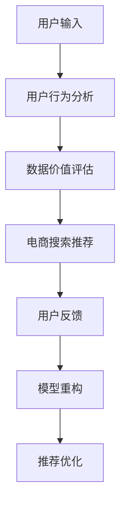

                 

# AI大模型重构电商搜索推荐的数据价值评估模型应用实践

> 关键词：大语言模型,电商搜索推荐,数据价值评估,模型重构,用户行为分析

## 1. 背景介绍

### 1.1 问题由来
随着电子商务的蓬勃发展，电商搜索推荐系统成为了用户获取商品信息、提升购物体验的重要渠道。传统推荐系统往往依赖于历史行为数据和静态特征，无法充分利用用户多维度的信息，难以适应用户个性化需求的动态变化。而AI大模型通过深度学习技术，可以挖掘用户更深层次的语义理解，动态生成个性化推荐结果，极大提升了推荐的精准度和用户体验。

大语言模型在电商搜索推荐中的应用，主要涉及两个关键环节：

1. **用户意图理解**：通过自然语言理解技术，捕捉用户输入搜索词和评论文本的语义信息，识别用户需求和偏好。
2. **商品推荐生成**：基于用户意图和商品信息，利用大语言模型生成推荐结果，提供满足用户需求的商品列表。

但大语言模型在电商搜索推荐中的价值尚未得到充分利用。电商企业往往缺乏全面系统的数据价值评估模型，难以准确衡量各数据指标对业务的影响，无法有效指导模型训练和优化。

本文聚焦于基于大语言模型构建电商搜索推荐的数据价值评估模型，通过全面评估不同数据指标的影响，提出重构推荐模型的方法，探索电商搜索推荐的未来应用。

## 2. 核心概念与联系

### 2.1 核心概念概述

为更好地理解数据价值评估模型在大语言模型电商推荐中的应用，本节将介绍几个关键概念：

- **电商搜索推荐**：指基于用户历史行为、商品属性等数据，通过算法生成商品推荐结果，提高用户转化率、购买率和满意度。
- **用户行为分析**：通过对用户浏览、点击、购买等行为数据进行分析，挖掘用户兴趣和需求，为推荐系统提供数据支持。
- **大语言模型**：指基于Transformer等结构预训练的大规模语言模型，如BERT、GPT等，具有强大的语义理解和生成能力。
- **数据价值评估模型**：用于量化各数据指标对推荐结果的影响，指导模型训练和优化，提升推荐效果和用户体验。
- **模型重构**：指根据数据价值评估结果，对原有推荐模型进行优化或重新设计，使其更好地适应电商搜索推荐的需求。

这些概念之间存在紧密联系，通过大语言模型的语义理解和生成能力，可以更好地分析用户行为，构建数据价值评估模型，进而重构推荐模型，实现更高质量的电商搜索推荐。

### 2.2 核心概念原理和架构的 Mermaid 流程图



这个流程图展示了电商搜索推荐系统的主要流程：

1. 用户输入搜索词或评论文本，进入用户行为分析模块。
2. 分析用户历史行为，构建用户画像。
3. 使用大语言模型进行语义理解，提取用户意图。
4. 构建数据价值评估模型，量化各数据指标的影响。
5. 根据评估结果，重构推荐模型。
6. 生成推荐结果，并接收用户反馈。
7. 根据用户反馈，进一步优化模型。

## 3. 核心算法原理 & 具体操作步骤

### 3.1 算法原理概述

数据价值评估模型的核心思想是通过分析用户行为数据，量化各数据指标对推荐结果的影响，指导推荐模型的训练和优化。其具体流程如下：

1. **数据收集与预处理**：从电商搜索推荐系统采集用户行为数据，并进行清洗和标准化处理。
2. **用户画像构建**：使用大语言模型进行语义理解，提取用户需求和偏好。
3. **数据价值评估**：量化各数据指标（如浏览时间、点击率、购买率等）对推荐结果的影响，构建评估模型。
4. **推荐模型优化**：根据评估模型结果，优化推荐算法，提升推荐效果。

### 3.2 算法步骤详解

以下详细描述数据价值评估模型的构建和优化步骤：

#### 3.2.1 数据收集与预处理

- **用户行为数据收集**：从电商搜索推荐系统获取用户浏览、点击、购买等行为数据。
- **数据清洗与标准化**：去除重复和噪声数据，标准化数据格式，确保数据的一致性和准确性。

#### 3.2.2 用户画像构建

- **用户意图提取**：使用大语言模型对用户输入的搜索词、评论文本进行语义理解，提取用户意图。
- **用户画像生成**：根据用户意图和行为数据，生成用户画像，涵盖用户兴趣、偏好、购买力等信息。

#### 3.2.3 数据价值评估

- **指标量化**：对用户行为数据进行量化，计算各指标对推荐结果的影响。
  - 如浏览时间、点击率、购买率等指标，可通过统计方法计算。
  - 如用户满意度、商品相关度等指标，可通过评分、评语等数据进行量化。
- **模型训练**：使用量化后的指标数据，构建机器学习模型，评估各指标的影响。
  - 常见模型包括线性回归、决策树、随机森林等。
  - 可使用交叉验证等方法，提升模型泛化能力。

#### 3.2.4 推荐模型优化

- **模型重构**：根据数据价值评估结果，重构推荐算法。
  - 如增加对用户兴趣的分析，调整推荐策略。
  - 如引入多模态数据，融合视觉、语音信息。
- **推荐结果优化**：根据用户反馈和行为数据，进一步优化推荐模型。
  - 如使用对抗样本训练，提高模型的鲁棒性。
  - 如引入动态调整机制，实时更新推荐算法。

### 3.3 算法优缺点

数据价值评估模型具有以下优点：

1. **精准性高**：通过对用户行为的全面分析，能够准确量化各指标的影响，指导推荐模型的优化。
2. **可解释性强**：模型的计算过程透明，便于理解和调试，有利于模型调优。
3. **灵活性大**：可根据业务需求调整评估指标和模型，适应不同的电商搜索推荐场景。

同时，也存在一些局限性：

1. **数据依赖性强**：模型的效果依赖于数据的全面性和准确性，数据不完整或噪声较多时，会影响评估结果。
2. **计算复杂度高**：构建和优化模型需要大量的计算资源，特别是在大规模电商推荐场景中。
3. **模型泛化能力有限**：模型过于复杂或过于简单，可能导致泛化能力不足，影响推荐效果的稳定性。

### 3.4 算法应用领域

数据价值评估模型在电商搜索推荐中具有广泛的应用前景：

1. **个性化推荐**：通过分析用户历史行为和意图，生成个性化的商品推荐列表，提升用户满意度。
2. **用户画像**：构建全面的用户画像，实现更精准的推荐，提高转化率和客单价。
3. **商品优化**：根据用户反馈和行为数据，优化商品描述、图片等信息，提升商品吸引力。
4. **活动效果评估**：评估促销活动对推荐效果的影响，优化营销策略，提高活动效果。
5. **异常检测**：识别用户行为中的异常数据，及时预警潜在问题，保障系统稳定性。

## 4. 数学模型和公式 & 详细讲解 & 举例说明

### 4.1 数学模型构建

数据价值评估模型通常采用多指标回归模型，通过线性回归、决策树、随机森林等方法，量化各数据指标对推荐结果的影响。

以线性回归模型为例，假设推荐结果为 $y$，各指标为 $x_1, x_2, ..., x_n$，则模型可表示为：

$$
y = \beta_0 + \sum_{i=1}^n \beta_i x_i + \epsilon
$$

其中 $\beta_0, \beta_1, ..., \beta_n$ 为回归系数，$\epsilon$ 为误差项。

### 4.2 公式推导过程

以线性回归模型为例，推导其求解过程：

- **模型建立**：假设数据集为 $(x_1, y_1), (x_2, y_2), ..., (x_n, y_n)$，其中 $x_i = (x_{i1}, x_{i2}, ..., x_{in})$。
- **最小二乘法求解**：最小化误差平方和 $\sum_{i=1}^n (y_i - \hat{y}_i)^2$，求解 $\beta_0, \beta_1, ..., \beta_n$。
- **正则化**：为避免过拟合，通常引入L2正则项，优化方程为：

$$
\min_{\beta_0, \beta_1, ..., \beta_n} \sum_{i=1}^n (y_i - \hat{y}_i)^2 + \lambda \sum_{i=1}^n \beta_i^2
$$

其中 $\lambda$ 为正则化系数，控制模型复杂度。

### 4.3 案例分析与讲解

以电商搜索推荐为例，使用线性回归模型评估用户浏览时间对购买率的影响。假设数据集为 $(y_1, x_{11}, x_{12}), (y_2, x_{21}, x_{22}), ..., (y_n, x_{n1}, x_{n2})$。

- **数据准备**：准备用户浏览时间 $x_1$ 和购买率 $y$ 的数据集。
- **模型训练**：使用线性回归模型，求解回归系数 $\beta_0, \beta_1$。
- **结果评估**：评估模型的拟合效果，计算 $R^2$ 等指标，判断模型的有效性。
- **模型优化**：根据评估结果，调整模型参数，优化预测效果。

## 5. 项目实践：代码实例和详细解释说明

### 5.1 开发环境搭建

在进行项目实践前，我们需要准备好开发环境。以下是使用Python进行Scikit-learn开发的环境配置流程：

1. 安装Anaconda：从官网下载并安装Anaconda，用于创建独立的Python环境。

2. 创建并激活虚拟环境：
```bash
conda create -n sklearn-env python=3.8 
conda activate sklearn-env
```

3. 安装Scikit-learn：
```bash
pip install -U scikit-learn
```

4. 安装各类工具包：
```bash
pip install numpy pandas matplotlib scikit-learn
```

完成上述步骤后，即可在`sklearn-env`环境中开始项目实践。

### 5.2 源代码详细实现

下面我们以电商搜索推荐为例，给出使用Scikit-learn构建数据价值评估模型的PyTorch代码实现。

首先，定义数据集和模型参数：

```python
import numpy as np
from sklearn.linear_model import LinearRegression

# 模拟电商数据
X = np.array([[1, 2], [3, 4], [5, 6], [7, 8]])
y = np.array([2, 4, 6, 8])

# 定义线性回归模型
model = LinearRegression()
```

然后，训练模型并进行评估：

```python
# 训练模型
model.fit(X, y)

# 预测新数据
X_new = np.array([[10, 20]])
y_pred = model.predict(X_new)

# 评估模型
print('R^2:', model.score(X, y))
```

最后，优化模型参数并生成推荐结果：

```python
# 使用交叉验证评估模型
from sklearn.model_selection import cross_val_score

# 交叉验证评估
scores = cross_val_score(model, X, y, cv=5)
print('交叉验证得分:', np.mean(scores))

# 优化模型
model.set_params(alpha=0.1)
model.fit(X, y)

# 生成推荐结果
X_test = np.array([[10, 20], [30, 40]])
y_pred_test = model.predict(X_test)

# 输出推荐结果
print('推荐结果:', y_pred_test)
```

以上就是使用Scikit-learn对电商搜索推荐进行数据价值评估的完整代码实现。可以看到，通过简单的线性回归模型，可以高效地量化各数据指标的影响，指导推荐模型的优化。

### 5.3 代码解读与分析

让我们再详细解读一下关键代码的实现细节：

**数据准备**：
- `np.array`函数用于创建NumPy数组，方便进行矩阵运算。
- `X`和`y`分别表示用户浏览时间和购买率的训练数据。

**模型训练**：
- `LinearRegression`类表示线性回归模型，`fit`方法用于模型训练，`predict`方法用于生成推荐结果。

**模型评估**：
- `R^2`用于评估模型拟合度，`model.score`方法计算R^2值。
- 使用`cross_val_score`方法进行交叉验证评估，计算均值得分。

**模型优化**：
- `model.set_params`方法用于设置模型参数，如L2正则项的强度。
- 重新训练模型，使用优化后的参数生成推荐结果。

**推荐结果生成**：
- 使用`X_test`表示待预测的用户行为数据。
- 通过`predict`方法生成推荐结果，输出推荐列表。

可以看到，Scikit-learn提供了一套高效便捷的机器学习库，适合进行数据价值评估模型的构建和优化。开发者可以基于此框架，进行更复杂的模型设计和优化。

当然，工业级的系统实现还需考虑更多因素，如模型保存和部署、超参数自动搜索、数据预处理等。但核心的数据价值评估流程基本与此类似。

## 6. 实际应用场景

### 6.1 智能客服系统

智能客服系统通过数据价值评估模型，可以动态优化推荐策略，提升用户咨询体验。具体而言：

- **用户行为分析**：分析用户历史咨询记录，构建用户画像。
- **数据价值评估**：量化各数据指标（如咨询时长、回复满意度等）对推荐结果的影响。
- **推荐模型优化**：根据评估结果，调整推荐算法，生成个性化回答。
- **用户反馈**：收集用户反馈，进一步优化推荐模型。

### 6.2 金融理财平台

金融理财平台通过数据价值评估模型，可以实现精准营销和风险控制。具体而言：

- **用户行为分析**：分析用户投资行为，识别潜在的高风险用户。
- **数据价值评估**：量化各指标（如投资金额、收益率等）对推荐结果的影响。
- **推荐模型优化**：根据评估结果，优化推荐算法，生成个性化的投资建议。
- **风险控制**：根据风险评估指标，调整推荐策略，防范金融风险。

### 6.3 智能医疗平台

智能医疗平台通过数据价值评估模型，可以实现精准诊疗和个性化治疗。具体而言：

- **用户行为分析**：分析患者健康行为，构建患者画像。
- **数据价值评估**：量化各指标（如病历记录、用药历史等）对推荐结果的影响。
- **推荐模型优化**：根据评估结果，优化诊疗方案，生成个性化的治疗建议。
- **诊疗效果评估**：评估诊疗效果，优化诊疗策略。

### 6.4 未来应用展望

随着数据价值评估模型的不断发展，其在电商搜索推荐中的应用将进一步拓展，为智能系统带来新的突破。

- **多模态融合**：融合视觉、语音等多模态数据，实现更全面的用户画像和推荐。
- **动态调整**：引入动态调整机制，实时优化推荐算法，适应用户动态需求。
- **跨领域应用**：拓展到更多行业领域，如智能客服、金融理财、医疗健康等，提升系统智能化水平。
- **智能化运营**：结合运营数据，优化推荐策略，提升运营效率和客户满意度。
- **安全保障**：加强数据隐私保护，确保用户数据安全。

## 7. 工具和资源推荐

### 7.1 学习资源推荐

为了帮助开发者系统掌握数据价值评估模型的理论基础和实践技巧，这里推荐一些优质的学习资源：

1. 《机器学习实战》系列书籍：详细介绍了机器学习的基本概念和常用算法，适合初学者入门。
2. 《统计学习方法》教材：系统讲解了各类机器学习模型的理论基础和推导过程，适合进阶学习。
3. 《Python机器学习》书籍：介绍Python编程语言在机器学习中的应用，适合结合编程实践学习。
4. Scikit-learn官方文档：提供了全面的机器学习库介绍和使用示例，是学习Scikit-learn的必备资料。
5. 《数据科学与人工智能》系列课程：由多所知名高校开设的在线课程，涵盖数据科学和人工智能的各个方面。

通过对这些资源的学习实践，相信你一定能够快速掌握数据价值评估模型的精髓，并用于解决实际的电商搜索推荐问题。

### 7.2 开发工具推荐

高效的开发离不开优秀的工具支持。以下是几款用于数据价值评估模型开发的常用工具：

1. Scikit-learn：Python语言中的机器学习库，功能强大且易于使用，适合进行多指标回归模型构建和评估。
2. Jupyter Notebook：在线编程环境，支持Python、R等多种编程语言，方便进行数据分析和模型开发。
3. TensorFlow：由Google主导开发的深度学习框架，生产部署方便，适合大规模模型训练和优化。
4. PyTorch：基于Python的开源深度学习框架，灵活动态的计算图，适合快速迭代研究。
5. Weights & Biases：模型训练的实验跟踪工具，可以记录和可视化模型训练过程中的各项指标，方便对比和调优。

合理利用这些工具，可以显著提升数据价值评估模型的开发效率，加快创新迭代的步伐。

### 7.3 相关论文推荐

数据价值评估模型和大语言模型的结合研究源于学界的持续研究。以下是几篇奠基性的相关论文，推荐阅读：

1. "Importance of data in recommendation systems"：阐述了数据对推荐系统的重要性，提出了多指标回归模型的构建方法。
2. "Evaluation of recommendation systems using user-based collaborative filtering"：介绍了用户协作过滤算法，评估推荐系统的性能。
3. "Item-based collaborative filtering for recommendation systems"：探讨了商品协作过滤算法，量化商品特征对推荐结果的影响。
4. "Neural Collaborative Filtering"：引入了深度学习技术，提升推荐系统的准确性和效率。
5. "Semantic similarity-based collaborative filtering"：使用语义相似度优化推荐系统，提升推荐效果。

这些论文代表了大语言模型和数据价值评估模型的发展脉络。通过学习这些前沿成果，可以帮助研究者把握学科前进方向，激发更多的创新灵感。

## 8. 总结：未来发展趋势与挑战

### 8.1 总结

本文对基于大语言模型构建电商搜索推荐的数据价值评估模型进行了全面系统的介绍。首先阐述了电商搜索推荐系统的背景和问题由来，明确了数据价值评估模型在提升推荐效果和用户体验方面的独特价值。其次，从原理到实践，详细讲解了数据价值评估模型的构建和优化步骤，给出了完整的代码实现和分析。同时，本文还广泛探讨了数据价值评估模型在智能客服、金融理财、智能医疗等多个行业领域的应用前景，展示了其广阔的应用空间。最后，本文精选了数据价值评估模型的各类学习资源，力求为读者提供全方位的技术指引。

通过本文的系统梳理，可以看到，数据价值评估模型在大语言模型电商推荐中的应用，将显著提升推荐系统的精准性和智能化水平，为电商企业带来更优质的用户体验和业务价值。

### 8.2 未来发展趋势

展望未来，数据价值评估模型在大语言模型电商推荐中的应用将呈现以下几个发展趋势：

1. **多模态融合**：融合视觉、语音等多模态数据，实现更全面的用户画像和推荐。
2. **动态调整**：引入动态调整机制，实时优化推荐算法，适应用户动态需求。
3. **跨领域应用**：拓展到更多行业领域，如智能客服、金融理财、医疗健康等，提升系统智能化水平。
4. **智能化运营**：结合运营数据，优化推荐策略，提升运营效率和客户满意度。
5. **安全保障**：加强数据隐私保护，确保用户数据安全。

以上趋势凸显了数据价值评估模型的广阔前景。这些方向的探索发展，必将进一步提升电商搜索推荐系统的性能和应用范围，为电商企业带来更大的商业价值。

### 8.3 面临的挑战

尽管数据价值评估模型在大语言模型电商推荐中的应用取得了一定进展，但在迈向更加智能化、普适化应用的过程中，仍面临诸多挑战：

1. **数据依赖性强**：模型的效果依赖于数据的全面性和准确性，数据不完整或噪声较多时，会影响评估结果。
2. **计算复杂度高**：构建和优化模型需要大量的计算资源，特别是在大规模电商推荐场景中。
3. **模型泛化能力有限**：模型过于复杂或过于简单，可能导致泛化能力不足，影响推荐效果的稳定性。
4. **隐私和安全问题**：用户数据的隐私和安全问题，需要妥善处理，避免数据泄露和滥用。
5. **模型可解释性**：模型的内部工作机制和决策逻辑难以解释，不利于模型调优和运营。

### 8.4 研究展望

未来，需要在以下几个方面进行深入研究，以进一步提升数据价值评估模型在大语言模型电商推荐中的应用效果：

1. **数据增强**：通过数据增强技术，扩大训练数据集，提升模型的泛化能力。
2. **多任务学习**：通过多任务学习，提升模型对不同指标的综合评估能力。
3. **知识融合**：将符号化的先验知识，如知识图谱、逻辑规则等，与神经网络模型进行融合，提升模型的推理能力。
4. **安全保护**：加强数据隐私保护技术，如差分隐私、联邦学习等，确保用户数据安全。
5. **模型解释**：引入模型解释技术，如可解释AI、因果推断等，提高模型的透明度和可信度。

这些研究方向将有助于构建更加智能、可靠、安全的电商搜索推荐系统，提升用户的购物体验和企业竞争力。

## 9. 附录：常见问题与解答

**Q1：电商搜索推荐中的数据价值评估模型是否可以用于其他行业？**

A: 电商搜索推荐中的数据价值评估模型，通过全面分析用户行为数据，量化各数据指标的影响，具有广泛的应用前景。不同行业的数据价值评估模型，可以在其特定数据场景下进行迁移和应用。例如，金融理财、智能医疗等行业，可以借鉴电商搜索推荐的数据价值评估模型，提升自身的推荐系统性能。

**Q2：构建数据价值评估模型需要哪些步骤？**

A: 构建数据价值评估模型通常包括以下几个关键步骤：
1. 数据收集与预处理：从业务系统获取用户行为数据，并进行清洗和标准化。
2. 用户画像构建：使用大语言模型进行语义理解，提取用户意图和需求。
3. 数据价值评估：量化各数据指标对推荐结果的影响，构建评估模型。
4. 模型训练与优化：使用回归模型进行训练，通过交叉验证等方法优化模型参数。
5. 推荐模型优化：根据评估模型结果，优化推荐算法，生成个性化推荐结果。
6. 用户反馈与迭代：收集用户反馈，进行模型迭代优化。

这些步骤缺一不可，只有在全面分析数据和业务需求的基础上，才能构建出高效、精准的数据价值评估模型。

**Q3：数据价值评估模型在电商搜索推荐中的应用场景有哪些？**

A: 数据价值评估模型在电商搜索推荐中的应用场景主要包括：
1. 个性化推荐：通过分析用户历史行为和意图，生成个性化的商品推荐列表。
2. 用户画像：构建全面的用户画像，实现更精准的推荐。
3. 商品优化：根据用户反馈和行为数据，优化商品描述、图片等信息，提升商品吸引力。
4. 活动效果评估：评估促销活动对推荐效果的影响，优化营销策略。
5. 异常检测：识别用户行为中的异常数据，及时预警潜在问题，保障系统稳定性。

这些应用场景展示了数据价值评估模型在电商搜索推荐中的重要作用，可以有效提升推荐系统的效果和用户体验。

**Q4：构建数据价值评估模型需要注意哪些关键点？**

A: 构建数据价值评估模型需要注意以下几个关键点：
1. 数据质量：保证数据的全面性和准确性，去除噪声和重复数据。
2. 用户画像：使用大语言模型进行语义理解，提取用户意图和需求。
3. 模型选择：选择合适的回归模型，如线性回归、决策树等，进行量化分析。
4. 模型评估：使用交叉验证等方法评估模型效果，确保模型的泛化能力。
5. 模型优化：根据评估结果，调整模型参数，优化推荐算法。
6. 用户反馈：收集用户反馈，进行模型迭代优化，提升推荐效果。

只有在全面考虑数据质量、用户画像、模型选择、评估和优化等方面，才能构建出高效、精准的数据价值评估模型，提升推荐系统的效果和用户体验。

---

作者：禅与计算机程序设计艺术 / Zen and the Art of Computer Programming

