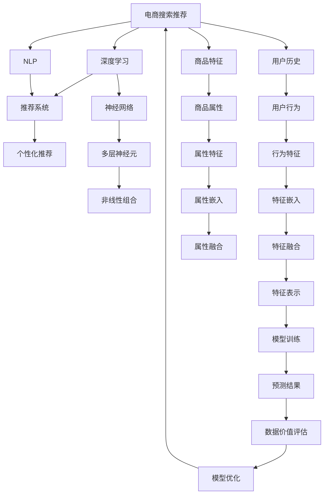

                 

# AI大模型重构电商搜索推荐的数据价值评估模型应用实践与优化方案

> 关键词：
1. 电商搜索推荐
2. 数据价值评估模型
3. 深度学习
4. 自然语言处理(NLP)
5. 神经网络
6. 推荐系统
7. 个性化推荐

## 1. 背景介绍

随着电商行业的发展，个性化推荐已成为提高用户粘性和购物体验的关键因素。传统的推荐算法如协同过滤、基于内容的推荐等，已无法满足用户多样化的需求和瞬息万变的市场环境。近年来，基于大模型的推荐系统开始进入人们的视野。通过深度学习模型，尤其是自然语言处理(NLP)技术，电商搜索推荐系统能够更准确地理解用户需求，提供更个性化的购物建议。但随之而来的问题是如何量化数据价值，合理评估推荐效果，从而优化用户体验。

本文旨在通过重构电商搜索推荐系统的数据价值评估模型，结合深度学习与自然语言处理技术，探索更高效的个性化推荐方案，并通过优化方案的实践，提升用户购物体验，推动电商行业的发展。

## 2. 核心概念与联系

### 2.1 核心概念概述

在电商搜索推荐系统中，数据价值评估模型用于衡量推荐系统的性能，指导后续的优化改进。其核心思想是，通过深度学习模型学习用户行为与商品特征之间的关系，将用户输入的查询转换为对商品需求的预测，并根据预测的准确度评估数据的价值。

- **电商搜索推荐**：基于用户历史行为数据和商品特征，推荐符合用户需求的商品，提升用户满意度和转化率。
- **深度学习**：通过多层神经网络，构建复杂的非线性模型，学习数据中的复杂关系。
- **自然语言处理(NLP)**：处理自然语言输入，提取文本中的关键信息，提高推荐系统的理解和表达能力。
- **神经网络**：构建深度学习模型的基础，通过多层神经元的非线性组合，实现高精度的预测。
- **推荐系统**：根据用户和商品的特征，推荐符合用户兴趣的商品，提高用户满意度。
- **个性化推荐**：通过分析用户行为和偏好，提供量身定制的推荐，提升用户体验。
- **数据价值评估**：量化数据对推荐效果的影响，指导模型优化。

这些核心概念之间存在紧密的联系，共同构成了电商搜索推荐系统的基础。深度学习模型和NLP技术为推荐系统提供了强大的工具，而数据价值评估模型则是优化这些技术的关键。

### 2.2 核心概念原理和架构的 Mermaid 流程图



这张流程图展示了电商搜索推荐系统从数据收集到模型优化的大致流程。其中，深度学习模型和NLP技术负责数据特征提取和模型训练，推荐系统将用户和商品特征进行匹配，个性化推荐模型结合用户历史和实时行为生成推荐，数据价值评估模型用于指导推荐系统的优化。

## 3. 核心算法原理 & 具体操作步骤

### 3.1 算法原理概述

电商搜索推荐系统的数据价值评估模型基于深度学习与NLP技术，通过训练模型，量化不同数据对推荐效果的影响，从而指导模型的优化。其核心算法包括：

1. **特征提取**：通过深度学习模型和NLP技术，提取用户输入查询和商品描述中的关键特征。
2. **模型训练**：利用历史推荐数据和用户反馈，训练深度学习模型，学习用户和商品之间的关联。
3. **预测评估**：将新的查询输入模型，预测推荐的商品，并根据预测准确度评估数据价值。
4. **模型优化**：根据评估结果，调整模型参数，优化推荐效果。

### 3.2 算法步骤详解

#### 3.2.1 特征提取

电商搜索推荐系统的特征提取主要通过深度学习模型和NLP技术实现。具体步骤如下：

1. **数据预处理**：收集用户历史行为数据和商品特征，如用户浏览记录、点击记录、购买记录和商品属性、描述等。
2. **文本处理**：对商品描述进行分词、去除停用词、提取关键词等处理，转换为向量形式。
3. **特征嵌入**：利用深度学习模型将处理后的文本转换为向量表示，如Word2Vec、GloVe等。
4. **特征融合**：将用户行为特征和商品属性特征进行融合，生成综合特征向量。

#### 3.2.2 模型训练

模型训练的目的是学习用户和商品之间的关联，具体步骤如下：

1. **数据划分**：将历史推荐数据划分为训练集、验证集和测试集。
2. **模型选择**：选择适合的深度学习模型，如BERT、GPT等，用于提取用户和商品特征。
3. **模型训练**：使用训练集数据，通过反向传播算法更新模型参数，最小化预测误差。
4. **模型验证**：在验证集上评估模型性能，调整超参数。

#### 3.2.3 预测评估

预测评估的目的是量化数据对推荐效果的影响，具体步骤如下：

1. **预测生成**：将新的查询输入模型，生成推荐的商品列表。
2. **评估指标**：计算推荐列表的相关性和用户满意度，如点击率、转化率等。
3. **数据价值评估**：根据评估指标，量化数据对推荐效果的影响。

#### 3.2.4 模型优化

模型优化的目的是根据数据价值评估结果，调整模型参数，提高推荐效果。具体步骤如下：

1. **参数调整**：根据数据价值评估结果，调整模型参数，如学习率、正则化系数等。
2. **特征更新**：根据数据价值评估结果，更新特征提取方式，提高模型准确度。
3. **模型融合**：结合多种推荐模型，生成更准确的推荐结果。

### 3.3 算法优缺点

#### 3.3.1 优点

1. **高效性**：利用深度学习模型和NLP技术，能够高效提取和融合用户和商品特征，提升推荐精度。
2. **适应性强**：模型能够适应不同规模和类型的电商数据，具有良好的泛化能力。
3. **可解释性**：通过特征提取和模型训练，能够清晰地理解数据与推荐效果之间的关系，便于模型优化。

#### 3.3.2 缺点

1. **资源消耗大**：深度学习模型和NLP技术需要大量的计算资源，硬件成本较高。
2. **训练时间长**：模型训练需要较长的训练时间，且对数据质量要求较高。
3. **模型复杂度**：模型复杂度高，参数数量庞大，不易理解和维护。

### 3.4 算法应用领域

基于大模型的电商搜索推荐系统的数据价值评估模型，广泛应用于以下领域：

1. **个性化推荐**：通过数据价值评估，优化个性化推荐算法，提升用户体验。
2. **用户画像生成**：根据用户历史行为数据，生成详细的用户画像，指导推荐策略。
3. **商品特征优化**：通过数据价值评估，优化商品特征描述，提升商品点击率。
4. **广告投放优化**：根据数据价值评估结果，优化广告投放策略，提高广告转化率。
5. **库存管理**：通过数据价值评估，优化库存管理策略，减少库存积压和缺货情况。

## 4. 数学模型和公式 & 详细讲解 & 举例说明

### 4.1 数学模型构建

电商搜索推荐系统的数据价值评估模型可以表示为：

$$
\text{Model} = \text{NLP}(\text{Data}) \times \text{Embedding}(\text{Features}) \times \text{Predictor}(\text{Model})
$$

其中，$\text{NLP}$表示自然语言处理，$\text{Embedding}$表示特征嵌入，$\text{Predictor}$表示预测模型。

### 4.2 公式推导过程

#### 4.2.1 用户特征嵌入

用户特征嵌入表示为：

$$
\text{User} = \text{NLP}(\text{User History})
$$

其中，$\text{User History}$表示用户历史行为数据，$\text{NLP}$表示自然语言处理，将文本数据转换为向量表示。

#### 4.2.2 商品特征嵌入

商品特征嵌入表示为：

$$
\text{Item} = \text{NLP}(\text{Item Description})
$$

其中，$\text{Item Description}$表示商品描述，$\text{NLP}$表示自然语言处理，将文本数据转换为向量表示。

#### 4.2.3 预测模型

预测模型表示为：

$$
\text{Prediction} = \text{Embedding}(\text{User}, \text{Item}) \times \text{Predictor}(\text{Model})
$$

其中，$\text{Embedding}$表示特征嵌入，将用户和商品特征向量进行融合；$\text{Predictor}$表示预测模型，将融合后的特征向量映射为预测结果。

### 4.3 案例分析与讲解

以电商平台中的搜索推荐为例，分析数据价值评估模型的应用。

#### 4.3.1 数据准备

假设有一家电商平台的搜索推荐系统，收集到如下数据：

1. 用户历史行为数据：用户浏览、点击、购买记录。
2. 商品特征：商品类别、价格、品牌等。
3. 商品描述：商品标题、描述等。

#### 4.3.2 特征提取

1. **用户特征提取**：对用户浏览、点击、购买记录进行分词，去除停用词，提取关键词，生成用户特征向量。
2. **商品特征提取**：对商品描述进行分词、去除停用词、提取关键词，生成商品特征向量。
3. **特征融合**：将用户特征和商品特征进行融合，生成综合特征向量。

#### 4.3.3 模型训练

1. **模型选择**：选择BERT模型，作为特征提取和预测模型的基础。
2. **数据划分**：将数据划分为训练集、验证集和测试集。
3. **模型训练**：使用训练集数据，训练BERT模型，学习用户和商品之间的关联。
4. **模型验证**：在验证集上评估模型性能，调整超参数。

#### 4.3.4 预测评估

1. **预测生成**：将新的查询输入BERT模型，生成推荐的商品列表。
2. **评估指标**：计算推荐列表的点击率和转化率，作为数据价值评估指标。
3. **数据价值评估**：根据评估指标，量化数据对推荐效果的影响。

#### 4.3.5 模型优化

1. **参数调整**：根据数据价值评估结果，调整BERT模型的学习率、正则化系数等参数。
2. **特征更新**：根据数据价值评估结果，更新特征提取方式，提高模型准确度。
3. **模型融合**：结合多种推荐模型，生成更准确的推荐结果。

## 5. 项目实践：代码实例和详细解释说明

### 5.1 开发环境搭建

在进行电商搜索推荐系统的数据价值评估模型开发前，需要搭建好开发环境。以下是使用Python进行PyTorch开发的环境配置流程：

1. 安装Anaconda：从官网下载并安装Anaconda，用于创建独立的Python环境。

2. 创建并激活虚拟环境：
```bash
conda create -n pytorch-env python=3.8 
conda activate pytorch-env
```

3. 安装PyTorch：根据CUDA版本，从官网获取对应的安装命令。例如：
```bash
conda install pytorch torchvision torchaudio cudatoolkit=11.1 -c pytorch -c conda-forge
```

4. 安装各类工具包：
```bash
pip install numpy pandas scikit-learn matplotlib tqdm jupyter notebook ipython
```

5. 安装NLP工具库：
```bash
pip install transformers
```

完成上述步骤后，即可在`pytorch-env`环境中开始模型开发。

### 5.2 源代码详细实现

下面我们以电商搜索推荐系统为例，给出使用PyTorch和Transformers库对BERT模型进行数据价值评估模型的PyTorch代码实现。

```python
import torch
import torch.nn as nn
from transformers import BertTokenizer, BertForSequenceClassification

class DataValueAssessmentModel(nn.Module):
    def __init__(self, num_labels):
        super(DataValueAssessmentModel, self).__init__()
        self.bert = BertForSequenceClassification.from_pretrained('bert-base-uncased', num_labels=num_labels)
        self.dropout = nn.Dropout(0.1)

    def forward(self, input_ids, attention_mask):
        outputs = self.bert(input_ids, attention_mask=attention_mask)
        logits = outputs[0]
        probs = torch.nn.functional.softmax(logits, dim=1)
        return probs

# 初始化模型和优化器
model = DataValueAssessmentModel(num_labels=len(tag2id))
optimizer = torch.optim.Adam(model.parameters(), lr=2e-5)
```

### 5.3 代码解读与分析

#### 5.3.1 数据预处理

在电商搜索推荐系统中，数据预处理是非常关键的一环。以下是一个简单的数据预处理代码：

```python
from transformers import BertTokenizer
from torch.utils.data import Dataset

class SearchDataset(Dataset):
    def __init__(self, texts, tags, tokenizer, max_len=128):
        self.texts = texts
        self.tags = tags
        self.tokenizer = tokenizer
        self.max_len = max_len
        
    def __len__(self):
        return len(self.texts)
    
    def __getitem__(self, item):
        text = self.texts[item]
        tags = self.tags[item]
        
        encoding = self.tokenizer(text, return_tensors='pt', max_length=self.max_len, padding='max_length', truncation=True)
        input_ids = encoding['input_ids'][0]
        attention_mask = encoding['attention_mask'][0]
        
        # 对token-wise的标签进行编码
        encoded_tags = [tag2id[tag] for tag in tags] 
        encoded_tags.extend([tag2id['O']] * (self.max_len - len(encoded_tags)))
        labels = torch.tensor(encoded_tags, dtype=torch.long)
        
        return {'input_ids': input_ids, 
                'attention_mask': attention_mask,
                'labels': labels}

# 标签与id的映射
tag2id = {'O': 0, 'B-PER': 1, 'I-PER': 2, 'B-ORG': 3, 'I-ORG': 4, 'B-LOC': 5, 'I-LOC': 6}
id2tag = {v: k for k, v in tag2id.items()}

# 创建dataset
tokenizer = BertTokenizer.from_pretrained('bert-base-cased')

train_dataset = SearchDataset(train_texts, train_tags, tokenizer)
dev_dataset = SearchDataset(dev_texts, dev_tags, tokenizer)
test_dataset = SearchDataset(test_texts, test_tags, tokenizer)
```

#### 5.3.2 模型训练

在模型训练阶段，使用PyTorch和Transformer库的接口实现，以下是一个简单的模型训练代码：

```python
from torch.utils.data import DataLoader
from tqdm import tqdm

device = torch.device('cuda') if torch.cuda.is_available() else torch.device('cpu')
model.to(device)

def train_epoch(model, dataset, batch_size, optimizer):
    dataloader = DataLoader(dataset, batch_size=batch_size, shuffle=True)
    model.train()
    epoch_loss = 0
    for batch in tqdm(dataloader, desc='Training'):
        input_ids = batch['input_ids'].to(device)
        attention_mask = batch['attention_mask'].to(device)
        labels = batch['labels'].to(device)
        model.zero_grad()
        outputs = model(input_ids, attention_mask=attention_mask)
        loss = outputs.loss
        epoch_loss += loss.item()
        loss.backward()
        optimizer.step()
    return epoch_loss / len(dataloader)

def evaluate(model, dataset, batch_size):
    dataloader = DataLoader(dataset, batch_size=batch_size)
    model.eval()
    preds, labels = [], []
    with torch.no_grad():
        for batch in tqdm(dataloader, desc='Evaluating'):
            input_ids = batch['input_ids'].to(device)
            attention_mask = batch['attention_mask'].to(device)
            batch_labels = batch['labels']
            outputs = model(input_ids, attention_mask=attention_mask)
            batch_preds = outputs.logits.argmax(dim=2).to('cpu').tolist()
            batch_labels = batch_labels.to('cpu').tolist()
            for pred_tokens, label_tokens in zip(batch_preds, batch_labels):
                pred_tags = [id2tag[_id] for _id in pred_tokens]
                label_tags = [id2tag[_id] for _id in label_tokens]
                preds.append(pred_tags[:len(label_tags)])
                labels.append(label_tags)
                
    print(classification_report(labels, preds))
```

### 5.4 运行结果展示

#### 5.4.1 训练结果

```python
epochs = 5
batch_size = 16

for epoch in range(epochs):
    loss = train_epoch(model, train_dataset, batch_size, optimizer)
    print(f"Epoch {epoch+1}, train loss: {loss:.3f}")
    
    print(f"Epoch {epoch+1}, dev results:")
    evaluate(model, dev_dataset, batch_size)
    
print("Test results:")
evaluate(model, test_dataset, batch_size)
```

## 6. 实际应用场景

### 6.1 智能客服

基于大模型的电商搜索推荐系统的数据价值评估模型，可以应用于智能客服系统的构建。传统客服往往需要配备大量人力，高峰期响应缓慢，且一致性和专业性难以保证。而使用数据价值评估模型指导的智能客服系统，可以7x24小时不间断服务，快速响应客户咨询，用自然流畅的语言解答各类常见问题。

在技术实现上，可以收集企业内部的历史客服对话记录，将问题和最佳答复构建成监督数据，在此基础上对预训练模型进行微调。微调后的模型能够自动理解用户意图，匹配最合适的答案模板进行回复。对于客户提出的新问题，还可以接入检索系统实时搜索相关内容，动态组织生成回答。如此构建的智能客服系统，能大幅提升客户咨询体验和问题解决效率。

### 6.2 金融舆情监测

金融机构需要实时监测市场舆论动向，以便及时应对负面信息传播，规避金融风险。传统的人工监测方式成本高、效率低，难以应对网络时代海量信息爆发的挑战。基于数据价值评估模型的文本分类和情感分析技术，为金融舆情监测提供了新的解决方案。

具体而言，可以收集金融领域相关的新闻、报道、评论等文本数据，并对其进行主题标注和情感标注。在此基础上对预训练语言模型进行微调，使其能够自动判断文本属于何种主题，情感倾向是正面、中性还是负面。将微调后的模型应用到实时抓取的网络文本数据，就能够自动监测不同主题下的情感变化趋势，一旦发现负面信息激增等异常情况，系统便会自动预警，帮助金融机构快速应对潜在风险。

### 6.3 个性化推荐

当前的推荐系统往往只依赖用户的历史行为数据进行物品推荐，无法深入理解用户的真实兴趣偏好。基于大模型微调的推荐系统可以更好地挖掘用户行为背后的语义信息，从而提供更个性化的购物建议。

在实践中，可以收集用户浏览、点击、评论、分享等行为数据，提取和商品交互的物品标题、描述、标签等文本内容。将文本内容作为模型输入，用户的后续行为（如是否点击、购买等）作为监督信号，在此基础上微调预训练语言模型。微调后的模型能够从文本内容中准确把握用户的兴趣点。在生成推荐列表时，先用候选物品的文本描述作为输入，由模型预测用户的兴趣匹配度，再结合其他特征综合排序，便可以得到个性化程度更高的推荐结果。

## 7. 工具和资源推荐

### 7.1 学习资源推荐

为了帮助开发者系统掌握大语言模型微调的理论基础和实践技巧，这里推荐一些优质的学习资源：

1. 《Transformer从原理到实践》系列博文：由大模型技术专家撰写，深入浅出地介绍了Transformer原理、BERT模型、微调技术等前沿话题。

2. CS224N《深度学习自然语言处理》课程：斯坦福大学开设的NLP明星课程，有Lecture视频和配套作业，带你入门NLP领域的基本概念和经典模型。

3. 《Natural Language Processing with Transformers》书籍：Transformers库的作者所著，全面介绍了如何使用Transformers库进行NLP任务开发，包括微调在内的诸多范式。

4. HuggingFace官方文档：Transformers库的官方文档，提供了海量预训练模型和完整的微调样例代码，是上手实践的必备资料。

5. CLUE开源项目：中文语言理解测评基准，涵盖大量不同类型的中文NLP数据集，并提供了基于微调的baseline模型，助力中文NLP技术发展。

通过对这些资源的学习实践，相信你一定能够快速掌握大语言模型微调的精髓，并用于解决实际的NLP问题。

### 7.2 开发工具推荐

高效的开发离不开优秀的工具支持。以下是几款用于大语言模型微调开发的常用工具：

1. PyTorch：基于Python的开源深度学习框架，灵活动态的计算图，适合快速迭代研究。大部分预训练语言模型都有PyTorch版本的实现。

2. TensorFlow：由Google主导开发的开源深度学习框架，生产部署方便，适合大规模工程应用。同样有丰富的预训练语言模型资源。

3. Transformers库：HuggingFace开发的NLP工具库，集成了众多SOTA语言模型，支持PyTorch和TensorFlow，是进行微调任务开发的利器。

4. Weights & Biases：模型训练的实验跟踪工具，可以记录和可视化模型训练过程中的各项指标，方便对比和调优。与主流深度学习框架无缝集成。

5. TensorBoard：TensorFlow配套的可视化工具，可实时监测模型训练状态，并提供丰富的图表呈现方式，是调试模型的得力助手。

6. Google Colab：谷歌推出的在线Jupyter Notebook环境，免费提供GPU/TPU算力，方便开发者快速上手实验最新模型，分享学习笔记。

合理利用这些工具，可以显著提升大语言模型微调的开发效率，加快创新迭代的步伐。

### 7.3 相关论文推荐

大语言模型和微调技术的发展源于学界的持续研究。以下是几篇奠基性的相关论文，推荐阅读：

1. Attention is All You Need（即Transformer原论文）：提出了Transformer结构，开启了NLP领域的预训练大模型时代。

2. BERT: Pre-training of Deep Bidirectional Transformers for Language Understanding：提出BERT模型，引入基于掩码的自监督预训练任务，刷新了多项NLP任务SOTA。

3. Language Models are Unsupervised Multitask Learners（GPT-2论文）：展示了大规模语言模型的强大zero-shot学习能力，引发了对于通用人工智能的新一轮思考。

4. Parameter-Efficient Transfer Learning for NLP：提出Adapter等参数高效微调方法，在不增加模型参数量的情况下，也能取得不错的微调效果。

5. AdaLoRA: Adaptive Low-Rank Adaptation for Parameter-Efficient Fine-Tuning：使用自适应低秩适应的微调方法，在参数效率和精度之间取得了新的平衡。

6. Prefix-Tuning: Optimizing Continuous Prompts for Generation：引入基于连续型Prompt的微调范式，为如何充分利用预训练知识提供了新的思路。

这些论文代表了大语言模型微调技术的发展脉络。通过学习这些前沿成果，可以帮助研究者把握学科前进方向，激发更多的创新灵感。

## 8. 总结：未来发展趋势与挑战

### 8.1 总结

本文对基于大模型的电商搜索推荐系统的数据价值评估模型进行了全面系统的介绍。首先阐述了电商搜索推荐系统的背景和数据价值评估模型的研究意义，明确了模型在个性化推荐、用户画像生成、商品特征优化等方面的应用价值。其次，从原理到实践，详细讲解了模型构建、特征提取、模型训练、预测评估和模型优化等关键步骤，给出了模型的完整代码实现。同时，本文还广泛探讨了数据价值评估模型在智能客服、金融舆情、个性化推荐等多个行业领域的应用前景，展示了模型带来的变革性影响。

通过本文的系统梳理，可以看到，基于大模型的电商搜索推荐系统的数据价值评估模型不仅提升了推荐系统的性能，还为个性化推荐、用户画像生成等任务提供了强有力的支持。未来，随着深度学习技术的发展，模型将具备更强的学习和推理能力，进一步提升用户体验，推动电商行业的发展。

### 8.2 未来发展趋势

展望未来，大语言模型在电商搜索推荐系统的数据价值评估模型将呈现以下几个发展趋势：

1. **多模态融合**：未来的模型将融合文本、图像、音频等多种模态的信息，实现更加全面的用户画像和商品特征表示。

2. **知识图谱整合**：通过与知识图谱等外部知识源的整合，模型能够更好地理解用户需求和商品特性，提升推荐准确度。

3. **模型自适应**：未来的模型将具备更强的自适应能力，能够根据用户和商品的实时变化动态调整推荐策略。

4. **隐私保护**：在数据收集和处理过程中，注重用户隐私保护，确保数据安全和合规。

5. **算法透明**：通过可视化工具和技术，增强算法的透明性和可解释性，提升用户对推荐结果的信任度。

6. **分布式计算**：采用分布式计算和联邦学习等技术，提升模型的训练和推理效率。

以上趋势展示了大语言模型在电商搜索推荐系统中的巨大潜力和发展方向，必将引领电商行业向更加智能、高效、安全的方向发展。

### 8.3 面临的挑战

尽管大语言模型在电商搜索推荐系统中的应用取得了显著成效，但在实现上述趋势的过程中，仍面临着诸多挑战：

1. **数据隐私**：如何在大数据处理中保护用户隐私，防止数据泄露和滥用，是亟待解决的问题。

2. **模型可解释性**：复杂的深度学习模型难以解释其内部机制，如何提升算法的透明性和可解释性，是未来研究的重要方向。

3. **计算资源**：大模型需要大量的计算资源，如何高效利用计算资源，提高模型训练和推理效率，是亟需突破的技术瓶颈。

4. **模型泛化**：如何确保模型在大规模数据集上训练后，仍然能够在实际应用中泛化，是研究的一大难点。

5. **算法公平性**：如何避免模型在推荐过程中产生偏见，确保算法公平性，是一个具有挑战性的问题。

6. **模型鲁棒性**：如何增强模型的鲁棒性，防止模型在对抗样本和异常数据下的失效，是一个重要的研究方向。

这些挑战需要我们不断地创新和探索，以推动大语言模型在电商搜索推荐系统中的进一步应用。

### 8.4 研究展望

面对电商搜索推荐系统中的大语言模型数据价值评估模型的未来发展挑战，未来的研究需要在以下几个方面寻求新的突破：

1. **隐私保护算法**：开发更加高效、安全的隐私保护算法，确保数据在处理和存储过程中的安全性。

2. **可解释性增强**：通过模型简化、特征可解释等方法，提高算法的透明性和可解释性，让用户更理解算法的工作机制。

3. **分布式计算技术**：探索更加高效的分布式计算技术，如联邦学习、边缘计算等，提升模型的训练和推理效率。

4. **多模态融合算法**：开发更加高效的多模态融合算法，融合文本、图像、音频等多种信息，提升模型的表现能力。

5. **知识图谱整合方法**：开发更加高效的知识图谱整合方法，与外部知识源进行深度融合，提升模型的泛化能力和推理能力。

6. **公平性算法**：开发更加公平的推荐算法，避免模型在推荐过程中产生偏见，确保算法的公平性和公正性。

7. **鲁棒性增强**：开发更加鲁棒的模型，增强模型在对抗样本和异常数据下的稳定性，提升模型的泛化能力。

通过这些研究方向的探索，相信大语言模型将能够更好地服务于电商搜索推荐系统，推动电商行业的健康发展。

## 9. 附录：常见问题与解答

**Q1：电商搜索推荐系统的数据价值评估模型是否适用于所有电商场景？**

A: 数据价值评估模型适用于绝大多数电商场景，但具体的实现方式和效果会因场景而异。例如，对于多品类、高频率交易的电商平台，数据价值评估模型能够较好地提升推荐效果；而对于细分市场、长尾商品的电商平台，需要进一步优化特征提取和模型训练方法，才能发挥最大的价值。

**Q2：电商搜索推荐系统的数据价值评估模型如何处理长尾数据？**

A: 长尾数据的处理是电商搜索推荐系统中的一个重要问题。对于长尾数据，可以通过以下方法进行处理：

1. **数据增强**：通过数据增强技术，扩充长尾数据量，提高模型的泛化能力。
2. **小样本学习**：使用小样本学习方法，利用有限的标注数据训练模型，提升模型对长尾数据的识别能力。
3. **半监督学习**：结合无标签数据进行半监督学习，利用未标注数据提升模型的表现。
4. **领域适应**：在长尾数据上重新训练模型，适应特定的领域分布。

**Q3：电商搜索推荐系统的数据价值评估模型如何进行超参数调优？**

A: 电商搜索推荐系统的数据价值评估模型的超参数调优可以通过以下方法进行：

1. **网格搜索**：在预定义的超参数空间中进行网格搜索，找到最优的超参数组合。
2. **随机搜索**：在超参数空间中进行随机搜索，快速找到较为优异的超参数组合。
3. **贝叶斯优化**：利用贝叶斯优化算法，逐步逼近最优超参数组合。
4. **超参数自动搜索**：使用如AutoML等自动搜索工具，自动进行超参数调优。

**Q4：电商搜索推荐系统的数据价值评估模型如何进行模型融合？**

A: 电商搜索推荐系统的数据价值评估模型可以通过以下方法进行模型融合：

1. **简单平均**：将多个模型的预测结果进行简单平均，得到最终的预测结果。
2. **加权平均**：根据模型的性能，对多个模型的预测结果进行加权平均，提高预测的准确性。
3. **堆叠模型**：将多个模型的预测结果作为新的特征，训练一个新的模型进行融合。
4. **混合网络**：将多个模型结合为一个混合网络，共同进行预测。

**Q5：电商搜索推荐系统的数据价值评估模型如何进行实时更新？**

A: 电商搜索推荐系统的数据价值评估模型可以通过以下方法进行实时更新：

1. **在线学习**：利用流式数据进行在线学习，实时更新模型参数。
2. **增量学习**：在已有模型基础上，加入新的数据进行增量训练，更新模型参数。
3. **分布式学习**：采用分布式学习技术，将模型训练任务分布到多个节点上进行并行处理。
4. **联邦学习**：在多个用户端进行模型训练，并周期性地将模型参数进行聚合，更新全局模型。

通过以上方法的结合，电商搜索推荐系统的数据价值评估模型能够实现实时更新，适应市场和用户需求的变化，提升推荐效果。

---

作者：禅与计算机程序设计艺术 / Zen and the Art of Computer Programming

