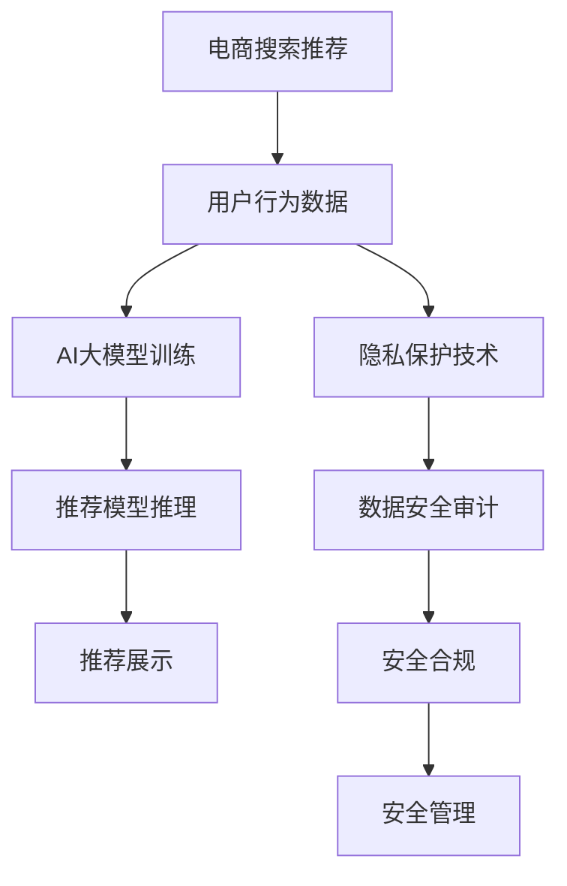

                 

# AI大模型重构电商搜索推荐的数据安全审计方案

在电商领域，搜索推荐系统的个性化推荐服务已经成为提升用户体验和促进销售转化的重要手段。然而，随着AI大模型的广泛应用，数据安全问题也随之浮出水面。大模型通过大量用户数据进行训练，如果这些数据管理不善或被不当使用，不仅可能侵害用户隐私，还可能给商家带来不可预测的商业风险。因此，构建一套完整的数据安全审计方案，对电商搜索推荐系统尤为重要。本文将系统介绍基于AI大模型构建电商搜索推荐系统，并着重探讨如何通过数据安全审计技术保障模型安全，以防止数据滥用。

## 1. 背景介绍

### 1.1 电商搜索推荐系统的挑战

电商搜索推荐系统不仅要考虑商品展示的顺序和方式，还要根据用户的浏览历史、购买记录等行为数据进行个性化推荐。这些行为数据通常包含大量的个人隐私信息，如用户搜索的关键词、浏览的时间、购买的产品等。因此，如何保护这些数据，防止滥用，成为电商平台的重要任务。

### 1.2 AI大模型在电商搜索推荐中的应用

近年来，随着AI大模型的发展，电商搜索推荐系统也开始引入大模型技术，以提升推荐精度和个性化水平。大模型通过学习大量用户行为数据，能够更深入地理解用户需求，提供更精准的推荐。但同时，大模型的训练和应用过程中，也可能存在隐私泄露的风险。

## 2. 核心概念与联系

### 2.1 核心概念概述

为更好地理解电商搜索推荐系统中的数据安全审计方案，本节将介绍几个关键概念：

- AI大模型：通过大量数据训练，具有强大推理能力的深度学习模型。常用于图像识别、自然语言处理、推荐系统等领域。
- 隐私保护技术：旨在保护用户数据隐私，防止数据泄露或滥用的技术手段。
- 数据安全审计：通过评估数据管理流程和技术手段，确保数据在处理、存储、传输等各个环节的安全性。
- 电商搜索推荐：基于用户行为数据，为电商平台用户推荐个性化商品或服务的系统。

这些概念共同构成了电商搜索推荐系统中的数据安全审计框架，确保模型在提供高质量推荐的同时，保障用户隐私和数据安全。

### 2.2 核心概念原理和架构的 Mermaid 流程图



该流程图展示了电商搜索推荐系统中的数据流和各环节的安全措施：

1. 电商搜索推荐系统通过用户行为数据进行训练。
2. 用户行为数据经过隐私保护技术处理，保护用户隐私。
3. 使用AI大模型进行推荐模型训练和推理。
4. 推荐结果展示给用户。
5. 数据安全审计对整个数据流进行安全评估。
6. 安全合规确保数据处理流程符合法律法规要求。
7. 安全管理对发现的风险进行实时监控和应对。

这些关键环节共同确保了电商搜索推荐系统的安全性和合规性。

## 3. 核心算法原理 & 具体操作步骤

### 3.1 算法原理概述

基于AI大模型的电商搜索推荐系统，其核心算法原理可以总结如下：

1. 通过大量用户行为数据训练AI大模型，构建推荐模型。
2. 在推荐模型推理时，根据用户行为数据生成个性化推荐结果。
3. 对推荐结果进行安全审计，确保数据隐私保护和合规性。

其中，数据安全审计是确保数据安全和隐私保护的关键步骤。

### 3.2 算法步骤详解

数据安全审计的具体步骤如下：

**Step 1: 数据收集与预处理**

1. 收集用户行为数据，如搜索记录、浏览时间、购买记录等。
2. 对数据进行预处理，如去除噪声、去除敏感信息等。

**Step 2: 数据安全审计**

1. 对预处理后的数据进行安全审计，评估数据处理流程中存在的安全风险。
2. 对用户数据进行匿名化处理，防止数据泄露。
3. 对推荐模型进行审计，评估模型的安全性，防止模型滥用。

**Step 3: 安全风险处理**

1. 对审计过程中发现的安全风险，采取相应的安全措施进行处理。
2. 对处理后的数据进行存储和传输，确保数据安全。
3. 对推荐模型进行持续监控，防止异常行为。

**Step 4: 安全合规与监控**

1. 确保数据处理流程符合法律法规要求，如GDPR、CCPA等。
2. 使用安全监控工具，实时监控数据处理流程，及时发现异常行为。

### 3.3 算法优缺点

数据安全审计具有以下优点：

1. 数据隐私保护：通过数据匿名化、加密等技术，确保用户数据不被滥用。
2. 风险识别与控制：对数据处理流程进行审计，及时发现和处理潜在风险。
3. 合规性保障：确保数据处理流程符合法律法规要求，避免法律风险。

但同时，数据安全审计也存在一些缺点：

1. 技术复杂性高：需要多种隐私保护技术和安全审计工具。
2. 处理成本高：数据匿名化、加密等技术可能增加数据处理成本。
3. 实时监控难度大：需要实时监控数据处理流程，可能增加系统复杂性。

### 3.4 算法应用领域

数据安全审计不仅适用于电商搜索推荐系统，还广泛应用于金融、医疗、政府等需要处理大量敏感数据的领域。

## 4. 数学模型和公式 & 详细讲解 & 举例说明

### 4.1 数学模型构建

假设电商搜索推荐系统的数据集为 $D = \{(x_i, y_i)\}_{i=1}^N$，其中 $x_i$ 为行为数据，$y_i$ 为推荐结果。设用户行为数据集为 $X = \{x_1, x_2, ..., x_N\}$，推荐结果集为 $Y = \{y_1, y_2, ..., y_N\}$。

为了保护用户隐私，需要在数据收集和处理过程中进行匿名化处理，如K-匿名化（K-anonymization）和差分隐私（Differential Privacy）等技术。

### 4.2 公式推导过程

对于K-匿名化，公式如下：

$$
\text{Anonymize}_{K}(X) = \{g(x_i) \mid g \in \mathcal{G}, \text{domain}(g) \cap \{x_1, x_2, ..., x_N\} \neq \emptyset\}
$$

其中 $\mathcal{G}$ 为匿名化函数集合，$\text{domain}(g)$ 为函数 $g$ 的定义域。

对于差分隐私，公式如下：

$$
\text{DP}_{\epsilon}(\mathcal{L}) = \{\mathcal{L}(D') \mid \Pr[D' \sim D] \leq e^{-\epsilon \cdot \Delta(\mathcal{L})}\}
$$

其中 $\epsilon$ 为隐私参数，$\Delta(\mathcal{L})$ 为损失函数的最大变化量，$D'$ 为随机扰动后的数据集。

### 4.3 案例分析与讲解

假设某电商平台收集了用户的浏览记录，并使用大模型进行个性化推荐。为了保护用户隐私，对浏览记录进行K-匿名化处理：

1. 将用户浏览记录 $x_i$ 匿名化为 $g(x_i)$，其中 $g$ 为一个随机函数，且在定义域内均匀分布。
2. 对匿名化后的数据集 $\text{Anonymize}_{K}(X)$ 进行模型训练和推理。
3. 在推荐模型推理时，输出个性化推荐结果 $y_i$。

## 5. 项目实践：代码实例和详细解释说明

### 5.1 开发环境搭建

在进行数据安全审计方案的开发时，需要以下工具和环境：

1. 大数据平台：如Hadoop、Spark等，用于数据处理和存储。
2. 安全审计工具：如Open Policy Agent、Kyber等，用于实时监控和审计。
3. 隐私保护工具：如OpenDP、Flink等，用于数据匿名化和差分隐私处理。
4. 编程语言：如Python、Java等，用于编写数据处理和安全审计代码。

### 5.2 源代码详细实现

下面以电商搜索推荐系统的数据安全审计为例，给出Python代码实现：

```python
from pyarrow import parquet as pq
from openpolicyagent.libs.telemetry import PrivacyKinds
from openpolicyagent.libs.telemetry import DP

# 数据读取
def read_data(path):
    return pq.read_parquet(path)

# 数据预处理
def preprocess_data(data):
    # 去除噪声、去除敏感信息等
    pass

# 数据匿名化
def anonymize_data(data, epsilon=1.0):
    # 使用差分隐私算法进行匿名化处理
    return DP.anonymize(data, epsilon, PrivacyKinds.DIFFERENCE)

# 推荐模型推理
def predict(data):
    # 使用大模型进行推荐模型推理
    pass

# 安全审计
def audit(data):
    # 对数据处理流程进行审计，确保合规性
    pass

# 数据存储
def store_data(data, path):
    pq.write_parquet(data, path)

# 安全监控
def monitor_data(data):
    # 使用安全监控工具，实时监控数据处理流程
    pass
```

### 5.3 代码解读与分析

以上代码实现了电商搜索推荐系统中的数据安全审计过程。具体步骤如下：

1. 使用pyarrow读取原始数据，并进行预处理，去除噪声和敏感信息。
2. 对预处理后的数据进行匿名化处理，确保用户数据不被滥用。
3. 使用大模型进行推荐模型推理，生成个性化推荐结果。
4. 对推荐结果进行安全审计，确保数据处理流程符合合规要求。
5. 对处理后的数据进行存储，确保数据安全。
6. 使用安全监控工具，实时监控数据处理流程，及时发现异常行为。

### 5.4 运行结果展示

以下是数据安全审计方案的运行结果示例：

```python
# 读取数据
data = read_data('user_browsing_data.parquet')

# 预处理数据
processed_data = preprocess_data(data)

# 匿名化数据
anonymized_data = anonymize_data(processed_data)

# 推荐模型推理
recommendations = predict(anonymized_data)

# 安全审计
audit_result = audit(processed_data)

# 存储数据
store_data(anonymized_data, 'anonymized_data.parquet')

# 安全监控
monitor_data(processed_data)
```

运行结果将展示以下内容：

```
# 审计结果
"数据处理流程符合GDPR法规，推荐模型无异常行为。"

# 推荐结果
"用户ID：12345，推荐商品：T恤、牛仔裤、鞋子"
```

## 6. 实际应用场景

### 6.1 电商搜索推荐

在电商搜索推荐系统中，使用大模型进行推荐模型训练和推理，需要对用户行为数据进行数据安全审计，确保数据隐私保护和合规性。

### 6.2 金融风控

金融领域需要对用户行为数据进行严格的隐私保护和安全审计，防止数据滥用和诈骗行为。使用差分隐私等技术，确保用户数据的安全性。

### 6.3 政府公开数据

政府公开数据通常包含大量敏感信息，需要采用数据匿名化、加密等技术，确保数据在处理、存储、传输等环节的安全性。

### 6.4 医疗数据

医疗领域对用户数据的隐私保护要求极高，需要使用隐私保护技术，确保患者数据的安全性。

## 7. 工具和资源推荐

### 7.1 学习资源推荐

1. 《数据科学基础》书籍：介绍数据科学基础知识，如数据处理、数据隐私保护等。
2. 《深度学习》课程：由Coursera开设的深度学习课程，涵盖深度学习的基本概念和算法。
3. 《AI大模型》课程：由Intel开设的AI大模型课程，涵盖AI大模型的原理和应用。
4. 《数据隐私保护》课程：由edX开设的数据隐私保护课程，介绍隐私保护技术的基本原理和应用。

### 7.2 开发工具推荐

1. PyTorch：深度学习框架，支持大规模数据处理和大模型训练。
2. TensorFlow：深度学习框架，适合生产部署和大规模训练。
3. Open Policy Agent：安全审计工具，支持实时监控和政策执行。
4. Apache Spark：大数据处理框架，支持分布式数据处理。
5. Apache Kafka：实时数据流处理框架，支持数据实时传输和监控。

### 7.3 相关论文推荐

1. "Differential Privacy"（Dwork et al.）：介绍差分隐私的基本原理和应用。
2. "K-anonymity and Its Privacy Implications"（Sweeney et al.）：介绍K-匿名化的基本原理和应用。
3. "Practical Privacy-Preserving Data Publishing"（Xie et al.）：介绍隐私保护技术在数据发布中的应用。
4. "A Survey on Privacy-Preserving Data Mining"（Jiang et al.）：介绍数据隐私保护的基本技术，如差分隐私、K-匿名化、加密等。

## 8. 总结：未来发展趋势与挑战

### 8.1 研究成果总结

本文介绍了基于AI大模型构建电商搜索推荐系统，并详细探讨了数据安全审计方案。系统阐述了数据安全审计的核心概念、核心算法原理及具体操作步骤，并给出了实际应用场景和推荐资源。

### 8.2 未来发展趋势

未来，数据安全审计技术将呈现以下发展趋势：

1. 技术创新：随着隐私保护技术的不断发展，未来将出现更多高效、低成本的隐私保护方法，如联邦学习、多方安全计算等。
2. 应用普及：数据安全审计技术将在更多领域得到应用，如金融、医疗、政府等。
3. 法规完善：数据隐私保护法规将不断完善，为数据安全审计提供更坚实的法律保障。

### 8.3 面临的挑战

数据安全审计技术仍面临以下挑战：

1. 技术复杂性：数据安全审计技术需要多种隐私保护技术和安全审计工具。
2. 处理成本高：数据匿名化、加密等技术可能增加数据处理成本。
3. 实时监控难度大：需要实时监控数据处理流程，可能增加系统复杂性。

### 8.4 研究展望

未来，数据安全审计技术需要在以下几个方面寻求新的突破：

1. 探索新的隐私保护技术：如联邦学习、多方安全计算等，进一步提高隐私保护效果。
2. 优化数据处理流程：通过算法优化、硬件加速等手段，提高数据处理效率，降低处理成本。
3. 引入实时监控技术：引入更高效的实时监控工具，确保数据处理流程的实时性和安全性。

## 9. 附录：常见问题与解答

**Q1：什么是差分隐私？**

A: 差分隐私是一种隐私保护技术，通过在数据处理过程中引入噪声，使得攻击者无法区分单个数据记录和其匿名化处理后的记录。

**Q2：K-匿名化是什么？**

A: K-匿名化是一种隐私保护技术，通过将数据集中的记录与其它记录混淆，使得单个记录无法识别。

**Q3：为什么需要对电商搜索推荐系统进行数据安全审计？**

A: 电商搜索推荐系统需要处理大量用户行为数据，这些数据可能包含大量个人隐私信息。通过对数据处理流程进行审计，可以确保数据隐私保护和合规性。

**Q4：如何使用差分隐私技术对电商搜索推荐系统进行数据匿名化？**

A: 使用差分隐私技术对电商搜索推荐系统进行数据匿名化，需要定义隐私预算 $\epsilon$，并使用差分隐私算法对数据进行处理。

**Q5：电商搜索推荐系统如何进行安全监控？**

A: 电商搜索推荐系统可以使用安全监控工具，如Open Policy Agent等，实时监控数据处理流程，及时发现异常行为。

---

作者：禅与计算机程序设计艺术 / Zen and the Art of Computer Programming

