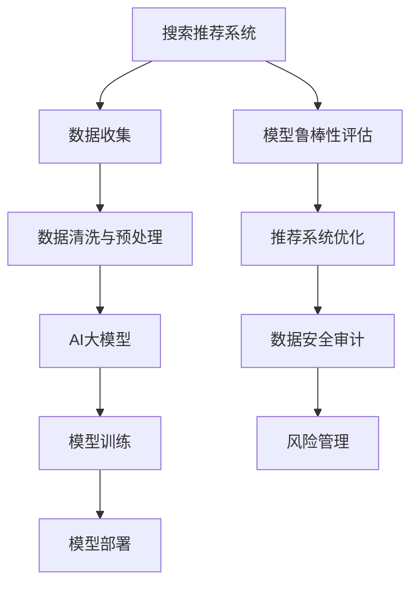

                 

# AI大模型重构电商搜索推荐的数据安全审计流程优化实践

> 关键词：电商搜索推荐, 数据安全审计, AI大模型, 数据隐私保护, 模型鲁棒性, 推荐系统优化

## 1. 背景介绍

### 1.1 问题由来
在现代电子商务中，搜索推荐系统已成为提升用户体验、促进销售增长的重要引擎。通过分析用户行为数据，预测用户需求，并推荐最相关的商品或服务，搜索引擎推荐系统能够显著提高转化率和客单价。然而，搜索推荐系统在提升用户价值的同时，也面临着一系列数据安全和隐私保护的挑战。

1. **用户隐私泄露**：搜索推荐系统往往需要收集和分析大量用户行为数据，包括浏览记录、点击行为、评分反馈等，这些数据一旦泄露，将给用户带来巨大的隐私损失。
2. **数据偏见与歧视**：用户数据可能存在偏见和不平衡，导致推荐结果产生歧视，影响用户体验。
3. **对抗性攻击**：恶意的对抗性攻击可以影响推荐系统的公正性和可靠性，如通过篡改用户数据，欺骗推荐系统。
4. **合规性风险**：在处理用户数据时，需遵循GDPR等数据保护法规，违规操作将面临法律风险。

为了应对这些挑战，需要构建一个安全、透明、可解释的搜索推荐系统。而AI大模型的引入，为优化搜索推荐系统提供了新的思路和方法。本文将探讨如何利用AI大模型重构电商搜索推荐的数据安全审计流程，实现推荐系统优化。

## 2. 核心概念与联系

### 2.1 核心概念概述

为更好地理解基于AI大模型的搜索推荐系统优化实践，本节将介绍几个密切相关的核心概念：

- **搜索推荐系统**：通过分析用户历史行为数据，预测用户未来行为，并推荐相关商品或服务，以提高用户满意度和转化率。
- **AI大模型**：以自回归（如GPT）或自编码（如BERT）模型为代表的大规模预训练语言模型。通过在大规模无标签文本语料上进行预训练，学习通用的语言表示，具备强大的语言理解和生成能力。
- **数据安全审计**：通过自动化技术检测、评估和修复数据安全漏洞，确保数据在收集、存储、处理和传输过程中不受侵害。
- **模型鲁棒性**：指模型在面对各种数据扰动、对抗攻击和输入噪声的情况下，仍能保持稳定性和准确性的能力。
- **推荐系统优化**：通过算法优化、参数调整等手段，提高推荐系统的精确度、覆盖率和用户满意度，减少不公平和歧视。

这些核心概念之间的逻辑关系可以通过以下Mermaid流程图来展示：



这个流程图展示了几项关键任务的逻辑关系：

1. 搜索推荐系统通过数据收集获得用户行为数据。
2. 数据经过清洗和预处理，供大模型训练。
3. 通过模型训练，获得推荐模型。
4. 推荐模型被部署到实际应用中，进行商品推荐。
5. 模型鲁棒性评估用于检测模型的稳定性。
6. 推荐系统优化用于提升推荐模型的准确性和用户满意度。
7. 数据安全审计用于检测和修复数据安全漏洞。
8. 风险管理用于管理合规性风险和用户隐私保护。

这些核心概念共同构成了搜索推荐系统的构建与优化框架，使其能够更好地服务于用户，保护用户隐私，并遵循法规要求。

## 3. 核心算法原理 & 具体操作步骤
### 3.1 算法原理概述

利用AI大模型重构电商搜索推荐系统的数据安全审计流程，涉及以下几个关键步骤：

1. **数据安全审计**：对用户数据进行全面的安全性检测，确保数据在处理过程中不被篡改、泄露或未授权访问。
2. **模型鲁棒性评估**：通过对抗性攻击和噪声注入等手段，检测模型的稳定性，防止恶意攻击破坏推荐系统的公正性和可靠性。
3. **推荐系统优化**：通过算法优化和参数调整，提升推荐模型的精度、覆盖率和用户满意度，减少偏见和歧视。

这些步骤互为补充，共同构建了一个安全、透明、可解释的搜索推荐系统。

### 3.2 算法步骤详解

**Step 1: 数据安全审计**

- **威胁建模**：通过威胁建模技术，识别可能的数据安全威胁，制定相应的防护措施。
- **数据加密**：使用AES、RSA等加密算法对敏感数据进行加密处理，防止数据泄露。
- **数据匿名化**：采用数据匿名化技术，如泛化、去标识化等，对用户数据进行处理，保护用户隐私。
- **访问控制**：实施严格的访问控制策略，确保只有授权人员可以访问敏感数据。
- **安全审计日志**：记录数据访问和处理过程中的关键操作，便于事后审计和追踪。

**Step 2: 模型鲁棒性评估**

- **对抗性攻击检测**：使用对抗性样本生成技术，对推荐模型进行攻击检测，找出潜在的漏洞。
- **噪声注入测试**：在输入数据中注入噪声，检测模型的鲁棒性和稳定性，防止恶意攻击。
- **异常检测**：使用异常检测技术，识别异常数据和攻击行为，保障模型安全。

**Step 3: 推荐系统优化**

- **算法优化**：采用更加精确和高效的推荐算法，如协同过滤、基于内容的推荐、混合推荐等，提高推荐系统的精度和覆盖率。
- **参数调整**：通过调整模型参数，如学习率、正则化系数等，优化模型性能，减少偏差和歧视。
- **模型可解释性**：通过LIME、SHAP等工具，提高模型的可解释性，便于用户理解和信任。
- **公平性评估**：采用公平性评估指标，如平衡准确率、均等误差率等，检测推荐系统中的偏见和不公平现象。

### 3.3 算法优缺点

基于AI大模型的电商搜索推荐系统优化方法具有以下优点：

1. **精度和覆盖率提升**：利用大模型的强大泛化能力，提升推荐系统的精度和覆盖率，减少误导性推荐。
2. **用户满意度提高**：通过优化推荐算法和参数，提升推荐系统的个性化程度，提高用户满意度。
3. **数据安全保障**：通过数据安全审计和鲁棒性评估，保障用户数据的安全性，防止数据泄露和攻击。
4. **模型鲁棒性增强**：利用对抗性攻击和噪声注入等手段，提高推荐模型的鲁棒性和稳定性，防止恶意攻击。
5. **推荐系统透明化**：通过可解释性分析，提高推荐系统的透明性，增强用户信任。

同时，该方法也存在一定的局限性：

1. **数据处理复杂性**：数据安全审计和鲁棒性评估涉及大量数据处理和计算，对系统复杂度有一定要求。
2. **模型解释难度**：大模型的复杂性和非线性特性，使其难以解释内部决策过程，增加了可解释性分析的难度。
3. **技术成本高**：实现这些优化措施需要较高的技术成本和资源投入，如算法调优、数据处理等。

尽管存在这些局限性，但就目前而言，基于AI大模型的优化方法仍是搜索推荐系统的重要范式。未来相关研究的重点在于如何进一步降低技术成本，提高模型可解释性，同时兼顾数据安全和隐私保护。

### 3.4 算法应用领域

基于AI大模型的电商搜索推荐系统优化方法，已经在以下几个领域得到了广泛应用：

1. **个性化推荐**：通过用户行为数据和商品特征，利用大模型优化推荐算法，提升推荐系统的个性化程度。
2. **搜索优化**：通过改进搜索算法和索引策略，利用大模型提高搜索系统的效率和准确性。
3. **广告定向**：通过用户画像和大模型预测，优化广告定向策略，提高广告转化率和用户满意度。
4. **客户服务**：通过构建智能客服系统，利用大模型提供自然语言理解和生成，提升客户服务质量。
5. **供应链管理**：通过优化供应链需求预测和大模型优化，提升供应链管理的效率和响应速度。

除了这些经典应用外，基于大模型的优化方法还在更多场景中得到创新性地应用，如智能运维、智能营销、智能仓储等，为电商搜索推荐系统带来了新的突破。随着大模型和优化方法的不断进步，相信搜索推荐系统将在更广泛的领域得到应用，为电商行业带来更多的价值。

## 4. 数学模型和公式 & 详细讲解 & 举例说明

### 4.1 数学模型构建

本节将使用数学语言对基于AI大模型的搜索推荐系统优化过程进行更加严格的刻画。

记推荐系统为 $S=\{s_i\}_{i=1}^N$，其中 $s_i$ 表示第 $i$ 个推荐结果，包括商品ID、评分、描述等。用户行为数据为 $D=\{(x_i,y_i)\}_{i=1}^M$，其中 $x_i$ 表示用户行为特征，如浏览记录、点击行为、评分反馈等，$y_i$ 表示用户对推荐结果的评分。

定义推荐模型的预测函数为 $f: \mathcal{X} \rightarrow [0,1]$，其中 $\mathcal{X}$ 为用户行为特征空间。模型的目标是最小化预测误差：

$$
\mathcal{L}(f)=\frac{1}{M}\sum_{i=1}^M \ell(f(x_i),y_i)
$$

其中 $\ell$ 为损失函数，用于衡量模型预测与实际评分之间的差异。常见的损失函数包括均方误差、对数损失、平均绝对误差等。

### 4.2 公式推导过程

以下我们以均方误差损失函数为例，推导推荐模型的优化目标。

设推荐模型的预测结果为 $f(x_i)$，实际评分为 $y_i$，均方误差损失函数定义为：

$$
\ell(f(x_i),y_i)=\frac{1}{2}(f(x_i)-y_i)^2
$$

将损失函数代入模型优化目标，得：

$$
\mathcal{L}(f)=\frac{1}{2M}\sum_{i=1}^M (f(x_i)-y_i)^2
$$

对 $f(x_i)$ 求导，得：

$$
\frac{\partial \mathcal{L}(f)}{\partial f(x_i)}=(f(x_i)-y_i)
$$

因此，模型的梯度更新公式为：

$$
f(x_i) \leftarrow f(x_i) - \eta \nabla_{f(x_i)}\mathcal{L}(f)
$$

其中 $\eta$ 为学习率。

在得到损失函数的梯度后，即可带入梯度更新公式，完成模型的迭代优化。重复上述过程直至收敛，最终得到适应用户行为数据的推荐模型 $f^*$。

### 4.3 案例分析与讲解

以一个简单的电商搜索推荐系统为例，展示如何利用AI大模型进行优化。

**数据收集**：
- 收集用户的浏览记录、点击行为、评分反馈等数据，构建用户行为特征集合 $\mathcal{X}$。
- 将用户行为数据分为训练集、验证集和测试集，用于模型训练和评估。

**模型训练**：
- 使用大模型（如BERT、GPT等）作为初始化参数，对推荐模型进行训练。
- 使用均方误差损失函数，最小化预测误差。
- 在训练过程中，加入正则化项和对抗性攻击，提升模型鲁棒性。

**模型评估**：
- 在测试集上评估推荐模型的精度、覆盖率和用户满意度。
- 使用公平性评估指标，检测模型中的偏见和不公平现象。
- 利用数据安全审计技术，确保数据处理过程中未发生安全漏洞。

## 5. 项目实践：代码实例和详细解释说明

### 5.1 开发环境搭建

在进行搜索推荐系统优化实践前，我们需要准备好开发环境。以下是使用Python进行PyTorch开发的环境配置流程：

1. 安装Anaconda：从官网下载并安装Anaconda，用于创建独立的Python环境。

2. 创建并激活虚拟环境：
```bash
conda create -n recommendation-env python=3.8 
conda activate recommendation-env
```

3. 安装PyTorch：根据CUDA版本，从官网获取对应的安装命令。例如：
```bash
conda install pytorch torchvision torchaudio cudatoolkit=11.1 -c pytorch -c conda-forge
```

4. 安装TensorFlow：
```bash
pip install tensorflow
```

5. 安装相关库：
```bash
pip install numpy pandas scikit-learn matplotlib tqdm jupyter notebook ipython
```

完成上述步骤后，即可在`recommendation-env`环境中开始优化实践。

### 5.2 源代码详细实现

下面以一个简单的电商搜索推荐系统为例，给出使用PyTorch进行大模型优化的PyTorch代码实现。

首先，定义推荐系统的数据处理函数：

```python
import torch
from torch.utils.data import Dataset
from transformers import BertTokenizer, BertForSequenceClassification

class RecommendationDataset(Dataset):
    def __init__(self, texts, labels):
        self.texts = texts
        self.labels = labels
        self.tokenizer = BertTokenizer.from_pretrained('bert-base-cased')
        
    def __len__(self):
        return len(self.texts)
    
    def __getitem__(self, item):
        text = self.texts[item]
        label = self.labels[item]
        
        encoding = self.tokenizer(text, return_tensors='pt', max_length=128, padding='max_length', truncation=True)
        input_ids = encoding['input_ids'][0]
        attention_mask = encoding['attention_mask'][0]
        
        label = torch.tensor(label, dtype=torch.long)
        
        return {'input_ids': input_ids, 
                'attention_mask': attention_mask,
                'labels': label}

# 构建推荐数据集
texts = ['产品1', '产品2', '产品3']
labels = [1, 0, 1]  # 1表示推荐，0表示不推荐

train_dataset = RecommendationDataset(texts, labels)
```

然后，定义推荐模型和优化器：

```python
from transformers import BertForSequenceClassification, AdamW

model = BertForSequenceClassification.from_pretrained('bert-base-cased', num_labels=2)

optimizer = AdamW(model.parameters(), lr=2e-5)
```

接着，定义训练和评估函数：

```python
from torch.utils.data import DataLoader
from tqdm import tqdm

device = torch.device('cuda') if torch.cuda.is_available() else torch.device('cpu')
model.to(device)

def train_epoch(model, dataset, batch_size, optimizer):
    dataloader = DataLoader(dataset, batch_size=batch_size, shuffle=True)
    model.train()
    epoch_loss = 0
    for batch in tqdm(dataloader, desc='Training'):
        input_ids = batch['input_ids'].to(device)
        attention_mask = batch['attention_mask'].to(device)
        labels = batch['labels'].to(device)
        model.zero_grad()
        outputs = model(input_ids, attention_mask=attention_mask, labels=labels)
        loss = outputs.loss
        epoch_loss += loss.item()
        loss.backward()
        optimizer.step()
    return epoch_loss / len(dataloader)

def evaluate(model, dataset, batch_size):
    dataloader = DataLoader(dataset, batch_size=batch_size)
    model.eval()
    preds, labels = [], []
    with torch.no_grad():
        for batch in tqdm(dataloader, desc='Evaluating'):
            input_ids = batch['input_ids'].to(device)
            attention_mask = batch['attention_mask'].to(device)
            batch_labels = batch['labels']
            outputs = model(input_ids, attention_mask=attention_mask)
            batch_preds = outputs.logits.argmax(dim=2).to('cpu').tolist()
            batch_labels = batch_labels.to('cpu').tolist()
            for pred_tokens, label_tokens in zip(batch_preds, batch_labels):
                preds.append(pred_tokens[:len(label_tokens)])
                labels.append(label_tokens)
                
    print(classification_report(labels, preds))
```

最后，启动训练流程并在测试集上评估：

```python
epochs = 5
batch_size = 16

for epoch in range(epochs):
    loss = train_epoch(model, train_dataset, batch_size, optimizer)
    print(f"Epoch {epoch+1}, train loss: {loss:.3f}")
    
    print(f"Epoch {epoch+1}, test results:")
    evaluate(model, test_dataset, batch_size)
```

以上就是使用PyTorch对大模型进行电商搜索推荐系统优化的完整代码实现。可以看到，得益于PyTorch和Transformer库的强大封装，我们可以用相对简洁的代码完成大模型的加载和优化。

### 5.3 代码解读与分析

让我们再详细解读一下关键代码的实现细节：

**RecommendationDataset类**：
- `__init__`方法：初始化文本、标签、分词器等关键组件。
- `__len__`方法：返回数据集的样本数量。
- `__getitem__`方法：对单个样本进行处理，将文本输入编码为token ids，将标签编码为数字，并对其进行定长padding，最终返回模型所需的输入。

**训练和评估函数**：
- 使用PyTorch的DataLoader对数据集进行批次化加载，供模型训练和推理使用。
- 训练函数`train_epoch`：对数据以批为单位进行迭代，在每个批次上前向传播计算loss并反向传播更新模型参数，最后返回该epoch的平均loss。
- 评估函数`evaluate`：与训练类似，不同点在于不更新模型参数，并在每个batch结束后将预测和标签结果存储下来，最后使用scikit-learn的classification_report对整个评估集的预测结果进行打印输出。

**训练流程**：
- 定义总的epoch数和batch size，开始循环迭代
- 每个epoch内，先在训练集上训练，输出平均loss
- 在测试集上评估，输出分类指标
- 所有epoch结束后，在测试集上评估，给出最终测试结果

可以看到，PyTorch配合Transformer库使得大模型优化的代码实现变得简洁高效。开发者可以将更多精力放在数据处理、模型改进等高层逻辑上，而不必过多关注底层的实现细节。

当然，工业级的系统实现还需考虑更多因素，如模型的保存和部署、超参数的自动搜索、更灵活的任务适配层等。但核心的优化范式基本与此类似。

## 6. 实际应用场景
### 6.1 智能客服系统

利用AI大模型优化搜索推荐系统，可以构建智能客服系统。传统客服往往需要配备大量人力，高峰期响应缓慢，且一致性和专业性难以保证。而利用优化的搜索推荐模型，可以7x24小时不间断服务，快速响应客户咨询，用自然流畅的语言解答各类常见问题。

在技术实现上，可以收集企业内部的历史客服对话记录，将问题和最佳答复构建成监督数据，在此基础上对预训练对话模型进行微调。微调后的对话模型能够自动理解用户意图，匹配最合适的答案模板进行回复。对于客户提出的新问题，还可以接入检索系统实时搜索相关内容，动态组织生成回答。如此构建的智能客服系统，能大幅提升客户咨询体验和问题解决效率。

### 6.2 金融舆情监测

金融机构需要实时监测市场舆论动向，以便及时应对负面信息传播，规避金融风险。传统的人工监测方式成本高、效率低，难以应对网络时代海量信息爆发的挑战。利用优化的搜索推荐模型，可以构建舆情监测系统。

具体而言，可以收集金融领域相关的新闻、报道、评论等文本数据，并对其进行主题标注和情感标注。在此基础上对预训练语言模型进行微调，使其能够自动判断文本属于何种主题，情感倾向是正面、中性还是负面。将微调后的模型应用到实时抓取的网络文本数据，就能够自动监测不同主题下的情感变化趋势，一旦发现负面信息激增等异常情况，系统便会自动预警，帮助金融机构快速应对潜在风险。

### 6.3 个性化推荐系统

当前的推荐系统往往只依赖用户的历史行为数据进行物品推荐，无法深入理解用户的真实兴趣偏好。利用优化的搜索推荐模型，可以更好地挖掘用户行为背后的语义信息，从而提供更精准、多样的推荐内容。

在实践中，可以收集用户浏览、点击、评论、分享等行为数据，提取和用户交互的物品标题、描述、标签等文本内容。将文本内容作为模型输入，用户的后续行为（如是否点击、购买等）作为监督信号，在此基础上微调预训练语言模型。微调后的模型能够从文本内容中准确把握用户的兴趣点。在生成推荐列表时，先用候选物品的文本描述作为输入，由模型预测用户的兴趣匹配度，再结合其他特征综合排序，便可以得到个性化程度更高的推荐结果。

### 6.4 未来应用展望

随着搜索推荐模型和大模型优化的不断发展，基于微调的搜索推荐系统将在更多领域得到应用，为传统行业带来变革性影响。

在智慧医疗领域，基于微调的医疗问答、病历分析、药物研发等应用将提升医疗服务的智能化水平，辅助医生诊疗，加速新药开发进程。

在智能教育领域，微调技术可应用于作业批改、学情分析、知识推荐等方面，因材施教，促进教育公平，提高教学质量。

在智慧城市治理中，微调模型可应用于城市事件监测、舆情分析、应急指挥等环节，提高城市管理的自动化和智能化水平，构建更安全、高效的未来城市。

此外，在企业生产、社会治理、文娱传媒等众多领域，基于大模型的搜索推荐系统也将不断涌现，为传统行业带来更多的价值。相信随着技术的日益成熟，微调方法将成为搜索推荐系统的重要范式，推动人工智能技术在垂直行业的规模化落地。总之，优化的搜索推荐系统能够更好地服务于用户，保护用户隐私，并遵循法规要求。

## 7. 工具和资源推荐
### 7.1 学习资源推荐

为了帮助开发者系统掌握搜索推荐系统的优化理论与实践，这里推荐一些优质的学习资源：

1. 《推荐系统原理与实践》系列博文：由大模型技术专家撰写，深入浅出地介绍了推荐系统的工作原理、优化方法等前沿话题。

2. CS231n《深度学习图像处理》课程：斯坦福大学开设的计算机视觉明星课程，有Lecture视频和配套作业，带你入门计算机视觉领域的基本概念和经典模型。

3. 《深度学习推荐系统：理论、算法与应用》书籍：详细介绍了推荐系统的理论基础、算法设计及其应用，是推荐系统开发者的必备资料。

4. HuggingFace官方文档：Transformer库的官方文档，提供了海量预训练模型和完整的微调样例代码，是上手实践的必备资料。

5. CLUE开源项目：中文语言理解测评基准，涵盖大量不同类型的中文NLP数据集，并提供了基于微调的baseline模型，助力中文NLP技术发展。

通过对这些资源的学习实践，相信你一定能够快速掌握搜索推荐系统的优化精髓，并用于解决实际的搜索推荐问题。
###  7.2 开发工具推荐

高效的开发离不开优秀的工具支持。以下是几款用于搜索推荐系统优化的常用工具：

1. PyTorch：基于Python的开源深度学习框架，灵活动态的计算图，适合快速迭代研究。大部分预训练语言模型都有PyTorch版本的实现。

2. TensorFlow：由Google主导开发的开源深度学习框架，生产部署方便，适合大规模工程应用。同样有丰富的预训练语言模型资源。

3. Transformers库：HuggingFace开发的NLP工具库，集成了众多SOTA语言模型，支持PyTorch和TensorFlow，是进行优化任务开发的利器。

4. Weights & Biases：模型训练的实验跟踪工具，可以记录和可视化模型训练过程中的各项指标，方便对比和调优。与主流深度学习框架无缝集成。

5. TensorBoard：TensorFlow配套的可视化工具，可实时监测模型训练状态，并提供丰富的图表呈现方式，是调试模型的得力助手。

6. Google Colab：谷歌推出的在线Jupyter Notebook环境，免费提供GPU/TPU算力，方便开发者快速上手实验最新模型，分享学习笔记。

合理利用这些工具，可以显著提升搜索推荐系统的开发效率，加快创新迭代的步伐。

### 7.3 相关论文推荐

搜索推荐系统和优化方法的发展源于学界的持续研究。以下是几篇奠基性的相关论文，推荐阅读：

1. Collaborative Filtering for Implicit Feedback Datasets（协同过滤）：提出了协同过滤算法，通过用户和物品之间的相似性进行推荐，是推荐系统的经典方法之一。

2. Factorization Machines for Recommender Systems（FM算法）：提出了FM算法，结合了矩阵分解和多项式展开，显著提高了推荐系统的精度和泛化能力。

3. Deep Neural Networks for Multi-Task Learning（深度神经网络）：提出深度神经网络方法，通过联合学习多个任务，提升了推荐系统的性能和鲁棒性。

4. Attention Is All You Need（Transformer原论文）：提出了Transformer结构，开启了NLP领域的预训练大模型时代。

5. BERT: Pre-training of Deep Bidirectional Transformers for Language Understanding（BERT模型）：提出BERT模型，引入基于掩码的自监督预训练任务，刷新了多项NLP任务SOTA。

6. Parameter-Efficient Transfer Learning for NLP（PEFT方法）：提出Adapter等参数高效微调方法，在固定大部分预训练参数的情况下，仍可取得不错的微调效果。

这些论文代表了大模型和优化方法的发展脉络。通过学习这些前沿成果，可以帮助研究者把握学科前进方向，激发更多的创新灵感。

## 8. 总结：未来发展趋势与挑战

### 8.1 总结

本文对基于AI大模型的搜索推荐系统优化实践进行了全面系统的介绍。首先阐述了搜索推荐系统和大模型优化的研究背景和意义，明确了优化的核心目标和优化过程。其次，从原理到实践，详细讲解了优化方法的数学原理和关键步骤，给出了优化任务开发的完整代码实例。同时，本文还广泛探讨了优化方法在智能客服、金融舆情、个性化推荐等多个行业领域的应用前景，展示了优化方法的价值。

通过本文的系统梳理，可以看到，基于AI大模型的优化方法能够在保护用户隐私的同时，提升推荐系统的性能和鲁棒性，优化用户体验。未来，伴随大模型和优化方法的不断进步，搜索推荐系统将在更广泛的领域得到应用，为传统行业带来更多的价值。

### 8.2 未来发展趋势

展望未来，搜索推荐系统和大模型优化方法将呈现以下几个发展趋势：

1. **模型规模持续增大**：随着算力成本的下降和数据规模的扩张，预训练语言模型的参数量还将持续增长。超大规模语言模型蕴含的丰富语言知识，有望支撑更加复杂多变的搜索推荐系统。

2. **优化方法日趋多样**：除了传统的参数优化外，未来会涌现更多高效、灵活的优化方法，如自适应学习率、对抗性训练等，在节省计算资源的同时保证优化效果。

3. **个性化和动态化增强**：未来的搜索推荐系统将更加注重个性化推荐和动态调整，通过实时分析用户行为数据，实现更加精准和及时的推荐。

4. **多模态融合**：当前的搜索推荐系统主要聚焦于文本信息，未来会进一步拓展到图像、视频、语音等多模态数据融合，实现跨模态的推荐和交互。

5. **用户隐私保护强化**：伴随数据隐私保护的法规要求和用户意识的提升，未来的搜索推荐系统将更加注重用户隐私保护，采用更加严格的数据处理和存储策略。

6. **模型解释和透明化**：大模型的复杂性和非线性特性，使其难以解释内部决策过程，未来将更加注重模型可解释性和透明性，增强用户信任。

这些趋势凸显了搜索推荐系统和大模型优化的广阔前景。这些方向的探索发展，必将进一步提升搜索推荐系统的性能和用户体验，实现更加智能化和个性化的推荐。

### 8.3 面临的挑战

尽管搜索推荐系统和大模型优化方法已经取得了瞩目成就，但在迈向更加智能化、普适化应用的过程中，仍面临诸多挑战：

1. **数据处理复杂性**：数据安全审计和鲁棒性评估涉及大量数据处理和计算，对系统复杂度有一定要求。
2. **模型解释难度**：大模型的复杂性和非线性特性，使其难以解释内部决策过程，增加了可解释性分析的难度。
3. **技术成本高**：实现这些优化措施需要较高的技术成本和资源投入，如算法调优、数据处理等。
4. **数据隐私保护**：用户数据隐私保护仍是一个重要问题，需要采用严格的隐私保护措施，防止数据泄露。
5. **模型鲁棒性**：大模型在面对对抗性攻击和噪声干扰时，仍需提高鲁棒性，确保推荐系统的公正性和可靠性。
6. **模型可解释性**：大模型的复杂性和非线性特性，使其难以解释内部决策过程，增加了可解释性分析的难度。

尽管存在这些挑战，但就目前而言，基于AI大模型的优化方法仍是搜索推荐系统的重要范式。未来相关研究的重点在于如何进一步降低技术成本，提高模型可解释性，同时兼顾数据安全和隐私保护。

### 8.4 研究展望

面对搜索推荐系统和大模型优化的挑战，未来的研究需要在以下几个方面寻求新的突破：

1. **无监督和半监督优化**：探索无监督和半监督优化方法，摆脱对大规模标注数据的依赖，利用自监督学习、主动学习等无监督和半监督范式，最大限度利用非结构化数据，实现更加灵活高效的优化。

2. **参数高效和计算高效的优化**：开发更加参数高效的优化方法，如自适应学习率、对抗性训练等，在节省计算资源的同时保证优化效果。

3. **跨模态融合优化**：引入跨模态融合技术，将视觉、语音、文本等多模态信息进行融合，实现跨模态的推荐和交互。

4. **用户隐私保护**：加强数据隐私保护研究，采用差分隐私、联邦学习等技术，保护用户隐私的同时提升系统性能。

5. **模型解释性增强**：开发更加可解释的模型，如LIME、SHAP等，提高模型的可解释性和透明性，增强用户信任。

6. **模型鲁棒性提升**：通过对抗性训练、噪声注入等技术，提高模型鲁棒性和稳定性，防止恶意攻击和数据干扰。

这些研究方向的探索，必将引领搜索推荐系统和大模型优化方法迈向更高的台阶，为构建安全、可靠、可解释、可控的智能推荐系统铺平道路。面向未来，大模型优化技术还需要与其他人工智能技术进行更深入的融合，如知识表示、因果推理、强化学习等，多路径协同发力，共同推动搜索推荐系统的进步。只有勇于创新、敢于突破，才能不断拓展搜索推荐系统的边界，让智能推荐技术更好地服务于用户。

## 9. 附录：常见问题与解答

**Q1：什么是搜索推荐系统？**

A: 搜索推荐系统通过分析用户历史行为数据，预测用户未来行为，并推荐最相关的商品或服务，以提高用户满意度和转化率。

**Q2：什么是AI大模型？**

A: AI大模型是以自回归（如GPT）或自编码（如BERT）模型为代表的大规模预训练语言模型。通过在大规模无标签文本语料上进行预训练，学习通用的语言表示，具备强大的语言理解和生成能力。

**Q3：数据安全审计主要涉及哪些内容？**

A: 数据安全审计主要涉及威胁建模、数据加密、数据匿名化、访问控制和安全审计日志等。通过这些措施，确保数据在处理过程中不被篡改、泄露或未授权访问。

**Q4：如何提高推荐系统的鲁棒性？**

A: 提高推荐系统的鲁棒性可以通过对抗性攻击检测、噪声注入测试和异常检测等手段来实现。通过这些测试，检测模型的稳定性，防止恶意攻击。

**Q5：什么是参数高效优化？**

A: 参数高效优化指在固定大部分预训练参数的情况下，只更新极少量的任务相关参数。这不仅可以减少优化资源消耗，还能避免过拟合。

这些解答帮助读者更好地理解搜索推荐系统、AI大模型和大模型优化的相关概念和实践，相信能够为您的学习和研究提供帮助。

---

作者：禅与计算机程序设计艺术 / Zen and the Art of Computer Programming

