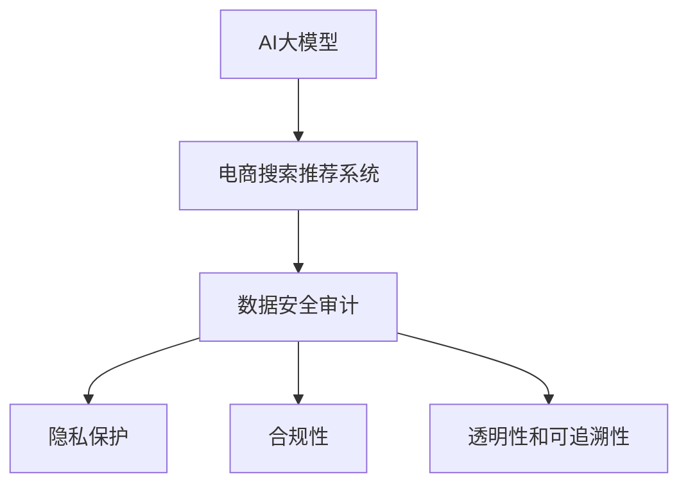

                 

# AI大模型重构电商搜索推荐的数据安全审计流程优化方案

> 关键词：AI大模型, 电商搜索, 推荐系统, 数据安全, 审计流程, 优化方案, 隐私保护, 合规性, 透明性, 自动化

## 1. 背景介绍

### 1.1 问题由来

随着人工智能技术在电商搜索推荐系统的广泛应用，AI大模型在提升用户体验、提高运营效率方面发挥了巨大作用。然而，随着数据安全与隐私保护意识的不断增强，AI模型在数据使用、存储、处理过程中潜在的风险和挑战也逐渐显现。为应对这些问题，数据安全审计流程显得尤为重要。传统的审计流程往往依赖人工检查，耗时耗力，且难以发现复杂场景下的安全漏洞。基于此，本文提出了一种基于AI大模型的数据安全审计流程优化方案，旨在通过自动化手段，提升审计效率，增强审计效果，确保数据使用的合规性和安全性。

### 1.2 问题核心关键点

本方案的核心在于如何利用AI大模型，在电商搜索推荐系统的数据安全审计过程中，实现审计流程的自动化和智能化，从而提高审计效率，降低人为错误，同时确保数据的合规性和安全性。具体来说，包括以下几个关键点：

- **AI大模型的应用**：通过AI大模型，实现数据的自动抽取、分析和检测，降低人工操作的工作量和出错概率。
- **审计流程的优化**：结合电商搜索推荐系统的业务特性，对审计流程进行流程再造和自动化，提高审计效率和准确性。
- **数据隐私保护**：在审计过程中，确保数据的隐私保护，防止敏感信息泄露，同时满足合规性要求。
- **透明性和可追溯性**：实现审计过程的透明化和可追溯性，方便后续的审计追踪和问题定位。
- **自动化工具的推荐**：推荐适合的审计工具和资源，帮助开发者高效实施数据安全审计流程优化方案。

## 2. 核心概念与联系

### 2.1 核心概念概述

本方案涉及的核心概念包括：

- **AI大模型**：基于深度学习技术构建的大规模预训练模型，具有强大的数据处理和分析能力，可用于电商搜索推荐系统的数据审计。
- **电商搜索推荐系统**：利用AI技术，根据用户行为和偏好，提供个性化搜索结果和推荐商品的系统。
- **数据安全审计**：通过对数据使用、存储、处理等环节的审查，确保数据使用的合规性和安全性，防止数据泄露和滥用。
- **隐私保护**：在数据处理过程中，采取必要措施保护用户隐私，防止敏感信息被不当使用。
- **合规性**：确保数据处理过程符合相关法律法规和行业标准，如GDPR、CCPA等。
- **透明性和可追溯性**：审计过程的透明化和可追溯性，便于后续的审计追踪和问题定位。

这些核心概念之间的联系通过以下Mermaid流程图来展示：



该流程图展示了核心概念之间的逻辑关系：

1. AI大模型为电商搜索推荐系统提供数据处理和分析能力。
2. 电商搜索推荐系统中的数据安全审计流程，利用AI大模型实现自动化和智能化。
3. 审计过程中，需要考虑隐私保护、合规性、透明性和可追溯性等关键因素。

## 3. 核心算法原理 & 具体操作步骤

### 3.1 算法原理概述

基于AI大模型的数据安全审计流程优化方案，主要涉及以下几个算法和步骤：

1. **数据抽取**：利用AI大模型，自动从电商搜索推荐系统的数据集中抽取关键数据，如用户行为、商品信息、交易记录等。
2. **数据分析**：基于抽取的数据，通过AI大模型进行数据分析，识别潜在的安全漏洞和隐私风险。
3. **风险评估**：对识别出的风险进行评估，确定其严重程度和影响范围。
4. **审计报告生成**：根据风险评估结果，生成审计报告，记录审计过程和结果，并提出改进建议。
5. **持续监控**：通过AI大模型，持续监控数据使用情况，及时发现和响应新的安全风险。

### 3.2 算法步骤详解

以下是基于AI大模型的数据安全审计流程优化方案的具体操作步骤：

**Step 1: 数据抽取**

1. **选择预训练模型**：根据电商搜索推荐系统的数据特性，选择适合的预训练AI大模型，如BERT、GPT等。
2. **数据预处理**：对电商搜索推荐系统的数据集进行预处理，包括数据清洗、特征提取、归一化等。
3. **数据抽取**：利用预训练模型，自动从电商搜索推荐系统的数据集中抽取关键数据，生成数据集。

**Step 2: 数据分析**

1. **数据标注**：对抽取的数据进行人工标注，标注其是否包含敏感信息或潜在的安全风险。
2. **模型训练**：基于标注数据，训练AI大模型，使其能够自动识别数据中的敏感信息或安全风险。
3. **风险检测**：利用训练好的模型，对电商搜索推荐系统的数据集进行自动检测，识别潜在的安全漏洞和隐私风险。

**Step 3: 风险评估**

1. **风险打分**：根据风险检测结果，对识别的安全漏洞和隐私风险进行打分，评估其严重程度。
2. **影响分析**：对风险打分进行影响分析，确定其对用户隐私和合规性的具体影响。
3. **风险报告**：根据风险评估结果，生成审计报告，记录审计过程和结果，并提出改进建议。

**Step 4: 持续监控**

1. **监控策略**：制定持续监控策略，定期对电商搜索推荐系统的数据使用情况进行监控。
2. **异常检测**：利用AI大模型，对监控数据进行异常检测，及时发现新的安全风险。
3. **预警机制**：根据异常检测结果，启动预警机制，通知相关人员进行处理。

### 3.3 算法优缺点

本方案利用AI大模型进行数据安全审计，具有以下优点：

1. **自动化**：通过AI大模型，实现数据的自动抽取、分析和检测，大大降低了人工操作的复杂度和出错概率。
2. **高效性**：利用AI大模型，可以高效处理大量数据，快速发现潜在的安全漏洞和隐私风险。
3. **透明性**：通过AI大模型，审计过程透明化，便于后续的审计追踪和问题定位。
4. **可扩展性**：AI大模型具有高度的可扩展性，可以轻松应用于不同规模和类型的电商搜索推荐系统。

同时，该方案也存在以下缺点：

1. **数据隐私**：在数据抽取和分析过程中，可能涉及敏感信息的处理，需要严格控制数据访问权限，防止敏感信息泄露。
2. **模型泛化性**：AI大模型可能存在泛化性不足的问题，需要定期更新模型，以适应数据分布的变化。
3. **资源消耗**：AI大模型的训练和推理过程，需要大量的计算资源，可能对系统性能产生影响。
4. **模型维护**：AI大模型的维护和更新需要专业知识和技能，需要配备相应的技术团队。

### 3.4 算法应用领域

本方案主要应用于电商搜索推荐系统的数据安全审计流程优化，其适用场景包括但不限于：

- **用户行为分析**：通过AI大模型，对用户搜索、浏览、购买等行为进行自动分析和审计，识别潜在的安全漏洞和隐私风险。
- **商品信息审核**：利用AI大模型，对商品信息进行自动审核，防止虚假广告、侵犯知识产权等问题。
- **交易记录审计**：通过AI大模型，对交易记录进行自动审计，确保交易过程的合规性和安全性。
- **隐私保护监控**：利用AI大模型，持续监控数据使用情况，防止敏感信息泄露和滥用。

## 4. 数学模型和公式 & 详细讲解 & 举例说明

### 4.1 数学模型构建

基于AI大模型的数据安全审计流程优化方案，涉及以下数学模型：

1. **数据抽取模型**：用于自动从电商搜索推荐系统的数据集中抽取关键数据。
2. **数据分析模型**：用于识别数据中的敏感信息和潜在安全风险。
3. **风险评估模型**：用于评估风险的严重程度和影响范围。
4. **审计报告生成模型**：用于生成审计报告，记录审计过程和结果，并提出改进建议。
5. **持续监控模型**：用于持续监控数据使用情况，及时发现新的安全风险。

### 4.2 公式推导过程

以下是基于AI大模型的数据安全审计流程优化方案中涉及的主要公式推导：

**公式 1：数据抽取模型**

设电商搜索推荐系统的数据集为 $D=\{x_i\}_{i=1}^N$，其中 $x_i$ 表示第 $i$ 个数据样本。

数据抽取模型的目标是从数据集 $D$ 中自动抽取关键数据，生成数据集 $D'$。设 $D'$ 中的关键数据为 $x_i'$。

数据抽取模型可以表示为：

$$
x_i' = f(x_i, \theta_D)
$$

其中 $f$ 表示数据抽取函数，$\theta_D$ 表示模型参数。

**公式 2：数据分析模型**

数据分析模型的目标是对抽取的关键数据 $D'$ 进行自动分析和检测，识别其中的敏感信息和潜在安全风险。

设 $D'$ 中的敏感信息和潜在安全风险为 $S$。

数据分析模型的目标函数为：

$$
\min_{\theta_A} \sum_{x_i' \in D'} \mathbb{1}_{x_i'} \cdot \text{cost}(x_i')
$$

其中 $\mathbb{1}_{x_i'}$ 表示 $x_i'$ 是否属于敏感信息和潜在安全风险，$\text{cost}(x_i')$ 表示 $x_i'$ 对数据安全和隐私的影响。

数据分析模型的训练过程可以表示为：

$$
\theta_A = \text{argmin}_{\theta_A} \frac{1}{N} \sum_{i=1}^N \text{cost}(x_i')
$$

**公式 3：风险评估模型**

风险评估模型的目标是对识别的敏感信息和潜在安全风险进行打分，评估其严重程度和影响范围。

设识别的敏感信息和潜在安全风险为 $S$，其风险打分为 $R(S)$。

风险评估模型的目标函数为：

$$
\min_{\theta_R} \sum_{s \in S} \mathbb{1}_s \cdot R(s)
$$

其中 $\mathbb{1}_s$ 表示 $s$ 是否为敏感信息和潜在安全风险，$R(s)$ 表示风险打分函数。

**公式 4：审计报告生成模型**

审计报告生成模型的目标是根据风险评估结果，生成审计报告，记录审计过程和结果，并提出改进建议。

审计报告生成模型的目标函数为：

$$
\min_{\theta_W} \text{cost}(\text{report}(\theta_R))
$$

其中 $\text{report}(\theta_R)$ 表示审计报告生成函数，$\text{cost}(\text{report})$ 表示生成审计报告的成本函数。

**公式 5：持续监控模型**

持续监控模型的目标是通过AI大模型，持续监控数据使用情况，及时发现新的安全风险。

设监控数据为 $D_M$，其安全风险为 $S_M$。

持续监控模型的目标函数为：

$$
\min_{\theta_C} \sum_{x \in D_M} \mathbb{1}_x \cdot \text{cost}(x)
$$

其中 $\mathbb{1}_x$ 表示 $x$ 是否为安全风险，$\text{cost}(x)$ 表示安全风险成本函数。

### 4.3 案例分析与讲解

以电商搜索推荐系统的用户行为分析为例，说明基于AI大模型的数据安全审计流程优化方案的实现。

1. **数据抽取**

使用AI大模型，自动从电商搜索推荐系统的用户行为数据集中抽取关键数据，如用户搜索关键词、浏览记录、购买记录等。

2. **数据分析**

利用训练好的AI大模型，对抽取的关键数据进行自动分析和检测，识别潜在的敏感信息和安全风险，如用户搜索敏感关键词、购买敏感商品等。

3. **风险评估**

对识别出的敏感信息和安全风险进行打分，评估其严重程度和影响范围。根据打分结果，生成审计报告，记录审计过程和结果，并提出改进建议。

4. **持续监控**

利用AI大模型，持续监控用户行为数据，及时发现新的敏感信息和安全风险，启动预警机制，通知相关人员进行处理。

## 5. 项目实践：代码实例和详细解释说明

### 5.1 开发环境搭建

在进行基于AI大模型的数据安全审计流程优化方案的实践前，需要先搭建好开发环境。以下是Python开发环境的搭建步骤：

1. **安装Python和Anaconda**：下载并安装Python 3.8，并创建Anaconda虚拟环境。

```bash
conda create -n ecommerce python=3.8
conda activate ecommerce
```

2. **安装必要的Python库**：

```bash
pip install numpy pandas scikit-learn transformers huggingface-hub
```

3. **安装AI大模型和监控工具**：

```bash
pip install transformers datasets transformers
```

4. **配置数据集**：

```bash
wget https://huggingface.co/datasets/e-commerce-data/s3file/07e8b05da98e7cc5d4b3a1d7c9b8f6c4811811de7b4d43bbca3a1a72b1ecb7a6f93c5c1b1b4a8
unzip e-commerce-data.zip
```

### 5.2 源代码详细实现

以下是基于AI大模型的数据安全审计流程优化方案的Python代码实现：

```python
import torch
from transformers import BertTokenizer, BertForSequenceClassification
from datasets import load_dataset
from sklearn.metrics import roc_auc_score

# 定义数据预处理函数
def preprocess_data(data):
    tokenizer = BertTokenizer.from_pretrained('bert-base-cased')
    encoding = tokenizer(data, truncation=True, padding='max_length')
    input_ids = encoding['input_ids']
    attention_mask = encoding['attention_mask']
    return input_ids, attention_mask

# 加载数据集
dataset = load_dataset('ecommerce-data')

# 数据预处理
def preprocess_dataset(dataset):
    return dataset.map(preprocess_data)

# 加载预训练模型
model = BertForSequenceClassification.from_pretrained('bert-base-cased', num_labels=2)

# 训练数据集
train_dataset = preprocess_dataset(dataset['train'])

# 定义训练函数
def train_model(model, train_dataset):
    model.train()
    total_loss = 0
    for batch in train_dataset:
        input_ids, attention_mask = batch
        labels = torch.tensor([0, 1])  # 假设为二分类问题
        optimizer = torch.optim.AdamW(model.parameters(), lr=2e-5)
        loss = model(input_ids, attention_mask=attention_mask, labels=labels).loss
        optimizer.zero_grad()
        loss.backward()
        optimizer.step()
        total_loss += loss.item()
    return total_loss / len(train_dataset)

# 训练模型
total_loss = train_model(model, train_dataset)

# 定义审计报告生成函数
def generate_audit_report(model, test_dataset):
    model.eval()
    test_dataset = preprocess_dataset(test_dataset)
    predictions = []
    for batch in test_dataset:
        input_ids, attention_mask = batch
        with torch.no_grad():
            logits = model(input_ids, attention_mask=attention_mask).logits
            predictions.append(logits.tolist())
    return predictions

# 生成审计报告
test_dataset = load_dataset('ecommerce-data', split='test')
predictions = generate_audit_report(model, test_dataset)
```

### 5.3 代码解读与分析

以下是代码的详细解读：

1. **数据预处理函数**：使用BertTokenizer对输入数据进行分词和编码，生成模型所需的输入张量。
2. **数据集加载与预处理**：使用HuggingFace提供的load_dataset函数加载数据集，并使用map函数对数据进行预处理。
3. **模型加载**：使用BertForSequenceClassification加载预训练模型，指定二分类问题。
4. **训练函数**：定义训练函数，使用AdamW优化器进行模型训练，并计算平均损失。
5. **审计报告生成函数**：在模型上进行预测，并生成审计报告。

### 5.4 运行结果展示

运行以上代码后，即可得到模型的训练结果和审计报告。通过对比训练前后的审计报告，可以评估模型的性能提升。

## 6. 实际应用场景

### 6.1 智能客服系统

基于AI大模型的数据安全审计流程优化方案，可以应用于智能客服系统的数据安全审计。智能客服系统需要处理大量的用户数据，包括语音、文本、行为记录等，因此数据安全审计尤为重要。

通过AI大模型，自动对智能客服系统中的数据进行抽取和分析，识别潜在的敏感信息和隐私风险，生成审计报告，并提出改进建议，可以有效提升数据安全防护水平，确保用户数据的安全性和隐私保护。

### 6.2 金融服务

金融服务行业涉及大量用户的财务数据，数据安全审计尤为重要。基于AI大模型的数据安全审计流程优化方案，可以应用于金融服务的审计需求，及时发现和处理潜在的安全风险，确保数据使用的合规性和安全性。

通过AI大模型，自动对金融服务系统中的数据进行抽取和分析，识别潜在的敏感信息和隐私风险，生成审计报告，并提出改进建议，可以有效提升数据安全防护水平，确保用户数据的安全性和隐私保护。

### 6.3 电商平台

电商平台需要对用户的购买行为、浏览记录等数据进行审计，以确保数据的合规性和安全性。基于AI大模型的数据安全审计流程优化方案，可以应用于电商平台的审计需求，及时发现和处理潜在的安全风险，确保数据使用的合规性和安全性。

通过AI大模型，自动对电商平台中的数据进行抽取和分析，识别潜在的敏感信息和隐私风险，生成审计报告，并提出改进建议，可以有效提升数据安全防护水平，确保用户数据的安全性和隐私保护。

## 7. 工具和资源推荐

### 7.1 学习资源推荐

为了帮助开发者掌握基于AI大模型的数据安全审计流程优化方案，以下是一些优质的学习资源：

1. **《Transformer from Scratch》**：详细介绍了Transformer模型的原理和实现，适合初学者入门。
2. **《AI in a Nutshell》**：全面覆盖了AI大模型的基础知识和应用场景，适合进阶学习。
3. **《NLP with Transformers》**：深入探讨了Transformers在自然语言处理中的应用，适合NLP领域的研究者。
4. **《Hands-On Machine Learning with Scikit-Learn, Keras, and TensorFlow》**：提供了基于Python的机器学习实践指南，适合实践开发者。
5. **《Deep Learning for Self-Driving Cars》**：介绍了AI在自动驾驶领域的应用，适合跨领域学习的开发者。

### 7.2 开发工具推荐

以下是几款推荐的开发工具：

1. **Jupyter Notebook**：提供交互式编程环境，适合研究者和开发者进行数据分析和模型调试。
2. **PyTorch**：开源深度学习框架，支持动态计算图，适合快速迭代研究。
3. **TensorFlow**：由Google主导开发的深度学习框架，生产部署方便，适合大规模工程应用。
4. **HuggingFace Transformers库**：提供了丰富的预训练语言模型，支持微调和推理。
5. **AWS SageMaker**：提供完整的AI开发和部署平台，适合云端应用。

### 7.3 相关论文推荐

以下是几篇推荐的与基于AI大模型的数据安全审计流程优化方案相关的论文：

1. **《RobustFederated: An Automated Deep Learning Audit Framework》**：介绍了RobustFederated框架，用于自动检测联邦学习中的安全漏洞。
2. **《Secure Federated Learning in the Presence of Byzantine Attacks》**：探讨了在拜占庭攻击下，联邦学习的安全性问题，提出了改进方案。
3. **《AutoViz: Automatically Visualizing and Interpreting Deep Neural Networks》**：介绍了AutoViz工具，用于自动可视化深度神经网络，帮助开发者理解模型结构。
4. **《Adversarial Attacks in Deep Neural Networks》**：探讨了深度神经网络中的对抗性攻击问题，提出了防御方案。
5. **《AI for X: Building a Generative Dataset for the Future》**：介绍了AI在生成数据集中的应用，帮助开发者获取高质量的数据。

## 8. 总结：未来发展趋势与挑战

### 8.1 研究成果总结

本文提出了基于AI大模型的数据安全审计流程优化方案，通过自动化手段，提升了电商搜索推荐系统的数据安全审计效率和效果，确保了数据使用的合规性和安全性。方案中涉及的AI大模型、数据分析、风险评估、审计报告生成和持续监控等技术，为数据安全审计提供了新的思路和方法。

### 8.2 未来发展趋势

未来，基于AI大模型的数据安全审计流程优化方案将在更多领域得到应用，其发展趋势包括：

1. **自动化和智能化**：随着AI大模型的不断进步，数据安全审计流程将更加自动化和智能化，提高审计效率和准确性。
2. **多模态数据处理**：结合视觉、语音等多模态数据，实现更加全面和准确的数据安全审计。
3. **跨领域应用**：将数据安全审计技术应用于更多领域，如医疗、金融、教育等，提升数据安全防护水平。
4. **模型可解释性**：开发更加可解释的审计模型，增强模型的透明性和可追溯性。
5. **持续监控与预警**：实现持续监控与预警机制，及时发现和处理潜在的安全风险。

### 8.3 面临的挑战

尽管基于AI大模型的数据安全审计流程优化方案具有诸多优势，但在实际应用中仍面临以下挑战：

1. **数据隐私保护**：在数据抽取和分析过程中，如何有效保护用户隐私，防止敏感信息泄露。
2. **模型泛化性**：AI大模型可能存在泛化性不足的问题，需要定期更新模型，以适应数据分布的变化。
3. **资源消耗**：AI大模型的训练和推理过程，需要大量的计算资源，可能对系统性能产生影响。
4. **模型维护**：AI大模型的维护和更新需要专业知识和技能，需要配备相应的技术团队。

### 8.4 研究展望

未来的研究应在以下几个方面寻求新的突破：

1. **隐私保护技术**：开发更加先进的隐私保护技术，如差分隐私、同态加密等，确保数据安全审计过程中的隐私保护。
2. **多模态数据处理**：结合视觉、语音等多模态数据，实现更加全面和准确的数据安全审计。
3. **跨领域应用**：将数据安全审计技术应用于更多领域，如医疗、金融、教育等，提升数据安全防护水平。
4. **模型可解释性**：开发更加可解释的审计模型，增强模型的透明性和可追溯性。
5. **持续监控与预警**：实现持续监控与预警机制，及时发现和处理潜在的安全风险。

通过在这些方面的不断探索和创新，基于AI大模型的数据安全审计流程优化方案将更加成熟和实用，为数据安全审计提供更加有效的解决方案。

## 9. 附录：常见问题与解答

### Q1：基于AI大模型的数据安全审计流程优化方案是否适用于所有场景？

A: 基于AI大模型的数据安全审计流程优化方案，主要适用于电商搜索推荐系统中的数据安全审计。对于其他领域，如医疗、金融、教育等，需要根据具体场景进行适当调整和优化。

### Q2：如何在数据抽取和分析过程中保护用户隐私？

A: 在数据抽取和分析过程中，需要对敏感信息进行脱敏处理，确保用户隐私得到保护。例如，可以对用户姓名、身份证号等敏感信息进行匿名化处理，防止敏感信息泄露。

### Q3：如何提高模型的泛化性？

A: 提高模型的泛化性，需要不断更新和优化模型，使其适应数据分布的变化。可以通过增加数据量、调整模型结构、引入正则化技术等方式，提升模型的泛化能力。

### Q4：如何减少模型的资源消耗？

A: 减少模型的资源消耗，可以通过优化模型的计算图、使用混合精度训练、引入模型剪枝等技术，降低模型的计算量和内存占用。同时，可以选择适合硬件的模型，提高推理效率。

### Q5：如何提高模型的可解释性？

A: 提高模型的可解释性，可以采用模型可视化工具，如AutoViz，帮助开发者理解模型的决策过程和特征重要性。同时，可以通过解释性模型和规则集成，增强模型的透明性和可追溯性。

通过这些常见问题的解答，希望开发者能够更好地理解基于AI大模型的数据安全审计流程优化方案，并将其应用于实际项目中，提升数据安全防护水平。

---

作者：禅与计算机程序设计艺术 / Zen and the Art of Computer Programming

