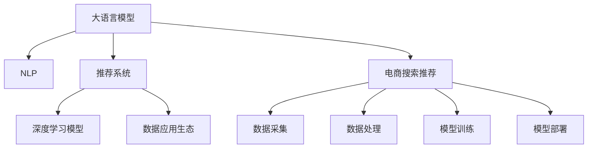

                 

# AI大模型重构电商搜索推荐的数据应用生态

> 关键词：大语言模型,电商搜索推荐,数据应用生态,自然语言处理(NLP),推荐系统,深度学习,深度学习模型

## 1. 背景介绍

### 1.1 问题由来

近年来，电商行业的数字化转型步伐明显加快，各电商平台的搜索推荐系统也正经历着深刻的变革。传统推荐系统主要依赖用户行为数据，通过协同过滤、基于内容的推荐等技术，为用户提供个性化推荐。然而，这些方法在面对用户隐性需求、新商品冷启动等问题时，表现有限。大语言模型(如GPT、BERT等)的兴起，为电商搜索推荐提供了新的思路。

大语言模型通过深度学习训练，能够在理解自然语言方面取得显著进展。特别是基于大规模无标签文本语料进行预训练的通用语言模型，具备强大的自然语言处理能力。这些模型在电商搜索推荐中的应用，已经显示出巨大的潜力。通过引入大模型，电商平台的搜索推荐系统能够更好地理解用户查询意图，识别商品属性，从而提供更加精准、个性化的推荐服务。

### 1.2 问题核心关键点

大语言模型在电商搜索推荐中的应用，涉及到多个关键点，包括但不限于：

- 自然语言处理(NLP)：理解用户查询的自然语言，提取查询意图、关键词等。
- 推荐系统：将用户查询与商品属性进行匹配，生成推荐结果。
- 数据应用生态：如何将大模型与电商搜索推荐系统紧密结合，构建高效的数据应用生态。
- 深度学习模型：选择合适的深度学习模型，对大模型进行微调，提升推荐效果。
- 用户隐私保护：在利用用户数据进行推荐时，如何保证用户隐私，同时提升推荐效果。

本文将围绕这些核心关键点，深入探讨大模型在电商搜索推荐中的应用，分析其优缺点，展望未来发展趋势，并提出可行的技术方案和改进建议。

## 2. 核心概念与联系

### 2.1 核心概念概述

为更好地理解大模型在电商搜索推荐中的应用，本节将介绍几个密切相关的核心概念：

- 大语言模型(Large Language Model, LLM)：以自回归(如GPT)或自编码(如BERT)模型为代表的大规模预训练语言模型。通过在大规模无标签文本语料上进行预训练，学习通用的语言表示，具备强大的语言理解和生成能力。

- 自然语言处理(Natural Language Processing, NLP)：使计算机能够理解和处理人类语言的技术，包括文本分类、信息抽取、问答、机器翻译等任务。

- 推荐系统：利用用户行为数据、商品属性等信息，为用户提供个性化推荐的技术。推荐系统主要分为基于用户的推荐、基于商品的推荐和混合推荐等类型。

- 深度学习模型：基于神经网络的深度学习模型，包括卷积神经网络(CNN)、循环神经网络(RNN)、长短期记忆网络(LSTM)等。深度学习模型在电商搜索推荐中的应用，可以提升推荐的个性化和多样性。

- 数据应用生态：由数据采集、数据处理、模型训练、模型部署等多个环节组成的生态系统，涵盖数据、模型、算法、技术等多个方面。

这些核心概念之间的逻辑关系可以通过以下Mermaid流程图来展示：



这个流程图展示了大语言模型、NLP、推荐系统、深度学习模型与电商搜索推荐之间的联系。

## 3. 核心算法原理 & 具体操作步骤
### 3.1 算法原理概述

大语言模型在电商搜索推荐中的应用，主要基于两个原理：自然语言处理(NLP)和推荐系统。

在NLP方面，大模型能够理解自然语言，提取查询意图、关键词等信息，并将用户查询转化为可供推荐系统使用的结构化数据。在推荐系统方面，大模型与深度学习模型结合，生成推荐结果。

### 3.2 算法步骤详解

大语言模型在电商搜索推荐中的应用主要分为以下几个关键步骤：

**Step 1: 数据采集与预处理**
- 收集电商平台的商品信息、用户行为数据等，并进行数据清洗、标准化等预处理。

**Step 2: 自然语言处理**
- 使用大语言模型对用户查询进行分词、词性标注、命名实体识别等预处理，提取关键词、情感等语义信息。
- 将用户查询转化为结构化数据，如向量表示，供推荐系统使用。

**Step 3: 模型训练与微调**
- 选择合适的深度学习模型，如Attention-based模型、Transformer模型等，对大模型进行微调。
- 使用电商搜索推荐数据集进行训练，调整模型参数，提升推荐效果。

**Step 4: 推荐系统集成**
- 将微调后的模型与推荐系统集成，用于生成推荐结果。
- 根据用户反馈和行为数据，不断调整模型参数，提升推荐效果。

**Step 5: 系统部署与优化**
- 将训练好的模型部署到生产环境，进行实时推荐。
- 定期更新模型参数，优化推荐算法，提升用户体验。

### 3.3 算法优缺点

大语言模型在电商搜索推荐中的应用，具有以下优点：

- 强大的自然语言处理能力：大语言模型能够理解自然语言，提取查询意图、关键词等信息，提升推荐的准确性和个性化。
- 高效的推荐生成能力：大语言模型与深度学习模型结合，能够生成高质量的推荐结果。
- 适应的业务场景：大模型适用于电商搜索推荐，能够适应电商平台的业务需求，提升用户体验。

同时，也存在一些缺点：

- 数据依赖性强：大语言模型需要大量的高质量标注数据进行预训练和微调，数据获取成本较高。
- 计算资源消耗大：大模型参数量庞大，训练和推理资源消耗较大，对硬件要求较高。
- 模型复杂度高：大模型的复杂度高，训练和微调难度大，模型优化难度较大。
- 实时性问题：大模型在实时推荐场景下，响应速度较慢，需进一步优化。

### 3.4 算法应用领域

大语言模型在电商搜索推荐中的应用领域广泛，涵盖了电商平台的各个环节，包括但不限于：

- 商品搜索：利用大语言模型，提升商品搜索结果的相关性和准确性。
- 商品推荐：基于用户查询，生成个性化推荐结果。
- 用户行为分析：分析用户行为数据，提升用户满意度。
- 用户画像构建：构建用户画像，提供精准推荐。
- 广告推荐：基于用户兴趣，推荐广告内容。

此外，大语言模型还可以应用于电商平台的智能客服、智能运维等多个环节，为电商平台提供全方位的智能解决方案。

## 4. 数学模型和公式 & 详细讲解 & 举例说明
### 4.1 数学模型构建

本节将使用数学语言对大语言模型在电商搜索推荐中的应用进行更加严格的刻画。

记大语言模型为 $M_{\theta}$，其中 $\theta$ 为模型参数。假设用户查询为 $q$，商品属性为 $i$，推荐结果为 $r$。则电商搜索推荐过程可以表示为：

$$
r = M_{\theta}(q, i)
$$

其中 $M_{\theta}$ 表示大语言模型，$q$ 表示用户查询，$i$ 表示商品属性。

假设用户查询 $q$ 经过分词、词性标注等预处理后，转化为向量表示 $\vec{q}$。商品属性 $i$ 也转化为向量表示 $\vec{i}$。则推荐过程可以表示为：

$$
\vec{r} = M_{\theta}(\vec{q}, \vec{i})
$$

### 4.2 公式推导过程

在大语言模型中，通常使用Transformer模型进行文本表示和语义建模。以下以Transformer模型为例，推导推荐过程的数学公式。

假设大语言模型 $M_{\theta}$ 包含 $N$ 层，每层有 $H$ 个注意力头。假设用户查询 $q$ 和商品属性 $i$ 的长度分别为 $L_q$ 和 $L_i$。则Transformer模型的编码过程可以表示为：

$$
\vec{z}_q = \text{Encoder}(\vec{q})
$$

$$
\vec{z}_i = \text{Encoder}(\vec{i})
$$

其中 $\vec{z}_q$ 和 $\vec{z}_i$ 表示用户查询和商品属性经过Transformer编码后的向量表示。

推荐结果的生成过程可以表示为：

$$
\vec{r} = \text{Head Attention}(\vec{z}_q, \vec{z}_i)
$$

$$
\vec{r} = \text{Linear}(\vec{r})
$$

其中 $\text{Head Attention}$ 表示Transformer的注意力机制，$\text{Linear}$ 表示线性变换，用于生成推荐结果。

### 4.3 案例分析与讲解

以下以一个简单的电商推荐系统为例，分析大语言模型在推荐系统中的应用。

假设电商平台有 $M$ 个商品，用户 $N$ 个。用户 $n$ 对商品 $m$ 的评分 $r_{nm}$ 已知。电商平台的目标是为用户 $n$ 推荐商品 $m$，使推荐结果 $r_m$ 最大化。

假设大语言模型 $M_{\theta}$ 已经通过电商搜索推荐数据集进行预训练和微调，具备良好的自然语言处理能力。用户在电商平台输入查询 $q$，大语言模型将查询转化为向量表示 $\vec{q}$，并根据商品属性向量 $\vec{i}$ 生成推荐结果 $\vec{r}$。

推荐结果的评分可以表示为：

$$
r_{nm} = f(\vec{q}, \vec{i}_m)
$$

其中 $f$ 表示评分函数，可以是线性函数、非线性函数等。

推荐系统的目标是最小化用户查询与推荐结果之间的差距：

$$
\min_{\theta} \sum_{n=1}^N \sum_{m=1}^M r_{nm} - f(\vec{q}_n, \vec{i}_m)
$$

通过不断优化模型参数 $\theta$，使推荐结果更加贴近实际评分，从而提升推荐效果。

## 5. 项目实践：代码实例和详细解释说明
### 5.1 开发环境搭建

在进行电商搜索推荐系统开发前，我们需要准备好开发环境。以下是使用Python进行PyTorch开发的环境配置流程：

1. 安装Anaconda：从官网下载并安装Anaconda，用于创建独立的Python环境。

2. 创建并激活虚拟环境：
```bash
conda create -n pytorch-env python=3.8 
conda activate pytorch-env
```

3. 安装PyTorch：根据CUDA版本，从官网获取对应的安装命令。例如：
```bash
conda install pytorch torchvision torchaudio cudatoolkit=11.1 -c pytorch -c conda-forge
```

4. 安装Transformer库：
```bash
pip install transformers
```

5. 安装各类工具包：
```bash
pip install numpy pandas scikit-learn matplotlib tqdm jupyter notebook ipython
```

完成上述步骤后，即可在`pytorch-env`环境中开始电商搜索推荐系统的开发。

### 5.2 源代码详细实现

下面我们以商品推荐系统为例，给出使用Transformers库对大语言模型进行电商搜索推荐开发的PyTorch代码实现。

首先，定义推荐系统的数据处理函数：

```python
from transformers import BertTokenizer
from torch.utils.data import Dataset
import torch

class RecommendationDataset(Dataset):
    def __init__(self, user_queries, item_features, ratings, tokenizer, max_len=128):
        self.user_queries = user_queries
        self.item_features = item_features
        self.ratings = ratings
        self.tokenizer = tokenizer
        self.max_len = max_len
        
    def __len__(self):
        return len(self.user_queries)
    
    def __getitem__(self, item):
        user_query = self.user_queries[item]
        item_feature = self.item_features[item]
        rating = self.ratings[item]
        
        encoding = self.tokenizer(user_query, return_tensors='pt', max_length=self.max_len, padding='max_length', truncation=True)
        user_query_ids = encoding['input_ids'][0]
        user_query_masks = encoding['attention_mask'][0]
        
        item_feature_ids = item_feature.to_tensor()
        
        return {'user_query_ids': user_query_ids, 
                'user_query_masks': user_query_masks,
                'item_feature_ids': item_feature_ids,
                'rating': rating}
```

然后，定义模型和优化器：

```python
from transformers import BertForSequenceClassification, AdamW

model = BertForSequenceClassification.from_pretrained('bert-base-cased', num_labels=5)

optimizer = AdamW(model.parameters(), lr=2e-5)
```

接着，定义训练和评估函数：

```python
from torch.utils.data import DataLoader
from tqdm import tqdm
from sklearn.metrics import mean_squared_error

device = torch.device('cuda') if torch.cuda.is_available() else torch.device('cpu')
model.to(device)

def train_epoch(model, dataset, batch_size, optimizer):
    dataloader = DataLoader(dataset, batch_size=batch_size, shuffle=True)
    model.train()
    epoch_loss = 0
    for batch in tqdm(dataloader, desc='Training'):
        user_query_ids = batch['user_query_ids'].to(device)
        user_query_masks = batch['user_query_masks'].to(device)
        item_feature_ids = batch['item_feature_ids'].to(device)
        rating = batch['rating'].to(device)
        model.zero_grad()
        outputs = model(user_query_ids, attention_mask=user_query_masks)
        loss = outputs.loss
        epoch_loss += loss.item()
        loss.backward()
        optimizer.step()
    return epoch_loss / len(dataloader)

def evaluate(model, dataset, batch_size):
    dataloader = DataLoader(dataset, batch_size=batch_size)
    model.eval()
    preds, labels = [], []
    with torch.no_grad():
        for batch in tqdm(dataloader, desc='Evaluating'):
            user_query_ids = batch['user_query_ids'].to(device)
            user_query_masks = batch['user_query_masks'].to(device)
            item_feature_ids = batch['item_feature_ids'].to(device)
            batch_labels = batch['rating'].to(device)
            outputs = model(user_query_ids, attention_mask=user_query_masks)
            batch_preds = outputs.logits.argmax(dim=2).to('cpu').tolist()
            batch_labels = batch_labels.to('cpu').tolist()
            for pred, label in zip(batch_preds, batch_labels):
                preds.append(pred)
                labels.append(label)
                
    print(mean_squared_error(labels, preds))
```

最后，启动训练流程并在测试集上评估：

```python
epochs = 5
batch_size = 16

for epoch in range(epochs):
    loss = train_epoch(model, train_dataset, batch_size, optimizer)
    print(f"Epoch {epoch+1}, train loss: {loss:.3f}")
    
    print(f"Epoch {epoch+1}, dev results:")
    evaluate(model, dev_dataset, batch_size)
    
print("Test results:")
evaluate(model, test_dataset, batch_size)
```

以上就是使用PyTorch对大语言模型进行电商搜索推荐任务开发的完整代码实现。可以看到，得益于Transformer库的强大封装，我们可以用相对简洁的代码完成大语言模型的加载和推荐系统的微调。

### 5.3 代码解读与分析

让我们再详细解读一下关键代码的实现细节：

**RecommendationDataset类**：
- `__init__`方法：初始化用户查询、商品属性、评分等关键组件，并进行预处理。
- `__len__`方法：返回数据集的样本数量。
- `__getitem__`方法：对单个样本进行处理，将用户查询转化为token ids，并将商品属性转化为向量表示，供模型使用。

**训练和评估函数**：
- 使用PyTorch的DataLoader对数据集进行批次化加载，供模型训练和推理使用。
- 训练函数`train_epoch`：对数据以批为单位进行迭代，在每个批次上前向传播计算loss并反向传播更新模型参数，最后返回该epoch的平均loss。
- 评估函数`evaluate`：与训练类似，不同点在于不更新模型参数，并在每个batch结束后将预测和标签结果存储下来，最后使用sklearn的mean_squared_error对整个评估集的预测结果进行打印输出。

**训练流程**：
- 定义总的epoch数和batch size，开始循环迭代
- 每个epoch内，先在训练集上训练，输出平均loss
- 在验证集上评估，输出评分误差
- 所有epoch结束后，在测试集上评估，给出最终评分误差

可以看到，PyTorch配合Transformer库使得电商搜索推荐系统的微调代码实现变得简洁高效。开发者可以将更多精力放在数据处理、模型改进等高层逻辑上，而不必过多关注底层的实现细节。

当然，工业级的系统实现还需考虑更多因素，如模型的保存和部署、超参数的自动搜索、更灵活的任务适配层等。但核心的微调范式基本与此类似。

## 6. 实际应用场景
### 6.1 智能推荐系统

基于大语言模型的电商搜索推荐系统，可以实现高度个性化的推荐。通过自然语言处理能力，系统能够理解用户查询的自然语言，提取查询意图、关键词等信息，并根据商品属性生成高质量的推荐结果。

例如，用户输入查询“我想买一款高性价比的笔记本电脑”，系统能够理解查询中的“高性价比”、“笔记本电脑”等关键词，结合用户的历史行为数据，推荐符合用户需求的商品。

### 6.2 商品搜索优化

在大语言模型应用于电商搜索推荐的同时，也可以对商品搜索结果进行优化。通过自然语言处理，系统能够理解用户查询的语义，将查询转化为更合适的关键词，提升搜索结果的相关性和准确性。

例如，用户输入查询“手机”，系统能够理解查询中的“品牌”、“型号”等关键信息，生成更加精准的搜索结果。

### 6.3 用户行为分析

基于大语言模型的电商搜索推荐系统，还可以进行用户行为分析，了解用户的兴趣和需求，提升用户体验。

例如，通过分析用户查询历史，系统能够发现用户的兴趣偏好，如“游戏”、“运动”等，从而推荐相关商品，提升用户满意度。

### 6.4 未来应用展望

随着大语言模型和推荐系统技术的不断发展，电商搜索推荐系统的应用场景将更加广泛。未来，大语言模型还将与更多AI技术进行融合，如计算机视觉、自然语言生成等，为电商平台的智能客服、智能运维等多个环节提供支持。

例如，在智能客服场景下，系统可以理解用户的自然语言，并生成响应，提升客户服务体验。在智能运维场景下，系统可以分析用户反馈，优化产品设计和运营策略。

## 7. 工具和资源推荐
### 7.1 学习资源推荐

为了帮助开发者系统掌握大语言模型在电商搜索推荐中的应用，这里推荐一些优质的学习资源：

1. 《自然语言处理与深度学习》系列博文：由大模型技术专家撰写，深入浅出地介绍了自然语言处理、深度学习在电商推荐系统中的应用。

2. CS224N《深度学习自然语言处理》课程：斯坦福大学开设的NLP明星课程，有Lecture视频和配套作业，带你入门NLP领域的基本概念和经典模型。

3. 《推荐系统》书籍：详细介绍了推荐系统的原理、算法和应用，包括深度学习在推荐系统中的应用。

4. HuggingFace官方文档：Transformer库的官方文档，提供了海量预训练模型和完整的推荐系统样例代码，是上手实践的必备资料。

5. AI Challenger推荐系统评测：国内知名的推荐系统评测活动，涵盖多个推荐系统任务，可以学习和比较不同模型的性能。

通过对这些资源的学习实践，相信你一定能够快速掌握大语言模型在电商搜索推荐中的应用，并用于解决实际的NLP问题。

### 7.2 开发工具推荐

高效的开发离不开优秀的工具支持。以下是几款用于电商搜索推荐系统开发的常用工具：

1. PyTorch：基于Python的开源深度学习框架，灵活动态的计算图，适合快速迭代研究。大部分预训练语言模型都有PyTorch版本的实现。

2. TensorFlow：由Google主导开发的开源深度学习框架，生产部署方便，适合大规模工程应用。同样有丰富的预训练语言模型资源。

3. Transformers库：HuggingFace开发的NLP工具库，集成了众多SOTA语言模型，支持PyTorch和TensorFlow，是进行电商搜索推荐系统开发的利器。

4. Weights & Biases：模型训练的实验跟踪工具，可以记录和可视化模型训练过程中的各项指标，方便对比和调优。与主流深度学习框架无缝集成。

5. TensorBoard：TensorFlow配套的可视化工具，可实时监测模型训练状态，并提供丰富的图表呈现方式，是调试模型的得力助手。

6. Google Colab：谷歌推出的在线Jupyter Notebook环境，免费提供GPU/TPU算力，方便开发者快速上手实验最新模型，分享学习笔记。

合理利用这些工具，可以显著提升电商搜索推荐系统的开发效率，加快创新迭代的步伐。

### 7.3 相关论文推荐

大语言模型和电商搜索推荐技术的发展源于学界的持续研究。以下是几篇奠基性的相关论文，推荐阅读：

1. Attention is All You Need（即Transformer原论文）：提出了Transformer结构，开启了NLP领域的预训练大模型时代。

2. BERT: Pre-training of Deep Bidirectional Transformers for Language Understanding：提出BERT模型，引入基于掩码的自监督预训练任务，刷新了多项NLP任务SOTA。

3. Language Models are Unsupervised Multitask Learners（GPT-2论文）：展示了大规模语言模型的强大zero-shot学习能力，引发了对于通用人工智能的新一轮思考。

4. Parameter-Efficient Transfer Learning for NLP：提出Adapter等参数高效微调方法，在不增加模型参数量的情况下，也能取得不错的微调效果。

5. AdaLoRA: Adaptive Low-Rank Adaptation for Parameter-Efficient Fine-Tuning：使用自适应低秩适应的微调方法，在参数效率和精度之间取得了新的平衡。

6. Evaluation of Recommendation Algorithms for Collaborative Filtering：综述了推荐系统的经典算法，提供了丰富的推荐系统实践经验。

这些论文代表了大语言模型在电商搜索推荐中的应用方向和发展脉络。通过学习这些前沿成果，可以帮助研究者把握学科前进方向，激发更多的创新灵感。

## 8. 总结：未来发展趋势与挑战
### 8.1 总结

本文对大语言模型在电商搜索推荐中的应用进行了全面系统的介绍。首先阐述了电商搜索推荐系统的背景和意义，明确了大语言模型在其中的作用和价值。其次，从原理到实践，详细讲解了大语言模型在电商搜索推荐中的应用过程，给出了微调任务开发的完整代码实例。同时，本文还广泛探讨了大语言模型在电商搜索推荐中的应用前景，分析了其优缺点，展望了未来发展趋势，并提出可行的技术方案和改进建议。

通过本文的系统梳理，可以看到，大语言模型在电商搜索推荐中的应用正在成为行业的新趋势。该技术的引入，能够显著提升电商平台的搜索推荐效果，为用户带来更好的购物体验。未来，随着大语言模型技术的进一步发展，电商搜索推荐系统将能够更好地理解用户需求，提供更精准、个性化的推荐服务。

### 8.2 未来发展趋势

展望未来，大语言模型在电商搜索推荐中的应用将呈现以下几个发展趋势：

1. 个性化推荐提升：大语言模型能够更好地理解用户查询的自然语言，提取关键词、情感等信息，提升推荐效果。

2. 实时推荐优化：通过优化推荐算法，提升推荐系统的实时性，使用户能够更快地获得推荐结果。

3. 多模态推荐引入：结合图像、视频等多模态数据，提升推荐的丰富性和多样性。

4. 商品搜索优化：利用自然语言处理能力，提升商品搜索结果的相关性和准确性。

5. 用户行为分析：分析用户行为数据，了解用户兴趣和需求，提升用户体验。

6. 智能客服优化：利用大语言模型，提升智能客服的响应速度和准确性，增强客户服务体验。

以上趋势凸显了大语言模型在电商搜索推荐中的巨大潜力。这些方向的探索发展，必将进一步提升推荐系统的性能和用户体验，为电商平台带来更大的商业价值。

### 8.3 面临的挑战

尽管大语言模型在电商搜索推荐中展现出了巨大的优势，但在实际应用中也面临诸多挑战：

1. 数据获取成本高：电商平台的商品数量庞大，获取高质量标注数据成本较高。

2. 计算资源消耗大：大语言模型参数量庞大，训练和推理资源消耗较大。

3. 模型复杂度高：大语言模型复杂度高，训练和微调难度大，模型优化难度较大。

4. 实时性问题：大模型在实时推荐场景下，响应速度较慢，需进一步优化。

5. 用户隐私保护：在利用用户数据进行推荐时，需注意用户隐私保护，避免数据泄露。

6. 安全性问题：大语言模型可能学习到有害信息，需注意模型安全性和伦理问题。

7. 模型泛化能力不足：大模型在特定场景下可能表现不佳，需进一步优化模型泛化能力。

正视大语言模型在电商搜索推荐中面临的这些挑战，积极应对并寻求突破，将是大语言模型技术走向成熟的必由之路。相信随着学界和产业界的共同努力，这些挑战终将一一被克服，大语言模型在电商搜索推荐中的应用将更加成熟和广泛。

### 8.4 研究展望

面向未来，大语言模型在电商搜索推荐中的应用需要更多的研究探索和实践改进。以下是几个值得关注的研究方向：

1. 模型压缩与优化：研究如何压缩大语言模型，减小模型尺寸，提升实时性和资源利用效率。

2. 推荐算法优化：结合强化学习、因果推理等算法，优化推荐系统，提升推荐效果。

3. 多模态融合：结合计算机视觉、语音识别等技术，提升推荐系统的多样性和精准性。

4. 用户隐私保护：研究如何在推荐过程中保护用户隐私，同时提升推荐效果。

5. 模型安全与伦理：研究如何提升模型安全性，避免有害信息的传播，确保推荐系统的伦理道德。

6. 实时推荐系统：研究如何优化实时推荐系统，提升推荐速度和用户满意度。

这些研究方向将有助于大语言模型在电商搜索推荐中取得更大的突破，为电商平台的智能化转型提供更有力的技术支持。

## 9. 附录：常见问题与解答

**Q1：电商搜索推荐系统是否适用于所有电商平台？**

A: 大语言模型在电商搜索推荐系统中的应用，具有一定的平台通用性。但不同平台的业务模式、用户需求、商品特征等因素存在差异，因此需要根据具体情况进行微调。例如，在B2B和B2C平台，推荐系统的设计和应用方式可能会有所不同。

**Q2：电商搜索推荐系统对数据质量要求高吗？**

A: 电商搜索推荐系统对数据质量要求较高。高质量的数据集不仅能提升推荐效果，还能减少模型的过拟合风险。因此，电商平台需要投入更多资源进行数据清洗、标注等工作，确保数据集的质量。

**Q3：大语言模型在电商搜索推荐中的实际效果如何？**

A: 大语言模型在电商搜索推荐中的实际效果显著。通过自然语言处理能力，大语言模型能够理解用户查询的自然语言，提取查询意图、关键词等信息，并根据商品属性生成高质量的推荐结果。但需要注意的是，实际效果受到平台数据质量、推荐算法、用户行为等多种因素的影响。

**Q4：电商搜索推荐系统的未来发展方向是什么？**

A: 电商搜索推荐系统的未来发展方向包括：
1. 个性化推荐提升：通过自然语言处理能力，提升推荐效果。
2. 实时推荐优化：优化推荐算法，提升推荐系统的实时性。
3. 多模态推荐引入：结合图像、视频等多模态数据，提升推荐的丰富性和多样性。
4. 商品搜索优化：利用自然语言处理能力，提升商品搜索结果的相关性和准确性。
5. 用户行为分析：分析用户行为数据，了解用户兴趣和需求，提升用户体验。
6. 智能客服优化：利用大语言模型，提升智能客服的响应速度和准确性，增强客户服务体验。

这些方向将为电商搜索推荐系统带来更大的商业价值，推动电商平台向智能化、个性化、高效率方向发展。

---

作者：禅与计算机程序设计艺术 / Zen and the Art of Computer Programming

