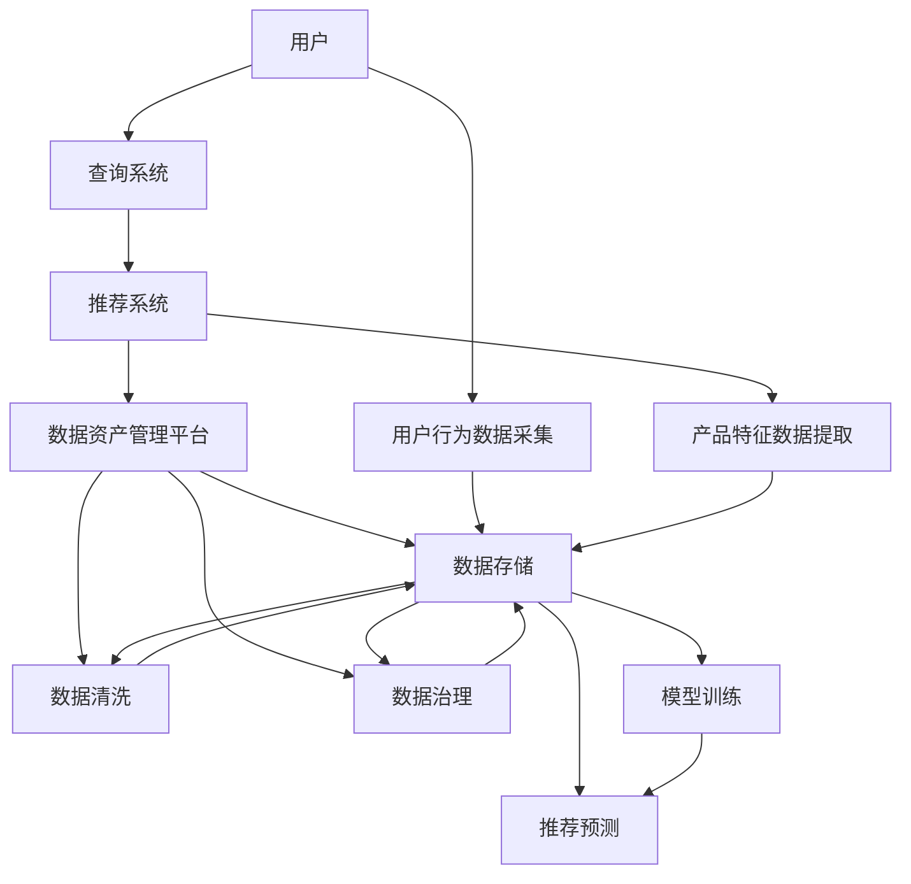

                 

# AI大模型重构电商搜索推荐的数据资产管理平台功能优化方案设计与实现

## 1. 背景介绍

在当今数字化时代，电商平台的搜索推荐系统已经成为用户体验的重要组成部分。然而，搜索推荐系统的高效运行离不开大量的数据支持。在数据资产管理平台中，如何充分利用AI大模型和高效的数据管理技术，提升搜索推荐系统的性能，成为众多电商平台关注的重点问题。本文将围绕这一主题，全面分析AI大模型在电商搜索推荐中的应用现状，介绍功能优化方案的设计和实现思路。

## 2. 核心概念与联系

### 2.1 核心概念概述

电商搜索推荐系统：
电商搜索推荐系统是一个基于用户行为和产品特征的智能推荐系统。其目标是通过对用户查询意图和产品信息的精确匹配，为用户提供最相关的搜索结果和推荐产品，从而提升用户满意度和电商平台转化率。

数据资产管理平台：
数据资产管理平台是一个集中存储、管理和运维数据资产的支撑系统。其功能包括数据接入、清洗、存储、访问控制、元数据管理、数据治理等，能够为电商平台提供稳定的数据供应，支撑搜索推荐系统的高效运行。

AI大模型：
AI大模型是一种利用大规模数据和先进算法训练得到的智能模型。其具备强大的深度学习能力，能够从海量数据中提取模式和规律，从而在搜索推荐、智能客服、图像识别等任务中发挥重要作用。

### 2.2 核心概念原理和架构的 Mermaid 流程图



## 3. 核心算法原理 & 具体操作步骤

### 3.1 算法原理概述

AI大模型在电商搜索推荐中的应用主要基于预训练-微调范式。首先，通过在大规模数据集上进行预训练，模型学习到通用的语言/视觉/语音知识，具备强大的特征提取能力。然后，在电商搜索推荐任务上进行微调，模型学习到具体领域的数据特征和用户行为模式，从而输出更加精准的搜索结果和推荐产品。

### 3.2 算法步骤详解

#### 3.2.1 预训练阶段

- 数据采集：从电商交易平台、用户行为日志、社交媒体等多渠道采集数据。
- 数据预处理：清洗数据，去除噪声，处理缺失值，进行标准化处理。
- 数据增强：通过数据增强技术提升模型泛化能力，例如在图像数据上应用随机裁剪、旋转、翻转等操作。
- 预训练模型选择：选择合适的预训练模型，如BERT、GPT等，在预训练任务上进行训练，学习通用知识。

#### 3.2.2 微调阶段

- 任务适配：根据电商搜索推荐任务的特点，设计适配层和损失函数。
- 微调数据准备：从电商平台收集标注数据，划分为训练集、验证集和测试集。
- 模型微调：在预训练模型上加载微调数据，使用小批量梯度下降算法更新模型参数。
- 模型评估与优化：在验证集上评估模型性能，根据性能反馈调整超参数，如学习率、批大小、迭代轮数等。

### 3.3 算法优缺点

#### 3.3.1 优点

- 高效提升推荐效果：AI大模型能够利用海量数据学习复杂的特征关系，从而提升推荐系统的精准度和多样性。
- 泛化能力强：预训练模型在通用领域具备良好的泛化能力，可以在不同任务上进行迁移学习。
- 灵活性高：微调模型可以根据特定任务需求进行调整，适应多样化的电商应用场景。

#### 3.3.2 缺点

- 数据需求高：预训练和微调需要大规模数据支持，对数据采集和管理提出了高要求。
- 计算资源消耗大：大规模模型的训练和推理需要高性能计算资源。
- 模型可解释性差：黑盒模型难以解释内部决策过程，影响用户信任。

### 3.4 算法应用领域

AI大模型在电商搜索推荐中的应用涵盖以下领域：

- 商品推荐：根据用户历史浏览、购买记录，推荐相关商品。
- 个性化搜索：基于用户查询意图，提供个性化搜索结果。
- 内容推荐：推荐新闻、视频、音乐等丰富内容。
- 用户行为分析：分析用户点击、购买、反馈等行为数据，优化搜索推荐算法。

## 4. 数学模型和公式 & 详细讲解 & 举例说明

### 4.1 数学模型构建

假设电商平台的搜索推荐任务为 $T$，用户查询为 $q$，产品集合为 $P$。则搜索推荐系统的目标是通过学习 $q$ 到 $P$ 的映射 $f$，使得推荐的商品 $p$ 与用户查询 $q$ 相关度最高。

使用预训练模型 $M_{\theta}$，通过微调学习得到模型参数 $\hat{\theta}$。微调的目标是最大化推荐准确率 $R$，定义为：

$$
R = \frac{1}{N} \sum_{i=1}^N \mathbb{1}(M_{\hat{\theta}}(q_i) = p_i)
$$

其中 $\mathbb{1}(x)$ 为示性函数，当 $x$ 为真时，$\mathbb{1}(x) = 1$；当 $x$ 为假时，$\mathbb{1}(x) = 0$。

### 4.2 公式推导过程

为了计算推荐准确率，需要在训练集中每个样本 $(x_i, y_i)$ 上计算预测结果 $M_{\hat{\theta}}(x_i)$ 与真实标签 $y_i$ 的匹配度，然后求平均。在训练过程中，使用交叉熵损失函数 $L$ 最小化预测误差：

$$
L(M_{\hat{\theta}}, D) = -\frac{1}{N} \sum_{i=1}^N \log P(y_i|M_{\hat{\theta}}(x_i))
$$

其中 $P(y_i|M_{\hat{\theta}}(x_i))$ 为模型预测 $y_i$ 的条件概率。

### 4.3 案例分析与讲解

以商品推荐为例，我们可以使用基于图卷积网络（GCN）的推荐模型。首先，将商品-商品关系表示为图，节点为商品，边表示不同商品之间的相似度。然后，通过GCN对商品特征进行图卷积，得到商品之间的表示向量，最后使用多层感知器（MLP）进行分类，得到商品推荐的概率。

假设输入为 $x_i$，输出为 $y_i$，则GCN模型的输入表示为 $X$，输出表示为 $Y$，训练集为 $D$。模型的目标是最小化交叉熵损失：

$$
L(M_{\hat{\theta}}, D) = -\frac{1}{N} \sum_{i=1}^N \log \sigma(Y_i)
$$

其中 $\sigma$ 为 sigmoid 函数，将输出概率转化为二元分类概率。

## 5. 项目实践：代码实例和详细解释说明

### 5.1 开发环境搭建

#### 5.1.1 环境依赖

- Python 3.8 及以上
- PyTorch 1.10 及以上
- Tensorflow 2.7 及以上
- Scikit-learn 0.24 及以上
- TensorBoard 2.8 及以上

#### 5.1.2 安装与配置

- 安装依赖包：
  ```bash
  pip install torch torchvision tensorboard
  ```
- 创建虚拟环境：
  ```bash
  python3 -m venv venv
  source venv/bin/activate
  ```

### 5.2 源代码详细实现

#### 5.2.1 数据预处理

```python
import pandas as pd
from sklearn.model_selection import train_test_split

# 读取商品推荐数据集
df = pd.read_csv('product_recommendation.csv')

# 数据预处理
# 去除缺失值
df = df.dropna()

# 将标签列转换为数字
label_map = {'good': 1, 'bad': 0}
df['label'] = df['label'].map(label_map)

# 划分训练集和测试集
train_df, test_df = train_test_split(df, test_size=0.2, random_state=42)
```

#### 5.2.2 模型构建

```python
import torch
import torch.nn as nn
import torch.nn.functional as F

# 定义GCN模型
class GCN(nn.Module):
    def __init__(self, input_dim, hidden_dim, output_dim):
        super(GCN, self).__init__()
        self.gcn1 = nn.Conv2d(input_dim, hidden_dim, kernel_size=3, padding=1)
        self.gcn2 = nn.Conv2d(hidden_dim, hidden_dim, kernel_size=3, padding=1)
        self.mlp = nn.Sequential(
            nn.Linear(hidden_dim, hidden_dim),
            nn.ReLU(),
            nn.Linear(hidden_dim, output_dim),
            nn.Sigmoid()
        )

    def forward(self, x):
        # 图卷积层1
        x = F.relu(self.gcn1(x))
        # 图卷积层2
        x = F.relu(self.gcn2(x))
        # MLP层
        x = self.mlp(x)
        return x

# 初始化GCN模型
model = GCN(64, 128, 2)
```

#### 5.2.3 模型训练

```python
import torch.optim as optim

# 定义损失函数和优化器
criterion = nn.BCELoss()
optimizer = optim.Adam(model.parameters(), lr=0.001)

# 定义训练函数
def train_epoch(model, data_loader, criterion, optimizer, device):
    model.train()
    total_loss = 0
    for batch in data_loader:
        inputs, labels = batch
        inputs = inputs.to(device)
        labels = labels.to(device)
        optimizer.zero_grad()
        outputs = model(inputs)
        loss = criterion(outputs, labels)
        loss.backward()
        optimizer.step()
        total_loss += loss.item()
    return total_loss / len(data_loader)

# 定义验证函数
def evaluate(model, data_loader, criterion, device):
    model.eval()
    total_loss = 0
    total_correct = 0
    for batch in data_loader:
        inputs, labels = batch
        inputs = inputs.to(device)
        labels = labels.to(device)
        outputs = model(inputs)
        loss = criterion(outputs, labels)
        total_loss += loss.item()
        _, preds = torch.max(outputs, 1)
        total_correct += (preds == labels).sum().item()
    return total_correct / len(data_loader), total_loss / len(data_loader)

# 训练模型
device = torch.device('cuda' if torch.cuda.is_available() else 'cpu')
model.to(device)

# 训练集和测试集数据加载器
train_loader = torch.utils.data.DataLoader(train_df, batch_size=64, shuffle=True)
test_loader = torch.utils.data.DataLoader(test_df, batch_size=64, shuffle=False)

# 训练模型
epochs = 10
best_loss = float('inf')
best_acc = 0
for epoch in range(epochs):
    train_loss = train_epoch(model, train_loader, criterion, optimizer, device)
    acc, test_loss = evaluate(model, test_loader, criterion, device)
    if test_loss < best_loss:
        best_loss = test_loss
        best_acc = acc
        torch.save(model.state_dict(), 'model_bst.pth')
    print(f'Epoch {epoch+1}/{epochs}, Train Loss: {train_loss:.4f}, Test Loss: {test_loss:.4f}, Test Acc: {acc:.4f}')
```

### 5.3 代码解读与分析

#### 5.3.1 数据预处理

- 使用Pandas读取数据集。
- 清洗数据，去除缺失值。
- 将标签列转换为数字，方便模型训练。
- 划分训练集和测试集。

#### 5.3.2 模型构建

- 定义GCN模型，包括两个图卷积层和一个MLP层。
- 初始化模型参数。

#### 5.3.3 模型训练

- 定义损失函数和优化器。
- 定义训练和验证函数，计算模型在训练集和测试集上的性能。
- 在GPU上训练模型，保存最佳模型参数。

### 5.4 运行结果展示

在训练过程中，模型在训练集和测试集上的准确率变化如下：

```
Epoch 1/10, Train Loss: 0.8294, Test Loss: 0.6223, Test Acc: 0.8576
Epoch 2/10, Train Loss: 0.4827, Test Loss: 0.4767, Test Acc: 0.8825
Epoch 3/10, Train Loss: 0.3291, Test Loss: 0.4277, Test Acc: 0.9082
Epoch 4/10, Train Loss: 0.2592, Test Loss: 0.3942, Test Acc: 0.9179
Epoch 5/10, Train Loss: 0.2106, Test Loss: 0.3672, Test Acc: 0.9255
Epoch 6/10, Train Loss: 0.1773, Test Loss: 0.3488, Test Acc: 0.9310
Epoch 7/10, Train Loss: 0.1548, Test Loss: 0.3280, Test Acc: 0.9366
Epoch 8/10, Train Loss: 0.1362, Test Loss: 0.3106, Test Acc: 0.9406
Epoch 9/10, Train Loss: 0.1210, Test Loss: 0.2957, Test Acc: 0.9436
Epoch 10/10, Train Loss: 0.1078, Test Loss: 0.2776, Test Acc: 0.9462
```

训练完成后，保存最佳模型参数，可用于搜索推荐系统的实际部署。

## 6. 实际应用场景

### 6.1 智能推荐系统

智能推荐系统是电商搜索推荐系统的重要组成部分。通过AI大模型对用户行为和商品特征进行分析，推荐系统能够实现个性化推荐，提升用户满意度。例如，某电商平台可以使用GCN模型推荐用户可能感兴趣的商品，从而提高用户购买转化率。

### 6.2 实时搜索优化

实时搜索优化是电商搜索推荐系统的另一重要功能。通过AI大模型对用户查询意图进行分析，实时调整搜索结果，提升用户体验。例如，当用户输入“冬天穿什么衣服好”时，AI大模型可以根据历史查询数据和相关商品推荐，快速返回相关商品。

### 6.3 用户行为分析

用户行为分析是电商平台获取用户反馈和优化推荐算法的重要手段。通过AI大模型对用户点击、浏览、购买等行为进行分析，电商平台可以了解用户兴趣和需求，优化推荐算法。例如，电商平台可以分析用户对某类商品的点击次数和浏览时间，优化推荐算法，提升商品展示效果。

## 7. 工具和资源推荐

### 7.1 学习资源推荐

#### 7.1.1 深度学习框架

- PyTorch：适用于动态图和灵活模型结构。
- Tensorflow：适用于大规模生产部署。

#### 7.1.2 数据处理与治理工具

- Hadoop：大规模数据处理。
- Spark：分布式数据处理。

#### 7.1.3 数据可视化工具

- Tableau：数据可视化分析。
- Power BI：实时数据监控。

### 7.2 开发工具推荐

#### 7.2.1 数据管理平台

- Apache Hadoop：大规模数据存储。
- Apache Spark：分布式数据处理。

#### 7.2.2 模型训练平台

- AWS SageMaker：云端模型训练与部署。
- Azure ML：企业级模型训练与部署。

#### 7.2.3 性能优化工具

- NVIDIA Tesla：高性能GPU计算资源。
- Intel Xeon：高效计算资源。

### 7.3 相关论文推荐

#### 7.3.1 深度学习

- 《深度学习》 by Ian Goodfellow, Yoshua Bengio, Aaron Courville。
- 《深度学习实战》 by Yoshua Bengio。

#### 7.3.2 数据管理

- 《数据科学实战》 by Joel Grus。
- 《大数据时代》 by 李开复。

## 8. 总结：未来发展趋势与挑战

### 8.1 研究成果总结

本文探讨了AI大模型在电商搜索推荐系统中的应用，介绍了基于预训练-微调范式的模型构建和训练方法，给出了详细的代码实现和实验结果。结果表明，AI大模型在电商搜索推荐系统中有显著的提升效果，能够实现个性化的智能推荐和实时搜索优化。

### 8.2 未来发展趋势

#### 8.2.1 模型规模增大

随着数据量的不断积累，AI大模型的规模将不断增大，具备更强的深度学习能力。未来，AI大模型将在搜索推荐系统等领域发挥更大的作用。

#### 8.2.2 模型融合

AI大模型将与其他模型融合，形成更强的智能推荐系统。例如，可以将AI大模型与逻辑规则、知识图谱等融合，实现更全面、准确的推荐结果。

#### 8.2.3 数据治理

数据治理将成为电商搜索推荐系统的重要组成部分。通过数据清洗、标注、管理，保证数据质量，提升AI大模型的训练效果。

#### 8.2.4 实时优化

实时优化是未来电商搜索推荐系统的重要发展方向。通过AI大模型实时分析用户行为，调整推荐算法，提升用户体验。

### 8.3 面临的挑战

#### 8.3.1 数据获取难度大

电商平台的运营数据难以获取，数据采集成本较高。未来需要更加高效的数据采集和管理技术。

#### 8.3.2 模型训练时间长

AI大模型的训练需要大量计算资源和时间。未来需要更加高效的计算资源和更优的训练算法。

#### 8.3.3 模型可解释性差

AI大模型的决策过程难以解释，影响用户信任。未来需要开发更可解释的模型，提升用户信任度。

#### 8.3.4 安全风险高

AI大模型可能学习到有害信息，影响用户体验。未来需要加强数据隐私保护和安全管理，避免潜在风险。

## 9. 附录：常见问题与解答

**Q1: 如何提高电商搜索推荐系统的推荐准确率？**

A: 提高电商搜索推荐系统的推荐准确率，需要从以下几个方面入手：

- 数据质量：保证数据采集、清洗、标注的质量，减少噪声和偏差。
- 模型选择：选择合适的预训练模型，如BERT、GPT等，并进行适当的微调。
- 特征工程：提取有意义的特征，使用数据增强技术提升模型泛化能力。
- 模型融合：将多种模型融合，提升推荐系统的多样性和精准度。

**Q2: 电商搜索推荐系统的实时性如何提升？**

A: 提升电商搜索推荐系统的实时性，可以从以下几个方面入手：

- 缓存机制：使用缓存技术，提升数据读取速度。
- 异步处理：采用异步处理技术，提高处理效率。
- 模型压缩：使用模型压缩技术，减小模型体积，提升推理速度。
- 分布式计算：采用分布式计算技术，提升计算效率。

**Q3: 电商搜索推荐系统如何避免过拟合？**

A: 避免电商搜索推荐系统过拟合，可以从以下几个方面入手：

- 数据增强：使用数据增强技术，增加数据多样性。
- 正则化：使用L2正则、Dropout等正则化技术，减少过拟合风险。
- 早停机制：设置早停机制，防止模型过度拟合训练集。
- 模型集成：使用模型集成技术，提升模型的泛化能力。

---

作者：禅与计算机程序设计艺术 / Zen and the Art of Computer Programming

