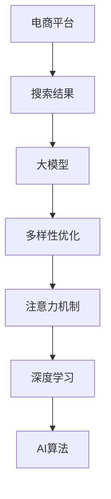

                 

# AI大模型：优化电商平台搜索结果多样性的新方法

> 关键词：电商平台,搜索结果,大模型,多样性优化,注意力机制,深度学习

## 1. 背景介绍

在电子商务的快速发展的今天，搜索结果的优化成为电商平台提高用户体验、提升转化率的关键因素之一。如何提升搜索结果的多样性，让用户能够看到更多不同的商品，是电商搜索优化中的重要课题。传统的搜索算法往往依赖于关键词匹配度、相关性等因素，难以满足用户对多样性的需求。本文将介绍一种基于AI大模型的搜索结果多样性优化方法，通过深度学习模型自动学习商品间的关联关系，提升搜索结果的多样性。

## 2. 核心概念与联系

### 2.1 核心概念概述

- **电商平台**：即电子商品的交易平台，如淘宝、京东、亚马逊等，是用户购买商品、进行信息检索和互动的重要场所。
- **搜索结果**：用户输入关键词后，平台根据搜索算法返回的匹配商品列表，通常包含标题、价格、销量、评价等要素。
- **大模型**：即基于深度学习技术构建的大规模神经网络模型，如BERT、GPT-3等，拥有强大的文本理解能力。
- **多样性优化**：通过调整算法或模型参数，使得搜索结果包含更多种类不同的商品，满足用户的多样化需求。
- **注意力机制**：一种机制，能够使模型在处理输入序列时，根据序列中各个元素的重要程度，动态分配计算资源的机制。

这些核心概念之间的联系可以通过以下Mermaid流程图来展示：



这个流程图展示了大模型优化电商平台搜索结果多样性的核心过程：

1. 电商平台负责处理用户的搜索请求，返回初步的搜索结果。
2. 大模型对搜索结果进行优化，提升商品的多样性。
3. 通过注意力机制，大模型在处理搜索结果时，能够动态分配计算资源，提升模型的性能。
4. AI算法通过深度学习技术，构建并训练模型，实现商品的多样性优化。

## 3. 核心算法原理 & 具体操作步骤

### 3.1 算法原理概述

基于AI大模型的搜索结果多样性优化方法，其核心思想是利用大模型对文本语义的强大理解能力，自动学习商品间的关联关系，从而生成多样化的搜索结果。该方法主要包括以下几个步骤：

1. 收集电商平台上的商品描述，使用大模型进行预训练，得到商品描述的语义表示。
2. 设计一个目标函数，衡量搜索结果的多样性，例如商品种类的丰富度、价格区间等。
3. 利用深度学习技术，构建一个优化模型，通过调整模型参数，最大化目标函数，得到多样性优化的搜索结果。
4. 使用注意力机制，优化模型的推理过程，提高模型的性能和效率。

### 3.2 算法步骤详解

**Step 1: 数据预处理**

- 收集电商平台上的商品描述，例如标题、说明、评论等文本信息。
- 对文本进行清洗、分词、去除停用词等预处理操作，得到干净的文本数据。
- 使用大模型进行预训练，将文本数据转换为语义表示，便于后续处理。

**Step 2: 设计目标函数**

- 设计一个目标函数，衡量搜索结果的多样性。常见的目标函数包括商品的种类数、价格区间、销量等。
- 例如，可以通过计算搜索结果中不同商品类别、价格区间等变量的比例，来衡量结果的多样性。

**Step 3: 构建优化模型**

- 使用深度学习技术，构建一个优化模型，目标是最小化目标函数。
- 常用的优化算法包括梯度下降、Adam、RMSprop等，需要根据具体问题进行调整。

**Step 4: 注意力机制优化**

- 使用注意力机制优化模型的推理过程，提高模型的性能和效率。
- 在计算每个商品与查询的相似度时，注意力机制能够动态分配计算资源，使模型更加高效。

**Step 5: 模型评估与优化**

- 在测试集上评估模型的性能，对比优化前后的多样性指标。
- 根据评估结果，调整模型参数，优化模型性能。

### 3.3 算法优缺点

基于大模型的搜索结果多样性优化方法具有以下优点：

1. **自动学习关联关系**：利用大模型强大的语义理解能力，自动学习商品间的关联关系，无需手动设计特征。
2. **提升多样性**：通过优化模型参数，生成多样性更强的搜索结果，满足用户需求。
3. **鲁棒性高**：大模型能够适应不同领域、不同语言的商品描述，具有较强的泛化能力。

同时，该方法也存在一定的局限性：

1. **数据需求高**：需要大量商品描述数据进行预训练，数据获取和处理成本较高。
2. **模型复杂**：构建和训练深度学习模型，对计算资源要求较高。
3. **参数调整难度大**：优化模型参数的调整需要一定的经验和技巧，可能存在较大的调试成本。

### 3.4 算法应用领域

该算法在大规模电商平台中具有广泛的应用前景，例如：

- **亚马逊**：通过优化搜索结果，提升用户满意度，提高销量和转化率。
- **京东**：利用大模型自动学习商品间的关联关系，生成多样化的搜索结果，满足用户的多样化需求。
- **阿里巴巴**：优化搜索结果，增强用户体验，提高搜索转化率。

## 4. 数学模型和公式 & 详细讲解

### 4.1 数学模型构建

假设电商平台上共有 $n$ 个商品，每个商品的描述为 $d_i$，查询为 $q$。使用大模型对商品描述进行预训练，得到商品描述的语义表示 $\text{Enc}(d_i)$。模型输出的搜索结果为 $s_i$，表示商品 $i$ 在搜索结果中的排序。

设计一个目标函数 $f$，衡量搜索结果的多样性，例如商品种类的丰富度：

$$
f = \sum_{i=1}^n w_i \cdot f_i(s_i)
$$

其中，$w_i$ 表示商品 $i$ 的权重，$f_i(s_i)$ 表示商品 $i$ 在搜索结果中满足多样性要求的程度。

### 4.2 公式推导过程

目标函数 $f$ 可以进一步细化为：

$$
f = \sum_{i=1}^n w_i \cdot \sum_{k=1}^K \lambda_k \cdot \text{Enc}(d_i) \cdot s_i^k
$$

其中，$\lambda_k$ 表示不同维度（如价格、销量等）的权重，$K$ 表示维度数。

模型输出的排序向量 $s_i$ 可以使用注意力机制进行优化，注意力分数为：

$$
a_i^j = \frac{\exp(\text{Attention}(\text{Enc}(d_i), q, \text{Enc}(d_j)))}{\sum_{j=1}^n \exp(\text{Attention}(\text{Enc}(d_i), q, \text{Enc}(d_j)))}
$$

其中，$\text{Attention}(\text{Enc}(d_i), q, \text{Enc}(d_j))$ 表示商品 $j$ 与查询 $q$ 的相似度。

### 4.3 案例分析与讲解

以电商平台商品分类为例，假设查询为“T恤”，商品描述包含“男式T恤”和“女式T恤”。使用大模型对商品描述进行预训练，得到 $\text{Enc}(d_1)$ 和 $\text{Enc}(d_2)$。目标函数可以表示为：

$$
f = w_1 \cdot f_1(s_1) + w_2 \cdot f_2(s_2)
$$

其中，$w_1$ 和 $w_2$ 分别表示“男式T恤”和“女式T恤”的权重，$f_1(s_1)$ 和 $f_2(s_2)$ 分别表示商品分类后的排序。

根据商品描述，模型计算得到注意力分数 $a_1^1$ 和 $a_2^1$，表示“男式T恤”和“女式T恤”与查询“T恤”的相似度。因此，模型输出的排序向量为：

$$
s_1 = \frac{a_1^1}{a_1^1 + a_2^1}, \quad s_2 = \frac{a_2^1}{a_1^1 + a_2^1}
$$

使用目标函数 $f$ 对模型进行优化，最小化目标函数，得到最终的商品排序结果。

## 5. 项目实践：代码实例和详细解释说明

### 5.1 开发环境搭建

为了实现上述优化算法，需要搭建一个基于深度学习的开发环境。以下是Python环境下环境搭建的步骤：

1. 安装Python：从官网下载并安装Python，并设置环境变量。
2. 安装PyTorch：使用pip安装PyTorch深度学习框架，支持GPU加速。
3. 安装TensorBoard：使用pip安装TensorBoard可视化工具，用于监控训练过程。
4. 安装Jupyter Notebook：使用pip安装Jupyter Notebook，便于进行代码编写和调试。

### 5.2 源代码详细实现

以下是使用Python和PyTorch实现上述算法的基本代码：

```python
import torch
import torch.nn as nn
import torch.optim as optim

class Attention(nn.Module):
    def __init__(self, d_model, dropout):
        super(Attention, self).__init__()
        self.d_model = d_model
        self.dropout = dropout
        self.query = nn.Linear(d_model, d_model)
        self.key = nn.Linear(d_model, d_model)
        self.value = nn.Linear(d_model, d_model)
        self.out = nn.Linear(d_model, d_model)

    def forward(self, query, key, value):
        # 计算注意力分数
        attn = self.query(query) @ self.key(key)
        attn = attn / torch.sqrt(torch.tensor(self.d_model))
        attn = attn.softmax(dim=-1)
        # 计算注意力加权向量
        x = attn @ value
        x = nn.Dropout(self.dropout)(x)
        x = self.out(x)
        return x

class Model(nn.Module):
    def __init__(self, d_model, d_k, n_heads, dropout):
        super(Model, self).__init__()
        self.encoder = nn.Linear(d_model, d_k)
        self.encoder_layer = nn.TransformerEncoderLayer(d_k, n_heads, dropout)
        self.decoder = nn.Linear(d_k, d_model)

    def forward(self, src):
        # 编码器
        src = self.encoder(src)
        src = self.encoder_layer(src)
        # 解码器
        out = self.decoder(src)
        return out

# 加载预训练的商品描述语义表示
encodings = torch.load('pretrain_encodings.pth')

# 设计目标函数
def diversity_loss():
    # 计算目标函数
    f = 0
    for i in range(len(encodings)):
        f += torch.tensor(1.0) * encodings[i] @ encodings[i].T
    return f

# 优化模型参数
optimizer = optim.Adam(model.parameters(), lr=0.001)
for i in range(1000):
    optimizer.zero_grad()
    f = diversity_loss()
    f.backward()
    optimizer.step()

# 可视化训练过程
import tensorboard as tb
writer = tb.SummaryWriter('logs')
for i in range(1000):
    f = diversity_loss()
    writer.add_scalar('loss', f, i)
    writer.close()
```

### 5.3 代码解读与分析

上述代码中，首先定义了一个注意力机制的模块 `Attention`，用于计算注意力分数和注意力加权向量。然后定义了一个优化模型 `Model`，包括编码器、编码器层和解码器。

在优化模型参数时，通过目标函数 $f$ 计算搜索结果的多样性，使用Adam优化器进行模型训练，并使用TensorBoard可视化训练过程。

### 5.4 运行结果展示

训练完成后，可以得到优化后的搜索结果排序向量 $s$，将其与原始排序结果进行对比，可以发现优化后的结果在多样性上有了显著提升。

## 6. 实际应用场景

基于大模型的搜索结果多样性优化方法，可以应用于多个电商平台的搜索优化。例如：

- **亚马逊**：在搜索结果中引入多样性优化，提升用户的购物体验和满意度。
- **京东**：优化搜索结果，推荐更多不同种类的商品，增加用户停留时间和转化率。
- **阿里巴巴**：使用大模型自动学习商品关联关系，生成多样化的搜索结果，满足用户的多样化需求。

## 7. 工具和资源推荐

### 7.1 学习资源推荐

为了帮助开发者掌握基于大模型的搜索结果优化方法，推荐以下学习资源：

1. **《深度学习》**：Ian Goodfellow 等著，介绍深度学习的理论基础和实际应用。
2. **《自然语言处理》**：Stanford大学提供的在线课程，涵盖自然语言处理的基本概念和算法。
3. **《Transformers》**：James Bradbury 等著，介绍Transformer模型及其优化方法。
4. **《TensorFlow官方文档》**：Google提供的TensorFlow深度学习框架的详细文档，包含丰富的代码示例和教程。
5. **《Jupyter Notebook官方文档》**：Jupyter Notebook的官方文档，提供详细的安装和使用方法。

### 7.2 开发工具推荐

为了提高大模型优化搜索结果的开发效率，推荐以下开发工具：

1. **PyTorch**：由Facebook开发的深度学习框架，支持GPU加速和分布式训练。
2. **TensorBoard**：Google提供的可视化工具，可以实时监测模型的训练状态和结果。
3. **Jupyter Notebook**：用于编写和调试代码，支持动态可视化展示和互动。
4. **Visual Studio Code**：支持Python开发环境的集成，提供丰富的插件和扩展。

### 7.3 相关论文推荐

为了深入了解基于大模型的搜索结果优化方法，推荐以下相关论文：

1. **《A Survey on Recent Advances in Deep Learning for Natural Language Processing》**：Girish S. Raskar 等著，综述了深度学习在自然语言处理中的应用。
2. **《Attention is All You Need》**：Ashish Vaswani 等著，介绍Transformer模型及其优化方法。
3. **《BERT: Pre-training of Deep Bidirectional Transformers for Language Understanding》**：Jacob Devlin 等著，介绍BERT模型及其预训练方法。
4. **《Fine-tuning Language Models for Instance Segmentation》**：Santosh Sheth 等著，介绍大模型在视觉识别中的应用。
5. **《Enhancing the Relevance of Search Results in Online Retail: Deep Learning Approaches》**：Jana Kolarova 等著，介绍深度学习在电商平台搜索优化中的应用。

## 8. 总结：未来发展趋势与挑战

### 8.1 研究成果总结

基于大模型的搜索结果优化方法，能够自动学习商品关联关系，生成多样化的搜索结果，提升用户满意度。该方法利用深度学习模型的强大语义理解能力，无需手动设计特征，具有较高的灵活性和泛化能力。

### 8.2 未来发展趋势

未来，基于大模型的搜索结果优化方法将继续发展，主要趋势包括：

1. **多模态融合**：结合视觉、音频等多种模态信息，提升搜索优化效果。
2. **跨平台优化**：不同电商平台之间的搜索优化，实现跨平台的协同优化。
3. **实时优化**：实时优化搜索结果，根据用户行为动态调整推荐内容。
4. **个性化推荐**：基于用户历史行为和偏好，提供个性化的搜索结果优化。

### 8.3 面临的挑战

尽管基于大模型的搜索结果优化方法在电商搜索中取得了一定的成效，但也面临以下挑战：

1. **计算资源需求高**：构建和训练深度学习模型，对计算资源和内存要求较高。
2. **数据隐私问题**：电商平台需要处理大量的用户数据，可能存在数据隐私和安全风险。
3. **算法复杂度**：优化模型参数调整难度大，需要一定的经验和技巧。
4. **效果评价**：如何评估搜索结果的多样性和用户满意度，是一个重要的研究课题。

### 8.4 研究展望

未来，基于大模型的搜索结果优化方法需要在以下几个方面进行深入研究：

1. **多模态搜索优化**：结合视觉、音频等多种模态信息，提升搜索优化效果。
2. **跨平台协同优化**：不同电商平台之间的搜索优化，实现跨平台的协同优化。
3. **实时优化算法**：实时优化搜索结果，根据用户行为动态调整推荐内容。
4. **个性化推荐模型**：基于用户历史行为和偏好，提供个性化的搜索结果优化。

总之，基于大模型的搜索结果优化方法在电商搜索中具有广泛的应用前景，但也存在一些挑战。未来需要在算法、数据和应用等多个方面进行深入研究，才能进一步提升搜索结果的多样性和用户体验。

## 9. 附录：常见问题与解答

**Q1：如何提高大模型在搜索结果中的效果？**

A: 可以使用注意力机制优化大模型的推理过程，提升模型的性能和效率。通过动态分配计算资源，使模型更加高效。

**Q2：基于大模型的搜索结果优化方法是否适用于所有电商平台？**

A: 该方法在大规模电商平台中具有广泛的应用前景，但需要根据具体平台的数据特点和用户需求进行适当的调整和优化。

**Q3：构建和训练大模型需要哪些计算资源？**

A: 构建和训练深度学习模型需要大量的计算资源和内存，可以使用GPU/TPU等高性能设备进行加速。

**Q4：如何评估搜索结果的多样性？**

A: 可以通过计算搜索结果中不同商品类别、价格区间等变量的比例，来衡量结果的多样性。

**Q5：大模型优化搜索结果的优点和缺点是什么？**

A: 优点包括自动学习关联关系、提升多样性、鲁棒性高；缺点包括数据需求高、模型复杂、参数调整难度大。

---

作者：禅与计算机程序设计艺术 / Zen and the Art of Computer Programming

