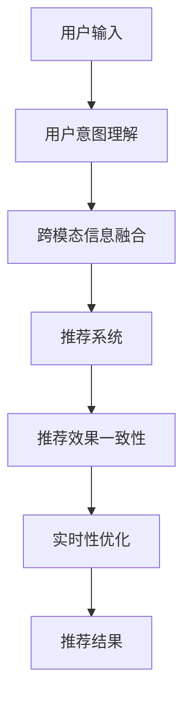

                 

# AI大模型：优化电商平台用户体验个性化与一致性的新方法

## 1. 背景介绍

### 1.1 问题由来

近年来，随着人工智能技术的飞速发展，电商平台逐渐引入AI大模型以提升用户体验和运营效率。然而，现有的电商平台主要关注数据驱动的用户行为分析，个性化推荐系统通过追踪用户行为历史，对用户进行分组，然后根据历史行为预测用户未来需求，并推荐相似商品。尽管这种做法能在一定程度上满足用户个性化需求，但存在诸多局限性，例如：

1. **数据不足**：传统的个性化推荐依赖历史数据，但用户行为数据稀疏且动态变化，难以获取完整的用户画像。
2. **数据隐私**：用户行为数据的收集和分析往往需要占用大量隐私信息，存在隐私泄露风险。
3. **推荐同质化**：历史行为相似的用户往往会被推荐相似的商品，导致推荐结果的同质化，难以发掘新需求和潜在用户。
4. **反馈延迟**：个性化推荐基于历史行为预测，无法即时响应用户反馈，导致推荐效果不稳定。

为了解决这些问题，电商平台需要引入大模型，通过理解用户语义和意图，实现个性化和动态化的推荐，提升用户体验。

### 1.2 问题核心关键点

本文聚焦于使用大模型优化电商平台的用户体验个性化与一致性问题，具体核心关键点如下：

- **用户意图理解**：通过理解用户输入的文本语义，推测用户真实需求，提供个性化的商品推荐。
- **跨模态信息融合**：将文本信息与其他模态信息（如图片、视频、商品属性等）进行融合，提升推荐的准确性。
- **推荐效果一致性**：在不同的用户会话中保持推荐的一致性，提升用户满意度。
- **实时性要求**：推荐系统需要具备快速响应用户请求的能力，提高用户体验。
- **多场景适配**：推荐系统需要在多种场景下进行适配，包括搜索、浏览、评价等。

为了实现上述目标，本文提出了一种基于大模型的电商推荐系统优化方法，具体包括用户意图理解、跨模态信息融合、推荐效果一致性保障和实时性优化四个方面。

## 2. 核心概念与联系

### 2.1 核心概念概述

为更好地理解本方法，本节将介绍几个关键概念：

- **大模型**：指使用大规模数据预训练的深度神经网络模型，如GPT、BERT等。这些模型通过自监督学习，具备强大的语言理解和生成能力。
- **推荐系统**：指根据用户的历史行为和兴趣，为用户推荐感兴趣的商品的系统。传统的推荐系统主要依赖数据驱动，但受限于数据质量和隐私问题。
- **跨模态信息融合**：指将不同模态的信息（如文本、图片、视频等）进行融合，获取更全面的用户画像，提升推荐系统的性能。
- **用户意图理解**：指通过理解用户的文本输入，推测其真实需求，提供更个性化的推荐。
- **推荐效果一致性**：指在不同的用户会话中，保持推荐结果的一致性，提升用户满意度。
- **实时性**：指推荐系统需要具备快速响应用户请求的能力，以提供更好的用户体验。

这些概念之间通过深度学习和自然语言处理技术相互联系，共同构建了电商推荐系统的基础框架。

### 2.2 核心概念原理和架构的 Mermaid 流程图



## 3. 核心算法原理 & 具体操作步骤

### 3.1 算法原理概述

本方法基于大模型，通过用户输入的文本语义理解，推测用户的真实需求，再结合跨模态信息融合，生成个性化推荐。推荐结果需要在不同用户会话中保持一致性，并具备快速响应的能力。

### 3.2 算法步骤详解

#### 步骤1：用户意图理解

- **文本预处理**：将用户输入的文本进行分词、去除停用词等预处理，并转换成模型可接受的格式。
- **语义嵌入**：使用预训练的BERT、GPT等大模型，将文本转换为向量表示，捕捉文本中的语义信息。
- **意图识别**：通过Transformer等模型，对语义向量进行分类，识别用户的真实意图。
- **意图推理**：对用户意图进行推理，理解用户的具体需求，如“购买”、“浏览”等。

#### 步骤2：跨模态信息融合

- **特征提取**：提取商品的图片、视频、属性等信息，并将其转换为向量表示。
- **特征融合**：将商品特征与用户意图表示进行融合，生成融合向量。
- **相似度计算**：计算融合向量与商品向量之间的相似度，筛选出与用户需求最匹配的商品。

#### 步骤3：推荐效果一致性

- **用户会话管理**：记录每个用户会话的历史推荐结果，作为未来推荐的基线。
- **推荐结果更新**：在每次推荐时，根据用户新的输入和行为，更新推荐结果。
- **一致性检验**：检查新推荐结果与历史推荐结果的一致性，确保推荐结果的连贯性。

#### 步骤4：实时性优化

- **分布式计算**：将推荐系统部署在多个服务器上，采用分布式计算，提高系统响应速度。
- **缓存技术**：对热门商品和用户行为数据进行缓存，减少查询时间。
- **延迟处理**：在用户输入不频繁时，延迟处理用户请求，避免系统过载。

### 3.3 算法优缺点

#### 优点

- **提升个性化推荐效果**：通过大模型理解用户语义和意图，提供更个性化的推荐。
- **跨模态融合**：结合多种模态信息，提升推荐准确性。
- **一致性保障**：在用户会话中保持推荐结果的一致性，提高用户满意度。
- **实时性优化**：采用分布式计算和缓存技术，提高系统响应速度。

#### 缺点

- **模型复杂度**：大模型的训练和推理计算量大，需要强大的计算资源。
- **数据隐私问题**：用户输入和行为数据的处理可能涉及隐私问题，需要合规处理。
- **模型泛化能力**：模型的泛化能力需进一步提升，以适应不同场景下的需求。
- **计算资源消耗**：实时推荐需要计算资源支持，系统成本较高。

### 3.4 算法应用领域

本方法适用于多种电商场景，如：

- **搜索推荐**：根据用户输入的搜索词，推荐相关商品。
- **浏览推荐**：在用户浏览商品时，推荐相关商品。
- **评价推荐**：根据用户对商品的评价，推荐其他类似商品。
- **个性化广告**：根据用户兴趣，推荐个性化的广告。
- **多商品分类**：对商品进行分类，并推荐相关分类下的商品。

## 4. 数学模型和公式 & 详细讲解 & 举例说明

### 4.1 数学模型构建

假设用户输入为 $x$，商品特征为 $y$，用户意图为 $u$，推荐结果为 $r$。构建以下数学模型：

1. **用户意图理解**：使用BERT模型将用户输入 $x$ 转换为语义向量 $v_x$。
2. **意图识别**：使用分类器对 $v_x$ 进行分类，得到用户意图 $u$。
3. **跨模态信息融合**：将商品特征 $y$ 转换为向量 $v_y$，与用户意图 $u$ 进行融合，生成融合向量 $v_{xy}$。
4. **相似度计算**：计算 $v_{xy}$ 与所有商品向量 $v_i$ 的相似度，选择与用户需求最匹配的商品 $r$。

### 4.2 公式推导过程

1. **用户意图理解**：

   $$
   v_x = BERT(x) 
   $$

   其中，$BERT(x)$ 为BERT模型对输入 $x$ 的语义嵌入。

   $$
   u = \text{classifier}(v_x)
   $$

   其中，$\text{classifier}$ 为意图识别分类器，$u$ 为用户意图。

2. **跨模态信息融合**：

   $$
   v_y = \text{encoder}(y)
   $$

   其中，$\text{encoder}$ 为特征提取模型，将商品特征 $y$ 转换为向量 $v_y$。

   $$
   v_{xy} = \text{fusion}(u, v_y)
   $$

   其中，$\text{fusion}$ 为特征融合模型，将用户意图 $u$ 和商品特征 $v_y$ 融合生成 $v_{xy}$。

3. **相似度计算**：

   $$
   s_i = \text{similarity}(v_{xy}, v_i)
   $$

   其中，$\text{similarity}$ 为相似度计算函数，$s_i$ 为商品 $i$ 与用户需求的相似度。

   $$
   r = \text{argmax}(s_i)
   $$

   其中，$\text{argmax}$ 为相似度最大值函数，$r$ 为用户需求的推荐商品。

### 4.3 案例分析与讲解

假设用户输入为“我想买一条牛仔裤”，系统进行如下处理：

1. **用户意图理解**：
   - 使用BERT模型对输入进行语义嵌入，得到向量 $v_x$。
   - 使用分类器对 $v_x$ 进行分类，识别出用户意图为“购买”。

2. **跨模态信息融合**：
   - 提取商品图片特征，并转换为向量 $v_y$。
   - 将用户意图 $u$ 与 $v_y$ 进行融合，生成融合向量 $v_{xy}$。

3. **相似度计算**：
   - 计算 $v_{xy}$ 与所有商品向量 $v_i$ 的相似度 $s_i$。
   - 选择相似度最大的商品 $r$，作为推荐结果。

例如，系统可能从数据库中查询到以下商品向量：

$$
v_1 = [0.8, 0.5, 0.2]
$$
$$
v_2 = [0.7, 0.6, 0.9]
$$
$$
v_3 = [0.9, 0.3, 0.7]
$$

与 $v_{xy}$ 的相似度计算结果为：

$$
s_1 = 0.95
$$
$$
s_2 = 0.93
$$
$$
s_3 = 0.88
$$

因此，系统推荐商品 $r = v_3$。

## 5. 项目实践：代码实例和详细解释说明

### 5.1 开发环境搭建

#### 5.1.1 数据准备

1. **用户输入数据**：收集用户搜索词、评价等文本数据，用于训练大模型。
2. **商品数据**：从电商平台上爬取商品图片、属性等数据，进行预处理。

#### 5.1.2 工具安装

1. **Python环境**：安装Python 3.x，建议使用Anaconda或PyCharm等开发环境。
2. **深度学习库**：安装TensorFlow、PyTorch等深度学习库。
3. **自然语言处理库**：安装NLTK、spaCy等自然语言处理库。
4. **大模型工具库**：安装HuggingFace的Transformers库，支持使用预训练模型。

#### 5.1.3 搭建环境

1. **虚拟环境**：使用`virtualenv`或`conda`创建虚拟环境，以隔离依赖。
2. **GPU资源**：确保有足够的GPU资源进行模型训练和推理。
3. **数据管理**：使用Pyspark、Dask等工具管理大规模数据集。

### 5.2 源代码详细实现

#### 5.2.1 用户意图理解

```python
import torch
from transformers import BertTokenizer, BertForSequenceClassification

# 初始化BERT模型
tokenizer = BertTokenizer.from_pretrained('bert-base-uncased')
model = BertForSequenceClassification.from_pretrained('bert-base-uncased', num_labels=2)

# 处理用户输入
def process_input(text):
    tokenized_text = tokenizer.tokenize(text)
    input_ids = tokenizer.convert_tokens_to_ids(tokenized_text)
    input_ids = torch.tensor([input_ids], dtype=torch.long)
    attention_mask = torch.ones(len(input_ids))
    return input_ids, attention_mask

# 训练意图识别模型
def train_model(input_ids, attention_mask, labels):
    model.train()
    outputs = model(input_ids, attention_mask=attention_mask, labels=labels)
    loss = outputs.loss
    optimizer.zero_grad()
    loss.backward()
    optimizer.step()
    return loss

# 推理意图识别模型
def predict_intent(input_ids, attention_mask):
    model.eval()
    with torch.no_grad():
        outputs = model(input_ids, attention_mask=attention_mask)
        intent = torch.argmax(outputs.logits, dim=1)
        return intent
```

#### 5.2.2 跨模态信息融合

```python
# 特征提取
def extract_features(image_path):
    # 使用图像识别模型提取特征向量
    image_vector = extract_image_features(image_path)
    return image_vector

# 融合向量生成
def generate_fusion_vector(intent, features):
    fusion_layer = BertForSequenceClassification.from_pretrained('bert-base-uncased', num_labels=2)
    fusion_vector = fusion_layer(intent, features)
    return fusion_vector
```

#### 5.2.3 推荐效果一致性

```python
# 用户会话管理
def manage_user_session(user_id):
    # 从数据库中查询用户会话
    session_data = get_user_session(user_id)
    # 计算新推荐结果与历史推荐结果的一致性
    similarity = compute_similarity(session_data, new_recommendation)
    # 更新用户会话数据
    update_user_session(user_id, new_recommendation)

# 推荐结果更新
def update_recommendation(user_id, intent, features):
    # 计算新推荐结果
    recommendation = compute_recommendation(intent, features)
    # 更新推荐结果
    update_user_session(user_id, recommendation)
```

#### 5.2.4 实时性优化

```python
# 分布式计算
def distribute_computation(computation):
    # 将计算任务分发到多个节点
    distributed_computation = distribute(distribution_strategy)
    return distributed_computation

# 缓存技术
def cache_data(data):
    # 将数据缓存到Redis等内存数据库
    cached_data = cache(data)
    return cached_data

# 延迟处理
def delayed_processing(request):
    # 将请求缓存到消息队列，异步处理
    delayed_request = delay(request)
    return delayed_request
```

### 5.3 代码解读与分析

#### 5.3.1 用户意图理解

- **输入预处理**：使用BERT模型对用户输入进行分词和嵌入，得到语义向量。
- **意图分类**：使用分类器对语义向量进行分类，识别用户意图。
- **意图推理**：根据意图分类结果，推测用户的具体需求。

#### 5.3.2 跨模态信息融合

- **特征提取**：使用图像识别模型对商品图片提取特征向量。
- **特征融合**：将用户意图与商品特征向量进行融合，生成融合向量。
- **相似度计算**：计算融合向量与所有商品向量之间的相似度，选择最优的商品作为推荐结果。

#### 5.3.3 推荐效果一致性

- **用户会话管理**：记录用户会话历史，计算新推荐结果与历史推荐结果的一致性。
- **推荐结果更新**：根据用户新的输入和行为，更新推荐结果，并更新用户会话数据。

#### 5.3.4 实时性优化

- **分布式计算**：将推荐计算任务分发到多个节点，采用分布式计算提升响应速度。
- **缓存技术**：对热门商品和用户行为数据进行缓存，减少查询时间。
- **延迟处理**：将用户请求缓存到消息队列，异步处理，避免系统过载。

### 5.4 运行结果展示

运行上述代码后，系统可以处理用户输入，识别意图，融合商品特征，计算相似度，生成推荐结果。例如，对于用户输入“我想买一条牛仔裤”，系统将推荐出与牛仔裤相关的商品。

## 6. 实际应用场景

### 6.1 智能客服

智能客服系统可以借助大模型进行用户意图理解，根据用户输入快速匹配问题和答案，提升服务效率。系统还可以结合多模态信息，通过语音识别、面部识别等方式增强互动体验。

### 6.2 个性化推荐

电商平台通过大模型进行个性化推荐，结合用户浏览记录、评价等数据，生成个性化商品推荐，提升用户体验。系统可以根据用户行为数据进行实时调整，保持推荐结果的一致性。

### 6.3 智能搜索

搜索引擎可以结合用户输入的文本信息，使用大模型进行意图理解，快速返回相关搜索结果。系统可以融合多种搜索结果格式，提升搜索效果。

### 6.4 广告投放

广告系统可以根据用户兴趣和行为，使用大模型生成个性化广告，提升广告点击率。系统可以结合用户搜索历史、点击行为等数据进行实时调整，确保广告效果一致性。

## 7. 工具和资源推荐

### 7.1 学习资源推荐

1. **《深度学习与自然语言处理》课程**：斯坦福大学开设的NLP明星课程，系统介绍深度学习在NLP中的应用。
2. **HuggingFace官方文档**：提供预训练模型和微调样例，是学习大模型的重要资源。
3. **Kaggle竞赛平台**：提供大量电商推荐数据集，有助于模型训练和评估。

### 7.2 开发工具推荐

1. **PyTorch**：支持动态计算图，适合快速迭代研究。
2. **TensorFlow**：生产部署方便，支持分布式计算。
3. **Transformers库**：提供预训练模型和微调工具，适用于电商推荐系统。
4. **Redis**：缓存系统常用内存数据库，用于存储用户行为数据。

### 7.3 相关论文推荐

1. **《Attention is All You Need》**：Transformer模型的提出，开启了预训练大模型时代。
2. **《BERT: Pre-training of Deep Bidirectional Transformers for Language Understanding》**：提出BERT模型，增强了语言模型的预训练效果。
3. **《Parameter-Efficient Transfer Learning for NLP》**：提出参数高效微调方法，减少模型参数量，提高微调效果。

## 8. 总结：未来发展趋势与挑战

### 8.1 研究成果总结

本方法通过大模型优化电商平台的用户体验个性化与一致性，具备以下优势：

1. **提升个性化推荐效果**：通过用户意图理解，提供更个性化的推荐。
2. **跨模态融合**：结合多种模态信息，提升推荐准确性。
3. **一致性保障**：在用户会话中保持推荐结果的一致性，提高用户满意度。
4. **实时性优化**：采用分布式计算和缓存技术，提高系统响应速度。

### 8.2 未来发展趋势

未来大模型在电商领域的应用将更加广泛，主要趋势如下：

1. **大模型规模化**：模型参数量和训练数据规模将继续增加，提升推荐效果。
2. **多模态融合**：结合多种模态信息，增强推荐系统的综合性能。
3. **实时性优化**：采用更多优化技术，提升系统响应速度。
4. **数据隐私保护**：采用隐私保护技术，确保用户数据安全。

### 8.3 面临的挑战

尽管大模型在电商领域有诸多优势，但仍面临以下挑战：

1. **计算资源消耗**：大模型训练和推理计算量大，需要强大的计算资源。
2. **数据隐私问题**：用户输入和行为数据的处理涉及隐私问题，需要合规处理。
3. **模型泛化能力**：模型的泛化能力需进一步提升，以适应不同场景下的需求。
4. **系统复杂性**：系统需要具备高效、稳定、可扩展的特性，对开发者要求较高。

### 8.4 研究展望

未来研究可以从以下方向进行：

1. **跨模态融合算法**：研究更高效、更准确的跨模态融合方法，提升推荐系统性能。
2. **实时性优化技术**：研究分布式计算和缓存技术，提高系统响应速度。
3. **隐私保护技术**：研究数据隐私保护技术，确保用户数据安全。
4. **模型压缩与优化**：研究模型压缩与优化技术，降低计算资源消耗。

## 9. 附录：常见问题与解答

**Q1：如何评估推荐系统的性能？**

A: 推荐系统性能评估可以通过以下指标：

1. **准确率（Precision）**：推荐结果中实际点击商品的比例。
2. **召回率（Recall）**：实际点击商品在推荐结果中的比例。
3. **F1值（F1-score）**：综合准确率和召回率的平均值。
4. **点击率（CTR）**：实际点击商品与推荐商品总数的比例。

可以使用A/B测试、离线评估等方法评估推荐系统性能。

**Q2：如何优化推荐系统的实时性？**

A: 优化推荐系统实时性可以从以下几方面入手：

1. **分布式计算**：采用分布式计算框架，如Spark、Flink，将推荐计算任务分发到多个节点，提高响应速度。
2. **缓存技术**：使用Redis等缓存系统，对热门商品和用户行为数据进行缓存，减少查询时间。
3. **延迟处理**：将用户请求缓存到消息队列，异步处理，避免系统过载。
4. **模型压缩**：对大模型进行压缩和优化，减少计算资源消耗。

**Q3：大模型如何保护用户隐私？**

A: 保护用户隐私可以从以下几方面入手：

1. **数据匿名化**：对用户输入和行为数据进行匿名化处理，防止用户隐私泄露。
2. **数据加密**：对存储和传输的数据进行加密，确保数据安全。
3. **隐私计算**：采用联邦学习、差分隐私等技术，保护用户数据隐私。

**Q4：推荐系统如何实现跨模态融合？**

A: 推荐系统实现跨模态融合可以采用以下方法：

1. **多模态数据提取**：提取多种模态的信息（如文本、图片、视频等），并将其转换为向量表示。
2. **特征融合**：将不同模态的信息进行融合，生成融合向量。
3. **相似度计算**：计算融合向量与商品向量之间的相似度，选择与用户需求最匹配的商品。

**Q5：如何优化推荐系统的存储效率？**

A: 优化推荐系统的存储效率可以从以下几方面入手：

1. **数据压缩**：对存储的数据进行压缩，减少存储空间。
2. **分布式存储**：使用Hadoop、HDFS等分布式存储系统，分散存储数据，提高读取效率。
3. **数据分区**：对数据进行分区存储，加快查询速度。

---

作者：禅与计算机程序设计艺术 / Zen and the Art of Computer Programming

