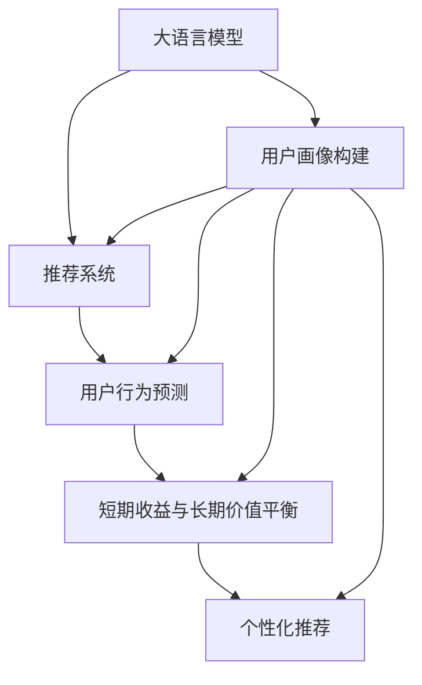

                 

# AI大模型：优化电商平台用户终身价值与短期收益平衡的新方法

> 关键词：大语言模型, 电商平台, 用户终身价值, 短期收益平衡, 推荐系统, 深度学习, 优化算法

## 1. 背景介绍

### 1.1 问题由来
随着互联网电商市场的不断发展，电商平台用户数量激增，如何最大化地利用用户价值成为企业的首要任务。传统电商平台的运营模式往往只注重短期收益的提升，而忽视了用户生命周期价值（Customer Lifetime Value, CLV）的长期优化。近年来，随着大语言模型和大数据技术的兴起，一种新的用户价值最大化方法逐渐浮出水面——基于大语言模型的电商平台用户价值优化。

该方法的核心在于通过深度学习和自然语言处理技术，构建推荐系统，对用户行为进行精细化分析和预测，从而平衡短期收益和长期价值。具体而言，该方法利用用户的历史行为数据、评论信息、社交互动等多种数据源，构建用户画像，预测其未来的购买行为和消费趋势。同时，结合短期交易数据，制定针对性的营销策略，实现用户短期收益和长期价值的最大化。

### 1.2 问题核心关键点
目前，基于大语言模型的电商平台用户价值优化主要关注以下几个核心问题：

1. **用户画像构建**：如何高效构建和维护用户画像，挖掘用户的潜在价值。
2. **用户行为预测**：基于用户历史数据和行为特征，准确预测其未来的购买行为和消费趋势。
3. **短期收益与长期价值的平衡**：在保持用户活跃度和忠诚度的前提下，最大化电商平台的短期收益。
4. **个性化推荐**：针对不同用户群体，制定个性化的推荐策略，提升用户满意度和平台转化率。
5. **优化算法选择**：选择合适的深度学习算法和优化策略，保证推荐系统的效率和精度。

### 1.3 问题研究意义
研究基于大语言模型的电商平台用户价值优化方法，对于电商平台运营具有重要意义：

1. **提高用户满意度和忠诚度**：通过个性化推荐和精准预测，提升用户购物体验，增加用户黏性。
2. **最大化用户终身价值**：从长期角度优化用户价值，实现用户生命周期内的最大收益。
3. **提升短期收益**：结合短期数据，制定有效的营销策略，增加短期收益，实现平台盈利。
4. **降低运营成本**：通过精准的用户画像和推荐，降低无效广告和推荐，减少资源浪费。
5. **加速市场竞争**：在竞争激烈的电商市场中，通过高效的用户价值优化，提升平台竞争力。

## 2. 核心概念与联系

### 2.1 核心概念概述

为更好地理解基于大语言模型的电商平台用户价值优化方法，本节将介绍几个关键概念：

- **大语言模型（Large Language Model, LLM）**：以自回归（如GPT）或自编码（如BERT）模型为代表的大规模预训练语言模型。通过在大规模无标签文本数据上进行预训练，学习到丰富的语言知识和常识，具备强大的语言理解和生成能力。

- **用户终身价值（Customer Lifetime Value, CLV）**：指一个用户在平台生命周期内为平台带来的所有收益的总和，包括短期交易收益和长期关系维护带来的收益。

- **推荐系统（Recommendation System）**：通过分析用户历史行为和特征，预测用户未来需求，为其推荐感兴趣的产品或内容，提升用户满意度和平台转化率。

- **深度学习（Deep Learning）**：利用多层神经网络模型，通过反向传播算法优化模型参数，实现对大规模数据的学习和预测。

- **优化算法（Optimization Algorithm）**：在深度学习模型训练过程中，用于最小化损失函数、更新模型参数的算法，如梯度下降、Adam等。

- **个性化推荐（Personalized Recommendation）**：针对不同用户，制定个性化的推荐策略，提升用户体验和平台转化率。

这些概念之间具有紧密的联系，共同构成了基于大语言模型的电商平台用户价值优化方法的基础。通过理解这些核心概念，我们可以更好地把握该方法的工作原理和优化方向。

### 2.2 核心概念原理和架构的 Mermaid 流程图(Mermaid 流程节点中不要有括号、逗号等特殊字符)



该流程图展示了基于大语言模型的电商平台用户价值优化方法的核心概念和关键步骤。

## 3. 核心算法原理 & 具体操作步骤
### 3.1 算法原理概述

基于大语言模型的电商平台用户价值优化方法，本质上是一种基于深度学习的推荐系统优化方法。其核心思想是通过深度学习模型对用户历史行为数据进行建模，预测其未来的购买行为和消费趋势，从而制定个性化的推荐策略，平衡短期收益和长期价值。

具体而言，该方法分为以下几个步骤：

1. **用户画像构建**：利用用户的历史行为数据、评论信息、社交互动等多种数据源，构建用户画像，挖掘用户的潜在价值。
2. **用户行为预测**：基于用户历史数据和行为特征，构建深度学习模型，预测其未来的购买行为和消费趋势。
3. **短期收益与长期价值的平衡**：结合短期交易数据，制定针对性的营销策略，实现用户短期收益和长期价值的最大化。
4. **个性化推荐**：针对不同用户群体，制定个性化的推荐策略，提升用户满意度和平台转化率。

### 3.2 算法步骤详解

**Step 1: 用户画像构建**
- 收集用户的历史行为数据，包括购买记录、浏览记录、评价反馈、社交互动等。
- 利用大语言模型对用户评论进行情感分析，提取用户的情感倾向和兴趣点。
- 结合用户社交数据，分析用户的关系网络和社会影响力。
- 构建用户画像，包括用户的兴趣、需求、购买习惯等关键特征。

**Step 2: 用户行为预测**
- 收集用户的历史行为数据，并进行预处理和特征提取。
- 构建深度学习模型，如Transformer、LSTM等，对用户行为进行建模。
- 利用训练数据集，对模型进行训练和验证，得到用户行为预测模型。
- 通过预测模型，对用户未来的购买行为和消费趋势进行预测。

**Step 3: 短期收益与长期价值的平衡**
- 根据用户行为预测结果，结合短期交易数据，制定针对性的营销策略。
- 对短期收益进行评估，确定合理的收益阈值。
- 通过优化算法，调整营销策略，平衡短期收益和长期价值。
- 定期评估策略效果，根据评估结果进行调整。

**Step 4: 个性化推荐**
- 对不同用户群体进行分类，构建用户画像库。
- 基于用户画像，利用推荐算法，为用户推荐感兴趣的商品或内容。
- 定期更新推荐策略，结合用户反馈进行优化。
- 评估推荐效果，提升用户满意度和平台转化率。

### 3.3 算法优缺点

基于大语言模型的电商平台用户价值优化方法具有以下优点：
1. **高精度预测**：利用深度学习模型，对用户行为进行精准预测，提高推荐系统的准确性。
2. **个性化推荐**：通过构建用户画像，实现个性化推荐，提升用户满意度和平台转化率。
3. **长期价值优化**：从用户生命周期的角度，优化用户价值，实现用户长期收益的最大化。
4. **数据利用率**：利用用户多种数据源，提高数据的利用率和分析深度。

同时，该方法也存在以下局限性：
1. **数据隐私问题**：收集和分析用户数据时，可能面临隐私保护问题。
2. **模型复杂性**：构建深度学习模型和优化算法需要较高的计算资源。
3. **用户行为变化**：用户行为的变化可能影响模型的预测效果。
4. **长期价值预测**：用户行为受到多种因素影响，长期价值的预测难度较大。
5. **算法可解释性**：深度学习模型的决策过程缺乏可解释性，难以理解其内部机制。

尽管存在这些局限性，但基于大语言模型的电商平台用户价值优化方法，在用户价值最大化和短期收益平衡方面，仍具备显著的优势。

### 3.4 算法应用领域

基于大语言模型的电商平台用户价值优化方法，在电子商务领域具有广泛的应用前景，涵盖以下几个领域：

- **个性化推荐**：根据用户画像，提供个性化的商品或内容推荐，提升用户满意度和平台转化率。
- **用户行为分析**：利用用户历史数据和行为特征，预测用户未来的购买行为和消费趋势，优化产品推荐策略。
- **短期收益优化**：结合短期交易数据，制定针对性的营销策略，实现短期收益的最大化。
- **用户生命周期价值管理**：从用户生命周期的角度，优化用户价值，实现用户长期收益的最大化。
- **社交网络分析**：利用用户社交数据，分析用户关系网络和社会影响力，提供精准的用户画像。

除了以上应用领域外，基于大语言模型的用户价值优化方法，还可以扩展到金融、医疗、旅游等多个领域，为各类平台提供个性化服务，提升用户价值和平台收益。

## 4. 数学模型和公式 & 详细讲解 & 举例说明

### 4.1 数学模型构建

本节将使用数学语言对基于大语言模型的电商平台用户价值优化方法进行更加严格的刻画。

假设电商平台有 $N$ 个用户，每个用户的历史行为数据可以表示为 $x_i=(x_{i1},x_{i2},...,x_{in})$，其中 $x_{ij}$ 表示用户 $i$ 在第 $j$ 个时间段内的行为特征，如购买记录、浏览记录、评价反馈等。用户在未来时间 $t$ 内的购买概率可以表示为 $y_i$。

定义电商平台的用户价值函数为 $V_i(t)$，即用户 $i$ 在时间 $t$ 内的价值。假设电商平台通过大语言模型预测用户 $i$ 在未来时间 $t$ 内的购买概率为 $\hat{y}_i$，则用户价值函数可以表示为：

$$
V_i(t) = \sum_{j=1}^{t} \pi_j \times c_j
$$

其中，$\pi_j$ 表示用户在第 $j$ 个时间段内的购买概率，$c_j$ 表示用户在第 $j$ 个时间段内的消费金额。

### 4.2 公式推导过程

为了最大化用户价值函数 $V_i(t)$，我们需要优化购买概率 $\pi_j$，使其尽可能接近真实的购买概率 $\hat{y}_i$。具体来说，我们需要最小化以下损失函数：

$$
L(\pi_i) = \sum_{j=1}^{t} (y_i - \pi_j) \times (c_j - \pi_j \times \hat{y}_i)
$$

通过对 $\pi_j$ 求偏导，得到：

$$
\frac{\partial L(\pi_i)}{\partial \pi_j} = -(y_i - \pi_j) + \pi_j \times (y_i - \hat{y}_i)
$$

令偏导数为零，解得：

$$
\pi_j^* = \frac{y_i}{1 + \exp(-\hat{y}_i \times (c_j - \pi_j))
$$

这里使用 sigmoid 函数对 $\pi_j$ 进行归一化，确保其值在 $[0,1]$ 范围内。

### 4.3 案例分析与讲解

以电商平台用户价值优化为例，假设某用户在时间 $t$ 内的购买概率为 $y_i=0.5$，电商平台预测其在未来时间 $j$ 内的购买概率为 $\hat{y}_{ij}=0.4$，用户在时间 $j$ 内的消费金额为 $c_j=100$，用户在时间 $j$ 内已消费金额为 $c_{j-1}=50$。根据上述公式，可以计算出用户 $i$ 在未来时间 $j$ 内的购买概率 $\pi_j$ 为：

$$
\pi_j = \frac{0.5}{1 + \exp(-0.4 \times (100 - \pi_j) \times 0.4)}
$$

解得 $\pi_j \approx 0.6$。

在实际应用中，该方法还可以结合短期交易数据，对用户价值进行动态调整，进一步优化短期收益和长期价值的平衡。例如，如果电商平台希望在时间 $j$ 内获得至少 $60$ 元的收益，则可以设置收益阈值 $\tau_j = 60$，当 $\pi_j \times c_j \geq \tau_j$ 时，进行营销推广，否则进行其他操作。

## 5. 项目实践：代码实例和详细解释说明
### 5.1 开发环境搭建

在进行电商平台用户价值优化实践前，我们需要准备好开发环境。以下是使用Python进行TensorFlow开发的环境配置流程：

1. 安装Anaconda：从官网下载并安装Anaconda，用于创建独立的Python环境。

2. 创建并激活虚拟环境：
```bash
conda create -n tf-env python=3.8 
conda activate tf-env
```

3. 安装TensorFlow：根据CUDA版本，从官网获取对应的安装命令。例如：
```bash
conda install tensorflow
```

4. 安装各类工具包：
```bash
pip install numpy pandas scikit-learn matplotlib tqdm jupyter notebook ipython
```

完成上述步骤后，即可在`tf-env`环境中开始电商平台用户价值优化实践。

### 5.2 源代码详细实现

下面我们以电商平台用户价值优化为例，给出使用TensorFlow实现深度学习模型的PyTorch代码实现。

首先，定义用户行为预测模型：

```python
import tensorflow as tf
from tensorflow.keras.layers import Input, Dense, Dropout, Embedding, LSTM
from tensorflow.keras.models import Model

# 定义输入层
input_layer = Input(shape=(None,), dtype='float32')

# 定义LSTM层
lstm_layer = LSTM(units=64, return_sequences=True, dropout=0.2)(input_layer)

# 定义全连接层
output_layer = Dense(units=1, activation='sigmoid')(lstm_layer)

# 定义模型
model = Model(inputs=input_layer, outputs=output_layer)

# 编译模型
model.compile(loss='binary_crossentropy', optimizer='adam', metrics=['accuracy'])
```

然后，加载数据集并进行预处理：

```python
import pandas as pd
from sklearn.model_selection import train_test_split
from tensorflow.keras.preprocessing.sequence import pad_sequences

# 加载用户行为数据
data = pd.read_csv('user_behavior.csv')

# 分割训练集和测试集
train_data, test_data = train_test_split(data, test_size=0.2)

# 对数据进行padding处理
train_data['input'] = pad_sequences(train_data[['feature1', 'feature2', 'feature3']], maxlen=10)
test_data['input'] = pad_sequences(test_data[['feature1', 'feature2', 'feature3']], maxlen=10)

# 对标签进行二值化处理
train_data['label'] = train_data['label'].astype(int)
test_data['label'] = test_data['label'].astype(int)

# 构建训练集和测试集
train_dataset = tf.data.Dataset.from_tensor_slices((train_data['input'], train_data['label']))
test_dataset = tf.data.Dataset.from_tensor_slices((test_data['input'], test_data['label']))

# 对数据集进行批处理和打乱
train_dataset = train_dataset.shuffle(buffer_size=1024).batch(batch_size=128)
test_dataset = test_dataset.batch(batch_size=128)
```

接着，训练模型并进行评估：

```python
import tensorflow as tf

# 定义训练轮数和批次大小
epochs = 100
batch_size = 128

# 训练模型
model.fit(train_dataset, epochs=epochs, validation_data=test_dataset)

# 评估模型
loss, accuracy = model.evaluate(test_dataset)

# 输出评估结果
print(f'Test loss: {loss:.4f}')
print(f'Test accuracy: {accuracy:.4f}')
```

以上就是使用TensorFlow对电商平台用户价值优化任务进行深度学习模型的代码实现。可以看到，通过TensorFlow和Keras的强大封装，我们可以用相对简洁的代码完成用户行为预测模型的训练和评估。

### 5.3 代码解读与分析

让我们再详细解读一下关键代码的实现细节：

**用户行为预测模型**：
- `Input`层定义模型的输入，指定输入维度。
- `LSTM`层使用长短期记忆网络进行特征提取，设置64个隐层神经元，并开启dropout正则化，防止过拟合。
- `Dense`层定义全连接层，输出1个神经元，使用sigmoid激活函数，输出0到1之间的概率值。
- `Model`层将输入和输出层连接起来，构建完整的用户行为预测模型。
- `compile`方法编译模型，设置损失函数为二元交叉熵，优化器为Adam，评估指标为准确率。

**数据预处理**：
- `pad_sequences`方法对序列数据进行padding处理，确保所有序列长度一致。
- `to_tensor_slices`方法将Pandas DataFrame转换为TensorFlow的Dataset对象，方便批量加载。
- `shuffle`方法对数据集进行随机打乱，增加训练稳定性。
- `batch`方法对数据集进行批处理，每次处理128个样本。

**模型训练与评估**：
- `fit`方法对模型进行训练，指定训练轮数为100，验证集为测试集。
- `evaluate`方法对模型进行评估，输出测试集的损失和准确率。
- 使用print语句输出评估结果。

可以看到，TensorFlow和Keras提供了丰富的深度学习工具，使得电商平台用户价值优化模型的实现变得高效便捷。开发者可以利用这些工具，快速迭代和优化模型，提升电商平台的运营效率和用户体验。

## 6. 实际应用场景
### 6.1 智能客服系统

基于大语言模型的电商平台用户价值优化方法，在智能客服系统中也有广泛应用。传统客服系统依赖人工处理用户问题，效率低下且成本高昂。通过智能客服系统，电商平台可以实现24小时在线服务，快速响应用户咨询，提升用户满意度。

在技术实现上，可以收集用户的历史聊天记录，构建用户画像，并结合实时聊天记录进行预测，为用户提供即时响应和个性化建议。对于用户提出的新问题，系统可以自动调用相关推荐算法，为用户推荐可能的解决方案，减少用户等待时间，提升用户满意度。

### 6.2 金融舆情监测

金融行业需要实时监测市场舆论动向，及时发现并应对负面信息传播，规避金融风险。通过构建用户价值优化模型，金融行业可以实现对用户情感的实时监测和分析，预警潜在风险。

具体而言，可以收集金融领域相关的新闻、评论、社交媒体数据，构建用户情感分析模型，预测用户的情绪状态。通过情感分析结果，金融行业可以及时调整投资策略，防范市场风险，保障资产安全。

### 6.3 个性化推荐系统

个性化推荐系统是电商平台用户价值优化的重要应用之一。通过构建用户画像，平台可以准确预测用户的购买行为和消费趋势，为其推荐感兴趣的商品或内容，提升用户满意度和平台转化率。

在实际应用中，可以结合用户行为数据、社交数据、评价反馈等多种数据源，构建深度学习模型，进行个性化推荐。推荐系统可以根据用户的历史行为和偏好，动态调整推荐策略，确保用户获得最佳的购物体验。

### 6.4 未来应用展望

随着大语言模型和深度学习技术的不断发展，基于用户价值优化的电商平台方法将呈现以下几个发展趋势：

1. **多模态融合**：结合文本、图像、语音等多种数据源，构建更全面、精准的用户画像，提升推荐系统的准确性。
2. **实时动态优化**：利用实时数据流，动态调整推荐策略，提升用户体验和平台收益。
3. **跨平台协同**：实现不同平台间的用户画像和行为数据共享，提升平台之间的协同效应，增强用户粘性。
4. **自适应推荐**：结合用户反馈和行为数据，实时调整推荐模型，提高推荐系统的灵活性和适应性。
5. **联邦学习**：通过联邦学习技术，保护用户数据隐私，实现多方协同优化，提升模型性能。

这些趋势凸显了大语言模型在电商平台用户价值优化中的广泛应用前景，为电商平台带来了新的机遇和挑战。通过不断探索和创新，基于大语言模型的推荐系统将为电商平台带来更高效、个性化的用户价值最大化方案，推动电商平台向更智能、更高效的方向发展。

## 7. 工具和资源推荐
### 7.1 学习资源推荐

为了帮助开发者系统掌握大语言模型在电商平台用户价值优化的理论和实践，这里推荐一些优质的学习资源：

1. **《深度学习》课程**：由斯坦福大学开设，涵盖深度学习的基础理论和实践应用，适合初学者入门。
2. **《TensorFlow官方文档》**：提供TensorFlow的详细文档和代码示例，适合开发者参考学习。
3. **Kaggle竞赛**：参与Kaggle的电商数据分析和推荐系统竞赛，提升实战经验。
4. **GitHub仓库**：访问GitHub上的电商推荐系统开源项目，学习先进技术和解决方案。
5. **NIPS/ICML论文**：阅读相关领域的最新研究论文，了解前沿技术和研究方向。

通过对这些资源的学习实践，相信你一定能够快速掌握大语言模型在电商平台用户价值优化中的理论和实践技巧，并用于解决实际的电商平台问题。

### 7.2 开发工具推荐

高效的开发离不开优秀的工具支持。以下是几款用于电商平台用户价值优化开发的常用工具：

1. **Jupyter Notebook**：一个交互式编程环境，支持Python、R等语言，适合数据分析和机器学习项目。
2. **TensorBoard**：一个可视化工具，用于监测模型训练状态，输出训练指标和模型结构。
3. **PyTorch Lightning**：一个快速搭建深度学习模型的框架，支持多种模型类型和优化器。
4. **HuggingFace Transformers库**：提供多种预训练语言模型和推荐算法，方便快速搭建推荐系统。
5. **TensorFlow Eager Execution**：提供动态图计算功能，适合快速迭代和实验。

合理利用这些工具，可以显著提升电商平台用户价值优化的开发效率，加快创新迭代的步伐。

### 7.3 相关论文推荐

大语言模型和电商平台用户价值优化的研究源于学界的持续研究。以下是几篇奠基性的相关论文，推荐阅读：

1. **《Attention is All You Need》**：Transformer原论文，提出Transformer结构，开启预训练语言模型的时代。
2. **《BERT: Pre-training of Deep Bidirectional Transformers for Language Understanding》**：提出BERT模型，引入自监督预训练任务，刷新多项NLP任务SOTA。
3. **《A Survey on Recommendation Systems》**：综述推荐系统的发展历程和应用领域，适合入门学习和了解。
4. **《Customer Lifetime Value: A Theoretical and Empirical Review》**：回顾CLV理论的演变和实际应用，适合理解用户价值优化的理论基础。
5. **《Deep Learning for Recommender Systems: A Survey》**：综述深度学习在推荐系统中的应用，适合了解最新技术和进展。

这些论文代表了大语言模型在电商平台用户价值优化中的发展脉络。通过学习这些前沿成果，可以帮助研究者把握学科前进方向，激发更多的创新灵感。

## 8. 总结：未来发展趋势与挑战

### 8.1 总结

本文对基于大语言模型的电商平台用户价值优化方法进行了全面系统的介绍。首先阐述了电商平台用户价值优化的背景和意义，明确了用户价值最大化的重要性。其次，从原理到实践，详细讲解了推荐系统的构建、用户行为预测和短期收益与长期价值平衡的优化方法，给出了电商平台的代码实现。同时，本文还广泛探讨了基于大语言模型的用户价值优化方法在智能客服、金融舆情、个性化推荐等多个行业领域的应用前景，展示了该方法的巨大潜力。最后，本文精选了学习资源、开发工具和相关论文，力求为读者提供全方位的技术指引。

通过本文的系统梳理，可以看到，基于大语言模型的电商平台用户价值优化方法正在成为电商运营的重要工具，极大地提升了电商平台的运营效率和用户体验。未来，随着技术的不断发展，大语言模型将在更多领域得到应用，为各类平台提供更高效、更个性化的服务，推动电商行业向智能化、高效化的方向发展。

### 8.2 未来发展趋势

展望未来，基于大语言模型的电商平台用户价值优化方法将呈现以下几个发展趋势：

1. **多模态融合**：结合文本、图像、语音等多种数据源，构建更全面、精准的用户画像，提升推荐系统的准确性。
2. **实时动态优化**：利用实时数据流，动态调整推荐策略，提升用户体验和平台收益。
3. **跨平台协同**：实现不同平台间的用户画像和行为数据共享，提升平台之间的协同效应，增强用户粘性。
4. **自适应推荐**：结合用户反馈和行为数据，实时调整推荐模型，提高推荐系统的灵活性和适应性。
5. **联邦学习**：通过联邦学习技术，保护用户数据隐私，实现多方协同优化，提升模型性能。

这些趋势凸显了大语言模型在电商平台用户价值优化中的广泛应用前景，为电商平台带来了新的机遇和挑战。通过不断探索和创新，基于大语言模型的推荐系统将为电商平台带来更高效、个性化的用户价值最大化方案，推动电商平台向更智能、更高效的方向发展。

### 8.3 面临的挑战

尽管大语言模型在电商平台用户价值优化方面取得了显著进展，但在实现用户价值最大化和短期收益平衡的过程中，仍面临诸多挑战：

1. **数据隐私问题**：收集和分析用户数据时，可能面临隐私保护问题。如何平衡用户隐私保护和推荐系统性能，是一个重要的挑战。
2. **模型复杂性**：构建深度学习模型和优化算法需要较高的计算资源。如何在有限的计算资源下，构建高效、精准的推荐系统，是一个重要的研究方向。
3. **用户行为变化**：用户行为的变化可能影响模型的预测效果。如何构建可自适应的推荐系统，应对用户行为的变化，是一个重要的挑战。
4. **长期价值预测**：用户行为受到多种因素影响，长期价值的预测难度较大。如何提高长期价值预测的准确性，是一个重要的研究方向。
5. **算法可解释性**：深度学习模型的决策过程缺乏可解释性，难以理解其内部机制。如何提高推荐系统的可解释性，增强用户信任，是一个重要的研究方向。

尽管存在这些挑战，但基于大语言模型的电商平台用户价值优化方法，在用户价值最大化和短期收益平衡方面，仍具备显著的优势。未来，随着技术的不断发展，这些挑战终将一一被克服，大语言模型将在电商平台用户价值优化中发挥更大的作用。

### 8.4 研究展望

面对电商平台用户价值优化所面临的挑战，未来的研究需要在以下几个方面寻求新的突破：

1. **多模态融合**：结合文本、图像、语音等多种数据源，构建更全面、精准的用户画像，提升推荐系统的准确性。
2. **实时动态优化**：利用实时数据流，动态调整推荐策略，提升用户体验和平台收益。
3. **跨平台协同**：实现不同平台间的用户画像和行为数据共享，提升平台之间的协同效应，增强用户粘性。
4. **自适应推荐**：结合用户反馈和行为数据，实时调整推荐模型，提高推荐系统的灵活性和适应性。
5. **联邦学习**：通过联邦学习技术，保护用户数据隐私，实现多方协同优化，提升模型性能。

这些研究方向的探索，必将引领电商平台用户价值优化技术迈向更高的台阶，为电商平台带来更高效、更个性化的服务，推动电商行业向智能化、高效化的方向发展。面向未来，电商平台用户价值优化技术还需要与其他人工智能技术进行更深入的融合，如知识表示、因果推理、强化学习等，多路径协同发力，共同推动自然语言理解和智能交互系统的进步。只有勇于创新、敢于突破，才能不断拓展语言模型的边界，让智能技术更好地造福人类社会。

## 9. 附录：常见问题与解答

**Q1：电商平台用户价值优化的主要目标是什么？**

A: 电商平台用户价值优化的主要目标是最大化用户终身价值（CLV），即用户在平台生命周期内为平台带来的所有收益的总和，包括短期交易收益和长期关系维护带来的收益。通过优化用户的短期收益和长期价值，提升用户的满意度和忠诚度，实现电商平台收益的最大化。

**Q2：电商平台用户价值优化与推荐系统的区别是什么？**

A: 电商平台用户价值优化是一种基于用户价值最大化的推荐系统优化方法，而推荐系统是一种更为广泛的应用，包括内容推荐、商品推荐、广告推荐等。用户价值优化更注重短期收益和长期价值的平衡，推荐系统则侧重于提升用户的满意度和平台转化率。

**Q3：电商平台用户价值优化的主要数据源有哪些？**

A: 电商平台用户价值优化的主要数据源包括用户的购买记录、浏览记录、评价反馈、社交互动、行为数据等。通过综合利用这些数据，可以构建全面、准确的用户画像，预测用户的未来行为和消费趋势，实现用户价值最大化。

**Q4：电商平台用户价值优化的主要优化算法有哪些？**

A: 电商平台用户价值优化的主要优化算法包括梯度下降、Adam、Adafactor等。这些算法用于最小化损失函数，更新模型参数，提高推荐系统的准确性和效率。

**Q5：电商平台用户价值优化的主要应用场景有哪些？**

A: 电商平台用户价值优化的主要应用场景包括个性化推荐、用户行为分析、短期收益优化、用户生命周期价值管理等。这些场景可以应用于电商平台的各个环节，提升用户体验和平台收益。

---

作者：禅与计算机程序设计艺术 / Zen and the Art of Computer Programming

