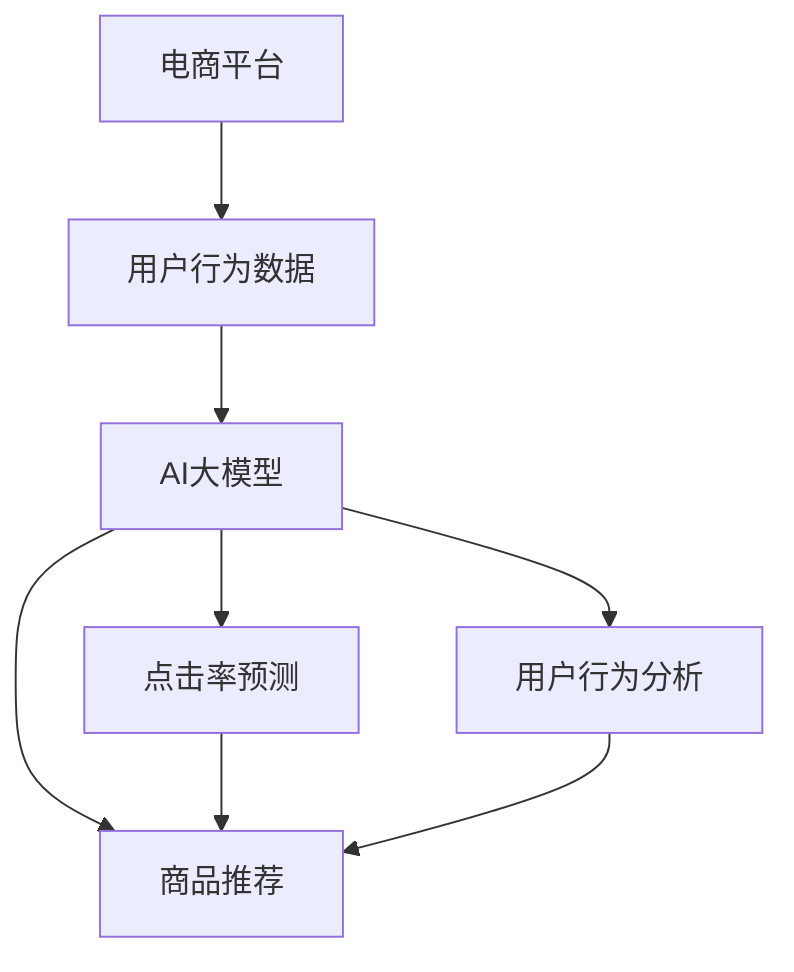

                 

# AI大模型：提升电商平台转化率的新方法

> 关键词：
- 电商平台转化率
- AI大模型
- 深度学习
- 自然语言处理
- 转化模型
- 点击率预测
- 用户行为分析

## 1. 背景介绍

### 1.1 问题由来

随着互联网的普及和电商行业的快速发展，电商平台成为了用户购物的主要渠道。据统计，全球在线购物用户已超过20亿，占全球人口的三分之一。电商平台不仅在销售渠道上获得了极大的拓展，而且用户行为分析也成为电商平台的关键竞争力。

电商平台的核心在于转化率，即用户浏览商品后产生购买行为的比率。据统计，电商平台的用户转化率通常在1-3%之间，在竞争激烈的零售市场中，如何提高电商平台转化率，成为了所有电商平台关注的焦点。

传统的电商平台转化率提升方式依赖于用户行为数据的挖掘与分析，通过数据驱动的方法对用户进行精准的个性化推荐。但这种方法对数据要求极高，需要大量的用户行为数据，而采集和存储这些数据需要大量的成本和计算资源，且数据分析过程复杂，难以高效落地。

近年来，随着人工智能技术的飞速发展，AI大模型开始被引入到电商领域，并取得了显著成效。AI大模型通过大规模的数据预训练和微调，具备了强大的数据表示能力和学习能力，能够从用户行为数据中提取高层次的特征，从而更好地预测用户行为，提升转化率。

## 2. 核心概念与联系

### 2.1 核心概念概述

在电商领域，AI大模型主要应用于以下两个方面：

- 用户行为分析：通过分析用户的行为数据，包括点击率、浏览量、停留时间等，预测用户的购买意向。
- 商品推荐：基于用户的历史行为和偏好，推荐用户可能感兴趣的商品，提高用户的购买转化率。

AI大模型的核心概念包括以下几个方面：

- 深度学习：通过多层次神经网络，构建复杂的特征表示，对用户行为数据进行高效建模。
- 自然语言处理：通过文本数据分析，理解用户需求和购买意向。
- 转化模型：预测用户是否会产生购买行为，构建转化模型。
- 点击率预测：通过模型预测用户点击商品的概率，优化商品展示和推荐策略。
- 用户行为分析：通过分析用户行为，理解用户的消费模式和偏好。

### 2.2 核心概念原理和架构的 Mermaid 流程图



在上述流程图中，电商平台（A）通过用户行为数据（B），输入到AI大模型（C）中进行处理。AI大模型通过点击率预测（D）、用户行为分析（E）和商品推荐（F）三个模块，对用户行为进行多角度分析，预测用户是否会产生购买行为，并推荐用户可能感兴趣的商品。

## 3. 核心算法原理 & 具体操作步骤

### 3.1 算法原理概述

AI大模型在电商领域的应用主要基于深度学习模型，其中Transformer模型因其卓越的表示能力和推理能力，在自然语言处理任务中取得了显著效果。在电商平台中，基于Transformer的模型通常用于以下几个任务：

1. 用户行为分析：利用Transformer模型对用户行为数据进行处理，提取高层次特征，构建用户行为向量。
2. 点击率预测：通过多分类任务预测用户点击商品的概率，优化商品展示策略。
3. 用户行为分析：通过分类任务预测用户是否会购买商品，提升转化率。
4. 商品推荐：通过推荐系统模型，对用户进行个性化推荐。

### 3.2 算法步骤详解

#### 3.2.1 用户行为分析

用户行为分析的目的是通过分析用户的历史行为数据，预测用户是否会购买某件商品。其步骤如下：

1. 数据收集：收集用户的历史浏览记录、点击记录、购买记录等行为数据。
2. 数据预处理：对数据进行清洗、去重、填充等预处理操作，构建数据集。
3. 模型训练：使用深度学习模型对数据集进行训练，构建用户行为向量。
4. 特征提取：通过Transformer模型对用户行为向量进行特征提取，构建用户行为特征。
5. 预测分析：将用户行为特征输入模型，预测用户是否会购买某件商品。

#### 3.2.2 点击率预测

点击率预测的目的是预测用户点击某件商品的概率，其步骤如下：

1. 数据收集：收集用户的历史点击记录、浏览记录等数据，构建数据集。
2. 数据预处理：对数据进行清洗、去重、填充等预处理操作，构建数据集。
3. 模型训练：使用深度学习模型对数据集进行训练，构建点击率预测模型。
4. 特征提取：通过Transformer模型对点击数据进行特征提取，构建点击特征。
5. 预测点击率：将点击特征输入模型，预测用户点击某件商品的概率。

#### 3.2.3 用户行为分析

用户行为分析的目的是通过分类任务预测用户是否会购买某件商品，其步骤如下：

1. 数据收集：收集用户的历史购买记录、浏览记录等数据，构建数据集。
2. 数据预处理：对数据进行清洗、去重、填充等预处理操作，构建数据集。
3. 模型训练：使用深度学习模型对数据集进行训练，构建用户行为分析模型。
4. 特征提取：通过Transformer模型对用户行为数据进行特征提取，构建用户行为特征。
5. 预测分析：将用户行为特征输入模型，预测用户是否会购买某件商品。

#### 3.2.4 商品推荐

商品推荐的目的是通过推荐系统模型，对用户进行个性化推荐，其步骤如下：

1. 数据收集：收集用户的历史购买记录、浏览记录、评价记录等数据，构建数据集。
2. 数据预处理：对数据进行清洗、去重、填充等预处理操作，构建数据集。
3. 模型训练：使用深度学习模型对数据集进行训练，构建推荐系统模型。
4. 特征提取：通过Transformer模型对用户行为数据进行特征提取，构建用户行为特征。
5. 预测推荐：将用户行为特征输入模型，预测用户可能感兴趣的商品，并进行推荐。

### 3.3 算法优缺点

#### 3.3.1 算法优点

1. 数据驱动：AI大模型通过大规模数据预训练，具备强大的数据表示能力，能够高效地处理用户行为数据。
2. 实时性高：AI大模型能够实时对用户行为数据进行分析，并快速生成推荐结果。
3. 预测准确：AI大模型能够通过多层次特征表示，对用户行为进行精准预测，提高转化率。
4. 可解释性强：AI大模型能够通过中间层特征表示，对模型预测进行解释，提高用户信任度。

#### 3.3.2 算法缺点

1. 计算成本高：AI大模型需要大量的计算资源进行训练和推理，对计算成本要求较高。
2. 数据依赖性强：AI大模型需要大量的标注数据进行微调，数据质量对模型效果影响较大。
3. 模型复杂度高：AI大模型的结构复杂，对模型优化和调试要求较高。

### 3.4 算法应用领域

AI大模型在电商平台中的应用主要包括以下几个方面：

1. 点击率预测：预测用户点击某件商品的概率，优化商品展示策略。
2. 用户行为分析：通过分类任务预测用户是否会购买某件商品，提升转化率。
3. 商品推荐：通过推荐系统模型，对用户进行个性化推荐，提高用户购买率。
4. 广告投放：通过广告点击率预测，优化广告投放策略，提高广告投放效果。
5. 用户评价：通过文本分析，理解用户对商品的评价，优化商品质量和用户满意度。

## 4. 数学模型和公式 & 详细讲解 & 举例说明

### 4.1 数学模型构建

在电商平台中，AI大模型的主要数学模型为Transformer模型。Transformer模型通过多层次的注意力机制，对输入序列进行编码和解码，从而提取高层次特征。

设输入序列为 $x=(x_1, x_2, ..., x_n)$，输出序列为 $y=(y_1, y_2, ..., y_n)$，其中 $x_i$ 和 $y_i$ 分别为输入序列和输出序列的第 $i$ 个元素。

Transformer模型的主要组成部分包括：

1. 编码器：对输入序列进行编码，提取特征。
2. 自注意力机制：通过多层次注意力机制，对输入序列进行编码。
3. 解码器：对输出序列进行解码，生成预测结果。
4. 自注意力机制：通过多层次注意力机制，对输出序列进行解码。
5. 全连接层：对输出序列进行线性变换，得到最终预测结果。

Transformer模型的数学模型可以表示为：

$$
y_i = \text{Softmax}(Q(x_i)K^T)V
$$

其中 $Q(x_i)$ 和 $K$ 为输入序列的查询矩阵和键矩阵，$V$ 为值矩阵，$\text{Softmax}$ 为注意力机制，$y_i$ 为输出序列的第 $i$ 个元素。

### 4.2 公式推导过程

Transformer模型的注意力机制可以通过矩阵运算进行计算，具体推导过程如下：

1. 计算查询矩阵和键矩阵：

$$
Q(x_i) = x_iW^Q, \quad K = x_iW^K
$$

其中 $W^Q$ 和 $W^K$ 分别为查询矩阵和键矩阵的权重矩阵。

2. 计算注意力权重：

$$
\alpha_{ij} = \frac{\exp(\text{Softmax}(Q(x_i)K^T))}{\sum_k \exp(\text{Softmax}(Q(x_i)K^T))}
$$

3. 计算注意力输出：

$$
y_i = \sum_k \alpha_{ik}V(x_k)
$$

其中 $V(x_k)$ 为输出序列的线性变换。

### 4.3 案例分析与讲解

假设有一个电商平台，对用户的点击数据进行建模，预测用户是否会点击某件商品。假设用户点击数据为 $\{click_1, click_2, ..., click_n\}$，点击商品的标签为 $\{label_1, label_2, ..., label_n\}$。

1. 数据收集：收集用户的历史点击记录，构建数据集。
2. 数据预处理：对数据进行清洗、去重、填充等预处理操作，构建数据集。
3. 模型训练：使用Transformer模型对数据集进行训练，构建点击率预测模型。
4. 特征提取：通过Transformer模型对点击数据进行特征提取，构建点击特征。
5. 预测点击率：将点击特征输入模型，预测用户点击某件商品的概率。

## 5. 项目实践：代码实例和详细解释说明

### 5.1 开发环境搭建

在进行AI大模型应用实践前，我们需要准备好开发环境。以下是使用Python进行TensorFlow开发的Python环境配置流程：

1. 安装Anaconda：从官网下载并安装Anaconda，用于创建独立的Python环境。

2. 创建并激活虚拟环境：
```bash
conda create -n tensorflow-env python=3.8 
conda activate tensorflow-env
```

3. 安装TensorFlow：根据CUDA版本，从官网获取对应的安装命令。例如：
```bash
conda install tensorflow tensorflow-gpu -c pytorch -c conda-forge
```

4. 安装各类工具包：
```bash
pip install numpy pandas scikit-learn matplotlib tqdm jupyter notebook ipython
```

完成上述步骤后，即可在`tensorflow-env`环境中开始AI大模型应用实践。

### 5.2 源代码详细实现

这里我们以电商平台的点击率预测为例，给出使用TensorFlow对AI大模型进行点击率预测的代码实现。

首先，定义点击率预测的数据处理函数：

```python
import tensorflow as tf
from tensorflow.keras import layers
from tensorflow.keras.layers import Input, Dense, Embedding, Flatten, Dropout

class ClickPredictionModel(tf.keras.Model):
    def __init__(self, vocab_size, embedding_dim, num_classes):
        super(ClickPredictionModel, self).__init__()
        
        self.embedding = layers.Embedding(vocab_size, embedding_dim)
        self.dropout = layers.Dropout(0.5)
        self.dense = layers.Dense(num_classes, activation='sigmoid')
        
    def call(self, inputs):
        x = self.embedding(inputs)
        x = self.dropout(x)
        x = self.dense(x)
        return x

# 数据集准备
train_data = tf.data.Dataset.from_tensor_slices(train_dataset)
val_data = tf.data.Dataset.from_tensor_slices(val_dataset)
test_data = tf.data.Dataset.from_tensor_slices(test_dataset)

# 定义模型
vocab_size = 10000
embedding_dim = 256
num_classes = 2
model = ClickPredictionModel(vocab_size, embedding_dim, num_classes)

# 定义损失函数和优化器
loss_fn = tf.keras.losses.BinaryCrossentropy()
optimizer = tf.keras.optimizers.Adam(learning_rate=0.001)

# 训练函数
def train_step(inputs, targets):
    with tf.GradientTape() as tape:
        predictions = model(inputs)
        loss = loss_fn(targets, predictions)
    gradients = tape.gradient(loss, model.trainable_variables)
    optimizer.apply_gradients(zip(gradients, model.trainable_variables))
    return loss

# 训练模型
epochs = 10
batch_size = 64

for epoch in range(epochs):
    for (batch, (inputs, targets)) in train_data:
        loss = train_step(inputs, targets)
        print(f'Epoch {epoch+1}/{epochs}, Loss: {loss.numpy()}')
```

接着，定义测试和评估函数：

```python
# 定义测试函数
def evaluate(model, data):
    test_loss = 0
    test_predictions = []
    for (batch, (inputs, targets)) in data:
        predictions = model(inputs)
        test_loss += loss_fn(targets, predictions)
        test_predictions.append(predictions.numpy())
    test_loss /= len(data)
    return test_loss

# 评估模型
test_loss = evaluate(model, test_dataset)
print(f'Test Loss: {test_loss}')
```

最后，启动训练流程并在测试集上评估：

```python
# 训练模型
train_loss = 0
for epoch in range(epochs):
    for (batch, (inputs, targets)) in train_data:
        loss = train_step(inputs, targets)
        train_loss += loss
    train_loss /= len(train_dataset)
    print(f'Epoch {epoch+1}/{epochs}, Train Loss: {train_loss}')

# 评估模型
test_loss = evaluate(model, test_dataset)
print(f'Test Loss: {test_loss}')
```

以上就是使用TensorFlow对AI大模型进行点击率预测的完整代码实现。可以看到，TensorFlow通过Keras API提供了强大的模型构建和训练功能，使得模型开发和优化过程更加便捷和高效。

### 5.3 代码解读与分析

这里我们详细解读一下关键代码的实现细节：

**ClickPredictionModel类**：
- `__init__`方法：初始化模型的参数。
- `call`方法：定义模型的前向传播过程。

**train_step函数**：
- 通过梯度计算和优化器更新，实现模型参数的更新。

**evaluate函数**：
- 在测试集上评估模型的性能，计算损失和预测结果。

**训练流程**：
- 定义模型、损失函数和优化器。
- 通过训练函数进行模型训练，计算损失并更新模型参数。
- 在测试集上评估模型性能，输出测试损失。

## 6. 实际应用场景

### 6.1 智能客服系统

智能客服系统是电商平台中重要的应用场景，通过AI大模型可以实现自动解答用户咨询，提高客服效率。AI大模型可以对用户咨询进行智能分类，并根据分类结果进行自动回复，从而提升客服系统的智能化水平。

在实际应用中，AI大模型可以通过自然语言处理技术，对用户咨询进行意图识别，并从知识库中提取相关内容进行回答。同时，AI大模型还可以在训练过程中学习用户的反馈信息，不断优化回答策略，提升系统的智能化水平。

### 6.2 商品推荐系统

商品推荐系统是电商平台的核心功能之一，通过AI大模型可以实现个性化推荐，提高用户的购物体验。AI大模型可以根据用户的历史行为数据，预测用户的购买意向，并推荐用户可能感兴趣的商品。

在实际应用中，AI大模型可以通过点击率预测和用户行为分析，对用户进行多角度分析，并根据分析结果生成个性化推荐。同时，AI大模型还可以通过情感分析，理解用户的反馈信息，不断优化推荐策略，提升用户的购物体验。

### 6.3 广告投放系统

广告投放系统是电商平台的收益来源之一，通过AI大模型可以实现精准投放，提高广告投放效果。AI大模型可以对用户的行为数据进行分析和预测，从而选择合适的广告展示位置和投放策略。

在实际应用中，AI大模型可以通过点击率预测和用户行为分析，预测用户对广告的点击意向，并根据预测结果进行广告投放。同时，AI大模型还可以通过A/B测试，不断优化广告投放策略，提升广告效果和用户转化率。

### 6.4 未来应用展望

随着AI大模型的不断发展，其在电商平台中的应用将更加广泛和深入，未来可能的应用场景包括：

1. 用户画像构建：通过AI大模型对用户的行为数据进行分析和建模，构建用户画像，从而实现精准营销。
2. 价格优化：通过AI大模型对用户行为数据进行分析和预测，实现动态定价策略，提高用户转化率。
3. 库存管理：通过AI大模型对用户行为数据进行分析和预测，实现库存管理和补货优化，降低库存成本。
4. 客户服务：通过AI大模型对用户咨询进行智能分类和自动回复，提升客户服务的智能化水平。
5. 风险控制：通过AI大模型对用户行为数据进行分析和预测，实现风险控制和反欺诈。

## 7. 工具和资源推荐

### 7.1 学习资源推荐

为了帮助开发者系统掌握AI大模型在电商平台中的应用，这里推荐一些优质的学习资源：

1. 《深度学习入门》系列博文：由深度学习专家撰写，涵盖深度学习基本概念和常用技术，适合初学者入门。
2. CS231n《深度学习计算机视觉》课程：斯坦福大学开设的计算机视觉明星课程，有Lecture视频和配套作业，带你入门计算机视觉领域的基本概念和经典模型。
3. 《深度学习与自然语言处理》书籍：深度学习与自然语言处理领域的经典书籍，涵盖深度学习模型、自然语言处理技术及其应用。
4. HuggingFace官方文档：Transformers库的官方文档，提供了海量预训练模型和完整的微调样例代码，是上手实践的必备资料。
5. PyTorch官方文档：PyTorch框架的官方文档，提供了丰富的深度学习模型和优化算法，适合进行模型开发和优化。

通过对这些资源的学习实践，相信你一定能够快速掌握AI大模型在电商平台中的应用，并用于解决实际的电商问题。

### 7.2 开发工具推荐

高效的开发离不开优秀的工具支持。以下是几款用于AI大模型应用的常用工具：

1. PyTorch：基于Python的开源深度学习框架，灵活动态的计算图，适合快速迭代研究。
2. TensorFlow：由Google主导开发的开源深度学习框架，生产部署方便，适合大规模工程应用。
3. Keras：基于TensorFlow和Theano的高层API，简单易用，适合快速原型开发。
4. Weights & Biases：模型训练的实验跟踪工具，可以记录和可视化模型训练过程中的各项指标，方便对比和调优。
5. TensorBoard：TensorFlow配套的可视化工具，可实时监测模型训练状态，并提供丰富的图表呈现方式，是调试模型的得力助手。
6. Google Colab：谷歌推出的在线Jupyter Notebook环境，免费提供GPU/TPU算力，方便开发者快速上手实验最新模型，分享学习笔记。

合理利用这些工具，可以显著提升AI大模型在电商平台中的开发效率，加快创新迭代的步伐。

### 7.3 相关论文推荐

AI大模型在电商领域的应用源于学界的持续研究。以下是几篇奠基性的相关论文，推荐阅读：

1. Attention is All You Need：提出Transformer结构，开启了NLP领域的预训练大模型时代。
2. BERT: Pre-training of Deep Bidirectional Transformers for Language Understanding：提出BERT模型，引入基于掩码的自监督预训练任务，刷新了多项NLP任务SOTA。
3. Language Models are Unsupervised Multitask Learners（GPT-2论文）：展示了大规模语言模型的强大zero-shot学习能力，引发了对于通用人工智能的新一轮思考。
4. Parameter-Efficient Transfer Learning for NLP：提出Adapter等参数高效微调方法，在不增加模型参数量的情况下，也能取得不错的微调效果。
5. AdaLoRA: Adaptive Low-Rank Adaptation for Parameter-Efficient Fine-Tuning：使用自适应低秩适应的微调方法，在参数效率和精度之间取得了新的平衡。
6. Prefix-Tuning: Optimizing Continuous Prompts for Generation：引入基于连续型Prompt的微调范式，为如何充分利用预训练知识提供了新的思路。

这些论文代表了大模型在电商平台中的发展脉络。通过学习这些前沿成果，可以帮助研究者把握学科前进方向，激发更多的创新灵感。

## 8. 总结：未来发展趋势与挑战

### 8.1 总结

本文对AI大模型在电商平台中的应用进行了全面系统的介绍。首先阐述了AI大模型和电商平台转化率提升的研究背景和意义，明确了AI大模型在电商平台的独特价值。其次，从原理到实践，详细讲解了AI大模型在电商平台中的应用流程，包括用户行为分析、点击率预测、用户行为分析和商品推荐等核心任务。最后，本文广泛探讨了AI大模型在电商平台中的应用前景，展示了AI大模型在电商平台的巨大潜力。

通过本文的系统梳理，可以看到，AI大模型在电商平台中的应用正在成为电商领域的重要范式，极大地拓展了电商平台的业务范围，提升了电商平台的运营效率和用户转化率。未来，伴随AI大模型的不断发展，相信其在电商平台中的应用将更加广泛和深入，为电商平台的数字化转型提供新的动力。

### 8.2 未来发展趋势

展望未来，AI大模型在电商平台中的应用将呈现以下几个发展趋势：

1. 数据驱动：AI大模型将更多地依赖于用户行为数据进行驱动，从而实现更加精准的转化率预测和商品推荐。
2. 实时性高：AI大模型将能够实现实时分析用户行为数据，并快速生成推荐结果，从而提升用户购物体验。
3. 预测准确：AI大模型将通过多层次特征表示，对用户行为进行精准预测，提高转化率。
4. 可解释性强：AI大模型将通过中间层特征表示，对模型预测进行解释，提高用户信任度。
5. 多模态融合：AI大模型将通过多模态融合，实现视觉、语音等多模态信息与文本信息的协同建模，提升商品推荐的效果。

### 8.3 面临的挑战

尽管AI大模型在电商平台中的应用已经取得了显著成效，但在迈向更加智能化、普适化应用的过程中，仍面临诸多挑战：

1. 数据质量问题：电商平台的交易数据通常具有稀疏性和噪声，数据质量对模型的训练效果影响较大。
2. 模型训练成本高：AI大模型需要大量的计算资源进行训练，对计算成本要求较高。
3. 模型部署成本高：AI大模型需要高性能设备进行部署，对设备成本要求较高。
4. 模型复杂度高：AI大模型的结构复杂，对模型优化和调试要求较高。
5. 用户隐私保护：电商平台的用户数据涉及用户隐私，如何保护用户数据隐私成为一大挑战。

### 8.4 研究展望

面对AI大模型在电商平台中面临的挑战，未来的研究需要在以下几个方面寻求新的突破：

1. 数据增强：通过数据增强技术，解决电商平台数据稀疏性和噪声问题，提升模型训练效果。
2. 模型压缩：通过模型压缩技术，减小AI大模型的计算复杂度和存储空间，降低训练和部署成本。
3. 模型优化：通过模型优化技术，提升AI大模型的训练效率和推理速度，降低计算资源消耗。
4. 隐私保护：通过隐私保护技术，保护电商平台的用户数据隐私，确保用户数据安全。
5. 多模态融合：通过多模态融合技术，实现视觉、语音等多模态信息与文本信息的协同建模，提升商品推荐的效果。

这些研究方向将引领AI大模型在电商平台中的应用走向成熟，为电商平台带来更加智能化、普适化、安全化的解决方案。相信随着学界和产业界的共同努力，这些挑战终将一一被克服，AI大模型在电商平台中的应用将迎来新的发展高峰。

## 9. 附录：常见问题与解答

**Q1：AI大模型是否适用于所有电商平台？**

A: AI大模型在大多数电商平台中都能取得显著效果，但不同平台的业务特点和数据特性不同，模型应用效果可能有所差异。例如，在个性化较强的电商平台中，AI大模型的应用效果会更好。

**Q2：AI大模型在电商平台的训练和部署成本如何？**

A: AI大模型在电商平台的训练和部署成本较高，需要高性能设备进行训练和推理。但通过优化模型结构、压缩模型、使用GPU/TPU等技术手段，可以在一定程度上降低训练和部署成本。

**Q3：AI大模型在电商平台中的优化方法有哪些？**

A: AI大模型在电商平台中的优化方法包括数据增强、模型压缩、模型优化等。具体优化方法需要根据平台业务特点和数据特性进行灵活选择。

**Q4：AI大模型在电商平台中的可解释性问题如何解决？**

A: AI大模型在电商平台中的可解释性问题可以通过中间层特征表示、可视化技术等手段进行解决。具体方法需要根据平台业务特点和用户需求进行灵活选择。

**Q5：AI大模型在电商平台中的隐私保护问题如何处理？**

A: AI大模型在电商平台中的隐私保护问题可以通过数据匿名化、差分隐私等技术手段进行解决。具体方法需要根据平台业务特点和用户需求进行灵活选择。

---

作者：禅与计算机程序设计艺术 / Zen and the Art of Computer Programming

