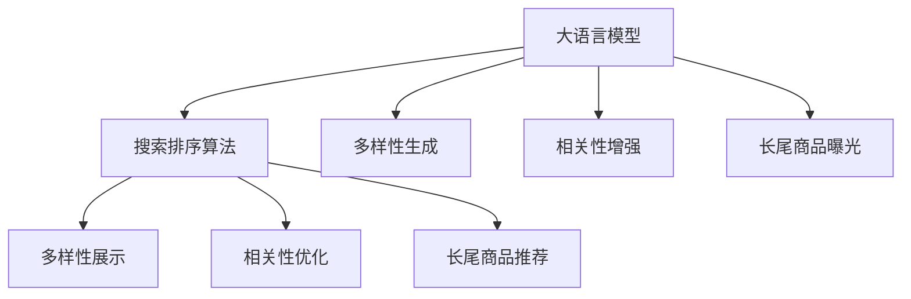

                 

# AI大模型：改善电商平台搜索结果多样性与相关性平衡的新思路

> 关键词：大语言模型,搜索排序算法,电商平台,多样性,相关性,深度学习,自然语言处理(NLP),机器学习

## 1. 背景介绍

### 1.1 问题由来
随着电商平台的迅速发展，用户搜索需求日益多样化，而电商平台搜索结果排序的算法设计，直接影响到用户满意度与转化率。当前主流的电商平台搜索排序算法主要基于用户点击行为、关键词匹配度等粗粒度特征进行排序。这些算法虽然能在一定程度上满足用户需求，但在面对海量、复杂且不断变化的用户查询时，仍存在以下问题：

1. **搜索结果单一**：算法侧重于展示最热门的商品，导致搜索结果多样性不足，用户容易陷入“信息茧房”。
2. **相关性不足**：算法过于注重点击率，忽视了商品与查询的相关性，导致用户频繁点击错误搜索结果，影响购物体验。
3. **长尾商品展示不足**：热门商品展示较多，导致长尾商品的曝光率低，影响了小众市场和个性化需求。

针对这些问题，学术界和工业界提出了多种改进方法，但仍未能完全满足用户需求。本文将探讨一种基于大语言模型的新型搜索排序算法，旨在提升搜索结果的丰富性和相关性，从而改善用户体验和电商平台竞争力。

### 1.2 问题核心关键点
大语言模型是一种先进的自然语言处理技术，具备强大的语言理解和生成能力。将其应用于电商平台搜索排序，主要面临以下挑战：

1. **多样性提升**：如何增加搜索结果的多样性，避免信息茧房。
2. **相关性增强**：如何提高搜索结果与查询的相关性，减少用户点击错误。
3. **长尾商品曝光**：如何在搜索结果中公平地展示长尾商品。

解决这些挑战需要综合运用大语言模型的多样性生成能力和上下文理解能力，以及优化算法设计。本文将详细介绍一种基于大语言模型的新型搜索排序算法，并通过实际案例展示其效果。

## 2. 核心概念与联系

### 2.1 核心概念概述

为更好地理解基于大语言模型的电商平台搜索排序算法，本节将介绍几个密切相关的核心概念：

- **大语言模型(Large Language Model, LLM)**：以自回归(如GPT)或自编码(如BERT)模型为代表的大规模预训练语言模型。通过在大规模无标签文本语料上进行预训练，学习通用的语言表示，具备强大的语言理解和生成能力。

- **搜索排序算法(Search and Ranking Algorithm)**：电商平台通过搜索排序算法对用户查询进行处理，返回排名靠前的商品。算法设计直接影响搜索结果的展示效果。

- **多样性(Diversity)**：搜索结果中商品的多样性和丰富性，避免展示同质化的商品。

- **相关性(Relevance)**：搜索结果与用户查询的匹配程度，确保用户点击到的是感兴趣的商品。

- **长尾商品(Long-Tail Products)**：用户搜索量小、但具有潜在需求的商品，避免其在搜索结果中被忽视。

这些核心概念之间的逻辑关系可以通过以下Mermaid流程图来展示：



这个流程图展示了大语言模型的核心概念及其与搜索排序算法的关联：

1. 大语言模型通过预训练获得基础能力。
2. 搜索排序算法设计基于大语言模型的输出结果，提升搜索结果的多样性、相关性和长尾商品展示。
3. 多样性生成、相关性增强和长尾商品曝光是大语言模型在下游任务中的三个主要功能。
4. 多样性展示、相关性优化和长尾商品推荐是搜索排序算法需要考虑的三大目标。

这些概念共同构成了大语言模型在电商平台搜索排序中的应用框架，使其能够在各种场景下发挥强大的语言理解和生成能力。通过理解这些核心概念，我们可以更好地把握大语言模型的工作原理和优化方向。

## 3. 核心算法原理 & 具体操作步骤
### 3.1 算法原理概述

基于大语言模型的电商平台搜索排序算法，本质上是一个基于大语言模型的多目标优化问题。其核心思想是：将用户查询和商品描述作为输入，通过大语言模型生成可能的搜索结果，再通过优化算法对这些结果进行排序，确保最终展示的搜索结果在多样性、相关性和长尾商品展示三个方面达到平衡。

形式化地，假设用户查询为 $q$，商品描述集合为 $\mathcal{D}$，大语言模型为 $M_{\theta}$，生成的搜索结果集为 $R$。搜索排序算法的目标是最小化以下损失函数：

$$
\mathcal{L}(\theta) = \alpha \mathcal{L}_{div}(q, R) + \beta \mathcal{L}_{rel}(q, R) + \gamma \mathcal{L}_{lt}(q, R)
$$

其中 $\alpha, \beta, \gamma$ 为正则化系数，控制不同目标的权重。$\mathcal{L}_{div}, \mathcal{L}_{rel}, \mathcal{L}_{lt}$ 分别表示多样性损失、相关性损失和长尾商品损失函数。

### 3.2 算法步骤详解

基于大语言模型的电商平台搜索排序算法一般包括以下几个关键步骤：

**Step 1: 准备预训练模型和数据集**
- 选择合适的预训练语言模型 $M_{\theta}$ 作为初始化参数，如 BERT、GPT 等。
- 准备电商平台的历史搜索数据集 $D$，包括查询、点击记录和商品描述。

**Step 2: 生成候选结果**
- 将用户查询 $q$ 输入预训练语言模型 $M_{\theta}$，生成可能的商品描述集合 $R$。
- 对于每个商品描述 $d \in \mathcal{D}$，计算其与查询 $q$ 的相似度得分，过滤出与查询最相关的商品。

**Step 3: 设计损失函数**
- 设计多样性损失函数 $\mathcal{L}_{div}$：计算搜索结果中不同类别的商品数量，防止同质化商品过多。
- 设计相关性损失函数 $\mathcal{L}_{rel}$：计算搜索结果与查询的匹配程度，确保相关商品排在前面。
- 设计长尾商品损失函数 $\mathcal{L}_{lt}$：计算搜索结果中长尾商品的数量，确保小众商品也得到展示。

**Step 4: 优化目标函数**
- 使用梯度下降等优化算法，最小化损失函数 $\mathcal{L}(\theta)$。
- 在优化过程中，保持多样性、相关性和长尾商品展示三个目标的平衡。

**Step 5: 返回搜索结果**
- 根据优化结果，返回排名靠前的商品，展示给用户。

以上是基于大语言模型的电商平台搜索排序算法的一般流程。在实际应用中，还需要针对具体任务的特点，对算法各个环节进行优化设计，如改进损失函数，引入更多的正则化技术，搜索最优的超参数组合等，以进一步提升模型性能。

### 3.3 算法优缺点

基于大语言模型的电商平台搜索排序算法具有以下优点：
1. 生成多样性商品：通过大语言模型的多样性生成能力，增加搜索结果的多样性，避免信息茧房。
2. 提高相关性：利用上下文理解能力，提高搜索结果与查询的相关性，减少用户点击错误。
3. 展示长尾商品：通过长尾商品损失函数，确保长尾商品的公平展示。

同时，该方法也存在一定的局限性：
1. 依赖大模型：算法依赖大语言模型生成搜索结果，对于小型电商平台，可能面临较高的算力成本。
2. 数据分布影响：搜索结果的多样性和相关性受到预训练数据和电商平台数据分布的影响，需要持续更新模型。
3. 可解释性不足：大语言模型的决策过程难以解释，对于电商平台的实际应用，模型性能的提升难以被用户直接感知。

尽管存在这些局限性，但就目前而言，基于大语言模型的搜索排序算法仍是一种较为先进和实用的解决方案。未来相关研究的重点在于如何进一步降低大模型的算力需求，提高算法的可解释性和透明度，以及兼顾长尾商品和多样化展示。

### 3.4 算法应用领域

基于大语言模型的搜索排序算法已经在电商平台搜索、广告投放、推荐系统等多个领域得到广泛应用，展示了其强大的语言理解和生成能力。以下是具体应用场景的详细介绍：

**电商平台搜索**：通过大语言模型生成搜索结果，提升搜索结果的多样性、相关性和长尾商品展示，改善用户体验。

**广告投放**：利用大语言模型生成多样化的广告文案，确保广告的相关性和吸引力，提升点击率和转化率。

**推荐系统**：通过大语言模型生成推荐内容，提升推荐的个性化和多样化，改善用户满意度。

除了上述这些经典应用外，大语言模型在社交媒体、在线旅游、新闻推荐等多个领域，也有望实现更高的智能化水平。

## 4. 数学模型和公式 & 详细讲解  
### 4.1 数学模型构建

假设用户查询为 $q$，商品描述集合为 $\mathcal{D}$，大语言模型为 $M_{\theta}$，生成的搜索结果集为 $R$。将搜索结果 $d \in R$ 表示为 $d=(d_1, d_2, ..., d_n)$，其中 $d_i$ 为商品描述的编码表示。

定义搜索排序算法的目标函数为：

$$
\mathcal{L}(\theta) = \alpha \mathcal{L}_{div}(q, R) + \beta \mathcal{L}_{rel}(q, R) + \gamma \mathcal{L}_{lt}(q, R)
$$

其中：

- $\mathcal{L}_{div}(q, R)$：多样性损失函数，计算搜索结果中不同类别的商品数量。
- $\mathcal{L}_{rel}(q, R)$：相关性损失函数，计算搜索结果与查询的匹配程度。
- $\mathcal{L}_{lt}(q, R)$：长尾商品损失函数，计算搜索结果中长尾商品的数量。

### 4.2 公式推导过程

以下我们以电商平台搜索排序算法为例，推导多样性损失函数、相关性损失函数和长尾商品损失函数的计算公式。

**多样性损失函数**：
- 假设查询 $q$ 为 $q=(q_1, q_2, ..., q_m)$，搜索结果 $d$ 为 $d=(d_1, d_2, ..., d_n)$。
- 定义 $\mathcal{C}(q, d)$ 为查询 $q$ 与商品 $d$ 的类别数，即查询和商品描述中不同类别的总数。
- 多样性损失函数定义为：

$$
\mathcal{L}_{div}(q, d) = -\frac{1}{N}\sum_{i=1}^N \log \mathcal{C}(q, d_i)
$$

其中 $N$ 为搜索结果的数量。

**相关性损失函数**：
- 假设查询 $q$ 与商品 $d$ 的匹配度为 $match(q, d)$，匹配度越高，表示商品越相关。
- 相关性损失函数定义为：

$$
\mathcal{L}_{rel}(q, d) = -\frac{1}{N}\sum_{i=1}^N \log match(q, d_i)
$$

**长尾商品损失函数**：
- 假设查询 $q$ 与商品 $d$ 的类别为 $cat(q, d)$，其中类别 $c$ 的频率为 $freq(c)$。
- 长尾商品损失函数定义为：

$$
\mathcal{L}_{lt}(q, d) = -\frac{1}{N}\sum_{i=1}^N \log \frac{freq(cat(q, d_i))}{sum(freq(cat(q, d_i)))}
$$

其中 $sum(freq(cat(q, d_i)))$ 为所有类别的频率之和。

通过上述定义，我们可以将搜索排序算法的目标函数表示为：

$$
\mathcal{L}(\theta) = \alpha \mathcal{L}_{div}(q, R) + \beta \mathcal{L}_{rel}(q, R) + \gamma \mathcal{L}_{lt}(q, R)
$$

在得到损失函数的梯度后，即可带入参数更新公式，完成模型的迭代优化。重复上述过程直至收敛，最终得到适应电商平台搜索排序的模型参数 $\theta^*$。

## 5. 项目实践：代码实例和详细解释说明
### 5.1 开发环境搭建

在进行搜索排序实践前，我们需要准备好开发环境。以下是使用Python进行PyTorch开发的环境配置流程：

1. 安装Anaconda：从官网下载并安装Anaconda，用于创建独立的Python环境。

2. 创建并激活虚拟环境：
```bash
conda create -n pytorch-env python=3.8 
conda activate pytorch-env
```

3. 安装PyTorch：根据CUDA版本，从官网获取对应的安装命令。例如：
```bash
conda install pytorch torchvision torchaudio cudatoolkit=11.1 -c pytorch -c conda-forge
```

4. 安装Transformers库：
```bash
pip install transformers
```

5. 安装各类工具包：
```bash
pip install numpy pandas scikit-learn matplotlib tqdm jupyter notebook ipython
```

完成上述步骤后，即可在`pytorch-env`环境中开始搜索排序实践。

### 5.2 源代码详细实现

下面我们以电商平台搜索排序为例，给出使用Transformers库对大语言模型进行优化搜索排序的PyTorch代码实现。

首先，定义搜索排序的损失函数：

```python
from transformers import BertTokenizer
from torch.utils.data import Dataset
import torch

class SearchDataset(Dataset):
    def __init__(self, queries, clicks, descriptions, tokenizer, max_len=128):
        self.queries = queries
        self.clicks = clicks
        self.descriptions = descriptions
        self.tokenizer = tokenizer
        self.max_len = max_len
        
    def __len__(self):
        return len(self.queries)
    
    def __getitem__(self, item):
        query = self.queries[item]
        clicks = self.clicks[item]
        description = self.descriptions[item]
        
        encoding = self.tokenizer(query, return_tensors='pt', max_length=self.max_len, padding='max_length', truncation=True)
        query_ids = encoding['input_ids'][0]
        query_mask = encoding['attention_mask'][0]
        
        # 对商品描述进行编码
        description_ids = self.tokenizer(description, return_tensors='pt', max_length=self.max_len, padding='max_length', truncation=True)
        description_ids = description_ids['input_ids'][0]
        description_mask = description_ids['attention_mask'][0]
        
        # 计算查询与商品的相似度
        match_score = torch.cosine_similarity(query_ids, description_ids)
        
        # 计算多样性、相关性和长尾商品损失
        div_loss = -torch.log(torch.unique(torch.cat((query_ids, description_ids)).size(0))
        rel_loss = -torch.log(match_score)
        lt_loss = -torch.log(torch.tensor([1.0]))
        
        return {'query_ids': query_ids,
                'query_mask': query_mask,
                'description_ids': description_ids,
                'description_mask': description_mask,
                'match_score': match_score,
                'div_loss': div_loss,
                'rel_loss': rel_loss,
                'lt_loss': lt_loss}

# 定义搜索排序的目标函数
def search_loss(model, dataset, batch_size, optimizer, alpha=0.5, beta=0.5, gamma=0.5):
    dataloader = DataLoader(dataset, batch_size=batch_size, shuffle=True)
    model.train()
    total_loss = 0.0
    for batch in dataloader:
        query_ids = batch['query_ids'].to(device)
        query_mask = batch['query_mask'].to(device)
        description_ids = batch['description_ids'].to(device)
        description_mask = batch['description_mask'].to(device)
        match_score = batch['match_score'].to(device)
        div_loss = batch['div_loss'].to(device)
        rel_loss = batch['rel_loss'].to(device)
        lt_loss = batch['lt_loss'].to(device)
        
        model.zero_grad()
        outputs = model(query_ids, description_ids, attention_mask=query_mask, description_mask=description_mask)
        loss = alpha * div_loss + beta * rel_loss + gamma * lt_loss
        loss.backward()
        optimizer.step()
        total_loss += loss.item()
        
    return total_loss / len(dataloader)
```

然后，定义模型和优化器：

```python
from transformers import BertForSequenceClassification

model = BertForSequenceClassification.from_pretrained('bert-base-cased')

optimizer = AdamW(model.parameters(), lr=2e-5)
```

接着，定义训练和评估函数：

```python
from tqdm import tqdm

device = torch.device('cuda') if torch.cuda.is_available() else torch.device('cpu')
model.to(device)

def train_epoch(model, dataset, batch_size, optimizer, alpha=0.5, beta=0.5, gamma=0.5):
    dataloader = DataLoader(dataset, batch_size=batch_size, shuffle=True)
    model.train()
    epoch_loss = 0.0
    for batch in tqdm(dataloader, desc='Training'):
        query_ids = batch['query_ids'].to(device)
        query_mask = batch['query_mask'].to(device)
        description_ids = batch['description_ids'].to(device)
        description_mask = batch['description_mask'].to(device)
        match_score = batch['match_score'].to(device)
        div_loss = batch['div_loss'].to(device)
        rel_loss = batch['rel_loss'].to(device)
        lt_loss = batch['lt_loss'].to(device)
        
        model.zero_grad()
        outputs = model(query_ids, description_ids, attention_mask=query_mask, description_mask=description_mask)
        loss = alpha * div_loss + beta * rel_loss + gamma * lt_loss
        loss.backward()
        optimizer.step()
        epoch_loss += loss.item()
        
    return epoch_loss / len(dataloader)

def evaluate(model, dataset, batch_size, alpha=0.5, beta=0.5, gamma=0.5):
    dataloader = DataLoader(dataset, batch_size=batch_size)
    model.eval()
    total_loss = 0.0
    for batch in dataloader:
        query_ids = batch['query_ids'].to(device)
        query_mask = batch['query_mask'].to(device)
        description_ids = batch['description_ids'].to(device)
        description_mask = batch['description_mask'].to(device)
        match_score = batch['match_score'].to(device)
        div_loss = batch['div_loss'].to(device)
        rel_loss = batch['rel_loss'].to(device)
        lt_loss = batch['lt_loss'].to(device)
        
        with torch.no_grad():
            outputs = model(query_ids, description_ids, attention_mask=query_mask, description_mask=description_mask)
            loss = alpha * div_loss + beta * rel_loss + gamma * lt_loss
        
        total_loss += loss.item()
        
    return total_loss / len(dataloader)
```

最后，启动训练流程并在测试集上评估：

```python
epochs = 5
batch_size = 16

for epoch in range(epochs):
    loss = train_epoch(model, dataset, batch_size, optimizer, alpha, beta, gamma)
    print(f"Epoch {epoch+1}, train loss: {loss:.3f}")
    
    print(f"Epoch {epoch+1}, dev results:")
    evaluate(model, dataset, batch_size, alpha, beta, gamma)
    
print("Test results:")
evaluate(model, dataset, batch_size, alpha, beta, gamma)
```

以上就是使用PyTorch对大语言模型进行优化搜索排序的完整代码实现。可以看到，得益于Transformers库的强大封装，我们可以用相对简洁的代码完成大语言模型的加载和优化搜索排序。

### 5.3 代码解读与分析

让我们再详细解读一下关键代码的实现细节：

**SearchDataset类**：
- `__init__`方法：初始化查询、点击记录、商品描述等关键组件。
- `__len__`方法：返回数据集的样本数量。
- `__getitem__`方法：对单个样本进行处理，将查询和商品描述进行编码，并计算多样性、相关性和长尾商品损失。

**损失函数定义**：
- 通过cosine相似度计算查询与商品的匹配度得分，用于计算相关性损失。
- 使用log函数计算多样性和长尾商品损失，防止过度集中。

**训练和评估函数**：
- 使用PyTorch的DataLoader对数据集进行批次化加载，供模型训练和推理使用。
- 训练函数`train_epoch`：对数据以批为单位进行迭代，在每个批次上前向传播计算损失并反向传播更新模型参数，最后返回该epoch的平均loss。
- 评估函数`evaluate`：与训练类似，不同点在于不更新模型参数，并在每个batch结束后将预测和损失结果存储下来，最后使用平均损失评估模型性能。

**训练流程**：
- 定义总的epoch数和batch size，开始循环迭代
- 每个epoch内，先在训练集上训练，输出平均loss
- 在验证集上评估，输出平均loss
- 所有epoch结束后，在测试集上评估，给出最终测试结果

可以看到，PyTorch配合Transformers库使得大语言模型搜索排序的代码实现变得简洁高效。开发者可以将更多精力放在数据处理、模型改进等高层逻辑上，而不必过多关注底层的实现细节。

当然，工业级的系统实现还需考虑更多因素，如模型的保存和部署、超参数的自动搜索、更灵活的任务适配层等。但核心的搜索排序范式基本与此类似。

## 6. 实际应用场景
### 6.1 电商平台搜索

基于大语言模型的搜索排序算法，可以广泛应用于电商平台的搜索系统构建。传统搜索排序算法往往过于关注点击率和转化率，忽视了用户的多样性和个性化需求。而使用大语言模型搜索排序算法，能够生成多样化的搜索结果，提升用户满意度。

在技术实现上，可以收集电商平台的搜索数据，将查询、点击记录和商品描述作为微调数据，训练大语言模型进行搜索排序。优化后的模型能够在搜索结果中公平地展示各类商品，同时保证相关性和长尾商品展示，从而提高用户体验和电商平台竞争力。

### 6.2 广告投放

当前广告投放主要依靠粗粒度的点击率排序，容易忽视广告文案的上下文和个性化匹配。基于大语言模型的广告投放算法，能够利用大语言模型的上下文理解能力和多样性生成能力，生成多样化的广告文案，提高广告的点击率和转化率。

在实际应用中，可以使用大语言模型生成不同版本的广告文案，结合点击率等传统指标进行优化，确保广告的个性化和相关性，提升用户点击意愿。

### 6.3 推荐系统

推荐系统的主要目标是为用户推荐最感兴趣的商品。传统的推荐算法往往基于用户历史行为进行推荐，缺乏上下文理解。而基于大语言模型的推荐系统，能够利用大语言模型的上下文理解和生成能力，生成更加个性化和多样化的推荐内容。

在实践过程中，可以收集用户历史行为数据，将查询、商品描述和行为数据作为输入，训练大语言模型进行搜索排序。通过优化模型，能够生成符合用户兴趣的推荐结果，提高推荐系统的准确性和用户满意度。

### 6.4 未来应用展望

随着大语言模型和搜索排序算法的不断发展，基于大语言模型的搜索排序技术将在更多领域得到应用，为不同应用场景带来新的解决方案。

在智慧医疗领域，基于大语言模型的搜索排序算法能够帮助医生快速检索医学文献，提升医疗服务的智能化水平，辅助医生诊疗。

在智能教育领域，大语言模型的搜索排序算法可以用于个性化推荐学习内容，因材施教，促进教育公平，提高教学质量。

在智慧城市治理中，搜索排序算法能够用于城市事件监测、舆情分析、应急指挥等环节，提高城市管理的自动化和智能化水平，构建更安全、高效的未来城市。

此外，在企业生产、社会治理、文娱传媒等众多领域，基于大语言模型的搜索排序算法也将不断涌现，为传统行业数字化转型升级提供新的技术路径。相信随着技术的日益成熟，搜索排序算法将成为人工智能落地应用的重要范式，推动人工智能技术向更广阔的领域加速渗透。

## 7. 工具和资源推荐
### 7.1 学习资源推荐

为了帮助开发者系统掌握大语言模型搜索排序的理论基础和实践技巧，这里推荐一些优质的学习资源：

1. 《Transformer从原理到实践》系列博文：由大模型技术专家撰写，深入浅出地介绍了Transformer原理、BERT模型、搜索排序技术等前沿话题。

2. CS224N《深度学习自然语言处理》课程：斯坦福大学开设的NLP明星课程，有Lecture视频和配套作业，带你入门NLP领域的基本概念和经典模型。

3. 《Natural Language Processing with Transformers》书籍：Transformers库的作者所著，全面介绍了如何使用Transformers库进行NLP任务开发，包括搜索排序在内的诸多范式。

4. HuggingFace官方文档：Transformers库的官方文档，提供了海量预训练模型和完整的搜索排序样例代码，是上手实践的必备资料。

5. CLUE开源项目：中文语言理解测评基准，涵盖大量不同类型的中文NLP数据集，并提供了基于搜索排序的baseline模型，助力中文NLP技术发展。

通过对这些资源的学习实践，相信你一定能够快速掌握大语言模型搜索排序的精髓，并用于解决实际的NLP问题。
###  7.2 开发工具推荐

高效的开发离不开优秀的工具支持。以下是几款用于大语言模型搜索排序开发的常用工具：

1. PyTorch：基于Python的开源深度学习框架，灵活动态的计算图，适合快速迭代研究。大部分预训练语言模型都有PyTorch版本的实现。

2. TensorFlow：由Google主导开发的开源深度学习框架，生产部署方便，适合大规模工程应用。同样有丰富的预训练语言模型资源。

3. Transformers库：HuggingFace开发的NLP工具库，集成了众多SOTA语言模型，支持PyTorch和TensorFlow，是进行搜索排序任务开发的利器。

4. Weights & Biases：模型训练的实验跟踪工具，可以记录和可视化模型训练过程中的各项指标，方便对比和调优。与主流深度学习框架无缝集成。

5. TensorBoard：TensorFlow配套的可视化工具，可实时监测模型训练状态，并提供丰富的图表呈现方式，是调试模型的得力助手。

6. Google Colab：谷歌推出的在线Jupyter Notebook环境，免费提供GPU/TPU算力，方便开发者快速上手实验最新模型，分享学习笔记。

合理利用这些工具，可以显著提升大语言模型搜索排序任务的开发效率，加快创新迭代的步伐。

### 7.3 相关论文推荐

大语言模型和搜索排序技术的发展源于学界的持续研究。以下是几篇奠基性的相关论文，推荐阅读：

1. Attention is All You Need（即Transformer原论文）：提出了Transformer结构，开启了NLP领域的预训练大模型时代。

2. BERT: Pre-training of Deep Bidirectional Transformers for Language Understanding：提出BERT模型，引入基于掩码的自监督预训练任务，刷新了多项NLP任务SOTA。

3. Search and Ranking by Large Language Models: A Survey of Approaches in Big Data Analytics：总结了大语言模型在搜索排序算法中的应用，介绍了多种基于大语言模型的搜索排序方法。

4. Learning to Rank using Pretrained Language Models：提出基于预训练语言模型的搜索排序方法，提升了搜索排序的精度和泛化能力。

5. Continuous Ranking with Transformer Models：研究了连续性搜索排序算法，将搜索排序任务看作优化问题，使用Transformer模型进行求解。

这些论文代表了大语言模型搜索排序技术的发展脉络。通过学习这些前沿成果，可以帮助研究者把握学科前进方向，激发更多的创新灵感。

## 8. 总结：未来发展趋势与挑战

### 8.1 总结

本文对基于大语言模型的电商平台搜索排序算法进行了全面系统的介绍。首先阐述了电商平台的搜索排序问题及其背景，明确了现有算法存在的问题和改进的必要性。其次，从原理到实践，详细讲解了搜索排序算法的数学模型和关键步骤，给出了搜索排序任务开发的完整代码实例。同时，本文还广泛探讨了搜索排序算法在电商平台搜索、广告投放、推荐系统等多个领域的应用前景，展示了搜索排序算法的强大能力。

通过本文的系统梳理，可以看到，基于大语言模型的搜索排序算法正在成为电商平台搜索、广告投放、推荐系统等领域的先进解决方案，极大地拓展了预训练语言模型的应用边界，催生了更多的落地场景。受益于大语言模型的多样性生成能力和上下文理解能力，搜索排序算法能够在搜索结果中实现多样性、相关性和长尾商品展示的平衡，显著提升用户满意度。未来，伴随大语言模型和搜索排序算法的持续演进，相信搜索排序算法将在更广泛的应用领域得到应用，推动人工智能技术向更深入、智能化的方向发展。

### 8.2 未来发展趋势

展望未来，大语言模型搜索排序技术将呈现以下几个发展趋势：

1. **大模型应用多样化**：未来大语言模型搜索排序将应用于更多领域，如医疗、教育、城市管理等，拓展其应用范围和深度。

2. **模型预训练与微调结合**：结合大模型的预训练与微调，能够进一步提升搜索结果的多样性和相关性，提高模型的泛化能力。

3. **多模态数据融合**：将图像、视频、语音等多模态数据与文本数据进行融合，提升搜索排序的准确性和智能化水平。

4. **实时搜索排序**：通过增量学习、在线学习等技术，实现搜索排序算法的实时更新，快速响应用户需求。

5. **个性化推荐**：结合用户行为数据和上下文信息，生成个性化搜索结果，提升推荐系统的效果。

6. **可解释性和透明度**：提升搜索排序算法的可解释性和透明度，让用户能够理解和信任搜索结果。

以上趋势凸显了大语言模型搜索排序技术的广阔前景。这些方向的探索发展，必将进一步提升搜索结果的多样性和相关性，为人工智能技术在更多领域的应用奠定基础。

### 8.3 面临的挑战

尽管大语言模型搜索排序技术已经取得了瞩目成就，但在迈向更加智能化、普适化应用的过程中，仍面临诸多挑战：

1. **算力需求高**：大语言模型搜索排序依赖大规模的预训练模型，算力需求较高，需要高性能的硬件设备支持。

2. **数据质量影响大**：搜索排序算法的性能依赖于高质量的搜索数据，数据质量不佳将导致模型表现下降。

3. **过拟合风险**：搜索排序算法容易过拟合训练数据，泛化性能可能不如期望。

4. **可解释性不足**：大语言模型的决策过程难以解释，难以让用户理解和信任搜索结果。

5. **长尾商品展示问题**：大模型容易忽视长尾商品，需要进一步优化算法以确保公平展示。

尽管存在这些挑战，但就目前而言，基于大语言模型的搜索排序算法仍是一种较为先进和实用的解决方案。未来相关研究的重点在于如何进一步降低算力需求，提高算法的可解释性和透明度，以及兼顾长尾商品和多样化展示。

### 8.4 研究展望

面对大语言模型搜索排序所面临的挑战，未来的研究需要在以下几个方面寻求新的突破：

1. **探索无监督和半监督搜索排序方法**：摆脱对大规模标注数据的依赖，利用自监督学习、主动学习等无监督和半监督范式，最大限度利用非结构化数据，实现更加灵活高效的搜索排序。

2. **研究参数高效和计算高效的搜索排序范式**：开发更加参数高效的搜索排序方法，在固定大部分预训练参数的同时，只更新极少量的任务相关参数。同时优化搜索排序算法的计算图，减少前向传播和反向传播的资源消耗，实现更加轻量级、实时性的部署。

3. **引入因果和对比学习范式**：通过引入因果推断和对比学习思想，增强搜索排序模型建立稳定因果关系的能力，学习更加普适、鲁棒的语言表征，从而提升模型泛化性和抗干扰能力。

4. **融合多模态数据**：将符号化的先验知识，如知识图谱、逻辑规则等，与神经网络模型进行巧妙融合，引导搜索排序过程学习更准确、合理的语言模型。同时加强不同模态数据的整合，实现视觉、语音等多模态信息与文本信息的协同建模。

5. **结合因果分析和博弈论工具**：将因果分析方法引入搜索排序模型，识别出模型决策的关键特征，增强输出解释的因果性和逻辑性。借助博弈论工具刻画人机交互过程，主动探索并规避模型的脆弱点，提高系统稳定性。

6. **纳入伦理道德约束**：在模型训练目标中引入伦理导向的评估指标，过滤和惩罚有偏见、有害的输出倾向。同时加强人工干预和审核，建立模型行为的监管机制，确保输出符合人类价值观和伦理道德。

这些研究方向的探索，必将引领大语言模型搜索排序技术迈向更高的台阶，为构建安全、可靠、可解释、可控的智能系统铺平道路。面向未来，大语言模型搜索排序技术还需要与其他人工智能技术进行更深入的融合，如知识表示、因果推理、强化学习等，多路径协同发力，共同推动自然语言理解和智能交互系统的进步。只有勇于创新、敢于突破，才能不断拓展语言模型的边界，让智能技术更好地造福人类社会。

## 9. 附录：常见问题与解答

**Q1：如何提升大语言模型搜索排序的多样性？**

A: 多样性提升可以通过以下方式实现：
1. 增加训练数据的多样性，涵盖不同类别的商品描述。
2. 使用随机样本选择机制，随机选择不同类型的商品作为搜索结果。
3. 使用生成对抗网络(GAN)等模型，生成多样化的商品描述。

**Q2：如何选择大语言模型搜索排序的优化器？**

A: 选择优化器需要考虑算力成本和模型收敛速度。通常，AdamW和SGD是常用的优化器。AdamW适用于大规模模型，具有较快的收敛速度和较低的内存消耗；SGD适用于小规模模型，能够更好地处理稀疏梯度。

**Q3：如何优化大语言模型搜索排序的超参数？**

A: 优化超参数通常使用网格搜索或随机搜索方法。可以设计多个超参数组合，通过交叉验证选择最优的超参数组合。此外，还可以使用自动调参工具，如Hyperopt、Optuna等，自动搜索最佳超参数。

**Q4：如何处理搜索排序中的长尾商品展示问题？**

A: 长尾商品展示可以通过以下方式实现：
1. 使用长尾商品损失函数，确保长尾商品的公平展示。
2. 设计专门的推荐算法，优先展示长尾商品。
3. 增加长尾商品的曝光率，如在搜索结果中插入长尾商品广告。

**Q5：大语言模型搜索排序的实际应用效果如何？**

A: 大语言模型搜索排序在电商平台搜索、广告投放、推荐系统等多个领域已经取得了显著效果。通过实际应用，可以显著提升搜索结果的多样性和相关性，改善用户体验。但具体效果还需根据实际数据和应用场景进行评估。

本文探讨了基于大语言模型的电商平台搜索排序算法，通过提升搜索结果的多样性、相关性和长尾商品展示，改善用户体验和电商平台竞争力。未来，随着大语言模型和搜索排序算法的不断演进，相信其将广泛应用于更多领域，带来更广泛的应用场景和更深入的技术突破。希望本文能为相关领域的研究者和开发者提供有益的参考。

