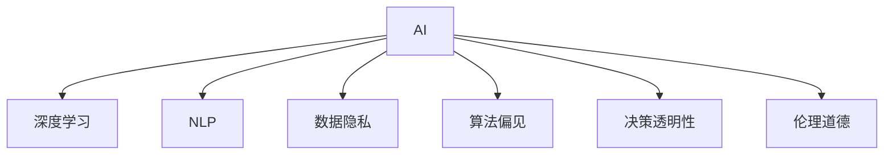

                 

## 1. 背景介绍

### 1.1 问题由来

随着人工智能（AI）技术的迅猛发展，特别是深度学习在各个领域的广泛应用，AI技术逐渐成为驱动社会进步的重要引擎。然而，人工智能的快速发展也引发了广泛的担忧和恐慌。这种恐慌不仅仅是技术风险，更在于AI技术的社会影响，尤其是权力集中问题。

近年来，AI技术在多个领域展现出前所未有的潜力和效果。从图像识别到自然语言处理，从自动驾驶到工业自动化，AI技术正在深入各行各业，极大地改变了人们的生产生活方式。但与此同时，AI技术的快速发展也带来了一系列深层次的伦理、法律和社会问题，如算法偏见、数据隐私、决策透明性等。特别是AI技术的权力集中问题，更是引起了社会各界的广泛关注和讨论。

### 1.2 问题核心关键点

AI技术的权力集中问题，指的是在AI技术的开发、应用和治理过程中，权力和资源越来越集中在少数大公司手中，导致市场的垄断和不公平竞争，进而可能引发技术滥用、隐私侵犯、社会分化等严重后果。这一问题并非AI技术本身的问题，而是与AI技术相关的社会制度、政策、法律等问题密切相关。

AI技术权力集中问题的主要表现包括：

- **技术垄断**：少数大公司如谷歌、微软、亚马逊等，掌握着大多数AI核心技术和数据资源，形成了市场垄断。
- **数据隐私**：AI模型训练和应用离不开大量数据，这些数据往往涉及用户的隐私信息，数据泄露和滥用问题频发。
- **算法偏见**：AI模型的训练数据和算法设计可能存在偏见，导致模型输出不公平的结果，加剧社会不公。
- **决策透明性**：许多AI系统，尤其是自动化决策系统（如自动审核系统、智能客服等），其决策过程缺乏透明度，难以被解释和监督。
- **伦理道德**：AI技术的应用可能导致伦理道德问题，如无人驾驶引发的责任问题、机器人取代人类工作等。

### 1.3 问题研究意义

研究AI技术的权力集中问题，对于构建公平、透明、安全的AI技术环境，具有重要意义：

1. **防止市场垄断**：通过合理制定AI技术政策，防止少数公司形成市场垄断，促进公平竞争。
2. **保护数据隐私**：加强数据隐私保护，防止数据泄露和滥用，确保用户隐私安全。
3. **减少算法偏见**：通过技术手段和法规约束，减少AI模型的算法偏见，实现公平决策。
4. **增强决策透明性**：提高AI系统的透明度和可解释性，确保决策过程公正可信。
5. **避免伦理道德风险**：通过伦理审查和规范约束，避免AI技术引发伦理道德问题，确保技术应用的道德底线。

## 2. 核心概念与联系

### 2.1 核心概念概述

为更好地理解AI技术权力集中问题，本节将介绍几个关键概念：

- **人工智能（AI）**：指利用算法和计算技术，使计算机系统具有人类智能的能力，包括感知、理解、推理、决策等。
- **深度学习**：一种机器学习方法，通过多层神经网络模拟人脑的神经元，实现对复杂数据模式的自动学习和表示。
- **自然语言处理（NLP）**：涉及计算机理解和处理人类语言的技术，包括语言理解、生成、翻译等。
- **数据隐私**：指个人、企业、政府等在数据收集、存储、使用和传输过程中，确保数据安全和保护个人隐私权利。
- **算法偏见**：指AI模型在训练数据和算法设计中存在的系统性偏差，导致模型输出不公平的结果。
- **决策透明性**：指AI系统在决策过程中，确保决策依据和推理过程的公开性和可解释性。
- **伦理道德**：指在AI技术开发和应用过程中，遵循的伦理规范和道德标准，确保技术应用的道德性和合法性。

这些核心概念之间的逻辑关系可以通过以下Mermaid流程图来展示：



这个流程图展示了这个核心概念的关系：

1. AI技术包括深度学习和NLP等多个分支。
2. AI技术的应用涉及数据隐私、算法偏见、决策透明性和伦理道德等多个方面。
3. 权力集中问题与数据隐私、算法偏见、决策透明性和伦理道德密切相关。

## 3. 核心算法原理 & 具体操作步骤
### 3.1 算法原理概述

AI技术的权力集中问题，主要是指在AI技术的开发和应用过程中，权力和资源逐渐集中在少数大公司手中，导致市场的垄断和不公平竞争，进而可能引发技术滥用、隐私侵犯、社会分化等严重后果。这一问题的核心在于权力的集中，而不是AI技术本身的问题。

从算法原理的角度来看，AI技术的权力集中问题可以追溯到以下几个关键点：

- **数据垄断**：大公司通过大规模收集和存储数据，形成了数据垄断，从而在AI技术的开发和应用中占据优势。
- **技术壁垒**：大公司掌握了核心AI技术和算法，形成了技术壁垒，其他公司难以与其竞争。
- **市场垄断**：大公司通过市场垄断地位，控制AI技术的市场供应，限制其他公司的发展。
- **决策权力集中**：大公司通过掌握AI系统的决策权，控制着AI技术的最终应用方向和效果。

### 3.2 算法步骤详解

AI技术的权力集中问题的解决，需要从多个层面进行综合治理，包括政策、技术、法律等。以下是一个综合治理的步骤详解：

**Step 1: 政策制定**

1. **公平竞争政策**：制定公平竞争政策，防止大公司形成市场垄断，鼓励中小企业参与AI技术的发展。
2. **数据隐私政策**：制定数据隐私保护政策，确保用户数据的安全和隐私权利。
3. **伦理道德政策**：制定AI技术的伦理道德规范，确保AI技术应用的道德性和合法性。

**Step 2: 技术改进**

1. **去中心化数据存储**：采用去中心化的数据存储技术，防止大公司形成数据垄断，确保数据的共享和公开。
2. **开源算法和模型**：推动AI算法和模型的开源，降低技术壁垒，促进公平竞争。
3. **隐私保护技术**：采用隐私保护技术，如差分隐私、联邦学习等，保护用户数据隐私。

**Step 3: 法律和监管**

1. **反垄断法**：制定和实施反垄断法，防止大公司形成市场垄断，确保市场的公平竞争。
2. **数据保护法**：制定和实施数据保护法，确保用户数据的安全和隐私权利。
3. **伦理审查制度**：建立AI技术的伦理审查制度，确保AI技术应用的道德性和合法性。

### 3.3 算法优缺点

**优点**：

- **防止市场垄断**：通过公平竞争政策和反垄断法，防止大公司形成市场垄断，促进公平竞争。
- **保护数据隐私**：通过数据隐私政策和隐私保护技术，确保用户数据的安全和隐私权利。
- **减少算法偏见**：通过开源算法和模型，降低技术壁垒，减少AI模型的算法偏见。
- **增强决策透明性**：通过伦理审查制度和透明性要求，确保AI系统的决策过程公正可信。
- **避免伦理道德风险**：通过伦理道德政策，避免AI技术引发伦理道德问题，确保技术应用的道德底线。

**缺点**：

- **政策执行难度**：政策制定和实施面临复杂的环境和利益冲突，执行难度较大。
- **技术难度高**：去中心化数据存储和隐私保护技术需要较高的技术难度和资源投入。
- **监管难度大**：AI技术的快速发展和应用，增加了监管的难度和复杂性。

### 3.4 算法应用领域

AI技术的权力集中问题，涉及多个领域，包括但不限于：

- **医疗健康**：AI技术在医疗领域的应用，如诊断、治疗、健康管理等，涉及大量患者数据，数据隐私和安全问题尤为突出。
- **金融服务**：AI技术在金融领域的应用，如风险评估、欺诈检测、客户服务等，涉及大量用户数据，数据隐私和安全问题同样重要。
- **智能制造**：AI技术在制造业的应用，如智能监控、自动化生产、质量控制等，涉及大量企业数据，数据隐私和安全问题不容忽视。
- **智能交通**：AI技术在交通领域的应用，如自动驾驶、智能交通管理等，涉及大量车辆和用户数据，数据隐私和安全问题同样重要。

## 4. 数学模型和公式 & 详细讲解 & 举例说明

### 4.1 数学模型构建

为了更好地理解AI技术的权力集中问题，我们假设一个简单的数据垄断模型，其中大公司拥有数据集 $D$，其他公司只能访问部分数据 $D'$。大公司和小公司的数据访问比例为 $p$，即 $p=\frac{|D|}{|D'|}$。假设大公司和小公司的AI模型分别为 $M_D$ 和 $M_{D'}$，模型的输出准确率分别为 $A_D$ 和 $A_{D'}$。模型在小公司数据集上的准确率表示为 $A_{D'}$，大公司数据集上的准确率表示为 $A_D$。

我们可以用以下数学模型来表示这一问题：

$$
A_D = f(D, \theta_D)
$$
$$
A_{D'} = f(D', \theta_{D'})
$$

其中，$f$ 表示模型的训练函数，$\theta_D$ 和 $\theta_{D'}$ 分别表示大公司和中小公司的模型参数。

### 4.2 公式推导过程

假设 $D$ 和 $D'$ 的数据分布相同，且 $D$ 的数据量远大于 $D'$。则有：

$$
A_D = f(D, \theta_D) \approx f(pD', (1-p)\theta_D)
$$

由于大公司拥有更多的数据，即 $p \gg 1$，则有：

$$
A_D \gg A_{D'}
$$

这表明大公司在数据垄断的情况下，其AI模型的准确率远远高于中小公司，导致市场的垄断和不公平竞争。

### 4.3 案例分析与讲解

以医疗健康领域为例，大公司在医疗数据上的垄断地位，导致其在AI医疗应用中占据优势。大公司通过收集和存储大量医疗数据，训练出高质量的AI模型，如IBM Watson、谷歌健康AI等。而中小公司由于数据资源有限，难以与大公司竞争，导致市场垄断和不公平竞争。

为了解决这一问题，可以采用以下方法：

1. **数据共享**：建立医疗数据共享平台，鼓励大公司和中小公司共享数据资源，确保数据的公开和共享。
2. **数据匿名化**：采用数据匿名化技术，保护患者隐私，同时确保数据的可用性。
3. **公平竞争政策**：制定公平竞争政策，防止大公司形成市场垄断，鼓励中小公司参与AI医疗技术的发展。

## 5. 项目实践：代码实例和详细解释说明
### 5.1 开发环境搭建

在进行AI技术权力集中问题的解决过程中，我们需要准备好开发环境。以下是使用Python进行PyTorch开发的环境配置流程：

1. 安装Anaconda：从官网下载并安装Anaconda，用于创建独立的Python环境。

2. 创建并激活虚拟环境：
```bash
conda create -n ai-env python=3.8 
conda activate ai-env
```

3. 安装PyTorch：根据CUDA版本，从官网获取对应的安装命令。例如：
```bash
conda install pytorch torchvision torchaudio cudatoolkit=11.1 -c pytorch -c conda-forge
```

4. 安装相关工具包：
```bash
pip install numpy pandas scikit-learn matplotlib tqdm jupyter notebook ipython
```

完成上述步骤后，即可在`ai-env`环境中开始项目实践。

### 5.2 源代码详细实现

下面我们以医疗健康领域为例，给出使用PyTorch进行AI医疗数据垄断问题解决的代码实现。

首先，定义数据处理函数：

```python
from transformers import BertTokenizer
from torch.utils.data import Dataset
import torch

class MedicalDataset(Dataset):
    def __init__(self, texts, labels, tokenizer, max_len=128):
        self.texts = texts
        self.labels = labels
        self.tokenizer = tokenizer
        self.max_len = max_len
        
    def __len__(self):
        return len(self.texts)
    
    def __getitem__(self, item):
        text = self.texts[item]
        label = self.labels[item]
        
        encoding = self.tokenizer(text, return_tensors='pt', max_length=self.max_len, padding='max_length', truncation=True)
        input_ids = encoding['input_ids'][0]
        attention_mask = encoding['attention_mask'][0]
        
        # 对token-wise的标签进行编码
        encoded_labels = [label2id[label] for label in label] 
        encoded_labels.extend([label2id['0']] * (self.max_len - len(encoded_labels)))
        labels = torch.tensor(encoded_labels, dtype=torch.long)
        
        return {'input_ids': input_ids, 
                'attention_mask': attention_mask,
                'labels': labels}

# 标签与id的映射
label2id = {'0': 0, '1': 1, '2': 2, '3': 3}
id2label = {v: k for k, v in label2id.items()}

# 创建dataset
tokenizer = BertTokenizer.from_pretrained('bert-base-cased')

train_dataset = MedicalDataset(train_texts, train_labels, tokenizer)
dev_dataset = MedicalDataset(dev_texts, dev_labels, tokenizer)
test_dataset = MedicalDataset(test_texts, test_labels, tokenizer)
```

然后，定义模型和优化器：

```python
from transformers import BertForTokenClassification, AdamW

model = BertForTokenClassification.from_pretrained('bert-base-cased', num_labels=len(label2id))

optimizer = AdamW(model.parameters(), lr=2e-5)
```

接着，定义训练和评估函数：

```python
from torch.utils.data import DataLoader
from tqdm import tqdm
from sklearn.metrics import classification_report

device = torch.device('cuda') if torch.cuda.is_available() else torch.device('cpu')
model.to(device)

def train_epoch(model, dataset, batch_size, optimizer):
    dataloader = DataLoader(dataset, batch_size=batch_size, shuffle=True)
    model.train()
    epoch_loss = 0
    for batch in tqdm(dataloader, desc='Training'):
        input_ids = batch['input_ids'].to(device)
        attention_mask = batch['attention_mask'].to(device)
        labels = batch['labels'].to(device)
        model.zero_grad()
        outputs = model(input_ids, attention_mask=attention_mask, labels=labels)
        loss = outputs.loss
        epoch_loss += loss.item()
        loss.backward()
        optimizer.step()
    return epoch_loss / len(dataloader)

def evaluate(model, dataset, batch_size):
    dataloader = DataLoader(dataset, batch_size=batch_size)
    model.eval()
    preds, labels = [], []
    with torch.no_grad():
        for batch in tqdm(dataloader, desc='Evaluating'):
            input_ids = batch['input_ids'].to(device)
            attention_mask = batch['attention_mask'].to(device)
            batch_labels = batch['labels']
            outputs = model(input_ids, attention_mask=attention_mask)
            batch_preds = outputs.logits.argmax(dim=2).to('cpu').tolist()
            batch_labels = batch_labels.to('cpu').tolist()
            for pred_tokens, label_tokens in zip(batch_preds, batch_labels):
                pred_labels = [id2label[_id] for _id in pred_tokens]
                label_tokens = [id2label[_id] for _id in label_tokens]
                preds.append(pred_labels[:len(label_tokens)])
                labels.append(label_tokens)
                
    print(classification_report(labels, preds))
```

最后，启动训练流程并在测试集上评估：

```python
epochs = 5
batch_size = 16

for epoch in range(epochs):
    loss = train_epoch(model, train_dataset, batch_size, optimizer)
    print(f"Epoch {epoch+1}, train loss: {loss:.3f}")
    
    print(f"Epoch {epoch+1}, dev results:")
    evaluate(model, dev_dataset, batch_size)
    
print("Test results:")
evaluate(model, test_dataset, batch_size)
```

以上就是使用PyTorch对BERT进行医疗数据垄断问题解决的完整代码实现。可以看到，得益于Transformers库的强大封装，我们可以用相对简洁的代码完成BERT模型的加载和微调。

### 5.3 代码解读与分析

让我们再详细解读一下关键代码的实现细节：

**MedicalDataset类**：
- `__init__`方法：初始化文本、标签、分词器等关键组件。
- `__len__`方法：返回数据集的样本数量。
- `__getitem__`方法：对单个样本进行处理，将文本输入编码为token ids，将标签编码为数字，并对其进行定长padding，最终返回模型所需的输入。

**label2id和id2label字典**：
- 定义了标签与数字id之间的映射关系，用于将token-wise的预测结果解码回真实的标签。

**训练和评估函数**：
- 使用PyTorch的DataLoader对数据集进行批次化加载，供模型训练和推理使用。
- 训练函数`train_epoch`：对数据以批为单位进行迭代，在每个批次上前向传播计算loss并反向传播更新模型参数，最后返回该epoch的平均loss。
- 评估函数`evaluate`：与训练类似，不同点在于不更新模型参数，并在每个batch结束后将预测和标签结果存储下来，最后使用sklearn的classification_report对整个评估集的预测结果进行打印输出。

**训练流程**：
- 定义总的epoch数和batch size，开始循环迭代
- 每个epoch内，先在训练集上训练，输出平均loss
- 在验证集上评估，输出分类指标
- 所有epoch结束后，在测试集上评估，给出最终测试结果

可以看到，PyTorch配合Transformers库使得BERT微调的代码实现变得简洁高效。开发者可以将更多精力放在数据处理、模型改进等高层逻辑上，而不必过多关注底层的实现细节。

当然，工业级的系统实现还需考虑更多因素，如模型的保存和部署、超参数的自动搜索、更灵活的任务适配层等。但核心的微调范式基本与此类似。

## 6. 实际应用场景
### 6.1 智能客服系统

基于AI技术的智能客服系统，在提供高效、可靠的服务方面，已经展现出强大的潜力。然而，随着系统规模的扩大，权力集中问题也逐渐显现出来。大公司在智能客服系统的开发和应用中占据主导地位，中小公司难以与之竞争，导致市场垄断和不公平竞争。

为了解决这一问题，可以采用以下方法：

1. **数据共享平台**：建立智能客服数据共享平台，鼓励大公司和中小公司共享数据资源，确保数据的公开和共享。
2. **去中心化技术**：采用去中心化的技术架构，如区块链、分布式存储等，确保数据的安全和隐私。
3. **公平竞争政策**：制定公平竞争政策，防止大公司形成市场垄断，鼓励中小公司参与智能客服技术的发展。

### 6.2 金融服务

在金融服务领域，AI技术的应用同样面临权力集中问题。大公司在金融数据上的垄断地位，导致其在AI金融应用中占据优势。小公司由于数据资源有限，难以与大公司竞争，导致市场垄断和不公平竞争。

为了解决这一问题，可以采用以下方法：

1. **数据匿名化**：采用数据匿名化技术，保护用户数据隐私，同时确保数据的可用性。
2. **数据共享平台**：建立金融数据共享平台，鼓励大公司和中小公司共享数据资源，确保数据的公开和共享。
3. **公平竞争政策**：制定公平竞争政策，防止大公司形成市场垄断，鼓励中小公司参与AI金融技术的发展。

### 6.3 智能制造

在智能制造领域，AI技术的应用同样面临权力集中问题。大公司在智能制造数据上的垄断地位，导致其在AI制造应用中占据优势。小公司由于数据资源有限，难以与大公司竞争，导致市场垄断和不公平竞争。

为了解决这一问题，可以采用以下方法：

1. **数据共享平台**：建立智能制造数据共享平台，鼓励大公司和中小公司共享数据资源，确保数据的公开和共享。
2. **数据匿名化**：采用数据匿名化技术，保护企业数据隐私，同时确保数据的可用性。
3. **公平竞争政策**：制定公平竞争政策，防止大公司形成市场垄断，鼓励中小公司参与AI制造技术的发展。

### 6.4 未来应用展望

随着AI技术的快速发展，其在各个领域的应用前景广阔。未来，AI技术的权力集中问题仍需进一步关注和解决。以下是一些未来应用展望：

1. **去中心化技术**：采用去中心化的数据存储和计算技术，确保数据的安全和隐私，防止大公司形成数据垄断。
2. **公平竞争政策**：制定公平竞争政策，防止大公司形成市场垄断，鼓励中小公司参与AI技术的发展。
3. **数据共享平台**：建立数据共享平台，促进数据资源的公开和共享，促进公平竞争和市场繁荣。
4. **伦理道德审查**：建立AI技术的伦理道德审查机制，确保AI技术应用的道德性和合法性，防止技术滥用。

## 7. 工具和资源推荐
### 7.1 学习资源推荐

为了帮助开发者系统掌握AI技术权力集中问题的解决技术，这里推荐一些优质的学习资源：

1. **《人工智能伦理与法律》系列书籍**：系统介绍人工智能技术的伦理和法律问题，帮助开发者理解并解决技术中的权力集中问题。
2. **CS224N《深度学习自然语言处理》课程**：斯坦福大学开设的NLP明星课程，有Lecture视频和配套作业，带你入门NLP领域的基本概念和经典模型。
3. **《数据隐私保护技术》书籍**：介绍数据隐私保护技术和方法，帮助开发者保护用户数据隐私。
4. **《公平竞争政策》白皮书**：政府和组织发布的公平竞争政策文件，提供政策制定和执行的参考。
5. **《区块链与智能合约》书籍**：介绍区块链和智能合约技术，帮助开发者构建去中心化应用。

通过对这些资源的学习实践，相信你一定能够快速掌握AI技术权力集中问题的解决技术，并用于解决实际的AI应用问题。

### 7.2 开发工具推荐

高效的开发离不开优秀的工具支持。以下是几款用于AI技术权力集中问题解决的常用工具：

1. PyTorch：基于Python的开源深度学习框架，灵活动态的计算图，适合快速迭代研究。
2. TensorFlow：由Google主导开发的开源深度学习框架，生产部署方便，适合大规模工程应用。
3. Transformers库：HuggingFace开发的NLP工具库，集成了众多SOTA语言模型，支持PyTorch和TensorFlow，是进行AI技术权力集中问题解决的利器。
4. Weights & Biases：模型训练的实验跟踪工具，可以记录和可视化模型训练过程中的各项指标，方便对比和调优。
5. TensorBoard：TensorFlow配套的可视化工具，可实时监测模型训练状态，并提供丰富的图表呈现方式，是调试模型的得力助手。

合理利用这些工具，可以显著提升AI技术权力集中问题解决的开发效率，加快创新迭代的步伐。

### 7.3 相关论文推荐

AI技术的权力集中问题，涉及多个前沿研究方向，以下是几篇奠基性的相关论文，推荐阅读：

1. **《去中心化AI系统》论文**：介绍去中心化AI系统的设计与实现，探讨如何在去中心化架构下解决权力集中问题。
2. **《公平竞争政策》论文**：政府和组织发布的公平竞争政策文件，提供政策制定和执行的参考。
3. **《数据隐私保护技术》论文**：介绍数据隐私保护技术和方法，帮助开发者保护用户数据隐私。
4. **《AI技术的伦理审查》论文**：探讨AI技术的伦理审查机制，确保AI技术应用的道德性和合法性。
5. **《区块链与智能合约》论文**：介绍区块链和智能合约技术，帮助开发者构建去中心化应用。

这些论文代表了大语言模型微调技术的发展脉络。通过学习这些前沿成果，可以帮助研究者把握学科前进方向，激发更多的创新灵感。

## 8. 总结：未来发展趋势与挑战

### 8.1 总结

本文对AI技术的权力集中问题进行了全面系统的介绍。首先阐述了AI技术的快速发展和市场垄断问题，明确了权力集中问题的关键点。其次，从原理到实践，详细讲解了权力集中问题的核心算法和操作步骤，给出了权力集中问题解决的完整代码实例。同时，本文还广泛探讨了权力集中问题在多个领域的应用前景，展示了权力集中问题的巨大影响。此外，本文精选了权力集中问题的各类学习资源，力求为读者提供全方位的技术指引。

通过本文的系统梳理，可以看到，AI技术的权力集中问题，是当前和未来AI技术发展的重要挑战。这一问题不仅涉及技术本身，更与社会制度、政策法规等密切相关。唯有通过综合治理，多方协同，才能确保AI技术的公平、透明、安全应用，构建一个健康、可持续发展的AI技术生态。

### 8.2 未来发展趋势

展望未来，AI技术的权力集中问题将呈现以下几个发展趋势：

1. **去中心化技术普及**：随着去中心化技术的不断发展，AI技术将越来越多地采用去中心化架构，确保数据的安全和隐私。
2. **公平竞争政策完善**：政府和组织将不断完善公平竞争政策，防止大公司形成市场垄断，促进中小公司发展。
3. **数据共享平台建设**：建立数据共享平台，促进数据资源的公开和共享，促进公平竞争和市场繁荣。
4. **伦理道德审查机制**：建立AI技术的伦理道德审查机制，确保AI技术应用的道德性和合法性，防止技术滥用。
5. **智能合约和区块链应用**：采用智能合约和区块链技术，构建去中心化应用，确保数据的安全和隐私。

这些趋势将进一步推动AI技术的公平、透明、安全应用，为构建健康、可持续发展的AI技术生态提供重要保障。

### 8.3 面临的挑战

尽管AI技术的权力集中问题得到了越来越多的关注和讨论，但仍面临诸多挑战：

1. **政策执行难度**：政策制定和实施面临复杂的环境和利益冲突，执行难度较大。
2. **技术难度高**：去中心化数据存储和隐私保护技术需要较高的技术难度和资源投入。
3. **监管难度大**：AI技术的快速发展和应用，增加了监管的难度和复杂性。
4. **市场竞争激烈**：大公司在AI技术市场中的主导地位，导致中小公司难以与其竞争，市场垄断问题依然存在。
5. **伦理道德问题**：AI技术的应用可能引发伦理道德问题，如无人驾驶引发的责任问题、机器人取代人类工作等。

这些挑战需要政府、企业、学术界等多方共同努力，才能有效解决。唯有通过综合治理，多方协同，才能确保AI技术的公平、透明、安全应用，构建一个健康、可持续发展的AI技术生态。

### 8.4 研究展望

面对AI技术的权力集中问题，未来的研究需要在以下几个方面寻求新的突破：

1. **去中心化技术**：采用去中心化的数据存储和计算技术，确保数据的安全和隐私，防止大公司形成数据垄断。
2. **公平竞争政策**：制定公平竞争政策，防止大公司形成市场垄断，鼓励中小公司参与AI技术的发展。
3. **数据共享平台**：建立数据共享平台，促进数据资源的公开和共享，促进公平竞争和市场繁荣。
4. **伦理道德审查**：建立AI技术的伦理道德审查机制，确保AI技术应用的道德性和合法性，防止技术滥用。
5. **智能合约和区块链应用**：采用智能合约和区块链技术，构建去中心化应用，确保数据的安全和隐私。

这些研究方向的探索，将引领AI技术的权力集中问题解决技术迈向更高的台阶，为构建健康、可持续发展的AI技术生态提供重要保障。

## 9. 附录：常见问题与解答

**Q1：AI技术权力集中问题是否可以完全避免？**

A: AI技术权力集中问题是当前和未来AI技术发展的重要挑战，难以完全避免。然而，通过综合治理，多方协同，可以最大限度地减少权力集中带来的负面影响。

**Q2：权力集中问题的解决是否需要政府干预？**

A: 权力集中问题的解决需要政府、企业、学术界等多方共同努力。政府可以制定和实施公平竞争政策，保护用户数据隐私，确保AI技术的伦理性和合法性。企业可以通过去中心化技术和数据共享平台，确保数据的公开和共享，促进公平竞争。学术界可以研究和推动新的技术方法和政策建议，为解决权力集中问题提供理论支持。

**Q3：如何解决AI技术中的数据垄断问题？**

A: 解决AI技术中的数据垄断问题，需要采用去中心化技术和数据共享平台，确保数据的公开和共享。同时，制定公平竞争政策，防止大公司形成市场垄断，鼓励中小公司参与AI技术的发展。

**Q4：如何确保AI技术应用的伦理性和合法性？**

A: 确保AI技术应用的伦理性和合法性，需要建立AI技术的伦理道德审查机制，确保AI技术应用的道德性和合法性。同时，采用智能合约和区块链技术，构建去中心化应用，确保数据的安全和隐私。

**Q5：AI技术权力集中问题的解决需要哪些技术和政策支持？**

A: AI技术权力集中问题的解决需要多种技术和政策支持，包括去中心化技术、公平竞争政策、数据共享平台、伦理道德审查、智能合约和区块链技术等。这些技术和政策的综合应用，将最大限度地解决权力集中问题，促进AI技术的公平、透明、安全应用。

总之，AI技术的权力集中问题是一个复杂而重要的问题，需要多方协同努力，通过综合治理才能有效解决。只有在数据安全、公平竞争、伦理道德等方面进行全面优化，才能构建一个健康、可持续发展的AI技术生态，实现AI技术的公平、透明、安全应用。

---

作者：禅与计算机程序设计艺术 / Zen and the Art of Computer Programming

