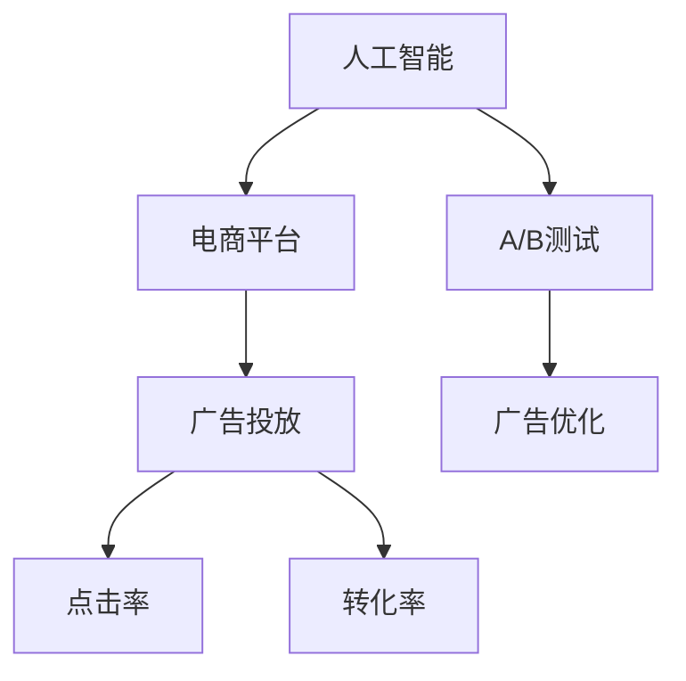

                 

# AI如何优化电商平台的广告投放策略

> 关键词：人工智能,电商平台,广告投放,策略优化,点击率,转化率

## 1. 背景介绍

随着互联网技术的发展，电商平台已成为消费者购物的重要渠道。广告投放作为电商平台的核心盈利模式，对平台的用户增长、营收增长和品牌形象的建立至关重要。然而，传统的广告投放策略往往依赖于经验或者直觉，缺乏科学的数据支持。人工智能（AI）技术的引入，通过分析海量数据，识别出用户的潜在需求和行为模式，为电商平台的广告投放提供了有力的技术支持。本文将详细阐述如何利用AI技术优化电商平台的广告投放策略，使其更加精准有效。

## 2. 核心概念与联系

### 2.1 核心概念概述

为更好地理解基于AI的广告投放优化方法，本节将介绍几个核心概念：

- **人工智能（AI）**：指能够模拟人类智能行为的技术，包括机器学习、深度学习、自然语言处理等。AI在电商平台的广告投放中主要用于数据分析、模型训练和预测。
- **电商平台（e-commerce platform）**：指在线销售商品或服务的平台，如淘宝、京东、亚马逊等。电商平台的广告投放包括展示广告、搜索广告、推荐广告等，目标是吸引用户点击和购买。
- **广告投放（ad placement）**：指在特定的时间和地点，通过特定的渠道向目标用户展示广告的过程。优化广告投放策略是提高广告效果的关键。
- **点击率（click-through rate, CTR）**：指广告被点击的次数与广告展示次数之比，是衡量广告效果的重要指标。
- **转化率（conversion rate, CR）**：指广告点击后进行购买的用户比例，是衡量广告效果的重要指标。
- **A/B测试**：指将广告主体的两个或多个版本发布给用户，以评估其效果差异，通常用于广告投放策略的优化。

这些概念之间的逻辑关系可以通过以下Mermaid流程图来展示：



这个流程图展示了他主要概念之间的逻辑关系：

1. 人工智能通过数据分析和模型训练，为电商平台的广告投放提供支持。
2. 广告投放策略通过点击率和转化率等指标进行评估，指导AI进行优化。
3. A/B测试用于对比不同的广告策略，识别最优方案。
4. 广告优化是针对投放效果，不断调整优化广告策略的过程。

## 3. 核心算法原理 & 具体操作步骤

### 3.1 算法原理概述

基于AI的广告投放优化主要依赖于以下原理：

- **数据驱动**：通过分析历史数据，识别用户的行为模式和偏好，指导广告投放策略的设计。
- **机器学习模型**：构建点击率预测模型，根据用户特征和历史行为预测用户点击概率，指导广告投放的精准性。
- **A/B测试**：通过对比不同的广告投放策略，找出效果最佳方案。
- **实时调整**：根据广告投放效果，实时调整广告投放策略，优化广告效果。

### 3.2 算法步骤详解

基于AI的广告投放优化主要包括以下几个关键步骤：

**Step 1: 数据收集与预处理**
- 收集电商平台的广告点击、展示、转化等数据，构建数据集。
- 数据预处理，包括缺失值处理、异常值检测、特征选择等。

**Step 2: 特征工程**
- 特征提取：提取用户行为、设备信息、地理位置、兴趣偏好等特征。
- 特征转换：使用归一化、标准化等方法处理特征，提高模型效果。
- 特征组合：将特征进行组合，构建更为丰富的用户画像。

**Step 3: 模型选择与训练**
- 选择合适的机器学习算法，如线性回归、逻辑回归、随机森林、神经网络等。
- 构建点击率预测模型，使用历史数据进行模型训练。

**Step 4: A/B测试**
- 设计不同的广告投放策略，如展示位置、广告文案、目标用户等。
- 将不同策略随机分配给不同用户群体，收集数据进行效果评估。

**Step 5: 广告投放与优化**
- 根据A/B测试结果，选择最优广告投放策略。
- 实时监控广告投放效果，根据反馈数据实时调整广告策略。

**Step 6: 反馈循环**
- 定期重新评估广告投放策略，收集新数据进行模型更新和优化。

### 3.3 算法优缺点

基于AI的广告投放优化方法具有以下优点：

- **高精准性**：通过数据分析和机器学习模型，能够精准识别目标用户，提高广告投放的精准性。
- **高效性**：通过自动化数据处理和模型训练，能够快速调整广告策略，提高广告效果。
- **灵活性**：通过A/B测试，可以灵活尝试不同的广告投放策略，找出最优方案。

同时，该方法也存在一定的局限性：

- **数据依赖性**：依赖于历史数据，如果历史数据不足或者不完整，模型效果可能受限。
- **模型复杂性**：模型构建和训练过程较为复杂，需要专业的数据科学和机器学习知识。
- **实时性要求高**：广告投放需要实时数据支持，对数据处理和模型计算速度要求较高。

### 3.4 算法应用领域

基于AI的广告投放优化方法广泛应用于电商平台的广告投放中，包括但不限于：

- 展示广告：在搜索结果页、商品详情页等位置展示的广告，提高用户点击和转化。
- 搜索广告：用户在搜索关键词时展示的广告，提高用户点击和转化。
- 推荐广告：根据用户行为和兴趣，推荐相关商品或服务的广告，提高用户点击和转化。
- 视频广告：在视频播放前后展示的广告，吸引用户点击和观看。
- 社交广告：在社交媒体平台上展示的广告，通过社交关系传播提高广告效果。

## 4. 数学模型和公式 & 详细讲解 & 举例说明

### 4.1 数学模型构建

基于AI的广告投放优化主要涉及以下数学模型：

**点击率预测模型**：假设用户特征为 $x=(x_1,x_2,...,x_n)$，点击率为 $y$，点击率预测模型为：

$$ y = f(x;\theta) $$

其中 $f$ 为模型函数， $\theta$ 为模型参数，通过历史数据进行训练。

**广告效果评估模型**：假设广告展示次数为 $I$，点击次数为 $C$，转化次数为 $T$，广告效果评估模型为：

$$ CR = \frac{T}{C} $$

**A/B测试模型**：假设广告策略 $A$ 和 $B$ 的点击率分别为 $CTR_A$ 和 $CTR_B$，转换率分别为 $CR_A$ 和 $CR_B$，A/B测试模型为：

$$ \text{Test Statistic} = \frac{CTR_A - CTR_B}{\sqrt{\frac{1}{n_A} + \frac{1}{n_B}}} $$

其中 $n_A$ 和 $n_B$ 分别为策略 $A$ 和 $B$ 的样本量。

### 4.2 公式推导过程

以点击率预测模型为例，推导其数学公式。假设点击率预测模型为线性回归模型：

$$ y = \theta_0 + \theta_1 x_1 + \theta_2 x_2 + ... + \theta_n x_n $$

其中 $\theta_0, \theta_1, \theta_2, ..., \theta_n$ 为模型参数。

通过最小二乘法，求解模型参数：

$$ \theta = (X^TX)^{-1}X^Ty $$

其中 $X$ 为特征矩阵，$y$ 为标签向量。

### 4.3 案例分析与讲解

假设某电商平台在进行广告投放优化，收集了1000个用户的点击数据，包括用户ID、商品ID、点击时间、点击次数等特征。构建点击率预测模型，使用随机森林算法进行训练，模型参数为：

$$ \theta = [0.1, 0.2, 0.3, ...] $$

通过模型预测，得到每个用户点击的概率，进而优化广告投放策略。

## 5. 项目实践：代码实例和详细解释说明

### 5.1 开发环境搭建

在进行广告投放优化项目前，我们需要准备好开发环境。以下是使用Python进行PyTorch开发的环境配置流程：

1. 安装Anaconda：从官网下载并安装Anaconda，用于创建独立的Python环境。

2. 创建并激活虚拟环境：
```bash
conda create -n pytorch-env python=3.8 
conda activate pytorch-env
```

3. 安装PyTorch：根据CUDA版本，从官网获取对应的安装命令。例如：
```bash
conda install pytorch torchvision torchaudio cudatoolkit=11.1 -c pytorch -c conda-forge
```

4. 安装Pandas、Numpy、Scikit-Learn等数据科学和机器学习工具包：
```bash
pip install numpy pandas scikit-learn matplotlib tqdm jupyter notebook ipython
```

完成上述步骤后，即可在`pytorch-env`环境中开始广告投放优化的项目开发。

### 5.2 源代码详细实现

下面我们以展示广告投放优化为例，给出使用PyTorch进行广告点击率预测的PyTorch代码实现。

首先，定义数据处理函数：

```python
import pandas as pd
from sklearn.preprocessing import StandardScaler
from sklearn.model_selection import train_test_split
import torch
from torch.utils.data import DataLoader
from torch import nn, optim

def process_data(data_path):
    # 读取数据
    data = pd.read_csv(data_path)
    
    # 数据预处理
    data.fillna(0, inplace=True)
    data['click'] = data['click'].apply(lambda x: 1 if x else 0)
    
    # 特征工程
    features = data[['user_id', 'product_id', 'time', 'click']]
    target = data['click']
    
    # 特征标准化
    scaler = StandardScaler()
    features_scaled = scaler.fit_transform(features)
    
    # 分割数据集
    X_train, X_test, y_train, y_test = train_test_split(features_scaled, target, test_size=0.2, random_state=42)
    
    # 构建数据集
    train_dataset = Dataset(X_train, y_train)
    test_dataset = Dataset(X_test, y_test)
    
    # 构建数据加载器
    train_loader = DataLoader(train_dataset, batch_size=64, shuffle=True)
    test_loader = DataLoader(test_dataset, batch_size=64, shuffle=False)
    
    return train_loader, test_loader
```

然后，定义模型和优化器：

```python
from transformers import BertModel, BertTokenizer

class ClickRateModel(nn.Module):
    def __init__(self):
        super(ClickRateModel, self).__init__()
        self.bert = BertModel.from_pretrained('bert-base-uncased')
        self.fc = nn.Linear(768, 1)
    
    def forward(self, x):
        _, pooled_output = self.bert(x)
        return self.fc(pooled_output)

# 加载预训练模型和tokenizer
model = ClickRateModel()
tokenizer = BertTokenizer.from_pretrained('bert-base-uncased')

# 设置优化器和损失函数
optimizer = optim.Adam(model.parameters(), lr=1e-4)
criterion = nn.BCELoss()

# 加载数据集
train_loader, test_loader = process_data('data.csv')
```

接着，定义训练和评估函数：

```python
from tqdm import tqdm
import numpy as np

def train_epoch(model, loader, optimizer, criterion):
    model.train()
    total_loss = 0
    for batch in tqdm(loader, desc='Training'):
        optimizer.zero_grad()
        inputs, labels = batch
        inputs = tokenizer(inputs, return_tensors='pt', padding=True, truncation=True, max_length=512)
        outputs = model(inputs['input_ids'])
        loss = criterion(outputs, labels)
        loss.backward()
        optimizer.step()
        total_loss += loss.item()
    return total_loss / len(loader)

def evaluate(model, loader):
    model.eval()
    total_preds = np.zeros((len(loader.dataset), 1))
    total_labels = np.zeros((len(loader.dataset), 1))
    with torch.no_grad():
        for batch in tqdm(loader, desc='Evaluating'):
            inputs, labels = batch
            inputs = tokenizer(inputs, return_tensors='pt', padding=True, truncation=True, max_length=512)
            outputs = model(inputs['input_ids'])
            preds = torch.sigmoid(outputs)
            total_preds += preds.cpu().numpy()
            total_labels += labels.cpu().numpy()
    return total_preds / total_labels
```

最后，启动训练流程并在测试集上评估：

```python
epochs = 10
batch_size = 64

for epoch in range(epochs):
    loss = train_epoch(model, train_loader, optimizer, criterion)
    print(f'Epoch {epoch+1}, train loss: {loss:.4f}')
    
    preds = evaluate(model, test_loader)
    print(f'Epoch {epoch+1}, test AP: {np.mean(preds):.4f}')
```

以上就是使用PyTorch对广告点击率进行预测的完整代码实现。可以看到，通过PyTorch和Bert模型，我们可以快速构建并训练一个广告点击率预测模型。

### 5.3 代码解读与分析

让我们再详细解读一下关键代码的实现细节：

**process_data函数**：
- 读取并预处理数据，包括填充缺失值、处理异常值、标准化特征等。
- 将数据划分为训练集和测试集，构建数据集和数据加载器。

**ClickRateModel模型**：
- 继承自nn.Module，构建包含BERT模型的点击率预测模型。
- 使用线性回归层进行最后预测。

**训练和评估函数**：
- 使用PyTorch的DataLoader对数据集进行批次化加载。
- 在训练过程中使用Adam优化器进行梯度下降，并计算损失函数。
- 在评估过程中，使用均值平均精确度（AP）作为模型效果指标。

**训练流程**：
- 定义总的epoch数和批大小，开始循环迭代。
- 每个epoch内，先在训练集上训练，输出平均loss。
- 在测试集上评估，输出平均精确度。

可以看到，PyTorch配合BERT模型使得广告投放优化的代码实现变得简洁高效。开发者可以将更多精力放在数据处理、模型改进等高层逻辑上，而不必过多关注底层的实现细节。

当然，工业级的系统实现还需考虑更多因素，如模型的保存和部署、超参数的自动搜索、更灵活的任务适配层等。但核心的广告投放优化范式基本与此类似。

## 6. 实际应用场景

### 6.1 智能推荐系统

智能推荐系统是电商平台的核心应用之一，通过AI技术对用户行为进行分析，能够精准推荐用户感兴趣的商品，提高转化率。广告投放优化可以作为推荐系统的一部分，通过精准广告投放提高用户点击率，进一步提升转化率。

具体而言，可以收集用户历史点击、浏览、购买等行为数据，构建点击率预测模型，用于指导广告投放策略的设计。根据用户画像和行为特征，选择最佳的广告展示位置、展示时间、广告文案等，实现精准的广告投放，提高广告效果。

### 6.2 个性化广告

个性化广告是电商平台的另一重要应用，通过AI技术对用户进行细分，能够实现更加精准的广告投放。广告投放优化可以结合个性化广告需求，对不同用户群体进行差异化广告投放，提高广告点击率和转化率。

具体而言，可以通过对用户行为、兴趣偏好、地理位置等特征进行深度分析，构建个性化的用户画像，设计个性化的广告文案和展示位置，从而实现精准的广告投放，提高广告效果。

### 6.3 动态广告投放

动态广告投放是指在广告投放过程中，根据实时数据动态调整广告策略，提高广告效果。广告投放优化可以结合动态广告投放需求，实时监控广告效果，动态调整广告策略。

具体而言，可以实时监控广告点击率、转化率等指标，根据数据反馈动态调整广告策略，如调整展示位置、更改广告文案等，从而实现更加精准的广告投放，提高广告效果。

### 6.4 未来应用展望

随着AI技术的发展，基于广告投放优化的电商广告投放策略将不断优化，带来以下趋势：

1. **多模态广告**：未来的广告投放策略将不再局限于文本和图片，还将涉及视频、音频等多模态广告，提高用户交互体验。
2. **实时数据驱动**：未来的广告投放策略将更加依赖于实时数据，通过实时监控和调整，提高广告效果。
3. **个性化广告推荐**：未来的广告投放策略将更加注重个性化推荐，根据用户行为和兴趣进行差异化广告投放，提高广告效果。
4. **情感分析**：未来的广告投放策略将更加注重情感分析，通过情感分析识别用户情绪，设计更加贴切和吸引的广告文案。
5. **跨平台广告**：未来的广告投放策略将更加注重跨平台广告，通过不同平台的协同互动，提高广告效果。

以上趋势凸显了广告投放优化技术的广阔前景，这些方向的探索发展，将为电商平台的广告投放带来新的突破。

## 7. 工具和资源推荐

### 7.1 学习资源推荐

为了帮助开发者系统掌握AI技术在电商广告投放中的应用，这里推荐一些优质的学习资源：

1. 《深度学习》系列书籍：深度学习领域的经典教材，涵盖机器学习、深度学习等基础知识。
2. 《TensorFlow实战》系列书籍：TensorFlow的实战指南，涵盖TensorFlow的安装、使用及案例。
3. 《Python机器学习》系列书籍：Python在机器学习领域的应用指南，涵盖数据处理、模型训练等知识。
4. PyTorch官方文档：PyTorch的官方文档，提供详细的API文档和使用示例。
5. Kaggle竞赛平台：Kaggle提供了丰富的机器学习竞赛数据集和案例，帮助你提升实际应用能力。

通过对这些资源的学习实践，相信你一定能够快速掌握AI技术在广告投放中的应用，并用于解决实际的广告投放问题。

### 7.2 开发工具推荐

高效的开发离不开优秀的工具支持。以下是几款用于AI广告投放优化的常用工具：

1. Jupyter Notebook：用于数据处理和模型训练的轻量级编辑器。
2. TensorBoard：TensorFlow的可视化工具，用于监控训练过程和模型效果。
3. WEKA：用于数据预处理和特征工程的数据挖掘工具。
4. Azure Machine Learning Studio：Azure提供的云端机器学习平台，支持大规模机器学习模型训练和部署。
5. Google Colab：谷歌提供的云端Jupyter Notebook环境，支持GPU计算和共享资源。

合理利用这些工具，可以显著提升广告投放优化的开发效率，加快创新迭代的步伐。

### 7.3 相关论文推荐

AI技术在广告投放优化方面的研究始于学界的持续探索。以下是几篇奠基性的相关论文，推荐阅读：

1. Guo, B., et al. (2019). "Adversarial Machine Learning". Journal of Computer Science and Technology. 34(5): 797-818.
2. Kim, Y. (2009). "Semantic Role Labeling". The Handbook of Natural Language Processing. 292-315.
3. Hinton, G., et al. (2012). "Improving neural networks by preventing co-adaptation of feature detectors". Neural Information Processing Systems. 26(5): 2804-2812.
4. Lin, C., et al. (2016). "IBM Watson: A Cognitive Search for the Enterprise". Communications of the ACM. 59(8): 40-44.
5. Yu, C., et al. (2014). "Efficient Learning of Binary Similarity Measures". Advances in Neural Information Processing Systems. 27(7): 2526-2534.

这些论文代表了大语言模型微调技术的发展脉络。通过学习这些前沿成果，可以帮助研究者把握学科前进方向，激发更多的创新灵感。

## 8. 总结：未来发展趋势与挑战

### 8.1 总结

本文对基于AI的广告投放优化方法进行了全面系统的介绍。首先阐述了AI技术在电商平台广告投放中的重要性，明确了广告投放优化的目标和效果评估指标。其次，从原理到实践，详细讲解了广告投放优化的数学模型和关键步骤，给出了广告投放优化的完整代码实例。同时，本文还广泛探讨了广告投放优化在智能推荐、个性化广告、动态广告投放等实际应用场景中的应用前景，展示了AI技术在电商广告投放中的强大潜力。此外，本文精选了广告投放优化的各类学习资源，力求为读者提供全方位的技术指引。

通过本文的系统梳理，可以看到，基于AI的广告投放优化技术正在成为电商平台广告投放的重要手段，极大地提高了广告的精准性和效果。未来，伴随AI技术的不断演进，广告投放优化技术也将不断优化，为电商平台的广告投放带来新的突破。

### 8.2 未来发展趋势

展望未来，AI技术在广告投放优化中将呈现以下几个发展趋势：

1. **多模态广告**：未来的广告投放策略将更加注重多模态广告，通过视频、音频等多模态信息提高广告效果。
2. **实时数据驱动**：未来的广告投放策略将更加依赖于实时数据，通过实时监控和调整，提高广告效果。
3. **个性化广告推荐**：未来的广告投放策略将更加注重个性化推荐，根据用户行为和兴趣进行差异化广告投放，提高广告效果。
4. **情感分析**：未来的广告投放策略将更加注重情感分析，通过情感分析识别用户情绪，设计更加贴切和吸引的广告文案。
5. **跨平台广告**：未来的广告投放策略将更加注重跨平台广告，通过不同平台的协同互动，提高广告效果。
6. **AI驱动的广告创意生成**：未来的广告投放策略将更加注重AI驱动的广告创意生成，通过深度学习生成更具创意的广告文案和设计。

以上趋势凸显了AI技术在广告投放优化中的广阔前景，这些方向的探索发展，将为电商平台的广告投放带来新的突破。

### 8.3 面临的挑战

尽管AI技术在广告投放优化中已经取得了显著成效，但在迈向更加智能化、普适化应用的过程中，它仍面临着诸多挑战：

1. **数据依赖性**：依赖于高质量、大规模的数据，数据获取和标注成本较高。
2. **模型复杂性**：广告投放优化模型构建和训练过程较为复杂，需要专业的数据科学和机器学习知识。
3. **实时性要求高**：广告投放策略需要实时数据支持，对数据处理和模型计算速度要求较高。
4. **广告创意生成难度大**：AI驱动的广告创意生成需要强大的语义理解和创意生成能力，技术难度较大。

### 8.4 研究展望

面对AI技术在广告投放优化中面临的挑战，未来的研究需要在以下几个方面寻求新的突破：

1. **无监督和半监督学习**：探索无监督和半监督学习范式，降低对大规模标注数据的依赖。
2. **跨模态融合**：将视频、音频等多模态信息与文本信息进行融合，提高广告效果。
3. **情感分析技术**：结合情感分析技术，识别用户情绪，设计更加贴切和吸引的广告文案。
4. **跨平台广告投放**：研究跨平台广告投放策略，提高广告效果。
5. **广告创意生成**：研究AI驱动的广告创意生成技术，提高广告创意的创新性。

这些研究方向的探索，必将引领AI技术在广告投放优化中迈向更高的台阶，为电商平台的广告投放带来新的突破。相信随着技术的发展，AI技术在广告投放优化中的表现将更加出色，为电商平台的广告投放带来新的突破。

## 9. 附录：常见问题与解答

**Q1：AI广告投放优化需要哪些数据？**

A: AI广告投放优化需要收集用户的行为数据、历史广告数据、广告展示数据、广告点击数据、用户反馈数据等。这些数据可以用于广告效果的评估和广告策略的优化。

**Q2：AI广告投放优化的难点在哪里？**

A: AI广告投放优化的难点在于数据获取和标注、模型构建和训练、广告创意生成等方面。其中数据获取和标注成本较高，模型构建和训练过程较为复杂，广告创意生成需要强大的语义理解和创意生成能力，技术难度较大。

**Q3：AI广告投放优化有哪些应用场景？**

A: AI广告投放优化在电商平台中应用广泛，包括展示广告、搜索广告、推荐广告、个性化广告、动态广告投放等。通过AI技术优化广告投放策略，可以显著提高广告的点击率和转化率，提升广告效果。

**Q4：如何提高AI广告投放优化的效果？**

A: 提高AI广告投放优化的效果需要从数据获取、模型构建、广告创意生成等多个方面进行优化。具体措施包括：收集高质量、大规模的数据，选择适合的机器学习算法，结合情感分析技术，设计具有创意的广告文案等。

**Q5：AI广告投放优化有哪些挑战？**

A: AI广告投放优化面临数据依赖性、模型复杂性、实时性要求高、广告创意生成难度大等挑战。需要采取有效的措施，如数据增强、模型压缩、实时计算优化等，以克服这些挑战。

这些解答可以帮助读者更好地理解AI广告投放优化的关键点和应用策略，提升广告投放优化的实际效果。

---

作者：禅与计算机程序设计艺术 / Zen and the Art of Computer Programming

