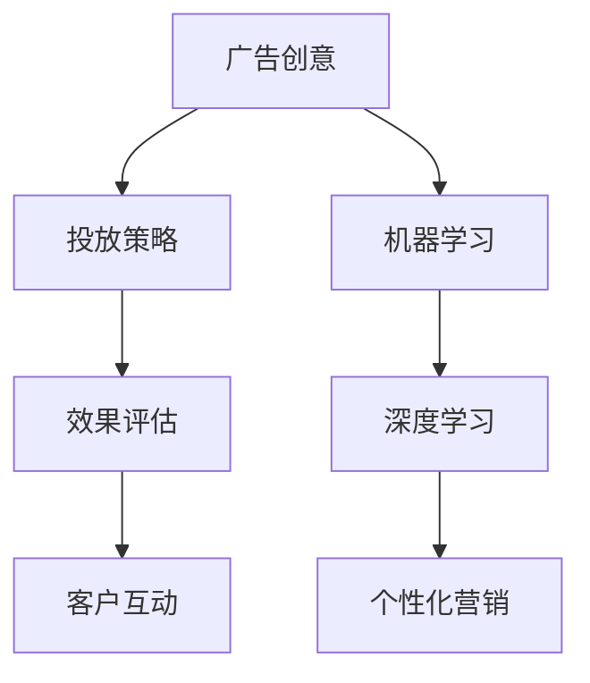

                 

# AI如何改变广告和市场营销

在数字化时代，广告和市场营销行业正经历着前所未有的变革。人工智能（AI）技术的引入，尤其是机器学习（ML）和深度学习（DL）的应用，正彻底改变着广告和市场营销的策略、效果评估和客户互动方式。本文将深入探讨AI如何通过不同方式改变广告和市场营销领域，从广告创意、投放策略到效果评估和客户互动，AI正在引领这场革命。

## 1. 背景介绍

### 1.1 问题由来

随着互联网和移动设备的普及，广告和市场营销的方式和渠道发生了巨大变化。传统的广告形式如电视、广播和印刷广告逐渐让位于网络广告和社交媒体营销。广告主和市场营销者面临着新的挑战，包括如何精准投放广告、衡量广告效果、提升客户互动体验以及实现个性化营销。

### 1.2 问题核心关键点

AI的引入为广告和市场营销带来了新的解决方案。通过数据分析、机器学习算法和深度学习模型，广告和市场营销从业者能够更精准地理解目标受众，制定个性化营销策略，并实现动态的广告投放。AI技术帮助广告主和市场营销者优化广告预算，提升广告效果，并在实时数据支持下不断优化策略。

## 2. 核心概念与联系

### 2.1 核心概念概述

以下是广告和市场营销领域中与AI密切相关的核心概念：

- **人工智能（AI）**：利用机器学习、深度学习等技术模拟人类智能行为的技术体系。
- **机器学习（ML）**：通过数据训练模型，使机器能够从数据中学习规律，并应用这些规律进行预测和决策。
- **深度学习（DL）**：一种特殊的机器学习技术，利用多层神经网络模拟人脑的神经系统，从而实现更复杂、更抽象的特征提取和模式识别。
- **广告创意**：广告内容的创作和设计，包括文字、图像、视频和音频等。
- **投放策略**：决定广告何时、何地、以何种形式投放的策略。
- **效果评估**：衡量广告效果的方法和工具，包括点击率、转化率、品牌曝光度等。
- **客户互动**：通过各种渠道与目标客户进行互动，提升客户满意度和忠诚度。
- **个性化营销**：根据客户行为和偏好进行定制化广告投放和内容推荐，提升客户体验和转化率。

这些概念之间的逻辑关系可以通过以下Mermaid流程图来展示：



这个流程图展示了大数据技术、机器学习和深度学习如何与广告创意、投放策略、效果评估和客户互动进行交互，最终实现个性化营销。

## 3. 核心算法原理 & 具体操作步骤
### 3.1 算法原理概述

AI在广告和市场营销中的应用主要集中在以下几个方面：

- **广告创意生成**：利用自然语言处理（NLP）和生成对抗网络（GAN）等技术，生成具有吸引力的广告创意。
- **投放策略优化**：通过机器学习算法，分析用户行为数据，制定更精准的投放策略。
- **效果评估和实时优化**：使用AI技术实时分析广告效果，并根据反馈不断优化广告内容和投放策略。
- **客户互动和推荐系统**：利用推荐算法和聊天机器人等技术，提升客户互动体验和转化率。

### 3.2 算法步骤详解

以下是AI在广告和市场营销中的操作步骤：

1. **数据收集和预处理**：收集用户的浏览、购买、点击等行为数据，并进行清洗、整理和特征提取。
2. **模型训练**：使用机器学习或深度学习算法，训练出能够预测用户行为和偏好的模型。
3. **广告创意生成**：利用NLP技术，根据用户偏好生成吸引人的广告文本、图像和视频。
4. **投放策略制定**：根据用户行为数据和模型预测结果，制定广告投放的时间、地点和形式。
5. **效果评估和优化**：实时监测广告效果，分析点击率、转化率等关键指标，并根据反馈不断调整策略。
6. **客户互动和推荐**：通过聊天机器人、个性化推荐系统等技术，提升客户互动体验和转化率。

### 3.3 算法优缺点

AI在广告和市场营销中的应用具有以下优点：

- **精准投放**：通过分析用户数据，实现更精准的广告投放，提升广告效果。
- **实时优化**：利用实时数据分析，不断优化广告策略，提高广告投放效率。
- **个性化体验**：根据用户行为和偏好，实现个性化广告和推荐，提升用户体验和转化率。

同时，也存在一些缺点：

- **数据隐私和安全**：收集和使用用户数据可能引发隐私和安全问题，需要严格的数据保护措施。
- **技术复杂性**：AI技术的应用需要一定的技术门槛，对于小型广告主可能存在实施难度。
- **成本投入**：AI技术的应用需要较高的成本投入，包括数据收集、模型训练和算法优化等。

### 3.4 算法应用领域

AI在广告和市场营销中的应用涵盖了从广告创意到客户互动的各个环节。以下是具体的应用领域：

- **程序化广告**：利用机器学习算法优化广告投放策略，实现更精准的广告展示。
- **搜索引擎广告（SEM）**：通过深度学习算法优化关键词选择和出价策略，提升广告点击率和转化率。
- **社交媒体营销**：利用NLP和深度学习技术，实现智能化的内容生成和广告推荐。
- **品牌分析和客户洞察**：使用机器学习算法分析用户行为数据，洞察品牌影响力和客户需求。
- **营销自动化**：利用AI技术实现自动化营销流程，提升营销效率和效果。

## 4. 数学模型和公式 & 详细讲解  
### 4.1 数学模型构建

AI在广告和市场营销中的应用主要基于以下数学模型：

- **推荐系统模型**：利用协同过滤、基于内容的推荐等算法，推荐用户可能感兴趣的商品或广告。
- **广告效果评估模型**：使用回归模型、分类模型等，预测广告的点击率、转化率等效果指标。
- **用户行为预测模型**：使用时间序列分析、随机森林等算法，预测用户未来的行为和偏好。

### 4.2 公式推导过程

以推荐系统模型为例，假设推荐系统有N个物品，M个用户，每个用户对每个物品的评分$R_{ij}$。推荐系统目标是最小化预测错误$R_{ij}$与实际评分$R'_{ij}$的差距。

最小化均方误差（MSE）目标函数为：

$$
\min_{\theta} \frac{1}{MN} \sum_{i=1}^M \sum_{j=1}^N (R_{ij} - R'_{ij}(\theta))^2
$$

其中$R'_{ij}(\theta)$为预测评分，$\theta$为模型参数。

### 4.3 案例分析与讲解

假设我们要推荐一本新书给用户。根据用户历史阅读记录，构建用户-物品评分矩阵。使用协同过滤算法，找出与用户历史偏好相似的其他用户，通过这些用户的历史评分来预测新书评分。然后使用回归模型，预测新书的评分，最终将评分排序推荐给用户。

## 5. 项目实践：代码实例和详细解释说明
### 5.1 开发环境搭建

在进行AI广告和市场营销的实践前，我们需要准备好开发环境。以下是使用Python进行TensorFlow开发的环境配置流程：

1. 安装Anaconda：从官网下载并安装Anaconda，用于创建独立的Python环境。

2. 创建并激活虚拟环境：
```bash
conda create -n tensorflow-env python=3.7 
conda activate tensorflow-env
```

3. 安装TensorFlow：根据CUDA版本，从官网获取对应的安装命令。例如：
```bash
conda install tensorflow==2.6
```

4. 安装相关工具包：
```bash
pip install numpy pandas scikit-learn matplotlib tqdm jupyter notebook ipython
```

完成上述步骤后，即可在`tensorflow-env`环境中开始AI广告和市场营销的实践。

### 5.2 源代码详细实现

这里以推荐系统为例，给出使用TensorFlow进行推荐系统开发的PyTorch代码实现。

首先，定义推荐系统的模型：

```python
import tensorflow as tf

class RecommendationSystem(tf.keras.Model):
    def __init__(self, num_items, num_users):
        super(RecommendationSystem, self).__init__()
        self.item_features = tf.keras.layers.Dense(num_items, activation='relu')
        self.user_features = tf.keras.layers.Dense(num_users, activation='relu')
        self.dot_product = tf.keras.layers.Dense(1)
    
    def call(self, user_data, item_data):
        item_features = self.item_features(item_data)
        user_features = self.user_features(user_data)
        dot_product = self.dot_product(tf.keras.layers.Dot(axes=(1, 1))([item_features, user_features]))
        return tf.sigmoid(dot_product)
```

然后，定义数据生成函数：

```python
def generate_data(num_items, num_users):
    item_ratings = np.random.rand(num_items, num_users) * 5
    item_ratings -= item_ratings.mean()
    item_ratings /= item_ratings.std()
    return item_ratings

# 生成数据
num_items = 1000
num_users = 100
item_ratings = generate_data(num_items, num_users)
```

接着，定义训练函数：

```python
def train(model, num_epochs):
    optimizer = tf.keras.optimizers.Adam(learning_rate=0.001)
    for epoch in range(num_epochs):
        with tf.GradientTape() as tape:
            predictions = model(item_ratings[:, None], item_ratings)
            loss = tf.reduce_mean(tf.square(predictions - item_ratings))
        gradients = tape.gradient(loss, model.trainable_variables)
        optimizer.apply_gradients(zip(gradients, model.trainable_variables))
```

最后，启动训练流程并在测试集上评估：

```python
num_epochs = 100

model = RecommendationSystem(num_items, num_users)
train(model, num_epochs)

# 在测试集上评估推荐系统
test_ratings = generate_data(num_items, num_users)
predictions = model(test_ratings[:, None], test_ratings)
mse = tf.reduce_mean(tf.square(predictions - test_ratings))
print(f"MSE: {mse.numpy()}")
```

以上就是使用TensorFlow进行推荐系统开发的完整代码实现。可以看到，TensorFlow提供了丰富的工具和API，使得模型构建和训练过程变得简洁高效。

### 5.3 代码解读与分析

让我们再详细解读一下关键代码的实现细节：

**RecommendationSystem类**：
- `__init__`方法：初始化模型参数。
- `call`方法：前向传播，计算预测评分。

**generate_data函数**：
- 生成用户-物品评分矩阵，用于训练和测试推荐系统。

**训练函数**：
- 使用Adam优化器，计算损失函数并更新模型参数。

**测试函数**：
- 使用生成的测试集评估推荐系统性能。

可以看到，TensorFlow的简单易用性和丰富的工具集，使得开发者可以更快速地进行AI广告和市场营销的实践。

当然，工业级的系统实现还需考虑更多因素，如模型的保存和部署、超参数的自动搜索、更灵活的任务适配层等。但核心的推荐系统原理和代码实现基本与此类似。

## 6. 实际应用场景
### 6.1 智能推荐广告

智能推荐广告是AI在广告和市场营销中最为典型的应用之一。通过分析用户的浏览和购买历史，推荐系统能够预测用户对不同广告的兴趣，并在合适的时间和地点进行投放。

在技术实现上，可以使用深度学习模型（如DNN、CNN、RNN等）和协同过滤算法构建推荐系统。系统在用户访问网站或应用时，实时生成推荐广告，并进行效果评估和实时优化。

### 6.2 广告创意生成

AI技术可以帮助广告创意人员快速生成具有吸引力的广告内容。通过文本生成模型（如GPT-3）和图像生成模型（如GAN），广告创意人员可以生成各种形式的广告创意，如视频广告、互动广告等。

在技术实现上，可以利用预训练模型（如GPT-3）进行文本生成，使用GAN进行图像生成，然后将生成的文本和图像组合成完整的广告创意。

### 6.3 效果评估和优化

实时效果评估和优化是AI在广告和市场营销中不可或缺的一部分。通过机器学习算法，实时分析广告效果，并根据反馈不断调整广告内容和投放策略。

在技术实现上，可以使用回归模型、分类模型等对广告效果进行预测，并使用A/B测试等方法进行效果对比。系统根据测试结果调整广告投放策略，不断优化广告效果。

### 6.4 客户互动和个性化推荐

AI技术通过聊天机器人、推荐系统等工具，提升客户互动体验和转化率。聊天机器人可以24小时不间断地与客户互动，解答客户咨询，提供个性化推荐。推荐系统根据客户行为数据，推荐可能感兴趣的商品或服务，提升客户满意度和忠诚度。

在技术实现上，可以使用自然语言处理技术实现聊天机器人，使用推荐算法实现个性化推荐。

## 7. 工具和资源推荐
### 7.1 学习资源推荐

为了帮助开发者系统掌握AI在广告和市场营销中的应用，这里推荐一些优质的学习资源：

1. 《深度学习》系列书籍：Ian Goodfellow、Yoshua Bengio和Aaron Courville编写的经典深度学习教材，涵盖深度学习的基本原理和应用。
2. TensorFlow官方文档：TensorFlow的官方文档，提供了丰富的API和工具支持，是学习和实践AI技术的重要资源。
3. PyTorch官方文档：PyTorch的官方文档，提供了丰富的API和工具支持，是学习和实践AI技术的重要资源。
4. Kaggle：Kaggle数据科学竞赛平台，提供大量公开数据集和竞赛任务，是学习和实践AI技术的绝佳平台。
5. Coursera和Udacity：在线学习平台，提供丰富的AI和机器学习课程，适合系统学习和实践。

通过对这些资源的学习实践，相信你一定能够快速掌握AI在广告和市场营销中的应用，并用于解决实际的广告和市场营销问题。

### 7.2 开发工具推荐

高效的开发离不开优秀的工具支持。以下是几款用于AI广告和市场营销开发的常用工具：

1. TensorFlow：由Google主导开发的开源深度学习框架，生产部署方便，适合大规模工程应用。
2. PyTorch：基于Python的开源深度学习框架，灵活动态的计算图，适合快速迭代研究。
3. Keras：高层次的神经网络API，适合快速构建和调试深度学习模型。
4. Jupyter Notebook：开源的Web交互式计算环境，支持Python和R等多种编程语言，方便展示和分享代码和结果。
5. Scikit-learn：Python中的机器学习库，提供丰富的机器学习算法和工具支持，适合快速实验和学习。

合理利用这些工具，可以显著提升AI广告和市场营销任务的开发效率，加快创新迭代的步伐。

### 7.3 相关论文推荐

AI在广告和市场营销中的应用源于学界的持续研究。以下是几篇奠基性的相关论文，推荐阅读：

1. "Deep Learning for Recommender Systems"：Ian Goodfellow和Yoshua Bengio的文章，详细介绍了深度学习在推荐系统中的应用。
2. "Generating Sequences with Recurrent Neural Networks"：Hochreiter和Schmidhuber的文章，介绍了RNN在序列生成任务中的应用。
3. "Attention Is All You Need"：Vaswani等人的文章，介绍了Transformer结构在自然语言处理中的应用。
4. "Training Recurrent Neural Networks with Gradient Descent is Intractable"：Goodfellow等人的文章，探讨了RNN训练中的梯度消失问题。
5. "Diving Into the CNN Zoo"：Cornell University的博客文章，详细介绍了卷积神经网络在广告和市场营销中的应用。

这些论文代表了大数据技术、机器学习和深度学习在广告和市场营销中的发展脉络。通过学习这些前沿成果，可以帮助研究者把握学科前进方向，激发更多的创新灵感。

## 8. 总结：未来发展趋势与挑战

### 8.1 总结

本文对AI在广告和市场营销中的应用进行了全面系统的介绍。首先阐述了AI在广告和市场营销中的重要性，明确了AI在广告创意、投放策略、效果评估和客户互动等方面的应用场景。其次，从原理到实践，详细讲解了AI广告和市场营销的核心算法和操作步骤，给出了具体的代码实现。同时，本文还探讨了AI技术在广告和市场营销中的挑战和未来发展趋势，提供了相关学习资源、开发工具和研究论文，为读者提供全方位的技术指引。

通过本文的系统梳理，可以看到，AI技术正在通过深度学习、机器学习和推荐系统等多种方式，深刻改变广告和市场营销领域。从广告创意的生成到客户互动的提升，AI技术带来了前所未有的机遇和挑战。未来，随着技术的不断进步和应用场景的不断拓展，AI在广告和市场营销中的应用将更加广泛和深入。

### 8.2 未来发展趋势

展望未来，AI在广告和市场营销中的应用将呈现以下几个发展趋势：

1. **深度学习模型的普及**：深度学习技术将在广告和市场营销中得到更广泛的应用，提升广告创意生成、投放策略优化和效果评估的准确性和效率。
2. **跨模态广告创意**：结合文本、图像、音频等多模态数据，生成更丰富的广告创意，提升用户互动体验。
3. **个性化推荐系统的优化**：利用深度学习算法，进一步优化推荐系统，实现更精准的广告投放和客户互动。
4. **实时效果评估和优化**：通过实时数据分析和机器学习算法，不断优化广告投放策略，提升广告效果。
5. **智能聊天机器人**：利用自然语言处理技术，提升聊天机器人的互动体验和用户满意度。

这些趋势凸显了AI技术在广告和市场营销中的巨大潜力，将进一步提升广告和市场营销的精准度和效率。

### 8.3 面临的挑战

尽管AI在广告和市场营销中的应用已经取得了显著进展，但在迈向更加智能化、普适化应用的过程中，仍面临诸多挑战：

1. **数据隐私和安全**：收集和使用用户数据可能引发隐私和安全问题，需要严格的数据保护措施。
2. **技术复杂性**：AI技术的应用需要一定的技术门槛，对于小型广告主可能存在实施难度。
3. **成本投入**：AI技术的应用需要较高的成本投入，包括数据收集、模型训练和算法优化等。
4. **效果评估的准确性**：广告效果评估的准确性和可靠性需要进一步提升，避免误导性评估结果。
5. **用户体验的优化**：在提升广告效果的同时，还需要优化用户体验，避免过度商业化。

这些挑战需要通过技术创新、政策支持和行业自律等多方面的努力来逐步克服。

### 8.4 研究展望

未来的研究需要在以下几个方面寻求新的突破：

1. **跨模态数据融合**：结合文本、图像、音频等多模态数据，提升广告创意的丰富度和用户互动体验。
2. **深度学习模型的优化**：利用深度学习算法，优化广告创意生成、投放策略优化和效果评估的准确性和效率。
3. **个性化推荐系统的提升**：利用深度学习算法，进一步提升推荐系统的精准度和覆盖面。
4. **实时数据分析和优化**：通过实时数据分析和机器学习算法，提升广告投放策略的灵活性和实时性。
5. **智能聊天机器人的发展**：利用自然语言处理技术，提升聊天机器人的互动体验和用户满意度。

这些研究方向的探索，必将引领AI在广告和市场营销中的应用进入新的阶段，为广告和市场营销带来更加智能化和个性化的体验。

## 9. 附录：常见问题与解答

**Q1：AI在广告和市场营销中的应用有哪些？**

A: AI在广告和市场营销中的应用主要包括以下几个方面：

1. **广告创意生成**：利用NLP和生成对抗网络（GAN）等技术，生成具有吸引力的广告创意。
2. **投放策略优化**：通过机器学习算法，分析用户行为数据，制定更精准的投放策略。
3. **效果评估和实时优化**：使用AI技术实时分析广告效果，并根据反馈不断优化广告内容和投放策略。
4. **客户互动和推荐系统**：利用推荐算法和聊天机器人等技术，提升客户互动体验和转化率。

**Q2：如何选择合适的广告投放策略？**

A: 选择合适的广告投放策略需要考虑以下几个因素：

1. **目标受众**：了解目标受众的特征和行为，确定最佳的投放时间和地点。
2. **广告内容**：根据广告创意的内容和形式，选择最适合的广告平台。
3. **预算和效果**：平衡广告预算和投放效果，优化广告投放策略。
4. **A/B测试**：通过A/B测试评估不同投放策略的效果，选择最优策略。

**Q3：广告效果评估有哪些方法？**

A: 广告效果评估主要有以下几种方法：

1. **点击率（CTR）**：广告被点击的比例，用于衡量广告的吸引力和效果。
2. **转化率（CVR）**：广告点击后完成目标操作（如购买、注册等）的比例，用于衡量广告的实际效果。
3. **品牌曝光度**：广告被展示和点击的次数，用于衡量广告的传播效果。
4. **用户互动数据**：包括用户停留时间、互动行为等，用于衡量广告的互动效果。

**Q4：如何优化广告投放策略？**

A: 优化广告投放策略需要考虑以下几个方面：

1. **数据分析**：利用数据分析工具，了解用户行为和偏好，确定最佳的广告投放策略。
2. **A/B测试**：通过A/B测试评估不同投放策略的效果，选择最优策略。
3. **实时优化**：根据实时数据反馈，不断调整广告投放策略，优化广告效果。
4. **多渠道投放**：利用多种广告渠道进行投放，提升广告覆盖率和效果。

这些方法可以综合使用，不断优化广告投放策略，提升广告效果和用户互动体验。

**Q5：如何提升智能聊天机器人的互动体验？**

A: 提升智能聊天机器人的互动体验需要考虑以下几个方面：

1. **自然语言处理（NLP）**：使用自然语言处理技术，提升机器人对用户输入的理解和响应能力。
2. **上下文理解**：通过上下文理解技术，提升机器人对用户语境的把握和理解。
3. **个性化推荐**：利用推荐算法，根据用户行为和偏好，提供个性化的服务。
4. **多模态交互**：结合文本、图像、音频等多模态数据，提升用户互动体验。
5. **实时反馈**：利用实时反馈机制，不断优化机器人算法和策略。

通过这些技术手段，可以提升智能聊天机器人的互动体验和用户满意度。

---

作者：禅与计算机程序设计艺术 / Zen and the Art of Computer Programming

