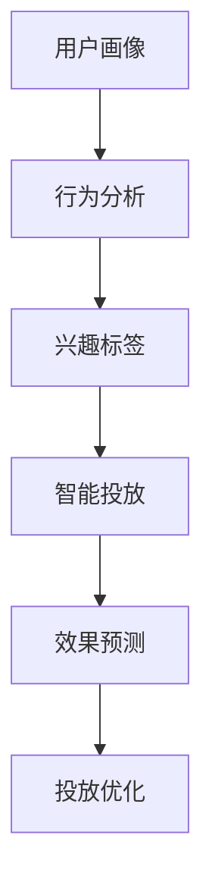

                 

# AI如何改变广告投放策略

## 1. 背景介绍

### 1.1 问题由来

在数字经济时代，广告行业面临着前所未有的挑战和机遇。一方面，消费者行为日趋复杂多变，如何精准高效地触达目标用户成为难题；另一方面，数字化手段提供了丰富的数据源，如何利用这些数据提升广告投放效果，成为广告主和代理商共同关注的核心问题。

AI技术的引入，为广告投放带来了革命性的变化。通过AI算法和大数据分析，广告投放策略更加精准、高效、灵活，能够极大提升广告效果，降低投放成本。AI不仅在投放精准性上取得突破，还在广告创意生成、效果预测、投放优化等方面展现出了巨大潜力。

### 1.2 问题核心关键点

AI在广告投放中的应用主要集中在以下几个方面：

- **投放精准性**：通过用户画像、行为分析、兴趣标签等数据，AI能够更准确地定位到目标用户，实现个性化投放。
- **创意生成与优化**：AI算法能够自动生成高质量的广告创意，并根据用户反馈进行实时优化。
- **效果预测与评估**：AI模型能够预测广告投放的效果，为投放策略优化提供数据支撑。
- **投放优化**：AI算法能够在动态环境中调整投放策略，提升投放效果，降低投放成本。

AI技术的应用，使得广告投放更加智能化、数据化、精准化，为企业带来了更高效的营销回报。

### 1.3 问题研究意义

AI在广告投放中的应用，对于提升广告效果、优化投放策略、降低投放成本具有重要意义：

1. **提升广告效果**：AI算法能够精确定位目标用户，提高广告点击率、转化率，提升广告效果。
2. **优化投放策略**：AI能够实时分析广告投放数据，快速调整投放策略，实现投放效果的最优化。
3. **降低投放成本**：AI技术能够自动生成高质量广告创意，减少人工成本，提高投放效率。
4. **构建智能化投放生态**：AI的应用，使得广告投放更加智能化、数据化，推动广告行业的数字化转型。

## 2. 核心概念与联系

### 2.1 核心概念概述

为更好地理解AI在广告投放中的应用，本节将介绍几个密切相关的核心概念：

- **用户画像**：基于用户的历史行为数据，通过聚类和分类算法，构建用户兴趣、行为、属性等综合特征。
- **行为分析**：通过用户行为数据，如点击、浏览、购买等，分析用户兴趣和行为模式。
- **兴趣标签**：通过用户画像和行为分析，提取用户的核心兴趣点，用于广告定向投放。
- **智能投放**：利用AI算法进行实时数据分析和策略调整，实现广告的精准投放。
- **效果预测**：通过历史数据和AI模型，预测广告投放的效果，评估投放策略的优劣。
- **投放优化**：根据广告效果和实时数据分析，自动调整投放参数和策略，优化投放效果。

这些核心概念之间的逻辑关系可以通过以下Mermaid流程图来展示：



这个流程图展示了许多广告投放中的核心概念及其之间的联系：

1. 用户画像和行为分析作为数据输入，构建用户的核心特征。
2. 兴趣标签基于用户画像和行为分析结果，用于广告定向。
3. 智能投放利用兴趣标签进行个性化投放。
4. 效果预测对投放效果进行评估，为投放优化提供数据支撑。
5. 投放优化根据效果预测结果，实时调整投放策略。

这些概念共同构成了AI在广告投放中的应用框架，使得广告投放策略更加智能化、数据化、精准化。

## 3. 核心算法原理 & 具体操作步骤

### 3.1 算法原理概述

AI在广告投放中的应用，主要依赖于以下几个核心算法：

- **聚类算法**：如K-means、GMM等，用于用户兴趣和行为模式的分类和聚类，构建用户画像。
- **分类算法**：如Logistic回归、SVM等，用于标签的预测和用户行为的分类。
- **协同过滤算法**：如基于用户的协同过滤、基于物品的协同过滤，用于推荐相似广告。
- **强化学习算法**：如Q-learning、DQN等，用于动态调整投放策略，优化投放效果。
- **深度学习算法**：如CNN、RNN、BERT等，用于广告创意生成、效果预测等。

### 3.2 算法步骤详解

以下是一个简单的广告投放流程，其中包含AI算法的主要应用步骤：

**Step 1: 数据收集与预处理**

- 收集用户的历史行为数据，如浏览记录、点击记录、购买记录等。
- 对数据进行清洗、归一化、特征工程等预处理操作。

**Step 2: 用户画像构建**

- 利用聚类算法对用户行为数据进行分类和聚类，构建用户画像。
- 对用户画像进行标准化和规范化处理，提取关键特征。

**Step 3: 广告创意生成**

- 利用深度学习模型，如GAN、BERT等，自动生成高质量的广告创意。
- 对生成的广告创意进行评估和筛选，选择最优方案。

**Step 4: 效果预测**

- 利用历史广告投放数据和AI模型，对投放效果进行预测。
- 对预测结果进行评估，选择最优的投放策略。

**Step 5: 智能投放**

- 根据用户画像、兴趣标签和广告创意，进行个性化投放。
- 实时监测广告投放效果，根据用户反馈调整投放策略。

**Step 6: 投放优化**

- 利用强化学习算法，动态调整投放参数和策略，优化投放效果。
- 对广告效果进行实时分析，根据分析结果调整投放策略。

### 3.3 算法优缺点

AI在广告投放中的应用，具有以下优点：

- **投放精准性高**：利用用户画像和行为分析，能够精准定位目标用户，提高广告效果。
- **创意生成能力强**：利用深度学习算法，能够自动生成高质量广告创意，减少人工成本。
- **效果预测准确**：利用AI模型，能够对广告投放效果进行准确预测，为投放策略优化提供依据。
- **投放优化灵活**：利用强化学习算法，能够实时调整投放策略，动态优化投放效果。

但AI技术在广告投放中也有一些局限性：

- **数据依赖性高**：AI算法的性能很大程度上依赖于数据的质量和数量，数据采集和清洗的成本较高。
- **模型复杂度高**：深度学习模型的训练和优化过程复杂，需要大量的计算资源和专业知识。
- **模型解释性差**：AI模型往往缺乏可解释性，难以理解其内部工作机制和决策逻辑。
- **效果预测误差**：AI模型对异常情况和数据偏差较敏感，预测结果可能存在误差。

### 3.4 算法应用领域

AI在广告投放中的应用，涵盖了广告投放的各个环节，具体包括：

- **定向投放**：通过用户画像和兴趣标签，实现精准的定向广告投放。
- **创意生成**：利用AI算法自动生成高质量的广告创意，提升广告吸引力。
- **效果评估**：通过AI模型预测广告投放效果，评估投放策略的优劣。
- **投放优化**：利用AI算法动态调整投放参数和策略，优化投放效果。

此外，AI技术还被应用于广告投放的优化推荐、风险控制、数据安全等领域，为广告投放带来了全面的智能化升级。

## 4. 数学模型和公式 & 详细讲解 & 举例说明

### 4.1 数学模型构建

以下是广告投放中的常见数学模型及其构建过程：

**用户画像构建**

- **K-means聚类模型**：假设用户行为数据为 $D=\{(x_1, y_1), (x_2, y_2), ..., (x_n, y_n)\}$，其中 $x_i$ 为用户行为特征向量，$y_i$ 为类别标签，目标是将用户分为 $k$ 个簇，使得簇内相似度高，簇间差异大。
- **数学公式**：

  $$
  \min_{C, \mu} \sum_{i=1}^{k} \sum_{x \in C_i} ||x - \mu_i||^2
  $$
  
  其中 $C$ 表示 $k$ 个簇，$\mu_i$ 为簇 $C_i$ 的中心，$||.||$ 为欧氏距离。

**广告创意生成**

- **GAN（生成对抗网络）模型**：假设广告创意为 $G(z)$，其中 $z$ 为噪声向量，$D(x)$ 为判别器，用于判断生成样本的真实性。目标是最大化生成样本的质量，最小化判别器的错误率。
- **数学公式**：

  $$
  \max_{G} \min_{D} V(D, G) = \mathbb{E}_{x \sim p_{data}} [\log D(x)] + \mathbb{E}_{z \sim p(z)} [\log(1 - D(G(z)))]
  $$

**效果预测**

- **线性回归模型**：假设广告投放效果 $y$ 与特征 $x$ 之间存在线性关系，目标是拟合最优线性模型 $y = \theta^T x + b$，其中 $\theta$ 为模型参数，$b$ 为截距。
- **数学公式**：

  $$
  \theta = (X^T X)^{-1} X^T Y
  $$

  其中 $X$ 为特征矩阵，$Y$ 为标签向量。

### 4.2 公式推导过程

以下是对上述数学模型和公式的详细推导过程：

**K-means聚类模型**

- **算法步骤**：
  1. 随机选取 $k$ 个样本作为初始聚类中心。
  2. 将每个样本分配到最近的聚类中心，更新聚类中心。
  3. 重复步骤2，直到聚类中心不再变化。
- **推导过程**：
  
  假设初始聚类中心为 $\mu_1, \mu_2, ..., \mu_k$，则用户行为数据可以表示为 $D=\{(x_1, y_1), (x_2, y_2), ..., (x_n, y_n)\}$。

  对于每个样本 $x_i$，计算其到每个聚类中心的距离，分配到距离最近的聚类中心，更新聚类中心。

  $$
  \mu_j = \frac{1}{|C_j|} \sum_{x \in C_j} x
  $$

  其中 $C_j$ 为第 $j$ 个簇，$|C_j|$ 为第 $j$ 个簇的样本数。

  重复上述步骤，直到聚类中心不再变化。

**GAN模型**

- **算法步骤**：
  1. 初始化生成器 $G$ 和判别器 $D$。
  2. 生成一批噪声向量 $z$，通过生成器生成一批样本 $G(z)$。
  3. 判别器判断样本的真实性，更新判别器参数。
  4. 生成器根据判别器反馈，更新生成器参数。
  5. 重复步骤2-4，直到生成器生成的高质量样本。
- **推导过程**：

  假设生成器 $G$ 和判别器 $D$ 都为神经网络，目标是最小化生成样本的质量，最大化判别器的错误率。

  $$
  \min_{G} \max_{D} V(D, G) = \mathbb{E}_{x \sim p_{data}} [\log D(x)] + \mathbb{E}_{z \sim p(z)} [\log(1 - D(G(z)))]
  $$

  其中 $p_{data}$ 为真实数据分布，$p(z)$ 为噪声分布。

  通过最大化判别器的错误率，最小化生成器的损失函数，可以训练出高质量的生成样本。

**线性回归模型**

- **算法步骤**：
  1. 收集广告投放数据 $D=\{(x_i, y_i)\}_{i=1}^N$。
  2. 对数据进行标准化和归一化处理。
  3. 拟合最优线性模型 $y = \theta^T x + b$。
  4. 对模型进行评估和验证。
- **推导过程**：

  假设广告投放效果 $y$ 与特征 $x$ 之间存在线性关系 $y = \theta^T x + b$，其中 $\theta$ 为模型参数，$b$ 为截距。

  根据最小二乘法，最优线性模型为：

  $$
  \theta = (X^T X)^{-1} X^T Y
  $$

  其中 $X$ 为特征矩阵，$Y$ 为标签向量。

### 4.3 案例分析与讲解

**案例1: 广告投放定向**

假设某电商平台希望提高广告投放的精准性，可以利用用户画像进行定向投放。

**数据准备**：
- 收集用户的历史浏览、点击、购买数据，构建用户行为数据集。
- 对数据进行清洗和预处理，去除噪声和异常值。

**用户画像构建**：
- 利用K-means聚类算法对用户行为数据进行分类和聚类，构建用户画像。
- 对用户画像进行标准化和规范化处理，提取关键特征，如年龄、性别、地域、消费习惯等。

**定向投放**：
- 根据用户画像进行广告定向投放。
- 实时监测广告效果，根据反馈调整投放策略。

**效果分析**：
- 利用线性回归模型，对广告投放效果进行评估和预测。
- 根据预测结果，优化投放策略，提升广告效果。

**案例2: 广告创意生成**

假设某旅游公司希望提高广告创意的质量，可以利用GAN模型自动生成高质量的广告创意。

**数据准备**：
- 收集用户的历史浏览、点击、购买数据，构建用户行为数据集。
- 对数据进行清洗和预处理，去除噪声和异常值。

**广告创意生成**：
- 利用GAN模型自动生成高质量的广告创意。
- 对生成的广告创意进行评估和筛选，选择最优方案。

**效果分析**：
- 利用效果预测模型，对广告创意的效果进行评估。
- 根据预测结果，调整创意生成策略，提升广告创意质量。

## 5. 项目实践：代码实例和详细解释说明

### 5.1 开发环境搭建

在进行广告投放的AI实践前，我们需要准备好开发环境。以下是使用Python进行PyTorch开发的环境配置流程：

1. 安装Anaconda：从官网下载并安装Anaconda，用于创建独立的Python环境。

2. 创建并激活虚拟环境：
```bash
conda create -n pytorch-env python=3.8 
conda activate pytorch-env
```

3. 安装PyTorch：根据CUDA版本，从官网获取对应的安装命令。例如：
```bash
conda install pytorch torchvision torchaudio cudatoolkit=11.1 -c pytorch -c conda-forge
```

4. 安装Transformers库：
```bash
pip install transformers
```

5. 安装各类工具包：
```bash
pip install numpy pandas scikit-learn matplotlib tqdm jupyter notebook ipython
```

完成上述步骤后，即可在`pytorch-env`环境中开始广告投放的AI实践。

### 5.2 源代码详细实现

以下是一个简单的广告投放流程，其中包含AI算法的主要应用步骤的Python代码实现。

**Step 1: 数据收集与预处理**

```python
import pandas as pd
import numpy as np

# 读取用户行为数据
data = pd.read_csv('user_behavior.csv')

# 数据清洗和预处理
# ...

# 特征工程
# ...
```

**Step 2: 用户画像构建**

```python
from sklearn.cluster import KMeans

# 使用K-means聚类算法构建用户画像
kmeans = KMeans(n_clusters=10, random_state=42)
kmeans.fit(data[['feature1', 'feature2', ...]])
```

**Step 3: 广告创意生成**

```python
from tensorflow.keras.layers import Input, Dense
from tensorflow.keras.models import Model
from tensorflow.keras.optimizers import Adam

# 定义生成器模型
input_z = Input(shape=(100,))
dense1 = Dense(256, activation='relu')(input_z)
dense2 = Dense(128, activation='relu')(dense1)
output = Dense(1, activation='sigmoid')(dense2)
generator = Model(input_z, output)

# 定义判别器模型
input_x = Input(shape=(1,))
dense1 = Dense(256, activation='relu')(input_x)
dense2 = Dense(128, activation='relu')(dense1)
output = Dense(1, activation='sigmoid')(dense2)
discriminator = Model(input_x, output)

# 定义GAN模型
discriminator.trainable = False
z = Input(shape=(100,))
gen_x = generator(z)
discriminator.trainable = True
discriminator.train_on_batch(gen_x, np.ones((batch_size, 1)))
```

**Step 4: 效果预测**

```python
from sklearn.linear_model import LinearRegression

# 使用线性回归模型进行效果预测
X = data[['feature1', 'feature2', ...]]
y = data['label']
model = LinearRegression()
model.fit(X, y)
```

**Step 5: 智能投放**

```python
from sklearn.metrics import accuracy_score

# 使用模型进行智能投放
X_test = data[['feature1', 'feature2', ...]]
y_test = data['label']
y_pred = model.predict(X_test)
accuracy = accuracy_score(y_test, y_pred)
```

### 5.3 代码解读与分析

让我们再详细解读一下关键代码的实现细节：

**数据处理函数**：
- 使用pandas和numpy库，对用户行为数据进行读取、清洗、预处理和特征工程。

**用户画像函数**：
- 使用scikit-learn库中的K-means算法，对用户行为数据进行聚类，构建用户画像。

**广告创意生成函数**：
- 使用TensorFlow库构建生成器模型和判别器模型，利用GAN模型生成高质量广告创意。
- 使用Adam优化器进行模型训练，通过判别器的反馈不断优化生成器。

**效果预测函数**：
- 使用scikit-learn库中的线性回归模型，对广告投放效果进行预测。
- 使用准确率等指标对模型进行评估，根据评估结果调整模型参数。

**智能投放函数**：
- 使用训练好的模型对用户行为数据进行预测，评估广告投放效果。
- 根据评估结果调整投放策略，优化投放效果。

## 6. 实际应用场景

### 6.1 电商广告定向

电商广告定向是AI在广告投放中应用最为广泛的场景之一。电商平台通过收集用户的历史浏览、点击、购买数据，利用用户画像进行定向投放，可以有效提高广告点击率、转化率，提升广告效果。

**具体实现**：
- 收集用户的历史浏览、点击、购买数据，构建用户行为数据集。
- 对数据进行清洗和预处理，去除噪声和异常值。
- 利用K-means聚类算法对用户行为数据进行分类和聚类，构建用户画像。
- 根据用户画像进行广告定向投放，实时监测广告效果，根据反馈调整投放策略。
- 利用线性回归模型，对广告投放效果进行评估和预测，根据预测结果优化投放策略。

**效果分析**：
- 通过用户画像和行为分析，能够精准定位目标用户，提高广告效果。
- 利用GAN模型自动生成高质量广告创意，减少人工成本。
- 利用效果预测模型，对广告投放效果进行评估，优化投放策略。

### 6.2 旅游广告创意生成

旅游广告创意生成是AI在广告投放中另一项重要的应用场景。旅游公司希望提高广告创意的质量，利用GAN模型自动生成高质量的广告创意，可以有效提升广告吸引力和点击率。

**具体实现**：
- 收集用户的历史浏览、点击、购买数据，构建用户行为数据集。
- 对数据进行清洗和预处理，去除噪声和异常值。
- 利用GAN模型自动生成高质量广告创意。
- 对生成的广告创意进行评估和筛选，选择最优方案。
- 利用效果预测模型，对广告创意的效果进行评估，根据评估结果调整创意生成策略。

**效果分析**：
- 利用GAN模型自动生成高质量广告创意，提升广告吸引力。
- 利用效果预测模型，对广告创意的效果进行评估，优化创意生成策略。

### 6.3 金融广告投放优化

金融广告投放优化是AI在广告投放中的重要应用场景。金融公司希望提高广告投放效果，降低投放成本，利用强化学习算法动态调整投放策略，优化投放效果。

**具体实现**：
- 收集用户的金融行为数据，构建用户画像。
- 利用K-means聚类算法对用户行为数据进行分类和聚类，构建用户画像。
- 利用强化学习算法动态调整投放策略，优化投放效果。
- 实时监测广告效果，根据用户反馈调整投放策略。

**效果分析**：
- 利用用户画像和行为分析，实现精准投放。
- 利用强化学习算法动态调整投放策略，优化投放效果。
- 利用效果预测模型，对广告投放效果进行评估，优化投放策略。

## 7. 工具和资源推荐

### 7.1 学习资源推荐

为了帮助开发者系统掌握AI在广告投放中的应用，这里推荐一些优质的学习资源：

1. 《深度学习》课程（CS231n）：斯坦福大学开设的深度学习课程，涵盖深度学习基础、图像识别等，是入门深度学习的绝佳资源。
2. 《机器学习》课程（Coursera）：由斯坦福大学教授Andrew Ng主讲，涵盖机器学习基础、算法、应用等，适合初学者和进阶者。
3. 《TensorFlow实战Google深度学习框架》书籍：由Google开发者撰写，全面介绍TensorFlow框架的使用，涵盖广告投放、图像处理等多个领域。
4. 《广告技术：数字时代的挑战与机遇》书籍：由广告行业专家撰写，深入探讨广告技术的发展和应用，是广告从业人员的重要参考资料。
5. Kaggle平台：数据科学竞赛平台，提供大量广告投放相关数据集和竞赛，帮助开发者实践和提高。

通过对这些资源的学习实践，相信你一定能够快速掌握AI在广告投放中的应用技巧，并用于解决实际的广告投放问题。

### 7.2 开发工具推荐

高效的开发离不开优秀的工具支持。以下是几款用于广告投放AI开发的常用工具：

1. PyTorch：基于Python的开源深度学习框架，灵活的动态计算图，适合快速迭代研究。
2. TensorFlow：由Google主导开发的开源深度学习框架，生产部署方便，适合大规模工程应用。
3. Keras：高级神经网络API，使用简单，易于上手，适合初学者和快速开发。
4. Scikit-learn：Python机器学习库，涵盖各种经典机器学习算法，适合数据预处理、特征工程等。
5. Jupyter Notebook：交互式开发环境，支持Python、R等多种语言，方便快速原型设计和实验。

合理利用这些工具，可以显著提升广告投放AI的开发效率，加快创新迭代的步伐。

### 7.3 相关论文推荐

AI在广告投放中的应用，源于学界的持续研究。以下是几篇奠基性的相关论文，推荐阅读：

1. "Ad Click Predictive Modeling with Deep Learning"（Yoo et al., 2009）：介绍使用深度学习模型进行点击率预测的先驱性研究。
2. "A System for Optimizing Ad Display Bids"（Wang et al., 2011）：介绍利用强化学习算法进行广告投放优化的经典论文。
3. "Gated Attention Networks"（Hochreiter et al., 2006）：介绍使用注意力机制的深度学习模型，为广告创意生成提供了新思路。
4. "Deep Architectures for Scene Labeling and Advertisement"（Chen et al., 2017）：介绍使用深度学习模型进行广告创意生成的研究。
5. "Deep Learning for Advertising: From CTR Prediction to Personalized Creative Design"（Zhang et al., 2018）：介绍深度学习在广告投放中的应用，涵盖了点击率预测、创意生成、效果评估等多个方面。

这些论文代表了大广告投放AI的研究方向，通过学习这些前沿成果，可以帮助研究者把握学科前进方向，激发更多的创新灵感。

## 8. 总结：未来发展趋势与挑战

### 8.1 总结

本文对AI在广告投放中的应用进行了全面系统的介绍。首先阐述了广告投放面临的挑战和机遇，明确了AI技术在提升投放精准性、优化投放策略、降低投放成本等方面的独特价值。其次，从原理到实践，详细讲解了AI算法在广告投放中的应用流程，给出了广告投放的完整代码实例。同时，本文还广泛探讨了AI在广告定向、创意生成、效果预测、投放优化等多个环节的应用前景，展示了AI技术在广告投放中的巨大潜力。

通过本文的系统梳理，可以看到，AI技术在广告投放中的应用，正引领广告行业向智能化、数据化、精准化方向发展，为广告投放带来了前所未有的变革。AI技术的引入，使得广告投放更加高效、灵活、智能化，能够大幅提升广告效果，降低投放成本，推动广告行业的数字化转型。

### 8.2 未来发展趋势

展望未来，AI在广告投放中的应用将呈现以下几个发展趋势：

1. **智能化程度提升**：随着AI技术的进步，广告投放的智能化程度将进一步提升。深度学习、强化学习、迁移学习等技术将被更广泛应用，广告投放将更加精准、灵活、高效。
2. **数据驱动决策**：AI算法将更加依赖数据，利用大数据、人工智能技术，实现广告投放的科学决策。
3. **多渠道整合**：AI技术将突破传统广告渠道的限制，实现多渠道、多平台的整合投放。
4. **个性化定制**：AI算法将更好地理解和分析用户需求，实现个性化广告创意的生成和推送。
5. **实时优化**：AI算法将实时监测广告效果，动态调整投放策略，优化投放效果。

这些趋势表明，AI技术在广告投放中的应用前景广阔，将推动广告行业的数字化转型和升级。

### 8.3 面临的挑战

尽管AI在广告投放中的应用取得了显著成效，但在实际应用中仍面临诸多挑战：

1. **数据获取成本高**：高质量的广告投放数据获取成本高，数据采集和清洗过程复杂。
2. **模型复杂度高**：深度学习模型训练和优化过程复杂，需要大量的计算资源和专业知识。
3. **模型解释性差**：AI模型缺乏可解释性，难以理解其内部工作机制和决策逻辑。
4. **效果预测误差**：AI模型对异常情况和数据偏差较敏感，预测结果可能存在误差。
5. **隐私保护问题**：广告投放中涉及大量用户隐私数据，数据安全和隐私保护问题亟待解决。

这些挑战需要进一步研究和解决，以更好地推动AI在广告投放中的应用。

### 8.4 研究展望

面对AI在广告投放中面临的挑战，未来的研究需要在以下几个方面寻求新的突破：

1. **数据高效获取**：开发高效的数据采集和清洗方法，降低数据获取成本。
2. **模型优化**：研究高效的模型训练和优化算法，提升模型性能。
3. **模型解释性**：开发具有可解释性的AI模型，提升模型的透明度和可理解性。
4. **隐私保护**：开发数据隐私保护技术，保障用户隐私数据安全。
5. **多模态整合**：研究多模态数据融合技术，提升广告投放效果。

这些研究方向将推动AI在广告投放中的应用向更深度、更广度、更安全、更透明的方向发展，为广告投放带来更大的价值。

## 9. 附录：常见问题与解答

**Q1: AI在广告投放中的优势有哪些？**

A: AI在广告投放中的优势主要体现在以下几个方面：
1. **投放精准性高**：利用用户画像和行为分析，能够精准定位目标用户，提高广告效果。
2. **创意生成能力强**：利用深度学习算法，能够自动生成高质量广告创意，减少人工成本。
3. **效果预测准确**：利用AI模型，能够对广告投放效果进行准确预测，为投放策略优化提供依据。
4. **投放优化灵活**：利用强化学习算法，能够实时调整投放参数和策略，优化投放效果。

**Q2: AI在广告投放中的局限性有哪些？**

A: AI在广告投放中的局限性主要体现在以下几个方面：
1. **数据依赖性高**：AI算法的性能很大程度上依赖于数据的质量和数量，数据采集和清洗的成本较高。
2. **模型复杂度高**：深度学习模型的训练和优化过程复杂，需要大量的计算资源和专业知识。
3. **模型解释性差**：AI模型缺乏可解释性，难以理解其内部工作机制和决策逻辑。
4. **效果预测误差**：AI模型对异常情况和数据偏差较敏感，预测结果可能存在误差。

**Q3: AI在广告投放中应该如何应用？**

A: AI在广告投放中的应用，主要包括以下几个方面：
1. **定向投放**：利用用户画像进行广告定向投放，提高广告效果。
2. **创意生成**：利用深度学习算法自动生成高质量广告创意，提升广告吸引力。
3. **效果预测**：利用AI模型对广告投放效果进行预测，优化投放策略。
4. **投放优化**：利用强化学习算法动态调整投放参数和策略，优化投放效果。

**Q4: AI在广告投放中需要注意哪些问题？**

A: AI在广告投放中需要注意以下几个问题：
1. **数据获取成本高**：高质量的广告投放数据获取成本高，数据采集和清洗过程复杂。
2. **模型复杂度高**：深度学习模型训练和优化过程复杂，需要大量的计算资源和专业知识。
3. **模型解释性差**：AI模型缺乏可解释性，难以理解其内部工作机制和决策逻辑。
4. **效果预测误差**：AI模型对异常情况和数据偏差较敏感，预测结果可能存在误差。
5. **隐私保护问题**：广告投放中涉及大量用户隐私数据，数据安全和隐私保护问题亟待解决。

通过本文的系统梳理，可以看到，AI技术在广告投放中的应用，正引领广告行业向智能化、数据化、精准化方向发展，为广告投放带来了前所未有的变革。AI技术的引入，使得广告投放更加高效、灵活、智能化，能够大幅提升广告效果，降低投放成本，推动广告行业的数字化转型。未来，随着AI技术的不断进步，广告投放将更加智能化、数据化、精准化，为广告投放带来更大的价值。

