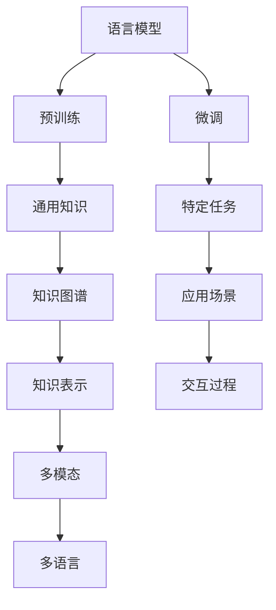

                 

# AI如何改变我们提问和思考的方式

> 关键词：人工智能,深度学习,自然语言处理,NLP,语言模型,预训练,微调,Fine-tuning,知识图谱,知识表示,多模态,多语言,自监督学习

## 1. 背景介绍

### 1.1 问题由来

近年来，随着人工智能(AI)技术的迅猛发展，尤其是在自然语言处理(Natural Language Processing, NLP)领域，语言模型已经成为了一种强大的工具，改变了我们提问和思考的方式。语言模型能够理解自然语言文本，并根据上下文生成相关的回答或建议，极大地提高了信息检索和智能交互的效率。

语言模型是人工智能领域的重大突破，能够处理自然语言输入，理解语言的语法、语义和上下文，甚至在一定程度上具备常识推理能力。这些能力使得语言模型在搜索、问答、翻译、内容生成等领域发挥了巨大作用，改变了人类的信息获取方式和思维习惯。

### 1.2 问题核心关键点

语言模型通过预训练和微调技术，利用大规模无标签文本数据学习语言知识，然后在特定任务上进行微调，以获得更好的性能。这种技术不仅提高了模型的表现，也使得NLP技术更加普及和易于应用。

核心问题包括：
1. 如何选择合适的预训练模型和微调任务？
2. 如何设计有效的任务适配层和损失函数？
3. 如何避免过拟合和提高模型的泛化能力？
4. 如何在多语言和多模态场景下进行语言模型微调？
5. 如何结合知识图谱和外部知识库进行模型训练和推理？

这些关键问题围绕语言模型的预训练和微调，探讨了如何利用AI技术改变我们提问和思考的方式。

## 2. 核心概念与联系

### 2.1 核心概念概述

要理解语言模型如何改变我们的提问和思考方式，首先需要了解一些核心概念：

- **语言模型(Language Model)**：能够理解自然语言文本并生成相关输出的模型，如GPT-3、BERT等。
- **预训练(Pre-training)**：在大规模无标签文本数据上进行的自监督学习过程，使模型学习语言的通用表示。
- **微调(Fine-tuning)**：在预训练模型的基础上，使用下游任务的少量标注数据进行有监督优化，以适应特定任务。
- **知识图谱(Knowledge Graph)**：通过节点和边结构化的知识表示方法，用于捕捉实体、关系和属性的语义网络。
- **知识表示(Knowledge Representation)**：将知识以结构化的形式进行编码和表示，便于机器理解和推理。
- **多模态(Multimodal)**：结合文本、图像、音频等多种信息源，提高语言模型的理解和生成能力。
- **多语言(Multilingual)**：支持多种语言的模型，能够处理不同语言的数据，提升跨语言交互的效率。
- **自监督学习(Self-supervised Learning)**：通过设计无标签的预训练任务，使模型自动学习语言规律。

这些概念通过以下Mermaid流程图进行连接：



这个流程图展示了语言模型从预训练到微调的过程，以及如何结合知识图谱、知识表示、多模态和多语言等技术，在特定的应用场景中进行交互和推理。

## 3. 核心算法原理 & 具体操作步骤

### 3.1 算法原理概述

语言模型的核心算法基于深度学习中的Transformer架构，通过预训练和微调技术，学习语言的表征。预训练阶段在大规模无标签文本数据上学习语言的通用表示，微调阶段在特定任务的数据集上优化模型，以获得更好的性能。

算法原理主要包括以下几个步骤：
1. 数据准备：收集并预处理大规模无标签文本数据，作为预训练任务的数据集。
2. 预训练：在预训练任务上训练模型，学习语言的通用表示。
3. 微调：在特定任务的数据集上微调模型，学习任务的特定知识。
4. 推理：利用微调后的模型对新输入进行推理，生成相关的回答或建议。

### 3.2 算法步骤详解

以下是详细的算法步骤：

1. **数据准备**
   - 收集大规模无标签文本数据，如维基百科、新闻网站、社交媒体等。
   - 对数据进行预处理，如分词、去除停用词、标准化等。
   - 使用合适的预处理工具，如NLTK、SpaCy、Hugging Face等。

2. **预训练**
   - 选择合适的预训练任务，如掩码语言模型(MLM)、下一句预测(Next Sentence Prediction)等。
   - 使用深度学习框架，如PyTorch、TensorFlow等，训练语言模型。
   - 设置合适的超参数，如学习率、批大小、训练轮数等。
   - 使用自监督学习，无需标注数据，自动学习语言规律。

3. **微调**
   - 收集特定任务的数据集，如问答、翻译、摘要等。
   - 对数据集进行标注，生成监督信号。
   - 使用微调框架，如Hugging Face、Transformers等，训练模型。
   - 设置微调的超参数，如学习率、批大小、迭代次数等。
   - 使用损失函数，如交叉熵、均方误差等，评估模型性能。

4. **推理**
   - 使用微调后的模型对新输入进行推理。
   - 生成相关的回答或建议，供用户参考。
   - 对生成的结果进行后处理，如格式化、纠错等。

### 3.3 算法优缺点

语言模型微调技术的优点包括：
1. 简单高效：仅需要少量标注数据，即可实现高性能。
2. 通用性：适用于各种NLP任务，如问答、翻译、摘要等。
3. 泛化能力强：在大规模预训练数据上学习通用表示，适应性广。
4. 可解释性好：输出结果易于理解和调试。

缺点包括：
1. 依赖标注数据：微调性能受标注数据质量的影响。
2. 过拟合风险：微调模型容易出现过拟合。
3. 计算资源要求高：预训练和微调过程需要大量计算资源。
4. 可解释性不足：模型内部机制复杂，难以理解。

### 3.4 算法应用领域

语言模型微调技术在以下领域得到了广泛应用：

- **问答系统**：如智能客服、在线问答平台等，提供快速准确的答案。
- **翻译系统**：如Google翻译、DeepL等，支持多种语言的自动翻译。
- **摘要系统**：如新闻摘要、学术论文摘要等，自动生成简洁的摘要。
- **文本生成**：如自动文本生成、创意写作等，生成有创意的内容。
- **情感分析**：如社交媒体情感分析、产品评价分析等，评估文本情感倾向。
- **信息检索**：如搜索引擎、信息推荐等，快速找到相关信息。

## 4. 数学模型和公式 & 详细讲解 & 举例说明

### 4.1 数学模型构建

语言模型可以通过序列建模的方式来构建，形式化表示为：

$$
p(x_1, x_2, ..., x_n) = \prod_{i=1}^{n} p(x_i | x_1, ..., x_{i-1})
$$

其中，$p(x_i | x_1, ..., x_{i-1})$ 表示在给定上下文的情况下，生成第 $i$ 个词的概率。

### 4.2 公式推导过程

语言模型的训练通常采用最大似然估计法，即最大化下式：

$$
\max_{\theta} \sum_{i=1}^{N} \log p(x_i)
$$

其中，$N$ 为训练样本的数量，$x_i$ 为训练样本中的词序列。

通过反向传播算法，可以计算出模型参数 $\theta$ 的梯度，更新模型参数：

$$
\theta \leftarrow \theta - \eta \nabla_{\theta} \log p(x)
$$

其中，$\eta$ 为学习率，$\nabla_{\theta} \log p(x)$ 为对数概率的梯度。

### 4.3 案例分析与讲解

以BERT模型为例，其预训练过程主要通过掩码语言模型和下一句预测两个任务进行。掩码语言模型随机遮挡部分输入，让模型预测被遮挡的词汇，学习语言的规律。下一句预测任务让模型判断两个句子是否连续，学习语言的语义关系。

微调过程则是在特定任务上重新训练模型，如问答、翻译等。以问答任务为例，微调过程的目标是最大化以下对数似然：

$$
\max_{\theta} \sum_{i=1}^{N} \log p(y_i | x_i)
$$

其中，$y_i$ 为问题，$x_i$ 为上下文，$N$ 为训练样本的数量。

微调的损失函数通常为交叉熵损失，如：

$$
L = -\frac{1}{N} \sum_{i=1}^{N} \sum_{j=1}^{k} y_{ij} \log p(y_{ij} | x_i)
$$

其中，$k$ 为答案的数量，$y_{ij}$ 为答案的第 $i$ 个问题的第 $j$ 个标签。

## 5. 项目实践：代码实例和详细解释说明

### 5.1 开发环境搭建

要搭建语言模型微调的开发环境，需要安装Python、深度学习框架PyTorch和预训练模型库Hugging Face。

1. 安装Anaconda：
```bash
conda create -n pytorch-env python=3.8
conda activate pytorch-env
```

2. 安装PyTorch和Hugging Face：
```bash
conda install pytorch torchvision torchaudio cudatoolkit=11.1 -c pytorch -c conda-forge
pip install transformers
```

3. 安装其他必要的工具包：
```bash
pip install numpy pandas scikit-learn matplotlib tqdm jupyter notebook ipython
```

### 5.2 源代码详细实现

以下是一个使用Hugging Face的BERT模型进行问答系统微调的示例代码：

```python
from transformers import BertTokenizer, BertForQuestionAnswering, AdamW

tokenizer = BertTokenizer.from_pretrained('bert-base-cased')
model = BertForQuestionAnswering.from_pretrained('bert-base-cased')

# 加载训练数据
train_data = load_train_data()
val_data = load_val_data()
test_data = load_test_data()

# 设置训练参数
device = torch.device('cuda' if torch.cuda.is_available() else 'cpu')
model.to(device)
optimizer = AdamW(model.parameters(), lr=5e-5)
epochs = 2
batch_size = 16

# 训练过程
for epoch in range(epochs):
    for batch in train_loader:
        inputs = tokenizer(batch['input_ids'], padding='max_length', max_length=512, truncation=True, return_tensors='pt').to(device)
        labels = batch['labels'].to(device)
        outputs = model(**inputs, labels=labels)
        loss = outputs.loss
        loss.backward()
        optimizer.step()
        optimizer.zero_grad()

    # 验证过程
    for batch in val_loader:
        inputs = tokenizer(batch['input_ids'], padding='max_length', max_length=512, truncation=True, return_tensors='pt').to(device)
        labels = batch['labels'].to(device)
        outputs = model(**inputs, labels=labels)
        loss = outputs.loss

    # 测试过程
    for batch in test_loader:
        inputs = tokenizer(batch['input_ids'], padding='max_length', max_length=512, truncation=True, return_tensors='pt').to(device)
        outputs = model(**inputs, labels=labels)
        loss = outputs.loss
```

### 5.3 代码解读与分析

这段代码的核心步骤如下：
1. 使用Hugging Face的BERT tokenizer对输入文本进行分词和编码。
2. 加载训练、验证和测试数据集。
3. 设置训练参数，包括模型、优化器、学习率、批次大小和迭代轮数。
4. 使用AdamW优化器进行反向传播和参数更新。
5. 在验证集上评估模型性能，防止过拟合。
6. 在测试集上最终评估模型性能，提供微调后的答案。

### 5.4 运行结果展示

训练后，可以在测试集上评估微调模型的准确率，计算F1分数等指标：

```python
from sklearn.metrics import f1_score

# 加载测试数据
test_data = load_test_data()

# 评估模型性能
test_loss, preds, labels = evaluate(model, test_data)
f1 = f1_score(labels, preds, average='macro')
print(f'F1 score on test data: {f1:.2f}')
```

## 6. 实际应用场景

### 6.1 智能客服系统

智能客服系统是语言模型微调的重要应用场景之一。通过微调模型，可以让智能客服系统自动理解和回答用户的问题，提升客户满意度和服务效率。

例如，可以使用BERT模型进行情感分析，自动识别用户情绪，并提供相应的回答。在微调过程中，可以收集历史客服对话数据，将其标注为情绪类别，训练BERT模型进行情感分类，从而在实时客服中自动识别用户情绪，并给出相应的回答。

### 6.2 金融舆情监测

金融舆情监测需要实时监测市场舆论动向，避免负面信息传播，规避金融风险。通过微调BERT模型，可以实现情感分析和实体识别，快速监测舆情变化。

例如，可以收集金融领域相关的新闻、报道、评论等文本数据，标注情绪和实体，训练BERT模型进行情感分类和实体识别。在实时监测中，系统能够自动识别舆情变化，并在必要时触发预警，帮助金融机构及时应对风险。

### 6.3 个性化推荐系统

个性化推荐系统需要根据用户的兴趣和行为，推荐合适的商品或内容。通过微调BERT模型，可以更好地理解用户的兴趣和行为，提供更加个性化的推荐。

例如，可以收集用户浏览、点击、评论、分享等行为数据，提取和用户交互的物品标题、描述、标签等文本内容，训练BERT模型进行用户兴趣预测。在推荐过程中，模型根据用户历史行为和当前兴趣，生成推荐列表，提供个性化的推荐内容。

### 6.4 未来应用展望

未来，语言模型微调技术将在更多领域得到应用，为传统行业带来变革性影响：

- **智慧医疗**：基于微调的问答系统、病历分析、药物研发等，提升医疗服务的智能化水平，辅助医生诊疗，加速新药开发进程。
- **智能教育**：微调技术可应用于作业批改、学情分析、知识推荐等方面，因材施教，促进教育公平，提高教学质量。
- **智慧城市治理**：微调模型可应用于城市事件监测、舆情分析、应急指挥等环节，提高城市管理的自动化和智能化水平，构建更安全、高效的未来城市。
- **企业生产**：微调技术可以应用于生产线监控、设备维护、质量控制等方面，提升生产效率和产品质量。
- **社会治理**：基于微调的智能助手，可以辅助政府部门进行社会舆情分析、舆情引导等，提高治理效率和效果。

## 7. 工具和资源推荐

### 7.1 学习资源推荐

为了帮助开发者系统掌握语言模型微调的理论基础和实践技巧，这里推荐一些优质的学习资源：

1. 《Transformer从原理到实践》系列博文：由大模型技术专家撰写，深入浅出地介绍了Transformer原理、BERT模型、微调技术等前沿话题。
2. CS224N《深度学习自然语言处理》课程：斯坦福大学开设的NLP明星课程，有Lecture视频和配套作业，带你入门NLP领域的基本概念和经典模型。
3. 《Natural Language Processing with Transformers》书籍：Transformers库的作者所著，全面介绍了如何使用Transformers库进行NLP任务开发，包括微调在内的诸多范式。
4. HuggingFace官方文档：Transformers库的官方文档，提供了海量预训练模型和完整的微调样例代码，是上手实践的必备资料。
5. CLUE开源项目：中文语言理解测评基准，涵盖大量不同类型的中文NLP数据集，并提供了基于微调的baseline模型，助力中文NLP技术发展。

### 7.2 开发工具推荐

高效的开发离不开优秀的工具支持。以下是几款用于语言模型微调开发的常用工具：

1. PyTorch：基于Python的开源深度学习框架，灵活动态的计算图，适合快速迭代研究。大部分预训练语言模型都有PyTorch版本的实现。
2. TensorFlow：由Google主导开发的开源深度学习框架，生产部署方便，适合大规模工程应用。同样有丰富的预训练语言模型资源。
3. Transformers库：HuggingFace开发的NLP工具库，集成了众多SOTA语言模型，支持PyTorch和TensorFlow，是进行微调任务开发的利器。
4. Weights & Biases：模型训练的实验跟踪工具，可以记录和可视化模型训练过程中的各项指标，方便对比和调优。与主流深度学习框架无缝集成。
5. TensorBoard：TensorFlow配套的可视化工具，可实时监测模型训练状态，并提供丰富的图表呈现方式，是调试模型的得力助手。
6. Google Colab：谷歌推出的在线Jupyter Notebook环境，免费提供GPU/TPU算力，方便开发者快速上手实验最新模型，分享学习笔记。

### 7.3 相关论文推荐

语言模型和微调技术的发展源于学界的持续研究。以下是几篇奠基性的相关论文，推荐阅读：

1. Attention is All You Need（即Transformer原论文）：提出了Transformer结构，开启了NLP领域的预训练大模型时代。
2. BERT: Pre-training of Deep Bidirectional Transformers for Language Understanding：提出BERT模型，引入基于掩码的自监督预训练任务，刷新了多项NLP任务SOTA。
3. Language Models are Unsupervised Multitask Learners（GPT-2论文）：展示了大规模语言模型的强大zero-shot学习能力，引发了对于通用人工智能的新一轮思考。
4. Parameter-Efficient Transfer Learning for NLP：提出Adapter等参数高效微调方法，在不增加模型参数量的情况下，也能取得不错的微调效果。
5. Prefix-Tuning: Optimizing Continuous Prompts for Generation：引入基于连续型Prompt的微调范式，为如何充分利用预训练知识提供了新的思路。
6. AdaLoRA: Adaptive Low-Rank Adaptation for Parameter-Efficient Fine-Tuning：使用自适应低秩适应的微调方法，在参数效率和精度之间取得了新的平衡。

## 8. 总结：未来发展趋势与挑战

### 8.1 总结

本文对语言模型微调方法进行了全面系统的介绍。首先阐述了语言模型和微调技术的研究背景和意义，明确了微调在拓展预训练模型应用、提升下游任务性能方面的独特价值。其次，从原理到实践，详细讲解了语言模型的预训练和微调过程，给出了微调任务开发的完整代码实例。同时，本文还广泛探讨了微调方法在智能客服、金融舆情、个性化推荐等多个行业领域的应用前景，展示了微调范式的巨大潜力。此外，本文精选了微调技术的各类学习资源，力求为读者提供全方位的技术指引。

通过本文的系统梳理，可以看到，语言模型微调技术正在成为NLP领域的重要范式，极大地拓展了预训练语言模型的应用边界，催生了更多的落地场景。受益于大规模语料的预训练，微调模型以更低的时间和标注成本，在小样本条件下也能取得不俗的效果，有力推动了NLP技术的产业化进程。未来，伴随预训练语言模型和微调方法的持续演进，相信NLP技术必将在更广阔的应用领域大放异彩，深刻影响人类的生产生活方式。

### 8.2 未来发展趋势

展望未来，语言模型微调技术将呈现以下几个发展趋势：

1. 模型规模持续增大。随着算力成本的下降和数据规模的扩张，预训练语言模型的参数量还将持续增长。超大规模语言模型蕴含的丰富语言知识，有望支撑更加复杂多变的下游任务微调。
2. 微调方法日趋多样。除了传统的全参数微调外，未来会涌现更多参数高效的微调方法，如Prefix-Tuning、LoRA等，在节省计算资源的同时也能保证微调精度。
3. 持续学习成为常态。随着数据分布的不断变化，微调模型也需要持续学习新知识以保持性能。如何在不遗忘原有知识的同时，高效吸收新样本信息，将成为重要的研究课题。
4. 标注样本需求降低。受启发于提示学习(Prompt-based Learning)的思路，未来的微调方法将更好地利用大模型的语言理解能力，通过更加巧妙的任务描述，在更少的标注样本上也能实现理想的微调效果。
5. 多模态微调崛起。当前的微调主要聚焦于纯文本数据，未来会进一步拓展到图像、视频、语音等多模态数据微调。多模态信息的融合，将显著提升语言模型对现实世界的理解和建模能力。
6. 模型通用性增强。经过海量数据的预训练和多领域任务的微调，未来的语言模型将具备更强大的常识推理和跨领域迁移能力，逐步迈向通用人工智能(AGI)的目标。

以上趋势凸显了语言模型微调技术的广阔前景。这些方向的探索发展，必将进一步提升NLP系统的性能和应用范围，为人类认知智能的进化带来深远影响。

### 8.3 面临的挑战

尽管语言模型微调技术已经取得了瞩目成就，但在迈向更加智能化、普适化应用的过程中，它仍面临着诸多挑战：

1. 标注成本瓶颈。虽然微调大大降低了标注数据的需求，但对于长尾应用场景，难以获得充足的高质量标注数据，成为制约微调性能的瓶颈。如何进一步降低微调对标注样本的依赖，将是一大难题。
2. 模型鲁棒性不足。当前微调模型面对域外数据时，泛化性能往往大打折扣。对于测试样本的微小扰动，微调模型的预测也容易发生波动。如何提高微调模型的鲁棒性，避免灾难性遗忘，还需要更多理论和实践的积累。
3. 推理效率有待提高。大规模语言模型虽然精度高，但在实际部署时往往面临推理速度慢、内存占用大等效率问题。如何在保证性能的同时，简化模型结构，提升推理速度，优化资源占用，将是重要的优化方向。
4. 可解释性亟需加强。当前微调模型更像是"黑盒"系统，难以解释其内部工作机制和决策逻辑。对于医疗、金融等高风险应用，算法的可解释性和可审计性尤为重要。如何赋予微调模型更强的可解释性，将是亟待攻克的难题。
5. 安全性有待保障。预训练语言模型难免会学习到有偏见、有害的信息，通过微调传递到下游任务，产生误导性、歧视性的输出，给实际应用带来安全隐患。如何从数据和算法层面消除模型偏见，避免恶意用途，确保输出的安全性，也将是重要的研究课题。
6. 知识整合能力不足。现有的微调模型往往局限于任务内数据，难以灵活吸收和运用更广泛的先验知识。如何让微调过程更好地与外部知识库、规则库等专家知识结合，形成更加全面、准确的信息整合能力，还有很大的想象空间。

正视语言模型微调面临的这些挑战，积极应对并寻求突破，将是大语言模型微调走向成熟的必由之路。相信随着学界和产业界的共同努力，这些挑战终将一一被克服，语言模型微调必将在构建人机协同的智能时代中扮演越来越重要的角色。

### 8.4 未来突破

面对语言模型微调所面临的种种挑战，未来的研究需要在以下几个方面寻求新的突破：

1. 探索无监督和半监督微调方法。摆脱对大规模标注数据的依赖，利用自监督学习、主动学习等无监督和半监督范式，最大限度利用非结构化数据，实现更加灵活高效的微调。
2. 研究参数高效和计算高效的微调范式。开发更加参数高效的微调方法，在固定大部分预训练参数的同时，只更新极少量的任务相关参数。同时优化微调模型的计算图，减少前向传播和反向传播的资源消耗，实现更加轻量级、实时性的部署。
3. 融合因果和对比学习范式。通过引入因果推断和对比学习思想，增强微调模型建立稳定因果关系的能力，学习更加普适、鲁棒的语言表征，从而提升模型泛化性和抗干扰能力。
4. 引入更多先验知识。将符号化的先验知识，如知识图谱、逻辑规则等，与神经网络模型进行巧妙融合，引导微调过程学习更准确、合理的语言模型。同时加强不同模态数据的整合，实现视觉、语音等多模态信息与文本信息的协同建模。
5. 结合因果分析和博弈论工具。将因果分析方法引入微调模型，识别出模型决策的关键特征，增强输出解释的因果性和逻辑性。借助博弈论工具刻画人机交互过程，主动探索并规避模型的脆弱点，提高系统稳定性。
6. 纳入伦理道德约束。在模型训练目标中引入伦理导向的评估指标，过滤和惩罚有偏见、有害的输出倾向。同时加强人工干预和审核，建立模型行为的监管机制，确保输出符合人类价值观和伦理道德。

这些研究方向的探索，必将引领语言模型微调技术迈向更高的台阶，为构建安全、可靠、可解释、可控的智能系统铺平道路。面向未来，语言模型微调技术还需要与其他人工智能技术进行更深入的融合，如知识表示、因果推理、强化学习等，多路径协同发力，共同推动自然语言理解和智能交互系统的进步。只有勇于创新、敢于突破，才能不断拓展语言模型的边界，让智能技术更好地造福人类社会。

## 9. 附录：常见问题与解答

**Q1：大语言模型微调是否适用于所有NLP任务？**

A: 大语言模型微调在大多数NLP任务上都能取得不错的效果，特别是对于数据量较小的任务。但对于一些特定领域的任务，如医学、法律等，仅仅依靠通用语料预训练的模型可能难以很好地适应。此时需要在特定领域语料上进一步预训练，再进行微调，才能获得理想效果。此外，对于一些需要时效性、个性化很强的任务，如对话、推荐等，微调方法也需要针对性的改进优化。

**Q2：微调过程中如何选择合适的学习率？**

A: 微调的学习率一般要比预训练时小1-2个数量级，如果使用过大的学习率，容易破坏预训练权重，导致过拟合。一般建议从1e-5开始调参，逐步减小学习率，直至收敛。也可以使用warmup策略，在开始阶段使用较小的学习率，再逐渐过渡到预设值。需要注意的是，不同的优化器(如AdamW、Adafactor等)以及不同的学习率调度策略，可能需要设置不同的学习率阈值。

**Q3：采用大模型微调时会面临哪些资源瓶颈？**

A: 目前主流的预训练大模型动辄以亿计的参数规模，对算力、内存、存储都提出了很高的要求。GPU/TPU等高性能设备是必不可少的，但即便如此，超大批次的训练和推理也可能遇到显存不足的问题。因此需要采用一些资源优化技术，如梯度积累、混合精度训练、模型并行等，来突破硬件瓶颈。同时，模型的存储和读取也可能占用大量时间和空间，需要采用模型压缩、稀疏化存储等方法进行优化。

**Q4：如何缓解微调过程中的过拟合问题？**

A: 过拟合是微调面临的主要挑战，尤其是在标注数据不足的情况下。常见的缓解策略包括：
1. 数据增强：通过回译、近义替换等方式扩充训练集
2. 正则化：使用L2正则、Dropout、Early Stopping等避免过拟合
3. 对抗训练：引入对抗样本，提高模型鲁棒性
4. 参数高效微调：只调整少量参数(如Adapter、Prefix等)，减小过拟合风险
5. 多模型集成：训练多个微调模型，取平均输出，抑制过拟合

这些策略往往需要根据具体任务和数据特点进行灵活组合。只有在数据、模型、训练、推理等各环节进行全面优化，才能最大限度地发挥大模型微调的威力。

**Q5：微调模型在落地部署时需要注意哪些问题？**

A: 将微调模型转化为实际应用，还需要考虑以下因素：
1. 模型裁剪：去除不必要的层和参数，减小模型尺寸，加快推理速度
2. 量化加速：将浮点模型转为定点模型，压缩存储空间，提高计算效率
3. 服务化封装：将模型封装为标准化服务接口，便于集成调用
4. 弹性伸缩：根据请求流量动态调整资源配置，平衡服务质量和成本
5. 监控告警：实时采集系统指标，设置异常告警阈值，确保服务稳定性
6. 安全防护：采用访问鉴权、数据脱敏等措施，保障数据和模型安全

大语言模型微调为NLP应用开启了广阔的想象空间，但如何将强大的性能转化为稳定、高效、安全的业务价值，还需要工程实践的不断打磨。唯有从数据、算法、工程、业务等多个维度协同发力，才能真正实现人工智能技术在垂直行业的规模化落地。总之，微调需要开发者根据具体任务，不断迭代和优化模型、数据和算法，方能得到理想的效果。

---

作者：禅与计算机程序设计艺术 / Zen and the Art of Computer Programming

