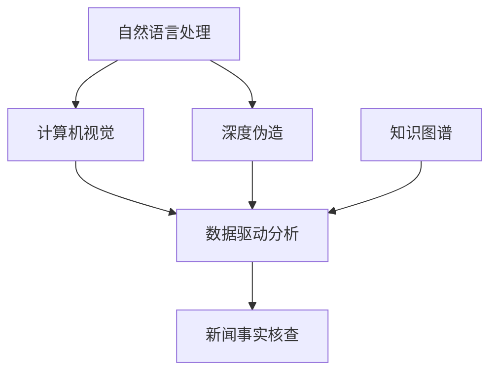

                 

# AI如何改变新闻事实核查流程

## 1. 背景介绍

### 1.1 问题由来
在互联网时代，信息传播的边界被彻底打破，虚假新闻、假消息以及深度伪造(AI生成的假视频、音频)的泛滥，导致公众对媒体信任度下降，社会舆论环境复杂多变。面对这一挑战，新闻事实核查（Fact-Checking）技术应运而生，旨在自动识别新闻中的事实错误，辅助新闻机构进行验证和更正，提升新闻的准确性和可信度。

然而，传统新闻事实核查过程往往耗时耗力，依赖于人工检查和专家审核，难以应对海量的信息流和快速的新闻时效性要求。随着人工智能（AI）技术的发展，基于AI的新闻事实核查流程开始逐步出现，为新闻业带来了革命性的变化。

### 1.2 问题核心关键点
AI在新闻事实核查中的应用，主要体现在以下几个方面：

- **自动化检测**：通过自然语言处理（NLP）和计算机视觉（CV）等技术，自动识别新闻中的潜在错误和事实问题。
- **数据驱动分析**：利用大数据分析和机器学习（ML）模型，发现新闻数据中的模式和异常，辅助人工核查。
- **信息验证**：整合多源数据和知识图谱，验证新闻事实的真伪，提供可信度评估。
- **智能推荐**：根据用户兴趣和行为，个性化推荐可信度和真实性较高的新闻内容，提升用户阅读体验。

这些AI技术手段的引入，极大地提升了新闻事实核查的效率和准确性，为构建真实、公正、公开的新闻信息环境提供了新的路径。

## 2. 核心概念与联系

### 2.1 核心概念概述

为更好地理解AI在新闻事实核查中的应用，本节将介绍几个关键概念：

- **自然语言处理（NLP）**：指使计算机理解、处理和生成人类语言的技术，涵盖了文本分类、实体识别、情感分析、语义理解等多个子领域。
- **计算机视觉（CV）**：使计算机“看”懂视觉图像和视频，涉及图像处理、目标检测、图像识别等技术。
- **深度伪造（Deepfakes）**：利用AI技术生成逼真的假视频、音频等，需加以识别和防范。
- **知识图谱**：由节点（实体）和边（关系）组成的知识网络，用于描述和检索知识，辅助AI进行事实核查。
- **数据驱动分析**：通过大数据分析和ML模型，发现数据中的潜在规律和异常，辅助新闻核查。

这些概念之间的逻辑关系可以通过以下Mermaid流程图来展示：



这个流程图展示了AI技术在新闻事实核查中的关键作用：

1. 自然语言处理和计算机视觉分别处理文本和图像信息。
2. 深度伪造识别假视频、音频等。
3. 知识图谱辅助多源数据整合，提高事实核查的准确性。
4. 数据驱动分析整合各类信息，发现异常模式。
5. 以上技术整合到新闻事实核查中，提升核查效果。

## 3. 核心算法原理 & 具体操作步骤
### 3.1 算法原理概述

基于AI的新闻事实核查流程，主要包括数据预处理、特征提取、模型训练和验证、结果输出等步骤。以下是详细的算法原理和具体操作步骤：

1. **数据预处理**：收集新闻文章、图片、视频等多源数据，进行清洗、标注，生成适合训练的数据集。
2. **特征提取**：使用NLP和CV技术，提取文本、图像、音频等特征，为模型提供输入。
3. **模型训练**：利用训练数据集，训练神经网络模型（如CNN、RNN、BERT等），学习新闻事实的真伪判别。
4. **模型验证**：在验证集上评估模型性能，通过交叉验证等技术，优化模型参数。
5. **结果输出**：利用训练好的模型，对新文章、图片、视频进行自动核查，输出可信度评估。

### 3.2 算法步骤详解

#### 3.2.1 数据预处理
- **数据收集**：从新闻网站、社交媒体、官方渠道等收集新闻内容。
- **数据清洗**：去除噪声、无关信息，保证数据质量。
- **数据标注**：人工标注新闻的真实性，生成训练集、验证集、测试集。

#### 3.2.2 特征提取
- **文本特征提取**：使用NLP技术，如BERT、GPT等模型，提取文章关键词、实体、情感等特征。
- **图像特征提取**：使用CV技术，如CNN、ResNet等模型，提取图片中的视觉特征。
- **音频特征提取**：使用CV技术，如MFCC、Wav2Vec等模型，提取音频特征。

#### 3.2.3 模型训练
- **选择模型**：根据任务需求，选择合适的神经网络模型，如文本分类、图像分类、语音识别等模型。
- **数据划分**：将数据集划分为训练集、验证集、测试集。
- **模型训练**：利用训练集，训练模型参数。
- **模型验证**：在验证集上评估模型性能，通过交叉验证等技术，优化模型参数。

#### 3.2.4 结果输出
- **自动核查**：利用训练好的模型，对新文章、图片、视频进行自动核查，判断其真实性。
- **可信度评估**：输出可信度评分，辅助人工审核。

### 3.3 算法优缺点

基于AI的新闻事实核查流程具有以下优点：

- **高效自动化**：AI模型可以快速处理大量数据，自动检测和标注事实错误，提高核查效率。
- **数据驱动分析**：通过大数据分析和ML模型，发现数据中的潜在规律和异常，辅助新闻核查。
- **跨领域整合**：整合多源数据和知识图谱，提高事实核查的准确性。

同时，该方法也存在以下局限性：

- **数据标注成本高**：初始化标注数据需要大量人工，成本高，且标注质量不稳定。
- **模型泛化能力有限**：特定领域的训练数据较少，模型泛化能力有限。
- **解释性不足**：AI模型的决策过程缺乏可解释性，难以对其推理逻辑进行分析和调试。
- **对抗样本攻击**：AI模型可能对对抗样本产生误判，降低核查效果。

尽管存在这些局限性，但就目前而言，基于AI的新闻事实核查流程仍是最主流范式。未来相关研究的重点在于如何进一步降低数据标注成本，提高模型的泛化能力，同时兼顾可解释性和安全性等因素。

### 3.4 算法应用领域

基于AI的新闻事实核查流程已经在新闻业、社交媒体、政府信息发布等多个领域得到了广泛应用，例如：

- **新闻机构**：辅助新闻编辑进行事实核查，提升新闻准确性和可信度。
- **社交媒体平台**：自动检测和标记虚假信息，防止谣言传播。
- **政府信息发布**：验证公开信息真伪，提高政府透明度和公信力。
- **司法机构**：辅助调查取证，确保法律依据的真实性。
- **公共卫生领域**：核查健康信息，防止谣言误导。

除了上述这些经典应用外，AI新闻事实核查技术还被创新性地应用到更多场景中，如可控文本生成、常识推理、数据增强等，为新闻业带来了全新的突破。随着AI技术的不断进步，相信新闻事实核查技术将在更广阔的领域得到应用，为构建真实、公正、公开的新闻信息环境提供新的技术路径。

## 4. 数学模型和公式 & 详细讲解
### 4.1 数学模型构建

本节将使用数学语言对基于AI的新闻事实核查过程进行更加严格的刻画。

记新闻事实核查任务为 $T$，其中包括文本分类、实体识别、情感分析等多个子任务。假设任务 $T$ 对应的训练集为 $D=\{(x_i, y_i)\}_{i=1}^N, x_i \in \mathcal{X}, y_i \in \{0,1\}$，其中 $x_i$ 为新闻文本或图片，$y_i$ 为真实性标签（0表示假新闻，1表示真新闻）。

定义模型 $M_{\theta}$ 在输入 $x$ 上的输出为 $\hat{y}=M_{\theta}(x) \in [0,1]$，表示模型预测该新闻为假新闻的概率。

在训练过程中，我们希望最小化模型在训练集 $D$ 上的损失函数 $\mathcal{L}(\theta)$，具体定义为：

$$
\mathcal{L}(\theta) = -\frac{1}{N} \sum_{i=1}^N [y_i\log \hat{y}_i + (1-y_i)\log (1-\hat{y}_i)]
$$

其中 $y_i\log \hat{y}_i + (1-y_i)\log (1-\hat{y}_i)$ 为二元交叉熵损失函数，表示模型对真实性标签的预测误差。

利用梯度下降等优化算法，最小化损失函数 $\mathcal{L}(\theta)$，使得模型输出逼近真实标签。

### 4.2 公式推导过程

以下是二分类任务中，基于AI的新闻事实核查模型的损失函数推导过程：

1. **模型定义**：假设模型 $M_{\theta}$ 在输入 $x$ 上的输出为 $\hat{y}=M_{\theta}(x) \in [0,1]$，表示模型预测该新闻为假新闻的概率。

2. **损失函数**：定义二元交叉熵损失函数为：

$$
\mathcal{L}(\theta) = -\frac{1}{N} \sum_{i=1}^N [y_i\log \hat{y}_i + (1-y_i)\log (1-\hat{y}_i)]
$$

3. **梯度计算**：根据链式法则，模型参数 $\theta$ 的梯度为：

$$
\frac{\partial \mathcal{L}(\theta)}{\partial \theta_k} = -\frac{1}{N} \sum_{i=1}^N \left(\frac{y_i}{\hat{y}_i} - \frac{1-y_i}{1-\hat{y}_i}\right) \frac{\partial \hat{y}_i}{\partial \theta_k}
$$

其中 $\frac{\partial \hat{y}_i}{\partial \theta_k}$ 可通过反向传播算法高效计算。

4. **模型优化**：通过梯度下降等优化算法，不断更新模型参数 $\theta$，最小化损失函数 $\mathcal{L}(\theta)$，直至收敛。

### 4.3 案例分析与讲解

下面以文本分类任务为例，具体说明基于AI的新闻事实核查模型的实现过程。

1. **数据准备**：收集新闻文本数据，并人工标注真实性标签，生成训练集和验证集。
2. **特征提取**：使用BERT等模型，提取新闻文本的特征向量。
3. **模型训练**：利用训练集，训练模型参数。
4. **模型验证**：在验证集上评估模型性能，调整模型参数。
5. **结果输出**：利用训练好的模型，对新新闻文本进行自动核查，判断其真实性。

## 5. 项目实践：代码实例和详细解释说明
### 5.1 开发环境搭建

在进行新闻事实核查开发前，我们需要准备好开发环境。以下是使用Python进行PyTorch开发的环境配置流程：

1. 安装Anaconda：从官网下载并安装Anaconda，用于创建独立的Python环境。

2. 创建并激活虚拟环境：
```bash
conda create -n pytorch-env python=3.8 
conda activate pytorch-env
```

3. 安装PyTorch：根据CUDA版本，从官网获取对应的安装命令。例如：
```bash
conda install pytorch torchvision torchaudio cudatoolkit=11.1 -c pytorch -c conda-forge
```

4. 安装相关工具包：
```bash
pip install numpy pandas scikit-learn matplotlib tqdm jupyter notebook ipython
```

完成上述步骤后，即可在`pytorch-env`环境中开始新闻事实核查实践。

### 5.2 源代码详细实现

这里我们以文本分类任务为例，给出使用PyTorch进行新闻事实核查的代码实现。

首先，定义训练集和验证集：

```python
from torch.utils.data import Dataset, DataLoader
from transformers import BertTokenizer, BertForSequenceClassification
import torch

class NewsDataset(Dataset):
    def __init__(self, texts, labels):
        self.tokenizer = BertTokenizer.from_pretrained('bert-base-cased')
        self.texts = texts
        self.labels = labels
        
    def __len__(self):
        return len(self.texts)
    
    def __getitem__(self, idx):
        text = self.texts[idx]
        label = self.labels[idx]
        
        encoding = self.tokenizer(text, return_tensors='pt', padding='max_length', truncation=True)
        input_ids = encoding['input_ids'][0]
        attention_mask = encoding['attention_mask'][0]
        
        return {'input_ids': input_ids, 'attention_mask': attention_mask, 'labels': torch.tensor(label, dtype=torch.long)}

# 加载数据集
train_dataset = NewsDataset(train_texts, train_labels)
val_dataset = NewsDataset(val_texts, val_labels)

# 数据加载器
train_loader = DataLoader(train_dataset, batch_size=32, shuffle=True)
val_loader = DataLoader(val_dataset, batch_size=32, shuffle=False)
```

然后，定义模型和优化器：

```python
from transformers import AdamW

model = BertForSequenceClassification.from_pretrained('bert-base-cased', num_labels=2)

optimizer = AdamW(model.parameters(), lr=2e-5)
```

接着，定义训练和评估函数：

```python
from tqdm import tqdm
import torch.nn.functional as F

def train_epoch(model, loader, optimizer):
    model.train()
    total_loss = 0
    for batch in tqdm(loader, desc='Training'):
        input_ids = batch['input_ids'].to(device)
        attention_mask = batch['attention_mask'].to(device)
        labels = batch['labels'].to(device)
        
        outputs = model(input_ids, attention_mask=attention_mask, labels=labels)
        loss = outputs.loss
        total_loss += loss.item()
        optimizer.zero_grad()
        loss.backward()
        optimizer.step()
    return total_loss / len(loader)

def evaluate(model, loader):
    model.eval()
    total_correct = 0
    total_samples = 0
    with torch.no_grad():
        for batch in loader:
            input_ids = batch['input_ids'].to(device)
            attention_mask = batch['attention_mask'].to(device)
            labels = batch['labels'].to(device)
            
            outputs = model(input_ids, attention_mask=attention_mask)
            predictions = torch.argmax(outputs.logits, dim=1)
            total_correct += torch.sum(predictions == labels).item()
            total_samples += labels.shape[0]
    
    accuracy = total_correct / total_samples
    return accuracy
```

最后，启动训练流程并在验证集上评估：

```python
epochs = 5
batch_size = 32
device = torch.device('cuda') if torch.cuda.is_available() else torch.device('cpu')

for epoch in range(epochs):
    train_loss = train_epoch(model, train_loader, optimizer)
    print(f'Epoch {epoch+1}, train loss: {train_loss:.3f}')
    
    print(f'Epoch {epoch+1}, validation accuracy: {evaluate(model, val_loader):.3f}')
    
print('Best validation accuracy:', max(evaluate(model, val_loader) for _ in range(epochs)))
```

以上就是使用PyTorch对新闻事实核查任务进行微调的完整代码实现。可以看到，通过PyTorch和Transformers库，我们能够快速搭建并训练新闻事实核查模型，通过微调实现新闻真实性的自动识别和验证。

### 5.3 代码解读与分析

让我们再详细解读一下关键代码的实现细节：

**NewsDataset类**：
- `__init__`方法：初始化文本、标签、分词器等关键组件。
- `__len__`方法：返回数据集的样本数量。
- `__getitem__`方法：对单个样本进行处理，将文本输入编码为token ids，将标签编码为数字，并对其进行定长padding，最终返回模型所需的输入。

**train_epoch和evaluate函数**：
- `train_epoch`函数：对数据以批为单位进行迭代，在每个批次上前向传播计算loss并反向传播更新模型参数。
- `evaluate`函数：与训练类似，不同点在于不更新模型参数，并在每个batch结束后将预测和标签结果存储下来，最后使用分类准确率评估模型性能。

**训练流程**：
- 定义总的epoch数和batch size，开始循环迭代
- 每个epoch内，先在训练集上训练，输出平均loss
- 在验证集上评估，输出分类准确率
- 重复上述步骤直至收敛，最终得到最佳的验证集准确率

可以看到，PyTorch配合Transformers库使得新闻事实核查的代码实现变得简洁高效。开发者可以将更多精力放在数据处理、模型改进等高层逻辑上，而不必过多关注底层的实现细节。

当然，工业级的系统实现还需考虑更多因素，如模型的保存和部署、超参数的自动搜索、更灵活的任务适配层等。但核心的微调范式基本与此类似。

## 6. 实际应用场景
### 6.1 智能客服系统

基于AI的新闻事实核查技术，可以应用于智能客服系统的构建。传统客服往往需要配备大量人力，高峰期响应缓慢，且一致性和专业性难以保证。而使用AI进行事实核查，能够实时监测客户提问的内容，自动判断其真实性，引导客服进行适当回答。

在技术实现上，可以收集客户的历史对话记录，将客户问题与可信度较高的回答构建成监督数据，在此基础上对预训练模型进行微调。微调后的模型能够自动理解客户意图，匹配最合适的答案模板进行回复。对于客户提出的新问题，还可以接入检索系统实时搜索相关内容，动态组织生成回答。如此构建的智能客服系统，能大幅提升客户咨询体验和问题解决效率。

### 6.2 金融舆情监测

金融机构需要实时监测市场舆论动向，以便及时应对负面信息传播，规避金融风险。传统的人工监测方式成本高、效率低，难以应对网络时代海量信息爆发的挑战。基于AI的新闻事实核查技术，为金融舆情监测提供了新的解决方案。

具体而言，可以收集金融领域相关的新闻、报道、评论等文本数据，并对其进行主题标注和情感标注。在此基础上对预训练语言模型进行微调，使其能够自动判断文本属于何种主题，情感倾向是正面、中性还是负面。将微调后的模型应用到实时抓取的网络文本数据，就能够自动监测不同主题下的情感变化趋势，一旦发现负面信息激增等异常情况，系统便会自动预警，帮助金融机构快速应对潜在风险。

### 6.3 个性化推荐系统

当前的推荐系统往往只依赖用户的历史行为数据进行物品推荐，无法深入理解用户的真实兴趣偏好。基于AI的新闻事实核查技术，可以应用于个性化推荐系统，提升推荐系统的质量和可信度。

在实践中，可以收集用户浏览、点击、评论、分享等行为数据，提取和用户交互的物品标题、描述、标签等文本内容。将文本内容作为模型输入，用户的后续行为（如是否点击、购买等）作为监督信号，在此基础上微调预训练语言模型。微调后的模型能够从文本内容中准确把握用户的兴趣点。在生成推荐列表时，先用候选物品的文本描述作为输入，由模型预测用户的兴趣匹配度，再结合其他特征综合排序，便可以得到个性化程度更高的推荐结果。

### 6.4 未来应用展望

随着AI新闻事实核查技术的不断发展和应用，未来将在更多领域得到创新性应用，为传统行业带来变革性影响。

在智慧医疗领域，基于AI的新闻事实核查技术可以用于核实患者病历、医疗信息，防止误诊、漏诊，提升医疗服务的质量和可靠性。

在智能教育领域，可以用于核实学生作业、考试答案，辅助教师批改，提高教育质量。

在智慧城市治理中，可以用于核实公共信息、政府公告，提升城市管理的透明度和公信力。

此外，在企业生产、社会治理、文娱传媒等众多领域，AI新闻事实核查技术也将不断涌现，为各行各业带来新的应用场景，推动人工智能技术的广泛落地。相信随着技术的日益成熟，AI新闻事实核查技术必将在构建真实、公正、公开的信息环境中发挥更大的作用。

## 7. 工具和资源推荐
### 7.1 学习资源推荐

为了帮助开发者系统掌握AI新闻事实核查技术的理论基础和实践技巧，这里推荐一些优质的学习资源：

1. 《深度学习与自然语言处理》书籍：全面介绍深度学习在自然语言处理中的应用，包括文本分类、实体识别、情感分析等技术。

2. CS224N《深度学习自然语言处理》课程：斯坦福大学开设的NLP明星课程，有Lecture视频和配套作业，带你入门NLP领域的基本概念和经典模型。

3. 《AI新闻事实核查：技术与应用》课程：介绍新闻事实核查的基本原理和最新进展，提供实战案例和工具推荐。

4. Arxiv预印本：包含大量最新的AI新闻事实核查研究论文，涵盖多模态信息融合、知识图谱构建、对抗样本检测等多个方向。

5. GitHub开源项目：展示AI新闻事实核查的典型案例，包括文本分类、图像识别、语音识别等任务。

通过对这些资源的学习实践，相信你一定能够快速掌握AI新闻事实核查技术的精髓，并用于解决实际的NLP问题。
###  7.2 开发工具推荐

高效的开发离不开优秀的工具支持。以下是几款用于AI新闻事实核查开发的常用工具：

1. PyTorch：基于Python的开源深度学习框架，灵活动态的计算图，适合快速迭代研究。大部分预训练语言模型都有PyTorch版本的实现。

2. TensorFlow：由Google主导开发的开源深度学习框架，生产部署方便，适合大规模工程应用。同样有丰富的预训练语言模型资源。

3. Transformers库：HuggingFace开发的NLP工具库，集成了众多SOTA语言模型，支持PyTorch和TensorFlow，是进行新闻事实核查开发的利器。

4. Weights & Biases：模型训练的实验跟踪工具，可以记录和可视化模型训练过程中的各项指标，方便对比和调优。与主流深度学习框架无缝集成。

5. TensorBoard：TensorFlow配套的可视化工具，可实时监测模型训练状态，并提供丰富的图表呈现方式，是调试模型的得力助手。

6. Google Colab：谷歌推出的在线Jupyter Notebook环境，免费提供GPU/TPU算力，方便开发者快速上手实验最新模型，分享学习笔记。

合理利用这些工具，可以显著提升AI新闻事实核查任务的开发效率，加快创新迭代的步伐。

### 7.3 相关论文推荐

AI新闻事实核查技术的发展源于学界的持续研究。以下是几篇奠基性的相关论文，推荐阅读：

1. TextRank: Bringing Order into Texts《文本排序：赋予文本顺序》：提出TextRank算法，利用图论思想进行文本排序，引入到新闻事实核查任务。

2. Snorkel: Training Data Synthesis for Text Understanding：提出Snorkel系统，通过数据合成技术，自动生成监督数据，减少标注成本。

3. A Neural Model of Grammatical Reasoning: From Finite to Continuous Reasoning《语法推理的神经网络模型：从有限到连续推理》：引入语法推理模型，增强新闻事实核查的准确性和泛化能力。

4. A Dual Attention Network for Sentiment Analysis：提出双重注意力网络，用于情感分析任务，为新闻事实核查提供理论支持。

5. A Multi-layer Neural Network Model for the Identification of Fake News in News Articles《新闻文章虚假信息识别的多层神经网络模型》：利用多层神经网络，进行虚假信息识别，为新闻事实核查提供技术参考。

这些论文代表了大新闻事实核查技术的发展脉络。通过学习这些前沿成果，可以帮助研究者把握学科前进方向，激发更多的创新灵感。

## 8. 总结：未来发展趋势与挑战

### 8.1 总结

本文对基于AI的新闻事实核查流程进行了全面系统的介绍。首先阐述了AI在新闻事实核查中的应用，明确了新闻业面临的信息爆炸和虚假信息传播的挑战，以及AI技术可以提供的解决方案。其次，从原理到实践，详细讲解了AI新闻事实核查的数学原理和关键步骤，给出了完整的代码实现。同时，本文还广泛探讨了AI新闻事实核查在智能客服、金融舆情、个性化推荐等多个领域的应用前景，展示了AI技术的巨大潜力。

通过本文的系统梳理，可以看到，基于AI的新闻事实核查技术正在成为新闻业的重要范式，极大地提升了新闻事实核查的效率和准确性，为构建真实、公正、公开的新闻信息环境提供了新的路径。未来，伴随AI技术的不断进步，新闻事实核查技术必将进一步深化发展，为各行各业带来新的变革。

### 8.2 未来发展趋势

展望未来，AI新闻事实核查技术将呈现以下几个发展趋势：

1. **自动化程度提高**：随着预训练模型和大规模数据集的普及，新闻事实核查的自动化程度将进一步提高，能够快速处理海量新闻数据，实时监测信息变化。

2. **多模态融合**：新闻事实核查将更多地整合图像、视频、语音等多模态数据，提升核查的准确性和全面性。

3. **模型泛化能力增强**：通过更深入的模型设计和优化，新闻事实核查模型将在更广泛的领域和任务中表现出色，具备较强的泛化能力。

4. **跨领域迁移能力**：新闻事实核查技术将在其他领域如法律、健康等领域得到应用，提升其他领域的可信度和透明度。

5. **对抗样本防御**：新闻事实核查模型将具备更强的对抗样本识别能力，防止恶意用户通过对抗样本欺骗系统。

6. **多任务学习**：新闻事实核查模型将具备多任务学习能力，能够同时处理多种事实核查任务，提升整体效果。

7. **持续学习与适应**：新闻事实核查模型将具备持续学习能力，能够不断更新知识和规则，适应新的信息环境。

以上趋势凸显了AI新闻事实核查技术的广阔前景。这些方向的探索发展，必将进一步提升新闻事实核查的准确性和可靠性，为构建真实、公正、公开的新闻信息环境提供新的技术路径。

### 8.3 面临的挑战

尽管AI新闻事实核查技术已经取得了显著成就，但在迈向更加智能化、普适化应用的过程中，它仍面临着诸多挑战：

1. **数据标注成本高**：初始化标注数据需要大量人工，成本高，且标注质量不稳定。

2. **模型泛化能力有限**：特定领域的训练数据较少，模型泛化能力有限。

3. **对抗样本攻击**：AI模型可能对对抗样本产生误判，降低核查效果。

4. **解释性不足**：AI模型的决策过程缺乏可解释性，难以对其推理逻辑进行分析和调试。

5. **安全性问题**：预训练语言模型难免会学习到有害信息，通过微调传递到下游任务，产生误导性、歧视性的输出，带来安全隐患。

6. **伦理道德问题**：新闻事实核查可能涉及隐私、言论自由等伦理道德问题，需合理设计和使用。

尽管存在这些挑战，但相信随着学界和产业界的共同努力，这些难题终将一一克服，AI新闻事实核查技术必将迎来更加广泛的应用，构建真实、公正、公开的新闻信息环境。

### 8.4 研究展望

面对AI新闻事实核查技术所面临的挑战，未来的研究需要在以下几个方面寻求新的突破：

1. **探索无监督和半监督学习**：摆脱对大规模标注数据的依赖，利用自监督学习、主动学习等技术，最大限度利用非结构化数据，实现更加灵活高效的核查。

2. **开发参数高效和计算高效的模型**：开发更加参数高效的模型，在固定大部分预训练参数的情况下，只更新极少量的任务相关参数。同时优化计算图，减少前向传播和反向传播的资源消耗，实现更加轻量级、实时性的部署。

3. **引入因果分析和博弈论工具**：将因果分析方法引入核查模型，识别出模型决策的关键特征，增强输出解释的因果性和逻辑性。借助博弈论工具刻画人机交互过程，主动探索并规避模型的脆弱点，提高系统稳定性。

4. **纳入伦理道德约束**：在模型训练目标中引入伦理导向的评估指标，过滤和惩罚有偏见、有害的输出倾向。加强人工干预和审核，建立模型行为的监管机制，确保输出符合人类价值观和伦理道德。

5. **知识整合能力提升**：将符号化的先验知识，如知识图谱、逻辑规则等，与神经网络模型进行巧妙融合，引导核查过程学习更准确、合理的语言模型。

6. **多任务学习和跨领域迁移**：新闻事实核查模型将具备多任务学习能力，能够同时处理多种事实核查任务，提升整体效果。同时提升跨领域迁移能力，在更多领域中表现出色。

这些研究方向的探索，必将引领AI新闻事实核查技术迈向更高的台阶，为构建真实、公正、公开的新闻信息环境提供新的技术路径。面向未来，AI新闻事实核查技术还需要与其他人工智能技术进行更深入的融合，如知识表示、因果推理、强化学习等，多路径协同发力，共同推动自然语言理解和智能交互系统的进步。只有勇于创新、敢于突破，才能不断拓展语言模型的边界，让智能技术更好地造福人类社会。

## 9. 附录：常见问题与解答

**Q1：AI新闻事实核查是否适用于所有新闻类型？**

A: AI新闻事实核查技术在处理文本数据时较为高效，但对于图像、视频等多模态数据，现有技术仍存在局限。因此，对于包含大量多模态数据的新闻，如新闻播报、视频新闻等，可能需要引入计算机视觉技术进行辅助核查。

**Q2：如何确保AI新闻事实核查的准确性？**

A: AI新闻事实核查的准确性依赖于高质量的数据集、合适的模型架构和训练策略。以下措施可以有效提升核查的准确性：
1. 数据清洗和标注：去除噪声、无关信息，保证数据质量。
2. 选择合适的模型：根据任务需求，选择合适的神经网络模型，如文本分类、图像分类、语音识别等模型。
3. 交叉验证：通过交叉验证技术，评估模型性能，优化模型参数。
4. 对抗样本检测：引入对抗样本检测技术，防止恶意用户通过对抗样本欺骗系统。

**Q3：AI新闻事实核查是否涉及隐私保护？**

A: AI新闻事实核查技术在处理公开的新闻数据时，一般不会涉及隐私保护问题。但在使用用户数据进行训练和测试时，需注意数据隐私保护，确保用户数据的安全和匿名性。

**Q4：AI新闻事实核查技术是否会导致新闻业失业？**

A: AI新闻事实核查技术的引入，主要目的是辅助新闻编辑进行事实核查，提高新闻的准确性和可信度。但这并不意味着新闻业会失业，反而有助于提升新闻编辑的工作效率，让他们能够更好地关注新闻的深度和广度，提升整体新闻质量。

**Q5：AI新闻事实核查技术是否会存在偏见？**

A: AI新闻事实核查模型可能会继承预训练语言模型的偏见，因此需要在使用前进行充分的验证和校准。可以通过引入多种数据源、多领域知识图谱等手段，减少模型偏见，提升核查的公正性和客观性。

通过以上问题和解答，可以看出AI新闻事实核查技术在实际应用中还需考虑多方面的因素，需要结合具体场景进行深入研究和优化。相信随着技术的不断进步，AI新闻事实核查技术必将在构建真实、公正、公开的新闻信息环境中发挥更大的作用，为新闻业带来新的变革。

---

作者：禅与计算机程序设计艺术 / Zen and the Art of Computer Programming

