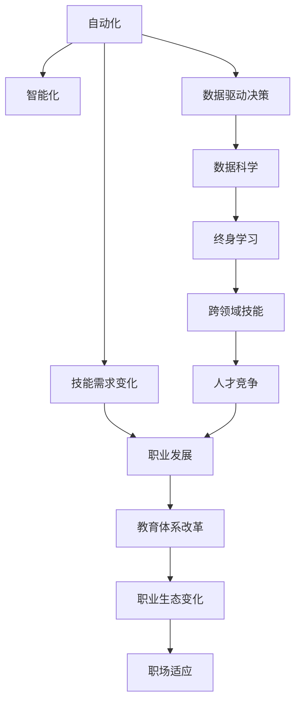

                 

# AI如何改变职场技能需求

> 关键词：人工智能,职场技能,技能需求,自动化,机器学习,数据科学,终身学习

## 1. 背景介绍

### 1.1 问题由来

随着人工智能(AI)技术的快速发展和广泛应用，职场技能需求正在经历深刻的变革。AI不仅在改变传统行业的业务模式和工作流程，也在塑造未来的职业生态和人才需求。本文旨在深入探讨AI如何重塑职场技能需求，为个人职业规划和发展提供有益的洞察。

### 1.2 问题核心关键点

AI对职场技能需求的影响主要体现在以下几个方面：

1. **自动化与智能化**：AI驱动的自动化工具和系统正在逐步替代重复性和机械性的工作，使得职场对传统手工操作技能的需求减少。
2. **数据驱动决策**：AI和大数据技术使得数据驱动的决策成为可能，对数据分析、处理和解释能力的需求显著提升。
3. **跨领域技能**：AI技术的应用跨越了多个行业领域，对具备跨学科知识和技能的人才需求增加。
4. **终身学习**：AI技术的快速发展要求职场人士持续学习新知识和技能，以适应不断变化的技术环境。
5. **创新与创造力**：AI提升了生产力，释放了人类创造力的潜能，职场更加重视创新和创意能力。

### 1.3 问题研究意义

理解AI如何改变职场技能需求，对于个人职业发展、企业人才培养、教育机构课程设计具有重要意义。它可以帮助个人明确职业路径，企业优化人才结构，教育机构更新教学内容，从而在AI时代保持竞争力。

## 2. 核心概念与联系

### 2.1 核心概念概述

为更好地理解AI对职场技能需求的影响，本节将介绍几个关键概念：

- **人工智能(AI)**：通过计算机模拟人类智能，实现感知、学习、推理、规划等能力的先进技术。
- **自动化(Automation)**：使用AI技术自动完成重复性、规则性任务，提升效率和精度。
- **数据科学(Data Science)**：涉及数据采集、处理、分析和解释，以支持数据驱动的决策。
- **终身学习(Lifelong Learning)**：在职业生涯中持续学习新知识和技能，适应技术环境变化。
- **跨领域技能(Cross-disciplinary Skills)**：具备跨行业应用的知识和技能，如数据科学、编程、项目管理等。

### 2.2 核心概念原理和架构的 Mermaid 流程图



这个流程图展示了AI技术对职场技能需求的连锁影响：

1. 自动化和智能化提高了生产效率，使得部分工作可以由机器完成。
2. 数据驱动决策需要大量的数据处理和分析能力，推动了数据科学的发展。
3. 终身学习成为必要，以应对技术变化和技能更新。
4. 跨领域技能的需求增加，反映了AI技术在不同行业的广泛应用。
5. 技能需求的变化进一步影响职业发展、教育体系和职场生态。

## 3. 核心算法原理 & 具体操作步骤
### 3.1 算法原理概述

AI如何改变职场技能需求，其核心在于AI技术对现有工作流程的重构和效率提升。这一过程可以分为以下几个步骤：

1. **需求识别**：通过AI技术识别重复性高、规则性强的工作，评估其自动化潜力。
2. **技能映射**：将自动化工作所需的技能与现有职场技能进行映射，确定技能差距。
3. **技能提升**：为填补技能差距，个人和企业需进行相应的技能培训和提升。
4. **技能应用**：新技能应用于自动化系统，提升工作质量和效率。

### 3.2 算法步骤详解

以下详细解释AI改变职场技能需求的各个步骤：

#### 3.2.1 需求识别

1. **工作流程分析**：使用流程挖掘、流程模拟等技术，分析工作流程中的重复性和规律性环节。
2. **自动化可行性评估**：基于技术成熟度、成本效益等指标，评估哪些环节最适合自动化。

#### 3.2.2 技能映射

1. **技能需求分析**：识别自动化过程中所需的技术和软技能，如编程、数据分析、决策制定等。
2. **现有技能评估**：通过技能测试、自我评估等方式，了解员工当前的技能水平和技能缺口。

#### 3.2.3 技能提升

1. **技能培训**：通过在线课程、职业培训等方式，提升员工所需的技能。
2. **持续学习**：鼓励员工参加行业会议、阅读专业书籍，保持技能的持续更新。

#### 3.2.4 技能应用

1. **系统集成**：将新技能应用于自动化系统，确保系统可靠运行。
2. **效果评估**：定期评估自动化系统的效果，反馈优化和改进需求。

### 3.3 算法优缺点

AI改变职场技能需求的优势和局限性如下：

**优势**：

- **提升效率**：自动化和智能化显著提升工作效率，减少错误和重复劳动。
- **技能迁移**：从重复性工作中解放出来的技能可以迁移到更具创造性的任务中。
- **精准培训**：通过数据科学方法，针对性地进行技能培训，提升培训效果。

**局限性**：

- **技术壁垒**：对于某些行业，AI技术的应用存在技术壁垒，需要长期投入和积累。
- **技能断层**：技能提升需要时间，短期内可能会出现技能断层，影响业务连续性。
- **适应性问题**：技能提升不充分或过于依赖AI，可能导致员工适应性不足。

### 3.4 算法应用领域

AI改变职场技能需求的方法，适用于多个行业领域，包括但不限于：

- **制造业**：通过自动化生产线和机器人，提升生产效率和质量。
- **金融业**：利用AI进行风险评估、交易分析，提升金融服务的智能水平。
- **医疗健康**：使用AI进行疾病诊断、治疗方案推荐，提升医疗服务质量。
- **教育培训**：通过个性化学习平台和AI教师，实现精准教学和高效辅导。
- **市场营销**：利用AI分析消费者行为，提升营销效果和用户体验。

## 4. 数学模型和公式 & 详细讲解 & 举例说明

### 4.1 数学模型构建

为了更准确地理解和预测AI对职场技能需求的影响，本节将建立一个简单的数学模型：

设职场技能需求变化率为 $D(t)$，其中 $t$ 为时间。影响因素包括技术发展速度 $V_t$、行业特定需求 $N_t$、员工学习能力 $L_t$。

$$
D(t) = k \cdot V_t(t) \cdot N_t(t) \cdot L_t(t)
$$

其中，$k$ 为比例系数，反映了其他因素对技能需求的影响程度。

### 4.2 公式推导过程

根据上述模型，可以进行如下推导：

1. **技术发展速度** $V_t$：假设技术进步按指数增长，则 $V_t(t) = V_0 \cdot e^{k_t \cdot t}$，其中 $V_0$ 为初始技术水平，$k_t$ 为技术发展速度。
2. **行业特定需求** $N_t$：假设行业需求按线性增长，则 $N_t(t) = N_0 + a \cdot t$，其中 $N_0$ 为初始需求量，$a$ 为需求增长率。
3. **员工学习能力** $L_t$：假设员工学习能力随时间增长，则 $L_t(t) = L_0 \cdot e^{c \cdot t}$，其中 $L_0$ 为初始学习水平，$c$ 为学习能力提升速率。

将这些推导代入需求变化率的公式中，得：

$$
D(t) = k \cdot V_0 \cdot e^{k_t \cdot t} \cdot (N_0 + a \cdot t) \cdot L_0 \cdot e^{c \cdot t}
$$

### 4.3 案例分析与讲解

以制造业自动化为例，分析AI对技能需求的影响：

- **初始技术水平** $V_0$：假设为0.8，表示当前制造业自动化技术水平中等。
- **技术发展速度** $k_t$：假设为0.05，表示技术每年以5%的速度增长。
- **初始需求量** $N_0$：假设为100，表示当前制造业自动化需求量中等。
- **需求增长率** $a$：假设为5，表示每年自动化需求增长5%。
- **初始学习水平** $L_0$：假设为0.7，表示员工当前自动化技能水平中等。
- **学习能力提升速率** $c$：假设为0.03，表示每年员工自动化技能提升3%。

代入公式，计算第5年职场技能需求的变化率：

$$
D(5) = k \cdot V_0 \cdot e^{k_t \cdot 5} \cdot (N_0 + a \cdot 5) \cdot L_0 \cdot e^{c \cdot 5} \approx 1.36 \cdot 0.8 \cdot e^{0.25} \cdot (100 + 5 \cdot 5) \cdot 0.7 \cdot e^{0.15} \approx 1.4
$$

即第5年职场技能需求的变化率约为1.4，表示技能需求将显著增长。

## 5. 项目实践：代码实例和详细解释说明

### 5.1 开发环境搭建

要实现上述模型，需要搭建相应的开发环境：

1. **安装Python**：确保Python版本为3.8以上。
2. **安装NumPy和Pandas**：用于数据处理和计算。
3. **安装Matplotlib和Seaborn**：用于数据可视化。
4. **安装Scikit-learn**：用于建立和评估数学模型。

```bash
pip install numpy pandas matplotlib seaborn scikit-learn
```

### 5.2 源代码详细实现

以下是实现上述数学模型的Python代码：

```python
import numpy as np
import pandas as pd
import matplotlib.pyplot as plt
from sklearn.linear_model import LinearRegression

# 定义参数
k = 1  # 比例系数
V0 = 0.8  # 初始技术水平
kt = 0.05  # 技术发展速度
N0 = 100  # 初始需求量
a = 5  # 需求增长率
L0 = 0.7  # 初始学习水平
c = 0.03  # 学习能力提升速率

# 计算技能需求变化率
def demand_change(t):
    return k * V0 * np.exp(kt * t) * (N0 + a * t) * L0 * np.exp(c * t)

# 生成时间序列
t = np.arange(0, 10, 0.1)
demand = demand_change(t)

# 可视化需求变化
plt.plot(t, demand)
plt.title('Demand Change Over Time')
plt.xlabel('Time (years)')
plt.ylabel('Demand Change')
plt.show()

# 建立线性回归模型
model = LinearRegression()
X = t.reshape(-1, 1)
y = demand
model.fit(X, y)

# 预测未来需求变化
future_t = np.arange(10, 20, 0.1)
future_demand = demand_change(future_t)
plt.plot(future_t, future_demand)
plt.title('Future Demand Change')
plt.xlabel('Time (years)')
plt.ylabel('Demand Change')
plt.legend(['Historical Demand', 'Future Demand'])
plt.show()

# 打印模型参数
print('Model Parameters:', model.coef_, model.intercept_)
```

### 5.3 代码解读与分析

代码中的关键步骤包括：

1. **参数定义**：设定了影响技能需求变化的关键参数。
2. **需求变化计算**：使用定义的公式计算技能需求随时间的变化率。
3. **数据可视化**：使用Matplotlib绘制历史和未来技能需求变化的曲线图。
4. **模型建立**：使用线性回归模型对历史数据进行拟合。
5. **未来预测**：使用模型对未来技能需求变化进行预测。
6. **参数输出**：打印模型参数，供进一步分析使用。

### 5.4 运行结果展示

运行代码后，你将看到两个图表：

- **历史技能需求变化**：展示技能需求随时间变化的曲线图。
- **未来技能需求预测**：展示基于模型预测的未来技能需求变化曲线图。

## 6. 实际应用场景

### 6.1 自动化生产线

在制造业，AI驱动的自动化生产线通过机器人和自动化设备，大幅度提升了生产效率和质量。随着自动化技术的不断成熟，对操作工人的技能要求也在不断变化：

- **减少手工操作**：传统的机械操作和手工组装工作逐步被机器人替代，操作工人需要学习如何操作和维护自动化设备。
- **数据分析**：自动化系统生成的海量数据需要被分析和解读，操作工人需掌握数据分析和处理技能。
- **协作技能**：团队协作、项目管理等软技能变得重要，操作工人需提升跨团队沟通和协调能力。

### 6.2 金融风控

在金融行业，AI技术广泛应用于风险评估、信用评分、欺诈检测等场景，对数据处理和分析能力的需求显著提升：

- **数据处理**：处理和分析大量的金融数据，识别异常和风险信号，提升决策的准确性。
- **模型构建**：使用机器学习模型进行风险评估和预测，需掌握相关的算法和工具。
- **监管合规**：了解金融法规和监管要求，确保AI应用的合规性。

### 6.3 医疗诊断

在医疗健康领域，AI技术被用于疾病诊断、治疗方案推荐、健康管理等，对医疗专业人士的技能需求也发生了变化：

- **影像分析**：通过AI辅助分析医疗影像，提高诊断的准确性和效率。
- **数据分析**：处理和分析临床数据，支持精准医疗和个性化治疗。
- **持续学习**：定期更新知识库，掌握最新的医疗技术和治疗方案。

## 7. 工具和资源推荐

### 7.1 学习资源推荐

为了帮助职场人士了解和掌握AI技能，推荐以下学习资源：

1. **Coursera和edX**：提供广泛的AI和数据科学课程，涵盖基础理论和技术应用。
2. **Udacity**：提供实践导向的AI项目，提升技能并积累实战经验。
3. **Kaggle**：参加数据科学和机器学习竞赛，锻炼解决问题的能力。
4. **GitHub**：学习开源项目，了解最新的AI技术动态。

### 7.2 开发工具推荐

以下是几款常用的AI开发工具：

1. **Jupyter Notebook**：开源的交互式编程环境，适合数据探索和模型开发。
2. **TensorFlow和PyTorch**：主流的深度学习框架，支持构建和训练各种AI模型。
3. **Scikit-learn**：流行的机器学习库，提供丰富的算法和工具。
4. **Keras**：高级神经网络API，易于使用且功能强大。
5. **NumPy和Pandas**：数据处理和计算的基础工具，适合各种数据科学任务。

### 7.3 相关论文推荐

了解AI领域的最新研究成果，可以参考以下论文：

1. **Deep Learning**：Ian Goodfellow等著，全面介绍深度学习的基本理论和应用。
2. **Machine Learning Yearning**：Andrew Ng所著，分享机器学习实践经验和最佳实践。
3. **NeurIPS和ICML论文集**：顶级AI会议的论文集，展示最新的研究成果和技术进展。

## 8. 总结：未来发展趋势与挑战

### 8.1 研究成果总结

本文详细探讨了AI技术如何改变职场技能需求，揭示了AI驱动的自动化、数据驱动决策、跨领域技能提升和终身学习的重要性。通过建立数学模型和实际案例分析，说明了AI技术在多个行业中的应用和影响。

### 8.2 未来发展趋势

未来AI技术的发展将进一步影响职场技能需求，呈现以下几个趋势：

1. **智能协作**：AI将更加注重人机协作，提升团队效率和创造力。
2. **跨界融合**：AI技术与各行业的深度融合，产生更多跨学科应用场景。
3. **个性化学习**：基于AI的个性化学习平台将提供量身定制的技能培训方案。
4. **透明化决策**：AI应用的透明化将增强职场人士对AI系统的理解和信任。
5. **伦理和安全性**：AI应用的伦理和安全性问题将受到更多关注，推动相关法规和标准的制定。

### 8.3 面临的挑战

尽管AI技术在职场应用中展现出巨大潜力，但也面临诸多挑战：

1. **技术壁垒**：不同行业对AI技术的接受度和应用能力存在差异。
2. **人才短缺**：具备AI技能的人才供不应求，需大规模培训和培养。
3. **数据隐私**：AI应用涉及大量敏感数据，需确保数据隐私和安全。
4. **算法公平性**：AI模型可能存在偏见，需确保算法公平性和透明性。
5. **技术更新**：AI技术快速迭代，需持续学习新知识以适应变化。

### 8.4 研究展望

未来，需要在以下几个方面进行深入研究：

1. **普适性学习**：开发适应多种行业和职业的技能培训方案。
2. **跨领域协作**：构建跨学科团队，提升AI技术的应用效能。
3. **伦理与监管**：制定AI应用的伦理规范和监管机制，确保技术健康发展。
4. **教育体系改革**：更新教育内容和教学方法，适应AI时代的需求。
5. **国际合作**：推动全球范围内AI技术的标准化和互操作性。

## 9. 附录：常见问题与解答

**Q1：AI如何影响不同行业的工作？**

A: AI技术在不同行业的应用差异较大。例如，制造业通过自动化提升了生产效率，金融业通过风险评估优化了金融服务，医疗健康通过AI辅助诊断提升了医疗水平。具体影响需结合行业特点和应用场景进行详细分析。

**Q2：如何应对AI带来的技能需求变化？**

A: 应对AI带来的技能需求变化，需从以下几个方面入手：

1. **持续学习**：通过在线课程、职业培训等方式，提升员工所需的技能。
2. **技能迁移**：从重复性工作中解放出来的技能可以迁移到更具创造性的任务中。
3. **团队协作**：提升跨团队沟通和协作能力，适应新的工作环境。
4. **技术适应**：学习和掌握AI相关的技术和工具，提升技术应用能力。

**Q3：AI应用中如何保证数据隐私和安全？**

A: 保证AI应用中数据隐私和安全，需采取以下措施：

1. **数据加密**：对敏感数据进行加密存储和传输，防止数据泄露。
2. **访问控制**：严格控制数据访问权限，确保只有授权人员可以访问。
3. **匿名化处理**：在数据分析过程中，对数据进行匿名化处理，保护个人隐私。
4. **安全审计**：定期进行安全审计和风险评估，及时发现和修复安全漏洞。

**Q4：AI应用中如何确保算法公平性？**

A: 确保AI应用中算法公平性，需采取以下措施：

1. **数据多样性**：确保训练数据的多样性和代表性，避免数据偏见。
2. **公平性评估**：使用公平性指标对AI模型进行评估，识别和纠正偏见。
3. **透明性**：公开AI模型的决策过程和逻辑，增加透明度。
4. **多样性训练**：在模型训练过程中，引入多样性数据，减少偏见。

**Q5：AI技术的发展将如何影响未来的职业生态？**

A: AI技术的发展将对未来职业生态产生深远影响：

1. **新兴职业**：AI技术将催生新的职业，如AI工程师、数据科学家、智能系统管理者等。
2. **职业转型**：许多传统职业将通过AI技术进行转型，提升效率和智能化水平。
3. **人机协作**：AI技术将增强人机协作，提升团队工作效率和创造力。
4. **终身学习**：AI技术的发展将推动终身学习的普及，提升个人技能竞争力。
5. **职业安全**：AI技术的发展也带来了职业安全方面的挑战，需关注AI对就业的影响，制定相应的政策措施。

---

作者：禅与计算机程序设计艺术 / Zen and the Art of Computer Programming

