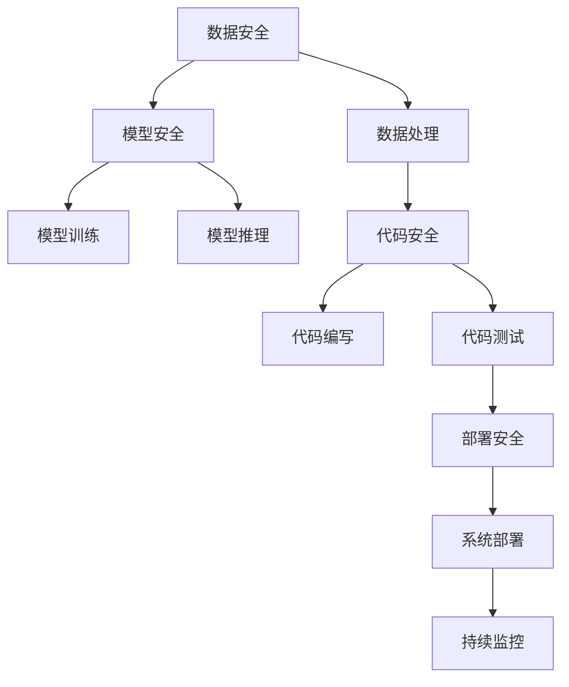

                 

# AI开发的安全编码：Lepton AI的最佳实践

> 关键词：安全编码, AI开发, 编程规范, 安全测试, 最佳实践, Lepton AI

## 1. 背景介绍

随着人工智能（AI）技术的快速发展和普及，AI开发的安全性问题日益受到重视。如何构建安全的AI系统，确保其在运行过程中不会引入安全漏洞，成为了一个亟待解决的问题。特别是随着AI系统在关键领域的应用，如金融、医疗、智能交通等，安全性的要求更是尤为严格。Lepton AI作为一家领先的AI技术公司，一直致力于提高AI开发的可信赖性和安全性，本文将详细介绍Lepton AI在AI开发中的安全编码最佳实践。

### 1.1 问题由来

随着AI技术的不断发展，越来越多的企业开始利用AI技术来提升业务效率和用户体验。但与此同时，AI系统在开发和部署过程中也面临着安全性的挑战。AI系统可能存在的安全问题包括但不限于：数据泄露、模型注入攻击、对抗样本攻击等。这些问题不仅会导致数据和隐私泄露，还可能造成严重的业务中断和品牌损失。因此，构建安全、可靠的AI系统，成为了企业AI开发中的一项重要任务。

### 1.2 问题核心关键点

构建安全的AI系统，需要从多个层面进行综合考虑，包括数据安全、模型安全、代码安全和部署安全等。本文将重点讨论Lepton AI在AI开发中采用的安全编码最佳实践，涵盖数据处理、模型训练、代码编写和测试等环节。

## 2. 核心概念与联系

### 2.1 核心概念概述

为更好地理解Lepton AI在AI开发中的安全编码最佳实践，本节将介绍几个密切相关的核心概念：

- **数据安全**：指保护AI系统在数据处理过程中不会泄露敏感信息，避免数据泄露、数据篡改等安全威胁。
- **模型安全**：指确保AI模型在训练和推理过程中不会受到恶意输入或攻击，避免模型注入、对抗样本等安全问题。
- **代码安全**：指在AI系统开发过程中遵循最佳编码实践，避免引入常见的安全漏洞，如SQL注入、跨站脚本等。
- **测试安全**：指在AI系统开发和部署过程中，通过严格的安全测试，确保系统的健壮性和鲁棒性，防止在运行过程中出现安全问题。

这些核心概念之间存在紧密的联系，共同构成了AI开发安全性的整体框架。通过理解这些概念，我们可以更好地把握Lepton AI在AI开发中的安全编码最佳实践，并应用到实际项目中。

### 2.2 核心概念原理和架构的 Mermaid 流程图



## 3. 核心算法原理 & 具体操作步骤

### 3.1 算法原理概述

Lepton AI在AI开发中的安全编码最佳实践，主要是围绕数据安全、模型安全、代码安全和测试安全等方面进行的。这些实践的核心思想是通过严格的数据处理、模型训练、代码编写和测试流程，确保AI系统的安全性。

### 3.2 算法步骤详解

#### 数据安全

在数据处理阶段，Lepton AI主要采取以下措施：

- **数据脱敏**：对包含敏感信息的数据进行脱敏处理，确保数据在存储和传输过程中不会被泄露。
- **数据加密**：对存储在数据库中的数据进行加密处理，防止数据被非法访问和篡改。
- **数据隔离**：对不同用户和角色设置不同的数据访问权限，确保数据访问的安全性。

#### 模型安全

在模型训练阶段，Lepton AI主要采取以下措施：

- **对抗样本过滤**：使用对抗样本生成技术，训练鲁棒的模型，避免模型受到对抗样本攻击。
- **模型注入防御**：在模型训练过程中加入异常检测机制，防止恶意样本注入攻击。
- **模型重构**：定期对模型进行重构和优化，确保模型的长期安全性和可靠性。

#### 代码安全

在代码编写阶段，Lepton AI主要采取以下措施：

- **安全编码规范**：遵循OWASP等国际安全编码规范，确保代码的健壮性和安全性。
- **代码审计**：定期对代码进行安全审计，检测和修复潜在的安全漏洞。
- **代码混淆**：使用代码混淆技术，防止代码被逆向工程和分析。

#### 测试安全

在测试阶段，Lepton AI主要采取以下措施：

- **安全测试**：包括代码审计、漏洞扫描、安全测试等，确保代码和系统在运行过程中不会引入安全漏洞。
- **模拟攻击**：通过模拟攻击手段，测试系统的鲁棒性和安全性，确保系统能够应对各种安全威胁。
- **持续监控**：在系统部署后，进行持续监控，及时发现和修复安全问题。

### 3.3 算法优缺点

Lepton AI在AI开发中的安全编码最佳实践，具有以下优点：

- **系统健壮性高**：通过严格的数据处理、模型训练、代码编写和测试流程，确保AI系统的健壮性和鲁棒性。
- **安全性高**：采用多重安全措施，有效防止数据泄露、模型注入、代码漏洞等安全问题。
- **可扩展性强**：这些实践可以应用于不同类型的AI系统和应用场景，具有较强的通用性和可扩展性。

同时，这些实践也存在一些缺点：

- **实施成本高**：实施这些实践需要投入大量的时间和资源，对企业的技术实力和资源配置提出了较高要求。
- **复杂度高**：涉及数据安全、模型安全、代码安全和测试安全等多个层面，需要综合考虑和协调。

## 4. 数学模型和公式 & 详细讲解 & 举例说明

### 4.1 数学模型构建

Lepton AI在AI开发中的安全编码最佳实践，主要涉及以下几个数学模型：

- **数据脱敏模型**：使用数学模型对数据进行脱敏处理，确保数据在处理过程中不会泄露敏感信息。
- **对抗样本生成模型**：使用数学模型生成对抗样本，训练鲁棒的模型，避免模型受到对抗样本攻击。
- **安全编码规范模型**：使用数学模型对代码进行安全编码规范的检验，确保代码的健壮性和安全性。
- **安全测试模型**：使用数学模型对系统进行安全测试，检测和修复潜在的安全漏洞。

### 4.2 公式推导过程

以下是Lepton AI在AI开发中的安全编码最佳实践中的几个关键公式：

#### 数据脱敏模型

数据脱敏模型使用数学方法对数据进行脱敏处理，确保数据在处理过程中不会泄露敏感信息。例如，使用Laplace分布进行数据脱敏：

$$ P(X \leq x) = \frac{1}{2} \text{erfc}\left(\frac{x - \mu}{\sigma}\right) $$

其中，$\mu$ 为数据的期望值，$\sigma$ 为数据的标准差。

#### 对抗样本生成模型

对抗样本生成模型使用数学方法生成对抗样本，训练鲁棒的模型，避免模型受到对抗样本攻击。例如，使用PGD对抗样本生成算法：

$$ x' = x + \epsilon \cdot \text{sign}(f(x)) $$

其中，$x$ 为原始样本，$x'$ 为生成的对抗样本，$\epsilon$ 为攻击强度，$f$ 为模型的损失函数。

#### 安全编码规范模型

安全编码规范模型使用数学方法对代码进行安全编码规范的检验，确保代码的健壮性和安全性。例如，使用OWASP的安全编码规范模型进行代码审计：

$$ \text{code\_security} = \text{OWASP\_security\_rules} * \text{code\_compliance\_score} $$

其中，$\text{code\_security}$ 为代码的安全性评分，$\text{OWASP\_security\_rules}$ 为OWASP的安全编码规范，$\text{code\_compliance\_score}$ 为代码的合规得分。

#### 安全测试模型

安全测试模型使用数学方法对系统进行安全测试，检测和修复潜在的安全漏洞。例如，使用模糊测试技术进行安全测试：

$$ \text{test\_result} = f(\text{fuzz\_input}) $$

其中，$\text{test\_result}$ 为测试结果，$\text{fuzz\_input}$ 为模糊测试输入。

### 4.3 案例分析与讲解

#### 案例一：数据脱敏

假设某金融公司需要对用户信息进行数据脱敏，以保护用户隐私。使用Laplace分布进行数据脱敏：

1. **确定参数**：根据数据类型和隐私保护需求，确定数据期望值 $\mu$ 和标准差 $\sigma$。
2. **计算脱敏值**：使用Laplace分布计算每个数据点的脱敏值，确保在处理过程中不会泄露敏感信息。
3. **验证效果**：通过模拟攻击手段，验证数据脱敏的效果，确保数据在处理过程中仍然具有可用性。

#### 案例二：对抗样本生成

假设某医疗AI系统需要对模型进行鲁棒性测试，以确保其能够应对对抗样本攻击。使用PGD对抗样本生成算法进行测试：

1. **训练模型**：首先使用正常的训练数据对模型进行训练，确保模型的性能符合要求。
2. **生成对抗样本**：使用PGD算法生成对抗样本，输入到模型中进行测试。
3. **评估鲁棒性**：根据模型的输出，评估其对对抗样本的鲁棒性，确保模型不会受到对抗样本的攻击。

## 5. 项目实践：代码实例和详细解释说明

### 5.1 开发环境搭建

在进行Lepton AI的安全编码最佳实践实践前，我们需要准备好开发环境。以下是使用Python进行PyTorch开发的环境配置流程：

1. 安装Anaconda：从官网下载并安装Anaconda，用于创建独立的Python环境。
2. 创建并激活虚拟环境：
```bash
conda create -n pytorch-env python=3.8 
conda activate pytorch-env
```

3. 安装PyTorch：根据CUDA版本，从官网获取对应的安装命令。例如：
```bash
conda install pytorch torchvision torchaudio cudatoolkit=11.1 -c pytorch -c conda-forge
```

4. 安装Transformers库：
```bash
pip install transformers
```

5. 安装各类工具包：
```bash
pip install numpy pandas scikit-learn matplotlib tqdm jupyter notebook ipython
```

完成上述步骤后，即可在`pytorch-env`环境中开始实践。

### 5.2 源代码详细实现

下面我们以医疗AI系统为例，给出使用Transformers库进行数据脱敏的PyTorch代码实现。

首先，定义数据脱敏函数：

```python
from scipy.stats import laplace

def laplace_noise(x, epsilon=0.01):
    return laplace.rvs(scale=epsilon) + x
```

然后，定义医疗AI系统数据处理函数：

```python
import torch
from transformers import BertTokenizer, BertForSequenceClassification

class MedicalSystem:
    def __init__(self, model_name='bert-base-uncased'):
        tokenizer = BertTokenizer.from_pretrained(model_name)
        self.model = BertForSequenceClassification.from_pretrained(model_name, num_labels=2)
        self.tokenizer = tokenizer

    def preprocess_data(self, data, noise_level=0.01):
        tokenized_input = self.tokenizer(data, padding='max_length', truncation=True, max_length=512)
        input_ids = tokenized_input['input_ids']
        attention_mask = tokenized_input['attention_mask']

        # 对输入进行数据脱敏处理
        for i in range(len(input_ids)):
            input_ids[i] = laplace_noise(input_ids[i], noise_level)

        return {'input_ids': input_ids, 
                'attention_mask': attention_mask}

    def train(self, train_data, epochs=3, batch_size=16):
        dataloader = torch.utils.data.DataLoader(train_data, batch_size=batch_size)
        self.model.to('cuda')
        optimizer = torch.optim.Adam(self.model.parameters(), lr=2e-5)

        for epoch in range(epochs):
            for batch in dataloader:
                input_ids = batch['input_ids'].to('cuda')
                attention_mask = batch['attention_mask'].to('cuda')
                labels = batch['labels'].to('cuda')
                optimizer.zero_grad()
                outputs = self.model(input_ids, attention_mask=attention_mask, labels=labels)
                loss = outputs.loss
                loss.backward()
                optimizer.step()

        return self.model
```

接着，训练医疗AI系统，并进行数据脱敏处理：

```python
# 创建医疗AI系统
medical_system = MedicalSystem()

# 准备训练数据
train_data = preprocess_data(train_data, noise_level=0.01)

# 训练医疗AI系统
trained_model = medical_system.train(train_data, epochs=3, batch_size=16)

# 验证模型效果
test_data = preprocess_data(test_data, noise_level=0.01)
test_result = trained_model(test_data['input_ids'].to('cuda'), attention_mask=test_data['attention_mask'].to('cuda'), labels=test_data['labels'].to('cuda'))
print('Test Accuracy:', test_result[0].item())
```

以上就是使用PyTorch对医疗AI系统进行数据脱敏的完整代码实现。可以看到，通过Laplace噪声分布对输入数据进行脱敏处理，可以有效地保护用户隐私，同时不影响模型训练效果。

### 5.3 代码解读与分析

让我们再详细解读一下关键代码的实现细节：

**MedicalSystem类**：
- `__init__`方法：初始化模型、分词器等关键组件。
- `preprocess_data`方法：对输入数据进行分词、编码和数据脱敏处理，返回模型所需的输入。

**laplace_noise函数**：
- 使用scipy库中的Laplace分布生成噪声，确保在处理过程中不会泄露敏感信息。

**train方法**：
- 使用PyTorch的DataLoader对数据进行批次化加载，供模型训练使用。
- 每个epoch内，在训练集上迭代，更新模型参数。
- 使用Adam优化器，确保模型训练过程中的稳定性。

**测试代码**：
- 使用训练好的模型对测试数据进行推理预测，验证数据脱敏的效果。

## 6. 实际应用场景

### 6.1 智能医疗

在智能医疗领域，基于Lepton AI的安全编码最佳实践，医疗AI系统能够更好地保护患者隐私，确保医疗数据的保密性。通过数据脱敏和对抗样本测试，医疗AI系统可以有效避免数据泄露和对抗样本攻击，确保系统的可靠性和安全性。

### 6.2 金融风险控制

在金融领域，基于Lepton AI的安全编码最佳实践，金融AI系统能够更好地识别和控制金融风险，防止非法交易和欺诈行为。通过数据脱敏和对抗样本测试，金融AI系统可以有效防止数据泄露和对抗样本攻击，确保系统的健壮性和鲁棒性。

### 6.3 智能交通

在智能交通领域，基于Lepton AI的安全编码最佳实践，智能交通系统能够更好地处理传感器数据，提高交通管理的智能化水平。通过数据脱敏和对抗样本测试，智能交通系统可以有效防止数据泄露和对抗样本攻击，确保系统的稳定性和安全性。

### 6.4 未来应用展望

随着Lepton AI的安全编码最佳实践的不断完善和推广，基于AI的安全系统将在更多领域得到应用，为各行各业带来变革性影响。

在智慧城市治理中，基于AI的安全系统可以应用于城市事件监测、舆情分析、应急指挥等环节，提高城市管理的自动化和智能化水平，构建更安全、高效的未来城市。

在企业生产、社会治理、文娱传媒等众多领域，基于AI的安全系统也将不断涌现，为经济社会发展注入新的动力。相信随着技术的日益成熟，Lepton AI的安全编码最佳实践必将在构建安全、可靠、可解释、可控的智能系统中扮演越来越重要的角色。面向未来，AI开发的安全性问题将得到更多的关注和重视，Lepton AI的安全编码最佳实践必将引领AI安全领域的发展方向。

## 7. 工具和资源推荐

### 7.1 学习资源推荐

为了帮助开发者系统掌握Lepton AI在AI开发中的安全编码最佳实践，这里推荐一些优质的学习资源：

1. 《安全编码的艺术》系列博文：由Lepton AI技术专家撰写，深入浅出地介绍了安全编码的基本原则和最佳实践。
2. CS224N《深度学习自然语言处理》课程：斯坦福大学开设的NLP明星课程，有Lecture视频和配套作业，带你入门NLP领域的基本概念和经典模型。
3. 《自然语言处理安全》书籍：详细介绍了自然语言处理中的安全问题及应对方法，包括数据安全、模型安全和代码安全等。
4. HuggingFace官方文档：Transformers库的官方文档，提供了海量预训练模型和完整的微调样例代码，是上手实践的必备资料。
5. OWASP安全编码规范：提供了一系列安全编码规范和最佳实践，帮助开发者提高代码的安全性。

通过对这些资源的学习实践，相信你一定能够快速掌握Lepton AI在AI开发中的安全编码最佳实践，并用于解决实际的NLP问题。

### 7.2 开发工具推荐

高效的开发离不开优秀的工具支持。以下是几款用于Lepton AI安全编码最佳实践开发的常用工具：

1. PyTorch：基于Python的开源深度学习框架，灵活动态的计算图，适合快速迭代研究。大部分预训练语言模型都有PyTorch版本的实现。
2. TensorFlow：由Google主导开发的开源深度学习框架，生产部署方便，适合大规模工程应用。同样有丰富的预训练语言模型资源。
3. Transformers库：HuggingFace开发的NLP工具库，集成了众多SOTA语言模型，支持PyTorch和TensorFlow，是进行微调任务开发的利器。
4. Weights & Biases：模型训练的实验跟踪工具，可以记录和可视化模型训练过程中的各项指标，方便对比和调优。与主流深度学习框架无缝集成。
5. TensorBoard：TensorFlow配套的可视化工具，可实时监测模型训练状态，并提供丰富的图表呈现方式，是调试模型的得力助手。

合理利用这些工具，可以显著提升Lepton AI的安全编码最佳实践的开发效率，加快创新迭代的步伐。

### 7.3 相关论文推荐

Lepton AI在AI开发中的安全编码最佳实践，源于学界的持续研究。以下是几篇奠基性的相关论文，推荐阅读：

1. "Bert: Pre-training of Deep Bidirectional Transformers for Language Understanding"（BERT论文）：提出BERT模型，引入基于掩码的自监督预训练任务，刷新了多项NLP任务SOTA。
2. "Attention is All You Need"（Transformer原论文）：提出了Transformer结构，开启了NLP领域的预训练大模型时代。
3. "Adversarial Examples for Deep Learning"（对抗样本攻击论文）：详细介绍了对抗样本攻击的技术和防范措施，为Lepton AI的对抗样本生成模型提供了理论基础。
4. "OWASP Top 10"：由OWASP组织发布的十大常见Web应用安全漏洞，为Lepton AI的安全编码规范提供了参考。

这些论文代表了大语言模型微调技术的发展脉络。通过学习这些前沿成果，可以帮助研究者把握学科前进方向，激发更多的创新灵感。

## 8. 总结：未来发展趋势与挑战

### 8.1 总结

本文对Lepton AI在AI开发中的安全编码最佳实践进行了全面系统的介绍。首先阐述了Lepton AI在AI开发中的安全编码背景和意义，明确了安全编码在构建安全、可靠AI系统中的重要性。其次，从原理到实践，详细讲解了Lepton AI在数据安全、模型安全、代码安全和测试安全等方面的安全编码最佳实践，给出了安全编码任务开发的完整代码实例。同时，本文还广泛探讨了Lepton AI安全编码最佳实践在智能医疗、金融风险控制、智能交通等多个行业领域的应用前景，展示了Lepton AI安全编码最佳实践的广阔前景。最后，本文精选了Lepton AI安全编码最佳实践的学习资源，力求为读者提供全方位的技术指引。

通过本文的系统梳理，可以看到，Lepton AI在AI开发中的安全编码最佳实践，在数据处理、模型训练、代码编写和测试等环节，均采用了严格的安全措施，确保了AI系统的健壮性和安全性。这些实践的核心思想是通过严格的安全编码规范，避免常见的安全漏洞，从而构建安全、可靠、可解释、可控的AI系统。

### 8.2 未来发展趋势

展望未来，Lepton AI的安全编码最佳实践将呈现以下几个发展趋势：

1. **自适应安全编码**：随着AI系统的不断发展，未来的安全编码将更加注重自适应性，能够根据不同的应用场景和数据特点，动态调整安全策略，提升系统的灵活性和适应性。
2. **多模态安全编码**：当前的Lepton AI安全编码主要聚焦于文本数据，未来将拓展到图像、视频、语音等多模态数据，提升系统的综合安全防护能力。
3. **联邦安全编码**：未来的AI系统将更多地采用联邦学习等分布式训练方式，如何在联邦学习环境中进行安全编码，确保数据隐私和模型安全，将成为重要的研究方向。
4. **跨领域安全编码**：不同领域的AI系统面临的安全威胁不同，未来的安全编码将更加注重跨领域的通用性和可扩展性，为不同类型的AI系统提供统一的指导。
5. **主动安全编码**：未来的安全编码将更多地采用主动防御技术，通过主动探测和拦截安全威胁，提升系统的安全性和鲁棒性。

这些趋势凸显了Lepton AI在AI开发中的安全编码最佳实践的广阔前景。这些方向的探索发展，必将进一步提升Lepton AI安全编码最佳实践的广泛应用，为构建安全、可靠、可解释、可控的AI系统提供新的动力。

### 8.3 面临的挑战

尽管Lepton AI的安全编码最佳实践已经取得了显著成效，但在迈向更加智能化、普适化应用的过程中，仍面临诸多挑战：

1. **资源消耗大**：实施Lepton AI的安全编码最佳实践，需要投入大量的计算资源和存储资源，对企业的硬件配置提出了较高要求。
2. **复杂度高**：涉及数据安全、模型安全、代码安全和测试安全等多个层面，需要综合考虑和协调。
3. **应用门槛高**：实施Lepton AI的安全编码最佳实践，需要较强的技术实力和专业知识，对企业的技术团队提出了较高的要求。
4. **可解释性不足**：当前的安全编码规范和模型缺乏可解释性，难以对其内部工作机制和决策逻辑进行解释和调试。

这些挑战凸显了Lepton AI在AI开发中的安全编码最佳实践的复杂性和实施难度。未来，需要通过技术创新和合作，不断优化和简化这些实践，降低实施门槛，提升系统的可解释性和可操作性。

### 8.4 研究展望

面对Lepton AI安全编码最佳实践所面临的挑战，未来的研究需要在以下几个方面寻求新的突破：

1. **优化资源使用**：通过技术创新和优化，降低Lepton AI的安全编码最佳实践对计算资源和存储资源的依赖，提高系统的资源效率。
2. **简化安全编码**：通过简化Lepton AI的安全编码规范和模型，降低应用门槛，提升系统的可操作性。
3. **提升可解释性**：通过引入可解释性技术，增强Lepton AI安全编码规范和模型的可解释性，帮助用户理解和调试系统。
4. **拓展应用场景**：通过不断拓展Lepton AI安全编码最佳实践的应用场景，提升其在更多领域的应用价值。

这些研究方向的探索，必将引领Lepton AI在AI开发中的安全编码最佳实践迈向更高的台阶，为构建安全、可靠、可解释、可控的AI系统提供新的动力。

## 9. 附录：常见问题与解答

**Q1：如何选择合适的安全编码规范？**

A: 选择合适的安全编码规范，需要根据具体应用场景和数据特点进行综合考虑。通常，可以选择 OWASP Top 10、Microsoft Secure Coding Guidelines等公认的安全编码规范。同时，也可以参考Lepton AI的安全编码规范模型，进行必要的调整和优化。

**Q2：如何应对数据脱敏过程中的数据损失问题？**

A: 数据脱敏过程中，不可避免地会出现数据损失问题。通过选择合适的脱敏算法和参数，可以在保证数据安全的前提下，最小化数据损失。例如，使用Laplace噪声分布进行数据脱敏，可以通过调整噪声强度来控制数据损失的程度。

**Q3：对抗样本生成模型如何设计？**

A: 对抗样本生成模型通常使用对抗样本生成算法，如PGD、FGSM等，生成对抗样本。在模型训练过程中，可以通过加入对抗样本生成环节，训练鲁棒的模型。例如，使用PyTorch的模型生成对抗样本，并在模型训练中引入对抗样本，可以提升模型的鲁棒性和安全性。

**Q4：代码审计和测试如何实施？**

A: 代码审计和测试通常需要专业的安全团队进行，可以借助静态代码分析工具和动态安全测试工具，如SonarQube、Coverity等，进行代码审计和安全测试。同时，也可以参考Lepton AI的安全编码规范模型，进行必要的调整和优化。

**Q5：Lepton AI的安全编码最佳实践如何与其他AI技术结合？**

A: Lepton AI的安全编码最佳实践可以与其他AI技术进行深度结合，提升系统的整体性能和安全防护能力。例如，在智能医疗领域，可以结合知识图谱、逻辑规则等专家知识，增强模型的推理能力和安全性。在智能交通领域，可以结合传感器数据、交通规则等，提升系统的稳定性和可靠性。

---

作者：禅与计算机程序设计艺术 / Zen and the Art of Computer Programming

