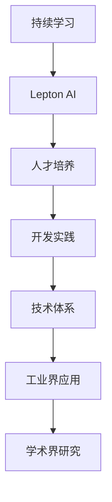

                 

# AI开发的持续学习：Lepton AI的人才培养

> 关键词：持续学习,Lepton AI,人才培养,开发实践,技术体系,工业界应用,学术界研究

## 1. 背景介绍

### 1.1 问题由来
随着人工智能技术的迅猛发展，AI行业对人才的需求日益增长。然而，当前AI教育体系与技术发展之间存在脱节，毕业生难以快速适应工业界的实际需求。特别是在深度学习、自然语言处理(NLP)、计算机视觉(CV)等领域，业内从业者需要掌握多门技术和工具，并且具备丰富的实践经验。为此，Lepton AI提出了一种基于持续学习的AI人才培养方案，旨在帮助开发人员系统性地提升技能，更好地适应AI技术发展的趋势和工业界的实际需求。

### 1.2 问题核心关键点
Lepton AI的人才培养方案，主要围绕以下几个关键点展开：
- **持续学习**：通过构建系统的学习体系，使开发人员不断更新知识和技能，保持与技术发展的同步。
- **实用技能**：强调实践应用，关注工业界实际需求，使人才能够快速上手项目。
- **跨学科融合**：注重培养开发人员的跨学科能力，使其能够胜任多领域AI任务。
- **高质量教育资源**：提供高质量的课程和教学资料，确保教学质量。
- **实战项目**：通过实际项目驱动学习，使开发人员能够将理论知识应用于实际问题。

## 2. 核心概念与联系

### 2.1 核心概念概述

为更好地理解Lepton AI的人才培养方案，我们首先需要对几个核心概念进行解释：

- **持续学习**：是指在职业生涯中，不断通过学习新的知识和技能来适应技术变化和发展趋势。在AI领域，持续学习尤为重要，因为AI技术日新月异，新的算法、工具和框架不断涌现。
- **Lepton AI**：是一个面向开发人员和研究人员提供系统性AI技能培训的在线平台。其课程覆盖从基础到高级的AI技术，包括深度学习、自然语言处理、计算机视觉、强化学习等多个方向。
- **人才培养**：是指通过有计划、有组织的教育和培训活动，使开发人员具备必要的知识和技能，能够胜任特定的AI开发岗位。
- **开发实践**：是指将理论知识应用于实际项目中，通过解决实际问题来提升技能。开发实践是学习AI技术的重要途径，能够帮助开发人员更好地理解和掌握技术细节。

这些核心概念之间的逻辑关系可以通过以下Mermaid流程图来展示：



这个流程图展示了几者的关系：

1. 持续学习是Lepton AI人才培养方案的基础。
2. Lepton AI通过提供系统的课程和资源，帮助开发人员持续学习。
3. 人才培养方案的最终目的是使开发人员具备实际项目开发的能力。
4. 技术体系是Lepton AI人才培养的支撑，包括课程、实践项目等。
5. 工业界应用和学术界研究是Lepton AI人才培养方案的实践目标和理论来源。

## 3. 核心算法原理 & 具体操作步骤
### 3.1 算法原理概述

Lepton AI的人才培养方案，主要基于以下算法原理：

1. **课程设计**：基于工业界和学术界的需求，设计系统化的课程体系，覆盖从基础到高级的AI技术。
2. **技能训练**：通过实践项目和案例分析，使开发人员掌握具体的技术应用。
3. **持续学习**：通过设置定期考核和反馈机制，确保开发人员不断更新知识。
4. **实战项目**：通过实际项目驱动学习，使开发人员能够将理论知识应用于实际问题。

### 3.2 算法步骤详解

Lepton AI的人才培养方案，大致包括以下几个关键步骤：

**Step 1: 准备学习资源**
- 确定课程目标，选择合适的课程内容。
- 准备必要的学习资料，包括教材、代码库、学习视频等。

**Step 2: 设定学习计划**
- 根据课程难度，设定每日或每周的学习任务。
- 分配合理的学习时间，确保有足够时间进行实践和思考。

**Step 3: 开展实践项目**
- 选择合适的实践项目，可以是真实项目，也可以是自己设计的模拟项目。
- 在实践中应用所学知识，解决实际问题。
- 记录实践过程中的经验和发现，形成文档。

**Step 4: 定期反馈和评估**
- 通过课程考核、同行评审等方式，定期评估学习成果。
- 根据评估结果，调整学习计划和实践项目。
- 通过反馈机制，持续改进学习方法和内容。

**Step 5: 应用和反馈**
- 将学到的知识应用到实际项目中，进一步巩固和提升技能。
- 收集反馈意见，优化学习方法和课程内容。

### 3.3 算法优缺点

Lepton AI的人才培养方案具有以下优点：

1. **系统性**：通过设计系统化的课程和实践项目，使开发人员能够全面掌握AI技术。
2. **实战性**：通过实战项目驱动学习，使开发人员能够将理论知识应用于实际问题。
3. **持续性**：通过定期反馈和评估，确保开发人员能够持续更新知识和技能。
4. **灵活性**：根据开发人员的需求和兴趣，灵活调整学习计划和实践项目。
5. **多样化**：课程内容涵盖多个AI方向，开发人员可以根据兴趣和需求选择。

同时，该方案也存在一定的局限性：

1. **时间成本高**：系统化的学习需要大量时间，对于在职人员可能存在时间上的压力。
2. **资源依赖强**：高质量的学习资源和实践项目需要投入大量的时间和精力，对于小型团队可能存在资源瓶颈。
3. **个性化不足**：系统化的课程和实践项目可能无法完全满足每个开发人员的需求。

尽管存在这些局限性，但就目前而言，Lepton AI的人才培养方案依然是大规模人才培养的理想选择，特别是在技术快速发展且工业界对AI人才需求旺盛的背景下。

### 3.4 算法应用领域

Lepton AI的人才培养方案，主要应用于以下几个领域：

1. **工业界AI开发**：为软件开发人员提供系统化的AI培训，使其能够胜任AI开发岗位。
2. **科研机构人才培育**：为研究生和研究助理提供持续学习的平台，提升其科研能力。
3. **高校AI教学**：为高校教师和学生提供高质量的教学资源，提升教学质量。
4. **技术社区学习**：为技术爱好者和自由职业者提供持续学习的途径，提高技能水平。

## 4. 数学模型和公式 & 详细讲解  
### 4.1 数学模型构建

Lepton AI的人才培养方案，主要涉及以下几个数学模型：

1. **学习模型**：用于描述学习过程，包括学习任务、学习进度和反馈机制等。
2. **评估模型**：用于评估学习成果，包括课程考核、项目评审和技能测试等。
3. **实践模型**：用于描述实践项目，包括项目目标、实施步骤和效果评估等。
4. **反馈模型**：用于收集和分析反馈信息，包括反馈来源、反馈内容和反馈处理等。

### 4.2 公式推导过程

以学习模型为例，其基本公式如下：

$$
\text{Learning Progress} = f(\text{Study Hours}, \text{Courses Completed}, \text{Practice Projects})
$$

其中，$f$表示函数关系，$Study Hours$表示学习时间，$Courses Completed$表示完成的课程数量，$Practice Projects$表示完成的实践项目数量。

对于评估模型，其基本公式如下：

$$
\text{Learning Score} = g(\text{Assessment Results}, \text{Feedback Score})
$$

其中，$g$表示函数关系，$Assessment Results$表示评估结果（如考试成绩、项目评审结果等），$Feedback Score$表示反馈评分。

对于实践模型，其基本公式如下：

$$
\text{Practice Effectiveness} = h(\text{Problem Complexity}, \text{Solution Correctness}, \text{Time to Complete})
$$

其中，$h$表示函数关系，$Problem Complexity$表示问题难度，$Solution Correctness$表示解决方案的正确性，$Time to Complete$表示完成任务的时间。

对于反馈模型，其基本公式如下：

$$
\text{Feedback Analysis} = i(\text{Feedback Data}, \text{Feedback Metrics})
$$

其中，$i$表示函数关系，$Feedback Data$表示反馈数据，$Feedback Metrics$表示反馈指标（如满意度、改进建议等）。

### 4.3 案例分析与讲解

以Lepton AI的深度学习课程为例，分析其学习模型和评估模型的构建：

**学习模型**：
- 课程目标：掌握深度学习的基本概念和常用算法。
- 学习进度：每天学习1小时，每周完成3个视频课程，每月完成1个实战项目。
- 学习成果：通过每周测试评估学习进度，每周获得5分的基础分，完成实战项目后获得10分的额外分。

**评估模型**：
- 评估目标：评估学习成果和实践能力。
- 评估指标：课程测试成绩（占比30%）、实战项目评审成绩（占比40%）、技能测试成绩（占比30%）。
- 评估结果：总分达到80分以上，表示该开发人员掌握了深度学习的基础知识，具备一定的实战能力。

## 5. 项目实践：代码实例和详细解释说明
### 5.1 开发环境搭建

在进行Lepton AI的人才培养方案实践前，我们需要准备好开发环境。以下是使用Python进行PyTorch开发的环境配置流程：

1. 安装Anaconda：从官网下载并安装Anaconda，用于创建独立的Python环境。

2. 创建并激活虚拟环境：
```bash
conda create -n pytorch-env python=3.8 
conda activate pytorch-env
```

3. 安装PyTorch：根据CUDA版本，从官网获取对应的安装命令。例如：
```bash
conda install pytorch torchvision torchaudio cudatoolkit=11.1 -c pytorch -c conda-forge
```

4. 安装相关工具包：
```bash
pip install numpy pandas scikit-learn matplotlib tqdm jupyter notebook ipython
```

完成上述步骤后，即可在`pytorch-env`环境中开始项目实践。

### 5.2 源代码详细实现

这里以Lepton AI的深度学习课程为例，给出使用PyTorch进行深度学习项目开发的代码实现。

首先，导入必要的库：

```python
import torch
import torch.nn as nn
import torch.optim as optim
from torch.utils.data import DataLoader
from torchvision import datasets, transforms
```

接着，定义数据预处理函数：

```python
transform = transforms.Compose([
    transforms.Resize((32, 32)),
    transforms.ToTensor(),
    transforms.Normalize(mean=[0.5], std=[0.5])
])
```

然后，加载数据集：

```python
train_dataset = datasets.CIFAR10(root='./data', train=True, download=True, transform=transform)
test_dataset = datasets.CIFAR10(root='./data', train=False, download=True, transform=transform)
```

定义模型和优化器：

```python
model = nn.Sequential(
    nn.Conv2d(3, 32, kernel_size=3, padding=1),
    nn.ReLU(inplace=True),
    nn.MaxPool2d(kernel_size=2, stride=2),
    nn.Linear(32*8*8, 64),
    nn.ReLU(inplace=True),
    nn.Linear(64, 10)
)

criterion = nn.CrossEntropyLoss()
optimizer = optim.Adam(model.parameters(), lr=0.001)
```

最后，进行模型训练和评估：

```python
device = torch.device('cuda') if torch.cuda.is_available() else torch.device('cpu')
model.to(device)

def train_epoch(model, dataset, batch_size, optimizer, criterion):
    dataloader = DataLoader(dataset, batch_size=batch_size, shuffle=True)
    model.train()
    epoch_loss = 0
    for batch in dataloader:
        images, labels = batch[0].to(device), batch[1].to(device)
        optimizer.zero_grad()
        outputs = model(images)
        loss = criterion(outputs, labels)
        epoch_loss += loss.item()
        loss.backward()
        optimizer.step()
    return epoch_loss / len(dataloader)

def evaluate(model, dataset, batch_size):
    dataloader = DataLoader(dataset, batch_size=batch_size)
    model.eval()
    correct = 0
    total = 0
    with torch.no_grad():
        for batch in dataloader:
            images, labels = batch[0].to(device), batch[1].to(device)
            outputs = model(images)
            _, predicted = torch.max(outputs.data, 1)
            total += labels.size(0)
            correct += (predicted == labels).sum().item()
    print('Accuracy: {:.2f}%'.format(correct / total * 100))

epochs = 5
batch_size = 128

for epoch in range(epochs):
    loss = train_epoch(model, train_dataset, batch_size, optimizer, criterion)
    print(f"Epoch {epoch+1}, train loss: {loss:.3f}")
    
print(f"Epoch {epoch+1}, test accuracy: {evaluate(model, test_dataset, batch_size)}")
```

以上就是使用PyTorch进行深度学习项目开发的完整代码实现。可以看到，通过调用PyTorch提供的丰富的API和工具，我们能够快速构建和训练深度学习模型。

### 5.3 代码解读与分析

让我们再详细解读一下关键代码的实现细节：

**数据预处理函数**：
- 使用`transforms.Compose`组合了多个数据预处理步骤，包括调整图像大小、转换为张量、标准化等。

**加载数据集**：
- 使用`datasets.CIFAR10`加载CIFAR-10数据集，指定下载路径和预处理函数。

**模型定义**：
- 使用`nn.Sequential`定义了一个简单的卷积神经网络模型，包括卷积层、池化层、全连接层等。

**优化器和损失函数**：
- 使用`optim.Adam`定义了优化器，使用`nn.CrossEntropyLoss`定义了损失函数。

**模型训练和评估**：
- `train_epoch`函数负责对每个epoch的训练过程，包括前向传播、反向传播和优化。
- `evaluate`函数负责对测试集的评估，计算模型在测试集上的准确率。

可以看到，Lepton AI的人才培养方案不仅重视理论知识的教授，还强调实践项目的实施，通过代码实现和问题解决，使开发人员能够深刻理解和掌握AI技术。

## 6. 实际应用场景
### 6.1 工业界AI开发

Lepton AI的人才培养方案，对于工业界的AI开发人员来说，具有重要的意义：

- **快速上手**：通过系统的课程和实践项目，开发人员能够快速掌握AI开发技能，缩短项目开发周期。
- **提升技能**：通过实战项目，开发人员能够解决实际问题，提升技术水平。
- **适应变化**：通过持续学习和定期反馈，开发人员能够适应技术变化，保持与行业前沿的同步。
- **跨领域应用**：通过多领域课程和项目，开发人员能够胜任跨领域的AI开发任务。

### 6.2 科研机构人才培育

Lepton AI的人才培养方案，同样适用于科研机构的研究生和研究助理：

- **基础知识**：通过系统化的课程，科研人员能够掌握深度学习等AI基础技术。
- **研究能力**：通过实践项目，科研人员能够将理论知识应用于实际研究中，提升研究能力。
- **创新思维**：通过跨学科课程，科研人员能够拓展思维，产生更多的创新想法。
- **发表论文**：通过Lepton AI的课程和资源，科研人员能够提升论文写作和发表能力。

### 6.3 高校AI教学

Lepton AI的人才培养方案，对于高校的AI教学来说，也具有重要的参考价值：

- **教学内容**：Lepton AI提供了高质量的课程和教学资源，高校教师可以参考设计课程内容。
- **教学方法**：通过实践项目和持续学习，高校能够培养具备实际应用能力的毕业生。
- **教学评估**：Lepton AI的评估模型和反馈机制，可以借鉴应用于高校的教学评估中。
- **资源共享**：Lepton AI的资源库，可以供高校师生共享，提升教学质量。

### 6.4 技术社区学习

Lepton AI的人才培养方案，也适用于技术爱好者和自由职业者：

- **自学资源**：Lepton AI提供了高质量的课程和资源，技术爱好者可以自主学习。
- **社区交流**：Lepton AI的在线平台，可以供技术爱好者交流互动，互相学习。
- **项目实践**：通过实践项目，技术爱好者可以检验所学知识，提升技能水平。
- **持续学习**：技术爱好者可以通过Lepton AI的课程和资源，持续更新知识，保持与技术前沿的同步。

## 7. 工具和资源推荐
### 7.1 学习资源推荐

为了帮助开发者系统掌握Lepton AI的人才培养方案，这里推荐一些优质的学习资源：

1. **Lepton AI在线课程**：提供系统化的AI课程和实践项目，涵盖深度学习、自然语言处理、计算机视觉等多个方向。
2. **Coursera AI课程**：由斯坦福大学等知名高校提供的AI课程，适合深度学习和AI基础的学习。
3. **Kaggle竞赛**：参加Kaggle数据科学竞赛，通过解决实际问题提升AI技能。
4. **GitHub项目**：在GitHub上搜索和参与AI项目，积累实战经验。
5. **Arxiv论文**：阅读最新AI研究论文，了解学术前沿。

通过对这些资源的学习实践，相信你一定能够快速掌握Lepton AI的人才培养方案，并用于解决实际的AI问题。

### 7.2 开发工具推荐

高效的开发离不开优秀的工具支持。以下是几款用于Lepton AI开发和学习的常用工具：

1. **PyTorch**：基于Python的开源深度学习框架，灵活动态的计算图，适合快速迭代研究。
2. **TensorFlow**：由Google主导开发的开源深度学习框架，生产部署方便，适合大规模工程应用。
3. **Jupyter Notebook**：交互式编程环境，方便代码调试和结果展示。
4. **Weights & Biases**：模型训练的实验跟踪工具，可以记录和可视化模型训练过程中的各项指标。
5. **TensorBoard**：TensorFlow配套的可视化工具，可实时监测模型训练状态，并提供丰富的图表呈现方式。

合理利用这些工具，可以显著提升Lepton AI开发和学习的效率，加快创新迭代的步伐。

### 7.3 相关论文推荐

Lepton AI的人才培养方案，源于学界的持续研究。以下是几篇奠基性的相关论文，推荐阅读：

1. **"Deep Learning" by Ian Goodfellow, Yoshua Bengio, Aaron Courville**：深度学习领域的经典教材，全面介绍了深度学习的基本概念和算法。
2. **"Natural Language Processing with Transformers" by Thomas Wolf**：Transformer模型的经典教材，详细介绍了Transformer的结构和应用。
3. **"Hands-On Machine Learning with Scikit-Learn, Keras, and TensorFlow" by Aurélien Géron**：机器学习领域的实用教程，适合动手实践和项目开发。
4. **"Learning to Execute in Dialogue" by Aleksey Kurakin et al.**：介绍自然语言处理中的执行学习，适合了解最新的研究动态。
5. **"Deep Learning for NLP" by Emily Bender et al.**：自然语言处理领域的深度学习教程，涵盖语言模型、生成模型等技术。

这些论文代表了大规模人才培养方案的发展脉络。通过学习这些前沿成果，可以帮助开发者把握学科前进方向，激发更多的创新灵感。

## 8. 总结：未来发展趋势与挑战
### 8.1 总结

本文对Lepton AI的人才培养方案进行了全面系统的介绍。首先阐述了Lepton AI人才培养方案的背景和意义，明确了持续学习、实战应用、跨学科融合等关键要素。其次，从原理到实践，详细讲解了学习模型、评估模型、实践模型和反馈模型的构建，提供了完整的代码实现和理论分析。同时，本文还广泛探讨了Lepton AI方案在工业界、科研机构、高校和社区等多个领域的应用前景，展示了其广阔的潜力。

通过本文的系统梳理，可以看到，Lepton AI的人才培养方案是一个系统性、实战性和持续性相结合的综合性人才培养体系，能够有效提升开发人员的AI技能，使其更好地适应工业界和学术界的需求。未来，随着AI技术的不断发展和人才培养体系的不断完善，Lepton AI方案必将在AI开发领域发挥更大的作用，推动AI技术的普及和应用。

### 8.2 未来发展趋势

展望未来，Lepton AI的人才培养方案将呈现以下几个发展趋势：

1. **课程内容更新**：随着AI技术的不断进步，课程内容将不断更新，涵盖最新的技术进展和应用场景。
2. **教学方法创新**：通过引入线上线下混合教学、项目导向学习等新方法，提升教学效果。
3. **学习路径多样化**：针对不同背景和需求的开发人员，提供个性化的学习路径，满足多样化需求。
4. **实战项目丰富化**：通过增加更多高质量的实战项目，提升开发人员的项目实践能力。
5. **跨学科融合深化**：进一步加强跨学科课程的融合，使开发人员具备更全面的知识背景。

以上趋势凸显了Lepton AI人才培养方案的持续优化和提升。通过不断地改进和创新，Lepton AI方案必将在未来的AI开发中发挥更大的作用，培养更多高质量的AI人才。

### 8.3 面临的挑战

尽管Lepton AI的人才培养方案已经取得了显著成效，但在迈向更加智能化、普适化应用的过程中，仍面临诸多挑战：

1. **课程设计复杂**：系统化的课程设计需要投入大量的时间和精力，课程更新和迭代难度较大。
2. **资源投入大**：高质量的教学资源和实践项目需要投入大量的资金和人力资源，对于小型团队可能存在资源瓶颈。
3. **学习效果差异**：不同背景和水平的开发人员，学习效果可能存在差异，如何提高教学效果需要进一步研究。
4. **市场竞争激烈**：市场上已有多家AI培训机构和在线平台，如何保持竞争力和吸引力需要不断创新。
5. **教学质量控制**：如何保证教学质量的一致性和可靠性，确保教学效果和学生满意度。

尽管存在这些挑战，但通过积极应对并寻求突破，Lepton AI的人才培养方案必将不断优化和完善，进一步提升AI人才培养的质量和效果。

### 8.4 研究展望

面对Lepton AI方案面临的种种挑战，未来的研究需要在以下几个方面寻求新的突破：

1. **智能化教学**：引入智能推荐系统，根据学生的学习行为和效果，推荐个性化的学习路径和资源。
2. **自动化评估**：开发自动化评估工具，实时监测学习效果，提供个性化的学习建议。
3. **交互式学习**：通过线上交互式学习平台，增加学生的互动和参与度，提升学习效果。
4. **跨平台支持**：提供多平台支持，方便学生随时随地进行学习。
5. **实时反馈**：通过实时反馈机制，及时调整学习计划和教学策略，提高教学效果。

这些研究方向的探索，必将引领Lepton AI方案向更高的台阶迈进，为开发人员提供更加高效、灵活和个性化的学习体验，推动AI技术在各个领域的广泛应用。

## 9. 附录：常见问题与解答
**Q1：Lepton AI的人才培养方案是否适用于所有开发人员？**

A: Lepton AI的人才培养方案，主要面向对AI技术有较高兴趣和需求的人群，包括软件开发人员、研究生、自由职业者等。但对于技术基础较弱的人群，需要先进行基础知识的补足，再进行系统的学习。

**Q2：如何平衡学习时间和工作时间？**

A: 对于在职人员，可以通过灵活安排时间，利用晚上和周末进行学习，或者选择在线课程，以减少时间和成本的投入。对于自由职业者，可以利用在线平台进行灵活学习，不影响日常工作。

**Q3：如何确保学习效果？**

A: 可以通过定期测试和反馈机制，评估学习进度和效果。对于评估结果较差的开发人员，需要及时调整学习计划和资源。同时，通过小组讨论和项目实践，增强学习效果。

**Q4：如何应对快速变化的技术趋势？**

A: 保持对最新技术动态的关注，参加相关会议和培训，与行业内的专家交流，及时更新知识和技能。可以通过Lepton AI的课程更新和资源库，保持与技术前沿的同步。

**Q5：如何提升实战能力？**

A: 积极参与Lepton AI的实战项目，通过实际问题解决，提升技能水平。同时，可以参加Kaggle竞赛和开源项目，积累实战经验。

---

作者：禅与计算机程序设计艺术 / Zen and the Art of Computer Programming

