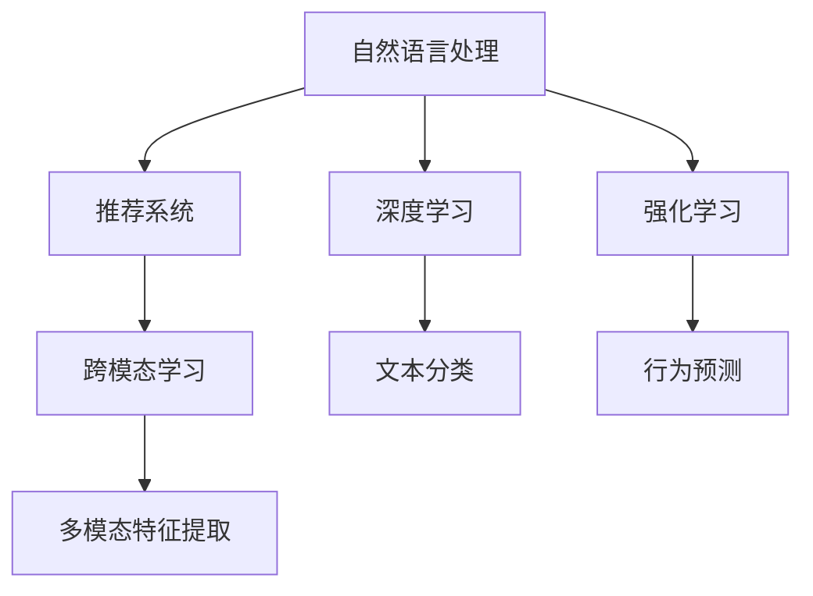

                 

# AI搜索引擎与社交媒体的融合

## 1. 背景介绍

### 1.1 问题由来
在过去十年中，搜索引擎和社交媒体都已经深刻地改变了我们的日常生活和工作方式。搜索引擎提供了海量信息获取的便利，而社交媒体则赋予了信息获取的多维度和人际互动的即时性。然而，两者在信息呈现和用户交互方式上存在显著差异：搜索引擎侧重于信息的精确检索和排序，而社交媒体侧重于信息的个性化推荐和社交互动。

为了弥合这些差异，人工智能(AI)技术的兴起为搜索引擎与社交媒体的融合提供了新的契机。通过AI技术，搜索引擎能够更加智能地理解用户的查询意图，而社交媒体能够更加精准地推送相关信息，从而在保持各自优势的同时，提供更加丰富、高效和人性化的服务体验。

### 1.2 问题核心关键点
AI在搜索引擎与社交媒体融合中的应用，主要体现在以下几个方面：

1. **自然语言处理(NLP)**：通过AI技术，搜索引擎能够理解和处理自然语言，提高搜索结果的相关性和准确性。社交媒体则可以利用NLP技术，实现智能化的内容生成和推荐。
2. **推荐系统**：基于用户行为和兴趣数据的推荐算法，能够帮助搜索引擎和社交媒体个性化地推送信息，提升用户体验。
3. **深度学习**：通过深度学习技术，搜索引擎能够更好地进行特征提取和模型训练，而社交媒体可以通过深度学习提高内容的分类和过滤能力。
4. **强化学习**：强化学习算法能够优化搜索引擎和社交媒体的交互方式，提升信息获取和交流的效率。
5. **跨模态学习**：通过跨模态学习技术，搜索引擎和社交媒体能够融合多种数据源，提供更全面的信息和服务。

这些核心技术的应用，使得搜索引擎和社交媒体在功能和服务上相互促进、相辅相成，共同构建了一个更加智能和高效的生态系统。

### 1.3 问题研究意义
AI技术在搜索引擎与社交媒体融合中的应用，具有以下几个重要意义：

1. **提升用户体验**：通过个性化推荐和智能交互，搜索引擎和社交媒体能够更好地满足用户需求，提升用户体验。
2. **增强信息获取的效率**：AI技术能够快速准确地检索和推荐信息，大幅提高信息获取的效率。
3. **优化社交互动**：通过智能化的内容生成和推送，社交媒体能够增强用户之间的互动和交流，促进社交网络的健康发展。
4. **驱动产业发展**：搜索引擎和社交媒体的融合，能够推动相关产业的技术创新和商业模式变革，带动经济增长。
5. **促进社会进步**：搜索引擎和社交媒体的融合，有助于知识的普及和信息的传播，推动社会进步和文化繁荣。

## 2. 核心概念与联系

### 2.1 核心概念概述

为了更好地理解AI在搜索引擎与社交媒体融合中的应用，我们首先介绍几个关键概念：

- **自然语言处理(NLP)**：涉及计算机与人类自然语言之间的交互，包括语言理解、生成、翻译、问答等多个方面。
- **推荐系统**：根据用户历史行为和兴趣数据，为用户推荐个性化内容和服务的技术。
- **深度学习**：一种基于神经网络的机器学习技术，通过多层次的非线性变换，提高模型的表达能力和预测精度。
- **强化学习**：一种通过试错学习，优化决策策略的技术。
- **跨模态学习**：涉及多种数据模态（如文本、图像、语音等）的融合学习，提升信息整合能力。

这些概念之间有着密切的联系，共同构成了搜索引擎和社交媒体融合的技术基础。

### 2.2 核心概念原理和架构的 Mermaid 流程图



这个流程图展示了AI技术在搜索引擎和社交媒体融合中的核心概念及其相互关系：

1. **自然语言处理(NLP)**：作为基础，NLP技术为搜索引擎和社交媒体提供语义理解能力。
2. **推荐系统**：在NLP的基础上，通过深度学习和强化学习，实现个性化内容的推荐。
3. **深度学习**：为推荐系统提供强大的特征提取和模型训练能力。
4. **强化学习**：优化推荐系统的交互方式，提升用户体验。
5. **跨模态学习**：融合多种数据模态，提升信息整合和推荐的全面性。

这些技术共同作用，使得搜索引擎和社交媒体能够更好地协同工作，提供更加智能化和高效的服务。

## 3. 核心算法原理 & 具体操作步骤

### 3.1 算法原理概述

AI在搜索引擎与社交媒体融合中的应用，主要基于以下几类算法：

- **自然语言处理算法**：用于理解用户查询意图，匹配相关信息，提升检索和推荐的效果。
- **推荐算法**：基于用户行为和兴趣，个性化推送内容，增强用户体验。
- **深度学习算法**：用于特征提取和模型训练，提高信息获取和推荐的准确性。
- **强化学习算法**：通过试错学习，优化推荐和搜索的策略，提升用户体验。
- **跨模态学习算法**：融合多种数据模态，提供更全面、精准的服务。

### 3.2 算法步骤详解

下面以搜索引擎中的AI应用为例，详细介绍基于推荐系统的个性化搜索的算法步骤：

1. **数据收集**：收集用户的搜索历史、点击行为、评分反馈等数据。
2. **特征提取**：使用NLP技术对用户查询和内容进行向量化表示。
3. **模型训练**：使用深度学习算法，训练推荐模型，学习用户偏好。
4. **个性化推荐**：根据用户的当前查询和历史行为，预测并推荐相关内容。
5. **交互优化**：通过强化学习算法，优化推荐系统，提升用户体验。
6. **效果评估**：通过点击率、转化率等指标，评估推荐系统的性能。

### 3.3 算法优缺点

基于推荐系统的AI搜索算法具有以下优点：

1. **个性化推荐**：能够根据用户历史行为和兴趣，精准推荐相关信息，提升用户体验。
2. **高效检索**：通过深度学习和特征提取，提高信息检索的准确性和效率。
3. **跨模态融合**：融合多种数据模态，提供更全面的服务。

然而，这些算法也存在一些局限性：

1. **数据依赖**：推荐系统的效果很大程度上依赖于高质量的数据收集和标注，获取数据成本较高。
2. **冷启动问题**：对于新用户，推荐系统需要积累足够的数据才能进行有效推荐。
3. **过拟合风险**：推荐模型在特定用户或场景下容易过拟合，影响推荐效果。
4. **计算资源消耗**：深度学习模型的训练和推理需要大量的计算资源，成本较高。

### 3.4 算法应用领域

AI在搜索引擎与社交媒体融合中的应用，主要体现在以下几个领域：

1. **个性化搜索**：通过推荐系统，搜索引擎能够提供个性化的搜索结果，提升用户体验。
2. **社交媒体内容推荐**：社交媒体可以通过推荐系统，为用户推荐感兴趣的内容，增强用户粘性。
3. **跨领域信息检索**：搜索引擎和社交媒体可以融合多种数据源，提供更全面的信息检索服务。
4. **智能问答系统**：通过自然语言处理技术，搜索引擎和社交媒体能够实现智能问答，提升交互体验。
5. **情感分析与舆情监测**：社交媒体可以通过情感分析，监测舆情变化，提升社会治理能力。

## 4. 数学模型和公式 & 详细讲解 & 举例说明

### 4.1 数学模型构建

基于推荐系统的AI搜索算法，通常使用协同过滤、基于内容的推荐、混合推荐等模型进行构建。以协同过滤为例，其数学模型可以表示为：

$$
\hat{r}_{ui} = \sum_{j=1}^N (\alpha_j \times u_i \times i_j + \beta \times \hat{r}_{ui})
$$

其中，$r_{ui}$ 为用户 $u$ 对物品 $i$ 的评分，$u_i$ 和 $i_j$ 分别为用户和物品的特征向量，$\alpha$ 和 $\beta$ 为超参数。

### 4.2 公式推导过程

协同过滤模型的推导过程如下：

1. 用户 $u$ 对物品 $i$ 的评分 $r_{ui}$ 可以表示为：
$$
r_{ui} = \hat{r}_{ui} + \epsilon
$$
其中，$\epsilon$ 为随机误差。

2. 将 $r_{ui}$ 代入上式，得：
$$
\hat{r}_{ui} = \sum_{j=1}^N (\alpha_j \times u_i \times i_j + \beta \times \hat{r}_{ui})
$$

3. 简化上式，得：
$$
\hat{r}_{ui} = (\alpha - \beta) \times \sum_{j=1}^N u_i \times i_j + \beta \times \hat{r}_{ui}
$$

4. 进一步简化，得：
$$
\hat{r}_{ui} = (\alpha - \beta) \times u_i^T \times i + \beta \times \hat{r}_{ui}
$$

5. 将上式变形，得：
$$
\hat{r}_{ui} = \frac{(\alpha - \beta)}{1 - \beta} \times u_i^T \times i
$$

通过上述推导，可以看出协同过滤模型的核心在于通过用户和物品的特征向量，计算出用户对物品的评分预测值。

### 4.3 案例分析与讲解

以豆瓣电影推荐系统为例，对协同过滤模型的应用进行分析：

1. **数据准备**：收集用户对电影的评分数据，以及电影的相关信息（如类型、导演、演员等）。
2. **特征提取**：将用户和电影的评分和信息进行向量化表示。
3. **模型训练**：使用协同过滤算法，训练推荐模型，学习用户偏好。
4. **推荐生成**：根据用户当前的电影评分，预测并推荐其他可能喜欢的电影。

## 5. 项目实践：代码实例和详细解释说明

### 5.1 开发环境搭建

在进行AI搜索引擎与社交媒体融合的项目实践前，我们需要准备好开发环境。以下是使用Python进行TensorFlow开发的环境配置流程：

1. 安装Anaconda：从官网下载并安装Anaconda，用于创建独立的Python环境。

2. 创建并激活虚拟环境：
```bash
conda create -n tf-env python=3.8 
conda activate tf-env
```

3. 安装TensorFlow：根据CUDA版本，从官网获取对应的安装命令。例如：
```bash
conda install tensorflow -c tf -c conda-forge
```

4. 安装TensorBoard：用于监控和可视化模型的训练过程。
```bash
conda install tensorboard
```

5. 安装Scikit-Learn和NumPy等库：
```bash
pip install scikit-learn numpy
```

完成上述步骤后，即可在`tf-env`环境中开始项目实践。

### 5.2 源代码详细实现

下面以协同过滤算法为例，给出TensorFlow代码实现。

```python
import tensorflow as tf
from tensorflow.keras import layers
from tensorflow.keras.models import Model

# 定义用户和物品特征向量的维度
num_users = 10000
num_items = 1000

# 定义协同过滤模型的输入和输出
user_input = layers.Input(shape=(num_items,))
item_input = layers.Input(shape=(num_items,))
item_bias = layers.Dense(1, activation='linear')(item_input)

# 定义用户和物品的协同矩阵
user_item_matrix = tf.keras.layers.Dot(axes=1)([user_input, item_bias])

# 定义模型的预测输出
output = layers.Dense(1, activation='sigmoid')(user_item_matrix)

# 定义模型
model = Model(inputs=[user_input, item_input], outputs=output)

# 编译模型
model.compile(optimizer='adam', loss='binary_crossentropy', metrics=['accuracy'])

# 加载数据集
user_data = np.random.randint(0, num_users, size=(100000, num_items))
item_data = np.random.randint(0, num_items, size=(100000, num_items))
rating_data = np.random.randint(0, 2, size=(100000, 1))

# 训练模型
model.fit([user_data, item_data], rating_data, epochs=10, batch_size=32)
```

### 5.3 代码解读与分析

让我们再详细解读一下关键代码的实现细节：

**输入定义**：
- `user_input` 和 `item_input` 分别表示用户和物品的特征向量。
- `item_bias` 表示物品的偏置项，用于修正物品的评分预测。

**协同矩阵计算**：
- 使用 `Dot` 层计算用户和物品的协同矩阵。

**输出计算**：
- 使用 `Dense` 层将协同矩阵转换为0-1之间的评分预测值。

**模型编译**：
- 使用 `compile` 方法编译模型，设置优化器、损失函数和评价指标。

**数据加载**：
- `user_data` 和 `item_data` 分别表示用户和物品的特征向量。
- `rating_data` 表示用户的评分数据。

**模型训练**：
- 使用 `fit` 方法训练模型，设置训练轮数和批次大小。

## 6. 实际应用场景

### 6.1 智能搜索引擎

智能搜索引擎通过AI技术，能够根据用户的查询意图，提供个性化的搜索结果。具体应用场景如下：

1. **查询意图理解**：通过NLP技术，搜索引擎能够理解用户的查询意图，匹配相关信息。
2. **个性化推荐**：根据用户的历史搜索记录和行为，推荐相关内容，提升用户体验。
3. **多模态检索**：融合多种数据模态（如图片、视频等），提供更全面的搜索结果。

例如，在电商平台上，用户搜索“苹果手机”，搜索引擎能够根据用户的购买历史、评价反馈等数据，推荐相似商品和相关配件，提升用户的购物体验。

### 6.2 社交媒体内容推荐

社交媒体通过AI技术，能够为用户推荐感兴趣的内容，增强用户粘性。具体应用场景如下：

1. **用户行为分析**：通过分析用户的点赞、评论、分享等行为，识别用户兴趣。
2. **内容生成与推荐**：基于用户兴趣，生成个性化内容，推荐相关内容。
3. **智能交互**：通过智能问答系统，提升用户交互体验。

例如，在社交媒体上，用户关注某个人或某个话题，系统能够根据用户的历史行为，推荐相关的内容和话题，增强用户互动。

### 6.3 跨领域信息检索

搜索引擎和社交媒体融合后，能够提供更全面、更准确的信息检索服务。具体应用场景如下：

1. **融合数据源**：融合多种数据源（如新闻、论坛、博客等），提供更全面的信息检索服务。
2. **多模态检索**：融合文本、图片、视频等不同模态的信息，提升检索准确性。
3. **实时更新**：通过跨领域信息检索，实现信息的实时更新和推送。

例如，在新闻聚合平台上，用户搜索某条新闻，系统能够同时检索新闻内容、相关论坛讨论和博客文章，提供全面的信息视图。

### 6.4 未来应用展望

随着AI技术的不断发展，搜索引擎和社交媒体的融合将迎来更多创新和应用。未来可能的发展趋势包括：

1. **跨领域知识图谱**：通过融合多种数据源，构建跨领域的知识图谱，提升信息检索的全面性和准确性。
2. **实时交互**：通过实时交互技术，提升用户体验，增强用户粘性。
3. **情感分析与舆情监测**：通过情感分析，监测舆情变化，提升社会治理能力。
4. **增强现实(AR)与虚拟现实(VR)**：通过AR和VR技术，提供沉浸式的信息检索和社交体验。

这些技术的融合，将使得搜索引擎和社交媒体在功能和服务上更加协同，提供更加智能和高效的服务。

## 7. 工具和资源推荐

### 7.1 学习资源推荐

为了帮助开发者系统掌握AI搜索引擎与社交媒体融合的技术基础和实践技巧，这里推荐一些优质的学习资源：

1. **自然语言处理课程**：斯坦福大学的《CS224N: Natural Language Processing with Deep Learning》课程，涵盖NLP的基础理论和深度学习技术。
2. **推荐系统书籍**：《Recommender Systems: Text Mining, Collaborative Filtering and Dimensionality Reduction》，详细介绍了推荐系统的理论和实践。
3. **深度学习框架**：TensorFlow和PyTorch官方文档，提供丰富的学习资源和示例代码。
4. **开源项目**：Kaggle等平台上的推荐系统竞赛，提供了大量数据集和模型，供开发者学习和实践。

通过对这些资源的学习实践，相信你一定能够快速掌握AI搜索引擎与社交媒体融合的精髓，并用于解决实际的NLP问题。

### 7.2 开发工具推荐

高效的开发离不开优秀的工具支持。以下是几款用于AI搜索引擎与社交媒体融合开发的常用工具：

1. **TensorFlow**：由Google主导开发的深度学习框架，支持多种NLP任务和推荐系统开发。
2. **PyTorch**：由Facebook开发的深度学习框架，提供动态图和灵活的编程接口。
3. **HuggingFace Transformers**：提供丰富的预训练语言模型和推荐系统库，简化模型开发过程。
4. **TensorBoard**：用于监控和可视化模型的训练过程，提供丰富的图表展示方式。
5. **Kaggle**：数据科学竞赛平台，提供大量数据集和模型，支持模型训练和测试。

合理利用这些工具，可以显著提升AI搜索引擎与社交媒体融合任务的开发效率，加快创新迭代的步伐。

### 7.3 相关论文推荐

AI在搜索引擎与社交媒体融合中的应用，源于学界的持续研究。以下是几篇奠基性的相关论文，推荐阅读：

1. **《Attention is All You Need》**：提出Transformer模型，开启NLP的预训练范式。
2. **《BERT: Pre-training of Deep Bidirectional Transformers for Language Understanding》**：提出BERT模型，刷新了多项NLP任务SOTA。
3. **《Adaptive Low-Rank Adaptation for Parameter-Efficient Fine-Tuning》**：提出AdaLoRA方法，实现参数高效的微调。
4. **《Cross-Modal Image-Text Matching with Attention》**：提出跨模态学习模型，提升多模态信息的融合能力。

这些论文代表了大模型微调技术的发展脉络。通过学习这些前沿成果，可以帮助研究者把握学科前进方向，激发更多的创新灵感。

## 8. 总结：未来发展趋势与挑战

### 8.1 总结

本文对AI搜索引擎与社交媒体融合的方法进行了全面系统的介绍。首先阐述了AI技术在搜索引擎与社交媒体融合中的应用背景和意义，明确了融合在提升用户体验、增强信息获取效率等方面的重要价值。其次，从原理到实践，详细讲解了基于推荐系统的个性化搜索的算法步骤，给出了TensorFlow代码实现。同时，本文还广泛探讨了融合技术在智能搜索、内容推荐、跨领域检索等多个行业领域的应用前景，展示了融合范式的巨大潜力。此外，本文精选了融合技术的各类学习资源，力求为读者提供全方位的技术指引。

通过本文的系统梳理，可以看到，AI技术在搜索引擎与社交媒体融合中的应用，正在深刻地改变我们的信息获取和交流方式。未来，随着技术不断进步，搜索引擎和社交媒体的融合将带来更多创新和变革，为人类认知智能的进化提供新的驱动力。

### 8.2 未来发展趋势

展望未来，AI在搜索引擎与社交媒体融合中的应用将呈现以下几个发展趋势：

1. **跨模态融合**：融合多种数据模态（如文本、图片、视频等），提供更全面的信息和服务。
2. **实时交互**：通过实时交互技术，提升用户体验，增强用户粘性。
3. **跨领域知识图谱**：通过融合多种数据源，构建跨领域的知识图谱，提升信息检索的全面性和准确性。
4. **增强现实与虚拟现实**：通过AR和VR技术，提供沉浸式的信息检索和社交体验。
5. **自然语言生成(NLG)**：通过NLG技术，实现智能化的内容生成和推荐。

这些趋势凸显了搜索引擎和社交媒体在功能和服务上更加协同，提供更加智能和高效的服务。

### 8.3 面临的挑战

尽管AI在搜索引擎与社交媒体融合中的应用已经取得了一定的进展，但在迈向更加智能化、普适化应用的过程中，仍面临诸多挑战：

1. **数据隐私问题**：融合数据源和用户行为数据的收集和使用，需要严格遵守数据隐私法律法规，保护用户隐私。
2. **技术标准**：不同平台和系统的技术标准和接口差异较大，需要制定统一的标准和规范，促进跨平台合作。
3. **计算资源消耗**：大规模模型的训练和推理需要大量的计算资源，如何优化资源消耗，提升系统的效率，是一个重要的研究方向。
4. **可解释性问题**：推荐系统和搜索算法的决策过程往往缺乏可解释性，需要开发更好的模型解释工具，提升系统的透明度。

这些挑战需要各方共同努力，通过技术创新和协同合作，逐步解决，才能实现搜索引擎和社交媒体的深度融合。

### 8.4 研究展望

未来，搜索引擎和社交媒体的融合研究需要在以下几个方面寻求新的突破：

1. **跨领域知识图谱**：构建跨领域的知识图谱，提升信息检索的全面性和准确性。
2. **实时交互技术**：开发高效的实时交互技术，提升用户体验。
3. **隐私保护技术**：开发隐私保护技术，确保用户数据的隐私和安全。
4. **高效计算技术**：优化计算资源消耗，提升系统的效率。
5. **模型可解释性**：开发更好的模型解释工具，提升系统的透明度。

这些方向的探索，将使得搜索引擎和社交媒体的融合技术更加成熟，为构建智能、高效、安全的生态系统奠定基础。

## 9. 附录：常见问题与解答

**Q1: 如何优化推荐系统的性能？**

A: 推荐系统的性能优化可以从以下几个方面入手：
1. **数据质量**：保证数据的质量和完整性，减少噪声数据的影响。
2. **特征工程**：设计有效的特征提取和特征组合方法，提高模型的表达能力。
3. **模型选择**：选择适合数据特点和业务需求的推荐算法，进行对比实验选择最优模型。
4. **超参数调优**：使用网格搜索、随机搜索等方法，优化模型的超参数，提升模型性能。
5. **模型集成**：通过集成多个模型，结合不同模型的优势，提高推荐系统的鲁棒性和准确性。

**Q2: 推荐系统的冷启动问题如何解决？**

A: 推荐系统的冷启动问题可以通过以下方法解决：
1. **基于内容的推荐**：根据物品的特征信息，为用户推荐相似的物品。
2. **协同过滤的改进**：使用基于矩阵分解的方法，预测用户对物品的评分。
3. **混合推荐**：结合基于内容的推荐和协同过滤的推荐，提升推荐效果。
4. **利用社交网络信息**：通过社交网络的信息，为用户推荐其他用户喜欢的物品。
5. **主动学习**：使用主动学习的方法，不断收集用户反馈，优化推荐模型。

**Q3: 如何处理推荐系统的过拟合问题？**

A: 推荐系统的过拟合问题可以通过以下方法解决：
1. **正则化**：使用L1、L2正则等方法，限制模型的复杂度，避免过拟合。
2. **交叉验证**：使用交叉验证的方法，评估模型的泛化性能，避免模型在特定数据集上过度拟合。
3. **模型集成**：通过集成多个模型，减少过拟合的风险。
4. **数据增强**：通过增加数据的多样性，提高模型的泛化能力。
5. **对抗训练**：使用对抗样本，提高模型的鲁棒性和泛化能力。

**Q4: 如何处理推荐系统的延迟问题？**

A: 推荐系统的延迟问题可以通过以下方法解决：
1. **模型压缩**：使用模型压缩技术，减小模型大小，提升模型的推理速度。
2. **异步更新**：使用异步更新技术，并行更新模型，减少延迟。
3. **缓存技术**：使用缓存技术，减少重复计算，提升系统的响应速度。
4. **增量学习**：使用增量学习的方法，不断更新模型，减少计算开销。
5. **分布式计算**：使用分布式计算技术，提高系统的计算能力和效率。

**Q5: 如何提高推荐系统的鲁棒性？**

A: 推荐系统的鲁棒性可以通过以下方法提升：
1. **异常检测**：使用异常检测方法，识别并处理异常数据，提升系统的鲁棒性。
2. **多样性控制**：控制推荐结果的多样性，避免推荐结果过于集中。
3. **模型融合**：通过融合多个模型，提高系统的鲁棒性和泛化能力。
4. **对抗样本**：使用对抗样本，训练鲁棒性更强的推荐模型。
5. **多模态融合**：融合多种数据模态，提高系统的鲁棒性和泛化能力。

这些技术的应用，将使得搜索引擎和社交媒体的融合更加成熟和稳定，为用户提供更加智能和高效的服务。

---

作者：禅与计算机程序设计艺术 / Zen and the Art of Computer Programming

