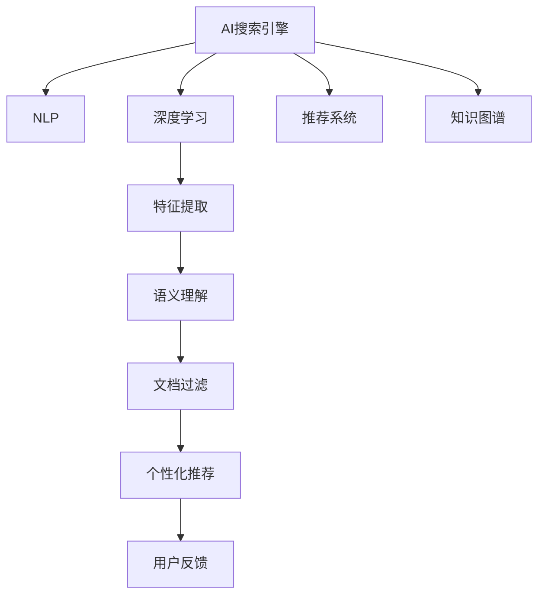

                 

## 1. 背景介绍

### 1.1 问题由来

随着互联网信息量的爆炸性增长，搜索引擎成为了人们获取信息的主要方式。传统的搜索引擎，如Google、Bing等，主要依赖关键词匹配算法，帮助用户在海量网页中找到最相关的搜索结果。但随着用户需求的多样化和个性化，简单关键词匹配已无法满足用户对高质量、精准信息的渴望。

在专业领域，如医疗、法律、金融等，信息质量和专业性要求更高，传统搜索引擎难以提供足够可靠的信息。例如，在医疗领域，患者需要找到具体病症的诊断和治疗信息，而搜索引擎返回的网页往往缺乏专业知识背景，可能误导患者。在金融领域，投资者需要快速获取行业报告、市场动态等关键信息，而传统搜索引擎难以精准推荐。

面对专业领域信息需求，一种新的搜索引擎范式应运而生——AI搜索引擎。AI搜索引擎利用人工智能技术和深度学习算法，根据用户查询语义和上下文信息，自动获取最相关的专业信息，提供更准确、全面的搜索结果。

### 1.2 问题核心关键点

AI搜索引擎的核心在于其智能化的信息检索和推荐能力。其核心挑战包括：

- **智能理解查询语义**：能够理解用户的查询意图和语义背景，过滤掉无关信息，精准定位专业文档和资料。
- **专业信息过滤**：在海量数据中识别出最相关的专业文档和资料，避免信息过载和误导。
- **个性化推荐**：根据用户的历史行为和偏好，推荐个性化的专业信息，提高用户体验。
- **动态学习**：随着领域知识的变化和用户需求的演进，能够动态更新检索模型，保持检索性能的稳定性和时效性。

通过这些技术突破，AI搜索引擎在专业领域的应用前景广阔，成为提高信息获取效率和质量的重要手段。

## 2. 核心概念与联系

### 2.1 核心概念概述

为了更好地理解AI搜索引擎的工作原理和优化方向，本节将介绍几个密切相关的核心概念：

- **AI搜索引擎**：利用人工智能技术，结合深度学习算法和自然语言处理(NLP)技术，智能地从海量数据中过滤和推荐专业信息的搜索引擎。
- **自然语言处理(NLP)**：涉及文本处理、语义分析、情感分析、机器翻译等技术，使计算机能够理解和生成人类语言。
- **深度学习**：通过多层神经网络，自动学习数据特征，应用于图像识别、语音识别、自然语言处理等领域。
- **推荐系统**：根据用户的历史行为和偏好，自动推荐个性化的产品或内容，广泛应用在电商、社交媒体等领域。
- **知识图谱**：将现实世界的实体和关系表示为图形结构，用于知识获取、推理和推理等任务，能够增强搜索引擎的专业性和准确性。

这些核心概念之间的逻辑关系可以通过以下Mermaid流程图来展示：



这个流程图展示了大语言模型的核心概念及其之间的关系：

1. AI搜索引擎利用深度学习技术进行特征提取和语义理解。
2. 自然语言处理技术用于理解查询语义和文档内容。
3. 推荐系统根据用户行为和偏好进行个性化推荐。
4. 知识图谱用于增强搜索结果的专业性和准确性。

这些核心概念共同构成了AI搜索引擎的学习和应用框架，使其能够在各种场景下发挥强大的信息检索能力。通过理解这些核心概念，我们可以更好地把握AI搜索引擎的工作原理和优化方向。

## 3. 核心算法原理 & 具体操作步骤
### 3.1 算法原理概述

AI搜索引擎的算法原理基于信息检索和推荐系统。其核心思想是：利用人工智能技术和深度学习算法，对用户查询语义和文档内容进行语义理解和匹配，并结合用户行为和领域知识，动态推荐最相关的专业信息。

形式化地，假设用户查询为 $q$，文档集为 $D$，每个文档 $d \in D$ 对应的特征向量为 $\boldsymbol{v}_d$。AI搜索引擎的目标是找到与查询最相关的文档集合 $R_q$，满足：

$$
R_q = \mathop{\arg\min}_{R} \mathcal{L}(q, D, R)
$$

其中 $\mathcal{L}$ 为损失函数，用于衡量文档集合 $R$ 与查询 $q$ 的匹配程度。通常使用余弦相似度、TF-IDF等方法计算查询与文档的匹配度，并用交叉熵等损失函数优化。

在推荐系统部分，可以假设用户对文档的评分 $r_{u,i}$ 为二元评分（0/1）或连续评分。则推荐系统目标为：

$$
\hat{r}_{u,i} = \mathop{\arg\min}_{r} \mathcal{L}(u, i, r)
$$

其中 $\hat{r}_{u,i}$ 为模型预测的用户对文档 $i$ 的评分，$\mathcal{L}$ 为损失函数。常用的优化目标函数包括均方误差（MSE）、均方根误差（RMSE）等。

### 3.2 算法步骤详解

AI搜索引擎的核心算法步骤如下：

**Step 1: 数据预处理**
- 收集专业领域的数据集，如医学文献、法律文书、金融报告等。
- 对文本进行分词、去除停用词、词干提取等预处理，构建词汇表。
- 利用知识图谱等外部知识对数据进行标注，构建领域知识库。

**Step 2: 模型训练**
- 利用深度学习模型，如BERT、RNN、CNN等，对查询和文档进行编码，提取语义特征。
- 使用监督学习算法，如SVM、随机森林、神经网络等，训练文档过滤和推荐模型。
- 结合领域知识，利用知识图谱增强模型性能。

**Step 3: 模型推理**
- 对于新查询，输入模型进行推理，得到相关文档的评分。
- 根据用户的历史行为和偏好，进行个性化推荐。
- 实时更新模型参数，保持模型性能的稳定性和时效性。

**Step 4: 用户反馈**
- 收集用户对搜索结果的反馈，包括点击率、阅读时长、评分等。
- 利用用户反馈，动态调整模型参数，提高推荐效果。

**Step 5: 系统集成**
- 将模型集成到搜索引擎中，提供实时搜索和推荐功能。
- 与外部知识库和API接口进行数据交互，增强搜索结果的专业性。

### 3.3 算法优缺点

AI搜索引擎具有以下优点：
1. 高度智能化：通过深度学习模型和自然语言处理技术，自动理解查询语义和文档内容，过滤无关信息。
2. 专业性增强：结合知识图谱和外部知识，提高搜索结果的准确性和专业性。
3. 个性化推荐：根据用户行为和偏好，提供个性化的信息推荐，提升用户体验。
4. 动态学习：通过用户反馈和实时更新，动态优化模型，保持检索性能的稳定性和时效性。

同时，该算法也存在一定的局限性：
1. 数据依赖性强：依赖高质量的专业领域数据集，获取和标注成本较高。
2. 模型复杂度高：深度学习模型的训练和推理计算量大，需要高性能计算资源。
3. 知识更新慢：知识图谱和领域知识库的更新周期较长，难以快速适应领域知识的变化。
4. 数据隐私问题：用户查询和点击行为可能涉及隐私，需要合理处理和保护。

尽管存在这些局限性，但就目前而言，AI搜索引擎在专业领域的应用效果显著，将成为提高信息获取效率和质量的重要手段。

### 3.4 算法应用领域

AI搜索引擎在多个领域都有广泛应用：

- **医疗领域**：利用医学文献和知识图谱，智能推荐疾病诊断、治疗方案等信息，帮助医生诊断和治疗疾病。
- **法律领域**：对法律文书进行语义理解和分类，推荐相关法律条款和案例，提高法律事务处理效率。
- **金融领域**：分析金融报告和市场数据，推荐投资策略和风险预警，辅助投资者决策。
- **科研领域**：通过学术论文和知识图谱，智能推荐相关研究领域和论文，促进科研交流和合作。
- **教育领域**：利用在线教育资源和知识图谱，推荐个性化学习内容，辅助学生自主学习。

除了这些传统应用场景外，AI搜索引擎在更多领域也有创新性应用，如自动问答、智能客服、自动化文档生成等，为不同行业的信息检索和知识管理提供了新方案。

## 4. 数学模型和公式 & 详细讲解 & 举例说明
### 4.1 数学模型构建

本节将使用数学语言对AI搜索引擎的工作原理进行更加严格的刻画。

假设查询 $q$ 和文档集合 $D$ 中的文档 $d$ 分别为向量形式，记为 $\boldsymbol{q}$ 和 $\boldsymbol{d}$，对应的语义向量分别为 $\boldsymbol{v}_q$ 和 $\boldsymbol{v}_d$。则查询和文档的匹配度 $M$ 可以表示为余弦相似度：

$$
M = \cos(\theta) = \frac{\boldsymbol{v}_q \cdot \boldsymbol{v}_d}{\|\boldsymbol{v}_q\|\|\boldsymbol{v}_d\|}
$$

其中 $\cdot$ 表示向量点积，$\| \cdot \|$ 表示向量范数。

### 4.2 公式推导过程

对于给定查询 $q$ 和文档集合 $D$，利用深度学习模型 $f$ 对查询和文档进行编码，得到语义向量 $\boldsymbol{v}_q = f(q)$ 和 $\boldsymbol{v}_d = f(d)$。则查询和文档的匹配度 $M$ 可以表示为：

$$
M = \cos(\theta) = \frac{\boldsymbol{v}_q \cdot \boldsymbol{v}_d}{\|\boldsymbol{v}_q\|\|\boldsymbol{v}_d\|} = \frac{\boldsymbol{q}^T \boldsymbol{d}}{\|\boldsymbol{q}\|\|\boldsymbol{d}\|}
$$

其中 $\boldsymbol{q}^T \boldsymbol{d}$ 为查询和文档的向量点积。

为了将匹配度转化为评分，通常将余弦相似度映射为0-1之间的实数。例如，可以使用sigmoid函数进行映射：

$$
\hat{r}_{u,i} = \sigma(\alpha M + \beta)
$$

其中 $\sigma$ 为sigmoid函数，$\alpha$ 和 $\beta$ 为可调参数，$u$ 为用户，$i$ 为文档。

### 4.3 案例分析与讲解

以医疗领域为例，具体分析AI搜索引擎的工作流程。

**Step 1: 数据预处理**
- 收集医疗领域的数据集，包括病历、临床指南、医学文献等。
- 对文本进行分词、去除停用词、词干提取等预处理，构建词汇表。
- 利用知识图谱对数据进行标注，构建领域知识库，如疾病、症状、治疗方案等。

**Step 2: 模型训练**
- 利用BERT等深度学习模型，对查询和文档进行编码，提取语义特征。
- 使用监督学习算法，如随机森林、神经网络等，训练文档过滤和推荐模型。
- 结合领域知识，利用知识图谱增强模型性能，如引入疾病关联关系等。

**Step 3: 模型推理**
- 对于新查询，输入模型进行推理，得到相关文档的评分。
- 根据用户的历史行为和偏好，进行个性化推荐，如优先推荐已成功治愈的病例。
- 实时更新模型参数，保持模型性能的稳定性和时效性，如定期更新知识图谱。

**Step 4: 用户反馈**
- 收集用户对搜索结果的反馈，包括点击率、阅读时长、评分等。
- 利用用户反馈，动态调整模型参数，提高推荐效果，如调整推荐算法的权重。

**Step 5: 系统集成**
- 将模型集成到搜索引擎中，提供实时搜索和推荐功能。
- 与外部知识库和API接口进行数据交互，增强搜索结果的专业性。

## 5. 项目实践：代码实例和详细解释说明
### 5.1 开发环境搭建

在进行AI搜索引擎实践前，我们需要准备好开发环境。以下是使用Python进行PyTorch开发的环境配置流程：

1. 安装Anaconda：从官网下载并安装Anaconda，用于创建独立的Python环境。

2. 创建并激活虚拟环境：
```bash
conda create -n pytorch-env python=3.8 
conda activate pytorch-env
```

3. 安装PyTorch：根据CUDA版本，从官网获取对应的安装命令。例如：
```bash
conda install pytorch torchvision torchaudio cudatoolkit=11.1 -c pytorch -c conda-forge
```

4. 安装必要的第三方库：
```bash
pip install pandas numpy scikit-learn transformers
```

5. 安装PyTorch预训练模型：
```bash
pip install transformers
```

完成上述步骤后，即可在`pytorch-env`环境中开始搜索引擎的开发。

### 5.2 源代码详细实现

这里我们以医疗领域为例，给出使用Transformers库进行深度学习模型训练和推荐系统构建的PyTorch代码实现。

首先，定义深度学习模型的结构：

```python
from transformers import BertModel, BertTokenizer
from torch import nn
from torch.nn import BCEWithLogitsLoss

class BERTClassifier(nn.Module):
    def __init__(self, num_labels):
        super(BERTClassifier, self).__init__()
        self.bert = BertModel.from_pretrained('bert-base-uncased')
        self.classifier = nn.Linear(self.bert.config.hidden_size, num_labels)
        self.dropout = nn.Dropout(0.1)

    def forward(self, input_ids, attention_mask):
        outputs = self.bert(input_ids, attention_mask=attention_mask)
        pooled_output = outputs.pooler_output
        logits = self.classifier(pooled_output)
        return logits, attention_mask
```

然后，定义推荐系统的损失函数和优化器：

```python
criterion = BCEWithLogitsLoss()
optimizer = AdamW(model.parameters(), lr=2e-5)
```

接着，定义训练和评估函数：

```python
from torch.utils.data import Dataset, DataLoader

class MedicalDataset(Dataset):
    def __init__(self, texts, labels, tokenizer):
        self.texts = texts
        self.labels = labels
        self.tokenizer = tokenizer
        
    def __len__(self):
        return len(self.texts)
    
    def __getitem__(self, item):
        text = self.texts[item]
        label = self.labels[item]
        
        encoding = self.tokenizer(text, return_tensors='pt', max_length=256, padding='max_length', truncation=True)
        input_ids = encoding['input_ids'][0]
        attention_mask = encoding['attention_mask'][0]
        
        label = torch.tensor(label, dtype=torch.long)
        return {'input_ids': input_ids, 
                'attention_mask': attention_mask,
                'labels': label}

# 数据加载器
train_dataset = MedicalDataset(train_texts, train_labels, tokenizer)
dev_dataset = MedicalDataset(dev_texts, dev_labels, tokenizer)
test_dataset = MedicalDataset(test_texts, test_labels, tokenizer)

# 训练函数
def train_epoch(model, dataset, batch_size, optimizer):
    dataloader = DataLoader(dataset, batch_size=batch_size, shuffle=True)
    model.train()
    epoch_loss = 0
    for batch in dataloader:
        input_ids = batch['input_ids'].to(device)
        attention_mask = batch['attention_mask'].to(device)
        labels = batch['labels'].to(device)
        model.zero_grad()
        outputs = model(input_ids, attention_mask=attention_mask)
        loss = criterion(outputs[0], labels)
        epoch_loss += loss.item()
        loss.backward()
        optimizer.step()
    return epoch_loss / len(dataloader)

# 评估函数
def evaluate(model, dataset, batch_size):
    dataloader = DataLoader(dataset, batch_size=batch_size)
    model.eval()
    preds, labels = [], []
    with torch.no_grad():
        for batch in dataloader:
            input_ids = batch['input_ids'].to(device)
            attention_mask = batch['attention_mask'].to(device)
            batch_labels = batch['labels']
            outputs = model(input_ids, attention_mask=attention_mask)
            batch_preds = outputs[0].argmax(dim=1).to('cpu').tolist()
            batch_labels = batch_labels.to('cpu').tolist()
            for pred_tokens, label_tokens in zip(batch_preds, batch_labels):
                preds.append(pred_tokens)
                labels.append(label_tokens)
    print(classification_report(labels, preds))
```

最后，启动训练流程并在测试集上评估：

```python
epochs = 5
batch_size = 16

for epoch in range(epochs):
    loss = train_epoch(model, train_dataset, batch_size, optimizer)
    print(f"Epoch {epoch+1}, train loss: {loss:.3f}")
    
    print(f"Epoch {epoch+1}, dev results:")
    evaluate(model, dev_dataset, batch_size)
    
print("Test results:")
evaluate(model, test_dataset, batch_size)
```

以上就是使用PyTorch对BERT模型进行医疗领域文本分类任务微调的完整代码实现。可以看到，得益于Transformers库的强大封装，我们可以用相对简洁的代码完成BERT模型的加载和微调。

### 5.3 代码解读与分析

让我们再详细解读一下关键代码的实现细节：

**BERTClassifier类**：
- `__init__`方法：初始化BERT模型、线性分类器和dropout层。
- `forward`方法：对输入文本进行编码，得到语义向量和分类器输出。

**MedicalDataset类**：
- `__init__`方法：初始化文本、标签、分词器等组件。
- `__len__`方法：返回数据集的样本数量。
- `__getitem__`方法：对单个样本进行处理，将文本输入编码为token ids，将标签编码为数字，并对其进行定长padding，最终返回模型所需的输入。

**损失函数和优化器**：
- 使用BCEWithLogitsLoss作为损失函数，适用于二元分类任务。
- 使用AdamW优化器进行模型参数更新，设置学习率为2e-5。

**训练和评估函数**：
- 使用PyTorch的DataLoader对数据集进行批次化加载，供模型训练和推理使用。
- 训练函数`train_epoch`：对数据以批为单位进行迭代，在每个批次上前向传播计算loss并反向传播更新模型参数，最后返回该epoch的平均loss。
- 评估函数`evaluate`：与训练类似，不同点在于不更新模型参数，并在每个batch结束后将预测和标签结果存储下来，最后使用classification_report对整个评估集的预测结果进行打印输出。

**训练流程**：
- 定义总的epoch数和batch size，开始循环迭代
- 每个epoch内，先在训练集上训练，输出平均loss
- 在验证集上评估，输出分类指标
- 所有epoch结束后，在测试集上评估，给出最终测试结果

可以看到，PyTorch配合Transformers库使得BERT微调的代码实现变得简洁高效。开发者可以将更多精力放在数据处理、模型改进等高层逻辑上，而不必过多关注底层的实现细节。

当然，工业级的系统实现还需考虑更多因素，如模型的保存和部署、超参数的自动搜索、更灵活的任务适配层等。但核心的微调范式基本与此类似。

## 6. 实际应用场景
### 6.1 智能客服系统

基于AI搜索引擎的智能客服系统，可以广泛应用于企业的客户服务部门，提高客户咨询的响应速度和处理效率。传统客服往往需要配备大量人力，高峰期响应缓慢，且一致性和专业性难以保证。而使用AI搜索引擎构建的智能客服系统，可以7x24小时不间断服务，快速响应客户咨询，用自然流畅的语言解答各类常见问题。

在技术实现上，可以收集企业内部的历史客服对话记录，将问题和最佳答复构建成监督数据，在此基础上对预训练模型进行微调。微调后的模型能够自动理解用户意图，匹配最合适的答案模板进行回复。对于客户提出的新问题，还可以接入检索系统实时搜索相关内容，动态组织生成回答。如此构建的智能客服系统，能大幅提升客户咨询体验和问题解决效率。

### 6.2 金融舆情监测

金融机构需要实时监测市场舆论动向，以便及时应对负面信息传播，规避金融风险。传统的人工监测方式成本高、效率低，难以应对网络时代海量信息爆发的挑战。基于AI搜索引擎的文本分类和情感分析技术，为金融舆情监测提供了新的解决方案。

具体而言，可以收集金融领域相关的新闻、报道、评论等文本数据，并对其进行主题标注和情感标注。在此基础上对预训练语言模型进行微调，使其能够自动判断文本属于何种主题，情感倾向是正面、中性还是负面。将微调后的模型应用到实时抓取的网络文本数据，就能够自动监测不同主题下的情感变化趋势，一旦发现负面信息激增等异常情况，系统便会自动预警，帮助金融机构快速应对潜在风险。

### 6.3 个性化推荐系统

当前的推荐系统往往只依赖用户的历史行为数据进行物品推荐，无法深入理解用户的真实兴趣偏好。基于AI搜索引擎的个性化推荐系统，可以更好地挖掘用户行为背后的语义信息，从而提供更精准、多样的推荐内容。

在实践中，可以收集用户浏览、点击、评论、分享等行为数据，提取和用户交互的物品标题、描述、标签等文本内容。将文本内容作为模型输入，用户的后续行为（如是否点击、购买等）作为监督信号，在此基础上微调预训练语言模型。微调后的模型能够从文本内容中准确把握用户的兴趣点。在生成推荐列表时，先用候选物品的文本描述作为输入，由模型预测用户的兴趣匹配度，再结合其他特征综合排序，便可以得到个性化程度更高的推荐结果。

### 6.4 未来应用展望

随着AI搜索引擎技术的不断发展，未来在更多领域将有广泛应用：

- **智慧医疗领域**：利用医学文献和知识图谱，智能推荐疾病诊断、治疗方案等信息，帮助医生诊断和治疗疾病。
- **法律领域**：对法律文书进行语义理解和分类，推荐相关法律条款和案例，提高法律事务处理效率。
- **金融领域**：分析金融报告和市场数据，推荐投资策略和风险预警，辅助投资者决策。
- **科研领域**：通过学术论文和知识图谱，智能推荐相关研究领域和论文，促进科研交流和合作。
- **教育领域**：利用在线教育资源和知识图谱，推荐个性化学习内容，辅助学生自主学习。

除了这些传统应用场景外，AI搜索引擎在更多领域也有创新性应用，如自动问答、智能客服、自动化文档生成等，为不同行业的信息检索和知识管理提供了新方案。

## 7. 工具和资源推荐
### 7.1 学习资源推荐

为了帮助开发者系统掌握AI搜索引擎的理论基础和实践技巧，这里推荐一些优质的学习资源：

1. 《深度学习》系列书籍：Ian Goodfellow、Yoshua Bengio和Aaron Courville合著的经典教材，详细介绍了深度学习的基本原理和应用。
2. 《自然语言处理》系列课程：Stanford大学开设的NLP明星课程，有Lecture视频和配套作业，带你入门NLP领域的基本概念和经典模型。
3. 《自然语言处理与深度学习》书籍：Deep Learning in NLP领域的重要参考书，涵盖了NLP和深度学习的最新进展和应用。
4. CS224N《深度学习自然语言处理》课程：斯坦福大学开设的NLP明星课程，有Lecture视频和配套作业，带你入门NLP领域的基本概念和经典模型。
5. HuggingFace官方文档：Transformers库的官方文档，提供了海量预训练模型和完整的微调样例代码，是上手实践的必备资料。

通过对这些资源的学习实践，相信你一定能够快速掌握AI搜索引擎的精髓，并用于解决实际的NLP问题。
### 7.2 开发工具推荐

高效的开发离不开优秀的工具支持。以下是几款用于AI搜索引擎开发的常用工具：

1. PyTorch：基于Python的开源深度学习框架，灵活动态的计算图，适合快速迭代研究。大部分预训练语言模型都有PyTorch版本的实现。
2. TensorFlow：由Google主导开发的开源深度学习框架，生产部署方便，适合大规模工程应用。同样有丰富的预训练语言模型资源。
3. Transformers库：HuggingFace开发的NLP工具库，集成了众多SOTA语言模型，支持PyTorch和TensorFlow，是进行AI搜索引擎开发的利器。
4. Weights & Biases：模型训练的实验跟踪工具，可以记录和可视化模型训练过程中的各项指标，方便对比和调优。与主流深度学习框架无缝集成。
5. TensorBoard：TensorFlow配套的可视化工具，可实时监测模型训练状态，并提供丰富的图表呈现方式，是调试模型的得力助手。
6. Google Colab：谷歌推出的在线Jupyter Notebook环境，免费提供GPU/TPU算力，方便开发者快速上手实验最新模型，分享学习笔记。

合理利用这些工具，可以显著提升AI搜索引擎的开发效率，加快创新迭代的步伐。

### 7.3 相关论文推荐

AI搜索引擎的发展源于学界的持续研究。以下是几篇奠基性的相关论文，推荐阅读：

1. Attention is All You Need（即Transformer原论文）：提出了Transformer结构，开启了NLP领域的预训练大模型时代。
2. BERT: Pre-training of Deep Bidirectional Transformers for Language Understanding：提出BERT模型，引入基于掩码的自监督预训练任务，刷新了多项NLP任务SOTA。
3. Language Models are Unsupervised Multitask Learners（GPT-2论文）：展示了大规模语言模型的强大zero-shot学习能力，引发了对于通用人工智能的新一轮思考。
4. Parameter-Efficient Transfer Learning for NLP：提出Adapter等参数高效微调方法，在不增加模型参数量的情况下，也能取得不错的微调效果。
5. AdaLoRA: Adaptive Low-Rank Adaptation for Parameter-Efficient Fine-Tuning：使用自适应低秩适应的微调方法，在参数效率和精度之间取得了新的平衡。
6. Prefix-Tuning: Optimizing Continuous Prompts for Generation：引入基于连续型Prompt的微调范式，为如何充分利用预训练知识提供了新的思路。

这些论文代表了大语言模型微调技术的发展脉络。通过学习这些前沿成果，可以帮助研究者把握学科前进方向，激发更多的创新灵感。

## 8. 总结：未来发展趋势与挑战

### 8.1 总结

本文对AI搜索引擎的工作原理和优化方向进行了全面系统的介绍。首先阐述了AI搜索引擎在专业领域信息检索和推荐中的应用背景和意义，明确了搜索引擎的智能化、专业性和个性化推荐能力的关键点。其次，从原理到实践，详细讲解了深度学习模型和推荐系统的构建流程，给出了AI搜索引擎的完整代码实例。同时，本文还广泛探讨了AI搜索引擎在多个行业领域的应用前景，展示了搜索引擎技术的广泛应用潜力。此外，本文精选了搜索引擎技术的各类学习资源，力求为读者提供全方位的技术指引。

通过本文的系统梳理，可以看到，AI搜索引擎作为信息检索和推荐的重要技术，已经成为提高信息获取效率和质量的重要手段。AI搜索引擎的智能化和个性化推荐能力，能够显著提升用户体验，在专业领域具有广泛的应用前景。未来，伴随深度学习技术的发展和数据获取能力的增强，AI搜索引擎的应用范围将更加广阔，能够更好地服务于不同行业的信息检索和知识管理需求。

### 8.2 未来发展趋势

展望未来，AI搜索引擎技术将呈现以下几个发展趋势：

1. **深度学习模型的进化**：随着深度学习模型的不断发展，预训练模型和微调方法的精度将不断提高，能够更好地适应不同领域和任务的需求。
2. **多模态信息融合**：未来的AI搜索引擎将不仅支持文本信息检索，还将融合视觉、语音、图像等多种模态信息，提供更加全面和多维的信息检索服务。
3. **个性化推荐优化**：通过引入更多的用户行为数据和上下文信息，实现更加精准和多样化的个性化推荐，提升用户体验。
4. **知识图谱和领域知识的增强**：利用知识图谱和领域知识，增强搜索结果的准确性和专业性，提供更加可靠的信息检索服务。
5. **模型性能的实时更新**：通过在线学习技术，实时更新模型参数，保持模型性能的稳定性和时效性，提升信息检索的动态性和适应性。

以上趋势凸显了AI搜索引擎技术的广阔前景。这些方向的探索发展，必将进一步提升信息检索和推荐系统的性能和应用范围，为不同行业的信息管理提供更高效、更智能的服务。

### 8.3 面临的挑战

尽管AI搜索引擎技术已经取得了瞩目成就，但在迈向更加智能化、普适化应用的过程中，它仍面临着诸多挑战：

1. **数据获取和标注成本**：高质量的专业领域数据集和标注数据的获取和标注成本较高，成为制约搜索引擎性能提升的主要瓶颈。如何降低数据获取和标注成本，是亟待解决的问题。
2. **模型的计算资源需求**：深度学习模型的训练和推理计算量大，需要高性能计算资源。如何优化模型结构，降低计算资源需求，提高模型效率，是未来需要重点研究的方向。
3. **模型鲁棒性和泛化能力**：现有的AI搜索引擎模型在面对新领域和新任务时，泛化性能往往不佳。如何提高模型的鲁棒性和泛化能力，是未来需要解决的难题。
4. **隐私和安全问题**：用户查询和点击行为可能涉及隐私，如何保护用户隐私和数据安全，是未来需要重点研究的课题。
5. **模型的可解释性和透明度**：现有的AI搜索引擎模型往往缺乏可解释性和透明度，难以理解其内部工作机制和决策逻辑。如何提高模型的可解释性和透明度，是未来需要解决的重要问题。

尽管存在这些挑战，但AI搜索引擎在专业领域的应用前景广阔，相信在学界和产业界的共同努力下，这些挑战终将一一被克服，AI搜索引擎必将在构建智能信息检索和推荐系统中发挥重要作用。

### 8.4 研究展望

面对AI搜索引擎面临的挑战，未来的研究需要在以下几个方面寻求新的突破：

1. **高效数据获取和标注技术**：利用主动学习、半监督学习等技术，减少对标注数据的依赖，降低数据获取和标注成本。
2. **轻量级模型结构和算法**：开发更加高效、轻量级的模型结构和算法，减少计算资源需求，提高模型效率。
3. **多模态信息融合技术**：探索视觉、语音、图像等多种模态信息的融合技术，提供更加全面和多维的信息检索服务。
4. **增强模型的可解释性和透明度**：通过引入可解释性技术，如因果推断、可解释性AI等，提高模型的可解释性和透明度，增强用户对模型的信任。
5. **知识图谱和领域知识的动态更新**：利用知识图谱和领域知识的动态更新技术，保持模型性能的稳定性和时效性，提升信息检索的动态性和适应性。

这些研究方向的探索，必将引领AI搜索引擎技术迈向更高的台阶，为不同行业的信息检索和知识管理提供更加智能、高效的服务。面向未来，AI搜索引擎技术还需要与其他人工智能技术进行更深入的融合，如知识表示、因果推理、强化学习等，多路径协同发力，共同推动信息检索和推荐系统的进步。只有勇于创新、敢于突破，才能不断拓展搜索引擎的边界，让智能技术更好地服务于人类社会。

## 9. 附录：常见问题与解答

**Q1：AI搜索引擎在专业领域的应用前景如何？**

A: AI搜索引擎在专业领域具有广泛的应用前景。通过深度学习模型和自然语言处理技术，AI搜索引擎可以自动理解查询语义和文档内容，过滤无关信息，提供更准确、全面的搜索结果。在医疗、法律、金融等专业领域，AI搜索引擎可以帮助用户快速获取相关信息，提高工作效率和决策质量。

**Q2：AI搜索引擎的核心算法有哪些？**

A: AI搜索引擎的核心算法包括深度学习模型、自然语言处理、推荐系统等。其中，深度学习模型用于提取语义特征，自然语言处理用于理解查询语义和文档内容，推荐系统用于提供个性化推荐。

**Q3：AI搜索引擎的训练和评估过程是怎样的？**

A: AI搜索引擎的训练和评估过程包括数据预处理、模型训练、模型推理和用户反馈等步骤。数据预处理包括文本分词、去除停用词、词干提取等。模型训练使用深度学习模型进行语义特征提取和分类。模型推理根据用户查询和文档内容进行匹配和推荐。用户反馈用于动态调整模型参数，提高推荐效果。

**Q4：AI搜索引擎在多模态信息检索中的应用前景如何？**

A: AI搜索引擎在多模态信息检索中具有广泛的应用前景。未来的AI搜索引擎将不仅支持文本信息检索，还将融合视觉、语音、图像等多种模态信息，提供更加全面和多维的信息检索服务。例如，在医疗领域，AI搜索引擎可以结合影像、实验室数据等多模态信息，提供更精准的诊断和治疗建议。

**Q5：AI搜索引擎在数据隐私和安全方面的挑战是什么？**

A: AI搜索引擎在数据隐私和安全方面面临挑战。用户查询和点击行为可能涉及隐私，如何保护用户隐私和数据安全，是未来需要重点研究的课题。AI搜索引擎需要合理处理和保护用户数据，避免数据泄露和滥用。

通过本文的系统梳理，可以看到，AI搜索引擎作为信息检索和推荐的重要技术，已经成为提高信息获取效率和质量的重要手段。AI搜索引擎的智能化和个性化推荐能力，能够显著提升用户体验，在专业领域具有广泛的应用前景。未来，伴随深度学习技术的发展和数据获取能力的增强，AI搜索引擎的应用范围将更加广阔，能够更好地服务于不同行业的信息检索和知识管理需求。

