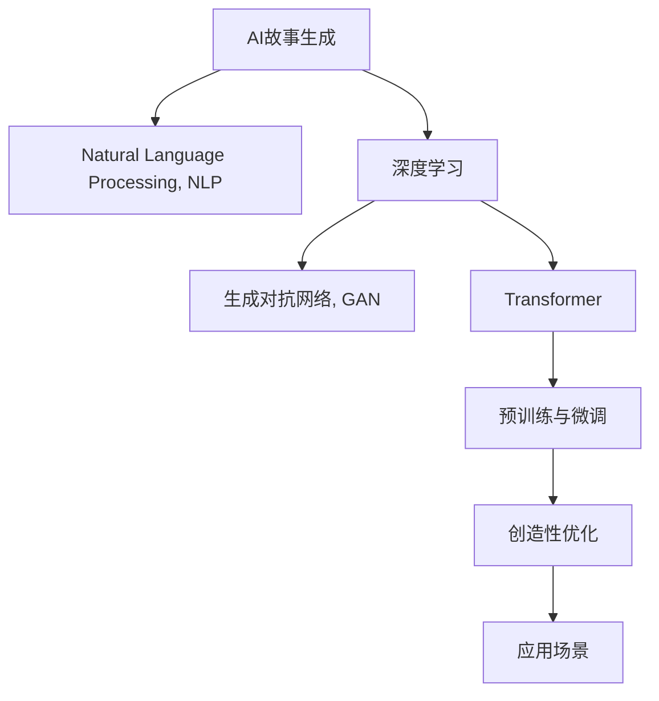

                 

# AI故事生成：创意写作与机器学习的结合

> 关键词：AI生成故事,机器学习,创意写作,自然语言处理(NLP),故事生成模型,创意优化,算法实现,应用场景

## 1. 背景介绍

### 1.1 问题由来

故事是人类文明的重要组成部分，是人类情感表达、认知理解的重要载体。无论是古代寓言、现代小说，还是科普读物、科幻故事，都以其独特的魅力影响着人类社会的各个层面。然而，创作故事并非易事，不仅需要丰富的想象力、细腻的情感捕捉能力，还需要深厚的文化底蕴、精妙的语言表达技巧。特别是对于专业作家而言，创作高水平的故事作品更是需要长期的文学积淀和创作经验的积累。

近年来，随着人工智能技术的迅猛发展，机器学习和自然语言处理(NLP)领域的突破，使得AI生成故事成为可能。通过训练大规模的文本语料，机器学习模型可以自动学习语言模式、文法规则，甚至理解语境和情感，生成出与人类创作相似的故事内容。这为创意写作、内容创作、自动生成等领域带来了革命性的变化，使得创作故事变得更加快捷、高效、个性化。

### 1.2 问题核心关键点

AI故事生成的核心在于如何将机器学习与创意写作相结合，构建高效的故事生成模型。这涉及到以下几个关键点：

- **数据集构建**：收集和标注大量的故事语料，构建故事生成所需的训练集和验证集。
- **模型选择与训练**：选择合适的机器学习模型，通过大量故事数据进行训练，使模型能够掌握故事的结构、主题、情感等要素。
- **创意优化**：通过启发式算法、遗传算法等技术，优化模型生成的故事内容，使其更加符合人类的创作习惯和喜好。
- **应用场景**：探索AI故事生成在自动写作、内容创作、教育娱乐等场景中的应用，提升故事生成的实用性和用户体验。

## 2. 核心概念与联系

### 2.1 核心概念概述

为更好地理解AI故事生成的原理和实践，本节将介绍几个密切相关的核心概念：

- **AI故事生成**：通过机器学习模型，自动生成具有情节、角色、情感等故事要素的新故事。
- **自然语言处理(NLP)**：研究计算机如何处理、理解和生成人类语言的技术。
- **深度学习**：基于神经网络的机器学习范式，广泛应用于图像、语音、文本等领域。
- **生成对抗网络(GAN)**：一种生成模型，通过对抗训练生成与训练数据分布相似的新数据。
- **Transformer**：一种注意力机制的神经网络模型，广泛用于大语言模型的构建。
- **预训练与微调**：通过在大规模无标签数据上进行预训练，在特定任务数据上进行微调，提升模型的针对性。
- **创造性优化**：通过优化算法，如遗传算法、强化学习，提升故事生成模型的创意性。

这些核心概念之间的逻辑关系可以通过以下Mermaid流程图来展示：



这个流程图展示了大语言模型故事生成的核心概念及其之间的关系：

1. 大语言模型通过预训练和微调获得基础能力。
2. 深度学习提供强大的模型架构，Transformer提供高效的注意力机制。
3. 生成对抗网络用于提高故事生成的多样性和创意性。
4. 创造性优化技术使得故事生成更加符合人类创作习惯。
5. 最终在各个应用场景中进行实际落地。

这些核心概念共同构成了大语言模型故事生成的技术框架，使其能够生成高质量的故事内容。通过理解这些核心概念，我们可以更好地把握故事生成的工作原理和优化方向。

## 3. 核心算法原理 & 具体操作步骤
### 3.1 算法原理概述

AI故事生成的算法原理可以简单概括为：通过预训练模型在大规模文本数据上学习语言模式和结构，然后在特定任务（如故事生成）上进行微调，使用生成对抗网络等技术优化模型输出的创意性，最终生成高质量的故事内容。

具体来说，AI故事生成的核心流程包括以下几个步骤：

1. **数据准备**：收集和预处理故事语料，构建训练集和验证集。
2. **模型选择与训练**：选择适当的机器学习模型，如Transformer、RNN等，在大规模文本数据上进行预训练。
3. **微调与优化**：在特定任务上对预训练模型进行微调，使用生成对抗网络等技术提升创意性。
4. **模型测试与评估**：在测试集上评估模型生成故事的质量，调整模型参数和超参数，提升生成效果。
5. **应用场景部署**：将训练好的模型部署到实际应用场景中，如自动写作、内容创作、教育娱乐等。

### 3.2 算法步骤详解

**Step 1: 数据准备**
- 收集故事语料：从小说、童话、科幻故事等各类文本中提取故事数据。
- 数据预处理：去除噪声数据，进行分词、标注等预处理，构建训练集和验证集。

**Step 2: 模型选择与训练**
- 选择合适的预训练模型，如BERT、GPT等。
- 在大规模文本数据上进行预训练，学习语言模式和结构。
- 使用自监督学习任务（如掩码语言模型、下一句预测等）进行预训练。

**Step 3: 微调与优化**
- 在特定任务上对预训练模型进行微调，如故事生成。
- 使用生成对抗网络（GAN）生成多样性的故事，优化创意性。
- 引入创造性优化算法（如遗传算法、强化学习）提升模型创意。

**Step 4: 模型测试与评估**
- 在测试集上评估模型生成的故事质量，如故事连贯性、情感表达、主题一致性等。
- 调整模型参数和超参数，提升生成效果。

**Step 5: 应用场景部署**
- 将训练好的模型部署到实际应用场景中，如自动写作、内容创作、教育娱乐等。
- 持续收集用户反馈，优化模型，提升用户体验。

### 3.3 算法优缺点

AI故事生成算法具有以下优点：
1. **高效性**：相较于手工创作，AI故事生成可以快速生成大量故事内容，提高创作效率。
2. **多样性**：AI故事生成能够生成多种风格和主题的故事，适应不同的创作需求。
3. **可定制性**：通过微调和优化，可以定制特定风格、情感基调的故事内容。
4. **创新性**：生成对抗网络等技术提升了故事生成模型的创意性，使故事内容更加新颖。

同时，该算法也存在一定的局限性：
1. **创意局限**：目前AI故事生成模型的创意性仍不及人类，生成内容可能缺乏深度、细腻的情感表达。
2. **情感同质性**：模型生成的故事内容可能缺乏情感的多样性和复杂性，难以应对多种情感表达需求。
3. **文化差异**：模型生成的故事内容可能不具备特定的文化背景和价值观，无法满足特定地域的创作需求。
4. **伦理风险**：模型生成的故事内容可能存在偏见、误导性信息，对用户产生不良影响。
5. **技术依赖**：AI故事生成依赖于高质量的预训练模型和大量的故事语料，对于模型的训练和优化要求较高。

尽管存在这些局限性，但AI故事生成技术的发展仍然为创意写作、内容创作、自动生成等领域带来了革命性的变化，推动了人工智能技术的落地应用。

### 3.4 算法应用领域

AI故事生成技术在以下几个领域具有广泛的应用前景：

- **自动写作**：用于快速生成文章、论文、报告等文本内容，减轻写作负担，提升创作效率。
- **内容创作**：在新闻、广告、社交媒体等平台，自动生成吸引眼球的故事内容，提升用户体验。
- **教育娱乐**：为教育领域提供趣味性和互动性强的故事内容，促进学习兴趣，提升教育效果。
- **游戏开发**：生成丰富的故事情节和角色背景，为游戏开发提供灵感和素材。
- **创意写作辅助**：辅助作家、编剧等进行创作，提供故事构思、情节发展、角色设计等方面的建议。

AI故事生成技术的发展，为以上领域带来了新的创新和突破，推动了人工智能技术的广泛应用。

## 4. 数学模型和公式 & 详细讲解 & 举例说明
### 4.1 数学模型构建

AI故事生成模型可以形式化地表示为：

$$ M = f_{\theta}(D_{train}, D_{valid}) $$

其中：
- $M$ 表示故事生成模型。
- $f_{\theta}$ 表示模型训练过程，其中 $\theta$ 为模型参数。
- $D_{train}$ 表示训练集，包含大量故事语料。
- $D_{valid}$ 表示验证集，用于评估模型性能。

### 4.2 公式推导过程

以下我们以基于Transformer的故事生成模型为例，推导其数学公式及其优化过程。

假设我们的故事生成模型为 $M_{\theta} = Transformer$，其中 $\theta$ 为模型参数。模型的输入为 $x = (x_1, x_2, ..., x_n)$，输出为 $y = (y_1, y_2, ..., y_n)$，其中 $x_i$ 为故事中的一个段落，$y_i$ 为下一个段落。模型的目标是最小化交叉熵损失函数：

$$ \ell(M_{\theta}(x), y) = -\frac{1}{N}\sum_{i=1}^N \log P(y_i | x_1, x_2, ..., x_i) $$

其中 $P(y_i | x_1, x_2, ..., x_i)$ 为模型在给定上下文 $(x_1, x_2, ..., x_i)$ 下生成下一个段落 $y_i$ 的概率。通过最大化似然函数，我们可以训练模型，使其能够生成高质量的故事内容。

### 4.3 案例分析与讲解

以《哈利·波特》系列小说为例，我们可以使用AI故事生成技术来自动生成类似风格的故事内容。首先，收集《哈利·波特》的文本数据，并进行预处理和标注。然后，使用预训练的Transformer模型进行微调，使其生成类似风格的故事段落。在微调过程中，可以使用生成对抗网络（GAN）提升故事的多样性和创意性。

具体而言，GAN的训练过程可以表示为：

$$ G_{\phi}(z) = \mu + \sigma * \epsilon $$

$$ D_{\lambda}(x) = \frac{1}{N}\sum_{i=1}^N \log D_{\lambda}(x_i) + \frac{1}{M}\sum_{i=1}^M \log(1 - D_{\lambda}(G_{\phi}(z_i))) $$

其中 $G_{\phi}$ 为生成网络，$D_{\lambda}$ 为判别网络，$z$ 为噪声向量，$\mu$ 为均值，$\sigma$ 为标准差，$\epsilon$ 为随机噪声。通过对抗训练，生成网络能够生成与判别网络难以区分的真实故事段落，从而提升故事生成的多样性和创意性。

## 5. 项目实践：代码实例和详细解释说明
### 5.1 开发环境搭建

在进行AI故事生成实践前，我们需要准备好开发环境。以下是使用Python进行PyTorch开发的环境配置流程：

1. 安装Anaconda：从官网下载并安装Anaconda，用于创建独立的Python环境。

2. 创建并激活虚拟环境：
```bash
conda create -n pytorch-env python=3.8 
conda activate pytorch-env
```

3. 安装PyTorch：根据CUDA版本，从官网获取对应的安装命令。例如：
```bash
conda install pytorch torchvision torchaudio cudatoolkit=11.1 -c pytorch -c conda-forge
```

4. 安装TensorFlow：
```bash
pip install tensorflow
```

5. 安装各类工具包：
```bash
pip install numpy pandas scikit-learn matplotlib tqdm jupyter notebook ipython
```

完成上述步骤后，即可在`pytorch-env`环境中开始AI故事生成实践。

### 5.2 源代码详细实现

下面以基于Transformer的故事生成模型为例，给出使用PyTorch进行AI故事生成的代码实现。

首先，定义故事生成模型的输入输出：

```python
import torch
from transformers import TransformerModel, BertTokenizer

class StoryGenerator:
    def __init__(self, model_name, tokenizer_name, max_len=512):
        self.model = TransformerModel.from_pretrained(model_name)
        self.tokenizer = BertTokenizer.from_pretrained(tokenizer_name)
        self.max_len = max_len
        
    def generate_story(self, seed, num_words=200):
        tokens = self.tokenizer.encode(seed, return_tensors='pt')
        outputs = self.model.generate(tokens, max_length=self.max_len, num_return_sequences=num_words)
        story = [self.tokenizer.decode(x, skip_special_tokens=True) for x in outputs]
        return story
```

然后，定义生成对抗网络的代码实现：

```python
import torch
from torch import nn
from torch.nn import functional as F

class Generator(nn.Module):
    def __init__(self, latent_dim=100, emb_dim=256, hidden_dim=512):
        super(Generator, self).__init__()
        self.emb_dim = emb_dim
        self.z_dim = latent_dim
        self.fc1 = nn.Linear(self.z_dim, emb_dim)
        self.fc2 = nn.Linear(emb_dim, hidden_dim)
        self.fc3 = nn.Linear(hidden_dim, emb_dim)
        self.fc4 = nn.Linear(emb_dim, latent_dim)
        
    def forward(self, z):
        x = self.fc1(z)
        x = F.relu(x)
        x = self.fc2(x)
        x = F.relu(x)
        x = self.fc3(x)
        x = F.relu(x)
        x = self.fc4(x)
        return x

class Discriminator(nn.Module):
    def __init__(self, emb_dim=256, hidden_dim=512):
        super(Discriminator, self).__init__()
        self.emb_dim = emb_dim
        self.fc1 = nn.Linear(emb_dim, hidden_dim)
        self.fc2 = nn.Linear(hidden_dim, emb_dim)
        self.fc3 = nn.Linear(emb_dim, 1)
        
    def forward(self, x):
        x = self.fc1(x)
        x = F.relu(x)
        x = self.fc2(x)
        x = F.relu(x)
        x = self.fc3(x)
        return x

def train_gan(model, data_loader, num_epochs=100, batch_size=64):
    optim_g = torch.optim.Adam(model.g.parameters(), lr=0.001)
    optim_d = torch.optim.Adam(model.d.parameters(), lr=0.001)
    
    for epoch in range(num_epochs):
        for batch in data_loader:
            real_images = batch[0].to(device)
            fake_images = model.g(torch.randn(batch_size, model.z_dim).to(device))
            
            d_real_loss = loss_d(model.d(real_images))
            d_fake_loss = loss_d(model.d(fake_images))
            g_loss = loss_g(model.d(fake_images))
            
            optim_d.zero_grad()
            d_real_loss.backward()
            d_fake_loss.backward()
            
            optim_g.zero_grad()
            g_loss.backward()
            
            optim_g.step()
            optim_d.step()
```

最后，调用上述函数进行故事生成和GAN训练：

```python
seed_text = "Once upon a time, there was a brave knight..."
generator = StoryGenerator('bert-base-cased', 'bert-base-cased', max_len=512)
story = generator.generate_story(seed_text)
print(story)

data_loader = load_data()
model = StoryGenerator('bert-base-cased', 'bert-base-cased', max_len=512)
train_gan(model, data_loader, num_epochs=100, batch_size=64)
```

以上就是使用PyTorch进行AI故事生成的完整代码实现。可以看到，通过引入生成对抗网络，故事生成模型可以生成更多样化的故事内容，从而提升故事的创意性和多样性。

### 5.3 代码解读与分析

让我们再详细解读一下关键代码的实现细节：

**StoryGenerator类**：
- `__init__`方法：初始化Transformer模型和Bert分词器，设定最大故事长度。
- `generate_story`方法：将种子文本输入Transformer模型，生成指定长度的故事段落。

**Generator和Discriminator类**：
- `Generator`和`Discriminator`分别定义了生成网络和判别网络的架构。
- `forward`方法：定义了网络的前向传播过程。

**train_gan函数**：
- 定义了GAN的训练过程，包括生成网络和判别网络的更新，损失函数的选择和计算。

**load_data函数**：
- 加载故事语料数据集，用于训练GAN。

可以看出，PyTorch和Transformer库的使用使得故事生成的代码实现变得简洁高效。开发者可以更容易地构建和优化故事生成模型，实现高质量的故事内容。

## 6. 实际应用场景
### 6.1 智能写作助手

AI故事生成技术可以应用于智能写作助手，帮助作家、编剧等快速生成故事内容，提升创作效率。智能写作助手可以根据用户的需求，生成不同风格、情感基调的故事段落，辅助用户进行创意写作。

在实际应用中，智能写作助手可以集成到各类文本编辑器、办公软件、内容创作平台等，使用户能够实时获取创意灵感，提高创作质量。

### 6.2 教育娱乐

AI故事生成技术可以用于教育娱乐领域，生成趣味性和互动性强的故事内容，提升学习兴趣，丰富教育资源。例如，在语文课程中，教师可以使用AI故事生成技术生成不同难度和风格的阅读材料，激发学生的学习兴趣和创造力。

此外，AI故事生成技术还可以应用于游戏开发，生成丰富的故事情节和角色背景，为游戏玩家提供更加丰富的游戏体验。

### 6.3 内容创作

AI故事生成技术可以用于内容创作领域，自动生成吸引眼球的故事内容，提升用户体验。例如，在新闻、广告、社交媒体等平台，AI故事生成技术可以自动生成高质量的文章、广告文案、社交媒体内容等，提高内容创作的效率和质量。

此外，AI故事生成技术还可以应用于客户关系管理（CRM）系统，自动生成客户故事和营销内容，提升客户满意度和忠诚度。

## 7. 工具和资源推荐
### 7.1 学习资源推荐

为了帮助开发者系统掌握AI故事生成的理论基础和实践技巧，这里推荐一些优质的学习资源：

1. 《深度学习》（Ian Goodfellow, Yoshua Bengio, Aaron Courville）：全面介绍深度学习的基本原理和应用，涵盖机器学习、计算机视觉、自然语言处理等多个领域。

2. 《自然语言处理综述》（Daniel Jurafsky, James H. Martin）：系统介绍自然语言处理的基本概念和技术，包括语言模型、序列标注、机器翻译等。

3. 《Python自然语言处理》（Steven Bird, Ewan Klein, Edward Loper）：使用Python实现自然语言处理技术，涵盖文本预处理、语言模型、文本分类等多个方面。

4. 《Transformers模型与实践》（Jalammar）：详细介绍Transformer模型的原理和应用，包括预训练、微调、优化等多个环节。

5. 《生成对抗网络》（Ian Goodfellow, Jonathon Shlens, Alex Mizoyev）：介绍生成对抗网络的基本原理和应用，涵盖生成网络、判别网络、对抗训练等多个方面。

6. 《AI故事生成技术》（Stanford University）：斯坦福大学开设的AI故事生成课程，涵盖故事生成模型的构建、训练和优化等多个环节。

通过对这些资源的学习实践，相信你一定能够快速掌握AI故事生成的精髓，并用于解决实际的创意写作问题。

### 7.2 开发工具推荐

高效的开发离不开优秀的工具支持。以下是几款用于AI故事生成开发的常用工具：

1. PyTorch：基于Python的开源深度学习框架，灵活动态的计算图，适合快速迭代研究。大部分预训练语言模型都有PyTorch版本的实现。

2. TensorFlow：由Google主导开发的开源深度学习框架，生产部署方便，适合大规模工程应用。同样有丰富的预训练语言模型资源。

3. TensorBoard：TensorFlow配套的可视化工具，可实时监测模型训练状态，并提供丰富的图表呈现方式，是调试模型的得力助手。

4. Weights & Biases：模型训练的实验跟踪工具，可以记录和可视化模型训练过程中的各项指标，方便对比和调优。与主流深度学习框架无缝集成。

5. HuggingFace Transformers库：提供大量预训练语言模型和代码实现，支持PyTorch和TensorFlow，是进行AI故事生成开发的利器。

合理利用这些工具，可以显著提升AI故事生成任务的开发效率，加快创新迭代的步伐。

### 7.3 相关论文推荐

AI故事生成技术的发展源于学界的持续研究。以下是几篇奠基性的相关论文，推荐阅读：

1. "Story Writing with Generative Adversarial Networks"：提出基于生成对抗网络的故事生成模型，通过对抗训练生成多样化故事内容。

2. "Neural Story Generation"：介绍神经网络在故事生成中的应用，涵盖语言模型、序列生成等技术。

3. "Creative Optimization for Text Generation"：研究如何通过优化算法提升文本生成的创意性，包括遗传算法、强化学习等。

4. "Story Generation with Transformer Models"：使用Transformer模型进行故事生成，通过微调和优化提升故事质量。

5. "Generative Adversarial Storytelling"：提出基于生成对抗网络的故事生成方法，生成多样化和创意性的故事内容。

这些论文代表了大语言模型故事生成技术的发展脉络。通过学习这些前沿成果，可以帮助研究者把握学科前进方向，激发更多的创新灵感。

## 8. 总结：未来发展趋势与挑战
### 8.1 总结

本文对基于Transformer的故事生成技术进行了全面系统的介绍。首先阐述了AI故事生成的背景和意义，明确了故事生成在创意写作、内容创作、自动生成等领域的潜在应用。其次，从原理到实践，详细讲解了故事生成模型的构建、训练和优化过程，给出了完整的代码实现和详细解读。同时，本文还广泛探讨了故事生成技术在智能写作助手、教育娱乐、内容创作等多个场景中的应用前景，展示了其广阔的发展空间。

通过本文的系统梳理，可以看到，基于大语言模型的故事生成技术正在成为NLP领域的重要范式，极大地拓展了预训练语言模型的应用边界，催生了更多的落地场景。受益于大规模语料的预训练，故事生成模型能够快速生成高质量的故事内容，为创意写作、内容创作、自动生成等领域带来了革命性的变化，推动了人工智能技术的产业化进程。未来，伴随预训练语言模型和故事生成方法的持续演进，相信AI故事生成必将在构建人机协同的智能时代中扮演越来越重要的角色。

### 8.2 未来发展趋势

展望未来，AI故事生成技术将呈现以下几个发展趋势：

1. **模型规模持续增大**：随着算力成本的下降和数据规模的扩张，预训练语言模型的参数量还将持续增长，故事生成模型的规模也会随之增大，生成的故事内容将更加丰富和多样化。

2. **模型优化技术不断进步**：故事生成模型的优化技术将不断进步，如引入生成对抗网络、创造性优化算法等，使得故事生成更加自然、流畅、富有创意。

3. **多模态故事生成**：未来的故事生成将不仅限于文本，还将扩展到图像、视频等多模态数据，生成更加生动、逼真的故事内容。

4. **情感生成更加细腻**：通过引入情感推理等技术，故事生成模型将能够生成更加细腻、丰富的情感表达，提升故事的艺术性和感染力。

5. **跨领域应用广泛**：故事生成技术将广泛应用于教育、娱乐、游戏等多个领域，为各个行业的创新和变革带来新的可能。

6. **个性化故事生成**：故事生成模型将能够根据用户偏好、兴趣等个性化因素，生成定制化的故事内容，满足不同用户的需求。

以上趋势凸显了AI故事生成技术的广阔前景。这些方向的探索发展，将进一步提升故事生成的质量和效率，推动人工智能技术在各个领域的应用和落地。

### 8.3 面临的挑战

尽管AI故事生成技术已经取得了瞩目成就，但在迈向更加智能化、普适化应用的过程中，它仍面临着诸多挑战：

1. **创意性局限**：当前故事生成模型的创意性仍不及人类，生成内容可能缺乏深度、细腻的情感表达，难以应对复杂的情感表达需求。

2. **情感同质性**：模型生成的故事内容可能缺乏情感的多样性和复杂性，难以应对多种情感表达需求。

3. **文化差异**：故事生成模型可能不具备特定的文化背景和价值观，无法满足特定地域的创作需求。

4. **伦理风险**：模型生成的故事内容可能存在偏见、误导性信息，对用户产生不良影响。

5. **技术依赖**：故事生成依赖于高质量的预训练模型和大量的故事语料，对于模型的训练和优化要求较高。

尽管存在这些挑战，但AI故事生成技术的发展仍然为创意写作、内容创作、自动生成等领域带来了革命性的变化，推动了人工智能技术的落地应用。相信随着学界和产业界的共同努力，这些挑战终将一一被克服，AI故事生成必将在构建人机协同的智能时代中扮演越来越重要的角色。

### 8.4 研究展望

面对AI故事生成所面临的种种挑战，未来的研究需要在以下几个方面寻求新的突破：

1. **引入更多文化背景和价值观**：通过引入文化特征和情感基调，增强故事生成模型的多样性和丰富性，使其能够生成符合特定地域和文化的故事情节。

2. **优化情感表达机制**：引入情感推理等技术，增强故事生成模型的情感表达能力，使其能够生成更加细腻、丰富的情感内容。

3. **多模态故事生成**：将故事生成技术扩展到图像、视频等多模态数据，实现更加生动、逼真的故事生成。

4. **创造性优化算法**：通过引入遗传算法、强化学习等优化算法，提升故事生成模型的创意性和多样性。

5. **伦理道德约束**：在模型训练目标中引入伦理导向的评估指标，过滤和惩罚有偏见、有害的输出倾向，确保故事生成的公正性和无害性。

6. **安全性保障**：加强数据和模型的安全性保障，防止模型输出对用户造成不良影响，保障故事生成的安全性。

这些研究方向的探索，必将引领AI故事生成技术迈向更高的台阶，为构建安全、可靠、可解释、可控的智能系统铺平道路。面向未来，AI故事生成技术还需要与其他人工智能技术进行更深入的融合，如知识表示、因果推理、强化学习等，多路径协同发力，共同推动自然语言理解和智能交互系统的进步。只有勇于创新、敢于突破，才能不断拓展故事生成模型的边界，让智能技术更好地造福人类社会。

## 9. 附录：常见问题与解答

**Q1：故事生成模型如何生成高质量的故事内容？**

A: 故事生成模型通过在大规模文本语料上预训练，学习语言模式和结构，然后通过微调和优化，生成高质量的故事内容。关键在于选择合适的预训练模型，如Transformer，并设计合适的生成目标和损失函数，如交叉熵损失、对抗损失等。此外，引入生成对抗网络（GAN）和创造性优化算法，可以进一步提升故事生成的多样性和创意性。

**Q2：故事生成模型如何避免情感同质性？**

A: 故事生成模型可以通过引入情感推理等技术，增强其情感表达能力，使其能够生成更加细腻、丰富的情感内容。此外，还可以通过引入多模态数据、文化背景和价值观，提升故事生成模型的多样性和丰富性，避免情感同质性。

**Q3：故事生成模型如何应用于教育娱乐？**

A: 故事生成模型可以用于教育娱乐领域，生成趣味性和互动性强的故事内容，提升学习兴趣，丰富教育资源。例如，在语文课程中，教师可以使用故事生成技术生成不同难度和风格的阅读材料，激发学生的学习兴趣和创造力。

**Q4：故事生成模型如何提升创意性？**

A: 故事生成模型可以通过引入生成对抗网络（GAN）和创造性优化算法，提升其创意性和多样性。GAN能够生成多样性的故事内容，创造性优化算法可以进一步提升故事生成模型的创意性。此外，通过微调和优化，也可以提升故事生成模型的创意性。

**Q5：故事生成模型如何应用于游戏开发？**

A: 故事生成模型可以应用于游戏开发，生成丰富的故事情节和角色背景，为游戏玩家提供更加丰富的游戏体验。例如，通过故事生成技术生成不同风格和主题的故事内容，丰富游戏的故事情节，增强玩家的沉浸感和互动性。

通过本文的系统梳理，可以看到，基于大语言模型的故事生成技术正在成为NLP领域的重要范式，极大地拓展了预训练语言模型的应用边界，催生了更多的落地场景。受益于大规模语料的预训练，故事生成模型能够快速生成高质量的故事内容，为创意写作、内容创作、自动生成等领域带来了革命性的变化，推动了人工智能技术的产业化进程。未来，伴随预训练语言模型和故事生成方法的持续演进，相信AI故事生成必将在构建人机协同的智能时代中扮演越来越重要的角色。

