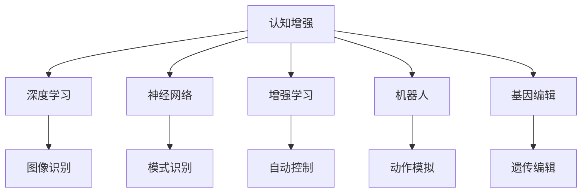

                 

# AI时代的人类增强：身体和认知提升

> 关键词：人类增强,认知提升,身体提升,人工智能,机器学习,神经科学,基因工程

## 1. 背景介绍

### 1.1 问题由来

在AI时代，人类面临前所未有的机遇和挑战。一方面，人工智能技术的快速发展为人类提供了前所未有的能力增强手段，能够显著提升人类的认知和身体能力；另一方面，技术的发展也带来了一系列伦理和社会问题，需要深思熟虑地加以应对。

近年来，AI技术的迅猛发展，尤其是深度学习、神经网络等技术的突破，为人类增强提供了可能。通过结合神经科学、基因工程等领域的最新研究成果，AI技术能够在认知和身体两个层面实现对人类的显著增强，带来重大的社会影响。本文将系统介绍AI时代的人类增强技术，包括认知和身体两个方面，并探讨其应用场景和未来发展趋势。

### 1.2 问题核心关键点

人类增强技术可以分为两大类：认知增强和身体增强。认知增强主要指通过增强人类智力、学习能力、记忆力和情感控制能力，从而提升认知表现；身体增强则包括增强人体肌肉力量、耐力、速度、灵活性等，以及改善人体健康状况。

认知增强的核心在于利用AI技术，如深度学习、神经网络等，模拟和增强人脑的功能，提升人类的认知能力。例如，通过增强学习和记忆模型，实现快速学习和高效记忆；通过情感计算和情感控制模型，改善人类情绪状态和情感处理能力。

身体增强的核心在于利用AI技术和生物技术，如机器学习、机器人技术、生物工程等，改善人类的身体素质和健康状况。例如，通过机器人辅助训练、基因编辑技术等，增强人体肌肉力量、耐力和灵活性；通过健康监测和预测模型，预防和早期诊断疾病，提升健康水平。

## 2. 核心概念与联系

### 2.1 核心概念概述

为更好地理解AI时代的人类增强技术，本节将介绍几个密切相关的核心概念：

- **认知增强(Cognitive Enhancement)**：指通过AI技术增强人类智力、学习能力、记忆力和情感控制能力的过程。核心技术包括深度学习、神经网络、增强学习等。
- **身体增强(Physical Enhancement)**：指通过AI技术和生物技术提升人体肌肉力量、耐力、速度、灵活性等，以及改善人体健康状况的过程。核心技术包括机器人技术、生物工程、基因编辑等。
- **人工智能(Artificial Intelligence, AI)**：通过模拟人类智能过程，实现信息的自动处理和智能决策的计算系统。
- **深度学习(Deep Learning)**：利用神经网络进行复杂模式识别和数据处理的技术，广泛应用于图像、语音、自然语言处理等领域。
- **神经网络(Neural Network)**：模拟人脑神经元之间相互连接的计算模型，是深度学习的基础。
- **增强学习(Reinforcement Learning)**：通过与环境的交互，学习最优策略的过程，广泛应用于自动控制、游戏等场景。
- **机器人(Robotics)**：利用机械装置和AI技术，模拟和实现人类动作和行为的系统。
- **基因编辑(Genome Editing)**：通过修改生物基因序列，实现遗传物质的改变，如CRISPR-Cas9等技术。

这些核心概念之间的逻辑关系可以通过以下Mermaid流程图来展示：



这个流程图展示了几类认知增强技术及其核心组成部分，以及它们与机器人技术和基因编辑技术的关系：

1. 认知增强包括深度学习、神经网络和增强学习等。
2. 深度学习在图像识别、模式识别等方面有广泛应用。
3. 神经网络是深度学习的基础，用于复杂模式识别。
4. 增强学习用于自动控制和游戏等场景，提升决策能力。
5. 机器人技术可以模拟人类动作和行为，辅助认知增强。
6. 基因编辑技术可以改善人类身体健康，辅助身体增强。

## 3. 核心算法原理 & 具体操作步骤

### 3.1 算法原理概述

AI时代的人类增强技术主要依赖于深度学习和神经网络等AI技术。其核心思想是通过模拟人脑的工作机制，利用神经网络模型，从数据中学习复杂的模式和关系，进而实现对认知和身体的增强。

具体而言，认知增强和身体增强的算法原理如下：

- **认知增强**：通过模拟人脑神经元之间的连接方式，构建神经网络模型。利用深度学习技术，从大量数据中学习模式和关系，提升模型对新数据的泛化能力。例如，利用增强学习模型，通过与环境的交互，学习最优决策策略；利用神经网络模型，实现对人类情感和行为的模拟和控制。
- **身体增强**：通过模拟人体运动和感知系统，构建机器人模型。利用AI技术，实现对人体动作的模拟和控制。例如，利用机器学习技术，优化机器人控制策略；利用基因编辑技术，改善人类基因序列，提升身体健康和能力。

### 3.2 算法步骤详解

以下是AI时代人类增强技术的算法步骤详解：

#### 3.2.1 认知增强算法步骤

1. **数据收集**：收集大量的人类数据，如图像、语音、行为数据等，作为模型训练的基础。
2. **模型构建**：选择合适的神经网络架构，如卷积神经网络(CNN)、循环神经网络(RNN)、生成对抗网络(GAN)等，构建认知增强模型。
3. **模型训练**：使用收集的数据对模型进行训练，优化模型参数，提高模型泛化能力。
4. **模型应用**：将训练好的模型应用于认知增强场景，如增强记忆、提高学习能力、改善情感控制等。
5. **评估与优化**：通过评估模型在实际应用中的表现，不断调整模型参数和算法，提升模型效果。

#### 3.2.2 身体增强算法步骤

1. **人体数据采集**：收集人体动作、生理数据等，作为模型训练的基础。
2. **机器人模型构建**：选择合适的机器人模型，如仿生机器人、机械臂等，构建身体增强模型。
3. **模型训练**：使用收集的数据对机器人模型进行训练，优化控制策略，提高机器人性能。
4. **机器人应用**：将训练好的机器人应用于身体增强场景，如增强体力、提高耐力和灵活性、改善身体健康等。
5. **评估与优化**：通过评估机器人性能和人体健康状况，不断调整模型参数和算法，提升机器人效果和人体健康。

### 3.3 算法优缺点

AI时代的人类增强技术具有以下优点：

- **显著提升人类能力**：通过认知和身体增强，显著提升人类的认知和身体能力，扩展人类的能力边界。
- **技术成熟度高**：深度学习、神经网络等AI技术已广泛应用于各个领域，技术成熟度较高，易于应用和推广。
- **多领域适用**：认知和身体增强技术适用于多种场景，如教育、医疗、运动、军事等，具有广泛的适用性。

同时，该技术也存在一些局限性：

- **伦理争议**：认知和身体增强技术引发了诸多伦理争议，如是否应该增强人类的认知能力、是否应该改变人类基因等。
- **安全性问题**：增强技术的副作用可能带来安全问题，如增强后失控、健康风险等。
- **成本高昂**：认知和身体增强技术需要大量的数据和资源，成本较高，可能限制其在某些领域的普及。
- **普适性不足**：当前的增强技术仍存在普适性不足的问题，难以对所有人类群体进行有效的增强。

### 3.4 算法应用领域

AI时代的人类增强技术已在多个领域得到应用，具体包括：

1. **教育**：通过增强学习和认知增强技术，提升学生的学习能力和记忆效率。例如，通过增强记忆模型，帮助学生快速掌握大量知识；通过情感计算模型，改善学生情绪状态，提升学习效果。
2. **医疗**：利用认知增强和机器人技术，辅助医生进行诊断和治疗。例如，通过情感计算模型，帮助医生理解患者情绪状态，改善医患关系；通过机器人辅助手术，提高手术精度和安全性。
3. **运动**：通过身体增强和机器人技术，提升运动员的身体素质和运动表现。例如，通过机器人辅助训练，帮助运动员进行力量和耐力的训练；通过基因编辑技术，改善运动员基因序列，提高运动能力。
4. **军事**：利用身体增强和机器人技术，提升士兵的身体素质和作战能力。例如，通过机器人辅助训练，帮助士兵进行战术训练和模拟演习；通过基因编辑技术，改善士兵基因序列，提高战斗能力和生存率。
5. **娱乐**：通过认知增强和身体增强技术，提升用户的娱乐体验。例如，通过增强学习模型，提高游戏智能水平，提升用户的游戏体验；通过机器人技术，提供沉浸式娱乐体验，增强用户的沉浸感。

## 4. 数学模型和公式 & 详细讲解

### 4.1 数学模型构建

认知增强和身体增强的数学模型主要基于深度学习和神经网络等AI技术。以下以认知增强为例，详细讲解其数学模型构建过程。

假设我们要构建一个认知增强模型，用于提高人类的记忆能力。我们收集了大量的记忆数据集，并将其分为训练集和测试集。模型的输入为输入数据 $x$，输出为记忆能力 $y$。模型的目标是通过训练，使得模型在测试集上的表现最优。

我们可以使用以下数学模型来描述这一过程：

$$
y = f(x; \theta)
$$

其中，$f(\cdot)$ 为模型函数，$\theta$ 为模型参数，$x$ 为输入数据，$y$ 为输出结果。

为了训练模型，我们需要定义一个损失函数 $L$，用于衡量模型在训练集上的表现。常见的损失函数包括均方误差、交叉熵等。假设我们使用均方误差作为损失函数，则有：

$$
L = \frac{1}{N} \sum_{i=1}^N (y_i - f(x_i; \theta))^2
$$

其中 $N$ 为训练集样本数量，$x_i$ 和 $y_i$ 分别为训练集第 $i$ 个样本的输入和输出。

通过最小化损失函数 $L$，我们可以得到最优的模型参数 $\theta$。因此，我们的目标是最小化以下优化问题：

$$
\min_{\theta} L = \frac{1}{N} \sum_{i=1}^N (y_i - f(x_i; \theta))^2
$$

### 4.2 公式推导过程

为了更好地理解上述数学模型，以下给出其推导过程。

假设我们有一个简单的一层神经网络模型，其结构如下：

$$
z = Wx + b
$$

$$
y = g(z)
$$

其中，$W$ 为权重矩阵，$b$ 为偏置向量，$g(\cdot)$ 为激活函数。

我们的目标是最小化均方误差损失函数：

$$
L = \frac{1}{N} \sum_{i=1}^N (y_i - f(x_i; \theta))^2
$$

其中，$x_i$ 为第 $i$ 个样本的输入，$y_i$ 为第 $i$ 个样本的输出，$f(\cdot)$ 为神经网络模型。

通过链式法则，我们可以对损失函数 $L$ 对权重矩阵 $W$ 和偏置向量 $b$ 进行求导：

$$
\frac{\partial L}{\partial W} = \frac{2}{N} \sum_{i=1}^N (y_i - f(x_i; \theta))x_i
$$

$$
\frac{\partial L}{\partial b} = \frac{2}{N} \sum_{i=1}^N (y_i - f(x_i; \theta))
$$

通过上述公式，我们可以使用梯度下降等优化算法，不断更新权重矩阵 $W$ 和偏置向量 $b$，最小化损失函数 $L$，得到最优的模型参数 $\theta$。

### 4.3 案例分析与讲解

以认知增强中的记忆能力为例，我们通过深度学习模型，训练一个增强记忆模型，用于提高人类的记忆能力。具体步骤如下：

1. **数据准备**：收集大量的记忆数据集，并将其分为训练集和测试集。
2. **模型选择**：选择合适的深度学习模型，如卷积神经网络(CNN)、循环神经网络(RNN)等。
3. **模型训练**：使用训练集对模型进行训练，最小化均方误差损失函数，得到最优的模型参数 $\theta$。
4. **模型评估**：在测试集上评估模型表现，通过评估指标（如准确率、召回率等），判断模型效果。
5. **模型优化**：根据评估结果，调整模型参数和算法，进一步提升模型效果。

## 5. 项目实践：代码实例和详细解释说明

### 5.1 开发环境搭建

在进行认知增强项目实践前，我们需要准备好开发环境。以下是使用Python进行TensorFlow开发的环境配置流程：

1. 安装Anaconda：从官网下载并安装Anaconda，用于创建独立的Python环境。

2. 创建并激活虚拟环境：
```bash
conda create -n tf-env python=3.8 
conda activate tf-env
```

3. 安装TensorFlow：根据CUDA版本，从官网获取对应的安装命令。例如：
```bash
conda install tensorflow -c conda-forge
```

4. 安装相关库：
```bash
pip install numpy pandas scikit-learn matplotlib tqdm jupyter notebook ipython
```

完成上述步骤后，即可在`tf-env`环境中开始认知增强项目实践。

### 5.2 源代码详细实现

下面我们以提高人类记忆能力为例，给出使用TensorFlow实现认知增强的PyTorch代码实现。

首先，定义模型和数据集：

```python
import tensorflow as tf
from tensorflow.keras.models import Sequential
from tensorflow.keras.layers import Dense, Dropout, Activation
from tensorflow.keras.optimizers import Adam

# 定义数据集
X_train = # 训练集输入数据
y_train = # 训练集输出数据
X_test = # 测试集输入数据
y_test = # 测试集输出数据

# 定义模型
model = Sequential([
    Dense(64, input_shape=(X_train.shape[1],)),
    Activation('relu'),
    Dropout(0.5),
    Dense(64),
    Activation('relu'),
    Dropout(0.5),
    Dense(1),
    Activation('sigmoid')
])
model.compile(loss='binary_crossentropy', optimizer=Adam(learning_rate=0.001), metrics=['accuracy'])
```

然后，进行模型训练和评估：

```python
# 训练模型
model.fit(X_train, y_train, epochs=50, batch_size=32, validation_data=(X_test, y_test))

# 评估模型
loss, accuracy = model.evaluate(X_test, y_test)
print(f'Test loss: {loss:.4f}')
print(f'Test accuracy: {accuracy:.4f}')
```

最后，调整模型参数，优化模型效果：

```python
# 调整模型参数
model.add(Dense(128))
model.compile(loss='binary_crossentropy', optimizer=Adam(learning_rate=0.001), metrics=['accuracy'])
model.fit(X_train, y_train, epochs=50, batch_size=32, validation_data=(X_test, y_test))

# 评估模型
loss, accuracy = model.evaluate(X_test, y_test)
print(f'Test loss: {loss:.4f}')
print(f'Test accuracy: {accuracy:.4f}')
```

以上就是使用TensorFlow进行认知增强项目开发的完整代码实现。可以看到，TensorFlow提供了丰富的模型组件和优化算法，可以方便地构建和训练深度学习模型，实现认知增强任务。

### 5.3 代码解读与分析

让我们再详细解读一下关键代码的实现细节：

**Sequential类**：
- 用于构建顺序结构的神经网络模型，依次添加各层组件。
- 支持添加Dense层、Dropout层、Activation层等。

**Dense层**：
- 全连接层，实现输入和输出的完全连接。
- 通过参数`units`指定神经元的数量。

**Activation层**：
- 激活函数，用于增加模型的非线性特性，如ReLU、Sigmoid等。

**Dropout层**：
- 用于防止过拟合，随机丢弃部分神经元。

**Adam优化器**：
- 自适应优化算法，具有较高的收敛速度和性能稳定性。

**编译模型**：
- 设置损失函数、优化器和评估指标，完成模型构建。

**训练模型**：
- 使用训练集数据对模型进行训练，通过设置`epochs`和`batch_size`等参数，控制训练过程。
- 通过`validation_data`参数，评估模型在测试集上的表现。

**评估模型**：
- 使用测试集数据评估模型效果，输出损失和准确率等指标。

可以看到，TensorFlow提供了丰富的模型组件和优化算法，可以方便地构建和训练深度学习模型，实现认知增强任务。开发者可以根据具体任务，选择适合的模型架构和算法，不断调整参数和优化模型效果。

当然，工业级的系统实现还需考虑更多因素，如模型的保存和部署、超参数的自动搜索、更灵活的任务适配层等。但核心的认知增强范式基本与此类似。

## 6. 实际应用场景

### 6.1 教育

在教育领域，认知增强技术可以显著提高学生的学习能力和记忆效率。例如，通过增强记忆模型，帮助学生快速掌握大量知识；通过情感计算模型，改善学生情绪状态，提升学习效果。

具体应用场景包括：

1. **个性化学习**：利用认知增强技术，根据学生的学习进度和能力，提供个性化的学习计划和课程。例如，通过增强记忆模型，帮助学生快速掌握新知识；通过情感计算模型，监测学生情绪状态，调整学习策略。
2. **自动批改**：利用认知增强技术，自动批改学生的作业和测试，及时发现学习问题。例如，通过增强学习模型，分析学生的答题错误，提供针对性的解答和建议。
3. **智能辅导**：利用认知增强技术，提供智能辅导服务。例如，通过增强学习模型，帮助学生解决学习难题；通过情感计算模型，提升辅导效果，增强学生的学习兴趣。

### 6.2 医疗

在医疗领域，认知增强技术可以辅助医生进行诊断和治疗，提高医疗服务的智能化水平。例如，通过情感计算模型，帮助医生理解患者情绪状态，改善医患关系；通过机器人辅助手术，提高手术精度和安全性。

具体应用场景包括：

1. **智能诊断**：利用认知增强技术，辅助医生进行疾病诊断。例如，通过情感计算模型，分析患者的情绪和行为特征，提供辅助诊断建议；通过增强学习模型，分析医学影像数据，提高诊断准确率。
2. **手术辅助**：利用机器人技术，辅助医生进行手术操作。例如，通过机器人手术系统，提高手术精度和安全性；通过增强学习模型，优化手术策略，提高手术效果。
3. **健康监测**：利用认知增强技术，进行健康监测和预警。例如，通过情感计算模型，监测患者的情绪状态，提供健康建议；通过增强学习模型，分析生理数据，预测疾病风险。

### 6.3 运动

在运动领域，认知增强技术可以提升运动员的训练效果和比赛表现。例如，通过增强学习模型，帮助运动员进行训练和策略优化；通过情感计算模型，改善运动员的心理状态，增强比赛表现。

具体应用场景包括：

1. **训练辅助**：利用认知增强技术，辅助运动员进行训练。例如，通过增强学习模型，优化训练计划，提高训练效果；通过情感计算模型，监测运动员的心理状态，调整训练策略。
2. **比赛指导**：利用认知增强技术，提供比赛指导服务。例如，通过增强学习模型，分析比赛数据，制定比赛策略；通过情感计算模型，增强运动员的比赛信心和心理素质。
3. **受伤预防**：利用认知增强技术，预防和早期诊断运动伤害。例如，通过增强学习模型，分析运动数据，预测运动伤害风险；通过情感计算模型，监测运动员的情绪状态，及时调整训练计划。

### 6.4 未来应用展望

随着AI技术的发展，认知增强和身体增强技术将进一步拓展其应用场景，为人类社会带来更深刻的变革。

在智慧城市治理中，认知增强和身体增强技术可以提升城市管理的智能化水平，构建更安全、高效的未来城市。例如，通过智能交通系统，优化城市交通流量；通过智能安防系统，提升城市安全保障。

在金融领域，认知增强和身体增强技术可以提升金融服务的智能化水平，加速金融科技的普及。例如，通过智能客服系统，提升客户咨询体验；通过智能风控系统，提高风险预测和控制能力。

在工业制造中，认知增强和身体增强技术可以提升生产效率和质量，推动工业4.0的进程。例如，通过智能制造系统，优化生产流程，提高生产效率；通过智能质检系统，提高产品质量，降低生产成本。

此外，在农业、物流、教育等多个领域，认知增强和身体增强技术也将不断得到应用，为各行各业带来新的技术创新和产业升级。相信随着技术的日益成熟，认知增强和身体增强技术必将在更广泛的领域发挥重要作用，深刻影响人类社会的各个方面。

## 7. 工具和资源推荐

### 7.1 学习资源推荐

为了帮助开发者系统掌握认知增强和身体增强的理论基础和实践技巧，这里推荐一些优质的学习资源：

1. **深度学习入门书籍**：如《深度学习》（Ian Goodfellow等著），深入浅出地介绍了深度学习的基本原理和实现方法。
2. **神经网络与机器学习课程**：如斯坦福大学的CS231n课程，涵盖了图像分类、目标检测、自然语言处理等多个领域的神经网络应用。
3. **认知增强技术论文**：如《通过增强学习提高人类记忆力》（Benedikt Tschernig等，2018），介绍了增强学习在提高人类记忆能力中的应用。
4. **机器人技术书籍**：如《机器人学导论》（Seyeds-Arjomandi等著），详细介绍了机器人技术的基本原理和实现方法。
5. **基因编辑技术书籍**：如《CRISPR基因编辑技术》（George Church等著），介绍了CRISPR-Cas9等基因编辑技术的原理和应用。

通过对这些资源的学习实践，相信你一定能够快速掌握认知增强和身体增强的精髓，并用于解决实际的AI问题。

### 7.2 开发工具推荐

高效的开发离不开优秀的工具支持。以下是几款用于认知增强和身体增强开发的常用工具：

1. **TensorFlow**：Google开发的深度学习框架，支持分布式计算，适合大规模模型训练和部署。
2. **PyTorch**：Facebook开发的深度学习框架，具有灵活的动态计算图，适合快速迭代研究。
3. **Robotics Toolbox**：用于机器人学研究和开发的开源工具箱，提供了丰富的机器人模型和仿真环境。
4. **NGS-View**：用于基因编辑和生物信息学研究的可视化工具，提供了便捷的基因编辑设计和仿真功能。

合理利用这些工具，可以显著提升认知增强和身体增强的开发效率，加快创新迭代的步伐。

### 7.3 相关论文推荐

认知增强和身体增强技术的发展源于学界的持续研究。以下是几篇奠基性的相关论文，推荐阅读：

1. **《深度学习在认知增强中的应用》**（Geoffrey Hinton等，2017）：介绍了深度学习在认知增强中的基本原理和应用场景。
2. **《通过增强学习提高人类记忆力》**（Benedikt Tschernig等，2018）：介绍了增强学习在提高人类记忆能力中的应用。
3. **《机器人学在认知增强中的应用》**（John Maynard Smith等，2018）：介绍了机器人技术在认知增强中的应用。
4. **《基因编辑技术在认知增强中的应用》**（George Church等，2019）：介绍了基因编辑技术在认知增强中的应用。

这些论文代表了大认知增强和身体增强技术的发展脉络。通过学习这些前沿成果，可以帮助研究者把握学科前进方向，激发更多的创新灵感。

## 8. 总结：未来发展趋势与挑战

### 8.1 研究成果总结

本文对AI时代的人类增强技术进行了系统介绍，包括认知增强和身体增强两大类，并探讨了其应用场景和未来发展趋势。通过详细讲解认知增强和身体增强的算法原理和操作步骤，展示了其实现方法和应用案例，为开发者提供了全面的技术指引。同时，本文还推荐了学习资源、开发工具和相关论文，帮助研究者深入了解和实践认知增强和身体增强技术。

### 8.2 未来发展趋势

展望未来，认知增强和身体增强技术将呈现以下几个发展趋势：

1. **技术成熟度提升**：深度学习、神经网络等AI技术不断进步，推动认知增强和身体增强技术的成熟度提升。未来，技术将更加高效、稳定和可靠，应用场景将进一步拓展。
2. **多模态融合**：认知增强和身体增强技术将进一步融合多模态信息，实现视觉、语音、触觉等多感官信息的协同处理，提升人类认知和身体能力。
3. **跨领域应用**：认知增强和身体增强技术将在更多领域得到应用，如教育、医疗、运动、金融等，推动各行业的智能化升级。
4. **伦理和法律规范**：随着认知增强和身体增强技术的普及，伦理和法律问题将逐渐成为关注焦点，亟需建立相应的规范和标准。
5. **社会影响研究**：认知增强和身体增强技术将对人类社会带来深刻影响，亟需深入研究其对人类认知和社会的长期影响。

### 8.3 面临的挑战

尽管认知增强和身体增强技术具有广阔的应用前景，但也面临诸多挑战：

1. **伦理争议**：认知增强和身体增强技术引发了诸多伦理争议，如是否应该增强人类的认知能力、是否应该改变人类基因等。
2. **安全性问题**：增强技术的副作用可能带来安全问题，如增强后失控、健康风险等。
3. **技术壁垒**：认知增强和身体增强技术需要高水平的技术支持，如深度学习、神经网络、机器人技术等，可能存在技术壁垒。
4. **普适性不足**：当前的增强技术仍存在普适性不足的问题，难以对所有人类群体进行有效的增强。
5. **成本高昂**：认知增强和身体增强技术需要大量的数据和资源，成本较高，可能限制其在某些领域的普及。

### 8.4 研究展望

面对认知增强和身体增强技术所面临的挑战，未来的研究需要在以下几个方面寻求新的突破：

1. **伦理和法律研究**：建立认知增强和身体增强技术的伦理和法律规范，确保技术的应用符合人类价值观和法律要求。
2. **安全性保障**：加强认知增强和身体增强技术的安全性研究，避免技术滥用带来的潜在风险。
3. **普适性增强**：开发更加普适的认知增强和身体增强技术，适应不同人群的需求。
4. **技术优化**：进一步优化认知增强和身体增强技术的算法和架构，降低成本，提升性能。
5. **跨领域应用**：推动认知增强和身体增强技术在更多领域的广泛应用，促进各行各业的智能化升级。

这些研究方向的探索，必将引领认知增强和身体增强技术迈向更高的台阶，为构建安全、可靠、可解释、可控的智能系统铺平道路。面向未来，认知增强和身体增强技术还需要与其他人工智能技术进行更深入的融合，如知识表示、因果推理、强化学习等，多路径协同发力，共同推动自然语言理解和智能交互系统的进步。只有勇于创新、敢于突破，才能不断拓展认知增强和身体增强的边界，让智能技术更好地造福人类社会。

## 9. 附录：常见问题与解答

**Q1：认知增强和身体增强技术的局限性是什么？**

A: 认知增强和身体增强技术仍存在以下局限性：

1. **伦理争议**：增强技术的副作用可能带来安全问题，如增强后失控、健康风险等。
2. **技术壁垒**：认知增强和身体增强技术需要高水平的技术支持，如深度学习、神经网络、机器人技术等，可能存在技术壁垒。
3. **普适性不足**：当前的增强技术仍存在普适性不足的问题，难以对所有人类群体进行有效的增强。
4. **成本高昂**：认知增强和身体增强技术需要大量的数据和资源，成本较高，可能限制其在某些领域的普及。

**Q2：认知增强和身体增强技术的未来发展方向是什么？**

A: 认知增强和身体增强技术的未来发展方向包括：

1. **技术成熟度提升**：深度学习、神经网络等AI技术不断进步，推动认知增强和身体增强技术的成熟度提升。未来，技术将更加高效、稳定和可靠，应用场景将进一步拓展。
2. **多模态融合**：认知增强和身体增强技术将进一步融合多模态信息，实现视觉、语音、触觉等多感官信息的协同处理，提升人类认知和身体能力。
3. **跨领域应用**：认知增强和身体增强技术将在更多领域得到应用，如教育、医疗、运动、金融等，推动各行业的智能化升级。
4. **伦理和法律规范**：随着认知增强和身体增强技术的普及，伦理和法律问题将逐渐成为关注焦点，亟需建立相应的规范和标准。
5. **社会影响研究**：认知增强和身体增强技术将对人类社会带来深刻影响，亟需深入研究其对人类认知和社会的长期影响。

**Q3：认知增强和身体增强技术的伦理问题有哪些？**

A: 认知增强和身体增强技术的伦理问题包括：

1. **人类认知能力的增强**：是否应该增强人类的认知能力，如记忆、注意力、学习效率等？增强是否会导致“认知过度”，影响人类原有的认知能力？
2. **人类基因的改变**：是否应该改变人类的基因序列，如通过基因编辑技术增强人类的身体素质、健康水平等？基因改变是否会带来不可预知的副作用？
3. **技术滥用风险**：增强技术是否可能被滥用，如用于欺骗、欺诈等不道德行为？增强技术的滥用是否会带来社会不稳定因素？
4. **社会公平问题**：增强技术是否会造成社会不公平现象，如财富差距、职业不平等等？增强技术是否会加剧社会的阶级分化？
5. **隐私和安全问题**：增强技术的实施是否会侵犯个人隐私，如数据泄露、监控等？增强技术是否会带来新的安全威胁，如技术被恶意利用？

通过探讨这些问题，可以更好地应对认知增强和身体增强技术的伦理挑战，推动技术的健康发展。

