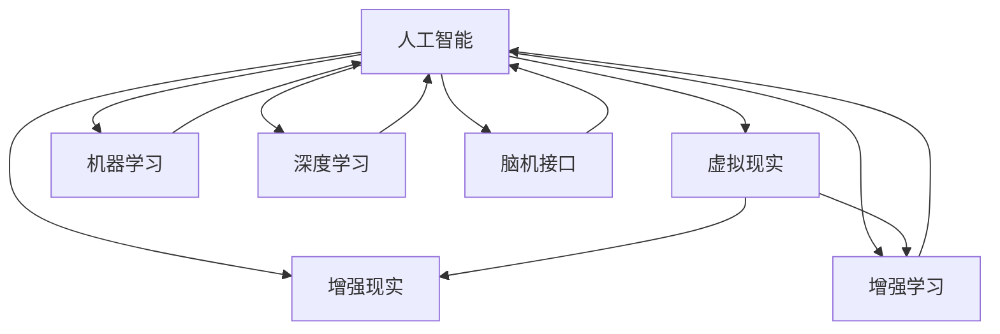

                 

# AI时代的人类增强：身体增强与认知增强

## 1. 背景介绍

### 1.1 问题由来
随着科技的飞速发展，人工智能（AI）技术正逐渐渗透到人类社会的各个方面，从日常生活的智能助手到医疗健康、工业制造、金融服务等核心领域，AI都显示出了巨大的潜力和价值。然而，AI技术的广泛应用也带来了新的挑战，即如何合理应用这些技术以增强人类的身体和认知能力，实现更加高效、安全、可持续的智慧生活。

### 1.2 问题核心关键点
这一问题的核心关键点在于如何通过AI技术实现人类增强。这包括两个方面：

- **身体增强**：利用AI技术提升人类的身体功能，如增强力量、速度、耐力等，以及改善健康状况，如远程医疗、健康监测等。
- **认知增强**：通过AI技术提高人类的认知能力，如增强记忆力、提升决策能力、支持学习能力等。

这一过程既需要跨学科的知识整合，又需要技术的不断创新和优化，以确保增强效果的安全性和可控性。

## 2. 核心概念与联系

### 2.1 核心概念概述

为更好地理解AI时代人类增强的技术基础，本节将介绍几个密切相关的核心概念：

- **人工智能（AI）**：模拟人类智能行为的计算机系统，包括感知、学习、推理、规划等多个方面。
- **增强现实（AR）**：通过计算机技术在用户的现实环境中叠加虚拟信息，增强用户对环境的感知和交互能力。
- **虚拟现实（VR）**：创建完全虚拟的环境，通过用户头显和控制器，实现沉浸式交互体验。
- **机器学习（ML）**：使计算机系统能够自动学习和改进，而无需明确的编程指令。
- **深度学习（DL）**：一种特殊的机器学习方法，使用深度神经网络进行模式识别和决策。
- **脑机接口（BCI）**：直接将人的脑活动转化为机器指令，实现对外部设备的控制。
- **增强学习（RL）**：通过智能体与环境的交互，学习最优策略，以达到特定目标。

这些概念之间的关系可以通过以下Mermaid流程图来展示：



这个流程图展示了一系列核心概念及其之间的关系：

1. **人工智能**是其他所有概念的基础，通过各种技术和方法实现各种增强。
2. **增强现实**和**虚拟现实**通过计算机技术扩展人类的感知和交互能力。
3. **机器学习和深度学习**提供数据分析和模式识别的能力，是实现复杂增强功能的核心技术。
4. **脑机接口**和**增强学习**分别从脑活动和环境交互两个维度，提升人类认知和决策能力。

这些概念共同构成了AI时代人类增强的完整技术框架，使得通过AI技术实现人类增强成为可能。

## 3. 核心算法原理 & 具体操作步骤
### 3.1 算法原理概述

AI时代的人类增强技术主要通过以下几种算法原理实现：

- **增强现实（AR）**：通过计算机视觉和传感器技术，将虚拟信息叠加在用户现实世界中，增强用户的感知能力。
- **虚拟现实（VR）**：通过计算机生成的3D环境，用户可进入完全虚拟的空间，进行沉浸式交互。
- **脑机接口（BCI）**：通过传感器捕获脑电波或神经信号，转化为计算机可识别的指令，实现对外部设备的直接控制。
- **增强学习（RL）**：通过智能体与环境的交互，学习最优策略，以实现特定任务。

### 3.2 算法步骤详解

以**增强现实（AR）**为例，具体的算法步骤如下：

1. **数据采集**：通过摄像头和传感器采集用户周围环境的视频和传感器数据。
2. **环境建模**：利用计算机视觉技术，对采集到的数据进行分析和建模，识别出环境中的关键特征。
3. **虚拟信息叠加**：将虚拟信息（如文字、图像、3D模型等）叠加在用户现实环境中，增强用户对环境的理解。
4. **用户交互**：用户通过手势、语音等方式与虚拟信息进行交互，实现信息获取、指令控制等功能。

**虚拟现实（VR）**的算法步骤与AR类似，主要差异在于需要构建完整的虚拟环境，用户完全沉浸在其中进行交互。

**脑机接口（BCI）**的算法步骤如下：

1. **脑信号采集**：通过脑电波或神经信号传感器采集脑活动数据。
2. **信号预处理**：对采集到的信号进行去噪、滤波等预处理，提取有用的信息。
3. **特征提取**：利用机器学习算法，从预处理后的信号中提取特征，识别出脑活动模式。
4. **指令转换**：将识别出的脑活动模式转化为计算机指令，实现对外部设备的控制。

**增强学习（RL）**的算法步骤如下：

1. **环境定义**：定义智能体与环境交互的目标和环境状态空间。
2. **策略学习**：通过智能体与环境的交互，学习最优策略，以实现特定任务。
3. **策略评估**：评估学习到的策略在特定环境下的性能，并进行优化。

### 3.3 算法优缺点

**增强现实（AR）**：

- **优点**：
  - 无需佩戴特殊设备即可实现环境增强。
  - 实时性高，用户体验自然。
- **缺点**：
  - 设备成本较高。
  - 存在环境光照、遮挡等问题。

**虚拟现实（VR）**：

- **优点**：
  - 完全沉浸式体验，信息展示全面。
  - 不受环境限制，可以进行复杂模拟。
- **缺点**：
  - 需要佩戴设备，使用时间受限。
  - 长时间使用易导致晕动症等健康问题。

**脑机接口（BCI）**：

- **优点**：
  - 直接从大脑获取指令，响应速度快。
  - 潜在应用广泛，如康复辅助、游戏控制等。
- **缺点**：
  - 技术成熟度较低，设备复杂度高。
  - 存在信号采集的隐私和安全问题。

**增强学习（RL）**：

- **优点**：
  - 自适应性强，能够学习最优策略。
  - 可以处理复杂的决策问题。
- **缺点**：
  - 需要大量数据和计算资源，训练成本高。
  - 模型难以解释，存在黑盒问题。

### 3.4 算法应用领域

**增强现实（AR）**：

- **医疗**：用于手术导航、康复训练、远程诊断等。
- **教育**：辅助学生进行互动式学习、远程教学等。
- **工业**：用于设备维护、现场培训、质量检测等。
- **游戏**：增强游戏体验，提供互动式界面。

**虚拟现实（VR）**：

- **游戏娱乐**：提供沉浸式游戏体验，支持多人互动。
- **教育培训**：用于虚拟实验室、模拟演练等。
- **心理治疗**：用于虚拟现实疗法，辅助心理治疗。
- **设计制造**：支持虚拟产品设计、虚拟试穿等。

**脑机接口（BCI）**：

- **康复辅助**：用于辅助肢体瘫痪患者进行运动控制。
- **游戏控制**：提供完全依赖脑活动的控制方式。
- **脑电信号分析**：用于精神疾病诊断和治疗。
- **人机交互**：支持通过脑活动进行交互式控制。

**增强学习（RL）**：

- **自动驾驶**：学习最优驾驶策略，实现自主导航。
- **机器人控制**：使机器人自主执行复杂任务。
- **金融交易**：学习市场动态，实现自动交易策略。
- **游戏AI**：提供具有高智能水平的AI对手。

## 4. 数学模型和公式 & 详细讲解 & 举例说明

### 4.1 数学模型构建

以**增强现实（AR）**为例，其数学模型主要包括以下几个部分：

1. **环境建模**：将环境中的物体和场景通过三维坐标系进行建模。
2. **虚拟信息叠加**：将虚拟信息（如文本、图像、3D模型）与现实环境进行融合。

### 4.2 公式推导过程

以**虚拟现实（VR）**为例，其数学模型主要包括以下几个部分：

1. **环境模拟**：通过数学模型模拟虚拟环境的三维坐标系。
2. **视觉渲染**：利用渲染算法，将虚拟信息转换为可视化的图像。
3. **用户交互**：通过手势、语音等输入方式，识别用户操作指令。

### 4.3 案例分析与讲解

以**脑机接口（BCI）**为例，其数学模型主要包括以下几个部分：

1. **脑信号采集**：通过脑电波传感器采集大脑活动数据。
2. **信号预处理**：对采集到的信号进行去噪、滤波等预处理。
3. **特征提取**：利用机器学习算法，提取脑活动特征。
4. **指令转换**：将脑活动特征转换为计算机指令。

## 5. 项目实践：代码实例和详细解释说明

### 5.1 开发环境搭建

在进行AI时代人类增强的项目实践前，我们需要准备好开发环境。以下是使用Python进行AR开发的环境配置流程：

1. 安装Anaconda：从官网下载并安装Anaconda，用于创建独立的Python环境。

2. 创建并激活虚拟环境：
```bash
conda create -n ar-env python=3.8 
conda activate ar-env
```

3. 安装AR开发所需工具包：
```bash
pip install numpy pandas scikit-learn matplotlib tqdm jupyter notebook ipython opencv-python pyglet pyOpenGL
```

4. 安装虚拟现实（VR）开发所需的VR头显和控制器驱动程序。

完成上述步骤后，即可在`ar-env`环境中开始AR开发实践。

### 5.2 源代码详细实现

下面以AR应用程序的开发为例，给出使用Python和OpenCV库进行增强现实开发的代码实现。

首先，定义数据处理函数：

```python
import cv2
import numpy as np

def process_image(image):
    # 图像预处理
    image = cv2.cvtColor(image, cv2.COLOR_BGR2RGB)
    image = cv2.resize(image, (640, 480))
    image = cv2.flip(image, 1)
    return image
```

然后，定义虚拟信息叠加函数：

```python
import cv2

def overlay_info(image, info):
    # 将虚拟信息叠加到图像上
    font = cv2.FONT_HERSHEY_SIMPLEX
    font_scale = 1.0
    color = (255, 255, 255)
    thickness = 2
    info_size = cv2.getTextSize(info, font, font_scale, thickness)[0]
    info_position = (image.shape[1] - info_size[0] - 20, image.shape[0] - info_size[1] - 10)
    image = cv2.putText(image, info, info_position, font, font_scale, color, thickness, cv2.LINE_AA)
    return image
```

接着，定义AR应用程序的入口函数：

```python
def main():
    # 打开摄像头
    cap = cv2.VideoCapture(0)

    while True:
        # 读取摄像头数据
        ret, frame = cap.read()

        # 图像预处理
        image = process_image(frame)

        # 叠加虚拟信息
        info = "Welcome to AR!"
        image = overlay_info(image, info)

        # 显示图像
        cv2.imshow("AR", image)

        # 退出条件
        if cv2.waitKey(1) & 0xFF == ord('q'):
            break

    # 释放资源
    cap.release()
    cv2.destroyAllWindows()
```

最后，启动AR应用程序：

```bash
python main.py
```

以上代码实现了简单的增强现实应用，通过摄像头实时采集图像，并在图像上叠加虚拟信息。在实际操作中，还可以进一步扩展，如利用AR实现虚拟导航、虚拟试穿等功能。

### 5.3 代码解读与分析

让我们再详细解读一下关键代码的实现细节：

**process_image函数**：
- 用于预处理摄像头采集到的图像，包括颜色空间转换、尺寸调整、翻转等操作。

**overlay_info函数**：
- 用于将虚拟信息（如文本）叠加到图像上，实现增强现实效果。

**main函数**：
- 定义AR应用程序的主循环，通过摄像头实时采集图像，并进行预处理、虚拟信息叠加和显示。
- 使用`cv2.waitKey`和`cv2.waitKey(1)`等待用户输入，以便退出程序。

可以看到，AR技术的开发需要掌握图像处理、传感器、图形界面等多种技术，但Python和OpenCV等工具可以大大简化开发流程，使得开发者能够快速构建简单的AR应用。

## 6. 实际应用场景

### 6.1 医疗

**增强现实（AR）**在医疗领域的应用非常广泛，如手术导航、康复训练、远程诊断等。通过AR技术，医生可以在手术过程中实时查看三维模型和解剖图，提高手术精度和成功率。康复训练方面，患者可以通过AR系统进行虚拟康复训练，提升康复效果。远程诊断方面，医生可以通过AR系统远程查看病人的三维图像和实时视频，进行远程会诊和诊断。

### 6.2 教育

**虚拟现实（VR）**在教育领域的应用也相当广泛，如虚拟实验室、模拟演练、互动式学习等。通过VR技术，学生可以进入虚拟的实验室环境，进行虚拟实验操作，增强学习效果。模拟演练方面，学生可以进行各种灾难、事故等模拟演练，提升应对突发情况的能力。互动式学习方面，学生可以通过VR技术参与互动式课程，提高学习兴趣和效果。

### 6.3 工业

**增强现实（AR）**在工业领域的应用包括设备维护、现场培训、质量检测等。通过AR技术，工人可以在维修过程中实时查看设备的3D模型和维护手册，提高维修效率和准确性。现场培训方面，工人可以通过AR技术进行虚拟操作培训，提升技能水平。质量检测方面，工人可以通过AR技术实时查看产品的3D图像，进行质量检测和评估。

### 6.4 游戏

**虚拟现实（VR）**在游戏领域的应用非常广泛，如虚拟现实游戏、互动式游戏等。通过VR技术，玩家可以进入完全虚拟的游戏环境，进行沉浸式游戏体验，增强游戏乐趣。互动式游戏方面，玩家可以与虚拟角色进行互动，提高游戏沉浸感和互动性。

## 7. 工具和资源推荐

### 7.1 学习资源推荐

为了帮助开发者系统掌握AI时代人类增强的理论基础和实践技巧，这里推荐一些优质的学习资源：

1. **《增强现实技术及应用》**：介绍增强现实技术的原理和应用，涵盖AR的各个方面。
2. **《虚拟现实技术及应用》**：介绍虚拟现实技术的原理和应用，涵盖VR的各个方面。
3. **《脑机接口技术及应用》**：介绍脑机接口技术的原理和应用，涵盖BCI的各个方面。
4. **《增强学习理论与实践》**：介绍增强学习的原理和实践，涵盖RL的各个方面。

这些资源可以帮助开发者全面了解AI时代人类增强技术的各个方面，从而更好地应用于实际项目中。

### 7.2 开发工具推荐

高效的开发离不开优秀的工具支持。以下是几款用于AI时代人类增强开发的常用工具：

1. **AR开发工具**：如ARKit（iOS）、ARCore（Android）、Vuforia等，支持多种AR平台和设备。
2. **VR开发工具**：如Unity（跨平台）、Unreal Engine（PC和游戏主机）等，支持虚拟现实开发和交互式体验。
3. **脑机接口开发工具**：如OpenBCI（开源硬件）、Emotiv Epoc（脑电波传感器）等，支持脑电波信号采集和分析。
4. **增强学习开发工具**：如OpenAI Gym、RLlib等，支持增强学习的开发和实验。

这些工具可以大大提高AI时代人类增强开发效率，帮助开发者快速实现各类应用。

### 7.3 相关论文推荐

AI时代人类增强技术的不断演进离不开学界的持续研究。以下是几篇奠基性的相关论文，推荐阅读：

1. **《增强现实技术综述》**：总结了增强现实技术的最新进展和应用。
2. **《虚拟现实技术综述》**：总结了虚拟现实技术的最新进展和应用。
3. **《脑机接口技术综述》**：总结了脑机接口技术的最新进展和应用。
4. **《增强学习技术综述》**：总结了增强学习技术的最新进展和应用。

这些论文代表了AI时代人类增强技术的最新进展，通过学习这些前沿成果，可以帮助研究者把握学科前进方向，激发更多的创新灵感。

## 8. 总结：未来发展趋势与挑战

### 8.1 总结

本文对AI时代人类增强技术进行了全面系统的介绍。首先阐述了AI时代人类增强的背景和意义，明确了增强现实（AR）、虚拟现实（VR）、脑机接口（BCI）、增强学习（RL）等核心技术在人类增强中的作用。其次，从原理到实践，详细讲解了这些技术的算法原理和具体操作步骤，给出了AR应用的代码实例和详细解释说明。同时，本文还广泛探讨了这些技术在医疗、教育、工业、游戏等多个领域的应用前景，展示了AI时代人类增强技术的巨大潜力。此外，本文精选了相关学习资源、开发工具和相关论文，力求为开发者提供全方位的技术指引。

通过本文的系统梳理，可以看到，AI时代人类增强技术正在成为提升人类身体和认知能力的重要手段，为人类智慧生活带来了新的可能性。未来，随着技术的不断进步和应用的不断深入，AI时代人类增强技术必将为人类社会带来更多福祉。

### 8.2 未来发展趋势

展望未来，AI时代人类增强技术将呈现以下几个发展趋势：

1. **技术融合**：增强现实、虚拟现实、脑机接口、增强学习等技术将深度融合，提供更全面、更高效的人类增强解决方案。
2. **个性化定制**：基于用户数据，提供个性化的增强服务和体验，满足不同用户需求。
3. **安全性提升**：在增强技术应用过程中，更加注重数据隐私和信息安全，确保用户数据的安全性。
4. **跨领域应用**：在医疗、教育、工业、游戏等多个领域，提供跨领域的增强服务和体验，拓展应用场景。
5. **人工智能结合**：增强技术与人工智能技术的结合将更加紧密，提升增强效果和智能化水平。

这些趋势将进一步推动AI时代人类增强技术的发展，为人类智慧生活带来更多可能。

### 8.3 面临的挑战

尽管AI时代人类增强技术取得了诸多进展，但在实际应用过程中仍面临诸多挑战：

1. **技术成熟度**：增强现实、虚拟现实、脑机接口、增强学习等技术尚未完全成熟，存在技术瓶颈和可靠性问题。
2. **成本和设备限制**：高端设备和高技术门槛限制了增强技术的普及和应用。
3. **隐私和安全问题**：增强技术涉及大量用户数据和隐私信息，存在数据泄露和隐私侵害的风险。
4. **用户体验**：增强技术的使用需要一定的适应和学习成本，用户体验和接受度有待提升。
5. **法律法规**：增强技术的应用涉及法律法规的规范和监管，需要制定相应的法律法规和标准。

这些挑战需要业界各方共同努力，通过技术创新和政策支持，推动AI时代人类增强技术健康发展。

### 8.4 研究展望

面向未来，AI时代人类增强技术需要在以下几个方面进行进一步研究：

1. **技术创新**：推动增强现实、虚拟现实、脑机接口、增强学习等技术的深度融合，提升技术的成熟度和可靠性。
2. **成本降低**：通过技术进步和规模化生产，降低高端设备和高技术的门槛，提升增强技术的普及度。
3. **隐私保护**：加强数据隐私保护，确保用户数据的安全性和隐私性。
4. **用户体验**：优化增强技术的使用体验，提高用户接受度和满意度。
5. **法规标准**：制定相应的法律法规和标准，规范增强技术的应用和管理。

通过这些研究方向的探索，AI时代人类增强技术将更好地服务于人类社会，提升人类的身体和认知能力，推动智慧生活的可持续发展。

## 9. 附录：常见问题与解答

**Q1：增强现实（AR）和虚拟现实（VR）有什么区别？**

A: 增强现实（AR）和虚拟现实（VR）的区别在于对现实环境的处理方式。AR通过将虚拟信息叠加在现实环境中，增强用户对环境的感知和交互能力。VR则完全创建了一个虚拟环境，用户完全沉浸其中，进行完全虚拟的交互体验。

**Q2：脑机接口（BCI）技术目前面临哪些挑战？**

A: 脑机接口（BCI）技术目前面临的主要挑战包括：
1. 信号采集的精度和稳定性。
2. 信号处理的复杂性和噪声干扰。
3. 指令转换的准确性和实时性。
4. 设备和用户端的可穿戴性和舒适性。

**Q3：增强学习（RL）算法在实际应用中需要注意哪些问题？**

A: 增强学习（RL）算法在实际应用中需要注意以下问题：
1. 环境模拟的准确性和多样性。
2. 奖励函数的合理性和公平性。
3. 学习过程的探索与利用平衡。
4. 模型训练的复杂性和资源消耗。

**Q4：如何提高AI时代人类增强技术的用户体验？**

A: 提高AI时代人类增强技术的用户体验可以从以下几个方面入手：
1. 简化设备操作和交互界面。
2. 提供个性化的增强服务和体验。
3. 加强用户教育和培训，提高用户接受度。
4. 收集用户反馈，不断优化用户体验。

**Q5：AI时代人类增强技术在实际应用中需要注意哪些安全问题？**

A: AI时代人类增强技术在实际应用中需要注意以下安全问题：
1. 数据隐私保护，防止用户数据泄露。
2. 设备安全，防止设备被恶意攻击。
3. 增强技术的可信性，防止误导和欺诈。
4. 增强技术的伦理问题，防止技术滥用。

---

作者：禅与计算机程序设计艺术 / Zen and the Art of Computer Programming

